Gallery
========

You can `use a gallery as the main page of your Web GIS <https://docs.nextgis.com/docs_ngweb/source/look.html#ngw-homepage>`_ instead of the standard resource list.

Gallery is a special type of resource that allows to create an overview or a navigation page for the resources of your Web GIS and external links. You can have multiple galleries in your Web GIS.

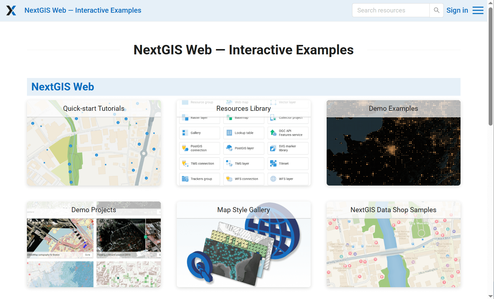

   Gallery

See how it works in our video:

.. raw:: html

   <iframe width="560" height="315" src="https://www.youtube.com/embed/O3T3eiHigp4?si=rSQ6zoGZTyYz4uNi" title="YouTube video player" frameborder="0" allow="accelerometer; autoplay; clipboard-write; encrypted-media; gyroscope; picture-in-picture; web-share" referrerpolicy="strict-origin-when-cross-origin" allowfullscreen></iframe>

Watch on `youtube <https://www.youtube.com/watch?v=O3T3eiHigp4>`_.

To create a gallery navigate to the resource group (folder) in which to add it.
Click **Create resource** button and select  **Gallery**. 

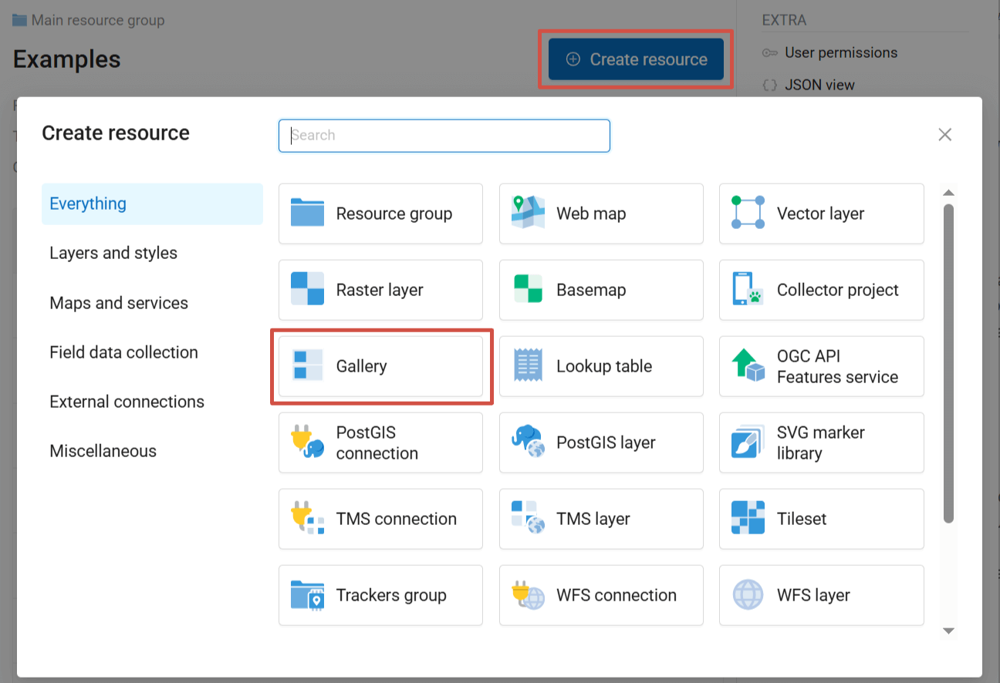

   Selecting "Gallery" resource type

On the first tab you can enter a custom **name** for your gallery. It will be displayed in the resource list.

On the second tab add the gallery items by clicking the + buttons. Available items:

* Resource;
* Link;
* Group - resources and links can be organized in groups within the gallery.

Drag to change the order of the items. To add an item to a group, drag it onto the group title.

After adding some items you can click **Create** and view the gallery.

You can customize the general look of the gallery and its items.

.. _items:

Gallery items
-----------------

After adding an item click on it to view the properties panel on the right. Each type of item has specific settings.

.. _resource:

Resource
~~~~~~~~~

* Title: displayed on the item card (does not have to be the same as the resource name);
* Resource: name of the resource and link to its page;
* Action: what happens when you click on the item in the gallery. Variable options – depend on resource type:

   * **Go to resource** - for all types;
   * **Update resource** - for all types;
   * **Display resource** - for Web Maps and resource galleries.

* Cover: image used as background on the item card instead of the standard resource type icon. Max 5.0 MiB. Recommended ratio: 3:2 for grid, 5:4 for list.
* Description displayed when hovering over the item or to the right of the cover in the list. Formatting is supported.

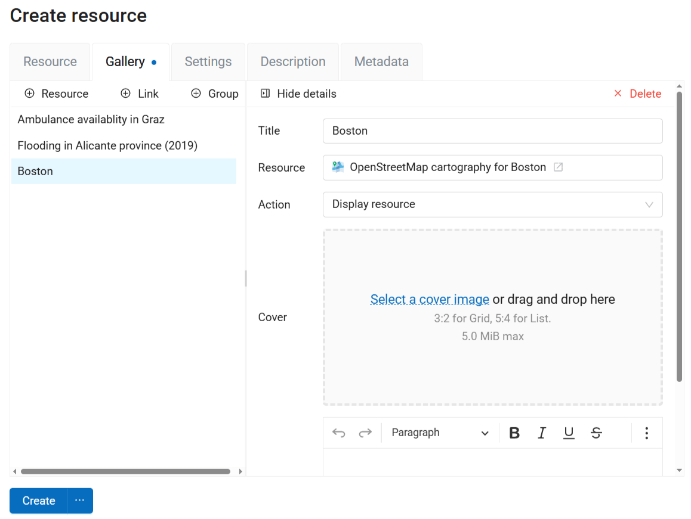

   Settings for Web Map in the gallery

.. _link:

Link
~~~~~~

* Title;
* Link: by default, the link to the Web GIS itself is used, but you can change it to any other URL;
* Cover;
* Description.

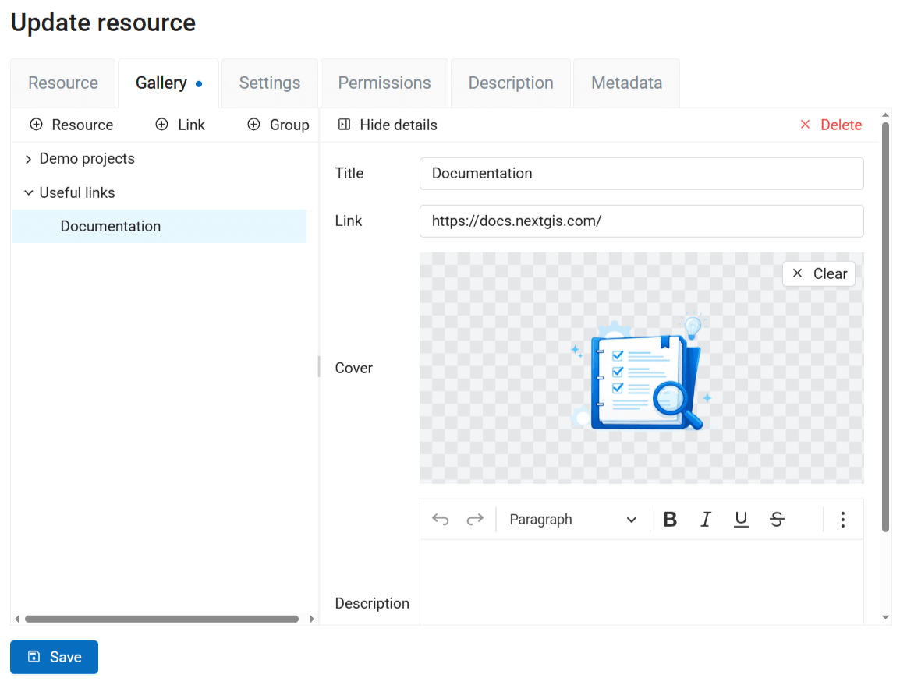

   Settings for link item in the gallery

.. _group:

Group
~~~~~~

* Title;
* Description;
* Layout:

   * Grid
   * List
   * Rows
   * Columns
   * Masonry

If you don't set a layout here, the default layout selected on the Settings tab is applied. Initially it's grid.

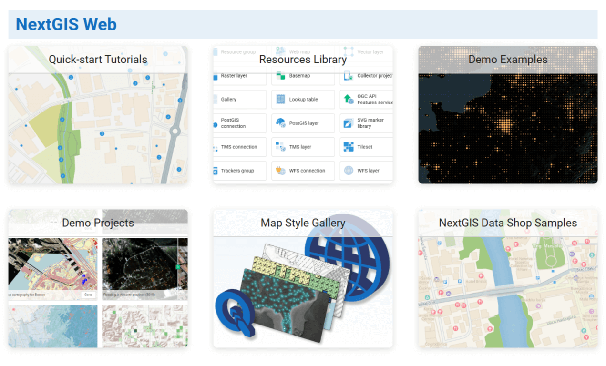

   Layout: grid

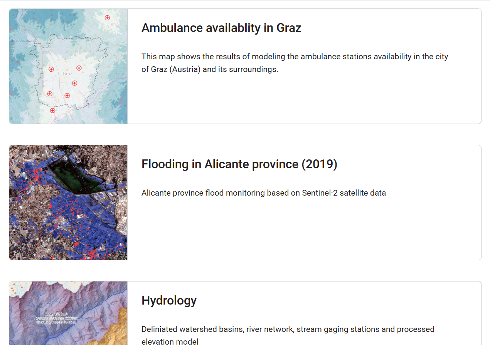

   Layout: list

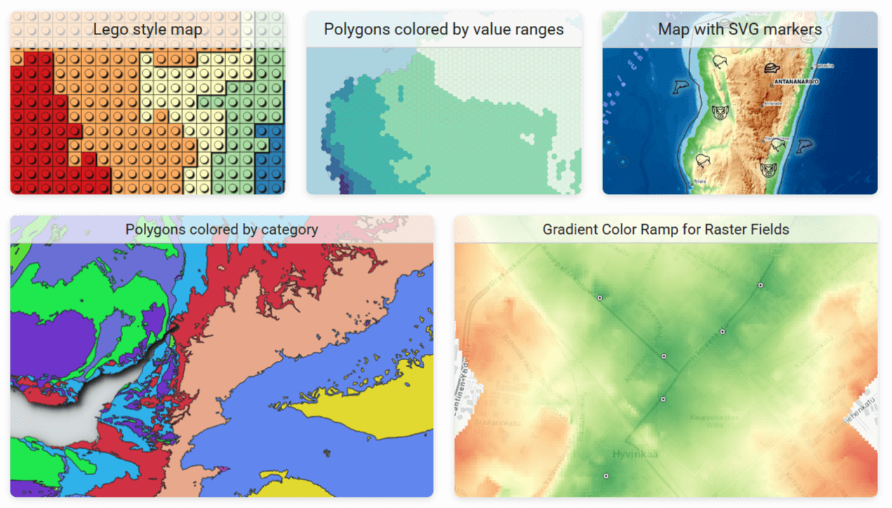

   Layout: rows

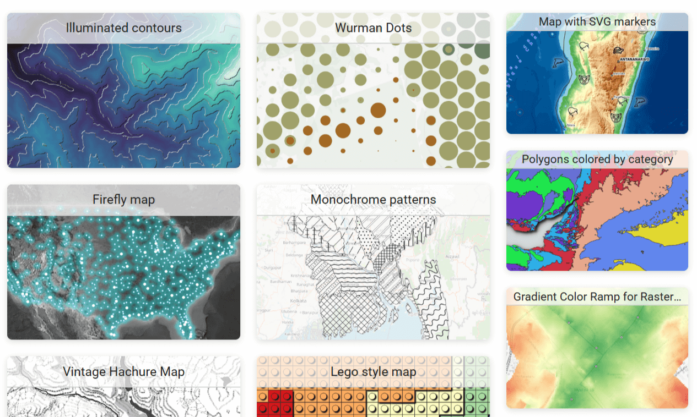

   Layout: columns

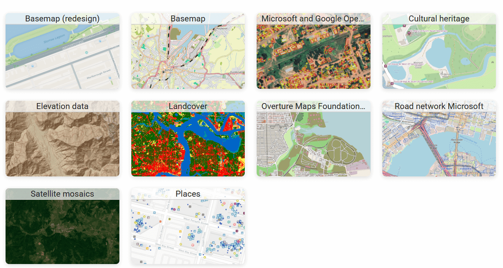

   Layout: masonry

.. _settings:

Gallery settings
-----------------

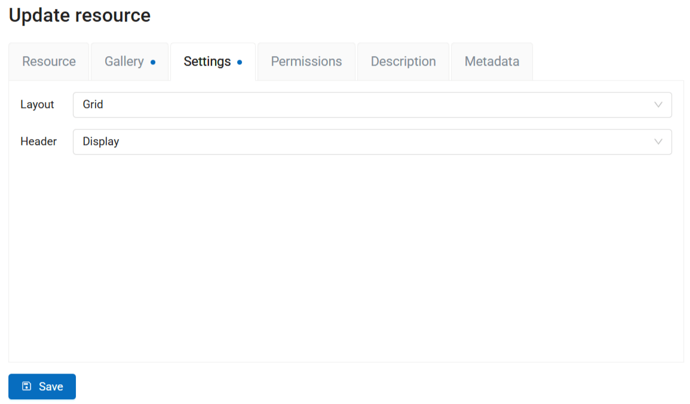

   Gallery settings

On the Settings tab you can set up:

* Default **layout**, it is applied to all the groups that do not have a different layout set on the Gallery tab;
* Display or hide Web GIS header.

You can also add description and metadata on the corresponding tabs. Gallery description is displayed both on the resource page and in the gallery itself, below its title.

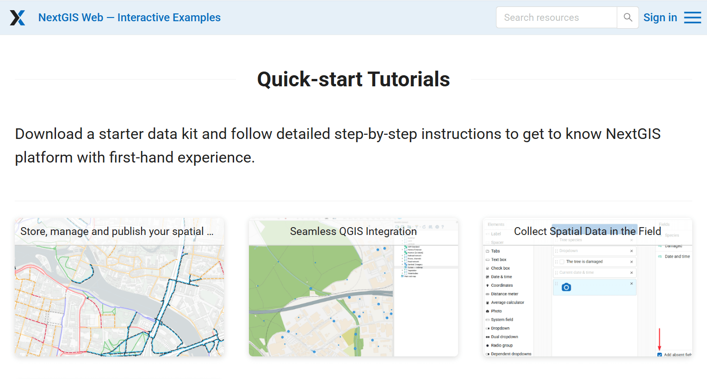

   Gallery description

Click **Create** to finish the process. After the gallery is successfully created you are redirected to its resource page. Click |button_open_gallery| **Open** to view the gallery.

You can select a gallery as the `homepage of your Web GIS <https://docs.nextgis.com/docs_ngweb/source/look.html#ngw-homepage>`_.

.. |button_open_gallery| image:: _static/button_open_gallery.png
   :width: 6mm
