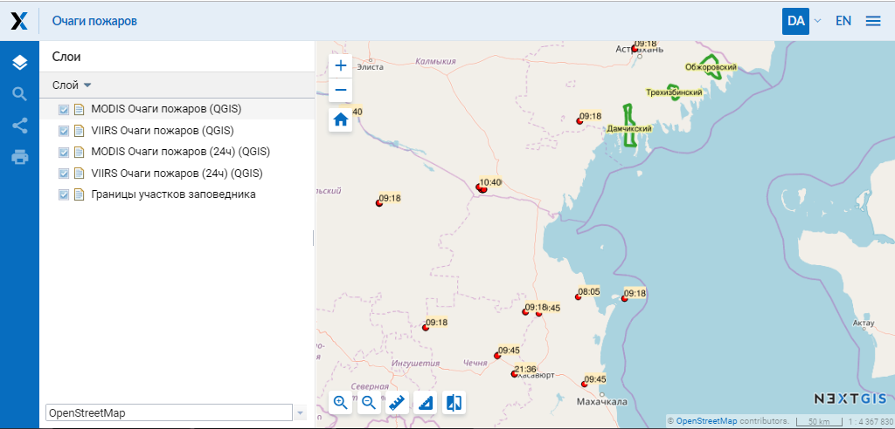

.. sectionauthor:: Артём Светлов <artem.svetlov@nextgis.ru>

.. _ngw_general:

Общие сведения
==============

Программное обеспечение NextGIS Web представляет собой картографическое
веб-приложение. Серверная Веб :abbr:`ГИС (геоинформационная система)` с открытым исходным кодом, предназначенная для
поддержки ввода, хранения, визуализации и предоставления регулируемого доступа к
результатам картографической или космической деятельности, интегрированных в единый
банк данных и метаданных.

Программное обеспечение NextGIS Web разработано на базе программного обеспечения
с открытым исходным кодом (:term:`Open Source`). Программное обеспечение NextGIS
Web поддерживает протоколы открытого обмена данными Open Geospatial Consorcium
(`OGC <http://www.opengeospatial.org/>`_) и отвечает современным требованиям к
архитектуре приложений реализуемой на базе свободного программного обеспечения
(СПО).

NextGIS Web позволяет:

1. Создавать и отображать карты.
2. Выполнять навигацию по карте (увеличение, уменьшение, перемещение).
3. Управлять наполнением карты через веб-интерфейс.
4. Подключать векторные (:term:`ESRI Shape`, :term:`GeoJSON`, :term:`PostGIS`) и растровые данные (:term:`GeoTIFF`).
5. Использовать стандартные протоколы (:term:`WMS`, :term:`WFS-T`).
6. Гибко настраивать права доступа к слоям, группам слоёв, картам.
7. Взаимодействовать посредством API.

NextGIS Web состоит из серверной и клиентской части.

Серверная часть занимается хранением и отрисовкой геоданных. Она написана на
языке программирования Python с использованием фреймворка Pyramid. Клиентская
часть предоставляет пользовательский интерфейс для интерактивного управления
:term:`геоданными <геоданные>` и взаимодействия с ними через карту.

Клиент разработан на языке JavaScript и построен на базе библиотеки Dojo. Вся
конфигурация системы хранится внутри базы данных PostgreSQL с модулем расширения
:term:`PostGIS`. Разметка страниц интерфейса пользователя проводится с
использованием языка разметки HTML, оформление страниц интерфейса пользователя
- с использованием таблиц описания стилей – CSS. Описание запросов к
базам данным выполнено на языке SQL.

NextGIS Web – модульная система, состоящая из ряда обязательных и вспомогательных
модулей. Вспомогательные модули могут быть включены или отключены на этапе
конфигурации. Компоненты NextGIS Web взаимодействуют между собой
посредством вызовов внутренних методов API.

NextGIS Web функционирует под управлением операционной системы семейства
Linux (рекомендуется использовать дистрибутивы на базе Debian, например Ubuntu
Server). Подробнее см. подраздел :ref:`ngw_soft_req`. NextGIS Web работает во всех современных браузерах.

Внешний вид пользовательского интерфейса с опубликованной веб-картой представлен
на :numref:`webmap_sample`.

   Пользовательский интерфейс с опубликованной веб-картой.

.. _ngw_keyfeatures:

Основные возможности NextGIS Web
--------------------------------

NextGIS Web обладает следующими основными возможностями:

Слои данных
~~~~~~~~~~~

* Создание растровых и векторных слоев и загрузка данных для них через веб-интерфейс.
* Создание и подключение :term:`WMS` слоев.
* Создание и подключение :term:`PostGIS` слоев из внешних баз данных.
* Выбор из базовых подложек: OpenStreetMap, Google, Bing и иных, доступных в каталоге `QuickMapServices <https://qms.nextgis.com/>`_.
* Сервис WFS.
* Сервис WMS.
* Справочник (при наличии модуля расширения).
* Набор файлов (при наличии модуля расширения).
* Поддержка метаданных (в виде "ключ-значение").
* Экспорт в форматы :term:`GeoJSON` и :term:`CSV`.

Управление доступом
~~~~~~~~~~~~~~~~~~~

* Детальная настройка прав доступа для всех подключаемых слоев.
* Настройка прав доступа для ресурсов и групп ресурсов.

Отрисовка и символика
~~~~~~~~~~~~~~~~~~~~~

* Импорт символики QGIS с автоматической конвертацией "под рендерер".
* Подключаемые рендереры: :term:`MapServer`, :term:`Mapnik`, :term:`QGIS` (импорт
  проекта из ПО NextGIS QGIS c сохранением состава слоев, стилей и др.).
* Несколько вариантов символики для одного слоя данных.

Веб-карты
~~~~~~~~~

* Неограниченное количество веб-карт.
* Свой набор слоев и управление деревом слоев для каждой карты.
* Повторное использование одного и того же представления слоя в разных картах.

Интерфейс пользователя
~~~~~~~~~~~~~~~~~~~~~~

* Дерево слоев.
* Группы слоев.
* Панель инструментов навигации.
* Поиск по атрибутам.
* Закладки для быстрого перехода на нужные участки карты.
* Просмотр описания слоя.
* Просмотр таблицы атрибутов объектов слоя с быстрым переходом от таблицы к карте.

Редактирование
~~~~~~~~~~~~~~

* Редактирование атрибутов объектов.
* Редактирование описания слоя.
* Прикрепление фотографий и других вложений.
* Редактирование по протоколу WFS-T.

.. _ngw_sys_req:

Рекомендуемые параметры системы
-------------------------------

Рекомендуемые параметры системы для эффективной работы :abbr:`ПО (программное
обеспечение)` NextGIS Web включают в себя сервер со следующими характеристиками:

* один или два процессора Intel Xeon E5 или AMD Opteron с тактовой частотой не
  менее 2 ГГц (8 ядер),
* оперативную память не менее 16 Gb DDR3 ECC Reg,
* соответствующая материнская плата для выбранных процессоров со встроенной
  видеосистемой и сетевым интерфейсом 10/100/1000BaseT,
* два накопителя на жестких магнитных дисках емкостью не менее 500 Gb в RAID1,
* сетевое подключение (интернет канал) 50 Мбит/с,
* оптический накопитель DVD-ROM,
* серверный корпус,
* манипулятор "мышь",
* клавиатура,
* источник бесперебойного питания емкостью не менее 1000 ВА,
* монитор LCD 17.

В качестве клиента может выступать стационарный компьютер.

Также можно использовать серверы на хостинге с аналогичными характеристиками по
процессору и оперативной памяти. Объем диска зависит от имеющихся геоданных.
Сама ОС с ПО NextGIS Web и базой данных занимает не более 10-15 Gb.

.. _ngw_soft_req:

Рекомендуемые версии базового ПО
---------------------------------

* Ubuntu Server 18.04 LTS
* PostgreSQL 9.5
* PostGIS 2.2
* Pyramid >= 1.5
* SQLAlchemy >= 0.8,<0.9
* GDAL 2.x

В качестве браузеров рекомендуется использовать:

* Internet Explorer 11.0 и выше
* Mozilla Firefox 45 и выше
* Google Chrome 45 и выше

.. warning::
   Работа с другими версиями основного ПО возможна, но не гарантирована.

Список изменений
----------------

Релиз от 2020-04-16
~~~~~~~~~~~~~~~~~~~
* Для разработчиков. Получение охвата отдельного объекта. Пример: https://demo.nextgis.com/api/resource/1735/feature/1/extent
* Для разработчиков. Запрос данных с сортировкой. Поддерживается обратная сортировка и сортировка по двум и более полям (если значения одинаковые в первом, то использовать второе и т.д). Например: https://demo.nextgis.com/api/resource/1731/feature/?limit=10&order_by=NAME,-LEISURE
* Общий административный интерфейс. Запрет на блокировку последнего (единственного) администратора в системе.

Релиз от 2020-03-03
~~~~~~~~~~~~~~~~~~~
* Сервисы. Исправление объявленной системы координат WMS для растровых слоёв входящих в сервис.
* Сервисы. Исправление конвертации RGBA растров в JPG при запросе WMS.

Релиз от 2020-02-12
~~~~~~~~~~~~~~~~~~~
* Базы данных. Хранение Z типов геометрий. PolygonZ и т.п.
* Для разработчиков. API может отдавать и принимать Z типы геометрий.

Релиз от 2019-11-18
~~~~~~~~~~~~~~~~~~~
* Базы данных. Поддержка полей типа numeric в слоях подключенных из внешней базы PostgreSQL/PostGIS
* Поиск. Улучшен адресный поиск (запросы в Nominatim)
* Для разработчиков. API Веб карты теперь предоставляет не только идентификаторы стилей, но и идентификаторы слоёв.

Релиз от 2019-11-06
~~~~~~~~~~~~~~~~~~~
* Печать. Увеличение рамкой при печати теперь более качественно вписывает выбранную область в выбранный формат листа

Релиз от 2019-10-17
~~~~~~~~~~~~~~~~~~~~

* Системы координат. Импортировать теперь можно и из ESRI WKT (отличается от OGC WKT)
* Системы координат. В названиях СК теперь поддерживается кириллица
* Системы координат. Идентификация на веб-картах больше не падает, если не удается получить координаты клика.

Релиз от 2019-08-12
~~~~~~~~~~~~~~~~~~~~

* Веб-карта. Добавлен поиск по целочисленным полям через встроенную таблицу объектов.
* Веб-карта. Улучшено приближение к точке через встроенную таблицу объектов.
* Веб-карта. При добавлении объекта в режиме редактирования встроенная таблица корректно обновляется с появлением новой записи.
* Сервисы. Исправлена объявленная система координат для WFS
* Сервер. Добавлены условия `in`, `notin` и `startswith` для фильтров векторных слоёв.
* Общее. Новая система сообщений об ошибках для пользователя.

Релиз от 2019-07-08
~~~~~~~~~~~~~~~~~~~

* Веб-карта. Редактирование: создание, удаление, изменение объектов на карте.

Релиз от 2019-07-01
~~~~~~~~~~~~~~~~~~~

* Общий административный интерфейс. Экспорт данных векторного слоя в форматы Mapinfo, DXF, ESRI Shape. 
* Общий административный интерфейс. Установка кодировки и архивирование при экспорте.
* Веб-карта. Исправление базовых карт (подложек) в системах координат отличных от 3857.

Релиз от 2019-06-27
~~~~~~~~~~~~~~~~~~~

* Общий административный интерфейс. Настройка формата вывода градусов при идентификации на веб-карте.

Релиз от 2019-06-17
~~~~~~~~~~~~~~~~~~~

* Общий административный интерфейс. Улучшение системы прав. Скрытие пунктов меню которые нельзя применить пользователю с текущими правами.

Релиз от 2019-05-27
~~~~~~~~~~~~~~~~~~~

* Общий административный интерфейс. Управление логотипом организации через панель управления.

Релиз от 2019-05-16
~~~~~~~~~~~~~~~~~~~

* Общий административный интерфейс. Улучшение системы прав. Скрытие папок ресурсов от пользователей не имеющих к ним доступа.

Релиз от 2019-04-05
~~~~~~~~~~~~~~~~~~~

* Общий административный интерфейс. Улучшение механизма добавления слоёв PostGIS из подключенной внешней базы. Автодополнение имен таблиц, схем и т.д.

Релиз от 2019-03-25
~~~~~~~~~~~~~~~~~~~

* Веб-карта. Закладки теперь автоматически сортируются по полю-атрибуту.

Релиз от 2019-01-15
~~~~~~~~~~~~~~~~~~~

* Сервер. Поиск ресурсов (API).
