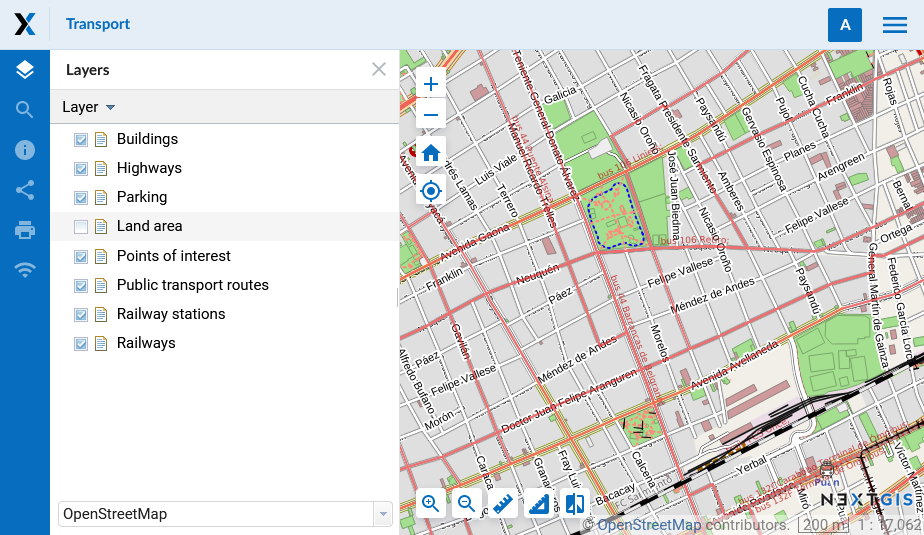

.. sectionauthor:: Artem Svetlov <artem.svetlov@nextgis.ru>

.. _ngw_general:

General Information
====================

NextGIS Web is a web mapping application designed to store, manage access and visualize geographic data.

NextGIS Web is :term:`open source` software. NextGIS Web supports Open Geospatial Consorcium 
(`OGC <http://www.opengeospatial.org/>`_) open data exchange protocols and meets the modern requirements for application architecture implemented on the basis of free software (:term:`Open Source`).

NextGIS Web allows:

1. Creation and display of maps.
2. Map navigation (zooming, shifting).
3. Manage the map through web-interface.
4. Vector (:term:`ESRI Shape`, :term:`PostGIS` etc) and raster data import.
5. Use of standart protocols (:term:`WMS`, :term:`WFS-T`, :term:`TMS`).
6. Manage access rights for layers, groups of layers, maps and other resources.
7. Interaction through API.

NextGIS Web has server and client sides. 

Server side stores and renders geodata. It's written in Python using Pyramid framework. Client side is a user interface for interactive :term:`geodata <geodata>` management as maps and separate resources.

Client is written in JavaScript. System's configuration is stored in a PostgreSQL database with a :term:`PostGIS` extension. Page markup for user interface is written using HTML. Style for user interface is added using cascading style sheets – CSS. Queries to databases use SQL language.

NextGIS Web is a modular system with several core modules and extensions. Extensions could be enabled or disabled at the  application configuration step. NextGIS Web components communicate with each other using internal API methods.

NextGIS Web is designed to operate in Linux operating system environment (Debian-based distributives are recommended, e.g. Ubuntu Server). Read more in section :ref:`ngw_soft_req`. NextGIS Web client-side works in all modern browsers.
User interface with a published Web Map is shown on :numref:`webmap_sample`.

   
   User interface with a published Web Map

.. _ngw_keyfeatures:

Key features of NextGIS Web
--------------------------------

NextGIS Web has the following key features:
    
Data layers 
~~~~~~~~~~~

* Creation of raster and vector layers and data upload for them using web interface. 
* Creation of :term:`WMS` and :term:`TMS` layers and connections to existing services. 
* Creation of :term:`PostGIS` layers and connection to layers in external databases. 
* A set of standard basemaps: OpenStreetMap and others from `QuickMapServices <https://qms.nextgis.com/>`_. 
* WFS service.
* WMS service.
* Dictionary (with extension). 
* File set.
* "Key-value" function, support for metadata.
* Export to various formats (see `full list here <https://docs.nextgis.com/docs_ngcom/source/data_export.html#how-to-export-data>`_).

Access management 
~~~~~~~~~~~~~~~~~~~

* Detailed settings of access rights for each connected layer.
* Setting of access rights for resources and resource groups.

Rendering and symbology 
~~~~~~~~~~~~~~~~~~~~~~~~

* Symbology import from QGIS with automated conversion "for renderer". 
* Pluggable renderers: :term:`MapServer`, :term:`QGIS` (import a project from desktop software 
  NextGIS QGIS with the same layers, styles etc.). 
* Several symbology options for the single data layer. 

Web Maps 
~~~~~~~~~
 
* Own set of layers and layer tree management for each map. 
* Reuse of the same layer representation in different maps. 

User interface 
~~~~~~~~~~~~~~~~~~~~~~

* Layer tree. 
* Layer groups. 
* Navigation tools panel. 
* Search by attributes. 
* Bookmarks for fast access to some regions of the map. 
* Layer description view. 
* Feature table view for layer with fast switch between a table and a map. 
* Annotations.

Editing 
~~~~~~~~~~~~~~

* Editing of feature attributes.
* Editing of layer description. 
* Adding of photos and other  attachments. 
* Editing features with WFS-T.

.. _ngw_sys_req:
    
Minimum hardware
----------------

Minimum hardware requirements for NextGIS Web software:

* 4 vCPU
* 8 GB of RAM
* 250 GB HDD (SSD would be much better)

.. _ngw_soft_req:
    
Recommended software versions
-----------------------------

* Ubuntu Server 20.04 LTS
* Python >= 3.8
* PostgreSQL >= 10
* PostGIS >= 2.5
* GDAL >= 3
* Node.js >= 14.x
* Yarn >= 1.x 

Recomended browsers are:

* Google Chrome (version 94 or newer)
* Mozilla Firefox (version 91 or newer)
* Edge (version 94 or newer)
* Safari (version 14 or newer)

Microsoft Internet Explorer browser is no suppoted.

.. warning::

NextGIS Web would probably work with other versions, but this is not garanteed.
