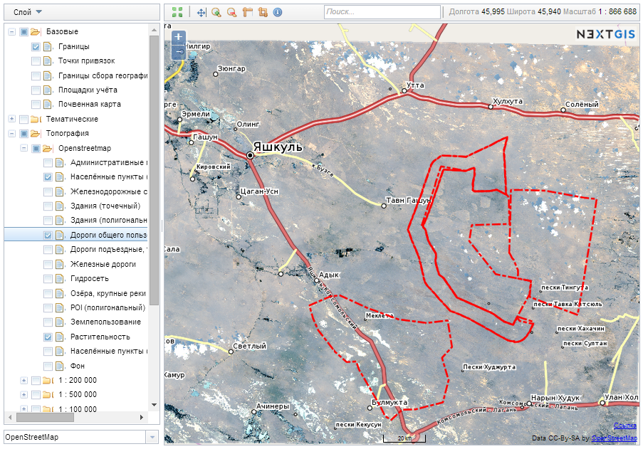

.. sectionauthor:: Артём Светлов <artem.svetlov@nextgis.ru>

.. _ngw_general:

Общие сведения
==============

Программное обеспечение NextGIS Web представляет собой картографическое 
веб-приложение. Серверная Веб ГИС с открытым исходным кодом, предназначенна для 
поддержки ввода, хранения, визуализации и предоставления регулируемого доступа к 
результатам картографической или космической деятельности, интегрированных в единый 
банк данных и метаданных. 

Программное обеспечение NextGIS Web разработано на базе программного обеспечения 
с открытым исходным кодом (:term:`Open Source`). Программное обеспечение NextGIS 
Web поддерживает протоколы открытого обмена данными Open Geospatial Consorcium 
(`OGC <http://www.opengeospatial.org/>`_) и отвечает современным требованиям к 
архитектуре приложений реализуемой на базе свободного программного обеспечения 
(СПО).

NextGIS Web работает во всех современных браузерах.
NextGIS Web позволяет:

1. Создавать и отображать карты.
2. Выполнять навигацию по карте (увеличение, уменьшение, перемещение).
3. Управлять наполнением карты через веб-интерфейс.
4. Подключать векторные (:term:`ESRI Shape`, :term:`PostGIS`) и растровые данные.
5. Использовать стандартные протоколы (:term:`WMS`, :term:`WFS-T`).
6. Гибко настраивать права доступа к слоям, группам слоёв, картам.
7. Взаимодействовать посредством API.

NextGIS Web состоит из серверной и клиентской части. 

Серверная часть занимается хранением и отрисовкой геоданных. Она написана на 
языке программирования Python с использованием фреймворка Pyramid. Клиентская 
часть предоставляет пользовательский интерфейс для интерактивного управления 
:term:`геоданными <геоданные>` и взаимодействия с ними через карту. 

Клиент написан на языке JavaScript и построен на базе библиотеки Dojo. Вся 
конфигурация системы хранится внутри базы данных PostgreSQL с модулем расширения 
PostGIS. Разметка страниц интерфейса пользователя проводится с 
использованием языка разметки HTML, оформление страниц интерфейса пользователя 
- с использованием таблиц описания стилей – CSS. Описание запросов к 
базам данным выполнено на языке SQL.

NextGIS Web – модульная система, состоящая из ряда обязательных и вспомогательных 
модулей. Вспомогательные модули могут быть включены или отключены на этапе 
конфигурации приложения. Компоненты NextGIS Web взаимодействуют между собой 
посредством вызовов внутренних методов API.

NextGIS Web должна функционировать под управлением операционной системы семейства 
Linux (рекомендуется использовать дистрибутивы на базе Debian, например Ubuntu 
Server). Подробнее см. подраздел :ref:`ngw_soft_req`. 

Внешний вид пользовательского интерфейса с опубликованной веб-картой представлен 
на :numref:`webmap_sample`.

   
   Пользовательский интерфейс с опубликованной веб-картой. 

.. _ngw_keyfeatures:

Основные возможности NextGIS Web 
--------------------------------

NextGIS Web обладает следующими основными возможностями:
    
Слои данных 
~~~~~~~~~~~

* Создание растровых и векторных слоев и загрузка данных для них через веб-интерфейс. 
* Создание и подключение :term:`WMS` слоев. 
* Создание и подключение :term:`PostGIS` слоев из внешних баз данных. 
* Выбор из базовых подложек: OpenStreetMap, Google, Bing и иных, доступных в каталоге `QuickMapServices <https://qms.nextgis.com/>`_ . 
* Сервис WFS.
* Сервис WMS.
* Справочник (при наличии модуля расширения). 
* Набор файлов.
* Поддержка метаданных (в виде "ключ-значение").
* Экспорт в форматы :term:`GeoJSON` и :term:`CSV`.

Управление доступом 
~~~~~~~~~~~~~~~~~~~

* Детальная настройка прав доступа для всех подключаемых слоев.
* Настройка прав доступа для ресурсов и групп ресурсов.

Отрисовка и символика 
~~~~~~~~~~~~~~~~~~~~~

* Импорт символики QGIS с автоматической конвертацией "под рендерер". 
* Подключаемые рендереры: :term:`MapServer`, :term:`Mapnik`, :term:`QGIS` (импорт 
  проекта из настольного ПО NextGIS QGIS c сохранением состава слоев, стилей и др.). 
* Несколько вариантов символики для одного слоя данных. 

Веб-карты 
~~~~~~~~~
 
* Неограниченное количество веб-карт. 
* Свой набор слоев и управление деревом слоев для каждой карты. 
* Повторное использование одного и того же представления слоя в разных картах. 

Интерфейс пользователя 
~~~~~~~~~~~~~~~~~~~~~~

* Дерево слоев. 
* Группы слоев. 
* Панель инструментов навигации. 
* Инструмент "шторка".
* Поиск по атрибутам. 
* Закладки для быстрого перехода на нужные участки карты. 
* Просмотр описания слоя. 
* Просмотр таблицы атрибутов объектов слоя с быстрым переходом от таблицы к карте. 

Редактирование 
~~~~~~~~~~~~~~

* Редактирование атрибутов объектов.
* Редактирование описания слоя. 
* Прикрепление фотографий и других вложений. 
* Редактирование по протоколу WFS-T.

.. _ngw_sys_req:
    
Рекомендуемые параметры системы
-------------------------------

Рекомендуемые параметры системы для эффективной работы :abbr:`ПО (программное 
обеспечение)` NextGIS Web включают в себя сервер со следующими характеристиками:

* один или два процессора Intel Xeon E5 или AMD Opteron с тактовой частотой не 
  менее 2 ГГц (8 ядер),
* оперативную память не менее 16 Gb DDR3 ECC Reg,
* соответствующая материнская плата для выбранных процессоров со встроенной 
  видеосистемой и сетевым интерфейсом 10/100/1000BaseT,
* два накопителя на жестких магнитных дисках емкостью не менее 500 Gb в RAID1,
* оптический накопитель DVD-ROM,
* серверный корпус,
* манипулятор "мышь",
* клавиатура,
* источник бесперебойного питания емкостью не менее 1000 ВА,
* монитор LCD 17.

В качестве клиента может выступать стационарный компьютер.

Также можно использовать серверы на хостинге с аналогичными характеристиками по 
процессору и оперативной памяти. Объем диска зависит от имеющихся геоданных. 
Сама ОС со всеми библиотеками и :abbr:`ПО (программное обеспечение)` NextGIS Web, 
базой данных занимает не более 10-15 Gb.

.. _ngw_soft_req:
    
Рекомендуемые версии базового ПО
---------------------------------

* Ubuntu Server 16.04 LTS
* PostgreSQL 9.5
* PostGIS 2.2
* Pyramid >= 1.5
* SQLAlchemy >= 0.8,<0.9
* GDAL 1.x

Работа с другими версиями основного ПО возможна, но не гарантирована.
