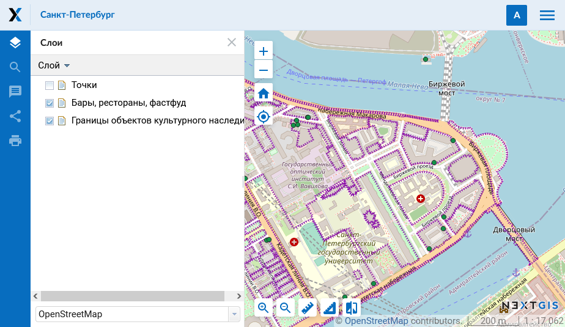

.. sectionauthor:: Артём Светлов <artem.svetlov@nextgis.ru>

.. _ngw_general:

Общие сведения
==============

Программное обеспечение NextGIS Web представляет собой картографическое
веб-приложение. Серверная Веб :abbr:`ГИС (геоинформационная система)` с открытым исходным кодом, предназначенная для
поддержки ввода, хранения, визуализации и предоставления регулируемого доступа к
результатам картографической или космической деятельности, интегрированных в единый
банк данных и метаданных.

Программное обеспечение NextGIS Web разработано на базе программного обеспечения
с открытым исходным кодом (:term:`Open Source`). Программное обеспечение NextGIS
Web поддерживает протоколы открытого обмена данными Open Geospatial Consorcium
(`OGC <http://www.opengeospatial.org/>`_) и отвечает современным требованиям к
архитектуре приложений реализуемой на базе свободного программного обеспечения
(СПО).

NextGIS Web позволяет:

1. Создавать и отображать карты.
2. Выполнять навигацию по карте (увеличение, уменьшение, перемещение).
3. Управлять наполнением карты через веб-интерфейс.
4. Подключать векторные (:term:`ESRI Shapefile`, :term:`GeoJSON`, :term:`PostGIS` и др. ) и растровые данные (:term:`GeoTIFF`).
5. Использовать стандартные протоколы (:term:`WMS`, :term:`WFS-T`, :term:`TMS`).
6. Гибко настраивать права доступа к слоям, группам слоёв, картам и ресурсам других видов.
7. Взаимодействовать посредством API.

NextGIS Web состоит из серверной и клиентской части.

Серверная часть занимается хранением и отрисовкой геоданных. Она написана на
языке программирования Python с использованием фреймворка Pyramid. Клиентская
часть предоставляет пользовательский интерфейс для интерактивного управления
:term:`геоданными <геоданные>` и взаимодействия с ними через карту.

Клиент разработан на языке JavaScript. Вся конфигурация системы хранится 
внутри базы данных PostgreSQL, так же используется модуль расширения
:term:`PostGIS`. Разметка страниц интерфейса пользователя проводится с
использованием языка разметки HTML, оформление страниц интерфейса пользователя
- с использованием таблиц описания стилей – CSS. Описание запросов к
базам данным выполнено на языке SQL.

NextGIS Web – модульная система, состоящая из ряда обязательных и вспомогательных
модулей. Вспомогательные модули могут быть включены или отключены на этапе
конфигурации. Компоненты NextGIS Web взаимодействуют между собой
посредством вызовов внутренних методов API.

NextGIS Web функционирует под управлением операционной системы семейства
Linux (рекомендуется использовать дистрибутивы на базе Debian, например Ubuntu
Server). Подробнее см. подраздел :ref:`ngw_soft_req`. NextGIS Web работает во всех современных браузерах.

Внешний вид пользовательского интерфейса с опубликованной веб-картой представлен
на :numref:`webmap_sample`.

   Пользовательский интерфейс с опубликованной веб-картой

.. _ngw_keyfeatures:

Основные возможности NextGIS Web
--------------------------------

NextGIS Web обладает следующими основными возможностями:

Слои данных
~~~~~~~~~~~

* Создание растровых и векторных слоев и загрузка данных для них через веб-интерфейс.
* Создание и подключение :term:`WMS` и :term:`TMS` слоев.
* Создание и подключение :term:`PostGIS` слоев из внешних баз данных.
* Выбор из базовых подложек: OpenStreetMap, Google, Bing и иных, доступных в каталоге `QuickMapServices <https://qms.nextgis.com/>`_.
* Сервис WFS.
* Сервис WMS.
* Справочник (при наличии модуля расширения).
* Набор файлов (при наличии модуля расширения).
* Поддержка метаданных (в виде "ключ-значение").
* Экспорт в различные форматы (см. `список доступных форматов <https://docs.nextgis.ru/docs_ngcom/source/data_export.html#ngcom-data-export>`_).

Управление доступом
~~~~~~~~~~~~~~~~~~~

* Детальная настройка прав доступа для всех подключаемых слоев.
* Настройка прав доступа для ресурсов и групп ресурсов.

Отрисовка и символика
~~~~~~~~~~~~~~~~~~~~~

* Импорт символики QGIS с автоматической конвертацией "под рендерер".
* Подключаемые рендереры: :term:`MapServer`, :term:`QGIS` (импорт
  проекта из ПО NextGIS QGIS c сохранением состава слоев, стилей и др.).
* Несколько вариантов символики для одного слоя данных.

Веб-карты
~~~~~~~~~

* Неограниченное количество веб-карт.
* Свой набор слоев и управление деревом слоев для каждой карты.
* Повторное использование одного и того же представления слоя в разных картах.

Интерфейс пользователя
~~~~~~~~~~~~~~~~~~~~~~

* Дерево слоев.
* Группы слоев.
* Панель инструментов навигации.
* Поиск по атрибутам.
* Закладки для быстрого перехода на нужные участки карты.
* Просмотр описания слоя.
* Просмотр таблицы атрибутов объектов слоя с быстрым переходом от таблицы к карте.
* Аннотации.

Редактирование
~~~~~~~~~~~~~~

* Редактирование атрибутов объектов.
* Редактирование описания слоя.
* Прикрепление фотографий и других вложений.
* Редактирование по протоколу WFS-T.

.. _ngw_sys_req:

Минимальное аппаратное обеспечение
------------------------------------

Минимальные параметры системы для работы :abbr:`ПО (программное
обеспечение)` NextGIS Web:

* 4 процессорных ядра,
* оперативная память не менее 8 Gb,
* 250 Gb HDD (лучше SSD).

.. _ngw_soft_req:

Рекомендуемые версии базового ПО
---------------------------------

* Ubuntu Server 20.04 LTS
* Python >= 3.8
* PostgreSQL >= 10
* PostGIS >= 2.5
* GDAL >= 3
* Node.js >= 14.x
* Yarn >= 1.x 

В качестве браузеров рекомендуется использовать:

* Google Chrome (версия 94 и выше)
* Mozilla Firefox (версия 91 и выше)
* Edge (версия 94 и выше)
* Safari (версия 14 и выше)

Браузер Microsoft Internet Explorer не поддерживается.

.. warning::
   Работа с другими версиями основного ПО возможна, но не гарантирована.
