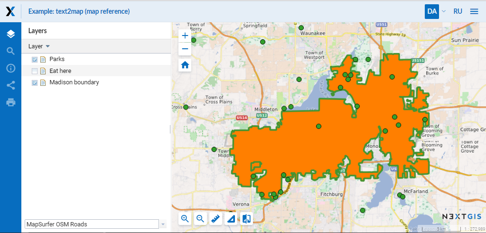

.. sectionauthor:: Artem Svetlov <artem.svetlov@nextgis.ru>

.. _ngw_general:

General Information
====================

NextGIS Web software is a web mapping application designed to support input, 
storage and regulated access to the results of the mapping and space activities,
integrated into a single bank of data and metadata 

NextGIS Web developed based on :term:`open source` software. NextGIS Web software supports Open Geospatial Consorcium 
(`OGC <http://www.opengeospatial.org/>`_) open data exchange protocols and meets the modern requirements for application architecture implemented on the basis of free software (:term:`Open Source`).

NextGIS Web allows:

1. Creation and display of maps.
2. Navigation on the map (zooming, shifting).
3. Control a filling of the map through web-interface.
4. Adding of vector (:term:`ESRI Shape`, :term:`PostGIS`) and raster data.
5. Using of standart protocols (:term:`WMS`, :term:`WFS-T`).
6. Detailed settings of access rights for layers, groups of layers, maps.
7. Interaction through API.

NextGIS Web has server and client sides. 

Server side store and render geodata. It's written on Python with a use of Pyramid framework. Client side is a user interface for interactive :term:`geodata <geodata>` management and interaction with geodata on a map. 

Client is written on JavaScript and based on a Dojo framework. All configuration is stored in a PostgreSQL database with a :term:`PostGIS` extension. Page markup for user interface is written using HTML. Style for user interface is added using cascading style sheets – CSS. Queries to databases use SQL language.

NextGIS Web is a modular system with several core modules and extensions. Extensions could be enabled or disabled on the step of application configuration. NextGIS Web components communicate with each other using internal API methods.

NextGIS WEB is designed to operate in Linux operating system environment (Debian-based distributives are recommended, e.g. Ubuntu Server). Read more in section :ref:`ngw_soft_req`. NextGIS Web works in all modern browsers.
User interface with a published web map is on the :numref:`webmap_sample`.

   
   User interface with a published web map. 

.. _ngw_keyfeatures:

Key features of NextGIS Web
--------------------------------

NextGIS Web has the following key features:
    
Data layers 
~~~~~~~~~~~

* Creation of raster and vector layers and data upload for them using web interface. 
* Creation of :term:`WMS` layers and connection to existing services. 
* Creation of :term:`PostGIS` layers and connection to layers in external databases. 
* A set of standard basemaps: OpenStreetMap, Google, Bing and others from `QuickMapServices <https://qms.nextgis.com/>`_. 
* WFS service.
* WMS service.
* Dictionary (with extension). 
* File set.
* "Key-value" function, support for metadata.
* Export to :term:`GeoJSON` and CSV.

Access management 
~~~~~~~~~~~~~~~~~~~

* Detailed settings of access rights for each connected layer.
* Setting of access rights for resources and resourse groups.

Rendering and symbology 
~~~~~~~~~~~~~~~~~~~~~~~~

* Symbology import from QGIS with automated conversion "for renderer". 
* Pluggable renderers: :term:`MapServer`, :term:`Mapnik`, :term:`QGIS` (import a project from desktop software 
  NextGIS QGIS with the same layers, styles etc.). 
* Several symbology options for the single data layer. 

Web maps 
~~~~~~~~~
 
* Unlimited number of web maps. 
* Own set of layers and layer tree management for each map. 
* Reuse of the same layer representation in different maps. 

User interface 
~~~~~~~~~~~~~~~~~~~~~~

* Layer tree. 
* Layer groups. 
* Navigation tools panel. 
* Search by attributes. 
* Bookmarks for fast access to some regions of the map. 
* Layer description view. 
* Feature table view for layer with fast switch between a table and a map. 

Editing 
~~~~~~~~~~~~~~

* Editing of feature attributes.
* Editing of layer description. 
* Adding of photos and other  attachments. 
* Editing features with WFS-T.

.. _ngw_sys_req:
    
Recommended hardware
-------------------------------

Recommended hardware for effective work with NextGIS Web software includes a server with the following characteristics:

* one or two processor  Intel Xeon E5 or AMD Opteron with frequency not  
  less than 2 GHz (8 cores)
* not less than 16 Gb of DDR3 ECC Reg RAM
* appropriate motherboard for selected processors with integrated 
  videocard and a network interface 10/100/1000BaseT
* two hard disk drives (HDD) with a capacity from 500 Gb in RAID1
* DVD-ROM
* server case
* mouse
* keyboard
* uninterruptible power supply with a capacity of not less than 1000 VA
* LCD monitor 17

Client device could be a desktop (with 11-27" monitor).

Also it is possible to use hosted servers with the same characteristics of proccessor and RAM. Hard disk drive capacity depends on the volume of geodata. 
Operation system with NextGIS Web software and a database requires not more than 20-30 Gb of hard disk drive space.

.. _ngw_soft_req:
    
Recommended software versions
-----------------------------

* Ubuntu Server 18.04 LTS
* PostgreSQL 9.5
* PostGIS 2.2
* Pyramid >= 1.5
* SQLAlchemy >= 0.8,<0.9
* GDAL 2.x

Recomended browsers are:

* Internet Explorer 11.0 or a newer version
* Mozilla Firefox 45 or a newer version
* Google Chrome 45 or a newer version

.. warning::

NextGIS Web would probably work with other versions, but this is not garanteed.

Latest changes
----------------

2020-02-12 release
~~~~~~~~~~~~~~~~~~~
* Storage. Support for storing Z-type geometries, PolygonZ etc.
* For developers. API can accept and provide Z-type geometries.

2019-08-12 release
~~~~~~~~~~~~~~~~~~

* Web map. Search for integer values in added to the embedded feature table.
* Web map. Improved zooming on a point from the embedded feature table.
* Web map. While editing the embedded feature table is correctly updated to show newly added features.

2019-00-00 release
~~~~~~~~~~~~~~~~~~
