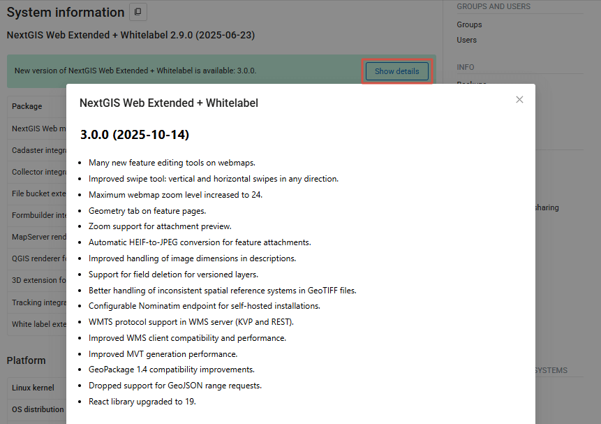
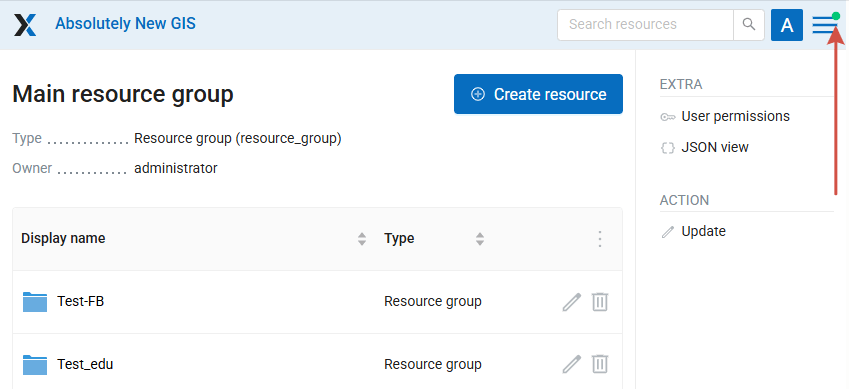
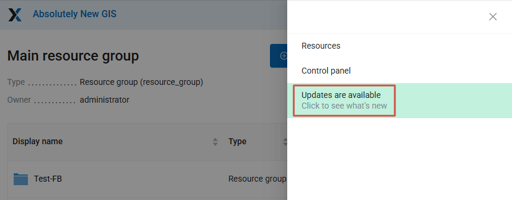

Web GIS information
====================

.. _ngw_system_info:

System information
------------------

Through the control panel, the administrator can view information about the system and the current version of the platform (see :numref:`admin_system_info_rus_eng`). Using the icon in the upper right corner, you can copy all this data to the clipboard.

.. figure:: _static/admin_system_info_eng_2.png
   :name: admin_system_info_rus_eng
   :align: center
   :width: 16cm

   System information section in the control panel

.. figure:: _static/admin_system_info1_rus_eng.png
   :name: admin_system_info1_rus_eng
   :align: center
   :width: 22cm

   System and platform information

For NextGIS Web on-premise you can also see if there are `updates available <https://docs.nextgis.com//docs_ngweb/source/infowebgis.html#onpremise-updates>`_.

.. _ngw_plan_features:

Plan and features
--------------

.. note::
   This functionality is only available for cloud-based Web GIS.

To access the section, select it in the |button_main_menu| Main menu

.. |button_main_menu| image:: _static/button_main_menu.png
   :width: 6mm

On this page you can check the current subscription plan of the Web GIS owner and go to your `account <https://docs.nextgis.com/docs_ngcom/source/subscription.html>`_ to upgrade it.

Below that is a list of platform features and limits available on the `current subscription plan <https://nextgis.com/pricing-base/>`_.

* Number of maps and layers that can be created on the current plan (for Premium there's no limit);
* Storage limit	- used and overall available storage in GiB;
* User limit	- number of users added to the Web GIS and max number available (the limit `can be increased <https://nextgis.com/pricing-base/#users>`_);
* Use on other websites (CORS)	- yes/no;
* GPS trackers	- number of added trackers and max number available;
* Access management	- is this functionality available: yes/no;
* Custom SRS - can you add more SRS to the Web GIS: yes/no;	
* Custom domain and branding	- is `customizing the look <https://docs.nextgis.com/docs_ngweb/source/look.html#ngweb-css-logo>`_ of the Web GIS available: yes/no;
* Tile caching	- is this functionality available: yes/no;
* Improved performance	- is this functionality available: yes/no;
* Maximum file upload - max file size in MiB;
* Maximum raster layer size in MiB;
* Technical support	- is this functionality available: yes/no;
* `On-demand backup restore <https://docs.nextgis.com/docs_ngweb/source/infowebgis.html#backup-policy>`_	- is this functionality available: yes/no.

If the subscription is cancelled, then after it expires the Web GIS may be blocked. On this page you can check if your Web GIS fits the limits of the Free plan and make changes to prevent it from being blocked.

.. _ngw_storage:

Storage
--------

.. note:: This functionality is only available for cloud Web GIS

The "Storage" section contains information about the volume of data loaded into Web GIS depending on their type.
The space usage estimate is located below the main table.
The administrator can forcibly recalculate the amount of storage (for example - immediately after loading big data, if the system has not yet recalculated the occupied space on its own).

.. figure:: _static/admin_storage_panel_settings_eng.png
   :name: admin_storage_panel_settings
   :align: center
   :width: 24cm

   Storage section

.. _onpremise_updates:

Available updates
-----------------

.. note:: This functionality is available only for `on-premise <https://nextgis.com/pricing/>`_ Web GIS.

For NextGIS Web on-premise on the System information page you can check for available updates. If an update is available, you'll see a message at the top of the page.

Click on "Show details" to view the list of changes.

   Details of the available update

If an update is available, you'll also get a notification a short while after opening your Web GIS.

A green dot on the main menu icon indicates that there's a notification.

   Notification marker

After opening the menu you'll see the mesage: "Updates are available". Click on it to go to the System information page and check the details. 

   Notification message in the main menu

To install the update, contact the system administrator.

.. _ngw_backup_policy:

Backup policy
--------------

Data backups are performed for every Web GIS (any plan). The frequency depends on total data volume and Web GIS use activity (once or several times per month).

.. note:: Restoring data from backups is available for `Premium <https://nextgis.com/pricing-base/>`_ users only.

For other plans Web GIS backups are made to mitigate possible infrastructure risks not related to user actions.

If you are on Premium and need a restore - send us a request to support@nextgis.com. We'll let you know which dates are available. Additionally, you can see the last backup date 
under System information section of your Web GIS' Control panel (subsection Platform - Last backup).

.. _ngw_backups:

Backups
-------

In this section you can see a list of available NextGIS Web backups, as well as download any of them.
The process of creating backups and restoring for developers is described in `this section <https://docs.nextgis.ru/docs_ngweb_dev/doc/admin/backup_restore.html>`_.

.. note:: This functionality is available only for `on-premise <https://nextgis.com/pricing/>`_ Web GIS.

.. _ngw_audit:

User activity log
------------------

.. note:: This functionality is available only for `on-premise Web GIS Extended Edition <https://nextgis.com/pricing/?utm_source=nextgis&utm_medium=products&utm_campaign=nextgis-web&utm_content=en#ngwextended>`_.

User requests to the Web GIS are logged in a journal. It can be found in the **Info** section of the Control panel of the Web GIS (:numref:`control_panel_audit_pic`).

.. figure:: _static/control_panel_audit_en.png
   :name: control_panel_audit_pic
   :align: center
   :width: 9cm
   
   Request journal in the Web GIS Control panel

The log is presented in a form of a table that has a set of filters above it (:numref:`user_activity_log_pic`). Every user action is registered in the journal. The entry contains the following details:

* Timestamp
* Request (includes `response status codes <https://developer.mozilla.org/en-US/docs/Web/HTTP/Status>`_ and `request method <https://developer.mozilla.org/en-US/docs/Web/HTTP/Methods>`_ )
* IP address
* User
* Route name
* Context (type and ID of the resource)

  
.. figure:: _static/user_activity_log_en.png
   :name: user_activity_log_pic
   :align: center
   :width: 24cm
   
   Activity journal

You can filter the journal entries by time period and user performing the action (:numref:`audit_filter_pic`). The table, filtered or otherwise, can be exported as a CSV file.

.. figure:: _static/audit_filter_en.png
   :name: audit_filter_pic
   :align: center
   :width: 20cm
   
   Filtering by timestamp and user

To view the complete text of the request click on the corresponding entry (:numref:`audit_log_entry_pic`).

.. figure:: _static/audit_log_entry_en.png
   :name: audit_log_entry_pic
   :align: center
   :width: 20cm
   
   Log entry

