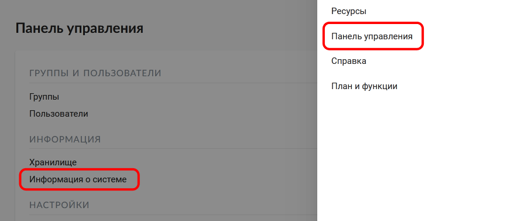
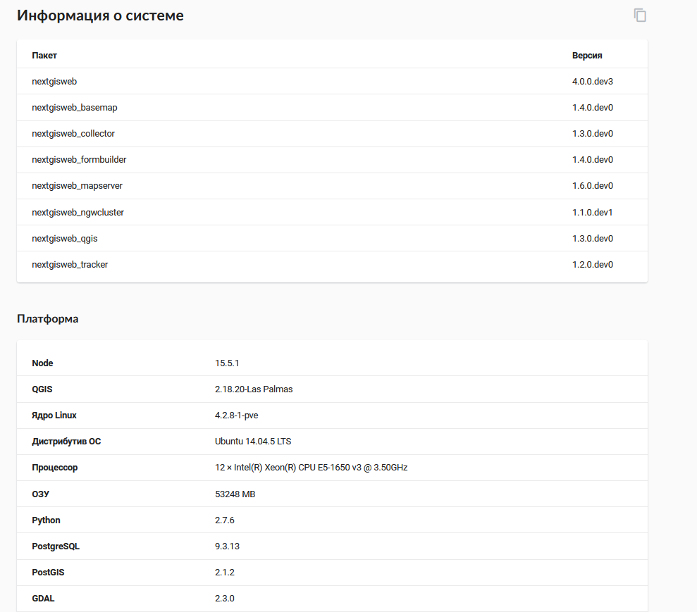
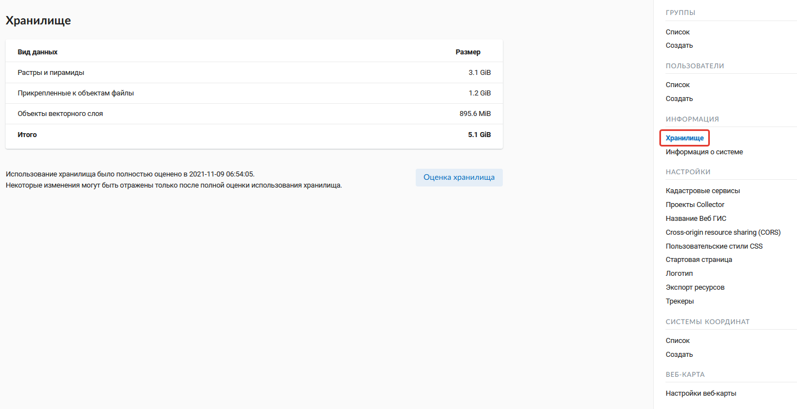
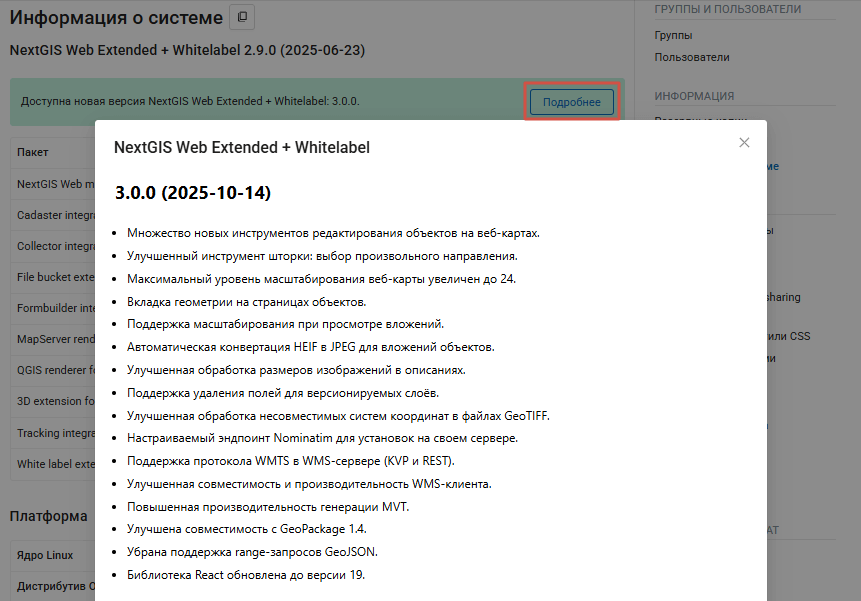
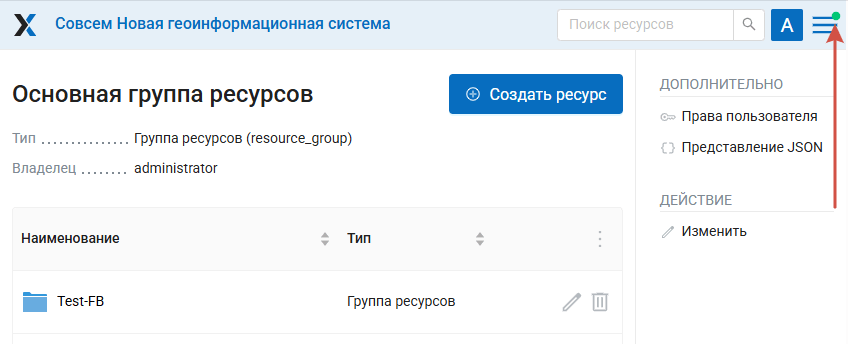
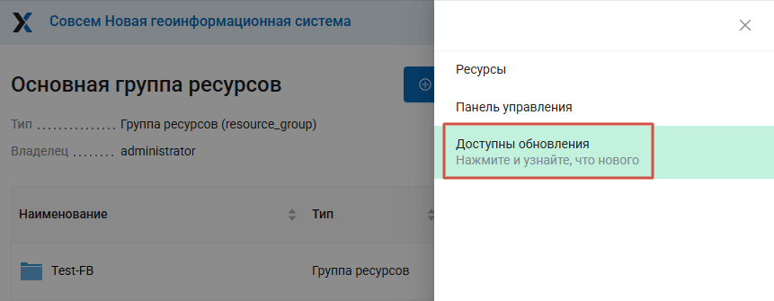
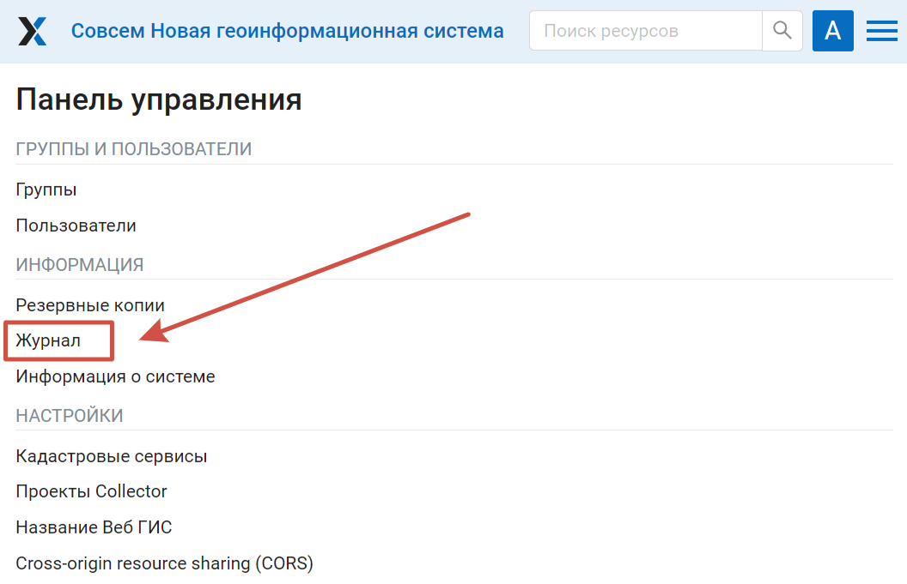
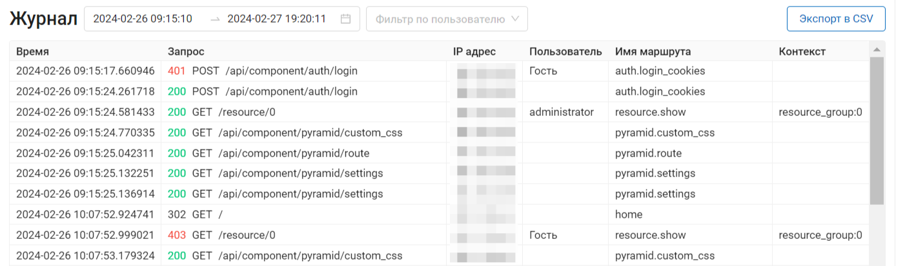
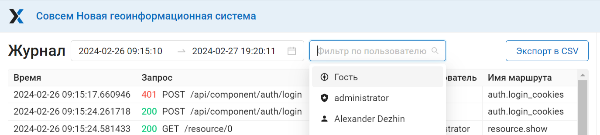
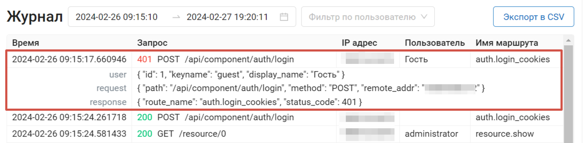

Информация о Веб ГИС
==================

.. _ngw_system_info:

Информация о системе
----------------------

Через панель управления администратор может посмотреть информацию о системе и текущей версии платформы (:numref:`admin_system_info_pic`)
Через иконку в правом верхнем углу есть возможность скопировать все эти данные в буфер обмена.

   Раздел информации о системе в панели управления
   
  

   Информация о системе и платформе

Для Веб ГИС, развёрнутых на своём сервере, также показывается `информация о доступных обновлениях <https://docs.nextgis.ru/docs_ngweb/source/infowebgis.html#onpremise-updates>`_.

.. _ngw_plan_functions:

План и функции
--------------

.. note::
   Функционал доступен только для облачных Веб ГИС.

Этот раздел доступен в |button_main_menu| Главном меню.

.. |button_main_menu| image:: _static/button_main_menu.png
   :width: 6mm

На этой странице можно посмотреть текущий план подписки владельца Веб ГИС и перейти `в личный кабинет <https://docs.nextgis.ru/docs_ngcom/source/subscription.html>`_ для его изменения.

Также отображается доступные `на текущем плане <https://nextgis.ru/pricing-base/>`_ функции и квоты:

* Количество карт и слоев, которые можно создать на текущем плане (для плана Premium - не ограничено);
* Объем хранилища	- место, занимаемое хранилищем, и общий доступный объем в GiB;
* Пользователи	- количество добавленных активированных пользователей Веб ГИС и общее доступное количество (его можно `увеличить <https://nextgis.ru/pricing-base/#users>`_);
* Использование на других сайтах (CORS)	- да/нет;
* GPS/ГЛОНАСС трекеры	- количество добавленных и доступных трекеров;
* Настройка прав доступа	- доступна ли функция: да/нет;
* Пользовательские системы координат - доступно ли добавление пользовательских СК: да/нет;	
* Домен и оформление вашей организации	- доступно ли `изменение внешнего вида Веб ГИС <https://docs.nextgis.ru/docs_ngweb/source/look.html#ngweb-css-logo>`_: да/нет;
* Кэширование тайлов	- доступна ли функция: да/нет;
* Улучшенная производительность	- доступна ли функция: да/нет;
* Макс. размер загружаемого файла в MiB;
* Макс. размер растрового слоя в MiB;
* Техническая поддержка	- доступна ли: да/нет;
* Восстановление бэкапов по запросу	- доступно ли: да/нет.

После окончания срока действия подписки Веб ГИС может быть заблокирована, если она не соответствует параметрам плана Free. На этой странице вы можете проверить, нужно ли удалить ресурсы или пользователей, чтобы избежать блокировки.

.. _ngw_storage:

Хранилище
----------

.. note::
   Этот функционал доступен только для облачных Веб ГИС.

Раздел "Хранилище" содержит информацию об объёме загруженных в Веб ГИС данных в зависимости от их типа.
Оценка занимаемого пространства происходит с различной периодичностью, которая указывается под общей таблицей.
Администратор может принудительно пересчитать объем хранилища (например - сразу после загрузки больших данных, если система пока не пересчитала занимаемый объем самостоятельно).

   Раздел "Хранилище"

.. _onpremise_updates:

Доступные обновления
--------------------

На странице "Информация о системе" NextGIS Web, развёрнутой на своём сервере,  можно проверить наличие обновлений. Если обновление доступно, сообщение об этом будет отображаться в верхней части страницы.

Нажмите на "Подробнее", чтобы увидеть список изменений.

   Информация о доступном обновлении

Уведомление о доступном обновлении также появится в интерфейсе через некоторое время после открытия Веб ГИС.

На значке главного меню в правом верхнем углу появится зелёная точка, указывающая на новое уведомление.

   Маркер наличия уведомления

При открытии меню вы увидите сообщение: "Доступны обновления". Нажмите на него, чтобы узнать перейти в раздел "Информация о системе" и посмотреть подробности доступного обновления. 

   Сообщение о доступном обновлении в главном меню

Для установки обновления обратитесь к администратору системы.

.. _ngw_backups_policy:

Политика резервного копирования
---------------------------------

Резервные копии данных (бэкапы) выполняются для облачных Веб ГИС любых тарифных планов с определенной периодичностью. 
Периодичность зависит от объемов данных и активности использования Веб ГИС (от 1 до нескольких раз в месяц). 

.. note:: Предоставление (восстановление) данных из резервных копий доступно только на тарифном плане `Premium <https://nextgis.ru/pricing-base/>`_ по запросу. 

На остальных планах назначение бэкапов - дополнительная защита пользовательских данных после критических ситуаций, 
не связанных с действиями пользователей Веб ГИС.

Если вы на Premium и вам необходимо восстановление из резервной копии, напишите нам на support@nextgis.com. 
Мы сообщим перечень дат, на которые есть резервные копии, и произведем восстановление. Так же, информацию о дате
последней резервной копии доступна администраторам в разделе Информация о системе вашей Веб ГИС (подраздел 
Платформа - Последняя резервная копия).

.. _ngw_backups:

Резервные копии
----------------------

.. note::
   Этот раздел доступен только для Веб ГИС, развёрнутых `на своём сервере <https://nextgis.ru/pricing/?utm_source=nextgis&utm_medium=products&utm_campaign=nextgis-web&utm_content=ru#ngw>`_.

В данном разделе можно посмотреть список имеющихся резервных копий NextGIS Web, а также скачать любую из них.
Процесс создания бэкапов и восстановления для разработчиков описан `здесь <https://docs.nextgis.ru/docs_ngweb_dev/doc/admin/backup_restore.html>`_. 

.. _ngw_audit:

Регистрация операций пользователей (Аудит)
---------------------------------------------

.. note::
   Этот функционал доступен только для Веб ГИС, развёрнутых `на своём сервере в редакции Extended <https://nextgis.ru/pricing/?utm_source=nextgis&utm_medium=products&utm_campaign=nextgis-web&utm_content=ru#ngwextended>`_.

История пользовательских запросов к Веб-ГИС регистрируется в журнале. Он располагается в разделе **Информация** Панели управления Веб-ГИС (:numref:`control_panel_audit_pic`).

   
   Расположение журнала в панели управления Веб-ГИС

Журнал состоит из верхней панели фильтров и таблицы истории запросов пользователей (:numref:`user_activity_log_pic`). Каждое действие пользователя регистрируется в таблице журнала и содержит следующие параметры:

* Время
* Запрос (включает в себя `код состояния <https://developer.mozilla.org/ru/docs/Web/HTTP/Status>`_ и `метод <https://developer.mozilla.org/ru/docs/Web/HTTP/Methods>`_ запроса)
* IP адрес
* Пользователь
* Имя маршрута
* Контекст (тип и ID ресурса)

  

   
   Журнал пользовательских операций

Существует возможность отфильтровать записи в журнале по временному интервалу и пользователю, который совершал действия (:numref:`audit_filter_pic`). Таблица может быть экспортирована в формате .*CSV с учетом применения фильтров.

   
   Фильтрация по дате и пользователям

По клику на запись журнала можно посмотреть текст самого запроса (:numref:`audit_log_entry_pic`).

   
   Запись в журнале операций
