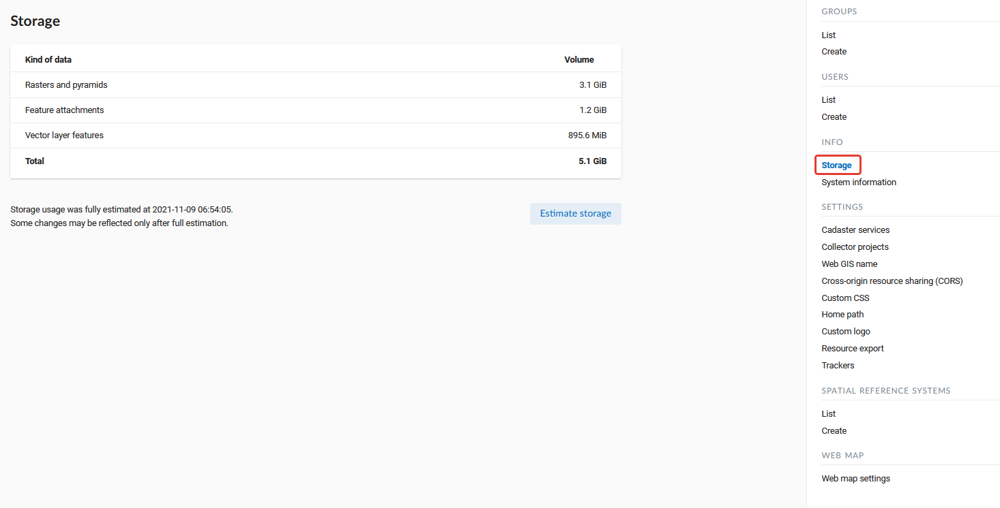
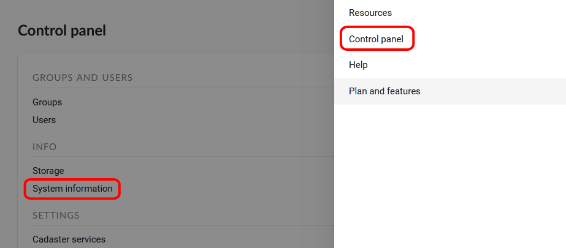
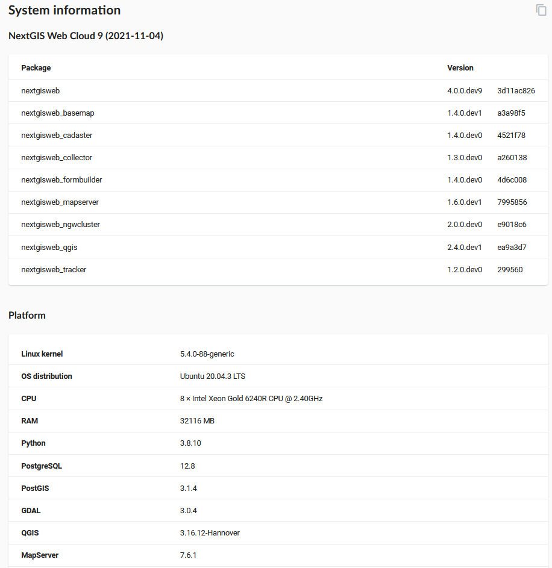
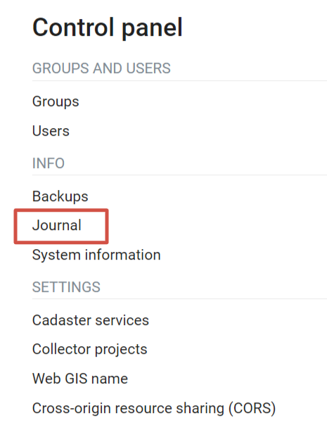
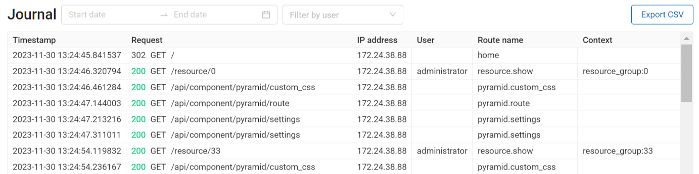
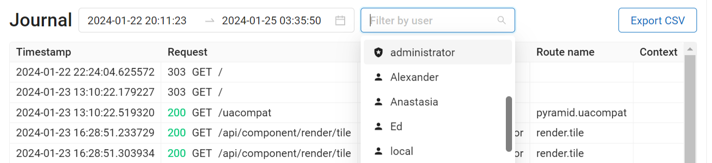
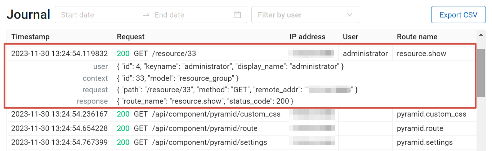

.. _ngw_storage:

Storage
--------

The "Storage" section contains information about the volume of data loaded into Web GIS depending on their type.
The space usage estimate is located below the main table.
The administrator can forcibly recalculate the amount of storage (for example - immediately after loading big data, if the system has not yet recalculated the occupied space on its own).

   Storage section

.. _ngw_backups:

Backups
-------

In this section you can see a list of available NextGIS Web backups, as well as download any of them.
The process of creating backups and restoring for developers is described in `this section <https://docs.nextgis.ru/docs_ngweb_dev/doc/admin/backup_restore.html>`_.

.. _ngw_system_info:

System information
------------------

Through the control panel, the administrator can view information about the system and the current version of the platform (see :numref:`admin_system_info_rus_eng`). Using the icon in the upper right corner, you can copy all this data to the clipboard.

   System information section in the control panel

   System and platform information

.. _ngw_audit:

User activity log
------------------

User requests to the Web GIS are logged in a journal. It can be found in the **Info** section of the Control panel of the Web GIS (:numref:`control_panel_audit_pic`).

   
   Request journal in the Web GIS Control panel

The log is presented in a form of a table that has a set of filters above it (:numref:`user_activity_log_pic`). Every user action is registered in the journal. The entry contains the following details:

* Timestamp
* Request (includes `response status codes <https://developer.mozilla.org/en-US/docs/Web/HTTP/Status>`_ and `request method <https://developer.mozilla.org/en-US/docs/Web/HTTP/Methods>`_ )
* IP address
* User
* Route name
* Context (type and ID of the resource)

  

   
   Activity journal

You can filter the journal entries by time period and user performing the action (:numref:`audit_filter_pic`). The table, filtered or otherwise, can be exported as a CSV file.

   
   Filtering by timestamp and user

To view the complete text of the request click on the corresponding entry (:numref:`audit_log_entry_pic`).

   
   Log entry

