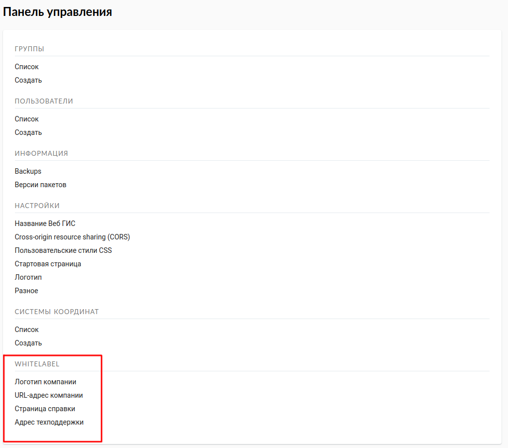
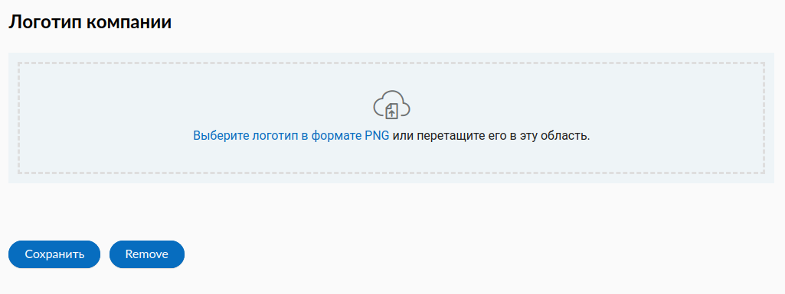
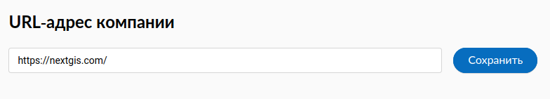
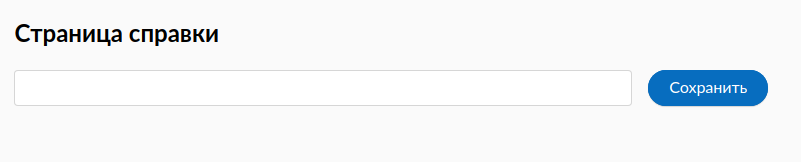
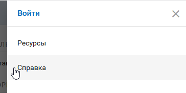
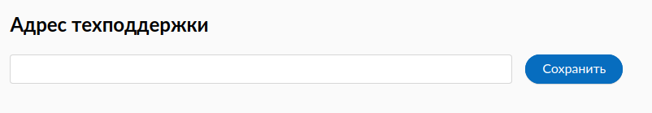
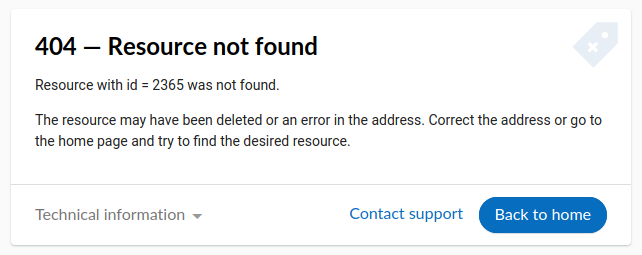

.. _ngw_white_label:

Настройка элементов интерфейса NextGIS (White label)
=========================================================

White label — это специальный модуль, позволяющий убрать или заменить логотипы и названия NextGIS на логотипы и названия вашей компании. Модуль приобретается и устанавливается в NextGIS Web отдельно. Модуль добавляет новый раздел в Панель управления (см. :numref:`Control_panel_whitelabel_ru`), позволяющий отключить или переопределить различные элементы интерфейса, связанные с упоминанием NextGIS.

   Модуль 'White label' в панели управления

.. _ngw_white_label_logo:

Логотип компании на веб-карте
-----------------------------

В панели управления вы сможете загрузить свой логотип в формате PNG (см. :numref:`logo_whitelabel`) для отображения в правом нижнем углу карты. Если файл не загружен - логотип отсутствует (см. :numref:`web-map_logo`).

   Загрузка файла логотипа компании

.. figure:: _static/web-map_logo.png
   :name: web-map_logo
   :align: center
   :width: 25cm

   Веб-карта с логотипом NextGIS (слева) и без логотипа (справа)
   
.. _ngw_white_label_URL:

URL-адрес компании
--------------------

Новому логотипу также можно назначить ссылку на адрес организации (см. :numref:`url-logo`)

   URL-адрес организации

.. _ngw_white_label_help:

Страница справки
-----------------

Без модуля White label справка ведет на http://nextgis.ru/help/. Вы можете задать свою ссылку (см. :numref:`helplink_whitelabel`) на справку (см. :numref:`help_link`).

   Переопределение ссылки на справку

   Раздел "Справка" в меню

.. _ngw_white_label_support:

Адрес техподдержки
-------------------

Аналогично вы сможете задать свою ссылку (см. :numref:`support_whitelabel`) на страницу техподдержки (см. :numref:`support_link`).

   
   Переопределение ссылки на техподдержку

   Ссылка в интерфейсе на страницу техподдержки

.. _ngw_white_label_other:

Прочие элементы
----------------

* Название Веб ГИС по умолчанию задаётся без упоминания NextGIS.
* В ресурсах WMS и WFS сервисов упоминание **NextGIS QGIS** заменяется на **QGIS** (см. :numref:`WMS_WFS_whitelabel`).

.. figure:: _static/WMS_WFS_whitelabel.png
   :name: WMS_WFS_whitelabel
   :align: center
   :width: 25cm

   Замена *NextGIS QGIS* (слева) на *QGIS* (справа) в сервисах WMS и WFS
   
* В ссылках на Веб ГИС убирается превью с упоминанием NextGIS (см. :numref:`Preview_maplinks`).

.. figure:: _static/Preview_maplinks.png
   :name: Preview_maplinks
   :align: center
   :width: 25cm

   Сокрытие упоминания *NextGIS QGIS* в ссылках на веб ГИС

