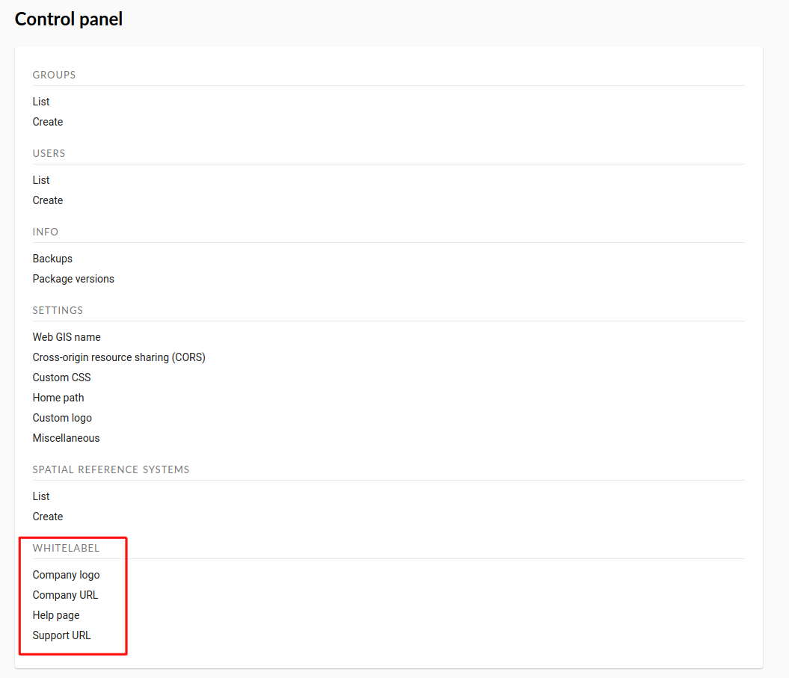
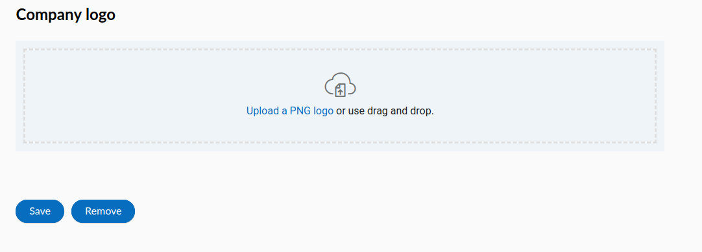
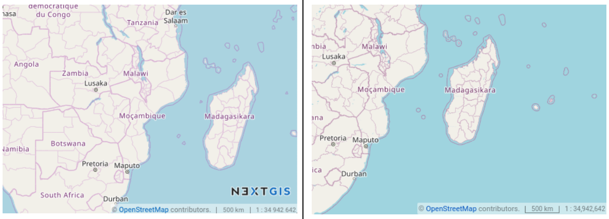
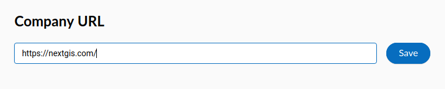
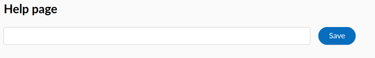
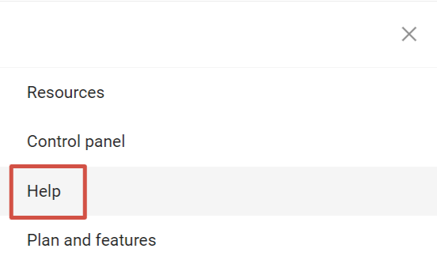
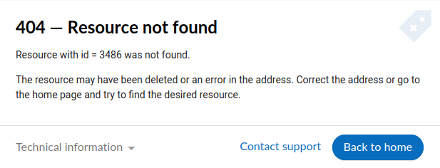
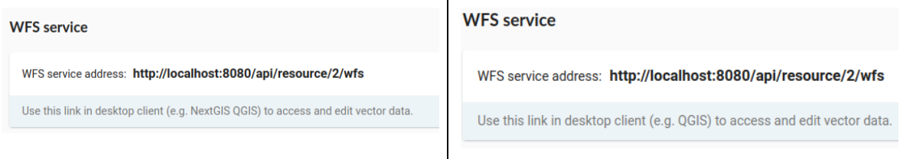
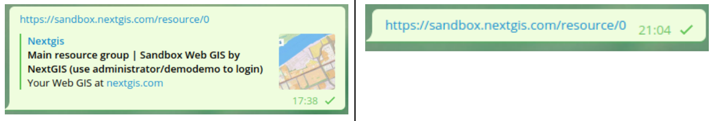

Customize NextGIS UI Elements (White label)
----------------------------------------

White label is a special module that allows you to remove or replace NextGIS logos and names with your company logos and names. The module is purchased and installed separately. The module adds a new section to the Control Panel (см. :numref:`Control_panel_whitelabel`), which allows you to disable or override various interface elements mentioning NextGIS.

   
   'White label' module in control panel

Company logo on Web Map
~~~~~~~~~~~~~~~~~~~~~~~

In Control Panel, you can upload your logo in PNG format (see in :numref:`logo_whitelabel_en`) to display in the lower right corner of the map.

   Upload company logo file

If the file is not loaded, there is no logo (see in :numref:`web-map_logo`).

   Web Map with NextGIS logo (left) and without logo (right)
  
  
Company URL
~~~~~~~~~~~
  
You can assigned a new hyperlink for a company website to a just added logo (см. :numref:`url-logo_en`)

   Company URL
 
 
Help page
~~~~~~~~~
By default, help leads to http://nextgis.com/help/. You can set a different hyperlink (see in :numref:`help_whitelabel_en`) to 'Help'.

   Reroute a link to 'help'

   'Help' in the menu

Support URL
~~~~~~~~~~~

Also you can set URL for the technical support page (see in :numref:`tech_support`).

This link will appear on error messages:

   
   Support URL in the interface
   

Other items
~~~~~~~~~~~~~~~~~

* The default Web GIS name is specified without mentioning NextGIS.
* In WMS and WFS services resources, **NextGIS QGIS** is replaced with **QGIS**(см. :numref:`WMS_WFS_whitelabel`).

   Replacing *NextGIS QGIS* (left) with *QGIS* (right) in WMS and WFS services
   
* The social networks preview mentioning NextGIS is removed (см. :numref:`Preview_maplinks`).

   Hiding the mention of *NextGIS QGIS* in web GIS links
