.. sectionauthor:: Artem Svetlov <artem.svetlov@nextgis.ru>
.. sectionauthor:: Roman Gainullov <roman.gainullov@nextgis.com>

.. _ngw_create_layers:

Adding resources
================

NextGIS Web is built on a **resource-based** approach - each component of the system (layer, group, service) is a resource.
One of these resources is a **layer** - a raster image or vector file (database table).

For each layer you can create an **unlimited** number of **styles** - ways of visualizing geodata on a Web Map.

Interface for adding of PostGIS layers, vector and raster layers is practically the same. 
First, you specify the parameters for the layer, and then you add a style that renders data on the Web Map.

.. _ngw_create_basemap:

Basemap
-------

In the "Create resource" actions pane click **Basemap** (:numref:`ngweb_admin_create_basemap`).
In the opened window enter the name of the resource that will be displayed in the administrator interface (:numref:`ngweb_admin_basemap_name`).

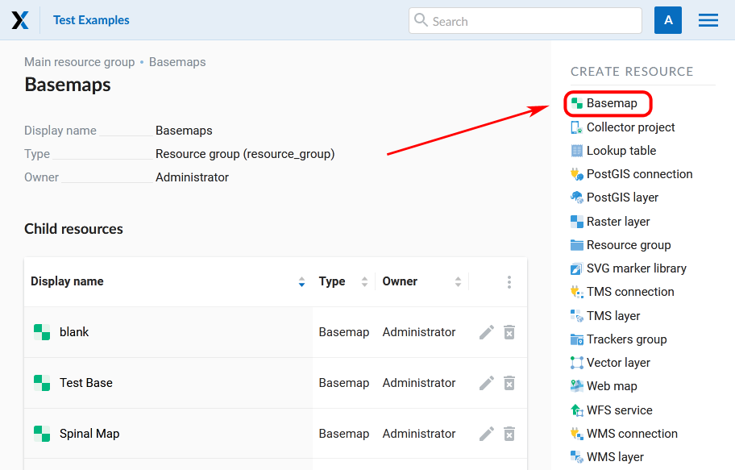

   Selection of "Basemap" action
   
   
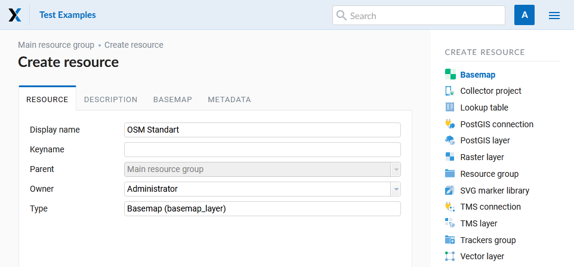

   Basemap name
   
   
The "Description" and "Metadata" of the resource are configured on the corresponding tabs (:numref:`ngweb_admin_basemap_desc`). On the “Description” tab you can add any text describing the content.

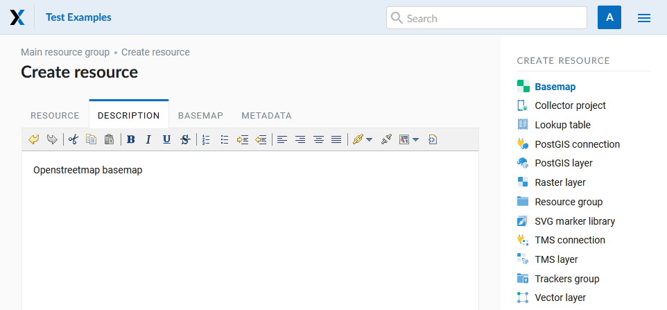

   Basemap description
   

In the “Basemap” tab you must enter the URL-address of the TMS service (:numref:`ngweb_admin_basemap_param`). There are two ways to do so:

* Use the search bar to find a map in the `QuickMapServices catalog <https://qms.nextgis.com/>`_. After a map is selected,  URL field will be filled in automatically and option “Use options from QMS” will be activated.
* Enter the address manually. Works if the QMS flag is unchecked.

.. figure:: _static/ngweb_admin_basemap_param_eng_2.png
   :name: ngweb_admin_basemap_param
   :align: center
   :width: 20cm

   Basemap settings

.. _ngw_data_preview:

Data Preview
------------

The preview function allows you to see the uploaded data on the basemap without adding it on the Web Map.

.. note:: 
	For vector data, previews are available for both the layer and the style. For rasters - for style only. For TMS and WFS layers, preview is also available.
	
While in the corresponding resource, click the "eye" icon opposite the name of the child resource or the **Preview** button in the right menu in the **Extra** section.

A visual preview of the uploaded geometries will open without the possibility of more detailed interaction (viewing attributes, identifying objects, etc).

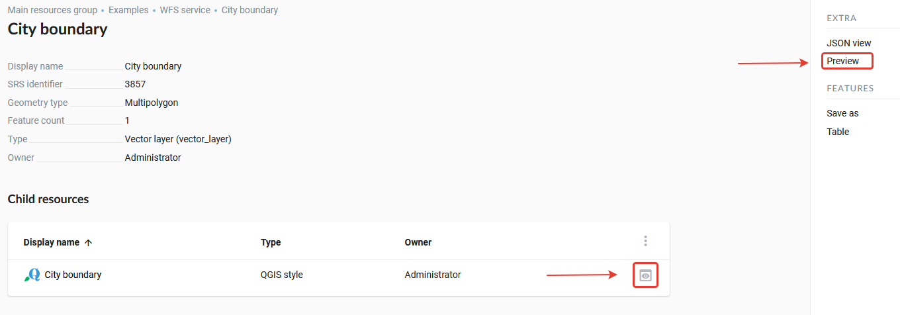

   Selecting Data Preview Function
   

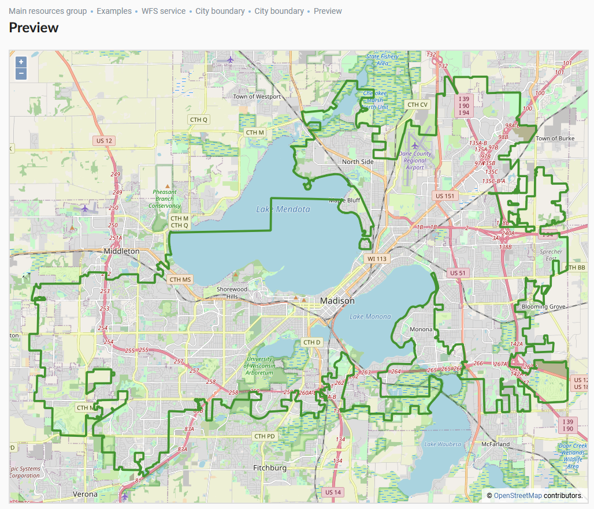

   Data preview

.. _ngw_create_raster_layer:

Raster layer
------------

Raster images in NextGIS Web should be loaded using the "Raster Layer" special resource.

.. _ngw_process_create_raster_layer:

Creation process
^^^^^^^^^^^^^^^^

To add a raster layer navigate to a group where you want to create it. In the "Create resource" actions pane click **Raster layer** (see :numref:`ngweb_admin_layers_create_raster_layer`). 

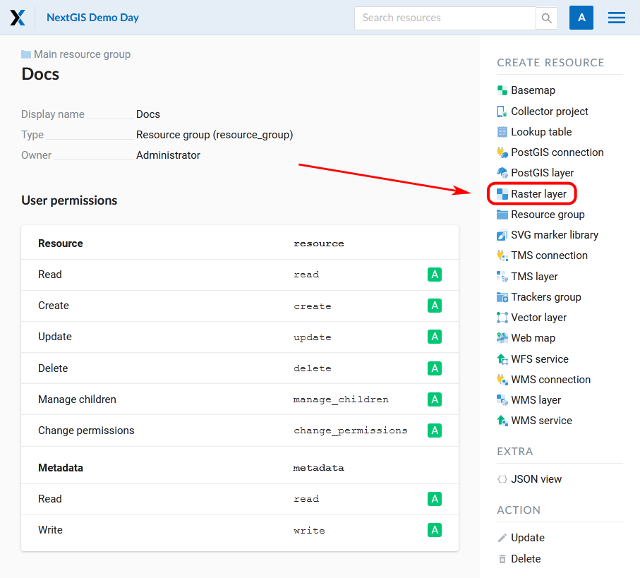

   Selection of "Raster layer" action
   
In the dialog box specify the name of the raster layer (see :numref:`ngweb_admin_layers_create_raster_layer_resourse_name`).
It will be displayed in the admin interface. The "Key" field is optional.

   Raster layer name

On the "Description" tab you can add any text describing the content of this layer (:numref:`ngweb_admin_layers_create_raster_layer_resourse_description`).

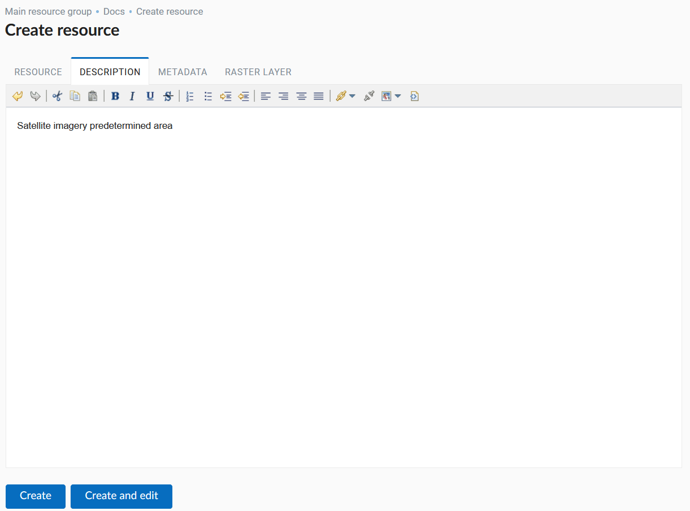

   Raster layer description 

In the "Metadata" tab you can enter information in the "key-value" format (:numref:`ngweb_admin_layers_create_raster_layer_resourse_metadata`).

   Raster layer metadata 
   
   
On the "Raster layer" tab you need to upload a geodata file in GeoTIFF format.
The upload dialog indicates the maximum file size allowed on your subscription plan (:numref:`ngweb_admin_layers_create_raster_layer_upload`).

If you plan to use this raster in QGIS directly from your Web GIS, tick the Upload as Cloud Optimized GeoTIFF (COG) checkbox. This will optimize the raster to ensure fast display.

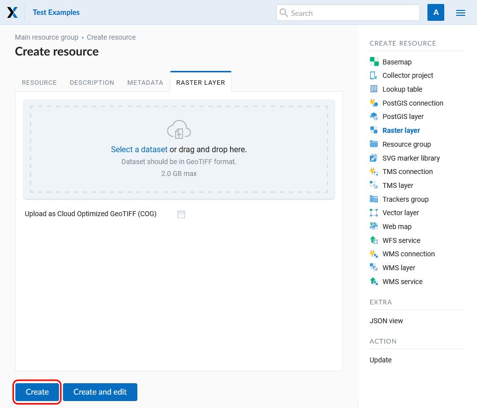

   Uploading raster file  

After uploading a file, click the **Create** button.

.. _ngw_process_create_raster_style:

Raster style (QGIS)
^^^^^^^^^^^^^^^^^^^

After a raster file is successfully uploaded and a raster layer is created, you need to create a QGIS style.
This procedure is similar to adding a vector layer `style <https://docs.nextgis.com/docs_ngweb/source/mapstyles.html#qgis-style>`_. You can create one in NextGIS QGIS.
You will need this style to add the raster to a Web Map when creating one (for more information see subsection :ref:`ngw_map_create`).

Raster layer with transparency (clip or alpha channel)
^^^^^^^^^^^^^^^^^^^^^^^^^^^^^^^^^^^^^^^^^^^^^^^^^^^^^^^^

Most of utilities do not create an alpha channel and only add a NoData value. 
To transform NoData value to an alpha channel use the command line utility 
:program:`gdalwarp`. Here is an example of this command.

.. code:: shell

   gdalwarp -t_srs EPSG:3857 -multi -dstalpha -dstnodata none -wo \
   "UNIFIED_SRC_NODATA=YES" -co COMPRESS=JPEG \ 
   d:\temp\o\ast_20010730_010043_rgb.tif d:\temp\o\ast_20010730_010043_rgba.tif
   

Uploading Indexed Color Rasters
^^^^^^^^^^^^^^^^^^^^^^^^^^^^^^^

Indexed Color raster files are uploaded just like the RGB raster files. If the file is not in GeoTIFF format, you can convert it as follows:

.. code-block:: shell

    gdal_translate yaroslavl.map  yaroslavl.tif

.. _ngw_create_vector_layer:

Vector layer from file
-----------------------
You can create vector layers based on :term:`ESRI Shapefile`, :term:`GeoJSON`, :term:`KML`, :term:`GML` and :term:`GeoPackage` formats in NextGIS Web.

.. _ngw_process_create_vector_layer:

Creation process
^^^^^^^^^^^^^^^^
Navigate to the resource group (folder) in which to create a vector layer.
In the "Create resource" actions pane select **Vector layer** (see :numref:`ngweb_admin_layers_create_vector_layer`).

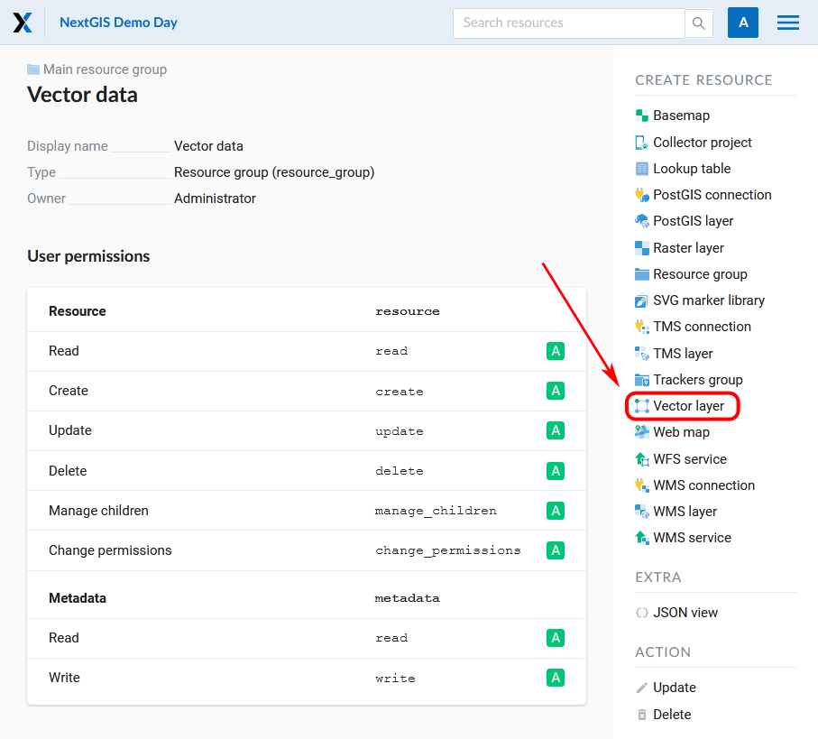

   Selection of "Vector layer" action

In the opened tab, enter the name of the vector layer (:numref:`ngweb_admin_layers_create_vector_layer_resourse_name`).
It will be displayed in the admin interface. The "Key" field is optional.

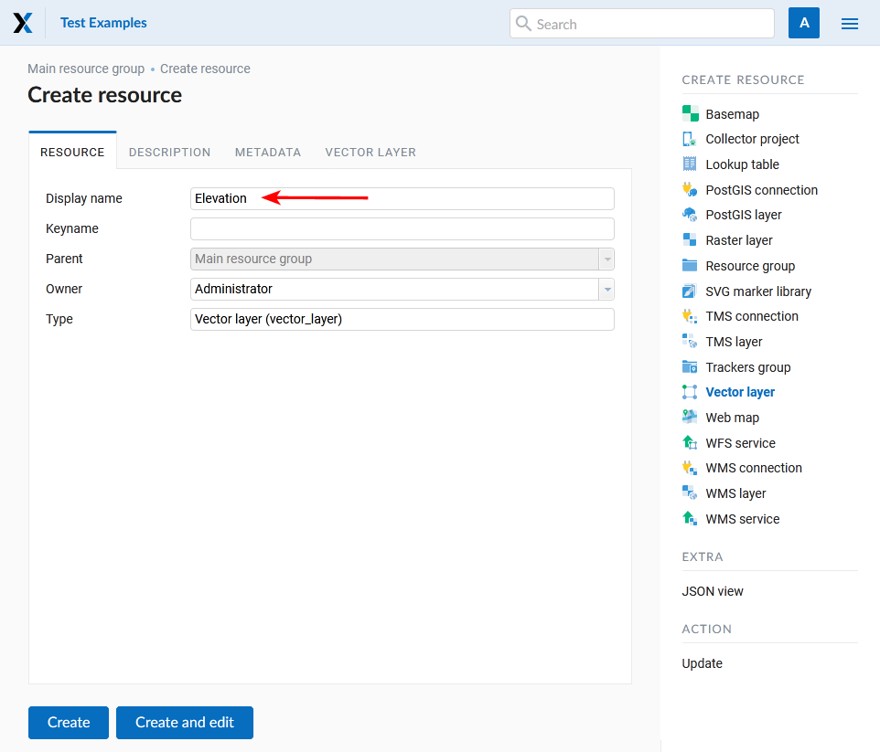

   Vector layer name

On the "Description" tab you can add any text describing the content of this layer (:numref:`ngweb_admin_layers_create_vector_layer_resourse_description`).

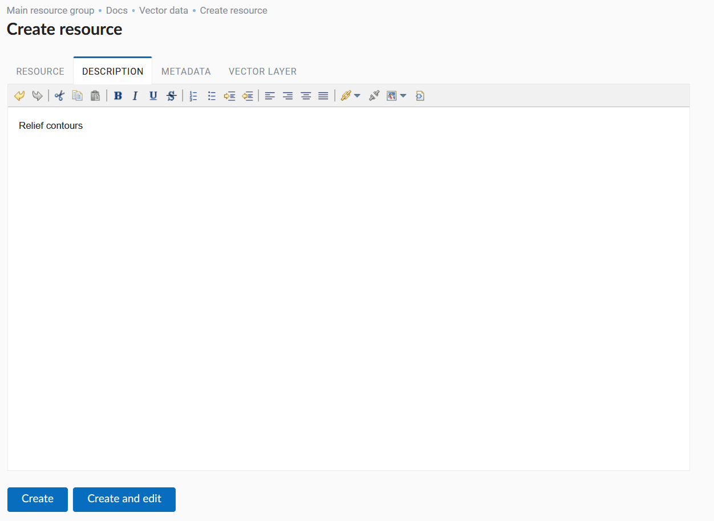

   Vector layer description

In the "Metadata" tab you can add information in the "key-value" format (:numref:`ngweb_admin_layers_create_vector_layer_resourse_metadata`).

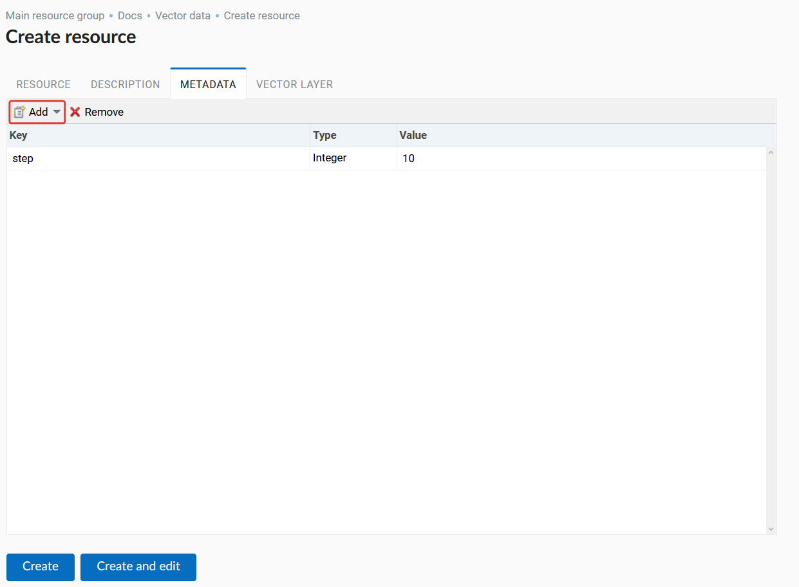

   Vector layer metadata

On the "Vector Layer" tab you need to upload a geodata file in :term:`ESRI Shapefile` (zip-archive), :term:`GeoJSON`, :term:`KML`, :term:`GML` or :term:`GeoPackage` format. The upload dialog indicates the maximum file size allowed on your subscription plan (:numref:`ngweb_admin_layers_create_vector_layer_upload`). Web GIS can process multi-layer datasets. If an archive contains several layers, then after it is uploaded, you will be asked to select which layer will be used for creating Vector layer resource.

Below it is proposed to define advanced options for creating a vector layer. Depending on the quality of the data you can handle geometry errors when uploading a file as follows:

* Not fix errors 
* Fix whatever is possible
* Fix without losing data

Next - the type of geometry, the presence/absence of multigeometries, Z-coordinates and the source of the FID (FID field, determine automatically or indicate from a particular field) are indicated. `More about advanced options <https://docs.nextgis.com/docs_ngweb/source/vect_layer_upload_params.html>`_.

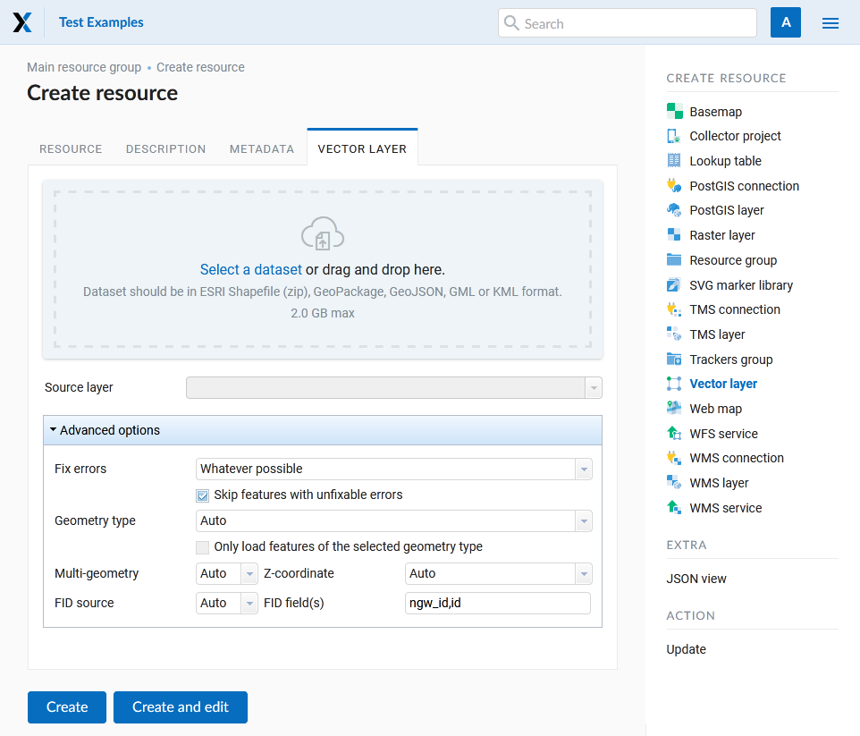

   Vector file upload tab

After uploading the file and specifying the parameters, click the **Create** button.
Then you can create a `style <https://docs.nextgis.com/docs_ngweb/source/mapstyles.html#qgis>`_ that will later visualize the data layer on a `Web Map <https://docs.nextgis.com/docs_ngweb/source/webmaps_admin.html#ngw-map-create>`_.

.. _ngw_vector_data_requirements:

Input data requirements
^^^^^^^^^^^^^^^^^^^^^^^^^

Source files could be in the following formats: 

* :term:`ESRI Shapefile`
* :term:`GeoJSON`
* :term:`KML`
* :term:`GML`
* :term:`GeoPackage`

Use :ref:`NextGIS Connect <ngcom_ngqgis_connect_data_upload>` if you need to upload data in other formats.

.. note:: 
   In case of ESRI Shapefile, all components (dbf, shp, shx, prj and other files) 
   should be compressed to a zip-archive.
   
.. warning:: 
	Avoid using Unicode symbols in data field names. While such data can be uploaded to the Web GIS and displayed on Web Maps, you can experience problems working with it in NextGIS Mobile or visualization (especially if labels are using such fields). Use plain Latin for field names and set up field aliases to show Unicode names.
	
	
If input data layer contains fields named id (ID) or geom (GEOM), they will be renamed on import. If id has meaningful identifiers, they will automatically be turned into internal FIDs.

.. _ngw_create_postgis_layer:

Vector layer from PostGIS
-------------------------

To add a vector layer from PostgreSQL database with PostGIS extension, you need to create a PostGIS connection resource. It is enough to create one connection. 

.. _ngw_create_postgis_connection:

Creating PostGIS connection
^^^^^^^^^^^^^^^^^^^^^^^^^^^

In the "Create resource" actions pane click **PostGIS connection** (see :numref:`admin_layers_create_postgis_connection_resourse`). 

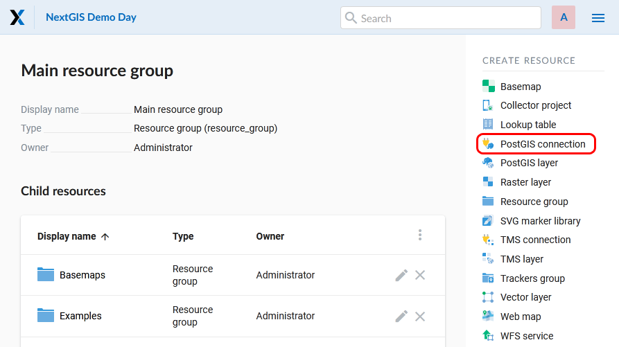

   Selection of "PostGIS connection" action
 
Enter a display name that will be visible in the administrator interface. Not to be confused with layer name in a database. 

"Keyname" field is optional.

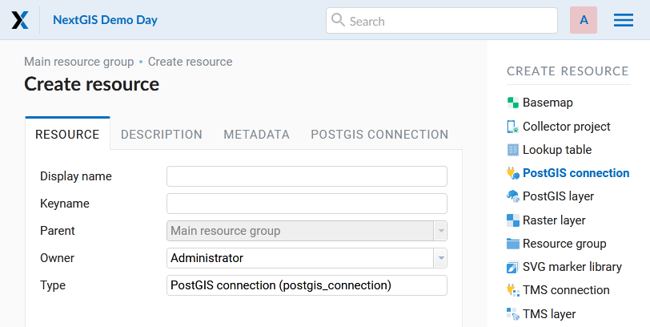

   Create resource dialog for PostGIS connection

You can also add resource description and metadata on the corresponding tabs.

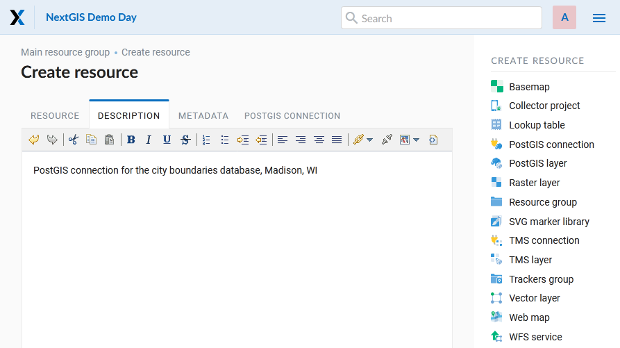
   
   PostGIS connection description
   
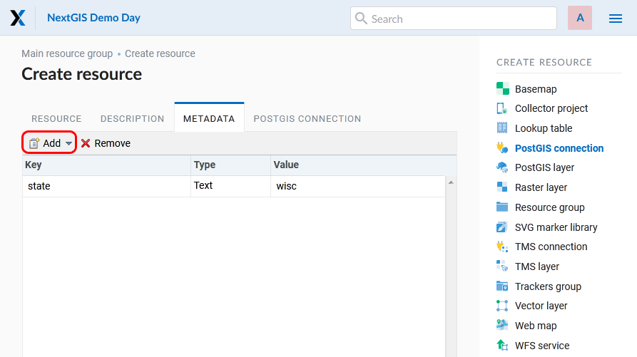

   PostGIS connection metadata

Switch from "Resource" to "PostGIS connection" tab, which is presented on :numref:`admin_layers_create_postgis_connection_db_logins`. 

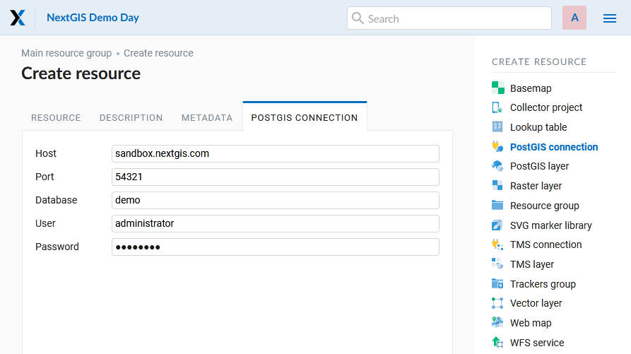

   PostGIS connection tab of Create resource dialog

In this tab you should enter connection parameters for the PostGIS database that you are going to take data from. Then click **Create**.

Creating PostGIS layer
^^^^^^^^^^^^^^^^^^^^^^

Now you can add individual PostGIS layers. Navigate to a group where you want to create layers and in the  "Create resource" actions pane select **PostGIS layer** (see :numref:`admin_layers_create_postgis_layer`).

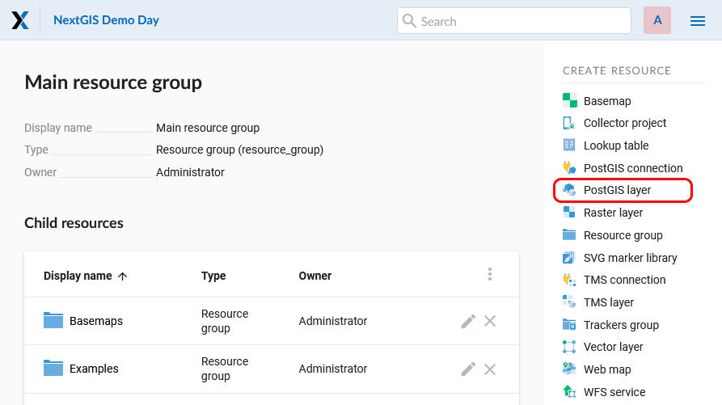

   Selection of "PostGIS layer" action

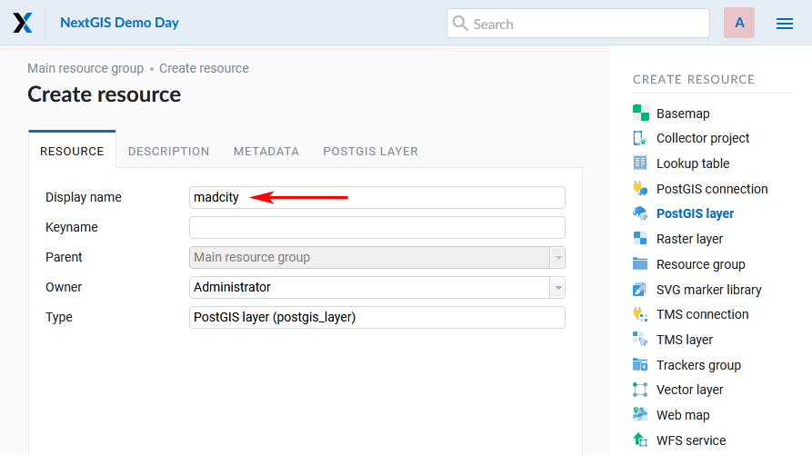

   Create resource dialog for PostGIS layer

Enter a display name that will be visible in administrator interface and in the map 
layer tree. 

"Keyname" field is optional.

You can also add resource description and metadata on the corresponding tabs.

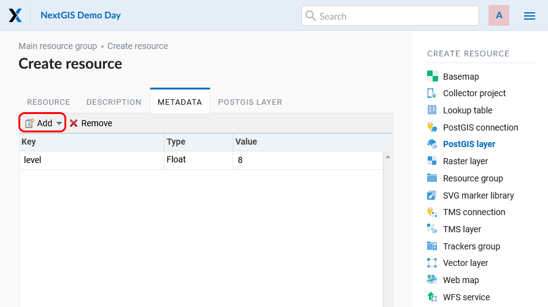

   PostGIS layer metadata

Switch from "Resource" tab to "PostGIS layer" tab, which is presented on 
:numref:`admin_layers_create_postgis_layer_tablename`. 

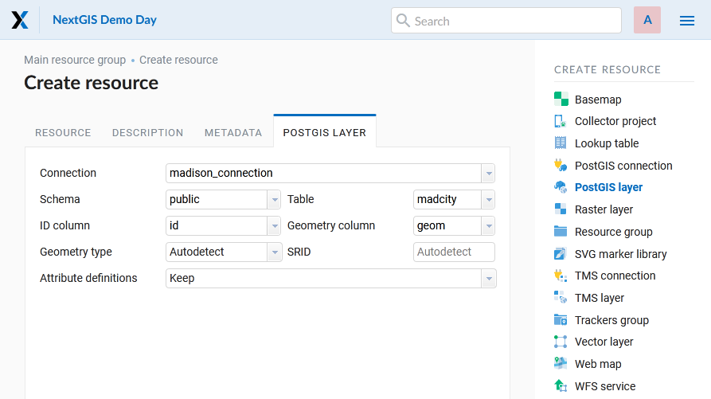

   PostGIS layer tab of create resource dialog

Then perform the following steps:

#. From a dropdown list select a database connection (creation of a connection is described above).
#. Select a schema of the database where layer data is stored. 
   A single database can store multiple schemas. Each schema contains tables and views. If there is only one schema, it's called public. For more information see :program:`PostgreSQL DBMS` manual.
#. Select the Table name (PostGIS layer). 
   You need to know names of tables and columns in your database. 
   Display of tables content is not a feature of NextGIS Web. You can view them using :program:`NextGIS QGIS` or :program:`pgAdmin` software.
#. Select an ID column. 
   When data is loaded into PostGIS using :program:`NextGIS QGIS` 
   software, an ogc_fid column is created. If the data was loaded another way, the 
   column name may be different.
   An ID column should follow rules for data type: the value type should be a 
   number (**numeric**) and it should be a primary key.
#. Select the Geometry column (if the data was loaded to PostGIS using  
   :program:`NextGIS QGIS` software, usually a geometry column called 
   wkb_geometry is created. If the data was loaded some other way, the name of the column 
   may be different).
#. Parameters "Geometry type", "Attribute definitions" and "SRID" are not required, so you can use default 
   values.

After specifying all the necessery parameters, click **Create**.

Details
^^^^^^^

NextGIS Web software supports tables with point, line and polygon geometries stored in a single geometry column. 
This is required for some specific datasets: e.g. if one table stores coordinates for parks as polygons and trash cans as points. In this case, in NextGIS Web you need to add three different layers, one for each type of geometry, and select the appropriate "Geometry type" parameter for each layer.

After a layer is created, you need to set a label attribute to display labels. Navigate to layer edit dialog and set a checkbox for the required field in the "Label attribute" column.

If the structure of the database changes (column names, column types, number of columns, table names etc.), you need to update the attribute definitions in the layer properties. Select "Update" in the actions pane and then on the "PostGIS layer" tab change "Attribute definitions" to "Reload" and click **Save**.

PostGIS layer troubleshooting
^^^^^^^^^^^^^^^^^^^^^^^^^^^^^

You created a connection, but when you try to create a PostGIS layer based on it, you get errors. 

If you get:

1. Cannot connect to the database!

Check the database: is it available, do you have the right credentials? You can do it using :program:`pgAdmin` or :program:`NextGIS QGIS`.

Note that databases may be down temporarily and credentials might change.

Create layers with conditions
^^^^^^^^^^^^^^^^^^^^^^^^^^^^^^

In :program:`NextGIS Web` you can not define queries using WHERE SQL clause. 
This provides additional security (prevention of SQL Injection attack). To 
provide query capability you need to create views with appropriate queries in the database.

To do this connect to PostgreSQL/PostGIS database using :program:`pgAdmin`, 
then navigate to data schema where you want to create a view, right click tree 
item "Views" and select "New view" (see item 1 in :numref:`pgadmin3`). Also you can right click on schema name and select "New object" and then "New view". In the opened dialog, enter the following information:

#. View name («Properties» tab).
#. Data schema where to create a view («Properties» tab).
#. SQL query («Definition» tab).

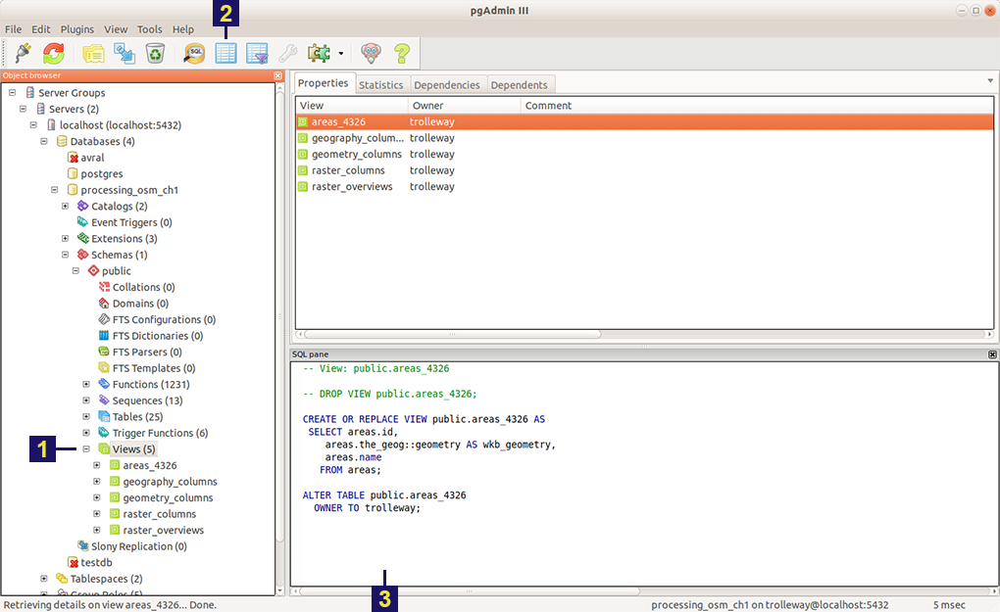

   Main dialog of :program:`pgAdmin` software

   The numbers indicate: 1. – Database items tree; 2 – a button for  
   table open (is active if a table is selected in tree); 3 – SQL query for  
   view.

After that you can display a view to check if the query is correct without closing :program:`pgAdmin` (see  item 2 in :numref:`pgadmin3`). 

.. _ngw_create_wms_layer:

WMS layer
---------

NextGIS Web is a WMS client. To connect a WMS layer you need to know its address. WMS server should be able to serve it using a coordinate system EPSG:3857. You can check if this coordinate system is available for a particular layer by making a ``GetCapabilites`` request to a server and examining the response. For example a WMS layer provided by Geofabrik (GetCapabilities), responds in EPSG:4326 and EPSG:900913. While EPSG:900913 and EPSG:3857 are technically the same, NextGIS Web requests data in EPSG:3857 and this particular server does not support that coordinate system.

.. _ngw_create_wms_connection:

Creating WMS Connection
^^^^^^^^^^^^^^^^^^^^^^^

To add a WMS layer you need to create a resource called WMS connection. You may create a single connection for many layers.
In the "Create resource" actions pane click **WMS connection** (see :numref:`admin_layers_create_wms_connection`). 

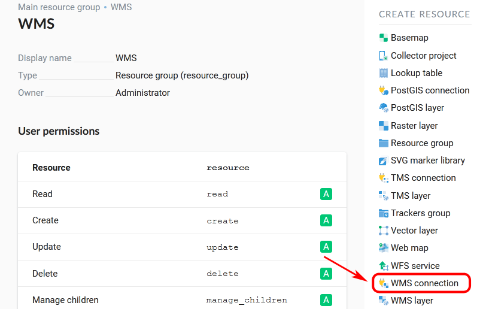

   Selection of "WMS connection" action
   
Create resource dialog for WMS connection is presented on :numref:`admin_layers_create_wms_connection_name`.

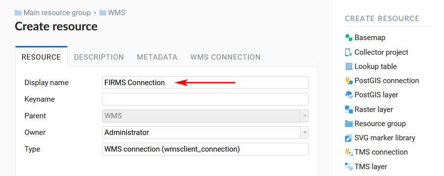

   Create resource dialog for WMS connection

Enter the name of the resource that will be displayed in the administrator interface. Not to be confused with layer name in a database. "Keyname" field is optional.

On the "Description" tab you can add any text describing the content of this connection.

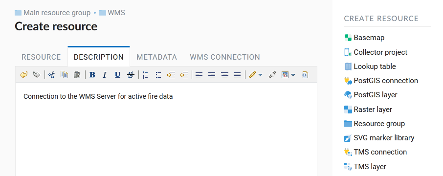

   WMS connection description

On the "Metadata" tab you can enter information in the "key-value" format.

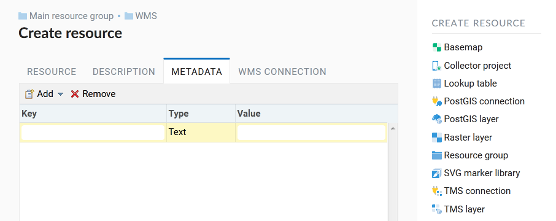

   WMS connection metadata

Switch to "WMS connection" tab, which is presented on :numref:`admin_layers_create_wms_connection_url`.

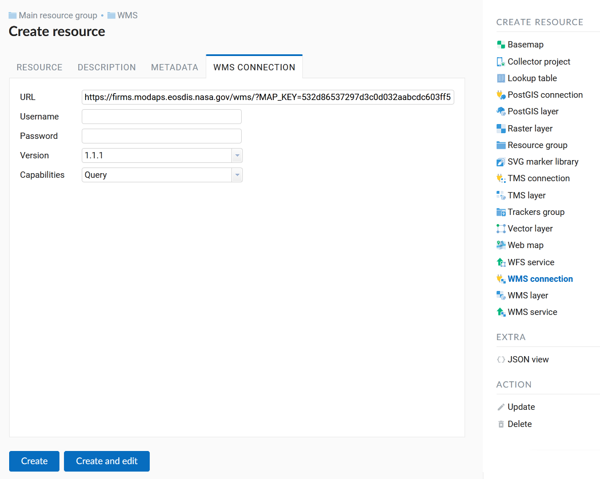

   WMS connection tab of Create resource dialog

Here enter the following WMS server connection parameters:

* URL
* Username
* Password
* Version of WMS protocol
* Capabilities (manages GetCapabilities queries to the WMS Server)

Supported versions of WMS protocol: 1.1.1, 1.3.0
After setting up all necessery parameters, click **Create**.

.. _ngw_create_layer_wms:

Creating WMS Layer
^^^^^^^^^^^^^^^^^^

Now you can add individual WMS layers. Navigate to a group where you want to create WMS layers and in the "Create resource" actions pane select **WMS layer** (see :numref:`admin_layers_create_wms_layer`). 

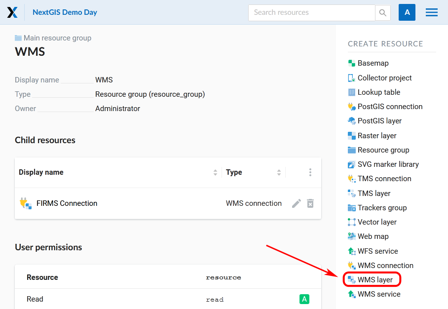

   Selection of "WMS layer" action

Create resource dialog for WMS layer is presented on :numref:`admin_layers_create_wms_layer_name`

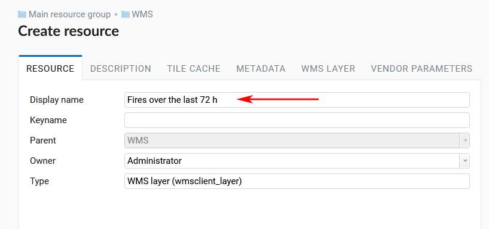

   Create resource dialog for WMS layer

Enter display name that will be visible in administrator interface and in the map 
layer tree. 

"Keyname" field is optional.

Tile cache settings are described in detail in `this section <https://docs.nextgis.com/docs_ngweb/source/mapstyles.html#tile-cache>`_.

On the "Description" tab you can add any text describing the content of this layer.

.. figure:: _static/admin_layers_create_wms_layer_description_eng.png
   :name: admin_layers_create_wms_layer_description_eng
   :align: center
   :width: 16cm
   
   WMS layer description

OIn the "Metadata" tab you can enter information in the "key-value" format.

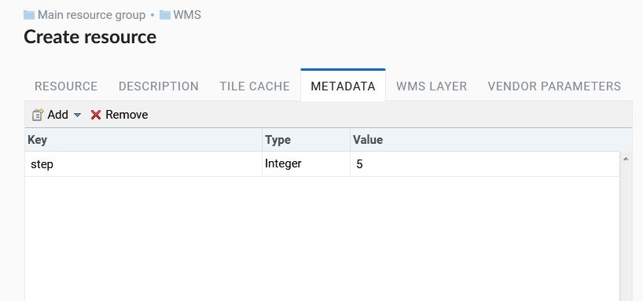

   WMS layer metadata
   
Switch to the "WMS layer" tab, which is presented on :numref:`admin_layers_create_wms_layer_parameters` and perform the following steps:

1. Select the WMS connection that was created earlier.
2. Select the appropriate MIME-type from the dropdown list.
3. Select the required layers from the list by clicking the underlined names. You can select several layers.

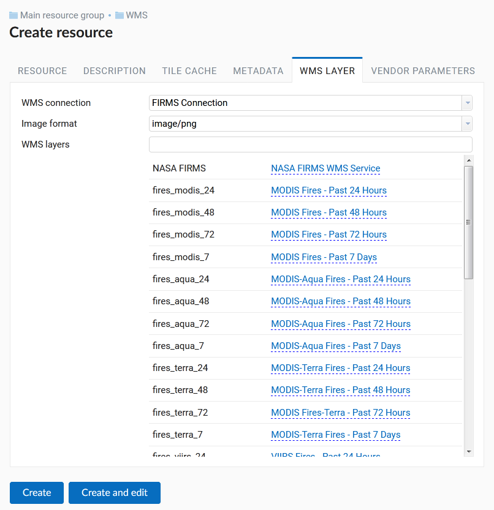

   WMS layer tab of Create resource dialog

In the last tab you can add vendor parameters. These are special query settings for additional functions. They vary depending on the WMS provider.

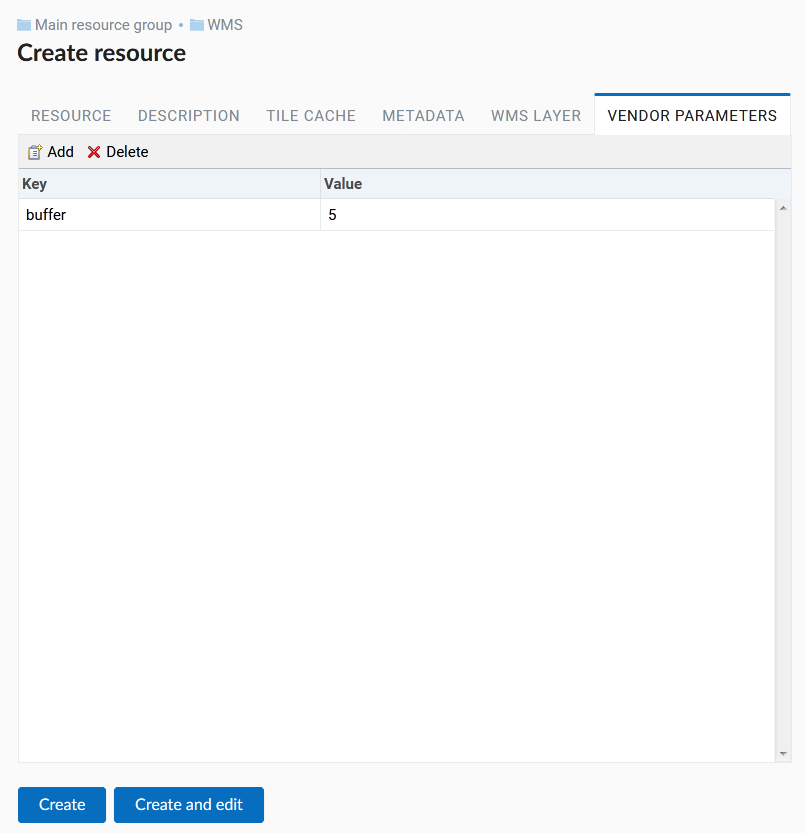

   Vendor parameters of the WMS layer

After configuring all the parameters click **Create**.

.. warning:: 
   Identification requests to external WMS layers from Web Maps are not supported yet.

.. _ngw_create_wms_service:

WMS service
------------

NextGIS Web software can perform as WMS server. This protocol is used to provide images with a requested extent. 

To deploy a WMS service you need to add a resource. In the "Create resource" actions pane click **WMS service** (see :numref:`admin_layers_create_wms_service`). 

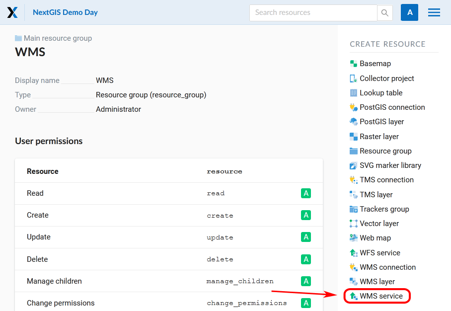

   Selection of "WMS service" action
   
Create resource dialog for WMS service is presented on :numref:`ngweb_admin_layers_create_wms_service_name`. 

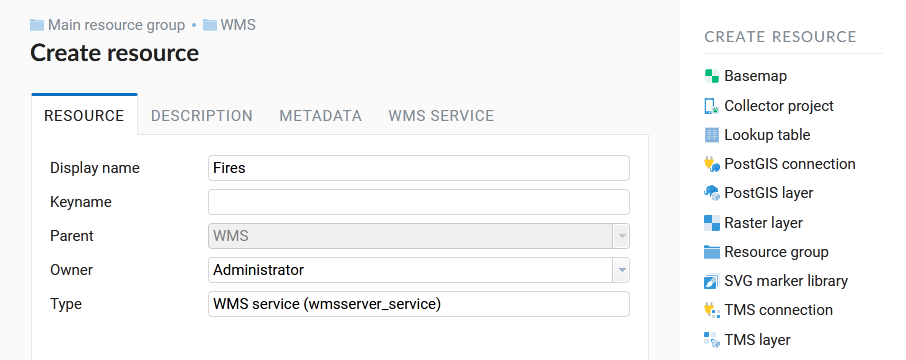

   Create resource dialog for WMS service

Enter the name of the resource that will be displayed in the administrator interface. Do not 
confuse this name with a name of layers in a database. 

"Keyname" field is optional.

On the "Description" tab you can add any text describing the content of this service.

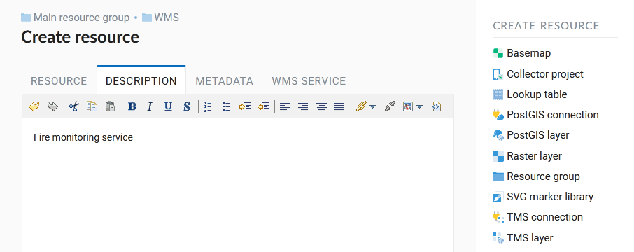

   WMS service description

On the "Metadata" tab you can enter information in the "key-value" format.

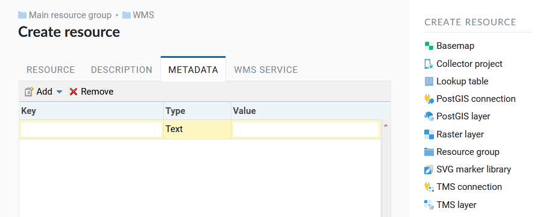

   WMS service metadata
 
Switch to "WMS service" tab, which is presented on :numref:`ngweb_admin_layers_create_wms_service_url`. Here add links to required layers or layer styles. You can also set the min and max scale for the data visualisation.

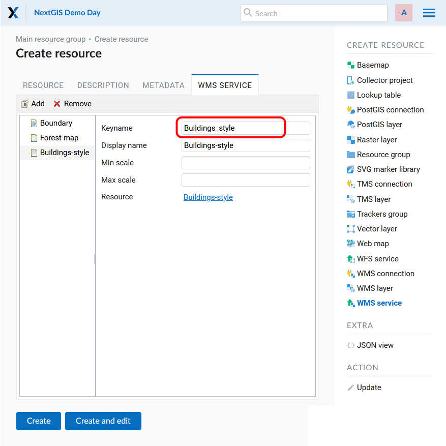

   WMS service tab of Create resource dialog

After the resource is created, you will see a message with the WMS service URL which you can use in other software, e.g. :program:`NextGIS QGIS` or :program:`JOSM`. 
Then you need to set access permissions for the WMS service (see :ref:`ngw_access_rights`).

NextGIS Web layer can be added to desktop, mobile and Web GIS in different ways.

Using WMS service connection
^^^^^^^^^^^^^^^^^^^^^^^^^^^^

NextGIS Web acts as a WMS server: WMS services created in NextGIS Web can be added to any software that supports WMS protocol. For that you need to know the WMS service URL. You can get it on the WMS service page. The link may look like this:

.. code:: html

   https://demo.nextgis.com/api/resource/4817/wms?

To use WMS service through GDAL utilities you need to create an XML file for the required layer.
Enter these parameters to the ServerUrl string in example below. The rest remains unchanged.

.. code:: xml

   <GDAL_WMS>
    <Service name="WMS">
        <Version>1.1.1</Version>
        <ServerUrl>https://demo.nextgis.com/api/resource/4817/wms?</ServerUrl>
        <SRS>EPSG:3857</SRS>
        <ImageFormat>image/png</ImageFormat>
        <Layers>moscow_boundary_multipolygon</Layers>
        <Styles></Styles>
    </Service>
    <DataWindow>
      <UpperLeftX>-20037508.34</UpperLeftX>
      <UpperLeftY>20037508.34</UpperLeftY>
      <LowerRightX>20037508.34</LowerRightX>
      <LowerRightY>-20037508.34</LowerRightY>
      <SizeY>40075016</SizeY>
      <SizeX>40075016.857</SizeX>
    </DataWindow>
    <Projection>EPSG:3857</Projection>
    <BandsCount>3</BandsCount>
   </GDAL_WMS>

If you need an image with transparency (alpha channel) set ``<BandsCount>4</BandsCount>``.

Here is an example of a GDAL command. The utility gets an image by WMS from NextGIS Web and saves it to a GeoTIFF format.

.. code:: bash

   $ gdal_translate -of "GTIFF" -outsize 1000 0  -projwin  4143247 7497160 \
   4190083 7468902   ngw.xml test.tiff

.. _ngw_create_tms_layer:

TMS layer
---------

.. _ngw_create_tms_connection:

TMS Connection
^^^^^^^^^^^^^^

Similarly to `WMS <https://docs.nextgis.com/docs_ngweb/source/layers.html#wms-layer/>`_, to add a TMS layer, you first need to create a TMS connection. Select **TMS connection** in the "Create resource" actions pane (see :numref:`TMS_connection_create_en`)

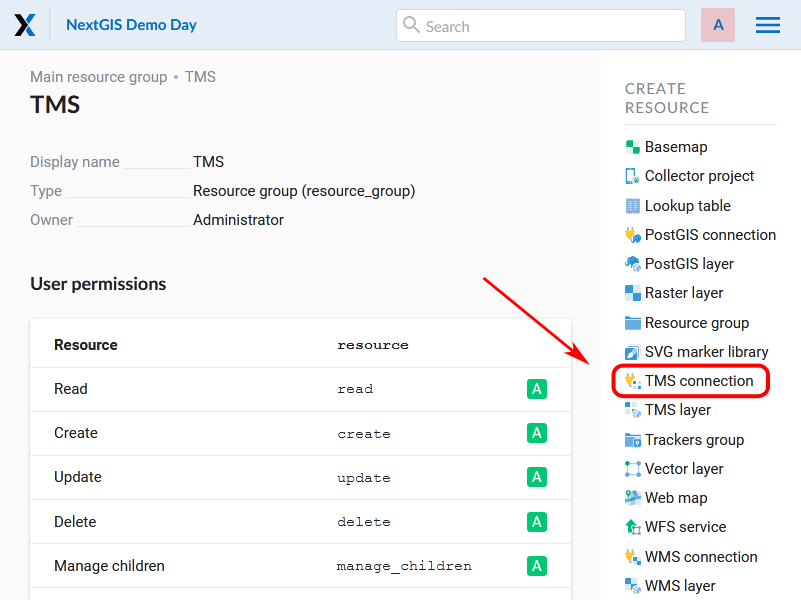
   
   Selecting a TMS Connection resource

Enter the connection name that will be displayed in the administrator interface (see :numref:`TMS_connection_name_en`).

.. figure:: _static/TMS_connection_name_en_2.png
   :name: TMS_connection_name_en
   :align: center
   :width: 16cm
   
   TMS Connection Resource Name

The "Key" field is optional. If needed, you can also add a description and metadata. In the TMS connection tab you need to select the way to connect to the TMS server - custom or via NextGIS geoservices (see :numref:`TMS_connection_type_en`).

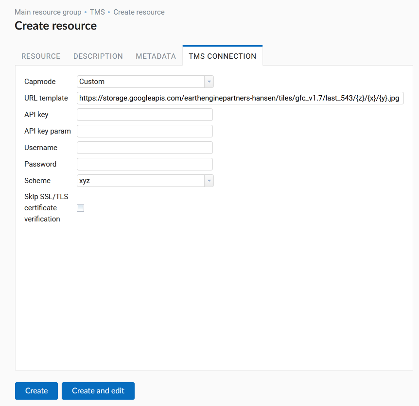
   
   Configuring TMS Connection
   
In the case of a custom connection method, the user must specify the URL template, API key parameters if needed and the tile scheme used. For NextGIS geoservices, only a custom API key is specified. After filling in all fields press Create to complete the process of creating a **TMS Connection** resource.

.. _ngw_tms_layer:

TMS layer
^^^^^^^^^

**TMS layer** resource is created using previously created **TMS Connection**. Select **TMS layer** in the "Create resource" actions pane (see :numref:`TMS_layer_create_en`).

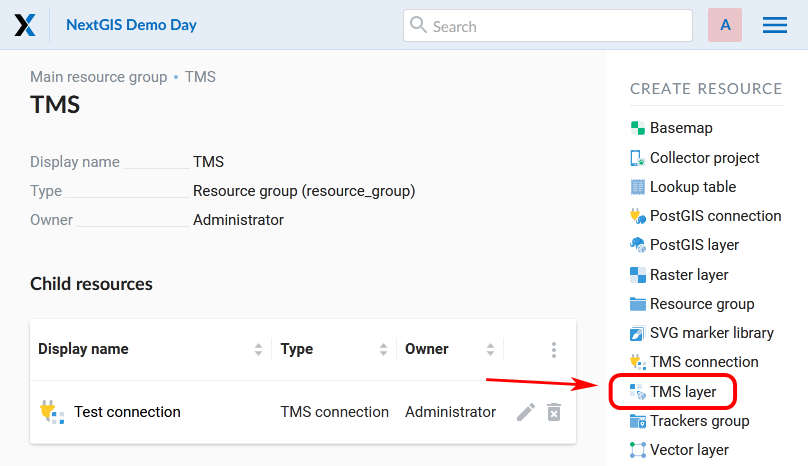
   
   Selecting of TMS layer action
   
Enter the name that will be displayed in the administrator interface (see :numref:`TMS_layer_name_en`).

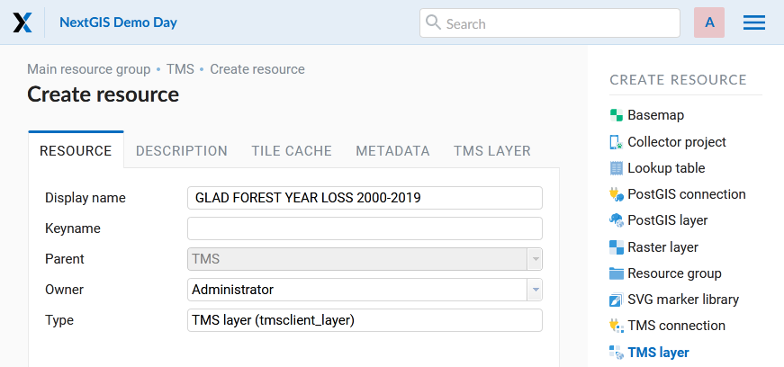
   
   TMS layer name

Caching provides faster rendering of Web Map layers. Tile cache settings are described in details `in this section <https://docs.nextgis.com/docs_ngweb/source/mapstyles.html#tile-cache>`_.

The main display settings are on the TMS layer tab (см. :numref:`TMS_layer_settings_en`):

* TMS connection - select a TMS connection resource that was created earlier
* Select coordinate system for data display
* The range of zoom levels for data display
* Extent in degrees
* Tile size in pixels

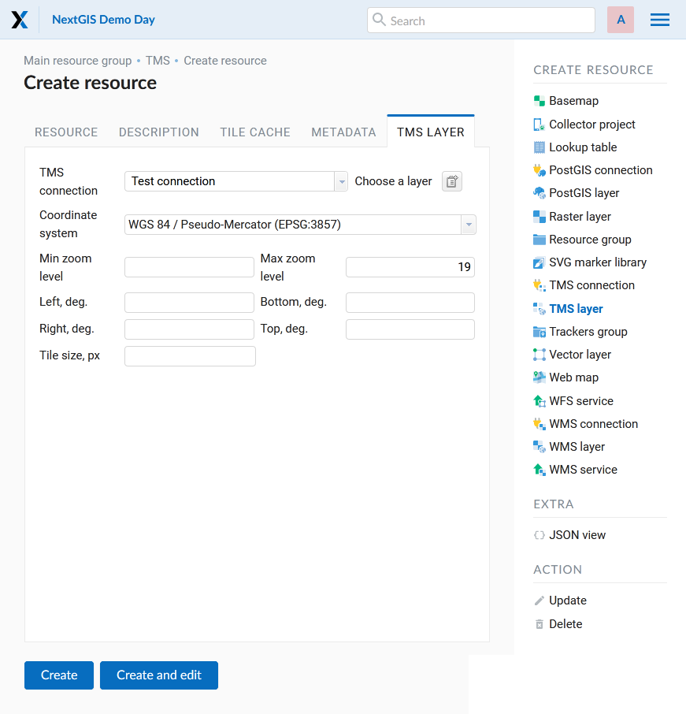
   
   TMS layer settings
   
After creating a TMS layer, the user can add it to the Web Map to display. No style is needed.

.. _ngw_connect_tms_gdal:

Using TMS service
^^^^^^^^^^^^^^^^^

NextGIS Web is a TMS server. Layers and styles created in it can be accessed via any software supporting TMS protocol. You will need the URL for the TMS service.

The link should look like this:

.. code:: html

   https://demo.nextgis.com/api/component/render/tile?z={z}&x={x}&y={y}&resource=234

To use TMS service through GDAL utilities you need to create an XML file. You will need the TMS link.
Enter these parameters to ServerUrl string in example below. The rest remains unchanged.

.. code:: xml

   <GDAL_WMS>
    <Service name="TMS">
        <ServerUrl>https://demo.nextgis.com/api/component/render/tile?z={z}&x={x}&y={y}&resource=234
        </ServerUrl>
    </Service>
    <DataWindow>
        <UpperLeftX>-20037508.34</UpperLeftX>
        <UpperLeftY>20037508.34</UpperLeftY>
        <LowerRightX>20037508.34</LowerRightX>
        <LowerRightY>-20037508.34</LowerRightY>
        <TileLevel>18</TileLevel>
        <TileCountX>1</TileCountX>
        <TileCountY>1</TileCountY>
        <YOrigin>top</YOrigin>
    </DataWindow>
    <Projection>EPSG:3857</Projection>
    <BlockSizeX>256</BlockSizeX>
    <BlockSizeY>256</BlockSizeY>
    <BandsCount>4</BandsCount>
    <Cache />
   </GDAL_WMS> 

.. _ngw_wfs_service:

WFS service
-----------

WFS layer setup is performed the same way as for WMS service but you add layers instead of styles.
 
.. note::
     Currently supported filters are Intersects, ResourceId (ObjectId, FeatureId).

NextGIS Web acts as WFS server and publishes WFS services based on vector layers. Third party software can use these services to edit vector data on server. Supported WFS protocol versions are 1.0, 1.1, 2.0, 2.0.2. 

To deploy a WFS service click **WFS service** in the "Create resource" actions pane (see :numref:`admin_layers_create_wfs_service`). 

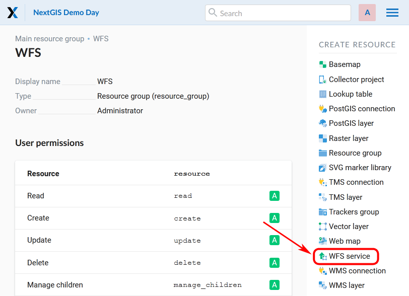

   Selection of "WFS service" action
   
Create resource dialog for WFS service is presented on :numref:`ngweb_admin_layers_create_wfs_service_name`. 

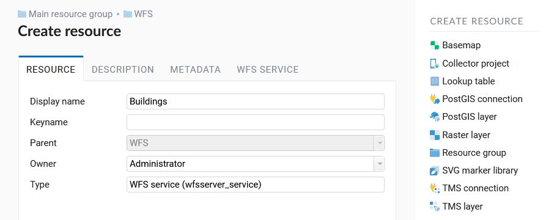

   Create resource dialog for WFS service

Enter the name of the resource that will be displayed in the administrator interface. Do not 
confuse this name with a name of layers in a database. 

"Keyname" field is optional.

On the "Description" tab you can add any text describing the content of this service.

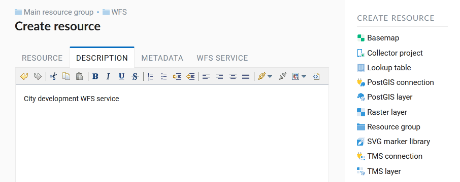

   WFS service description

On the "Metadata" tab you can enter information in the "key-value" format.

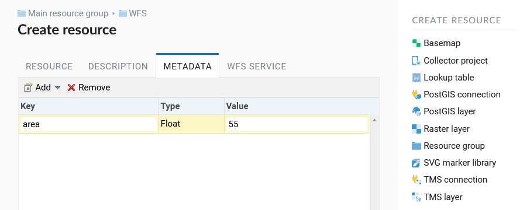

   WFS service metadata
 
Switch to "WFS service" tab, which is presented on :numref:`ngweb_admin_layers_create_wfs_service_url` and add required layers to a list (see :numref:`ngweb_admin_layers_create_wfs_service_url`).
For each layer you can set a limit for the number of features returned from the vector layer. By default the value is 1000. If this parameter is set to empty, the limit will be disabled and all features will be returned to the client. This may result in high server load and significant timeouts in case of large data volume.

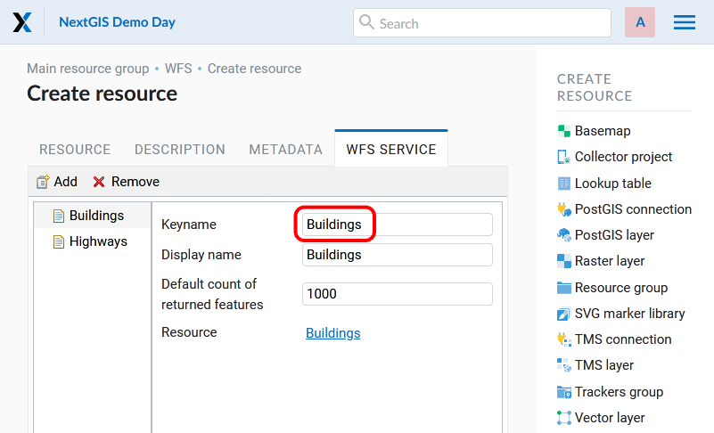

   WFS service tab of Create resource dialog

.. _ngw_service_using_wfs:

Using WFS service
^^^^^^^^^^^^^^^^^

After the resource is created, a URL for the WFS service is available. You can use it in other software, for example :program:`NextGIS QGIS`. 

You can set access permissions for WFS service if needed. See section :ref:`ngw_access_rights`.

WFS services can also be accessed with links of the following type (`basic auth <https://docs.nextgis.com/docs_ngweb_dev/doc/developer/auth.html>`_ is supported):

.. sourcecode:: http

   https://mywebgis.nextgis.com/api/resource/2413/wfs?SERVICE=WFS&TYPENAME=ngw_id_2412&username=administrator&password=mypassword&srsname=EPSG:3857&VERSION=1.0.0&REQUEST=GetFeature

.. _ngw_resources_group:

Creation of a Resource group
----------------------------

Resources can be arranged in groups. For example, you can have special groups for base layers, satellite images and topical data.

Groups help organize the layers in the Control panel and make it easier to manage access permissions. 

To create a resource group navigate to the group, where you want to create a new one (root group or another), and in the "Create resource" actions pane click **Resource group** (see :numref:`admin_layers_create_resource_group`). 

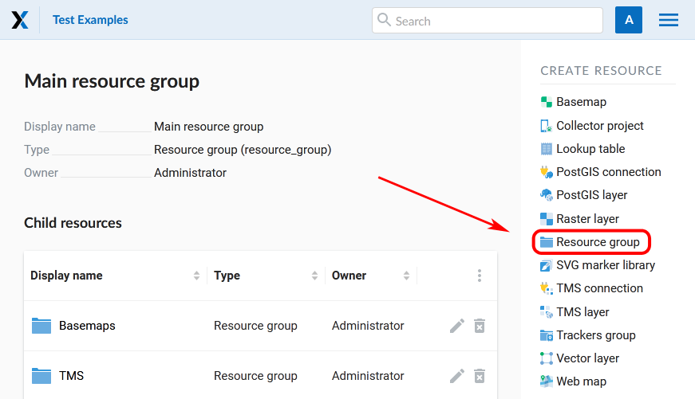

   Selection of "Resource group" action
    
Create resource dialog for resource group is presented on :numref:`admin_layers_create_group`.

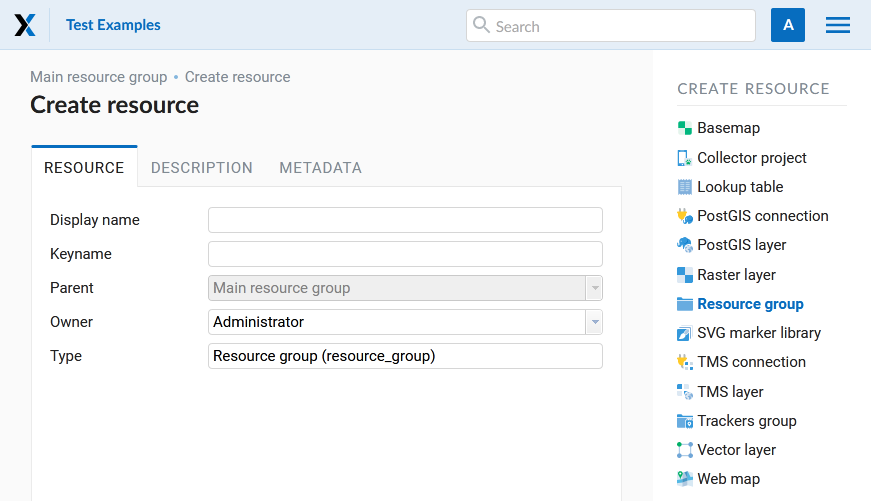

   Create resource dialog for resource group

In the opened dialog enter the name of the resource that will be displayed in the administrator interface and in the map layer tree, and then click **Create**. 

"Keyname" field is optional.

You can also add resource description and metadata on the corresponding tabs.

.. _ngw_create_lookup_table:

Lookup table
-------------

To create a lookup table navigate to the group, where you want to create it (root group or another), and in the "Create resource" actions pane click **Lookup table** (see :numref:`admin_layers_create_lookup_table`). 

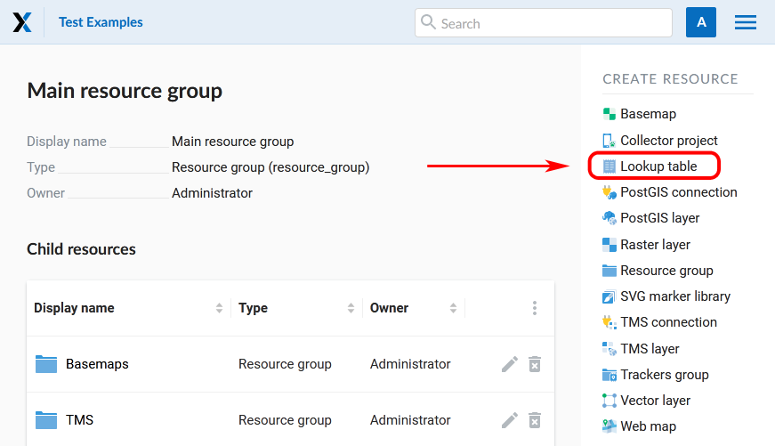

   Selection of "Lookup table" action
   
Create resource dialog for resource group is presented on :numref:`ngweb_admin_layers_create_lookup`.

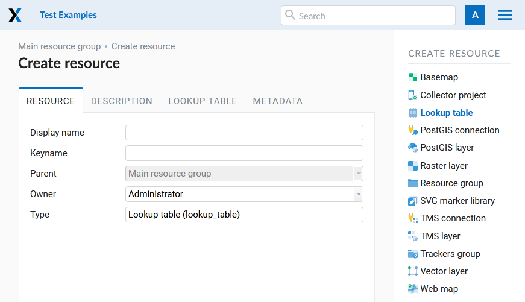

   Create resource dialog for lookup table

In the opened dialog enter a display name.

"Keyname" field is optional.

You can also add resource description and metadata on the corresponding tabs.

Switch from "Resource" tab to "Lookup table" tab, which is presented on :numref:`ngweb_creating_a_new_directory_group`.

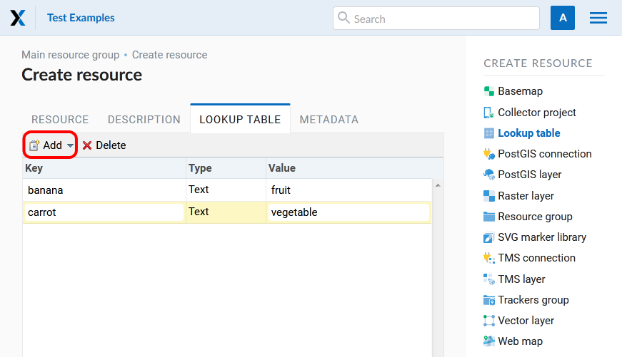

   Lookup table tab of Create resource dialog
   
In the opened window there are options "Add" and "Delete". Click **Add**, choose “Text” in the dropdown list and then add data in the “key-value” format. Then click **Save**. The window will then look as on :numref:`ngweb_new_resource_group`

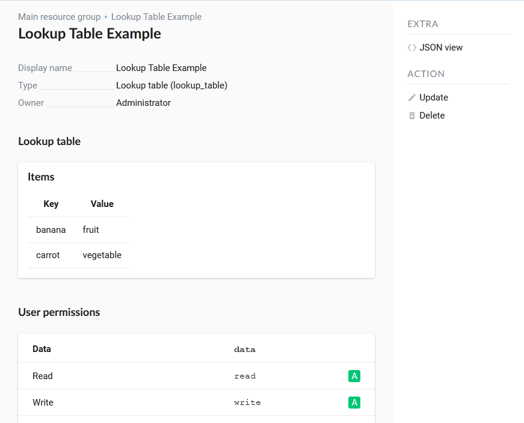

   Newly created lookup table

To change anything in a lookup table click **Update** in the "Action" pane. The resource update dialog will open. Switch to "Lookup table" tab where you can change the table's contents:

* add a new key-value pair
* change a current key-value pair
* delete a key-value pair

.. _ngw_create_svg_marker_lib:

SVG Marker Library
----------------------

In Web GIS you can create SVG marker libraries to be displayed using QGIS styles of vector layers. To create a library, select **SVG marker library** in the Create Resource actions pane on the right (see :numref:`select_svg_lib`).

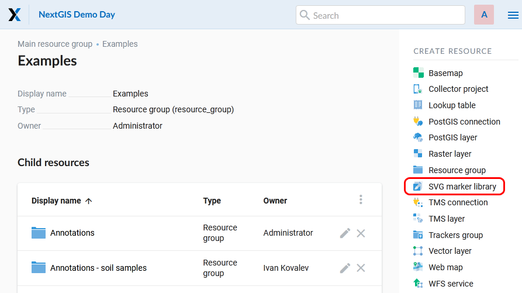
   
   Selecting SVG marker library

In the opened window, enter the name of the resource (see :numref:`name_svg_lib`).

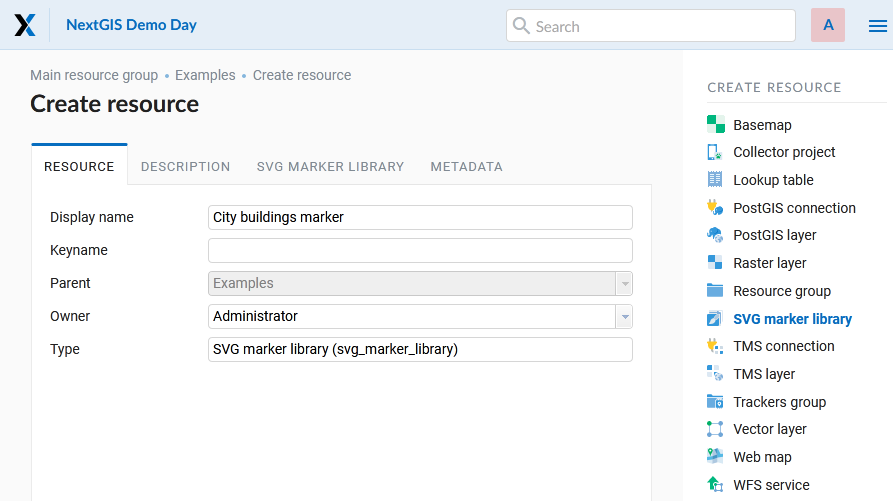

   SVG marker library name

Add description and metadata on the corresponding tabs if you need them.
In the SVG marker library tab you need to upload SVG markers from your device.
You can upload markers as individual files or as a zip-archive. The archive must contain markers only.
After all icons have been uploaded to the library, you will see the list of the file names. Click **Create** to complete the process (see :numref:`create_svg_lib`).

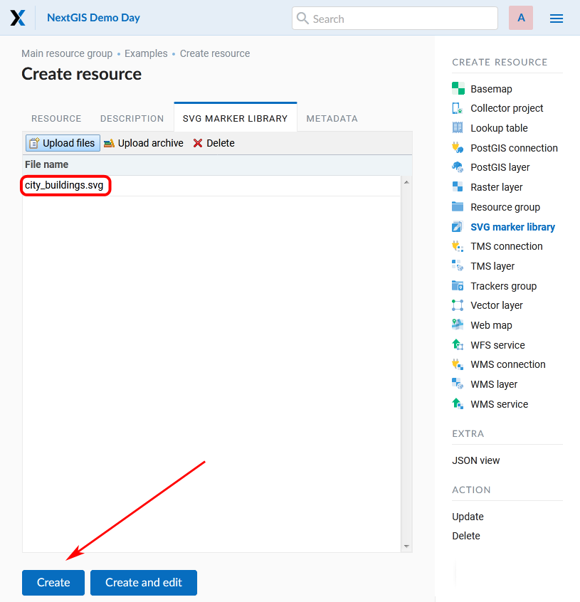
   
   Final steps of creating an SVG marker library
   
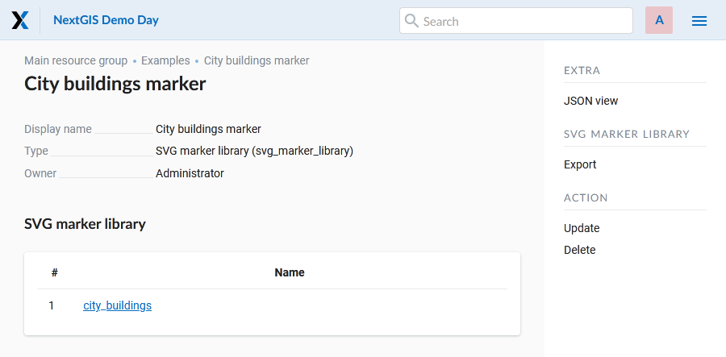
      
   List of SVG markers uploaded to the library

The process of adding marker libraries to vector layer styles is described `here <https://docs.nextgis.com/docs_ngweb/source/mapstyles.html#qgis-style>`_.

Typical structure
------------------

With NextGIS Web application experience we recommend the following typical structure for organizing resources.

Typical structure ::

  Main resource group
	Web Maps
		Master Web Map
		Test Web Map
	PostGIS connections
		PostGIS on server
	Data layers
		Base data
			Borders
			Infrastructure - linear features
			Accounting area
		Thematic data
			Results of measurements on accounting area
			Results of measurements on accounting routes
			Observation points for rare species
		Relief
			ASTER DEM
				DEM
				Isolines
		Topographic data
			Openstreetmap
				Roads
				Administrative borders
				Hydrology
				Railway stations
				Railway roads
				Landuse
			1 : 100000
				M-37-015
				M-37-016
				M-37-017
		Satellite imagery
			Landsat-8
			Ikonos
