.. sectionauthor:: Артём Светлов <artem.svetlov@nextgis.ru>

.. _ngw_create_layers:

Добавление ресурсов
===================

Одним из основных компонентов ПО NextGIS Web является слой. Слой - это растровое 
изображение или векторный файл (таблица БД). Для объединения слоев в виде карты 
необходимо настроить стиль (или набор стилей) отображения слоя.

Стили могут настраиваться только для векторных слоев.

Интерфейс добавления PostGIS, векторных и растровых слоев приблизительно одинаковый. 
Нужно ввести параметры слоя, затем добавить стиль.

Растровый слой
--------------

Для добавления растрового слоя перейдите в группу, где необходимо его создать. В 
блоке операций выберите :menuselection:`Добавить --> Растровый слой`. Откроется окно, 
представленное на :numref:`admin_layers_create_raster_layer_resourse_description`. 

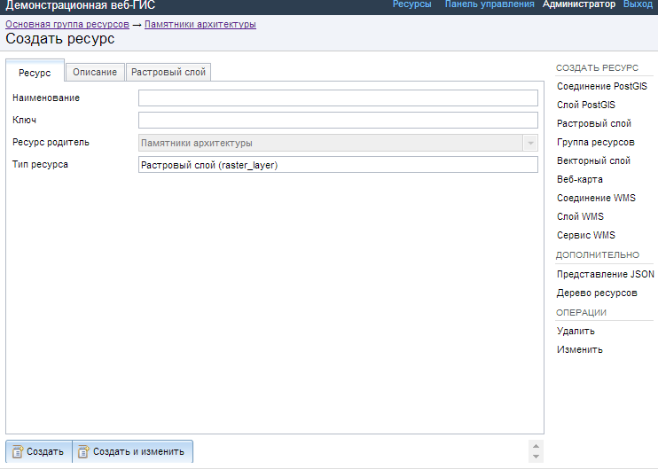

   Окно создания растрового слоя.

Введите наименование слоя, которое будет отображаться в административном веб интерфейсе, 
а также в дереве слоев карт.
Поля :guilabel:`Ключ` и :guilabel:`Описание` являются необязательными параметрами.

Переключитесь с вкладки :guilabel:`Ресурс` на вкладку :guilabel:`Растровый слой`. 
Откроется окно, представленное на :numref:`admin_layers_create_raster_layer_upload`.

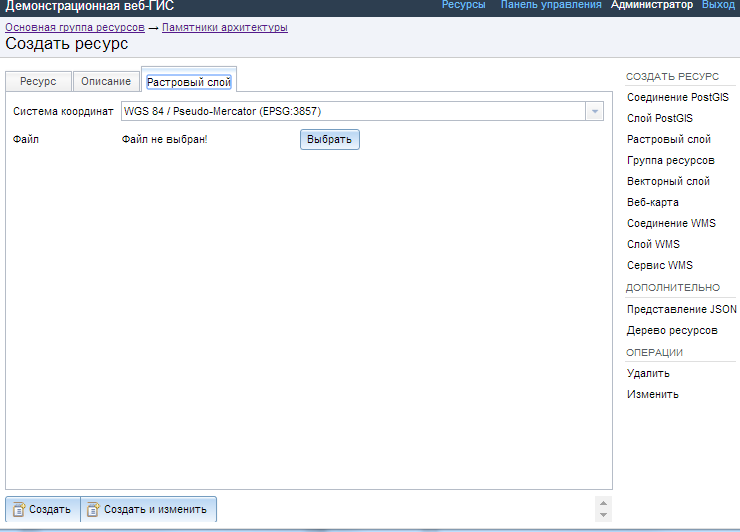

   Окно загрузки растрового файла.

Далее необходимо выбрать систему координат, в которую будет перепроецирован растр 
(по умолчанию имеется только WGS84 / Pseudo Mercator (EPSG:3857) ).
Далее необходимо указать сам файл. 

.. note:: 
   Файл может быть только формата GeoTIFF с 3 или 4 каналами (RGB или RGBA). 
 
После удачной загрузки растра необходимо создать стиль (если он не был создан автоматически). 
При создании карты (подробнее см. подразд. :ref:`ngw_map_create`) можно добавлять 
растр на карту, выбрав растр и его стиль.

Растровый слой с прозрачностью (обрезкой, альфа-каналом)
^^^^^^^^^^^^^^^^^^^^^^^^^^^^^^^^^^^^^^^^^^^^^^^^^^^^^^^^

Большинство утилит не создают альфа канал, а только добавляют значение NoData. 
Для преобразования значений NoData в альфа канал можно воспользоваться утилитой 
командной строки  :program:`gdalwarp`. Ниже приведен пример команды.

.. code:: shell

   gdalwarp -t_srs EPSG:3857 -multi -dstalpha -dstnodata none -wo \
   "UNIFIED_SRC_NODATA=YES" -co COMPRESS=JPEG \ 
   d:\temp\o\ast_20010730_010043_rgb.tif d:\temp\o\ast_20010730_010043_rgba.tif

.. note:: 
   В NextGIS Manager эту операцию можно сделать проще. В программе есть функционал 
   загрузки растра в NextGIS Web и обрезки по альфа-каналу. 

Растровый слой NextGIS Web можно добавлять в настольные, мобильные и веб ГИС несколькими способами.

**WMS**

NextGIS Web является сервером WMS. Соответственно подключить его слои как WMS можно 
в любом клиентском ПО поддерживающем слои WMS. Для этого нужно знать URL WMS-сервиса, который высвечивается на странице его настроек. Например:

.. code:: html

   http://demo.nextgis.ru/resource/60/wms?
   
Конкретные слои NextGIS Web можно подключать как WMS. Для использования их через утилиты GDAL нужно создать для 
необходимого слоя файл XML. Для создания такого файла нужно URL WMS-сервиса.
Эти параметры нужно подставить в строку ServerUrl примера ниже. Все остальное 
остается неизменным.

.. code:: xml

   <GDAL_WMS>
    <Service name="WMS">
        <Version>1.1.1</Version>
        <ServerUrl>http://176.9.38.120/practice2/api/resource/85/wms?</ServerUrl>
        <SRS>EPSG:3857</SRS>
        <ImageFormat>image/png</ImageFormat>
        <Layers>moscow_boundary_multipolygon</Layers>
        <Styles></Styles>
    </Service>
    <DataWindow>
      <UpperLeftX>-20037508.34</UpperLeftX>
      <UpperLeftY>20037508.34</UpperLeftY>
      <LowerRightX>20037508.34</LowerRightX>
      <LowerRightY>-20037508.34</LowerRightY>
      <SizeY>40075016</SizeY>
      <SizeX>40075016.857</SizeX>
    </DataWindow>
    <Projection>EPSG:3857</Projection>
    <BandsCount>3</BandsCount>
   </GDAL_WMS>

Пример вызова утилиты gdal. Она получает картинку из NGW по WMS, и сохраняет её в GeoTIFF

gdal_translate -of "GTIFF" -outsize 1000 1000  -projwin  4143247 7497160 4190083 7468902   ngw.xml test.tiff

**TMS**

Конкретные слои NextGIS Web можно подключать как TMS. Для этого нужно создать для 
необходимого слоя файл XML. Для создания такого файла нужно знать адрес где развернут 
NGW и номер нужного слоя (в примере: адрес - http://demo.nextgis.ru/ngw_kl, номер слоя - 5). 
Эти параметры нужно подставить в строку ServerUrl примера ниже. Все остальное 
остается неизменным.

.. code:: xml

   <GDAL_WMS>
    <Service name="TMS">
        <ServerUrl>http://demo.nextgis.ru/api/component/render/tile?
                   z=${z}&x=${x}&y=${y}&resource=5
        </ServerUrl>
    </Service>
    <DataWindow>
        <UpperLeftX>-20037508.34</UpperLeftX>
        <UpperLeftY>20037508.34</UpperLeftY>
        <LowerRightX>20037508.34</LowerRightX>
        <LowerRightY>-20037508.34</LowerRightY>
        <TileLevel>18</TileLevel>
        <TileCountX>1</TileCountX>
        <TileCountY>1</TileCountY>
        <YOrigin>top</YOrigin>
    </DataWindow>
    <Projection>EPSG:3857</Projection>
    <BlockSizeX>256</BlockSizeX>
    <BlockSizeY>256</BlockSizeY>
    <BandsCount>4</BandsCount>
    <Cache />
   </GDAL_WMS> 

Векторный слой из файла
-----------------------
Для добавления векторного слоя перейдите в группу, где необходимо его создать. 
В блоке операций :guilabel:`Создать ресурс` выберите из списка вкладку guilabel:`Векторный слой`. 
В открывшемся окне необходимо ввести Наименование слоя, которое будет отображаться 
в административном веб интерфейсе, а также в дереве слоев карты. 
Поля :guilabel:`Ключ` и :guilabel:`Описание` являются необязательными параметрами. 
Переключитесь с вкладки :guilabel:`Ресурс` на вкладку :guilabel:`Векторный слой`. 
Откроется окно, представленное на :numref:`admin_layers_create_vector_layer_resourse_description`. 

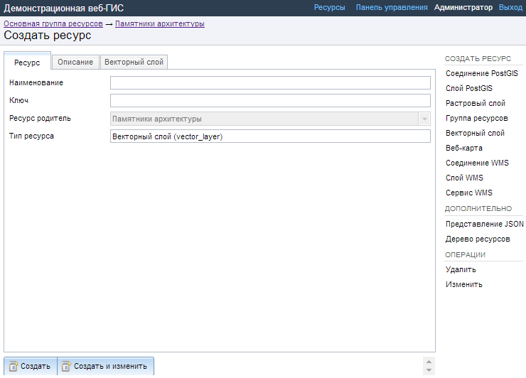

   Окно добавления векторного слоя.

Далее необходимо выбрать систему координат, в которую будет перепроецированы векторные
данные (по умолчанию имеется только WGS84 / Pseudo Mercator (EPSG:3857) ). 

Далее необходимо указать сам исходный файл (кнопка Выбрать,
см. :numref:`admin_layers_create_vector_layer_upload`).  
В качестве исходного файла можно загружать следующие форматы: 

* ESRI Shapefile;
* GeoJSON.

.. note:: 
   В случае ESRI Shapefile все составляющие его части (dbf, shp, shx, prj и др.) должны быть 
   упакованы в архив формата zip. 
   Шейп-файл должен быть в кодировке UTF-8 или Windows-1251.
   
   
Во входном файле не должно быть невалидных геометрий (в QGIS соответствующий 
инструмент должен выдавать пустой список невалидных геометрий), даты не должны 
иметь значения NULL, не должно быть полей с названиями: *id (ID), type(TYPE), source(SOURCE)*.
   
Cистема координат геометрий должна распознается GDAL (вывод gdalinfo должен содержать описание СК). 

.. figure:: _static/admin_layers_create_vector_layer_upload.png
   :name: admin_layers_create_vector_layer_upload
   :align: center
   :width: 16cm

   Окно загрузки векторного слоя.

Кроме того, необходимо указать кодировку, в которой записаны атрибуты.
Если кодировка не указана, то данные в ESRI Shapefile должен сопровождать файл с 
описание кодировки (расширение cpg). В случае GeoJSON кодировка всегда UTF-8.

После удачной загрузки векторного файла необходимо создать стиль. 
Подробнее о создании стилей описано в подразд. :ref:`ngw_style_create`.

При создании карты (подробнее см. подразд. :ref:`ngw_map_create`) можно добавлять 
векторный слой на карту, указывая его стиль.

.. note:: 
   В NextGIS Manager эту операцию можно сделать проще. В программе есть функционал
   загрузки в NextGIS Web векторных файлов разных форматов, без необходимости 
   отдельного архивирования. 

Векторный слой из PostGIS
-------------------------

Для добавления векторного слоя из БД PostgreSQL с модулем расширения PostGIS необходимо 
сначала создать ресурс — соединение с PostGIS. Вам достаточно создать одно подключение. 
В блоке операций выберите :menuselection:`Добавить --> Cоединение с PostGIS`. Откроется окно, представленное на :numref:`admin_layers_create_postgis_connection_resourse_description`. 

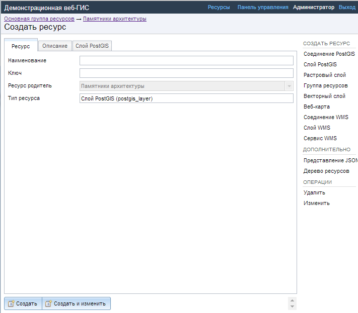

   Окно добавления соединения PostGIS.

Введите наименование подключения, которое будет отображаться в административном 
веб интерфейсе. Не путайте потом это название и название слоёв в базе данных. 

Поля :guilabel:`Ключ` и :guilabel:`Описание` являются необязательными параметрами.  

Переключитесь с вкладки :guilabel:`Ресурс` на вкладку :guilabel:`Cоединение с PostGIS`. 
Откроется окно, представленное на :numref:`admin_layers_create_postgis_connection_db_logins`. 

Далее необходимо ввести параметры подключения к базе данных PostGIS, из которой 
будут отображаться ваши данные.  

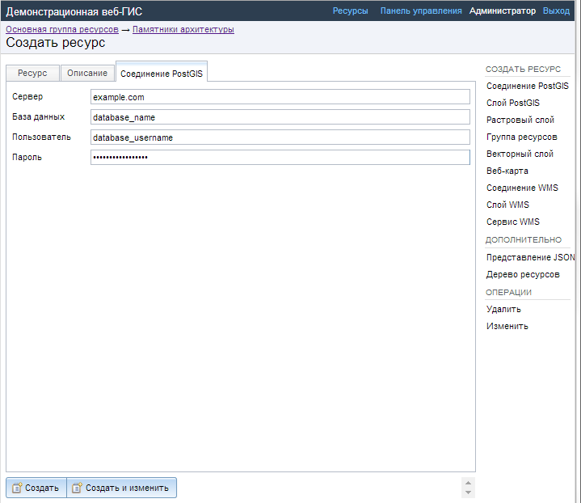

   Окно параметров соединения с PostGIS.

Далее можно приступать к добавлению отдельных слоёв PostGIS. Перейдите в группу, 
где необходимо их создать. В блоке операций выберите :menuselection:`Добавить --> Слой PostGIS`. 
Откроется окно, представленное на :numref:`admin_layers_create_postgis_layer_resourse_description`. 

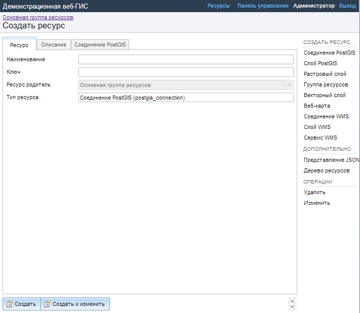

   Окно добавления слоя PostGIS.

Введите наименование слоя, которое будет отображаться в административном веб интерфейсе, 
а также в дереве слоев карты. 
Поля :guilabel:`Ключ` и :guilabel:`Описание` являются необязательными параметрами.  
Переключитесь с вкладки :guilabel:`Ресурс` на вкладку :guilabel:`Слой с PostGIS`. 
Откроется окно, представленное на :numref:`admin_layers_create_postgis_layer_tablename`. 

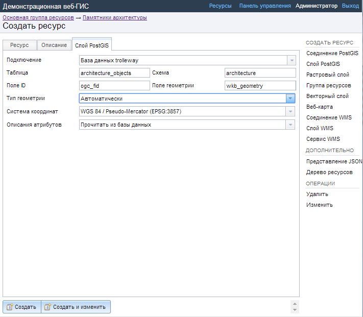

   Окно параметров слоя PostGIS.

Далее необходимо:

#. Из выпадающего списка выбрать подключение к БД (cоздание описано в этом же пункте, чуть выше).
#. Ввести схему БД, в которой находится слой PostGIS. 
	В одной базе данных PostgreSQL может быть несколько схем, внутри каждой схемы лежат таблицы и представления. Если схема одна, то она называется public. Подробнее смотрите в руководствах по :program:`СУБД PostgreSQL`.
#. Ввести название таблицы (слоя PostGIS). 
	Вам потребуется знать названия ваших таблиц и полей в базе данных. 
	Отображение таблиц и представлений не входит в задачи NextGIS Web. Для просмотра можно воспользоваться :program:`NextGIS Manager` или :program:`PgAdmin`.
#. Ввести поле ID. 
	При загрузке данных в PostGIS через NextGIS Manager обычно создается поле с названием ogc_fid, при загрузки иным способом название поля может отличаться.
	Поле ID должно удовлетворять ограничениям на тип данных: быть числовым (**numeric**) и являться первичным ключом.
#. Ввести имя поля геометрии (при загрузке данных в PostGIS через :program:`NextGIS Manager`  обычно создается поле геометрии с названием wkb_geometry, при загрузки иным способом название поля может отличаться).
#. Поля :guilabel:`Тип геометрии`, :guilabel:`Система координат` и :guilabel:`Описание атрибутов` не обязательными и могут быть оставлены по-умолчанию.

Программное обеспечение NextGIS Web поддерживает добавление таблиц, в которых в 
поле геометрии хранятся совместно точечные, линейные и полигональные геометрии. 
Это необходимо для отображения специфических наборов данных: например, если в одной 
таблице хранятся координаты городских парков в виде полигонов и мусорных урн в виде 
точек. В этом случае в NextGIS Web нужно добавить три отдельных слоя для каждого 
типа геометрии, и выбрать нужный элемент в поле :guilabel:`Тип геометрии`.

После создания слоя для отображения подписей к геометриям необходимо задать атрибут 
наименования. Для этого зайдите на страницу редактирования слоя и выберите нужное поле в списке :guilabel:`Атрибут наименования`.

Если в БД были изменены какие либо данные, касающиеся структуры (названия или типы полей, 
изменен их состав, переименованы таблицы и т. п.), то в свойствах соответствующего 
слоя необходимо обновить описания атрибутов. Для этого, следует выбрать :menuselection:`Редактирование слоя --> Описания атрибутов --> Прочитать` из базы данных нажать :guilabel:`Сохранить`.

Создание слоя с условиями
^^^^^^^^^^^^^^^^^^^^^^^^^

В :program:`NextGIS Web` нельзя указывать условия отбора записей из слоя (SQL конструкция WHERE). 
Это делается для обеспечения безопасности (исключения атак SQL Injection). Для обеспечения такой возможности необходимо в БД создать представления с соответствующими условиями отбора.

Для этого необходимо подключится к БД PostgreSQL/PostGIS при помощи :program:`pgAdminIII`, 
перейти в схему данных, где следует создать представление и в элементе дерева :guilabel:`представления` правой клавишей мыши вызвать контекстное меню и выбрать :guilabel:`Создать новое представления` (см. :numref:`pgadmin3`. п. 1). Также диалог можно вызвать правым кликом на названии схемы, выбрав :menuselection:`Новый объект --> Новое представление`.
Далее в открывшемся диалоге необходимо указать:

#. Название представления (вкладка «Свойства»).
#. Схему данных, в которой необходимо создать представление (вкладка «Свойства»).
#. Необходимый SQL запрос (вкладка «Определение»).

.. figure:: _static/pgadmin3.png
   :name: pgadmin3
   :align: center
   :width: 16cm

   Главное окно ПО :program:`pgAdminIII`.

   Цифрами на рисунка обозначено: 1. – Дерево элементов базы данных; 2 – кнопка 
   открытия таблицы (активна при выделенной таблице); 3 – содержимое запроса в 
   представлении.

После этого, не выходя из :program:`pgAdminIII`, можно открыть представление для 
проверки корректности введенного SQL запроса (см. :numref:`pgadmin3`. п. 2). 

Cлой WMS
--------

Программное обеспечение NextGIS Web является клиентом WMS. Для подключения слоя WMS 
необходимо знать его адрес. Сервер WMS, предоставляющий подключаемый слой, должен 
отдавать его в том числе в системе координат EPSG:3857. Проверить наличие этой системы 
координат для подключаемого слоя можно, сделав запрос GetCapabilites к серверу и 
посмотрев результат.Например, слой WMS, предоставляемый Geofabrik (GetCapabilities), 
умеет отдавать данные в EPSG:4326 и EPSG:900913. Хотя фактически EPSG:900913 и EPSG:3857 - это одно и то же, но NGW запрашивает данные в 3857, а этот сервер WMS такую проекцию не поддерживает.

Для добавления слоя WMS необходимо сначала создать ресурс — соединение WMS. Вам 
достаточно создать одно подключение для множества слоёв. В блоке операций 
выберите :menuselection:`Добавить --> Cоединение с WMS`. Откроется окно представленное на :numref:`admin_layers_create_wms_connection_description`.

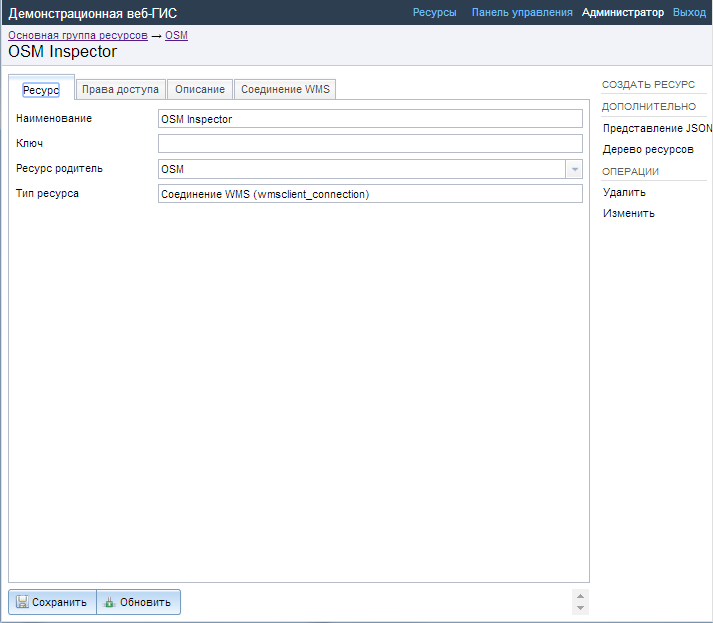

   Окно добавления подключения WMS.

Введите наименование подключения, которое будет отображаться в административном 
веб интерфейсе. Не путайте потом это название с названием отдельных слоёв. 
Поля :guilabel:`Ключ` и :guilabel:`Описание` являются необязательными параметрами.
 
Переключитесь с вкладки :guilabel:`Ресурс` на вкладку :guilabel:`Cоединение WMS`. 
Откроется окно, представленное на :numref:`admin_layers_create_wms_connection_url`.
Далее необходимо ввести параметры подключения к WMS-серверу, из которого будут 
отображаться ваши данные.  

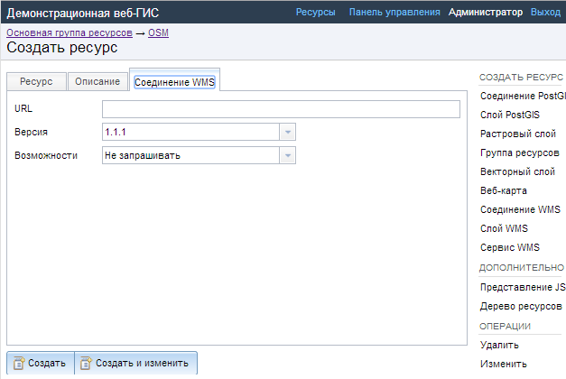

   Окно параметров соединения с WMS.

Далее можно приступать к добавлению отдельных слоёв WMS.
Перейдите в группу, где необходимо создать слой WMS. В блоке операций выберите :menuselection:`Добавить --> слой WMS`. Откроется окно, представленное на :numref:`admin_layers_create_wms_layer_name`.

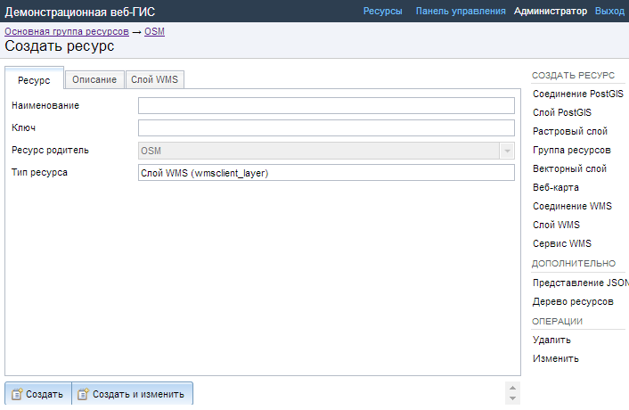

   Окно параметров слоя WMS.

Введите наименование слоя, которое будет отображаться в административном веб интерфейсе, 
а также в дереве слоев карты. 
Поля :guilabel:`Ключ` и :guilabel:`Описание` являются необязательными параметрами. 
Переключитесь с вкладки :guilabel:`Ресурс` на вкладку :guilabel:`Cлой WMS`. 
Откроется окно, представленное на :numref:`admin_layers_create_wms_layer_parameters`.

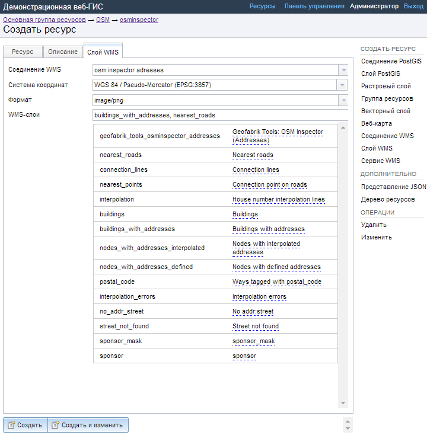

   Окно настройки параметров слоя WMS.

Далее необходимо:

1. Выбрать подключение WMS, которое было создано ранее.
2. Выбрать систему координат, в которой запрашивать данные у WMS-сервера 
   (по-умолчанию имеется только WGS84 / Pseudo Mercator (EPSG:3857) ).
3. Если параметры подключения указаны верно, то в поле :guilabel:`Формат` выведется 
   список MIME-типов данных, предоставляемых сервером. Выберите подходящий вам формат.
4. Если параметры подключения указаны верно, то в поле :guilabel:`WMS-слои` выведется 
   список слоёв, предоставляемых сервером. Выберите те слои, которые вам нужны, нажимая 
   по подчёркнутым названиям. Можно выбрать несколько слоёв.

Параметры для добавления WMS-слоя с ПКК (публичной кадастровой картой Росреестра РФ)

URL http://maps.rosreestr.ru/arcgis/services/Cadastre/CadastreWMS/MapServer/WMSServer?request=GetCapabilities&service=WMS

Версия 1.1.1. 

Сервис WMS
----------

Программное обеспечение NextGIS Web может работать как сервер WMS. По этому протоколу 
клиенты запрашивают картинку карты по заданному охвату. 
Для развёртывания WMS-сервиса необходимо добавить ресурс. В блоке операций выберите :menuselection:`Добавить --> WMS-сервис`. Откроется типовое окно.
Введите наименование слоя, которое будет отображаться в административном веб интерфейсе, 
а также в дереве слоев карты. 
На вкладке Сервис WMS добавьте в список ссылки на стили нужных вам слоёв. Для каждого 
добавленого стиля вам нужно указать уникальный ключ. Можно скопировать его из названия. 

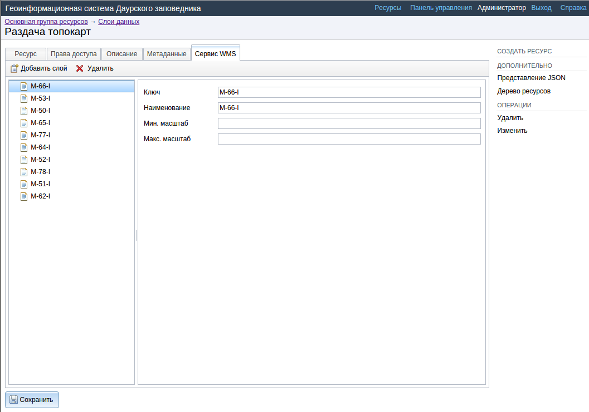

   Пример настроек WMS-сервиса для раздачи отдельных листов топокарт. 

После создания ресурса вам выведется сообщение с URL WMS-сервиса, который вы можете 
использовать в других программах, например NextGIS QGIS, или JOSM. 
Далее необходимо настроить права доступа к WMS-сервису. См. главу :ref:`ngw_access_rights`.

.. _ngw_wfs_service:

Cервис WFS
----------

Настройка сервиса WFS осуществляется так же, как для WMS-сервиса, только добавляется 
не стиль, а слой.

Детальнее:

NextGIS Web может работать как сервер WFS. По этому протоколу сторонние программы 
могут изменять векторные данные на сервере.
Для развёртывания сервиса WFS необходимо добавить ресурс. В блоке операций выберите :menuselection:`Добавить --> WFS-сервис`. Откроется типовое окно.
Введите наименование слоя, которое будет отображаться в административном веб интерфейсе, 
а также в дереве слоев карты. 
На вкладке Сервис WFS добавьте в список ссылки на нужные вам слои. Для каждого 
добавленного слоя вам нужно указать уникальный ключ. Можно скопировать его из названия (см. :numref:`ngweb_admin_layers_create_wfs_service_layers_pic`). 

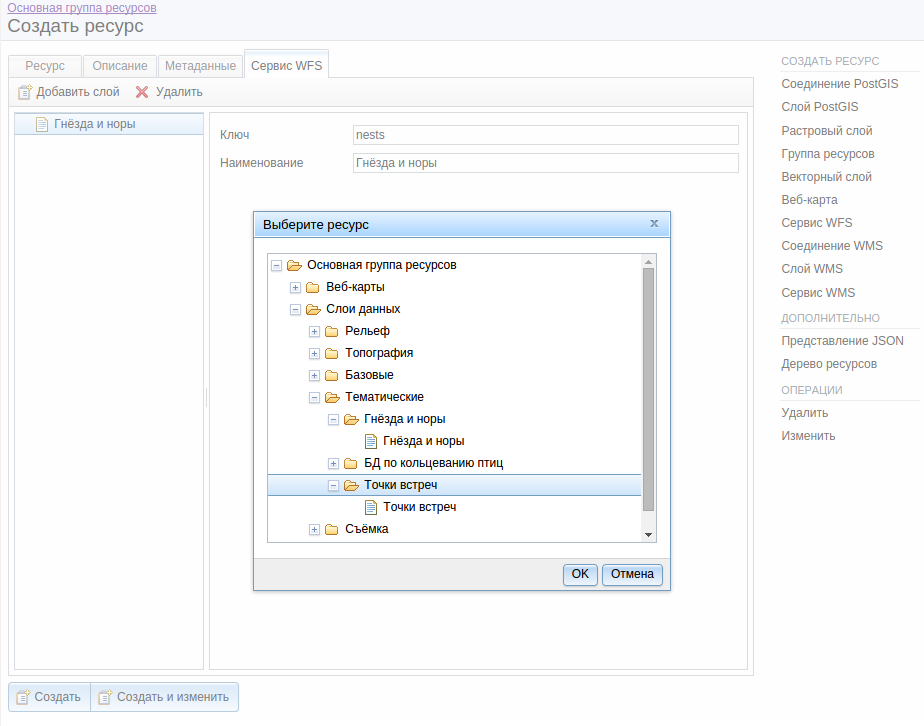
   
   Пример настроек WFS-сервиса для раздачи отдельных листов топокарт. 

Для каждого слоя так же можно задать ограничение на количество передаваемых объектов за раз. 
По умолчанию это значение равно 1000. Если в этом поле значение убрать совсем, то 
ограничение будет снято и будут передаваться все объекты. Однако, это может привести 
к значительной нагрузке на сервер и значительным задержкам при передаче больших объемов данных.

После создания ресурса вам нужно перезайти в этот ресурс в админке. После этого выведется сообщение с URL WFS-сервиса, который вы можете использовать в других программах, например NextGIS QGIS. 
Далее необходимо настроить права доступа к WFS-сервису. См. главу :ref:`ngw_access_rights`.

Создание группы ресурсов
------------------------

Ресурсы можно объединять в группы. Например, в одну группу можно сложить базовые данные, 
в другую группу –  космические снимки, в третью – тематические данные и т.д.

Группы служат для удобной организации слоев в панели управления, а также для удобного 
назначения прав доступа. 

Для создании группы ресурсов необходимо перейти в ту группу (корневая или др.) и 
в панели операций выбрать :menuselection:`Создать ресурс --> Группа ресурсов`. 
При этом откроется окно, представленное на :numref:`admin_layers_create_group`.

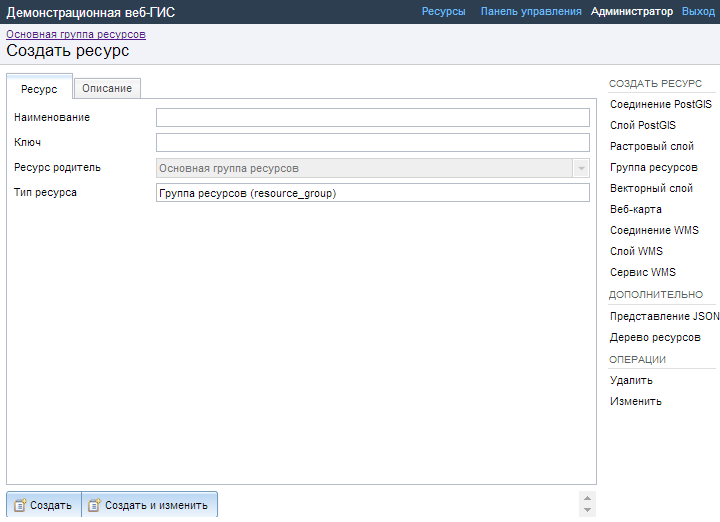

   Окно создания группы ресурсов.

В открывшемся окне необходимо указать:

* Название группы
* :guilabel:`Ключ` – поле можно оставить пустым
* :guilabel:`Описание` – поле можно оставить пустым

И нажать :guilabel:`Создать`.

Типовая структура
-----------------

С учетом опыта использования NextGIS Web рекомендуется следующая типовая структура 
организации ресурсов.

Типовая структура ::

  Основная группа ресурсов
	Веб-карты
		Основная веб-карта
		Тестовая веб-карта
	Подключения PostGIS
		PostGIS на сервере
	Слои данных
		Базовые данные
			Границы объектов
			Инфраструктура - линейные объекты
			Учётные площадки
		Тематические данные
			Результаты замеров на учётных площадках
			Результаты замеров на учётных маршрутах
			Точки встреч редких видов
		Рельеф
			ASTER DEM
				ЦМР
				Изолинии
		Топографические данные
			Openstreetmap
				Автодороги
				Административные границы
				Гидросеть
				Железнодорожные станции
				Железные дороги
				Землепользование
			1 : 100000
				M-37-015
				M-37-016
				M-37-017
		Съёмка
			Landsat-8
			Ikonos
