.. sectionauthor:: Artem Svetlov <artem.svetlov@nextgis.ru>
.. sectionauthor:: Roman Gainullov <roman.gainullov@nextgis.com>

.. _ngw_create_layers:

Adding resources
================

NextGIS Web is built on a **resource-based** approach - each component of the system (layer, group, service) is a resource.
One of these resources is a **layer** - a raster image or vector file (database table).

An **unlimited** number of **styles** can be created for each layer - ways of visualizing geodata on a web map.

Interface for adding of PostGIS layers, vector and raster layers is practically the same. 
First, you specify the parameters for the layer, and then you add a style that renders data on the web map.

.. _ngw_create_basemap:

Basemap
--------

In the actions pane "Create resource" click "Basemap" (:numref:`ngweb_admin_create_basemap`).
In the opened window enter the name of the resource that will be displayed in the administrative interface (:numref:`ngweb_admin_basemap_name`).

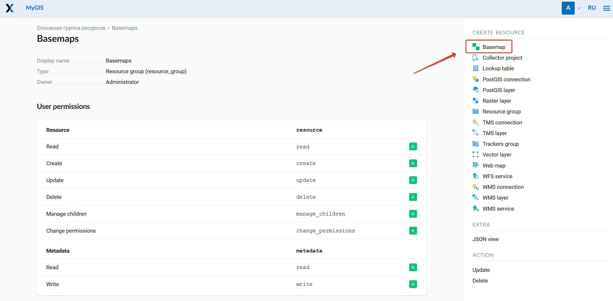

   Selection of "Basemap" action
   
   
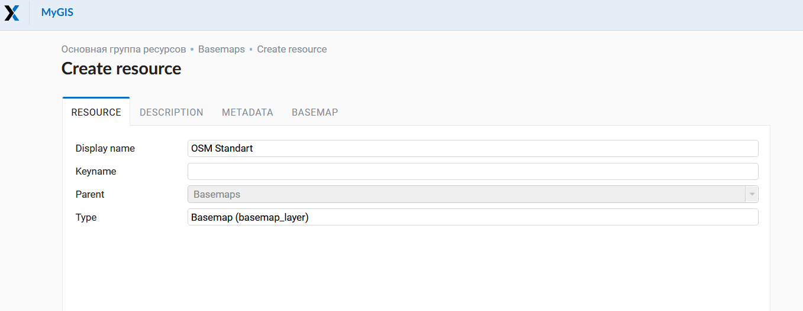

   Basemap name
   
   
The "Description" and "Metadata" of the resource is configured on the corresponding tabs (:numref:`ngweb_admin_basemap_desc`).

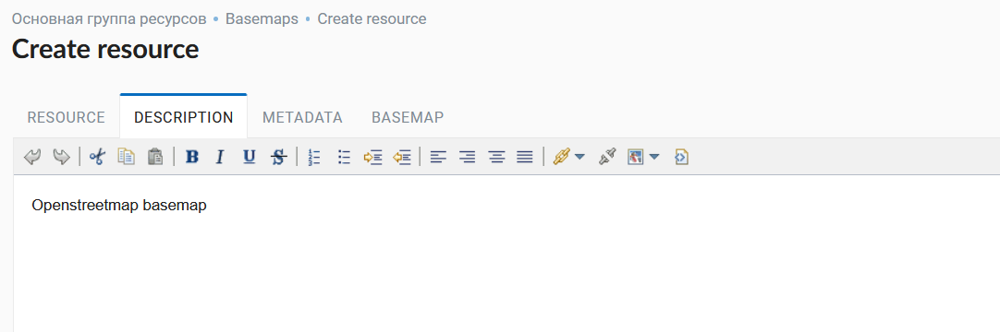

   Basemap description
   

On the "Basemap" must be given the URL-address of the TMS service (:numref:`ngweb_admin_basemap_param`). There are two ways to specify it:

* Use options from `QMS <https://qms.nextgis.com/>`_. If this flag is set then you need to find the required service in the search bar.
* Enter the address manually. Works if the QMS flag is unchecked.

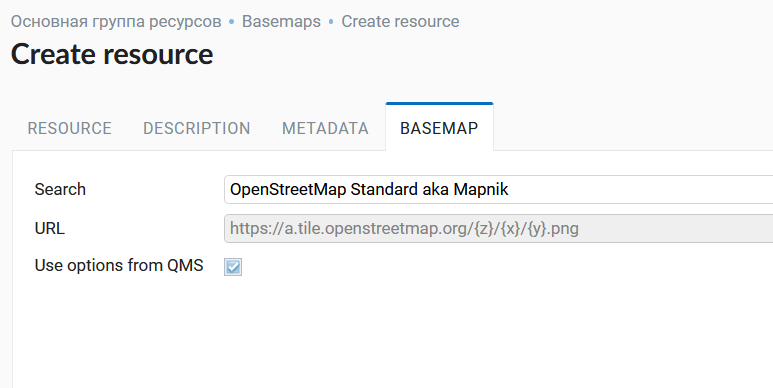

   Basemap settings

.. _ngw_create_raster_layer:

Raster layer
------------

Raster images in NextGIS Web should be loaded using the "Raster Layer" special resource.

.. _ngw_process_create_raster_layer:

Creation process
^^^^^^^^^^^^^^^^

To add a raster layer navigate to a group where you want to create it. In the actions pane "Create resource" click "Raster layer" (see :numref:`ngweb_admin_layers_create_raster_layer`). 

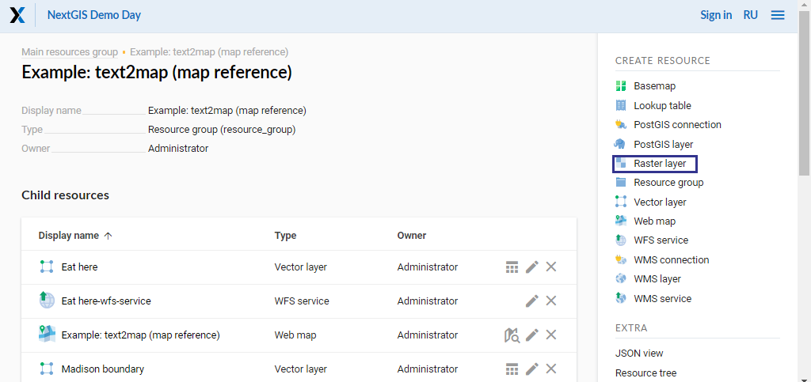

   Selection of "Raster layer" action
   
In the dialog box specify the name of the raster layer (see :numref:`ngweb_admin_layers_create_raster_layer_resourse_name`).
It will be displayed in the admin interface. The "Key" field is optional.

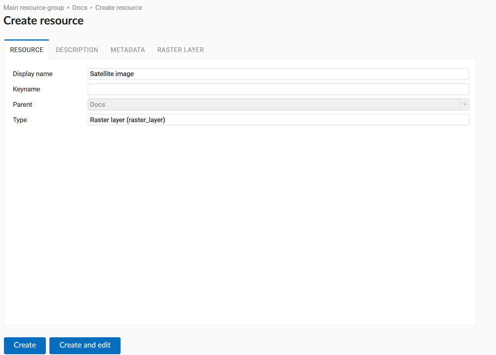

   Raster layer name

On the "Description" tab you can add any text describing the content of this layer (:numref:`ngweb_admin_layers_create_raster_layer_resourse_description`).

.. figure:: _static/ngweb_admin_admin_layers_create_raster_layer_resourse_description_eng.png
   :name: ngweb_admin_layers_create_raster_layer_resourse_description
   :align: center
   :width: 20cm

   Description raster layer

In the "Metadata" you can write information in the "key-value" format (:numref:`ngweb_admin_layers_create_raster_layer_resourse_metadata`).

.. figure:: _static/ngweb_admin_admin_layers_create_raster_layer_resourse_description_metadata_eng.png
   :name: ngweb_admin_layers_create_raster_layer_resourse_metadata
   :align: center
   :width: 20cm

   Metadata raster layer
   
   
On the "Raster layer" tab you need to upload a geodata file in GeoTIFF format.
Depending on the tariff plan the dialog indicates the maximum size of uploaded file (:numref:`ngweb_admin_layers_create_raster_layer_upload`).

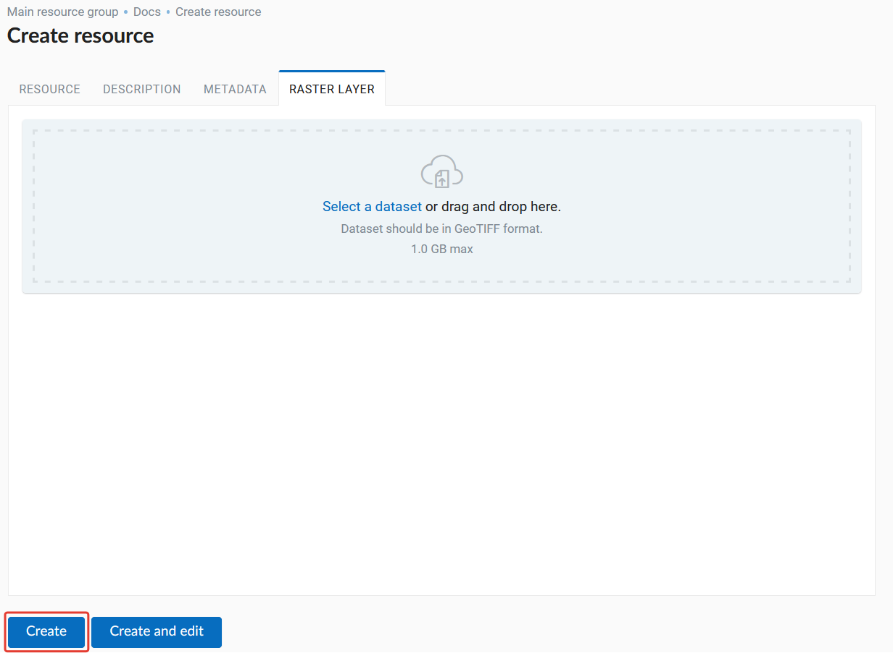

   Tab upload raster file  

After uploading a file, click the **Create** button.

.. _ngw_process_create_raster_style:

Raster style (QGIS)
^^^^^^^^^^^^^^^^^^^

After a raster file is successfully uploaded and raster layer is created you need to create a QGIS style.
This procedure is similar to adding vector layer `style <https://docs.nextgis.com/docs_ngweb/source/mapstyles.html#qgis-style>`_. You can create one in NextGIS QGIS.
You will need this style to add the raster to a Web map when creating one (for more information see subsection :ref:`ngw_map_create`).

Raster layer with transparency (clip or alpha channel)
^^^^^^^^^^^^^^^^^^^^^^^^^^^^^^^^^^^^^^^^^^^^^^^^^^^^^^^^

Most of utilities does not create alpha channel and only add a NoData value. 
To transform NoData value to alpha channel use a command line utility 
:program:`gdalwarp`. Here is an example of this command.

.. code:: shell

   gdalwarp -t_srs EPSG:3857 -multi -dstalpha -dstnodata none -wo \
   "UNIFIED_SRC_NODATA=YES" -co COMPRESS=JPEG \ 
   d:\temp\o\ast_20010730_010043_rgb.tif d:\temp\o\ast_20010730_010043_rgba.tif
   

.. _ngw_create_vector_layer:

Vector layer from file
-----------------------
You can create vector layers based on :term:`ESRI Shape`, :term:`GeoJSON`, :term:`KML` and :term:`GML` formats in NextGIS Web.

.. _ngw_process_create_vector_layer:

Creation process
^^^^^^^^^^^^^^^^
Navigate to the resource group (folder) in which to create a vector layer.
In the "Create resource" action block select "Vector layer" (see :numref:`ngweb_admin_layers_create_vector_layer`).

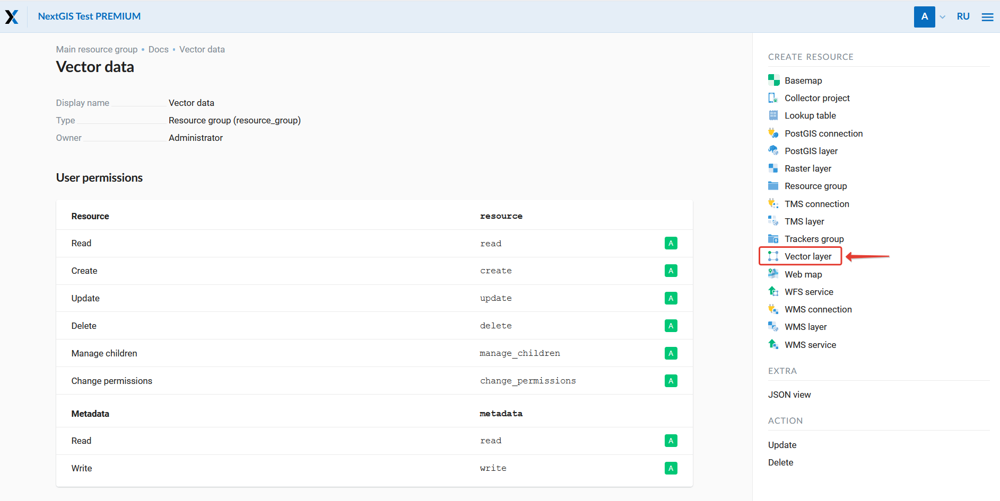

   Selection of "Vector layer" action

In the opened tab, enter the name of the vector layer (:numref:`ngweb_admin_layers_create_vector_layer_resourse_name`).
It will be displayed in the admin interface. The "Key" field is optional.

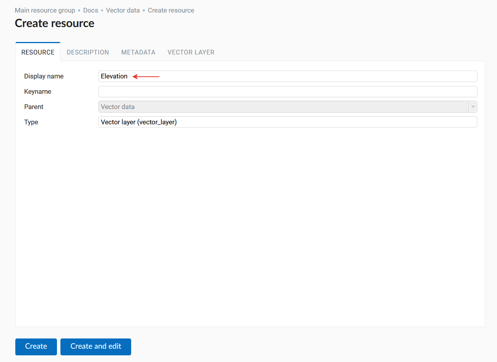

   Vector layer name

On the "Description" tab you can add any text describing the content of this layer (:numref:`ngweb_admin_layers_create_vector_layer_resourse_description`).

.. figure:: _static/ngweb_admin_layers_create_vector_layer_resourse_description_eng.png
   :name: ngweb_admin_layers_create_vector_layer_resourse_description
   :align: center
   :width: 20cm

   Description vector layer

In the "Metadata" you can write information in the "key-value" format (:numref:`ngweb_admin_layers_create_vector_layer_resourse_metadata`).

.. figure:: _static/ngweb_admin_layers_create_vector_layer_resourse_metadata_eng.png
   :name: ngweb_admin_layers_create_vector_layer_resourse_metadata
   :align: center
   :width: 20cm

   Metadata vector layer

On the "Vector Layer" tab you need to upload a geodata file :term:`ESRI Shape` (zip-archive), :term:`GeoJSON`, :term:`KML` or :term:`GML` format. Depending on the tariff plan the dialog indicates the maximum size of uploaded file (:numref:`ngweb_admin_layers_create_vector_layer_upload`).

Below it is proposed to define advanced options for creating a vector layer. Depending on the quality of the data you can handle geometry errors when uploading a file as follows:

* Not fix errors 
* Fix whatever is possible
* Fix without losing data

Next - the type of geometry, the presence/absence of multigeometries, Z-coordinates and the source of the FID (FID field, determine automatically or indicate from a particular field) are indicated.
There are two encodings to choose from - Unicode UTF-8 or Cyrillic Windows-1251. If ESRI Shapefile contains a file with encoding description [extension .cpg] then it will be taken into account when loading. For GeoJSON format encoding must always be UTF-8. `More about this <https://docs.nextgis.com/docs_ngweb/source/vect_layer_upload_params.html>`_

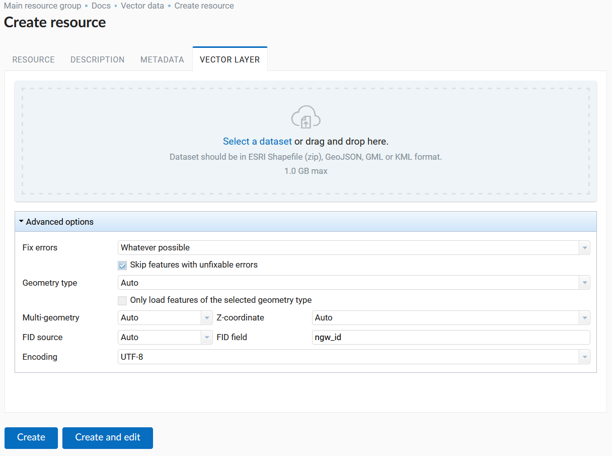

   Vector file upload tab

After uploading the file and specifying the parameters click the **Create** button.
Then you can create a `style <https://docs.nextgis.com/docs_ngweb/source/mapstyles.html#qgis>`_ that will later visualize the data layer on a `web map <https://docs.nextgis.com/docs_ngweb/source/webmaps_admin.html#ngw-map-create>`_.

.. _ngw_vector_data_requirements:

Initial data requirements
^^^^^^^^^^^^^^^^^^^^^^^^^

Source files could be in the following formats: 

* :term:`ESRI Shape`
* :term:`GeoJSON`
* :term:`KML`
* :term:`GML`

.. note:: 
   In case of ESRI Shapefile all components (dbf, shp, shx, prj and other files) 
   should be compressed to a zip-archive. Shapefile should have UTF-8 or 
   Windows-1251 encoding.
  
   
.. warning::
   Output file should not have attribute names: *id (ID), geom(GEOM)*.

.. _ngw_create_postgis_layer:

Vector layer from PostGIS
-------------------------

To add a vector layer from database PostgreSQL with PostGIS extension you need to create a
resource PostGIS connection. It is enough to create one connection. 
In actions pane "Create resource" click "PostGIS connection" (see :numref:`admin_layers_create_postgis_connection_resourse`). 

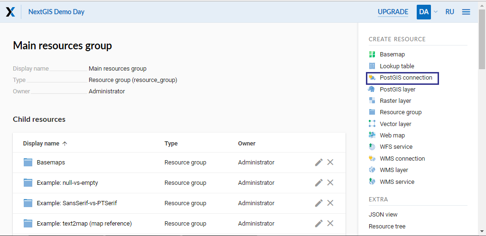

   Selection of "PostGIS connection" action.
 
Create PostGIS connection dialog is shown on :numref:`admin_layers_create_postgis_connection_resourse_description`

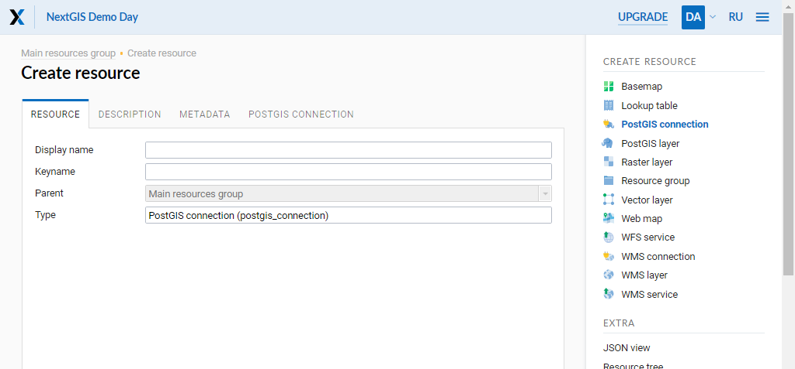

   Create resource dialog for PostGIS connection.

Enter display name that will be visible in administrator interface. Do not 
confuse this name with a name of layers in a database. 

Field "Keyname" is optional.

You can also add resource description and metadata on the corresponding tabs.

Switch from "Resource" to "PostGIS connection" tab, which is presented on :numref:`admin_layers_create_postgis_connection_db_logins`. 

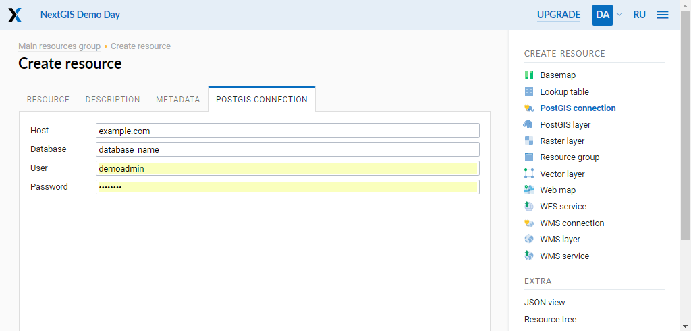

   PostGIS connection tab of Create resource dialog.

Here enter PostGIS database connection parameters to connect data for display.  

Then you can add single PostGIS layers. Navigate to a group where you want create 
layers and in actions pane "Create resource" select "PostGIS layer" (see :numref:`admin_layers_create_postgis_layer`).

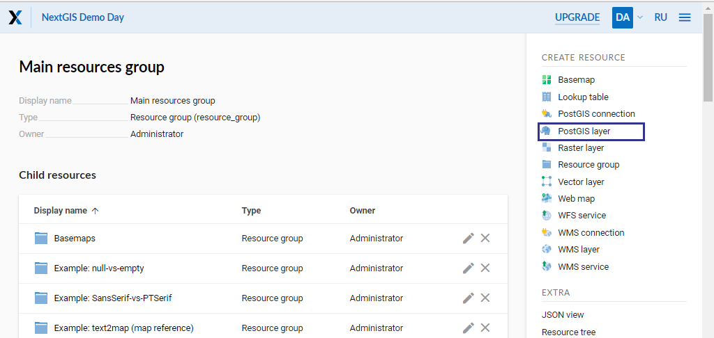

   Selection of "PostGIS layer" action.
   
Create resource dialog for PostGIS layer is presented on :numref:`admin_layers_create_postgis_layer_resourse_description`

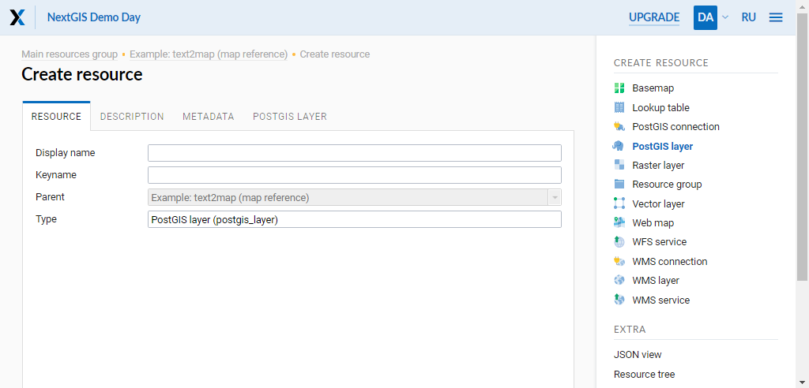

   Create resource dialog for PostGIS layer.

Enter display name that will be visible in administrator interface and in map 
layer tree. 

Field "Keyname" is optional.

You can also add resource description and metadata on the corresponding tabs.

Switch from "Resource" tab to "PostGIS layer" tab, which is presented on 
:numref:`admin_layers_create_postgis_layer_tablename`. 

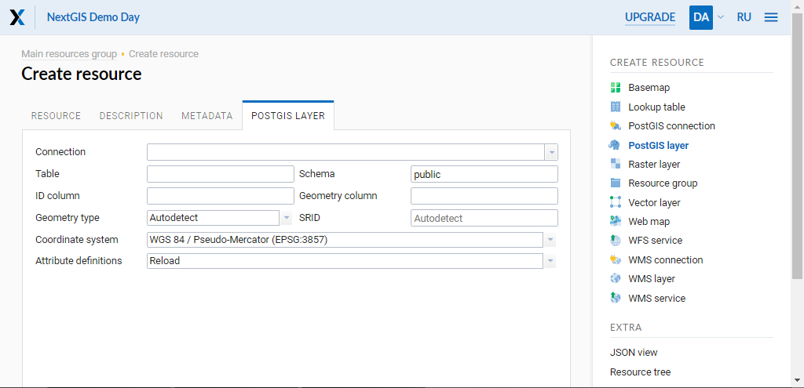

   PostGIS layer tab of create resource dialog.

Then perform the following steps:

#. From a dropdown list select a database connection (creation of a connection is described above).
#. Enter a schema of a database where layer data is stored. 
   Single database can store multiple schemas. Each schema contains tables and views. If there is only one schema its called public. For more information see :program:`PostgreSQL DBMS` manual.
#. Enter Table name (PostGIS layer). 
   You need to know names of tables and columns in your database. 
   Display of tables and views is not a feature of NextGIS Web. To view them you can use: `NextGIS QGIS` or :program:`PgAdmin` software.
#. Enter "ID column". 
   When data is loaded into PostGIS using :program: NextGIS QGIS 
   software an ogc_fid column is created. If data was loaded in another way the 
   name of column may be different.
   An ID column should follow rules for data type: the value type should be a 
   number (**numeric**) and it should be a primary key.
#. Enter "Geometry column" name (if data was loaded to PostGIS using  
   :program:`NextGIS QGIS` software usually a geometry column called 
   wkb_geometry is created. If data is loaded in another way the name of column 
   may be different).
#. Parameters "Geometry type", "Coordinate system",
   "Attribute definitions" and "SRID" are not required so you can use default 
   values.

NextGIS Web software supports adding of tables with point, line and polygon geometries stored in a single geometry column. 
This is required for some specific datasets: e.g. if one table stores coordinates for parks as polygons and trash cans as points in a single table. In this case in NextGIS Web you need to add three different layers for each type of geometry and select appropriate geometry type in "Geometry type" parameter.

After layer is created you need to set a label attribute to display labels. Navigate to layer edit dialog and set a checkbox for the required field in "Label attribute" column.

If structure of a database has changed (column names, column types, number of columns, table names etc.) you need to update attribute definitions in layer properties. To perform changes select in actions pane :"Update" and then on "PostGIS layer" tab change "Attribute definitions" to "Reload" and click "Save".

PostGIS layer troubleshooting
^^^^^^^^^^^^^^^^^^^^^^^^^^^^^

You created a connection and trying to create a PostGIS layer based on it and getting errors. 

If you get:

1. Cannot connect to the database!

Check if the database is available, is it up, do you have right credentials? You can all these using pgAdmin or QGIS.

Note that databases go up and down and credentials change.

Create layers with conditions
^^^^^^^^^^^^^^^^^^^^^^^^^^^^^^

In :program:`NextGIS Web` you can not define queries using a WHERE SQL expression. 
This provides additional security (prevention of SQL Injection attack). To 
provide query capability you need to create views with appropriate queries.

To do this connect to PostgreSQL/PostGIS database using :program:`pgAdminIII`, 
then navigate to data schema where you want to create a view, right click tree 
item "Views" and select "New view" (see item 1 in :numref:`pgadmin3`). Also you can right click on schema name and select "New object" and then "New view". Enter the following information to create new view dialog:

#. View name («Properties» tab).
#. Data schema where to create a view («Properties» tab).
#. SQL query («Definition» tab).

.. figure:: _static/pgadmin3_eng.png
   :name: pgadmin3
   :align: center
   :width: 16cm

   Main dialog of :program:`pgAdminIII` software.

   The numbers indicate: 1. – Database items tree; 2 – a button for  
   table open (is active if a table is selected in tree); 3 – SQL query for  
   view.

After that you can display a view to check if query is correct without closing :program:`pgAdminIII` (see  item 2 in :numref:`pgadmin3`). 

.. _ngw_create_wms_layer:

WMS layer
---------

NextGIS Web is a WMS client. To connect a WMS layer you need to know its address. WMS server should be able to serve it using a coordinate system EPSG:3857. You can check for this coordinate system presence by making a GetCapabilites request to a server and examining the response. For example a WMS layer provided by Geofabrik (GetCapabilities), responds in EPSG:4326 and EPSG:900913. While EPSG:900913 and EPSG:3857 are technically the same, NGW requests data in 3857 and server does not support for that coordinate system.

To add WMS layer you need to create a resource called WMS connection. You may create a single connection for many layers.
In actions pane "Create resource" click "WMS connection" (see :numref:`admin_layers_create_wms_connection`). 

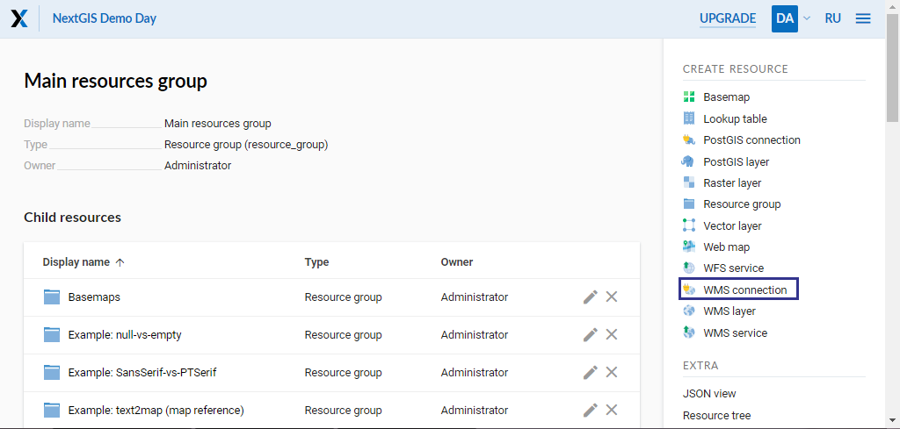

   Selection of "WMS connection" action.
   
Create resource dialog for WMS connection is presented on :numref:`admin_layers_create_wms_connection_description`.

.. figure:: _static/admin_layers_create_wms_connection_description_eng.png
   :name: admin_layers_create_wms_connection_description
   :align: center
   :width: 16cm

   Create resource dialog for WMS connection.

Enter display name that will be visible in administrator interface. Do not 
confuse this name with a name of layers in a database. 

Field "Keyname" is optional.

You can also add resource description and metadata on the corresponding tabs.
 
Switch from "Resource" tab to "WMS connection" tab, which is presented on :numref:`admin_layers_create_wms_connection_url`.

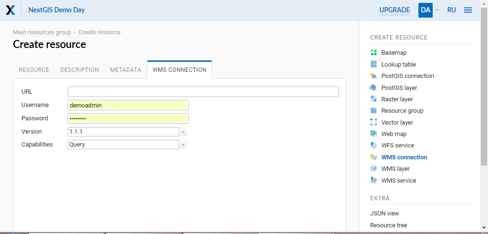

   WMS connection tab of Create resource dialog.

Here enter  WMS server connection parameters from which you want to display data. 

Then you can add single WMS layers. Navigate to a group where you want create 
WMS layers and in actions pane "Create resource" select "WMS layer" (see :numref:`admin_layers_create_wms_layer`). 

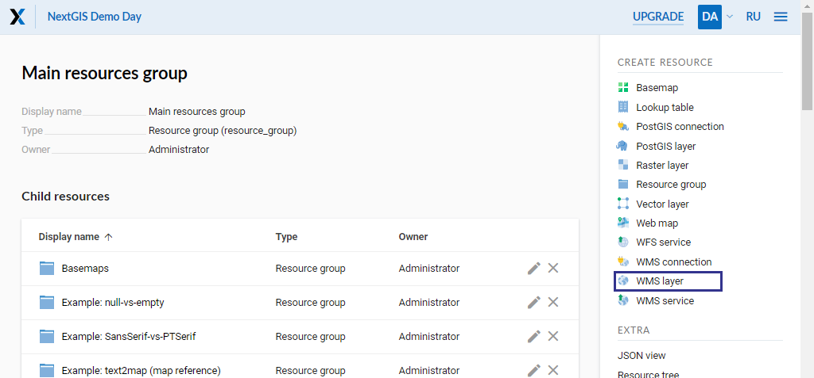

   Selection of "WMS layer" action.

Create resource dialog for WMS layer is presented :numref:`admin_layers_create_wms_layer_name`.

.. figure:: _static/admin_layers_create_wms_layer_name_eng.png
   :name: admin_layers_create_wms_layer_name
   :align: center
   :width: 16cm

   Create resource dialog for WMS layer.

Enter display name that will be visible in administrator interface and in map 
layer tree. 

Field "Keyname" is optional.

You can also add resource description and metadata on the corresponding tabs.

Switch from "Resource" tab to "WMS" tab, which is presented on :numref:`admin_layers_create_wms_layer_parameters`.

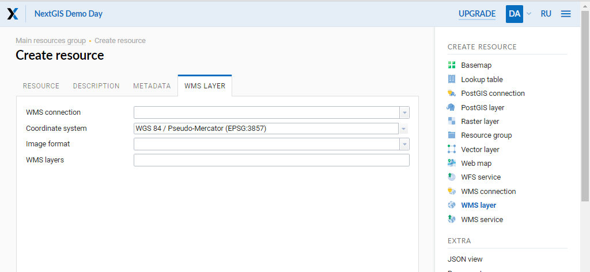

   WMS layer tab of Create resource dialog.

Then perform the following steps:

1. Select WMS connection that was created earlier.
2. Select coordinate system which to use for requests to WMS server 
   (by default there are only WGS84 / Pseudo Mercator (EPSG:3857) ).
3. If parameters are correct the parameter "Format" will display 
   MIME-types list that are served by a server. Select an appropriate one.
4. If parameters are correct the parameter "WMS layers" will display 
   a list of layers that are server by a server. Select required layers by clicking 
   underlined names. You can select several layers.

.. note::
   Parameters to add a WMS layer for Public cadastral map by Rosreestr:

URL http://maps.rosreestr.ru/arcgis/services/Cadastre/CadastreWMS/MapServer/WmsServer?

Supported versions of WMS protocol: 1.1.1, 1.3

.. note:: 
   Identification requests to external WMS layers from Web maps are not supported yet.

.. _ngw_create_wms_service:

WMS service
------------

NextGIS Web software could perform as WMS server. This protocol is used to provide images for requested extent. 

To deploy a WMS service you need to add a resource. To do it in actions pane "Create resource" click "WMS service" (see :numref:`admin_layers_create_wms_service`). 

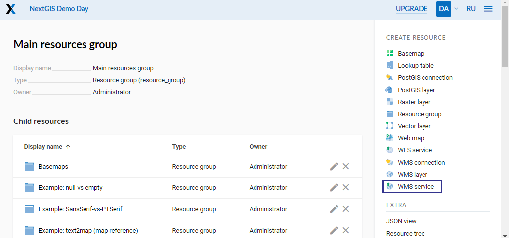

   Selection of "WMS service" action.
   
Create resource dialog for WMS service is presented on :numref:`ngweb_admin_layers_create_wms_service_name`. 

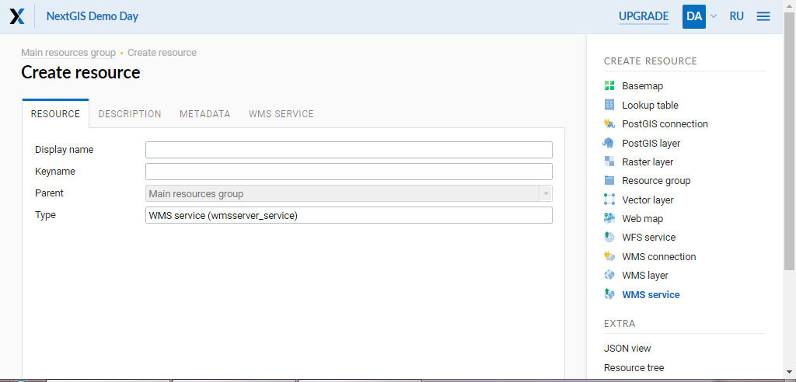

   Create resource dialog for WMS service.

Enter display name that will be visible in administrator interface. Do not 
confuse this name with a name of layers in a database. 

Field "Keyname" is optional.

You can also add resource description and metadata on the corresponding tabs.
 
Switch from "Resource" tab to "WMS service" tab, which is presented on :numref:`ngweb_admin_layers_create_wms_service_url`. Here add links to styles of required layers to a list (see (see :numref:`ngweb_admin_layers_create_wms_service_url`)  For each added style you should set a unique key. You can copy it from the name. 

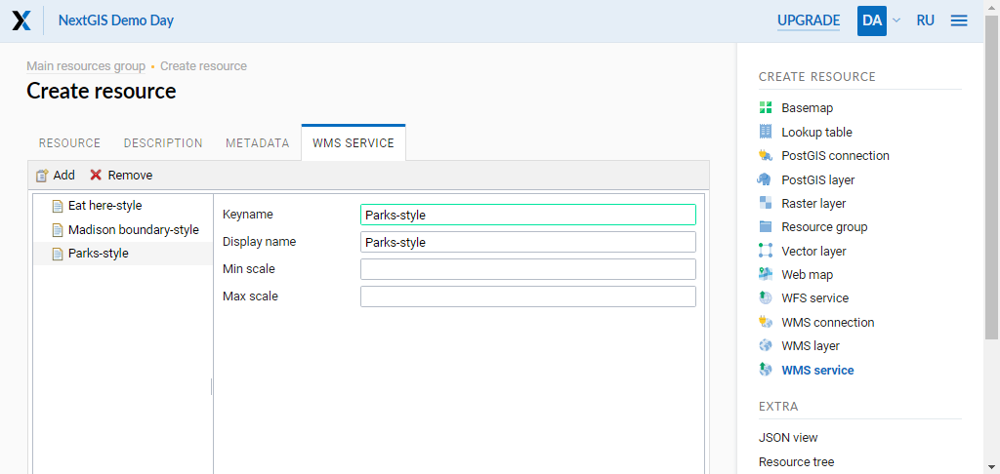

   WMS service tab of Create resource dialog. 

After a resource is created you will see a message with WMS service URL which you can use in other software, e.g. :program:`NextGIS QGIS` or :program:`JOSM`. 
Then you need to set access permissions for WMS service (see section :ref:`ngw_access_rights`).

NextGIS Web layer could be added to desktop, mobile and web gis in different ways.

Using WMS service connection
^^^^^^^^^^^^^^^^^^^^^^^^^^^^

NextGIS Web acts as a WMS server. Any WMS layes could be added to a software that supports WMS layers. You need to know WMS service URL. You can get in on WMS service page. The link may look like this:

.. code:: html

   https://demo.nextgis.com/api/resource/4817/wms?

To use WMS service through GDAL utilities you need to create an XML file for required layer.
Enter these parameters to ServerUrl string in example below. The rest remains unchanged.

.. code:: xml

   <GDAL_WMS>
    <Service name="WMS">
        <Version>1.1.1</Version>
        <ServerUrl>https://demo.nextgis.com/api/resource/4817/wms?</ServerUrl>
        <SRS>EPSG:3857</SRS>
        <ImageFormat>image/png</ImageFormat>
        <Layers>moscow_boundary_multipolygon</Layers>
        <Styles></Styles>
    </Service>
    <DataWindow>
      <UpperLeftX>-20037508.34</UpperLeftX>
      <UpperLeftY>20037508.34</UpperLeftY>
      <LowerRightX>20037508.34</LowerRightX>
      <LowerRightY>-20037508.34</LowerRightY>
      <SizeY>40075016</SizeY>
      <SizeX>40075016.857</SizeX>
    </DataWindow>
    <Projection>EPSG:3857</Projection>
    <BandsCount>3</BandsCount>
   </GDAL_WMS>

If you need an image with transparency (alpha channel) set <BandsCount>4</BandsCount>

GDAL utility call example. The utility gets an image by WMS from NGW and saves it to a GeoTIFF format

.. code:: bash

   $ gdal_translate -of "GTIFF" -outsize 1000 0  -projwin  4143247 7497160 \
   4190083 7468902   ngw.xml test.tiff

.. _ngw_create_tms_layer:

TMS layer
---------

.. _ngw_create_tms_connection:

TMS Connection
^^^^^^^^^^^^^^

Similarly to `WMS <https://docs.nextgis.com/docs_ngweb/source/layers.html#wms-layer/>`_ to add a TMS layer, you first need to create a TMS connection. Select **TMS connection** under Create resource panel (see :numref:`TMS_connection_create_en`)

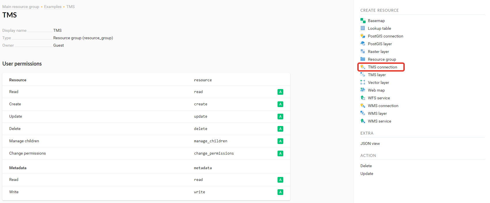
   
   Selecting a TMS Connection resource

Enter the connection name that will be displayed in the administrative interface (see :numref:`TMS_connection_name_en`).

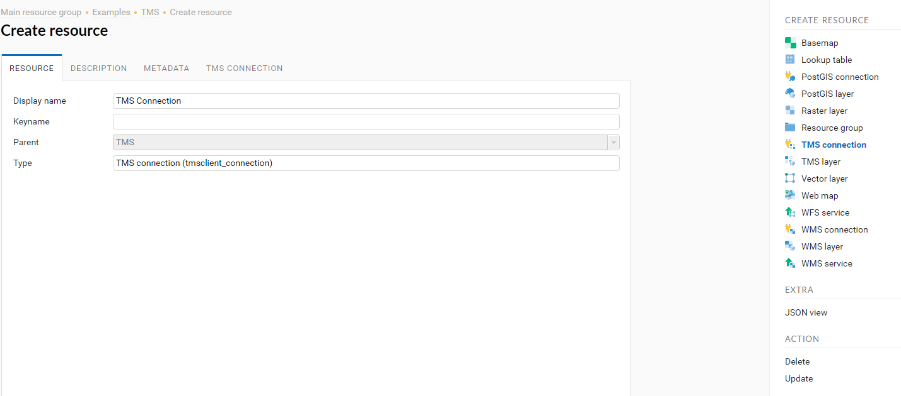
   
   TMS Connection Resource Name

The "Key" field is optional. If needed you can also add a description and metadata. TMS connection tab is responsible for configuring the way to connect to the TMS server - custom or NextGIS geoservices (see :numref:`TMS_connection_type_en`).

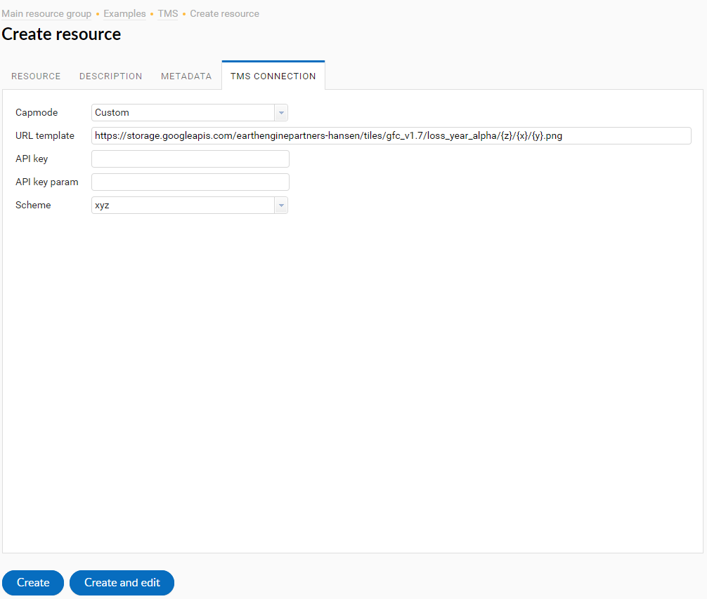
   
   Configuring TMS Connection
   
In the case of a custom connection method, the user must specify the URL template, API key parameters if needed and the tile scheme used. For NextGIS geoservices, only a custom API key is specified. After filling in all fields press Create to complete the process of creating a **TMS Connection** resource.

.. _ngw_tms_layer:

TMS layer
^^^^^^^^^

**TMS layer** resource is created using previously created **TMS Connection**. Select "TMS layer" under Create resource panel (see :numref:`TMS_layer_create_en`).

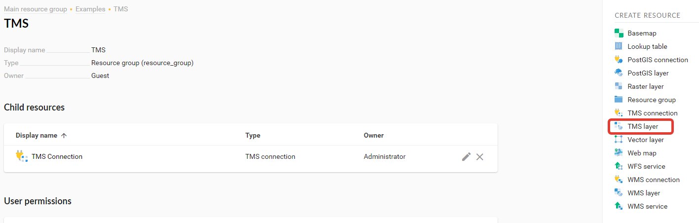
   
   Selection Resource TMS layer
   
Enter the name that will be displayed in the administrative interface (see :numref:`TMS_layer_name_en`).

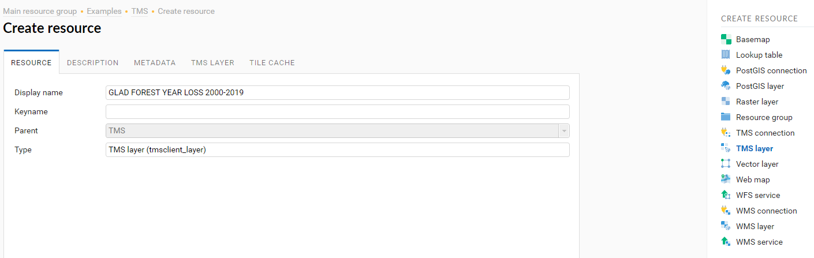
   
   TMS layer name

Caching provides faster rendering of web map layers. Tile cache settings are described in details `in this section <https://docs.nextgis.com/docs_ngweb/source/mapstyles.html#tile-cache>`_:

The main display settings are on the TMS layer tab (см. :numref:`TMS_layer_settings_en`):

* TMS connection - select a TMS connection resource that was created earlier
* Select coordinate system for data display
* The range of zoom levels for data display
* Extent in degrees
* Tile size in pixels

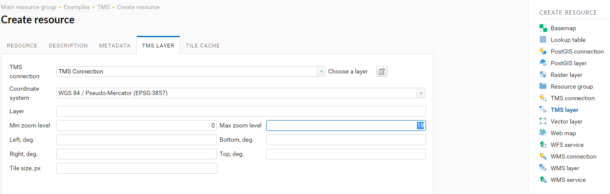
   
   TMS_layer_settings_en
   
After creating a TMS layer, the user can add it to the web map to display. No style is needed.

.. _ngw_connect_tms_gdal:

Using TMS connection
^^^^^^^^^^^^^^^^^^^^

NextGIS Web style resources could be accessed as TMS. The link should look like this:

.. code:: html

   https://demo.nextgis.com/api/component/render/tile?z={z}&x={x}&y={y}&resource=234

To use TMS service through GDAL utilities you need to create an XML file for the required style. You will a proper link. 
Enter these parameters to ServerUrl string in example below. The rest remains unchanged.

.. code:: xml

   <GDAL_WMS>
    <Service name="TMS">
        <ServerUrl>https://demo.nextgis.com/api/component/render/tile?z={z}&x={x}&y={y}&resource=234
        </ServerUrl>
    </Service>
    <DataWindow>
        <UpperLeftX>-20037508.34</UpperLeftX>
        <UpperLeftY>20037508.34</UpperLeftY>
        <LowerRightX>20037508.34</LowerRightX>
        <LowerRightY>-20037508.34</LowerRightY>
        <TileLevel>18</TileLevel>
        <TileCountX>1</TileCountX>
        <TileCountY>1</TileCountY>
        <YOrigin>top</YOrigin>
    </DataWindow>
    <Projection>EPSG:3857</Projection>
    <BlockSizeX>256</BlockSizeX>
    <BlockSizeY>256</BlockSizeY>
    <BandsCount>4</BandsCount>
    <Cache />
   </GDAL_WMS> 

.. _ngw_wfs_service:

WFS service
-----------

WFS layer setup is performed the same way as for WMS service but you add layers instead of styles.
 
.. note::
     Currently supported filters are Intersects, ResourceId (ObjectId, FeatureId).

NextGIS Web acts as WFS server and publishes WFS services. Third party software can use these services to edit vector data on server using this protocol.

To deploy a WFS service click "WFS service" on "Create resource" actions panel (see :numref:`admin_layers_create_wfs_service`). 

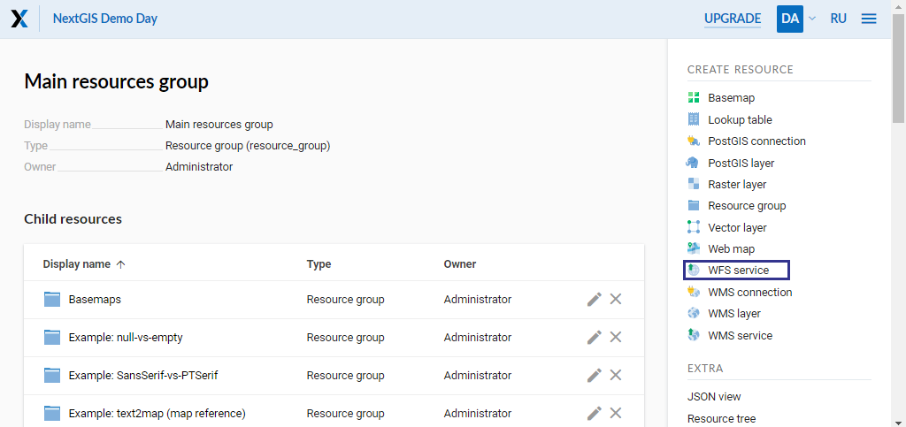

   Selection of "WFS service" action.
   
Create resource dialog for WFS service is presented on :numref:`ngweb_admin_layers_create_wfs_service_name`. 

   Create resource dialog for WFS service.

Enter display name that will be visible in administrator interface. Do not 
confuse this name with a name of layers in a database. 

Field "Keyname" is optional.

You can also add resource description and metadata on the corresponding tabs.
 
Switch from "Resource" tab to "WFS service" tab, which is presented on :numref:`ngweb_admin_layers_create_wfs_service_url`. Add required layers to a list (see :numref:`ngweb_admin_layers_create_wfs_service_url`.) For each layer you should set a unique key. You can copy paste it from the name of the layer, but don't use special symbols, only letters and numbers. 

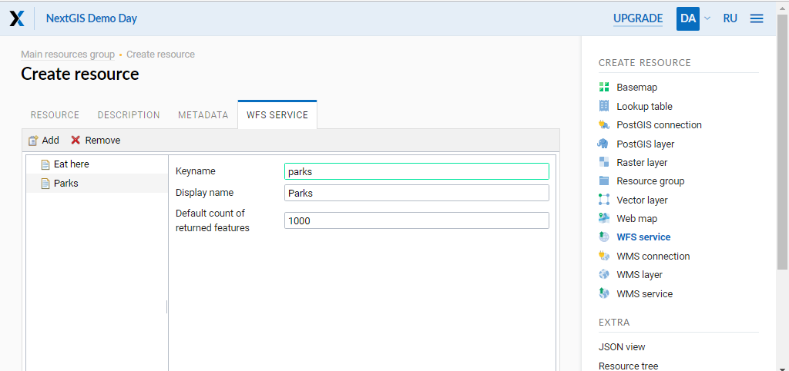

   WFS service tab of Create resource dialog. 

For each layer you can set a limit for the number of features transfered at once.
By default the value is 1000. If this parameter is empty the limit will be disabled and all features will be trasfered to the client. This could result in high server load and significant timeouts if volume of transfered data is very high.

After a resource is created you need to open it in administrator interface one more time. You will see a message with WFS service URL which you can use in other software, for example :program:`NextGIS QGIS`. 

You can set access permissions for WFS service if needed. See  section :ref:`ngw_access_rights`.

.. _ngw_resources_group:

Creation of a resource group
----------------------------

Resources could be joined to groups. For example you can join base layers to one group, satellite imagery to another group and thematic data to one more group etc.

Groups help organize layers in Control panel and help manage access permissions in a convenient way. 

To create a resource group navigate to the group, where you want to create a new one (root group or another), and in actions pane "Create resource" click "Resource group" (see :numref:`admin_layers_create_resource_group`). 

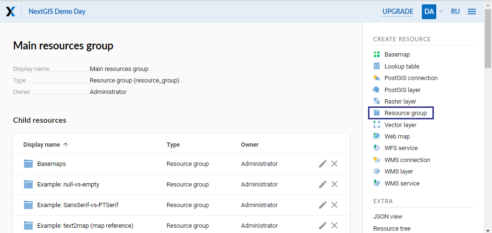

   Selection of "Resource group" action.
    
Create resource dialog for resource group is presented on :numref:`admin_layers_create_group`.

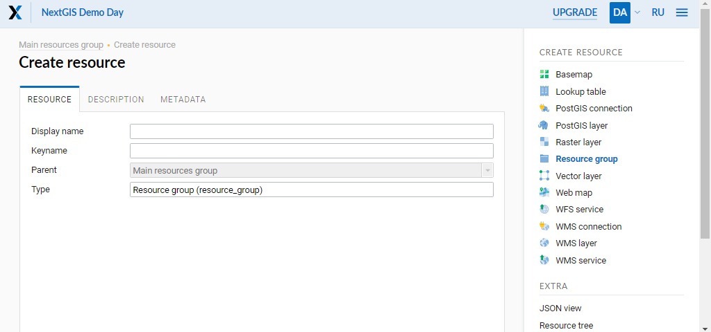

   Create resource dialog for resource group.

In create resource dialog enter display name, that will be visible in administrator interface and in map 
layer tree, and then click "Create". 

Field "Keyname" is optional.

You can also add resource description and metadata on the corresponding tabs.

.. _ngw_create_lookup_table:

Lookup table
-------------

To create a lookup table navigate to the group, where you want to create it (root group or another), and in actions pane "Create resource" click "Lookup table" (see :numref:`admin_layers_create_lookup_table`). 

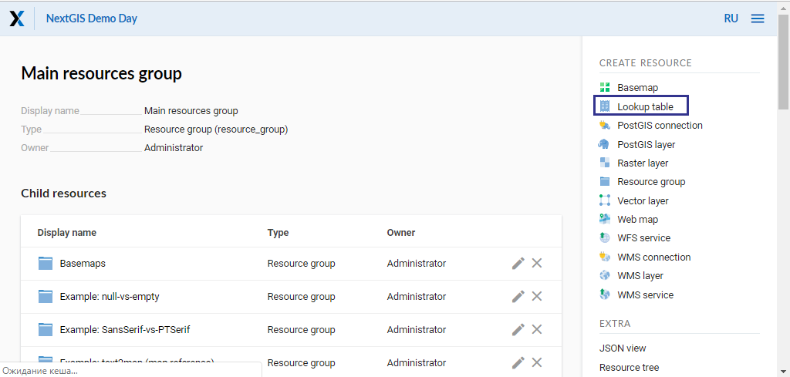

   Selection of "Lookup table" action.
   
Create resource dialog for resource group is presented on :numref:`ngweb_admin_layers_create_lookup`.

   Create resource dialog for lookup table.

In create resource dialog enter display name.

Field "Keyname" is optional.

You can also add resource description and metadata on the corresponding tabs.

Switch from "Resource" tab to "Lookup table" tab, which is presented on :numref:`ngweb_creating_a_new_directory_group`.

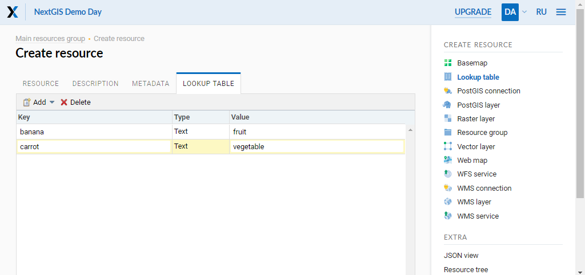

   Lookup table tab of Create resource dialog.
   
In opened window there are options "Add" and "Delete". "Text" tab in a dropdown list of "Add" option allows to fill in lookup table data as "key" - "value" pairs. Then press "Save" button. The window will then look as on :numref:`ngweb_new_resource_group`

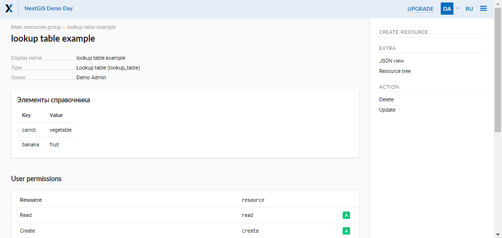

   Creation of new resource.

To change anything in lookup table in actions pane "Action" click "Update". The window of resource update will open. Switch to "Lookup table" tab, where you can change lookup table's contents:

* to add a new key - value pair
* to change current key - value pair
* to delete key - value pair

Typical structure
------------------

With NextGIS Web application experience we recommend the following typical structure for organizing resources.

Typical structure ::

  Main resource group
	Web maps
		Master web map
		Test web map
	PostGIS connections
		PostGIS on server
	Data layers
		Base data
			Borders
			Infrastructure - linear features
			Accounting area
		Thematic data
			Results of measurements on accounting area
			Results of measurements on accounting routes
			Observation points for rare species
		Relief
			ASTER DEM
				DEM
				Isolines
		Topographic data
			Openstreetmap
				Roads
				Administrative borders
				Hydrology
				Railway stations
				Railway roads
				Landuse
			1 : 100000
				M-37-015
				M-37-016
				M-37-017
		Satellite imagery
			Landsat-8
			Ikonos
