.. _ngw_create_layers:

Слои
======

Загрузка растровых и векторных геоданных в :ref:`Веб ГИС <ngcom_description>` происходит путем создания ресурсов `Растровый слой <https://docs.nextgis.ru/docs_ngweb/source/layers.html#ngw-create-raster-layer>`_, `Векторный слой <https://docs.nextgis.ru/docs_ngweb/source/layers.html#ngw-create-vector-layer>`_ и `Набор тайлов <https://docs.nextgis.ru/docs_ngweb/source/layers.html#ngw-tile-set>`_.

.. hint:: Где взять данные?

   Данные на интересующую вас территорию можно заказать на `NextGIS Data <https://data.nextgis.com/ru/>`_

Ограничение на размер загружаемых файлов зависит от выбранного `тарифного плана <https://nextgis.ru/pricing-base/>`_. Для **Premium** - 50 GiB, для **Free** - 5 GiB, для **Mini** - 10 GiB. На плане Free вы можете создать до 15 слоёв и неограниченное количество карт для их визуализации. Чтобы загрузить больше слоёв, подключите Preimum, это можно сделать `в личном кабинете <https://my.nextgis.com/subscription/>`_.

Вы можете хранить растры во внешнем хранилище S3, для соединения с ним нужно создать ресурс `Хранилище векторных слоёв <https://docs.nextgis.ru/docs_ngweb/source/layers.html#raster-storage>`_.

См. также поддерживаемые форматы и другие требования к исходным данным: `для растровых слоёв <https://docs.nextgis.ru/docs_ngweb/source/layers.html#ngw-raster-requirements>`_, `для векторных слоёв <https://docs.nextgis.ru/docs_ngweb/source/layers.html#ngw-vector-data-requirements>`_.

.. _ngw_create_vector_layer:

Векторный слой
-----------------------

В NextGIS Web можно создавать векторные слои на основе геоданных в различных `форматах <https://docs.nextgis.ru/docs_ngweb/source/layers.html#ngw-vector-data-requirements>`_ и соединений `PostGIS <https://docs.nextgis.ru/docs_ngweb/source/postgis_details.html#ngw-create-postgis-connection>`_, а также `пустые слои <https://docs.nextgis.ru/docs_ngweb/source/layers.html#ngw-create-empty-vector-layer>`_, которые имеют определённую структуру атрибутов, но не содержат объектов.

.. _ngw_vector_data_requirements:

Требования к исходным данным
~~~~~~~~~~~~~~~~~~~~~~~~~~~~~

В качестве исходного файла можно загружать следующие форматы:

* :term:`ESRI Shapefile`
* :term:`GeoJSON`
* :term:`KML`
* :term:`GML`
* :term:`GeoPackage`

Точечные слои также можно создать из файлов :term:`CSV` и :term:`XLSX`, координаты должны быть в колонках lat и lon. Посмотрите процесс создания такого слоя в видео:

.. raw:: html

   <iframe width="560" height="315" src="https://rutube.ru/play/embed/5302afb00e3af93dbd9adccf848d84db/" frameBorder="0" allow="clipboard-write; autoplay" webkitAllowFullScreen mozallowfullscreen allowFullScreen></iframe>

Смотреть на `youtube <https://youtu.be/LcGco1nclM8>`_, `rutube <https://rutube.ru/video/5302afb00e3af93dbd9adccf848d84db/>`_.

Если нужно загрузить данные в другом формате, вы можете использовать `NextGIS Connect <https://docs.nextgis.ru/docs_ngconnect/source/resources.html>`_.

.. note:: 
   В случае ESRI Shapefile все составляющие его части (dbf, shp, shx, prj и др.) должны быть 
   упакованы в архив формата ZIP. 

.. note:: 
   Мы рекомендуем **не** использовать кириллицу в названиях полей атрибутов. Несмотря на то, что в большинстве случаев такие данные могут быть загружены в Веб ГИС и показаны на картах, в некоторых случаях вы можете испытывать проблемы с работой с такими данными в NextGIS Mobile и визуализацией (особенно если условные обозначения сформированы на базе одного из таких полей). Переименуйте поля латиницей перед загрузкой и используйте синонимы полей (алиасы) для их отображения кириллицей на картах.

Если во входном файле есть поля с названиями: id (ID) или geom (GEOM), то при загрузке они будут переименованы или превращены во внутренние идентификаторы (поле id).

.. _ngw_process_create_vector_layer:

Создание слоя из файла
~~~~~~~~~~~~~~~~~~~~~~

.. hint:: Где взять данные?

   `NextGIS Data <https://data.nextgis.com/ru/?from-docs>`_

Перейдите в группу ресурсов (папку), в которой необходимо создать векторный слой.
Нажмите кнопку **Создать ресурс** и выберите во всплывающем окне тип ресурса **Векторный слой** (см. :numref:`ngweb_admin_layers_create_vector_layer`). 

.. figure:: _static/ngweb_create_vector_layer_ru.png
   :name: ngweb_admin_layers_create_vector_layer
   :align: center
   :width: 20cm

   Выбор типа ресурса "Векторный слой"
 
На открывшейся вкладке "Векторный слой" необходимо загрузить файл геоданных в формате :term:`ESRI Shapefile` (zip-архив), :term:`GeoPackage`, :term:`GeoJSON`, :term:`GML`, :term:`KML`, :term:`CSV` или :term:`XLSX`. Для CSV и XLSX поддерживаются только точки, координаты должны быть в колонках lat и lon.

В зависимости от `тарифного плана <http://nextgis.ru/nextgis-com/plans>`_ в окне отображается максимально допустимый объем загружаемого файла (:numref:`ngweb_admin_layers_create_vector_layer_upload`).
NextGIS Web может принимать многослойные наборы данных на входе. Если в архиве содержится несколько слоёв, то после его загрузки пользователю будет предложено выбрать слой, на основе которого будет создан ресурс "Векторный слой".

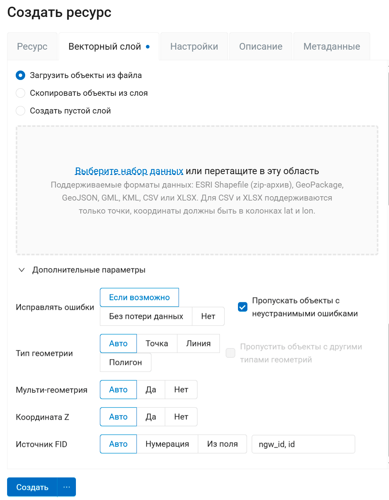

   Окно загрузки векторного файла

Ниже предлагается определить дополнительные параметры создания векторного слоя (обработка геометрий, поле FID). 
Подробнее о дополнительных параметрах можно прочитать `здесь <https://docs.nextgis.ru/docs_ngweb/source/vect_layer_upload_params.html>`_.

Если в ESRI Shapefile присутствует файл с описанием кодировки [расширение .cpg], то он будет учитываться при загрузке. 

Во вкладке "Ресурс" укажите название векторного слоя (:numref:`ngweb_admin_layers_create_vector_layer_resourse_name`). Оно будет отображаться в административном интерфейсе.

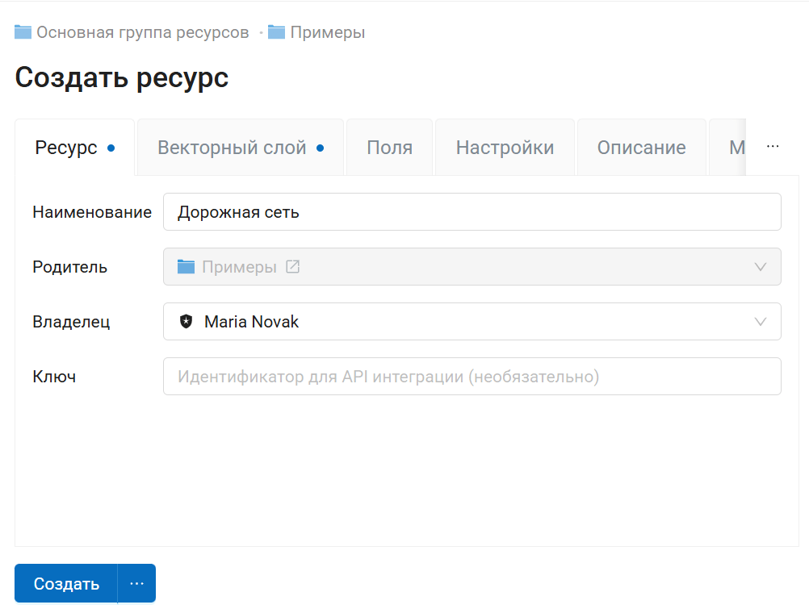

   Наименование векторного слоя
   
   
Также можно добавить `Описание и метаданные <https://docs.nextgis.ru/docs_ngweb/source/edit_resource.html#ngw-update-info-metada>`_, описывающие содержимое данного слоя. 

После завершения ввода нужных данных нажмите кнопку **Создать**.

Далее можно создавать `стиль <https://docs.nextgis.ru/docs_ngweb/source/mapstyles.html#qgis>`_, который в последующем будет визуализировать данные слоя на `веб-карте <https://docs.nextgis.ru/docs_ngweb/source/webmaps_admin.html#ngw-map-create>`_.

Также внутри ресурса "Векторный слой" можно `создать Форму <https://docs.nextgis.ru/docs_ngweb/source/collector.html#collector-create-form>`_, которая будет использоваться для сбора данных.

.. _ngw_create_empty_vector_layer:

Пустой векторный слой
~~~~~~~~~~~~~~~~~~~~~~~

Создание пустого векторного слоя позволяет начать вести базу данных в ВебГИС без использования настольного приложения. 

Перейдите в группу ресурсов (папку), в которой необходимо создать векторный слой.
Нажмите кнопку **Создать ресурс** и выберите во всплывающем окне тип ресурса **Векторный слой**. 

.. figure:: _static/ngweb_create_vector_layer_ru.png
   :name: ngweb_admin_layers_create_vector_layer_2
   :align: center
   :width: 20cm

   Выбор типа ресурса "Векторный слой"

В открывшемся окне в выпадающем меню выберите "Создать пустой слой". Ниже появится поле выбора типа геометрии слоя. По умолчанию создается точечный слой.

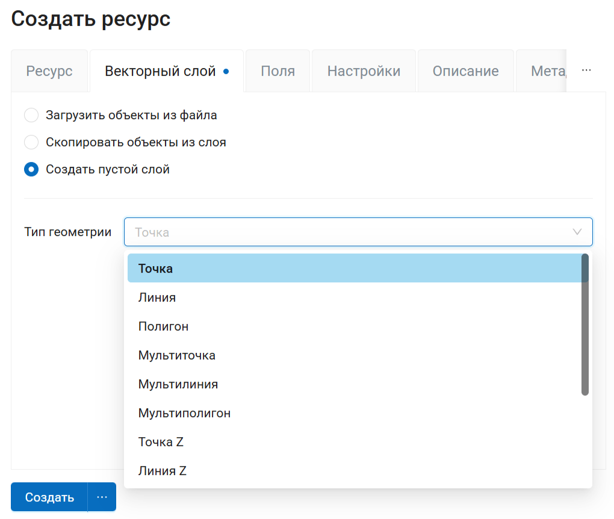

   Окно выбора геометрии пустого слоя

Поддерживаются **точки, линии и полигоны**. Можно выбрать модификации этих типов с поддержкой **мультигеометрий** и **Z-координаты**.

Во вкладке "Поля" добавьте необходимые поля (атрибуты)

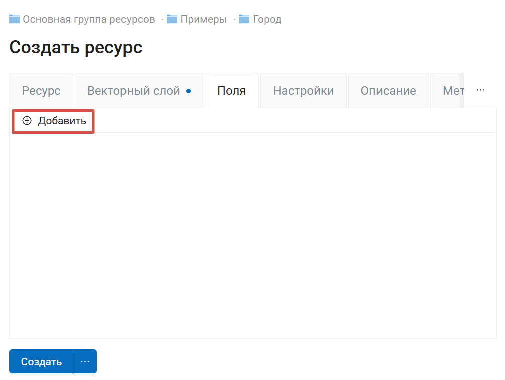

   Вкладка добавления полей

Нажмите |button_plus_layer| **Добавить**. Появится первое поле. Нажав на поле, вы откроете его свойства. 

Задайте для поля тип данных (числовые: INTEGER, BIGIN, REAL, строка STRING, дата/время DATE, TIME, DATETIME, логическое BOOLEAN)

Также при желании можно поменять наименование поля и другие параметры (`подробнее о настройке полей <https://docs.nextgis.ru/docs_ngweb/source/layers_settings.html#ngw-attributes-edit>`_).

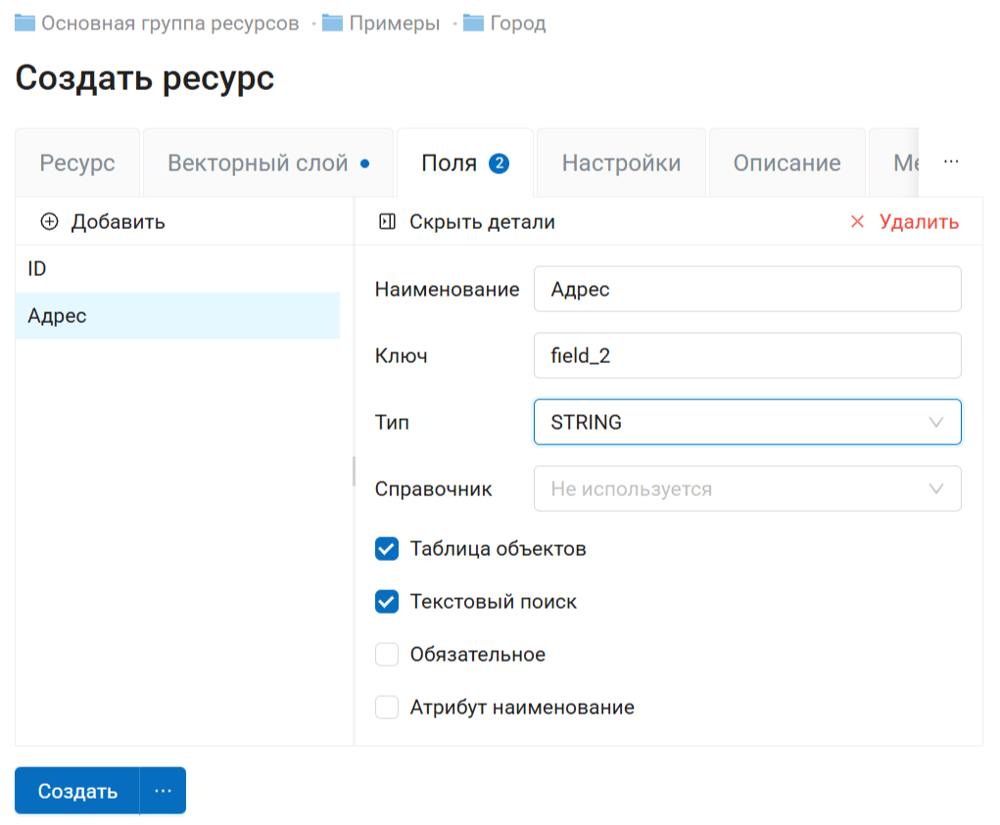

   Поле с заданным типом данных строка (string) и наименованием "Адрес"

Нажмите |button_hide_details| **Скрыть детали**, чтобы увидеть весь список полей.

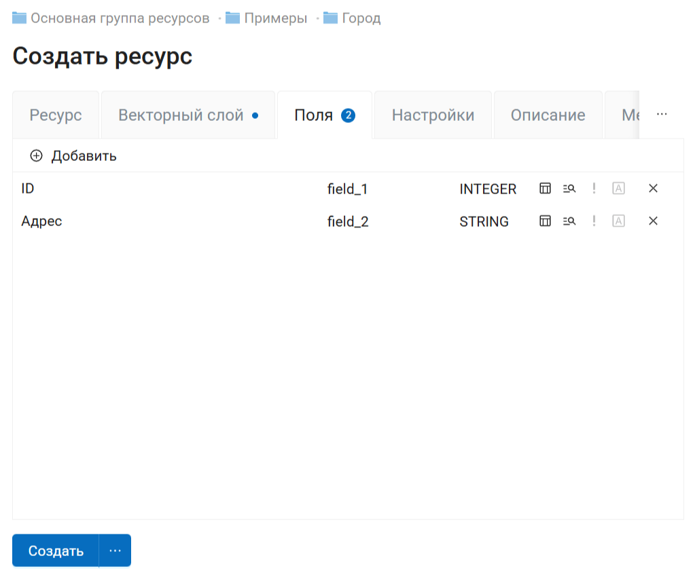

   Список полей слоя

Во вкладке "Ресурс" можно указать название векторного слоя, которое будет отображаться в списке ресурсов. По умолчанию в качестве названия используется тип ресурса.

Нажмите **Создать**.

.. |button_plus_layer| image:: _static/button_plus_layer.png
   :width: 6mm

.. |button_hide_details| image:: _static/button_hide_details.png
   :width: 6mm

Теперь можно создавать `стиль <https://docs.nextgis.ru/docs_ngweb/source/mapstyles.html#qgis>`_, который в последующем будет визуализировать данные слоя на `веб-карте <https://docs.nextgis.ru/docs_ngweb/source/webmaps_admin.html#ngw-map-create>`_.

Для добавления объектов на пустой слой можно использовать `инструменты редактирования веб-карты <https://docs.nextgis.ru/docs_ngweb/source/feature_edit.html>`_.

.. _ngw_copy_vector:

Копия существующего слоя
~~~~~~~~~~~~~~~~~~~~~~~~

Вы можете создать дубликат векторного слоя, уже загруженного в Веб ГИС. Это пригодится, если вы хотите:

* Модифицировать данные, но сохранить исходный набор нетронутым;
* Создать слой той же структуры.

Перейдите в группу ресурсов (папку), в которой необходимо создать копию слоя.
Нажмите кнопку **Создать ресурс** и выберите во всплывающем окне тип ресурса **Векторный слой**. 

.. figure:: _static/ngweb_create_vector_layer_ru.png
   :name: ngw_create_vector_copy_pic
   :align: center
   :width: 20cm

   Выбор типа ресурса "Векторный слой"
 
На открывшейся вкладке "Векторный слой" выберите **Скопировать объекты из слоя**.

Нажмите на поле "Исходный слой", выберите нужный слой, отметьте его и нажмите **Выбрать отмеченное**.

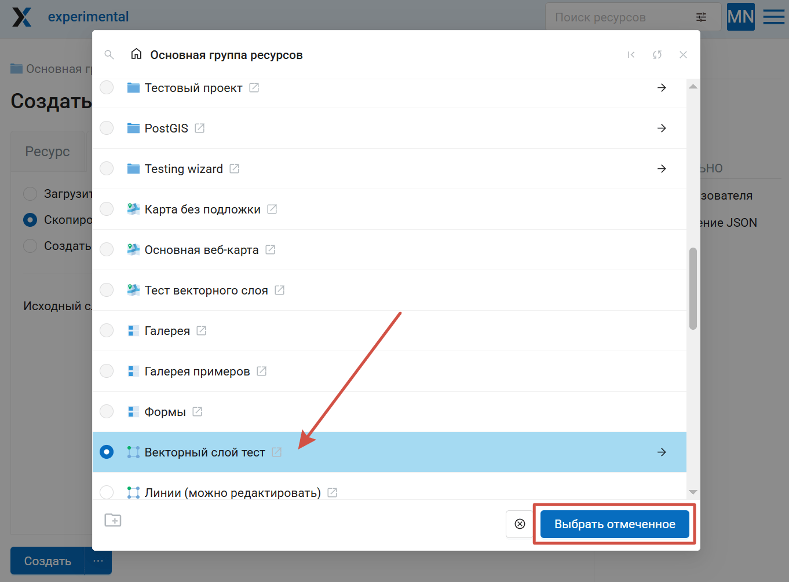

   Выбор слоя для копирования

На вкладке "Ресурс" можно задать наименование для нового слоя.

Нажмите **Создать**. После завершения создания откроется страница созданного ресурса.

Далее вы можете создать для этого слоя новый стиль или `скопировать стиль исходного слоя <https://docs.nextgis.ru/docs_ngweb/source/mapstyles.html#ngw-qgis-style-copy>`_. Чтобы скопировать форму, экспортируйте её в файл и затем создайте внутри нового слоя `ресурс формы из файла <https://docs.nextgis.ru/docs_ngweb/source/collector.html#collector-create-form>`_.

.. _ngw_no_geometry_vector:

Слой без геометрии
~~~~~~~~~~~~~~~~~~

Вы можете загрузить в Веб ГИС вспомогательную таблицу в виде слоя без геометрии.

Перейдите в группу ресурсов (папку), в которой необходимо создать таблицу.
Нажмите кнопку **Создать ресурс** и выберите во всплывающем окне тип ресурса **Векторный слой**. 

.. figure:: _static/ngweb_create_vector_layer_ru.png
   :name: ngw_create_vector_no_geom_pic
   :align: center
   :width: 20cm

   Выбор типа ресурса "Векторный слой"
 
На открывшейся вкладке "Векторный слой" загрузите файл таблицы.

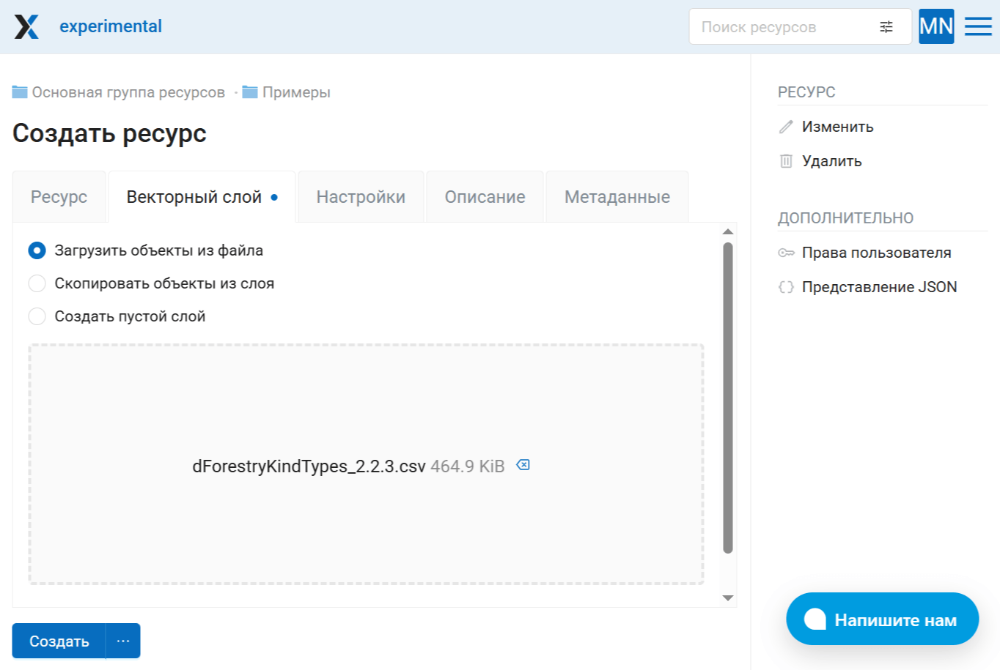

   Окно загрузки файла таблицы

На вкладке "Ресурс" задайте имя для таблицы и нажмите **Создать**. Таблица будет добавлена в дерево ресурсов как векторный слой без геометрии.

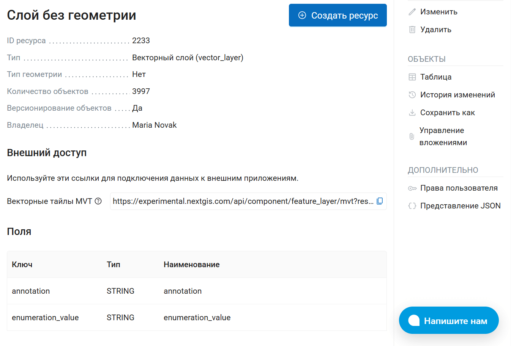

   Таблица сохранена в форме слоя без геометрии

.. _ngw_create_raster_layer:

Растровый слой
--------------

Растровые изображения в NextGIS Web загружаются через специальный ресурс "Растровый слой".

.. _ngw_raster_requirements:

Требования к исходным данным
~~~~~~~~~~~~~~~~~~~~~~~~~~~~

Данные должны быть географически привязаны и иметь корректно сформированное описание системы координат (в тегах GeoTIFF).

Поддерживаемые форматы: 

* :term:`GeoTIFF` или ZIP-архив с таким файлом;
* геопривязанный JPEG или PNG в виде ZIP-архива, который включает само изображение и файл привязки \*.aux.xml.

.. hint: Где взять данные?

   `Данные рельефа <https://data.nextgis.com/ru/region/custom/dem/https://data.nextgis.com/ru/?from-docs>`_, `ландшафты <https://data.nextgis.com/ru/region/custom/landcover/https://data.nextgis.com/ru/?from-docs>`_ и `спутниковые снимки <https://data.nextgis.com/ru/region/custom/sat/https://data.nextgis.com/ru/?from-docs>`_ на NextGIS Data

.. _ngw_process_create_raster_layer:

Процесс создания
~~~~~~~~~~~~~~~~~~
Перейдите в группу ресурсов (папку), в которой необходимо создать рстровый слой.
Нажмите кнопку **Создать ресурс** и выберите во всплывающем окне тип ресурса **Растровый слой** (см. :numref:`ngweb_admin_layers_create_raster_layer`).

.. figure:: _static/ngweb_create_raster_layer_ru.png
   :name: ngweb_admin_layers_create_raster_layer
   :align: center
   :width: 20cm

   Выбор типа ресурса "Растровый слой"

В открывшемся окне на вкладке "Растровый слой" необходимо загрузить файл геоданных в формате GeoTIFF.
Допустимый объем загружаемого файла зависит от наличия свободного места в хранилище.

Если вы планируете подключать этот растр в QGIS напрямую из Веб ГИС, при загрузке включите режим Загрузить как Cloud Optimized GeoTIFF (COG). Это оптимизирует его специальным образом для более быстрого подключения и отображения.

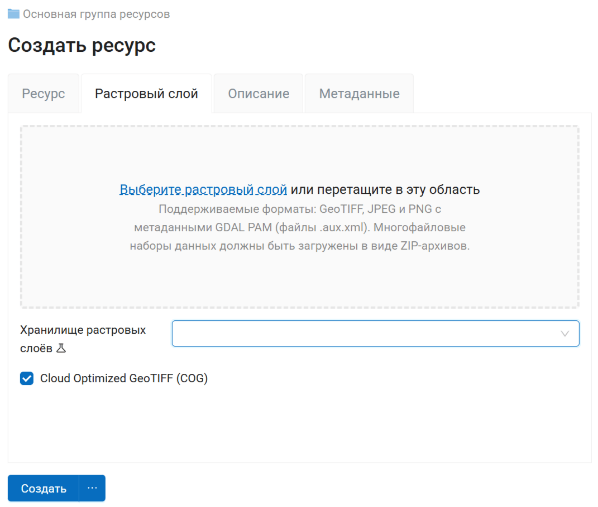

   Окно загрузки растрового файла

Также на этой вкладке можно выбрать внешнее хранилище растровых слоёв , тогда данные будут загружены в него, а не в основное хранилище Веб ГИС. Нажмите на стрелочку вниз в этом поле и выберите ранее созданный ресурс `хранилища векторных слоёв <https://docs.nextgis.ru/docs_ngweb/source/layers.html#raster-storage>`_:

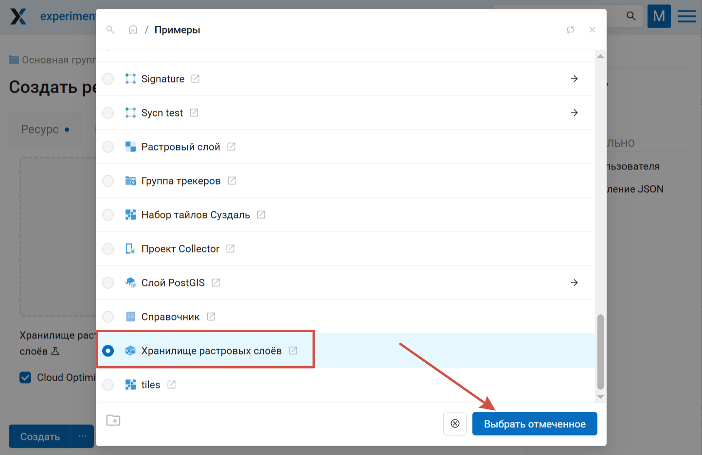

   Выбор внешнего хранилища растровых слоёв

Если файл растра уже загружен в хранилище, выберите в выпадающем меню **Подключить растр из хранилища**. Затем выберите созданное подключение к хранилищу и введите путь до файла.

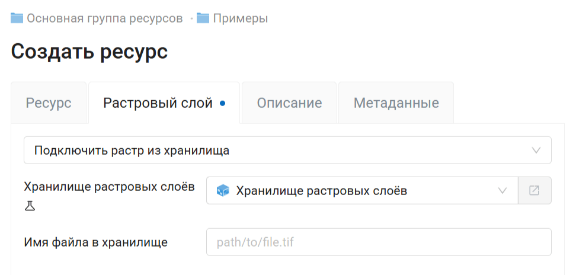

   Загрузка растра из хранилища

Во вкладке "Ресурс" укажите наименование растрового слоя (см. :numref:`ngweb_admin_layers_create_raster_layer_resourse_name`).
Оно будет отображаться в административном интерфейсе. 

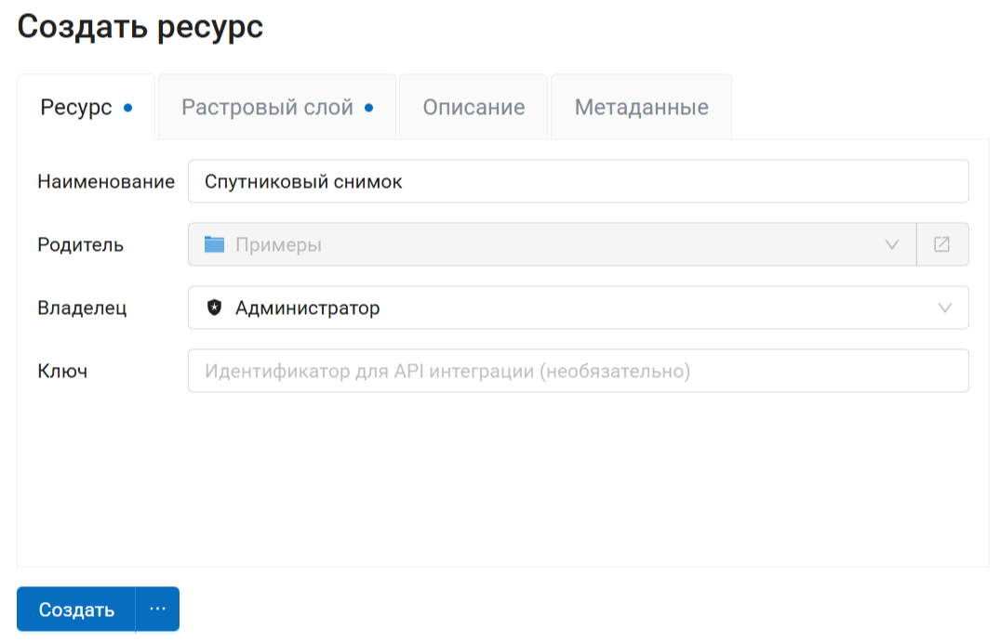

   Наименование растрового слоя

Также можно добавить `Описание и метаданные <https://docs.nextgis.ru/docs_ngweb/source/edit_resource.html#ngw-update-info-metada>`_, описывающие содержимое данного слоя.

После указания всех необходимых параметров нажмите кнопку **Создать**.

Чтобы добавить созданный слой на веб-карту, нужно сначала `создать для него стиль <https://docs.nextgis.ru/docs_ngweb/source/mapstyles.html#ngw-process-create-raster-style>`_.

.. _ngw_raster_volume:

Замечания по загрузке растров большого объёма
~~~~~~~~~~~~~~~~~~~~~~~~~~~~~~~~~~~~~~~~~~~~~~

Данные БПЛА, космической съемки высокого разрешения и другие растры могут занимать значительный объем. При этом, сам по себе размер файла растра не очень репрезентативен, так как реальный объем данных может быть значительно больше из-за сжатия. Чтобы быстро показывать растровые данные на веб картах и раздавать с помощью сервисов, они должны быть специальным образом преобразованы перед загрузкой в Веб ГИС и созданием соответствующих растровых слоёв.

Существует три ограничения, касающиеся загрузки растров большого размера:

1. Максимальный размер загружаемого файла - зависит от вашего `плана <https://nextgis.ru/pricing-base/>`_, на плане Премиум - **50 GiB**.
2. Максимальный размер распакованных данных - лимит составляет максимальный размер загружаемого файла * 2, т.е. для плана Премиум составляет **100 GiB**. Размер данных может сильно отличаться от размера файла GeoTIFF и вычисляется по формуле: количество пикселей * количество каналов * количество байт на пиксель. 

.. note:: Если в исходном растре нет альфа-канала (данных о прозрачности), он будет добавлен при загрузке, что также увеличивает объём данных (+1 канал).

3. Общий объём хранилища Веб ГИС - на плане Премиум вы можете загрузить до **50 GiB** данных  (это значение `можно увеличить <https://nextgis.ru/pricing-base/#volume-premium>`_).

Время загрузки растра на сервер не ограничено. 

.. _ngw_raster_alpha:

Растровый слой с прозрачностью (обрезкой, альфа-каналом)
~~~~~~~~~~~~~~~~~~~~~~~~~~~~~~~~~~~~~~~~~~~~~~~~~~~~~~~~

Большинство утилит не создают канал прозрачности (А или альфа канал), а только добавляют значение NoData. 
Для преобразования значений NoData в альфа канал можно воспользоваться утилитой 
командной строки  :program:`gdalwarp`. Ниже приведен пример команды.

.. code-block:: shell

   gdalwarp -t_srs EPSG:3857 -multi -dstalpha -dstnodata none -wo \
   "UNIFIED_SRC_NODATA=YES" -co COMPRESS=JPEG \ 
   d:\temp\o\ast_20010730_010043_rgb.tif d:\temp\o\ast_20010730_010043_rgba.tif

.. _ngw_raster_index:

Загрузка растров с индексированными цветами
~~~~~~~~~~~~~~~~~~~~~~~~~~~~~~~~~~~~~~~~~~~

Загрузка растров с индексированными цветами происходит так же, как и растров в RGB.
Если файл находится не в GeoTIFF, то его можно сконвертировать в `NextGIS Command Prompt <https://docs.nextgis.ru/docs_howto/source/command_prompt.html>`_ при помощи команды

.. code-block:: shell

    gdal_translate yaroslavl.map  yaroslavl.tif

.. _ngw_tile_set:

Набор тайлов
------------

.. hint:: Где взять готовые тайлы?

   `NextGIS Data <https://data.nextgis.com/ru/region/custom/tiles/https://data.nextgis.com/ru/?from-docs>`_

Нажмите кнопку **Создать ресурс** и выберите во всплывающем окне тип ресурса **Набор тайлов**.

.. figure:: _static/ngweb_create_tileset_ru.png
   :name: Tileset_create_rus
   :align: center
   :width: 20cm

Далее необходимо ввести наименование набора тайлов, которое будет отображаться в административном веб интерфейсе.

Также можно добавить `Описание и метаданные <https://docs.nextgis.ru/docs_ngweb/source/edit_resource.html#ngw-update-info-metada>`_. 

Во вкладке «Набор тайлов» необходимо загрузить набор тайлов в формате MBTiles или zip-архив. Тайлы должны быть в формате PNG или JPEG и иметь размер 256х256 пикселей.

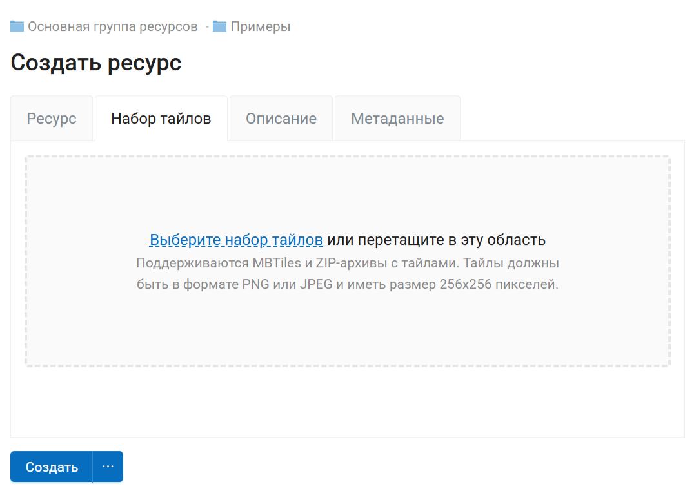

   Создание набора тайлов

На вкладке "Ресурс" можно задать пользовательское имя для набора тайлов, под которым он будет отображаться в списке ресурсов.

Нажмите кнопку **Создать**, чтобы завершить процесс создания ресурса.

Процесс создания также представлен в видео:

.. raw:: html

   <iframe width="560" height="315" src="https://rutube.ru/play/embed/824fbfb5c0d10a2977e3e828f6c4fd9a/" frameBorder="0" allow="clipboard-write; autoplay" webkitAllowFullScreen mozallowfullscreen allowFullScreen></iframe>

Смотреть на `youtube <https://youtu.be/5ccduELAk3Y>`__, `rutube <https://rutube.ru/video/824fbfb5c0d10a2977e3e828f6c4fd9a/>`__.

Набор тайлов вы можете:

* добавить на `веб-карту <https://docs.nextgis.ru/docs_ngweb/source/webmaps_admin.html>`_,
* подключить во внешнее приложение, используя `ссылку TMS <https://docs.nextgis.ru/docs_ngweb/source/services.html#ngw-tms-service>`_ в разделе "Внешний доступ",
* опубликовать в составе `сервиса WMS <https://docs.nextgis.ru/docs_ngweb/source/services.html#wms>`_.

.. _raster_storage:

Хранилище растровых слоёв
-------------------------

Если вы хотите использовать внешнее хранилище для своих растров, вы можете создать соединение с ним в Веб ГИС.

Перейдите в группу ресурсов, в которой хотите создать соединение с хранилищем, нажмите **Создать ресурс** и выберите **Хранилище растровых слоёв**.

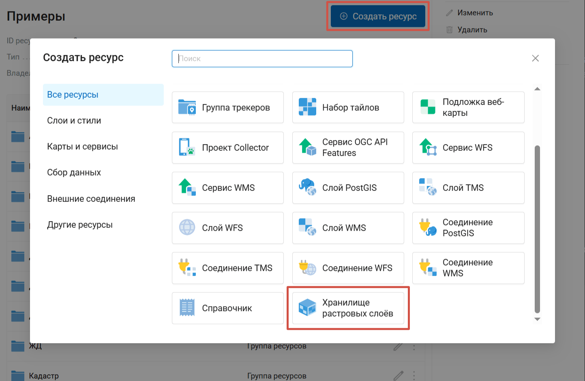

   Выбор типа создаваемого ресурса "Хранилище растровых слоёв"

Заполните данные хранилища значениями соответствующих переменных:

* Тип - AWS S3
* Адрес сервера (endpoint)
* Бакет (bucket)
* Префикс - не обязательно

Если это хранилище с ограниченным доступом, добавьте также:

* Ключ доступа (access_key)
* Секретный ключ (secret_key)

Если это публичное хранилище, то вместо этого поставьте галочку в поле "Публичный доступ":

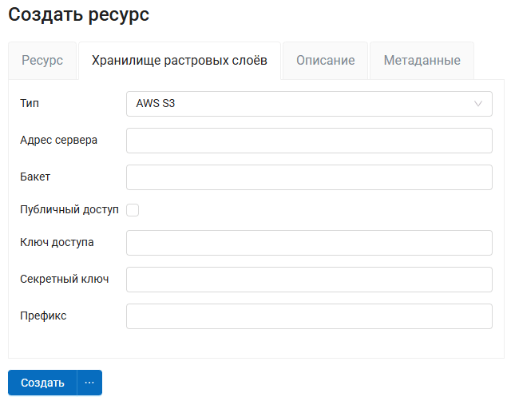

   Создание хранилища растровых слоёв

На вкладке "Ресурс" можно задать пользовательское наименование для хранилища, которое будет отображаться в списке ресурсов.

Нажмите **Сохранить** для завершения.

Теперь при создании растровых слоёв вы сможете выбирать, где их хранить: в облаке самой Веб ГИС или во внешнем хранилище (см. :numref:`ngweb_admin_layers_create_raster_layer_upload`).