.. _ngw_create_layers:

Add layers
===========

.. admonition:: Where to get data?

   `Access data <https://data.nextgis.com/en/>`_ for any place on Earth on NextGIS Data

Raster and vector geodata are uploaded to :ref:`Web GIS <ngcom_description>` by creating `Raster layer <https://docs.nextgis.com/docs_ngweb/source/layers.html#raster-layer>`_, `Vector layer <https://docs.nextgis.com/docs_ngweb/source/layers.html#vector-layer-from-file>`_ and `Tileset <https://docs.nextgis.com/docs_ngweb/source/layers.html#ngw-tile-set>`_ resources.

The size limit for uploaded files depends on the `selected plan <https://nextgis.com/pricing-base/>`_. For **Premium** - 50 GiB, for **Free** - 5 GiB and **Mini** - 10 GiB. On Free you can create up to 15 layers, if you need more, you can `upgrade to Premium <https://my.nextgis.com/subscription/>`_ in your NextGIS ID account or `deploy NextGIS Web on-premise <https://nextgis.com/pricing/>`_.

If you have an external S3 storage, you can use it to store your rasters by creating a `Raster layer storage <https://docs.nextgis.ru/docs_ngweb/source/layers.html#raster-storage>`_ resource.

See other data requirements for `raster <https://docs.nextgis.com/docs_ngweb/source/layers.html#ngw-raster-requirements>`_ and `vector <https://docs.nextgis.com/docs_ngweb/source/layers.html#input-data-requirements>`_ layers below.

.. _ngw_create_vector_layer:

Vector layer from file
-----------------------

In NextGIS Web you can create vector layers based on variours `formats <https://docs.nextgis.com/docs_ngweb/source/layers.html#input-data-requirements>`_, use `PostGIS connection <https://docs.nextgis.com/docs_ngweb/source/postgis_details.html#vector-layer-from-postgis>`_ or create an `empty vector layer <https://docs.nextgis.com/docs_ngweb/source/layers.html#empty-vector-layer>`_ that has attribute structure but no features.

.. _ngw_vector_data_requirements:

Input data requirements
^^^^^^^^^^^^^^^^^^^^^^^^^

Source files could be in the following formats: 

* :term:`ESRI Shapefile`
* :term:`GeoJSON`
* :term:`KML`
* :term:`GML`
* :term:`GeoPackage`

Point layers can also be created from CSV and XLSX files, the coordinates should be in the 'lat' and 'lon' columns. Watch the process of creating such a layer in the video:

.. raw:: html

   <iframe width="560" height="315" src="https://www.youtube.com/embed/-Yb4_GQugfQ?si=GUIXGZJQraiIg3vc" title="YouTube video player" frameborder="0" allow="accelerometer; autoplay; clipboard-write; encrypted-media; gyroscope; picture-in-picture; web-share" referrerpolicy="strict-origin-when-cross-origin" allowfullscreen></iframe>

Watch on `youtube <https://youtu.be/-Yb4_GQugfQ?si=_6akhHxlIURO6AEL>`_.

Use :ref:`NextGIS Connect <ngcom_ngqgis_connect_data_upload>` if you need to upload data in other formats.

.. note:: 
   In case of ESRI Shapefile, all components (dbf, shp, shx, prj and other files) 
   should be compressed to a zip-archive.

File size limits depend on your `subscription plan <https://nextgis.com/pricing-base/>`_.
   
.. warning:: 
	Avoid using Unicode symbols in data field names. While such data can be uploaded to the Web GIS and displayed on Web Maps, you can experience problems working with it in NextGIS Mobile or visualization (especially if labels are using such fields). Use plain Latin for field names and set up field aliases to show Unicode names.
	
	
If input data layer contains fields named id (ID) or geom (GEOM), they will be renamed on import. If id has meaningful identifiers, they will automatically be turned into internal FIDs.

.. _ngw_process_create_vector_layer:

Create layer from file
^^^^^^^^^^^^^^^^^^^^^^^

.. hint::

   **Don't have the data?**

   `Access geodata <https://data.nextgis.com/en/>`_ for any place on Earth on NextGIS Data 

Navigate to the resource group (folder) in which to create a vector layer.
Click **Create resource** button and select **Vector layer** (see :numref:`ngweb_admin_layers_create_vector_layer`).

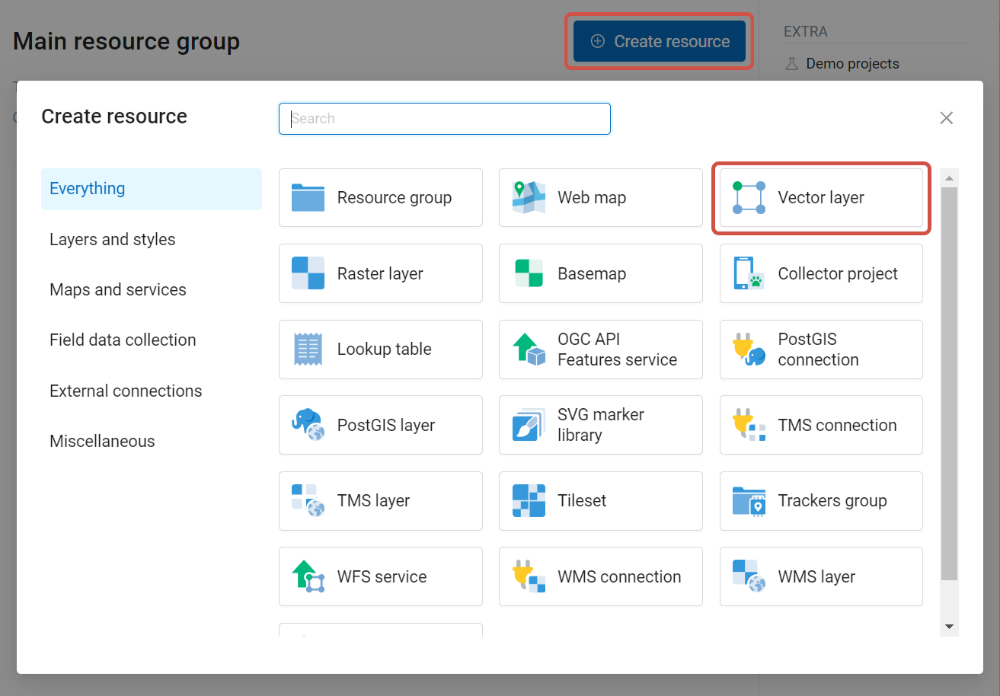

   Selection of "Vector layer" resource type

In the opened tab you need to upload a geodata file in :term:`ESRI Shapefile` (zip-archive), :term:`GeoJSON`, :term:`KML`, :term:`GML` or :term:`GeoPackage` format. For :term:`CSV` and :term:`XLSX` only points are supported, coordinates must be put in lat and lot columns. 

The upload dialog indicates the maximum file size allowed on your subscription plan (:numref:`ngweb_admin_layers_create_vector_layer_upload`). Web GIS can process multi-layer datasets. If an archive contains several layers, then after it is uploaded, you will be asked to select which layer will be used for creating Vector layer resource.

Below it is proposed to define advanced options for creating a vector layer. Depending on the quality of the data you can define how to handle geometry errors when uploading a file, select the type of geometry, the presence/absence of multigeometries, Z-coordinates and the source of the FID (FID field, determine automatically or indicate from a particular field). `More about advanced options <https://docs.nextgis.com/docs_ngweb/source/vect_layer_upload_params.html>`_.

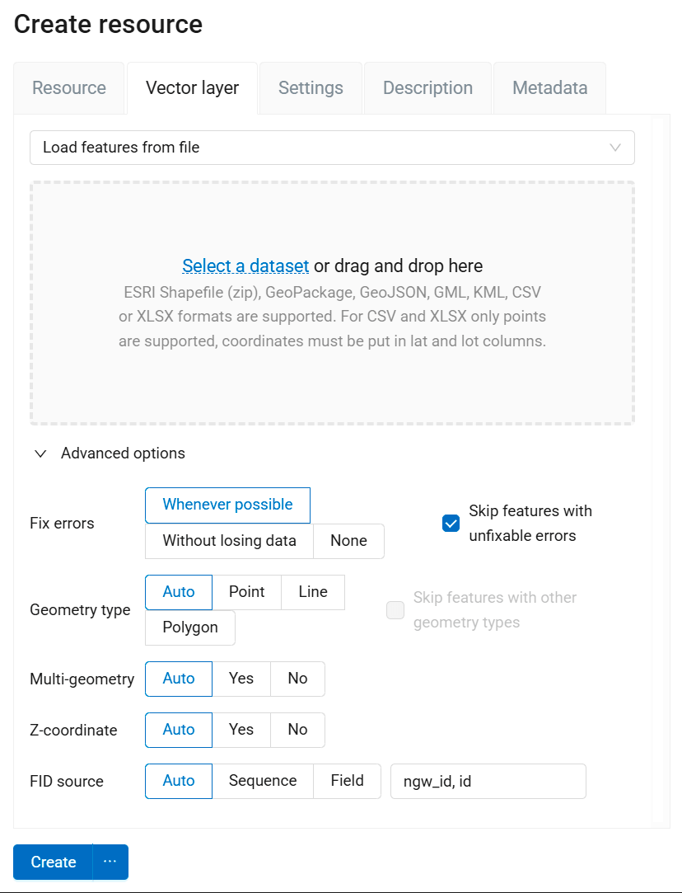

   Vector file upload tab

In the "Resource" tab enter the name of the vector layer (:numref:`ngweb_admin_layers_create_vector_layer_resourse_name`).
It will be displayed in the admin interface. The "Key" field is optional.

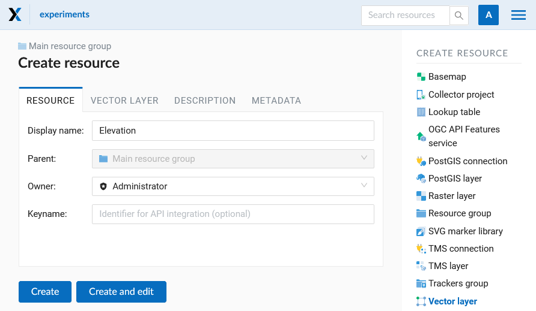

   Vector layer name

Also you can add `Description and metadata <https://docs.nextgis.com/docs_ngweb/source/edit_resource.html#ngw-update-info-metada>`_. 

After uploading the file and specifying the parameters, click the **Create** button.

Then you can `create a style <https://docs.nextgis.com/docs_ngweb/source/mapstyles.html#qgis>`_ that will later visualize the data layer on a `Web Map <https://docs.nextgis.com/docs_ngweb/source/webmaps_admin.html#ngw-map-create>`_. You can also create a `form or data collection <https://docs.nextgis.com/docs_ngweb/source/collector.html#collector-create-form>`_.

.. _ngw_create_empty_vector_layer:

Empty vector layer
^^^^^^^^^^^^^^^^^^^^^^^

Creating an empty vector layer allows you to start a data base in your WebGIS without using a desktop app. 

Navigate to the resource group (folder) in which to create a vector layer.
Click **Create resource** button and select  **Vector layer**. 

   Selecting "Vector layer" resource type

In the opened window use the dropdown menu to select "Create empty layer". In the field below select geometry type for the layer. By default, a point layer will be created.

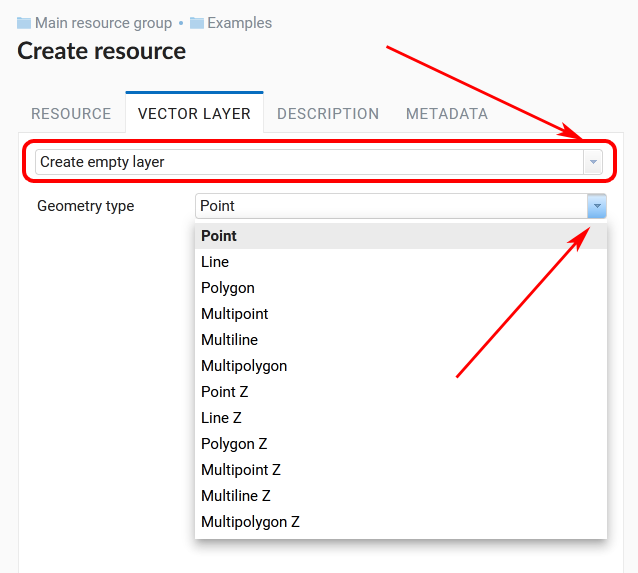

   Selecting geometry type for an empty layer

**Points, lines and polygons** are supported. For any of these geometry types you can select an option with **multigeometries** and/or **Z-coordinate**.

On the "Resource" tab enter the name of the vector layer. It will be displayed in the resource list. By default the resource type is used as its display name.

Next, click on the three dots next to the **Create** button and select **Create and edit**.

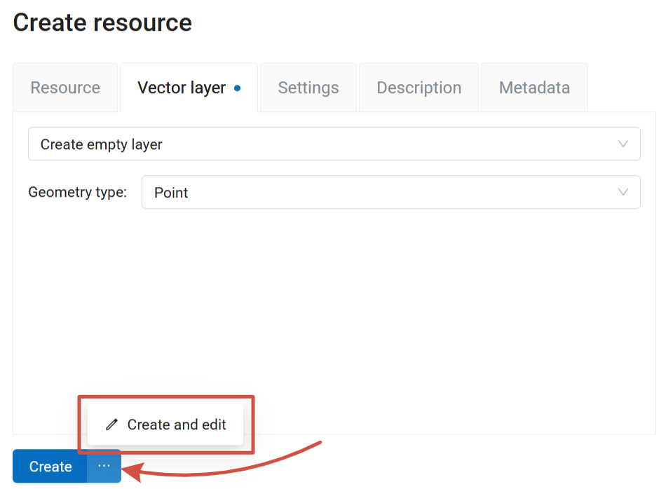

   Opening the resource update page immediately after creating the resource

The layer is created and a new tab opens where you can add attributes (fields).

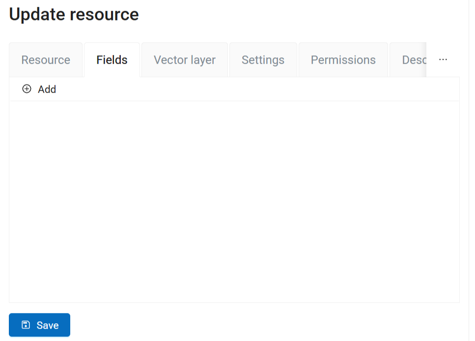

   Fields tab

Click |button_plus_layer| **Add**. A field is created. Click on it to open the properties dialog. 

Select the data type for the field (numbers: INTEGER, BIGIN, REAL, text: STRING, date and/or time: DATE, TIME, DATETIME, logical: BOOLEAN).

The name of the field can also be edited.

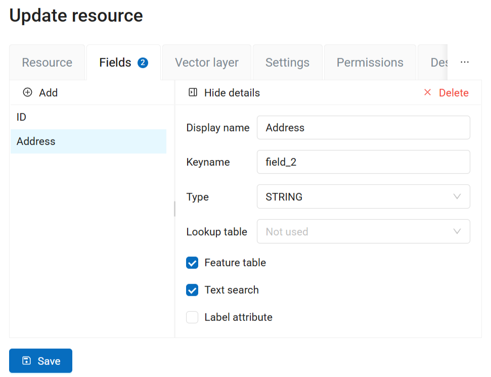

   A new field with string data type and "Address" as a custom name

Click |button_hide_details| **Hide detaild** to return to the list of fields.

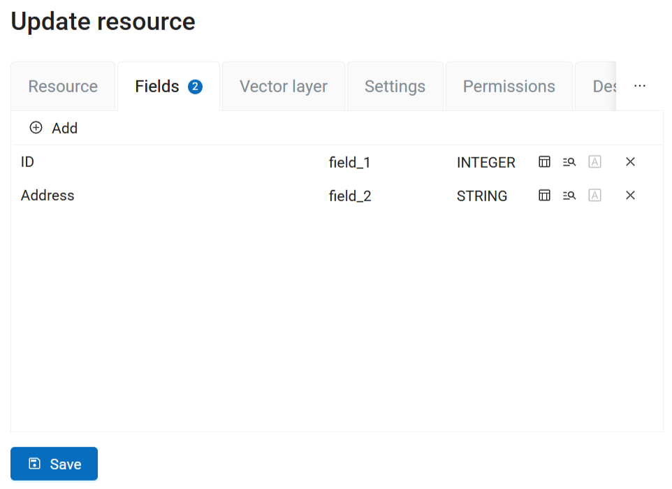

   Field list

When all the necessary fields are added, click **Save**.

Later you can `edit the fields <https://docs.nextgis.com/docs_ngweb/source/layers_settings.html#ngw-attributes-edit>`_.

.. |button_plus_layer| image:: _static/button_plus_layer.png
   :width: 6mm

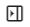

Now you can create a `style <https://docs.nextgis.com/docs_ngweb/source/mapstyles.html#qgis>`_ that will later visualize the data layer on a `Web Map <https://docs.nextgis.com/docs_ngweb/source/webmaps_admin.html#ngw-map-create>`_.

To add features to the newly created layer you can use the `editing toolbar <https://docs.nextgis.com/docs_ngweb/source/feature_edit.html>`_.

.. _ngw_create_raster_layer:

Raster layer
------------

Raster images in NextGIS Web should be loaded using the "Raster Layer" special resource.

.. _ngw_raster_requirements:

Requirements for uploaded files
^^^^^^^^^^^^^^^^^^^^^^^^^^^^^^^

Data must be georeferenced and have valid reference system description in GeoTIFF tags.

Supported format: 

* :term:`GeoTIFF` or ZIP-archived GeoTIFF;
* georeferenced JPEG or PNG in a ZIP-archive containing the image file and the \*.aux.xml file.

.. _ngw_process_create_raster_layer:

Creation process
^^^^^^^^^^^^^^^^

To add a raster layer navigate to a group where you want to create it. Press **Create resource** button and select  **Raster layer** (see :numref:`ngweb_admin_layers_create_raster_layer`). 

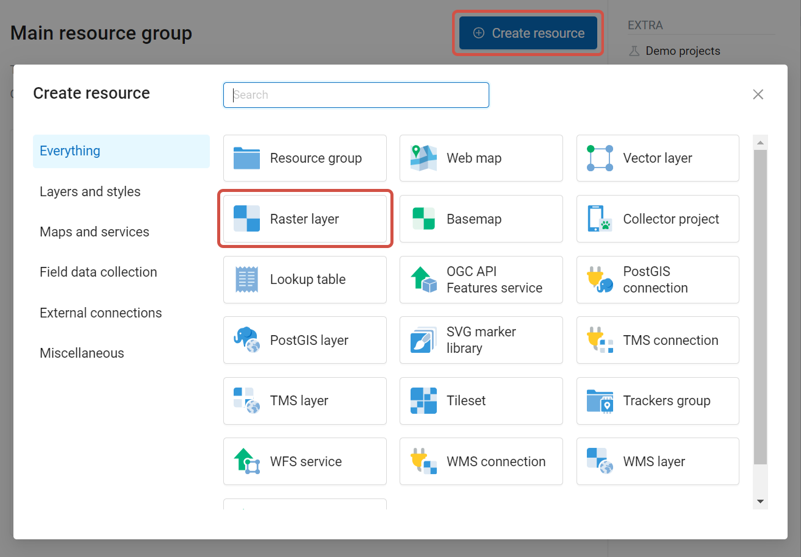

   Selection of "Raster layer" resource type
   
On the "Raster layer" tab you need to upload a geodata file in GeoTIFF format.
The upload dialog indicates the maximum file size allowed on your subscription plan (:numref:`ngweb_admin_layers_create_raster_layer_upload`).

If you plan to use this raster in QGIS directly from your Web GIS, tick the Upload as Cloud Optimized GeoTIFF (COG) checkbox. This will optimize the raster to ensure fast display.

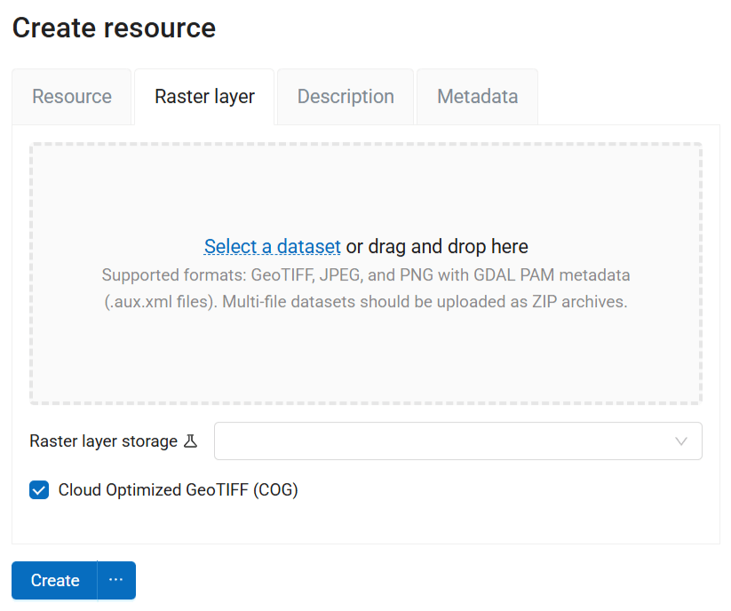

   Uploading raster file  

If you have an external S3 storage for your rasters, select a previously created `Raster layer storage <https://docs.nextgis.com/docs_ngweb/source/layers.html#raster-storage>`_:

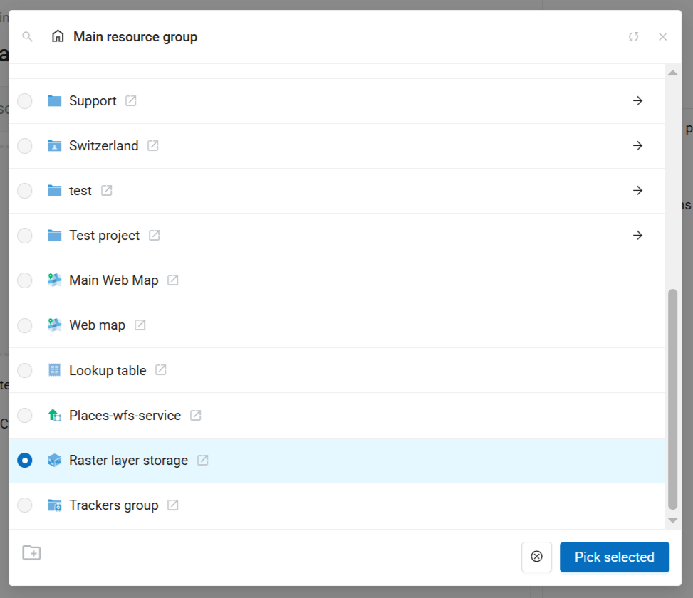

   Selecting S3 storage for raster layer

You can upload the raster to the storage or select a file that's already stored there.

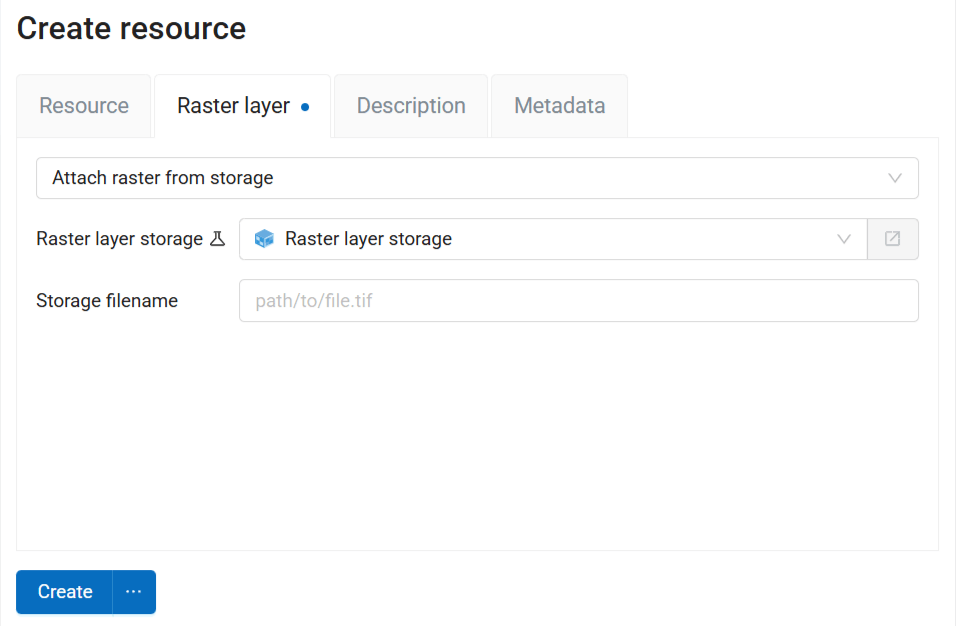

   Adding a raster file from storage

In the "Resource" tab you can specify the name of the raster layer.
It will be displayed in the admin interface. The "Key" field is optional.

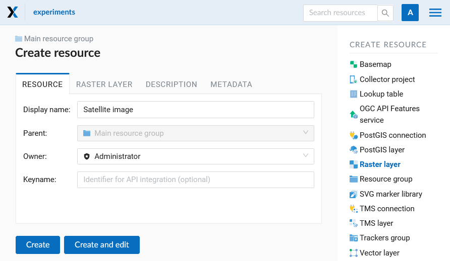

   Raster layer name

Also you can add `Description and metadata <https://docs.nextgis.com/docs_ngweb/source/edit_resource.html#ngw-update-info-metada>`_. 
   
To complete click the **Create** button.

.. _ngw_raster_volume:

Uploading big rasters
^^^^^^^^^^^^^^^^^^^^^^^^^^^^^^^^^^^^^^^^^^^^^^

Satellite images of high resulution and other rasters may be very large. The file size is not representative because data is compressed. The actual data size may be much bigger. To make sure that raster data is quickly rendered on a Web Map and services work fast raser files must be converted before uploading them o Web GIS.

There are three limitation for uploading big rasters:

1. Max file size - it depends on your `subscription plan <https://nextgis.com/pricing-base/>`_, on Premium the limit is **50 GiB**. 
2. Max size of extracted raster is equal to max file size multiplied by 2, so for Premium it's **100 GiB**. GeoTIFF uses a compression algorithm and the file size may be drastically smaller than the size of the unpacked data. To calculate the size of he decompressed raster multiply the three parameters: pixel count * number of bands * bytes per pixel. 

.. note:: If the raster file does not have alpha channel, it will be added during uploading, further expanding the raster size, so for calculating the data size add +1 channel to the equasion.

3. Overall data storage of the Web GIS - on Premium you can upload up to **50 GiB** of data  (this limit `can be expanded <https://nextgis.com/pricing-base/#storage>`_);

There is no time limit for uploading raster files. 

.. _ngw_raster_alpha:

Raster layer with transparency (clip or alpha channel)
^^^^^^^^^^^^^^^^^^^^^^^^^^^^^^^^^^^^^^^^^^^^^^^^^^^^^^^^

Most of utilities do not create an alpha channel and only add a NoData value. 
To transform NoData value to an alpha channel use the command line utility 
:program:`gdalwarp`. Here is an example of this command.

.. code:: shell

   gdalwarp -t_srs EPSG:3857 -multi -dstalpha -dstnodata none -wo \
   "UNIFIED_SRC_NODATA=YES" -co COMPRESS=JPEG \ 
   d:\temp\o\ast_20010730_010043_rgb.tif d:\temp\o\ast_20010730_010043_rgba.tif
   
.. _ngw_raster_index:

Uploading indexed color rasters
^^^^^^^^^^^^^^^^^^^^^^^^^^^^^^^

Indexed Color raster files are uploaded just like the RGB raster files. If the file is not in GeoTIFF format, you can convert it as follows:

.. code-block:: shell

    gdal_translate madison.map  madison.tif

.. _ngw_tile_set:

Tileset
-------

To add a **Tileset**, select a Tileset in the "Create Resource" block of operations.

.. figure:: _static/ngweb_create_tileset_en.png
   :name: Tileset_create_en
   :align: center
   :width: 20cm

   Selecting Tileset resource type

Next, you need to enter the name of the tileset, which will be displayed in the administrative web interface.

The "Key" field is optional. On the appropriate tabs, you can add a resource description and metadata. Typically, metadata is used to develop third-party applications using APIs.

In the "Tileset" tab, you need to upload a tileset in MBTiles format or a zip archive. Tiles must be in PNG or JPEG format and have a size of 256x256 pixels.

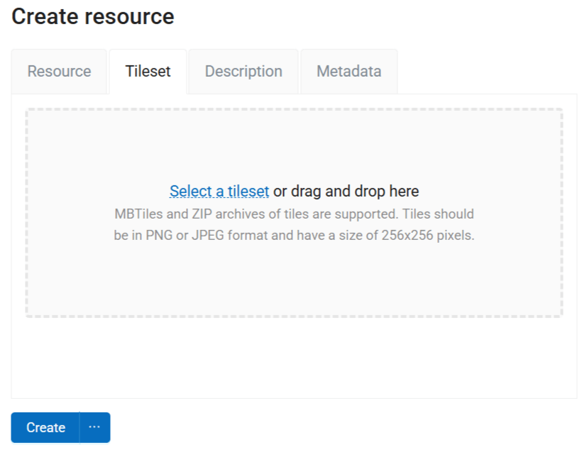

   Tileset tab

Click **Create** to complete the process.

See how to add a tileset in our video:

.. raw:: html

   <iframe width="560" height="315" src="https://www.youtube.com/embed/eCeptUacIRM?si=3sIwP6nZJBHB9g7g" title="YouTube video player" frameborder="0" allow="accelerometer; autoplay; clipboard-write; encrypted-media; gyroscope; picture-in-picture; web-share" referrerpolicy="strict-origin-when-cross-origin" allowfullscreen></iframe>

Watch on `youtube <https://youtu.be/eCeptUacIRM?si=AxMNJO2AtYcJS0EG>`__.

After creating a Tileset you can:

* add it to a `Web Map <https://docs.nextgis.com/docs_ngweb/source/webmaps_admin.html>`_,
* add it to an external app using `TMS link <https://docs.nextgis.com/docs_ngweb/source/services.html#ngw-tms-service>`_ from the External access section,
* publish it as part of a `WMS service <https://docs.nextgis.com/docs_ngweb/source/services.html#wms>`_.

.. _raster_storage:

Raster layer storage
-------------------------

If you want to use an external storage for your raster layers, you can connect it to your Web GIS.

Go to the resource group where you want to create the connection, click **Create resource** and select **Raster layer storage**.

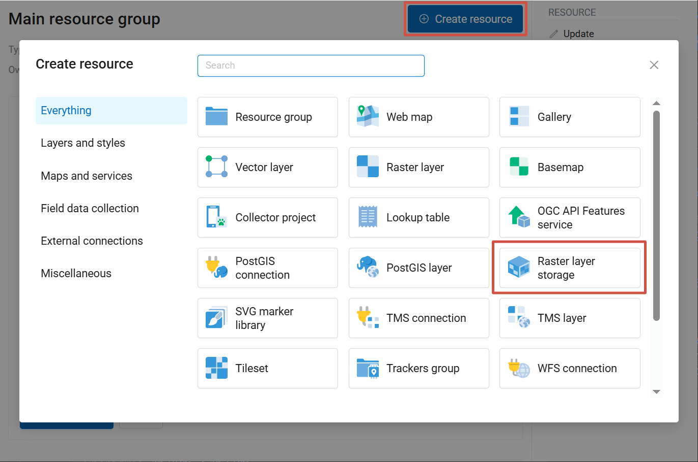

   Selecting Raster layer storage

Fill in the form with the values of the corresponding variables:

* Type - AWS S3
* Endpoint
* Bucket
* Prefix (optional)

If it's a private storage, enter also the credentials:

* Access key
* Sercret key

If it's a public storage, tick "Public access" instead.

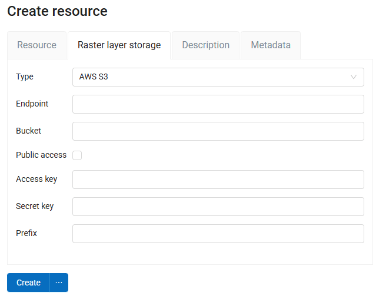

   Settings of the raster layer storage

On the "Resource" tab you can enter a custom name for the storage. It will be displayed in the list of resources.

Click **Create** to complete the process.

While creating a raster layer you can choose where to store it: in the Web GIS itself or in the external storage (see :numref:`ngweb_admin_layers_create_raster_layer_upload`).

