.. _ngw_create_layers:

Добавление слоёв
==================

Загрузка растровых и векторных геоданных в :ref:`Веб ГИС <ngcom_description>` происходит путем создания ресурсов `Растровый слой <https://docs.nextgis.ru/docs_ngweb/source/layers.html#ngw-create-raster-layer>`_ и `Векторный слой <https://docs.nextgis.ru/docs_ngweb/source/layers.html#ngw-create-vector-layer>`_.

.. note:: 
	Ограничение на размер загружаемых файлов зависит от выбранного тарифного плана. Для **Premium** - 2 GiB, для **Free** - 128 MiB, для **Mini** - 256 MiB. 

См. также поддерживаемые форматы и другие требования к исходным данным: `для растровых слоёв <https://docs.nextgis.ru/docs_ngweb/source/layers.html#ngw-raster-requirements>`_, `для векторных слоёв <https://docs.nextgis.ru/docs_ngweb/source/layers.html#ngw-vector-data-requirements>`_.

.. _ngw_create_raster_layer:

Растровый слой
--------------

Растровые изображения в NextGIS Web загружаются через специальный ресурс "Растровый слой".

.. _ngw_raster_requirements:

Требования к исходным данным
^^^^^^^^^^^^^^^^^^^^^^^^^^^^

* Поддерживаемый формат: :term:`GeoTIFF` или ZIP-архив с таким файлом.
* Данные должны быть географически привязаны и иметь корректно сформированное описание системы координат (в тегах GeoTIFF).

.. _ngw_process_create_raster_layer:

Процесс создания
^^^^^^^^^^^^^^^^^^
Перейдите в группу ресурсов (папку), в которой необходимо создать рстровый слой.
Нажмите кнопку **Создать ресурс** и выберите во всплывающем окне тип ресурса **Растровый слой** (см. :numref:`ngweb_admin_layers_create_raster_layer`).

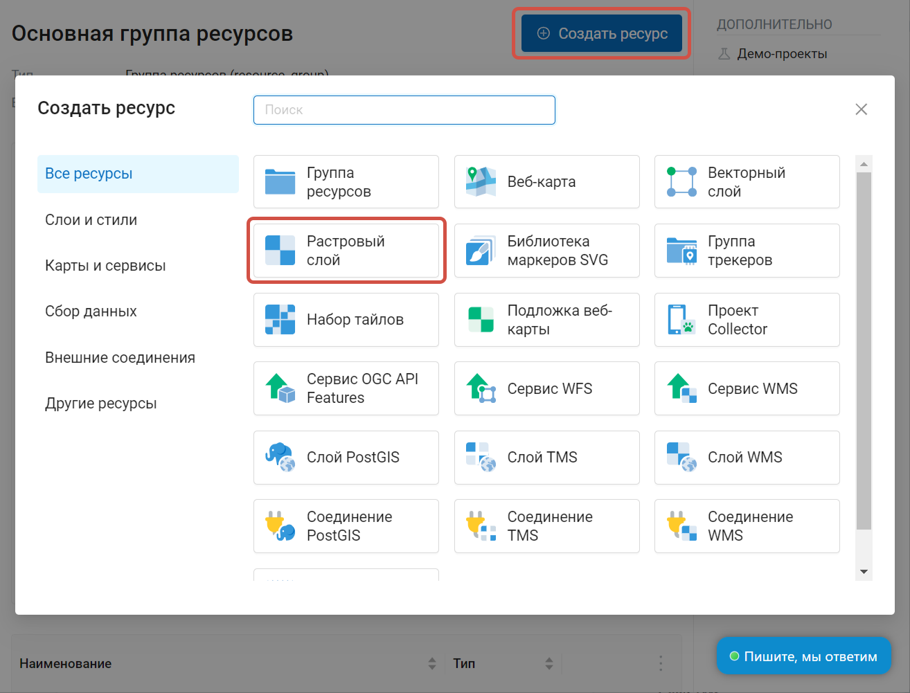

   Выбор типа ресурса "Растровый слой"

В открывшемся окне на вкладке "Растровый слой" необходимо загрузить файл геоданных в формате GeoTIFF.
В зависимости от тарифного плана в окне отображается максимально допустимый объем загружаемого файла (:numref:`ngweb_admin_layers_create_raster_layer_upload`).

Если вы планируете подключать этот растр в QGIS напрямую из Веб ГИС, при загрузке включите режим Загрузить как Cloud Optimized GeoTIFF (COG). Это оптимизирует его специальным образом для более быстрого подключения и отображения.

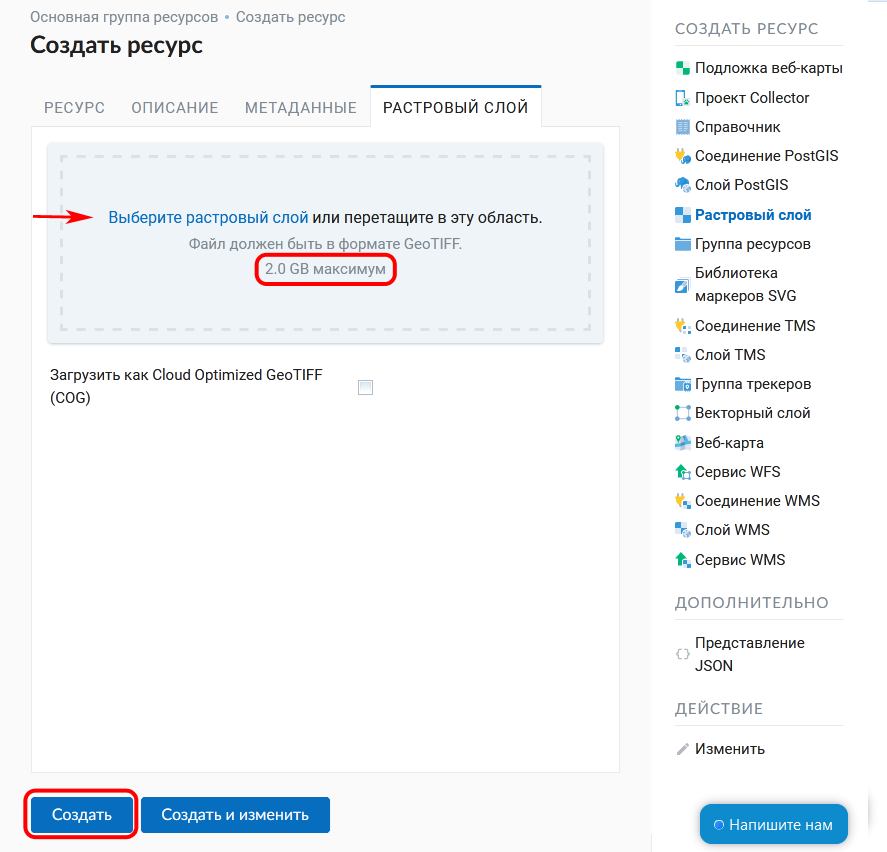

   Окно загрузки растрового файла

Во вкладке "Ресурс" укажите наименование растрового слоя (см. :numref:`ngweb_admin_layers_create_raster_layer_resourse_name`).
Оно будет отображаться в административном интерфейсе. Поле "Ключ" является необязательным к заполнению.

   Наименование растрового слоя

На вкладке "Описание" можно добавить произвольный текст, описывающий содержимое данного слоя (:numref:`ngweb_admin_layers_create_raster_layer_resourse_description`).

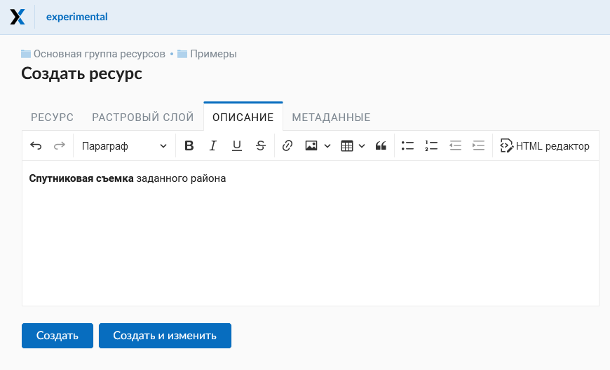

   Описание растрового слоя

В "Метаданные" слоя можно записать информацию в формате "ключ-значение" (:numref:`ngweb_admin_layers_create_raster_layer_resourse_metadata`).
Как правило, метаданные используются для разработки сторонних приложений с помощью `API <https://docs.nextgis.ru/docs_ngweb_dev/doc/developer/toc.html>`_.

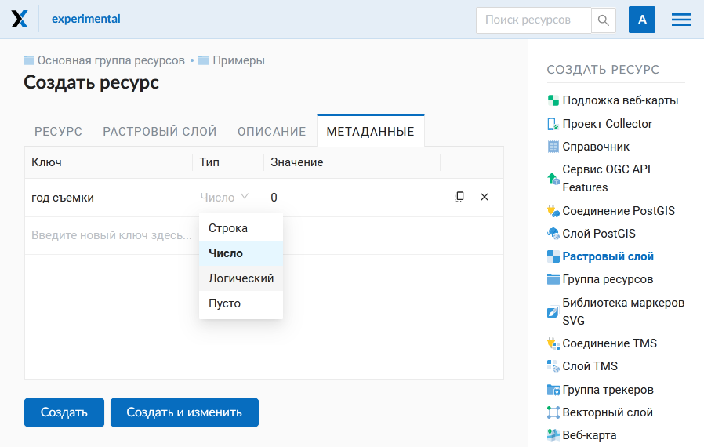

   Метаданные растрового слоя

После указания всех необходимых параметров нажмите кнопку **Создать**.

Чтобы добавить созданный слой на веб-карту, нужно сначала `создать для него стиль <https://docs.nextgis.ru/docs_ngweb/source/layers.html#ngw-process-create-raster-style>`_.

.. _ngw_raster_volume:

Замечания по загрузке растров большого объёма
^^^^^^^^^^^^^^^^^^^^^^^^^^^^^^^^^^^^^^^^^^^^^^

Данные БПЛА, космической съемки высокого разрешения и другие растры могут занимать значительный объем. При этом, сам по себе размер файла растра не очень репрезентативен, так как реальный объем данных может быть значительно больше из-за сжатия. Чтобы быстро показывать растровые данные на веб картах и раздавать с помощью сервисов, они должны быть специальным образом преобразованы перед загрузкой в Веб ГИС и созданием соответствующих растровых слоёв.

Существует три ограничения, касающиеся загрузки растров большого размера:

#. Максимальный размер загружаемого файла - зависит от вашего `плана <https://nextgis.ru/pricing-base/>`_, по умолчанию на плане Премиум - **2 GiB**. С некоторыми ограничениями это значение можно изменить в облаке и, без ограничений, `на своем сервере <https://nextgis.ru/pricing>`_;
#. Размер распакованного на сервере растра - после распаковки в облаке максимальный размер не должен превышать  **4 GiB**. Размер распакованного растра можно вычислить по формуле: количество пикселей * количество каналов * количество байт на пиксель.
#. Общий объем данных - на плане Премиум вы можете загрузить до **50 GiB** данных  (это значение `можно увеличить <https://nextgis.ru/pricing-base/#volume-premium>`_);

Время загрузки растра на сервер не ограничено. 

.. _ngw_raster_alpha:

Растровый слой с прозрачностью (обрезкой, альфа-каналом)
^^^^^^^^^^^^^^^^^^^^^^^^^^^^^^^^^^^^^^^^^^^^^^^^^^^^^^^^

Большинство утилит не создают канал прозрачности (А или альфа канал), а только добавляют значение NoData. 
Для преобразования значений NoData в альфа канал можно воспользоваться утилитой 
командной строки  :program:`gdalwarp`. Ниже приведен пример команды.

.. code-block:: shell

   gdalwarp -t_srs EPSG:3857 -multi -dstalpha -dstnodata none -wo \
   "UNIFIED_SRC_NODATA=YES" -co COMPRESS=JPEG \ 
   d:\temp\o\ast_20010730_010043_rgb.tif d:\temp\o\ast_20010730_010043_rgba.tif

.. _ngw_raster_index:

Загрузка растров с индексированными цветами
^^^^^^^^^^^^^^^^^^^^^^^^^^^^^^^^^^^^^^^^^^^

Загрузка растров с индексированными цветами происходит так же, как и растров в RGB.
Если файл находится не в GeoTIFF, то его можно сконвертировать в `NextGIS Command Prompt <https://docs.nextgis.ru/docs_howto/source/command_prompt.html>`_ при помощи команды

.. code-block:: shell

    gdal_translate yaroslavl.map  yaroslavl.tif

.. _ngw_process_create_raster_style:

Стиль для растров
------------------

После удачной загрузки растра необходимо создать стиль для его отображения на карте. Есть несколько вариантов, как это сделать:

* Создать стиль QGIS по умолчанию, зайдя на страницу слоя:

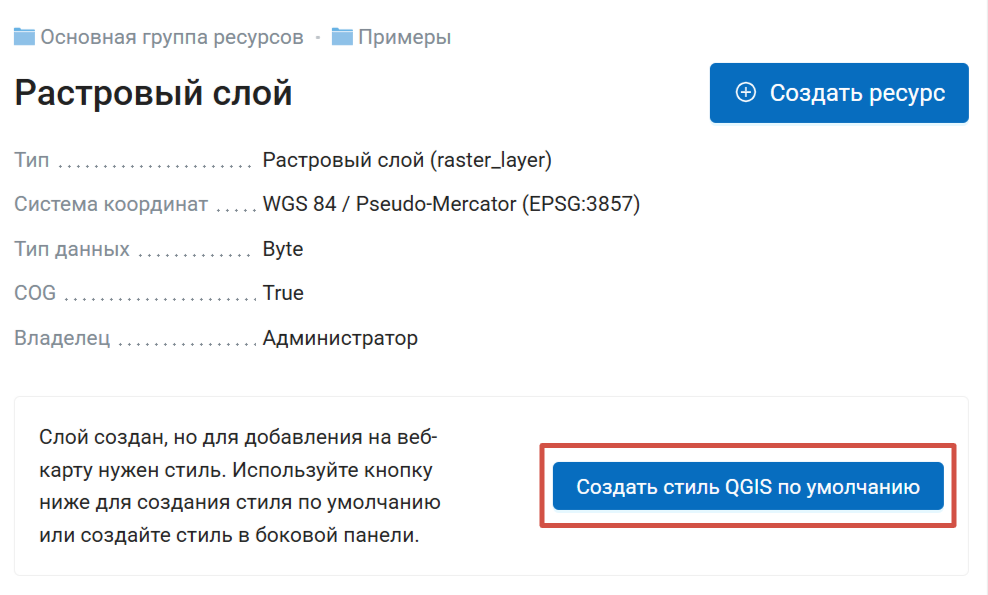

   Создание стиля QGIS по умолчанию для растрового слоя

* Создать растровый стиль по умолчанию при помощи кнопки **Создать ресурс**:

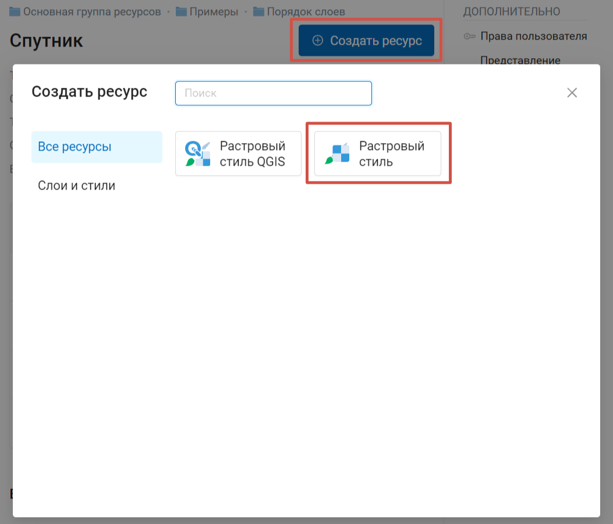

   Создание растрового стиля

В настройках ресурса "Растровый стиль" можно разрешить тайлы для запросов изображений, задать время жизни тайлов и максимальный зум. Чтобы очистить ранее созданные тайлы стиля, отметьте "Очистить".

* Создать растровый стиль QGIS при помощи кнопки **Создать ресурс**. В выпадающем меню можно выбрать:

   * Стиль из файла - выберите файл стиля в формате QML или SLD. Создать его можно в `NextGIS QGIS <https://docs.nextgis.ru/docs_ngqgis/source/ngq_raster_styles.html#ngq-raster-styles>`_;
   * Пользовательский стиль - этот вариант позволяет выбрать три канала, значения которых будут использоваться для формирования цвета в формате RGB, и задать для каждого минимальное и максимальное значение;
   * Стиль по умолчанию - позволяет добавить стиль по умолчанию к слою, у которого уже есть стили;
   * Скопировать из ресурса - выберите стиль QGIS другого растрового слоя, чтобы создать его копию.

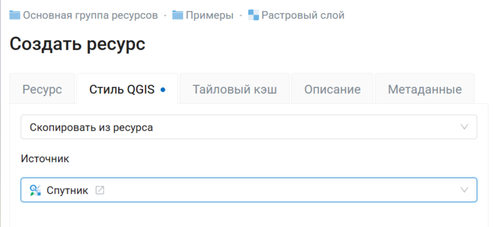

   Копирование стиля QGIS

При создании веб-карты (подробнее см. :ref:`ngw_map_create`) выберите стиль, чтобы `добавить загруженный растр на карту <https://docs.nextgis.ru/docs_ngweb/source/webmaps_admin.html#ngw-map-layers>`_.

Посмотреть примеры стилей можно в нашей `Галерее картографических стилей <https://nextgis.ru/map-styles/>`_.

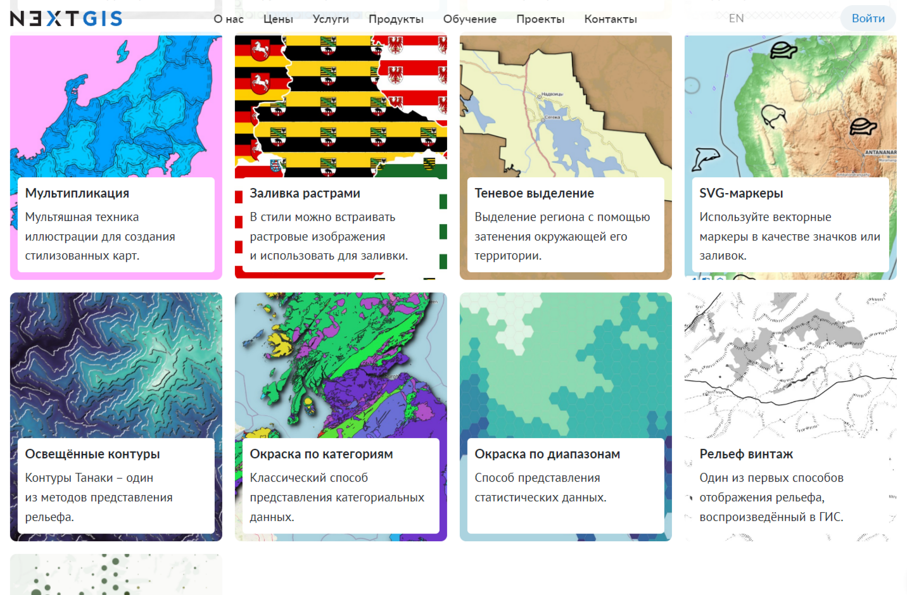

   Галеря стилей

.. _ngw_create_vector_layer:

Векторный слой из файла
-----------------------

В NextGIS Web можно создавать векторные слои на основе геоданных в различны `форматах <https://docs.nextgis.ru/docs_ngweb/source/layers.html#ngw-vector-data-requirements>`_ и соединений `PostGIS <https://docs.nextgis.ru/docs_ngweb/source/layers.html#postgis>`_, а также `пустые слои <https://docs.nextgis.ru/docs_ngweb/source/layers.html#ngw-create-empty-vector-layer>`_, которые имеют определённую структуру атрибутов, но не содержат объектов.

.. _ngw_vector_data_requirements:

Требования к исходным данным
^^^^^^^^^^^^^^^^^^^^^^^^^^^^^

В качестве исходного файла можно загружать следующие форматы:

* :term:`ESRI Shapefile`
* :term:`GeoJSON`
* :term:`KML`
* :term:`GML`
* :term:`GeoPackage`

Точечные слои также можно создать из файлов :term:`CSV` и :term:`XLSX`, координаты должны быть в колонках lat и lon. Посмотрите процесс создания такого слоя в видео:

.. raw:: html

   <iframe width="560" height="315" src="https://rutube.ru/play/embed/5302afb00e3af93dbd9adccf848d84db/" frameBorder="0" allow="clipboard-write; autoplay" webkitAllowFullScreen mozallowfullscreen allowFullScreen></iframe>

Смотреть на `youtube <https://youtu.be/LcGco1nclM8>`_, `rutube <https://rutube.ru/video/5302afb00e3af93dbd9adccf848d84db/>`_.

Если нужно загрузить данные в другом формате, вы можете использовать `NextGIS Connect <https://docs.nextgis.ru/docs_ngconnect/source/resources.html>`_.

.. note:: 
   В случае ESRI Shapefile все составляющие его части (dbf, shp, shx, prj и др.) должны быть 
   упакованы в архив формата Zip. 

.. note:: 
   Мы рекомендуем **не** использовать кириллицу в названиях полей атрибутов. Несмотря на то, что в большинстве случаев такие данные могут быть загружены в Веб ГИС и показаны на картах, в некоторых случаях вы можете испытывать проблемы с работой с такими данными в NextGIS Mobile и визуализацией (особенно если условные обозначения сформированы на базе одного из таких полей). Переименуйте поля латиницей перед загрузкой и используйте синонимы полей (алиасы) для их отображения кириллицей на картах.

Если во входном файле есть поля с названиями: id (ID) или geom (GEOM), то при загрузке они будут переименованы или превращены во внутренние идентификаторы (поле id).

.. _ngw_process_create_vector_layer:

Процесс создания
^^^^^^^^^^^^^^^^^^

Перейдите в группу ресурсов (папку), в которой необходимо создать векторный слой.
Нажмите кнопку **Создать ресурс** и выберите во всплывающем окне тип ресурса **Векторный слой** (см. :numref:`ngweb_admin_layers_create_vector_layer`). 

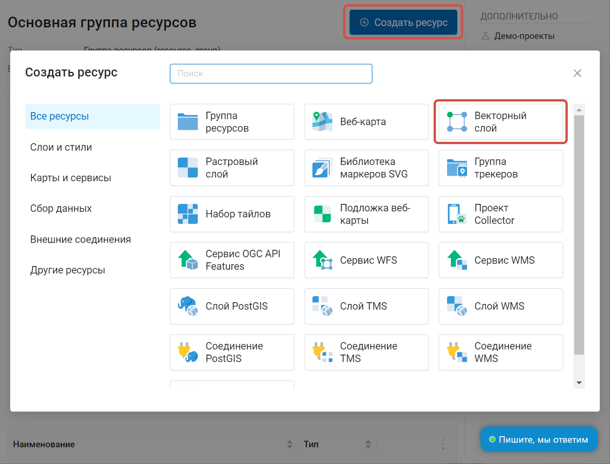

   Выбор типа ресурса "Векторный слой"
 
На открывшейся вкладке "Векторный слой" необходимо загрузить файл геоданных в формате :term:`ESRI Shapefile` (zip-архив), :term:`GeoPackage`, :term:`GeoJSON`, :term:`GML`, :term:`KML`, :term:`CSV` или :term:`XLSX`. Для CSV и XLSX поддерживаются только точки, координаты должны быть в колонках lat и lon.

В зависимости от `тарифного плана <http://nextgis.ru/nextgis-com/plans>`_ в окне отображается максимально допустимый объем загружаемого файла (:numref:`ngweb_admin_layers_create_vector_layer_upload`).
NextGIS Web может принимать многослойные наборы данных на входе. Если в архиве содержится несколько слоёв, то после его загрузки пользователю будет предложено выбрать слой, на основе которого будет создан ресурс "Векторный слой".

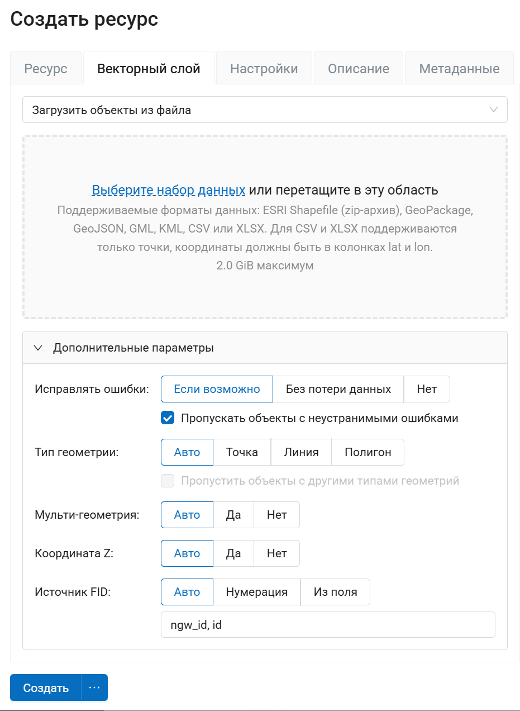

   Окно загрузки векторного файла

Ниже предлагается определить дополнительные параметры создания векторного слоя (обработка геометрий, поле FID). 
Подробнее о дополнительных параметрах можно прочитать `здесь <https://docs.nextgis.ru/docs_ngweb/source/vect_layer_upload_params.html>`_.

Если в ESRI Shapefile присутствует файл с описанием кодировки [расширение .cpg], то он будет учитываться при загрузке. 

Во вкладке "Ресурс" укажите название векторного слоя (:numref:`ngweb_admin_layers_create_vector_layer_resourse_name`). Оно будет отображаться в административном интерфейсе.
Поле "Ключ" является необязательным к заполнению.

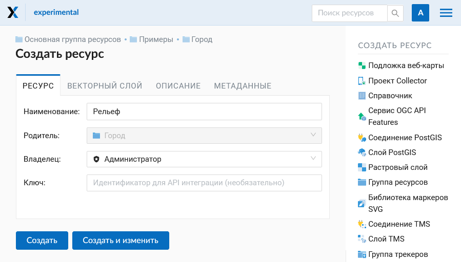

   Наименование векторного слоя
   
   
На вкладке "Описание" можно добавить произвольный текст, описывающий содержимое данного слоя (:numref:`ngweb_admin_layers_create_vector_layer_resourse_description`).

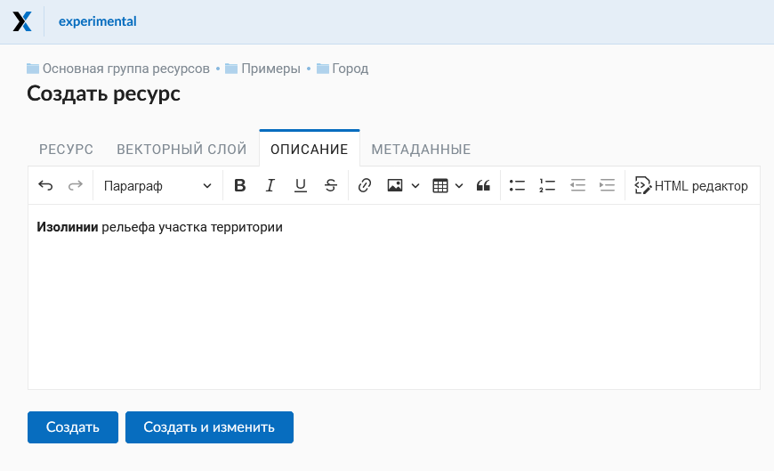

   Описание векторного слоя

В "Метаданные" слоя можно записать информацию в формате "ключ-значение" (:numref:`ngweb_admin_layers_create_vector_layer_resourse_metadata`).
Как правило, метаданные используются для разработки сторонних приложений с помощью `API <https://docs.nextgis.ru/docs_ngweb_dev/doc/developer/toc.html>`_.

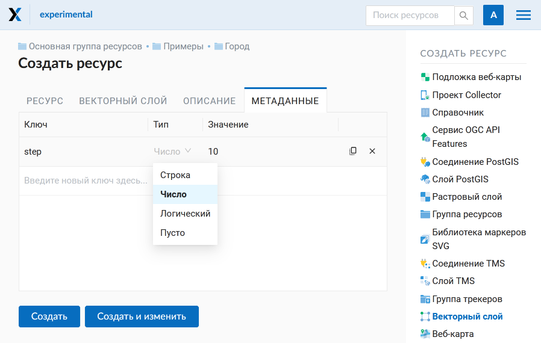

   Метаданные векторного слоя

На странице "Настройки" можно включить версионирование слоя. Это позволит нескольким пользователям редактировать синхронизируемый слой в настольном приложении QGIS `при помощи NextGIS Connect <https://docs.nextgis.ru/docs_ngconnect/source/edit.html#>`_.

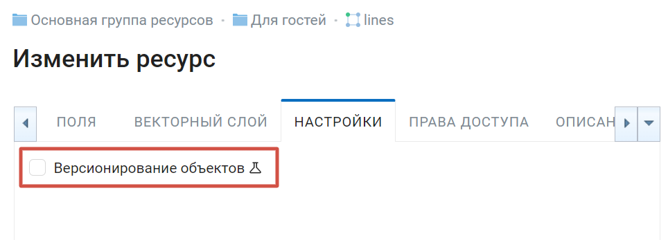

   Включение версионирования слоя

После завершения ввода нужных данных нажмите кнопку **Создать**.

Далее можно создавать `стиль <https://docs.nextgis.ru/docs_ngweb/source/mapstyles.html#qgis>`_, который в последующем будет визуализировать данные слоя на `веб-карте <https://docs.nextgis.ru/docs_ngweb/source/webmaps_admin.html#ngw-map-create>`_.

Также внутри ресурса "Векторный слой" можно `создать из готового файла Форму <https://docs.nextgis.ru/docs_ngweb/source/collector.html#collector-create-form>`_, которая будет использоваться для сбора данных. Однако более удобно создавать и загружать формы при помощи `NextGIS Formbuilder <https://docs.nextgis.ru/docs_formbuilder/source/workflow.html#nextgis-web>`_.

.. _ngw_create_empty_vector_layer:

Пустой векторный слой
-------------------------

Создание пустого векторного слоя позволяет начать вести базу данных в ВебГИС без использования настольного приложения. 

Перейдите в группу ресурсов (папку), в которой необходимо создать векторный слой.
Нажмите кнопку **Создать ресурс** и выберите во всплывающем окне тип ресурса **Векторный слой** (см. :numref:`ngweb_admin_layers_create_vector_layer_2`). 

   Выбор типа ресурса "Векторный слой"

В открывшемся окне в выпадающем меню выберите "Создать пустой слой". Ниже появится поле выбора типа геометрии слоя. По умолчанию создается точечный слой.

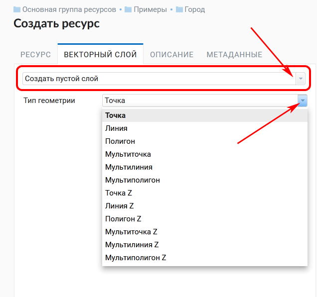

   Окно выбора геометрии пустого слоя

Во вкладке "Ресурс" укажите название векторного слоя (:numref:`ngweb_admin_layers_create_vector_layer_resourse_name`). Оно будет отображаться в административном интерфейсе.
Поле "Ключ" является необязательным к заполнению.

На вкладке "Описание" можно добавить произвольный текст, описывающий содержимое данного слоя (:numref:`ngweb_admin_layers_create_vector_layer_resourse_description`). 

В "Метаданные" слоя можно записать информацию в формате "ключ-значение" (:numref:`ngweb_admin_layers_create_vector_layer_resourse_metadata`).
Как правило, метаданные используются для разработки сторонних приложений с помощью `API <https://docs.nextgis.ru/docs_ngweb_dev/doc/developer/toc.html>`_.

После завершения ввода нужных данных нажмите кнопку **Создать**.

Далее можно создавать `стиль <https://docs.nextgis.ru/docs_ngweb/source/mapstyles.html#qgis>`_, который в последующем будет визуализировать данные слоя на `веб-карте <https://docs.nextgis.ru/docs_ngweb/source/webmaps_admin.html#ngw-map-create>`_.

Для добавления объектов на пустой слой можно использовать `инструменты редактирования веб-карты <https://docs.nextgis.ru/docs_ngweb/source/layers_settings.html#ngw-edit-objects>`_.

.. _ngw_create_postgis:

Векторный слой из PostGIS
-------------------------

Для добавления векторного слоя из :abbr:`БД (база данных)` PostgreSQL с модулем расширения PostGIS необходимо 
сначала создать ресурс — соединение PostGIS. 

.. _ngw_create_postgis_connection:

Соединение PostGIS
^^^^^^^^^^^^^^^^^^

Нажмите кнопку **Создать ресурс** и выберите во всплывающем окне тип ресурса **Cоединение PostGIS** (см. :numref:`admin_layers_create_postgis_connection_resourse`). 

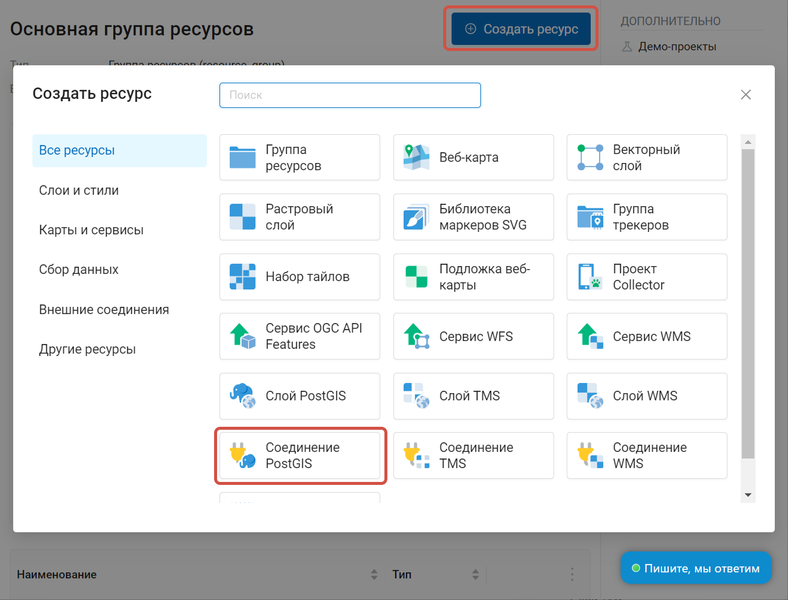

   Выбор типа ресурса "Соединение PostGIS"

В открывшемся окне укажите наименование PostGIS соединения (:numref:`ngweb_admin_layers_create_postgis_connection_resourse_name`). Оно будет отображаться в административном интерфейсе (не путайте это наименование и название слоёв в базе данных). Поле "Ключ" является необязательным к заполнению.

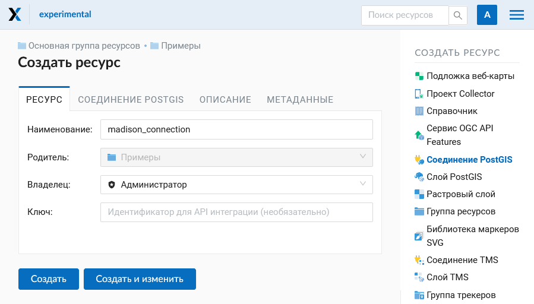

   Наименование соединения PostGIS

На вкладке "Описание" можно добавить произвольный текст, описывающий создаваемый ресурс (:numref:`ngweb_admin_layers_create_postgis_connection_resourse_description`).

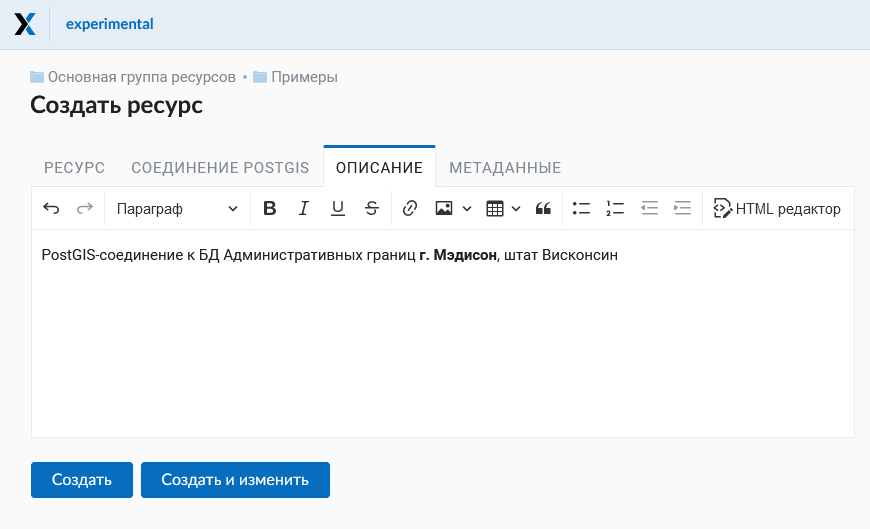

   Описание соединения PostGIS

В "Метаданные" ресурса можно записать информацию в формате "ключ-значение" (:numref:`ngweb_admin_layers_create_postgis_connection_resourse_metadata`).
Как правило, метаданные используются для разработки сторонних приложений с помощью `API <https://docs.nextgis.ru/docs_ngweb_dev/doc/developer/toc.html>`_.

   Метаданные соединения PostGIS
   
   
На вкладке "Cоединение PostGIS" необходимо ввести параметры подключения к :abbr:`БД (база данных)` PostGIS, из которой 
будут забираться ваши данные (:numref:`ngweb_admin_layers_create_postgis_connection_db_logins`).

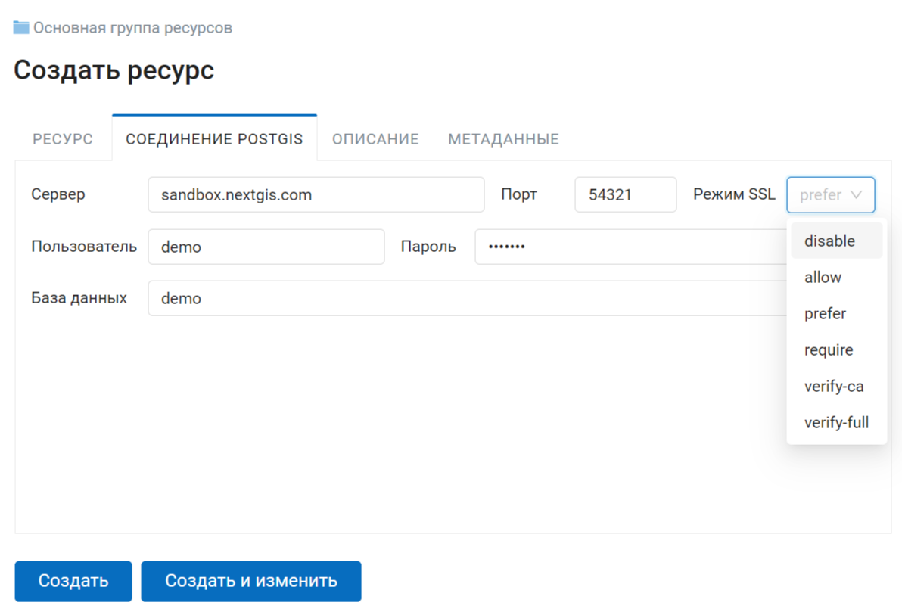

   Окно параметров соединения PostGIS

Режимы :term:`SSL`:

* ``disable`` - Отключает обработку SSL
* ``allow`` - Сначала будет сделана попытка установить соединение без использования SSL, если попытка будет неудачной, будет установлено SSL-соединение.
* ``prefer`` - Значение по умолчанию. Сначала будет сделана попытка установить SSL-соединение, если попытка будет неудачной, будет установлено соединение без использования SSL.
* ``require`` - При включении этой настройки вся связь с сайтом должна быть зашифрована с помощью HTTPS.
* ``verify-ca`` - обеспечивает шифрование и гарантирует, что сертификат сервера подписан доверенной организацией, но не проверяет, что имя хоста сервера соответствует сертификату. 
* ``verify-full`` - режим с высоким уровнем безопасности. При его использовании клиент проверяет как сертификат сервера, так и соответствие имени хоста сервера сертификату. Это гарантирует, что соединение зашифровано, а сервер аутентифицирован и соответствует ожидаемому имени хоста. 

После указания параметров нажмите кнопку **Создать**.   

.. _ngw_create_postgis_layer:

Слой PostGIS
^^^^^^^^^^^^^^^^^^

Далее можно приступать к добавлению отдельных слоёв PostGIS. Нажмите кнопку **Создать ресурс** и выберите во всплывающем окне тип ресурса **Слой PostGIS** (см. :numref:`admin_layers_create_postgis_layer`). 

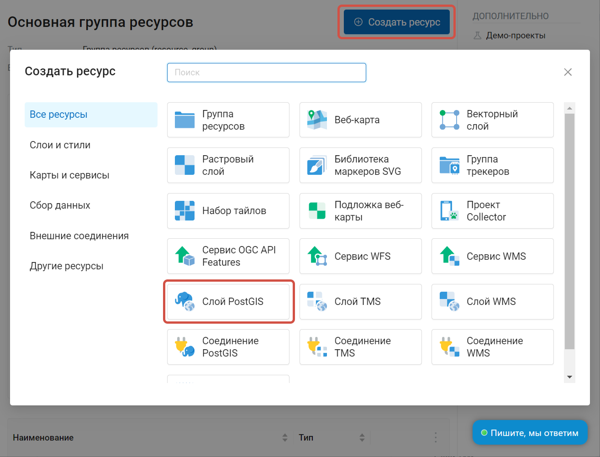

   Выбор типа ресурса "Слой PostGIS"
   
   
На вкладке "Ресурс" указывается наименование слоя PostGIS (:numref:`ngweb_admin_layers_create_postgis_layer_resourse_name`). Оно будет отображаться в административном интерфейсе и дереве слоев веб-карты после добавления. Поле Ключ является необязательным к заполнению.
   
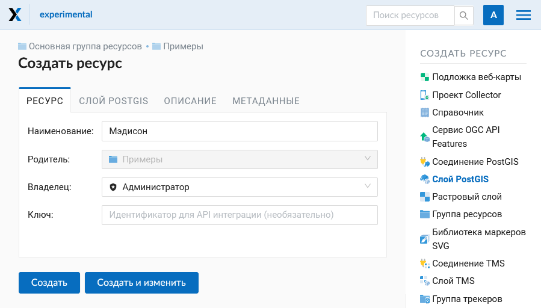

   Наименование Слоя PostGIS
   

В "Описании" можно задать произвольный текст, отражающий содержание ресурса (:numref:`ngweb_admin_layers_create_postgis_layer_resourse_description`).

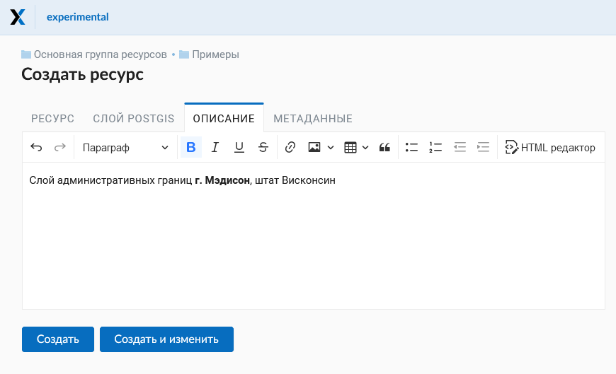

   Описание слоя PostGIS
   

На соответствующей вкладке есть возможность добавить метданные слоя PostGIS (:numref:`ngweb_admin_layers_create_postgis_layer_resourse_metadata`).
Как правило, метаданные используются для разработки сторонних приложений с помощью `API <https://docs.nextgis.ru/docs_ngweb_dev/doc/developer/toc.html>`_.

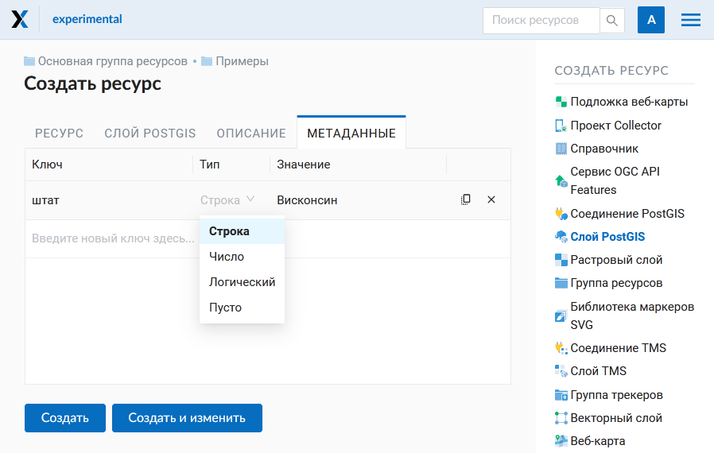

   Метаданные слоя PostGIS
  
  
На вкладке "Слой PostGIS" настраиваются параметры слоя (:numref:`ngweb_admin_layers_create_postgis_layer_tablename`).

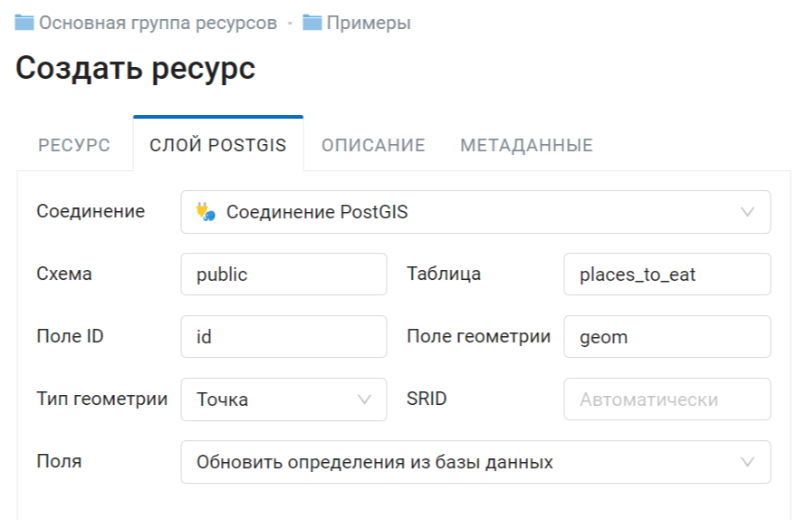

   Окно параметров слоя PostGIS
   

Здесь необходимо выполнить следующие действия:

1. Из выпадающего списка выбрать подключение к :abbr:`БД (база данных)` (созданное ранее).

2. Выбрать схему :abbr:`БД (база данных)`, в которой находится слой PostGIS. 

        * В одной базе данных PostgreSQL может быть несколько схем, внутри каждой схемы лежат таблицы и представления. Если схема одна, то она называется public. Подробнее смотрите в руководствах по :program:`СУБД PostgreSQL`.

3. Выбрать название таблицы (слоя PostGIS). 

        * Вам потребуется знать названия ваших таблиц и полей в базе данных. 
	* Отображение таблиц и представлений не входит в задачи NextGIS Web. Для просмотра можно воспользоваться :program:`NextGIS QGIS` или :program:`PgAdmin`.

4. Выбрать "Поле ID". 

	* При загрузке данных в PostGIS через NextGIS QGIS обычно создается поле с названием ogc_fid, при загрузке иным способом название поля может отличаться.
	* Поле ID должно удовлетворять ограничениям на тип данных: быть числовым (**numeric**) и являться первичным ключом.

5. Выбрать "Поле геометрии".

	* При загрузке данных в PostGIS через :program:`NextGIS QGIS`  обычно создается поле геометрии с названием wkb_geometry, при загрузке иным способом название поля может отличаться.

6. Поля "Тип геометрии", "Система координат", "Поля" и "SRID" являются не обязательными, и их значения могут быть оставлены по умолчанию.

После указания параметров нажмите кнопку **Создать**.   

.. important::

   Чтобы добавить таблицу в NextGIS Web в ней должна быть колонка с уникальными целочисленными значениями. Если такой нет или колонка первичного ключа содержит неуникальные значения, можно добавить дополнительную колонку для этих целей.

Чтобы добавить такую колонку в таблицу, подключитесь к базе данных (используя psql, например, в QGIS) и выполните следующий запрос: 

.. code-block::

   ALTER TABLE tablename ADD fid serial NOT NULL;
   ALTER TABLE tablename ADD CONSTRAINT tablename_fid_unique UNIQUE (fid);

Затем эту колонку (fid) можно использовать в качестве колонки ID в NextGIS Web.

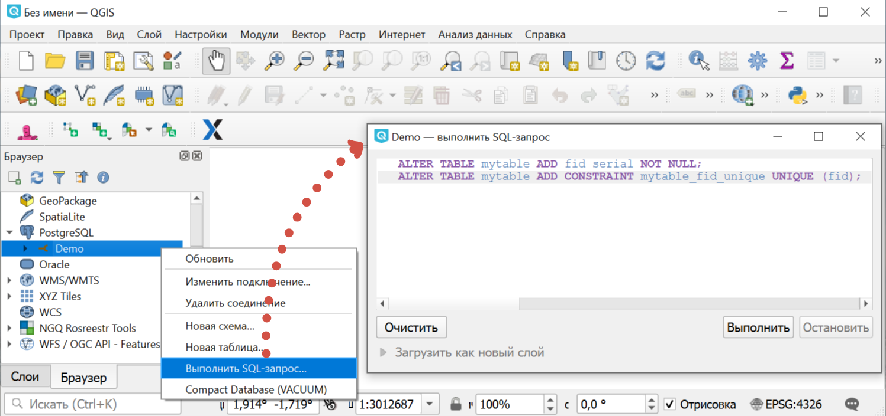

   Добавление колонки с ID в QGIS

С другими особенностями использования PostGIS в NextGIS Web вы можете ознакомиться `здесь <https://docs.nextgis.ru/docs_ngweb/source/postgis_details.html>`__.

.. _ngw_create_wms_layer:

Cлой WMS
--------

.. note:: 
	В настоящее время поддерживаются версии WMS 1.1.1 и 1.3.0.

NextGIS Web является клиентом :term:`WMS`. Для подключения слоя WMS необходимо знать его адрес. 

Сервер WMS, предоставляющий подключаемый слой, должен отдавать его в системе координат EPSG:3857. Обычно сервера умеют отдавать WMS в нескольких указанных в конфигурации СК, одна из них обязательно должна быть 3857.

Код должен быть строго 3857, 900913 не подойдет. Например, слой WMS, предоставляемый Geofabrik (GetCapabilities), умеет отдавать данные в EPSG:4326 и EPSG:900913. Фактически EPSG:900913 и EPSG:3857 - это одно и то же, но NextGIS Web запрашивает данные в EPSG:3857, а этот сервер WMS такую СК не поддерживает. Подключенные данные не будут отображаться на карте.

Проверить наличие 3857 для подключаемого слоя можно, выполнив запрос GetCapabilites к серверу и изучив ответ сервера.

.. _ngw_create_wms_connection:

Соединение WMS
^^^^^^^^^^^^^^^

Для добавления слоя WMS необходимо сначала создать подключение к серверу WMS (достаточно одного соединения для множества слоёв). Нажмите кнопку **Создать ресурс** и выберите во всплывающем окне тип ресурса **Cоединение WMS** (см. :numref:`admin_layers_create_wms_connection`). 

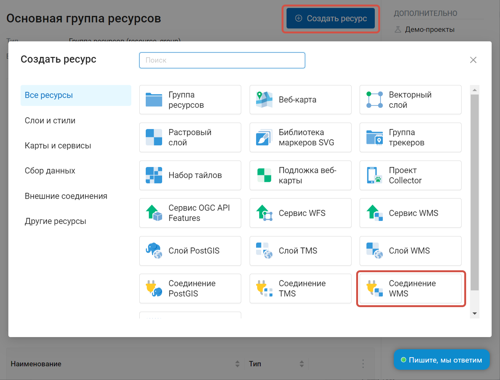

   Выбор типа ресурса "Cоединение WMS"
   

В открывшемся окне укажите наименование WMS соединения (:numref:`admin_layers_create_wms_connection_name`). Оно будет отображаться в административном интерфейсе (не путайте это наименование и названия слоёв в базе данных). Поле "Ключ" является необязательным к заполнению.

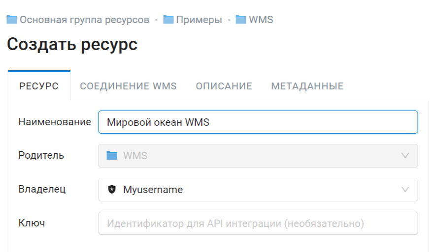

   Наименование Соединения WMS

На вкладке "Описание" можно добавить произвольный текст, описывающий текущий ресурс (:numref:`ngweb_admin_layers_create_wms_connection_description`)

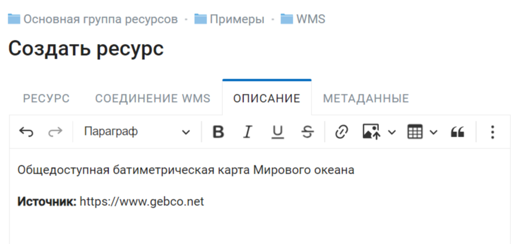

   Описание Соединения WMS
   
В "Метаданные" ресурса можно записать информацию в формате "ключ-значение" (:numref:`admin_layers_create_wms_connection_metadata`).
Как правило, метаданные используются для разработки сторонних приложений с помощью `API <https://docs.nextgis.ru/docs_ngweb_dev/doc/developer/toc.html>`_.

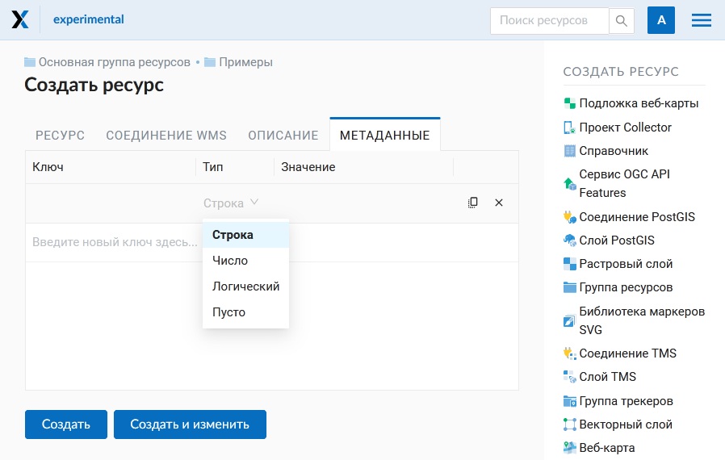

   Метаданные Соединения WMS

На вкладке "Cоединение WMS" вводятся параметры подключения (:numref:`ngweb_admin_layers_create_wms_connection_url`) к **Серверу WMS**, который предоставляет данные:

* URL
* Имя пользователя 
* Пароль 
* Версия WMS
* Возможности (управление запросом ``GetCapabilites`` к WMS-серверу)

Поле URL является обязательным, остальные используются по необходимости.

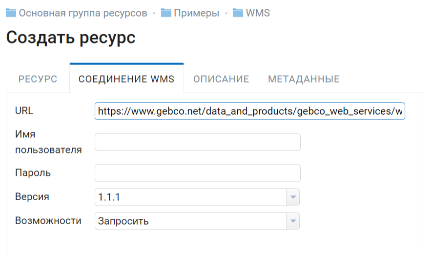

   Окно параметров Cоединения WMS

После указания параметров нажмите кнопку **Создать**.   

.. _ngw_create_layer_wms:

Слой WMS
^^^^^^^^

Далее можно приступать к добавлению отдельных слоёв WMS. Для этого следует перейти в группу, где необходимо создать слой. Нажмите кнопку **Создать ресурс** и выберите во всплывающем окне тип ресурса **Слой WMS** (см. :numref:`admin_layers_create_wms_layer`). 

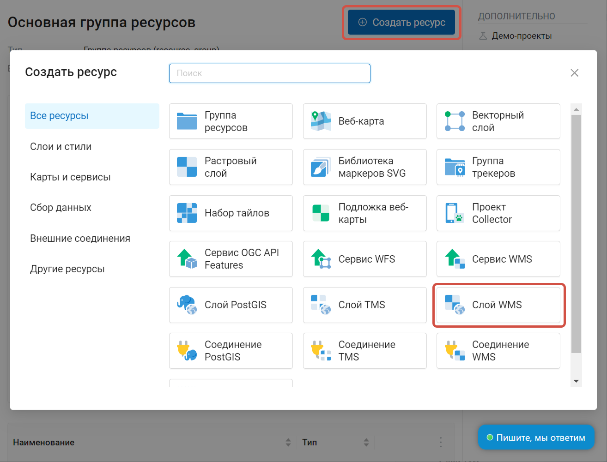

   Выбор типа ресурса "Слой WMS"
   

На вкладке "Ресурс" указывается наименование слоя WMS (:numref:`ngweb_admin_layers_create_wms_layer_name`). Оно будет отображаться в административном интерфейсе и дереве слоев веб-карты после добавления. Поле Ключ является необязательным к заполнению.

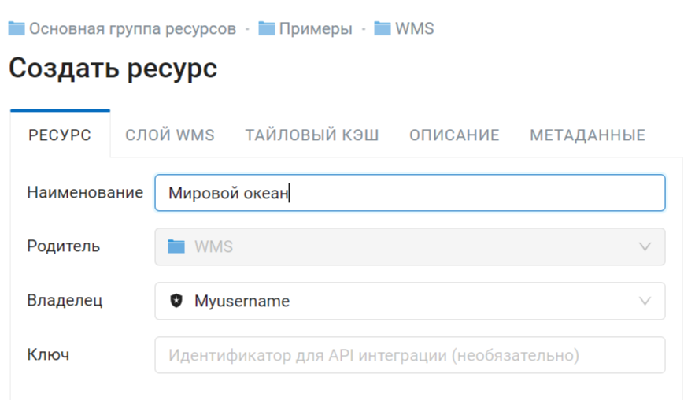

   Наименование слоя WMS

На вкладке "Описание" можно добавить произвольный текст, описывающий содержимое слоя (:numref:`ngweb_admin_layers_create_wms_layer_description`).

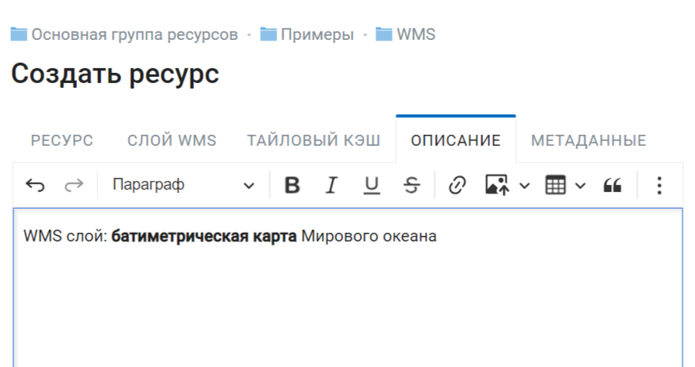

   Описание слоя WMS

Настройки тайлового кэша подробнее описаны в `данном <https://docs.nextgis.ru/docs_ngweb/source/mapstyles.html#ngw-create-tile-cache>`_ разделе.

На соответствующей вкладке есть возможность добавить метаданные слоя в формате "ключ-значение" (:numref:`ngweb_admin_layers_create_wms_layer_metadata`).
Как правило, метаданные используются для разработки сторонних приложений с помощью `API <https://docs.nextgis.ru/docs_ngweb_dev/doc/developer/toc.html>`_.

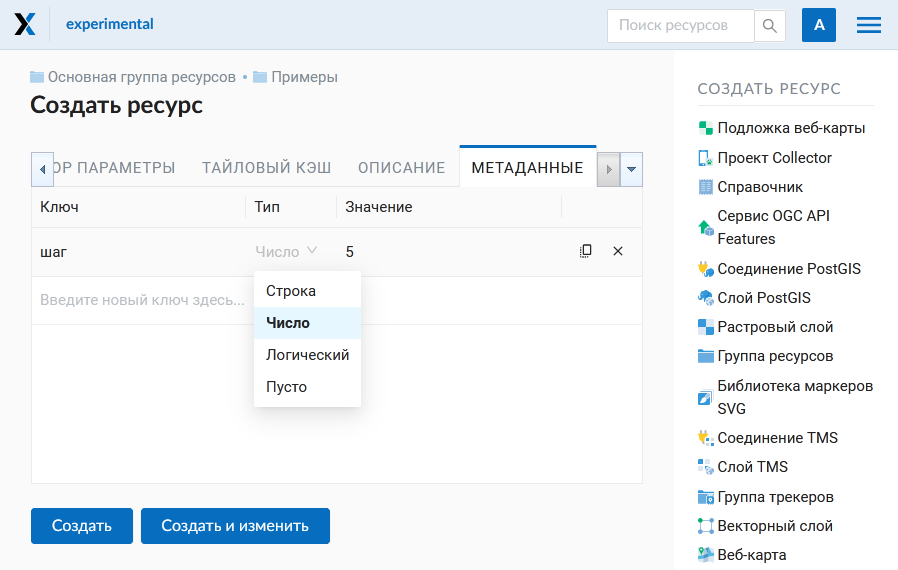

   Метаданные слоя WMS

На вкладке "Слой WMS" настраиваются параметры (:numref:`ngweb_admin_layers_create_wms_layer_parameters`):

* Выбор Соединения WMS (созданного ранее)
* Формат изображения (список MIME-типов данных, предоставляемых сервером)
* Выбор слоя из списка (можно выбрать несколько)

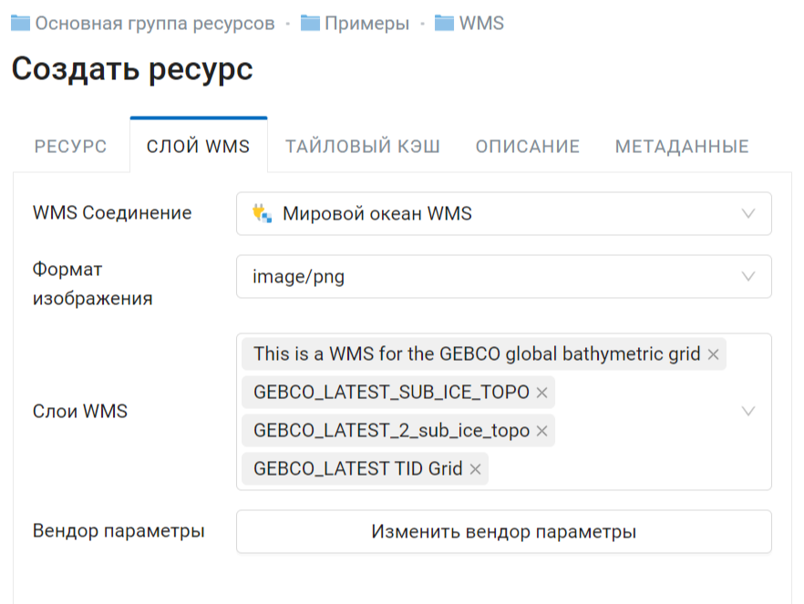

   Окно настройки параметров слоя WMS

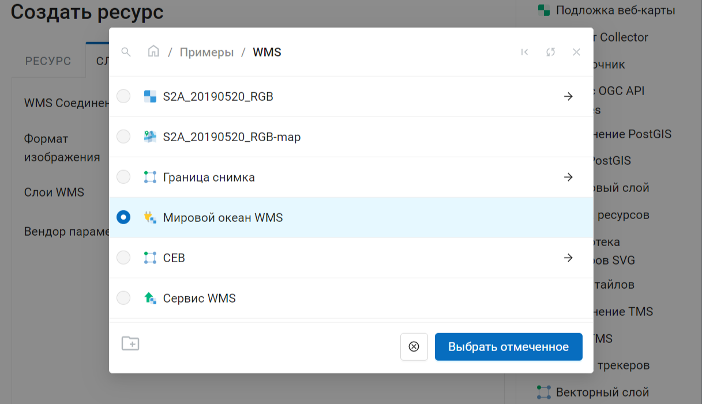

   Выбор соединения WMS

Также на этой вкладке можно добавить вендор параметры (:numref:`ngweb_admin_layers_create_wms_layer_vendorparameters`). Это нестандартные параметры запроса, которые определяются реализацией для обеспечения расширенных возможностей и зависят от поставщика WMS.

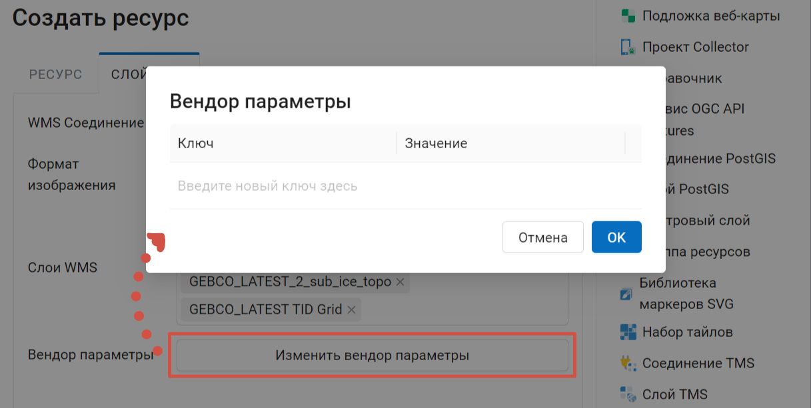

   Вендор параметры слоя WMS

После указания параметров нажмите кнопку **Создать**.   

.. warning:: 
   Идентификационные запросы к внешним WMS сервисам с Веб карт не поддерживаются. 

.. _ngw_create_wms_service:

Сервис WMS
----------

.. _ngw_create_service_wms:

Создание WMS-сервиса
^^^^^^^^^^^^^^^^^^^^

Программное обеспечение NextGIS Web может работать как сервер WMS. По этому протоколу 
клиенты запрашивают картинку карты по заданному охвату. 

Для развёртывания WMS-сервиса необходимо добавить ресурс. Нажмите кнопку **Создать ресурс** и выберите во всплывающем окне тип ресурса **Сервис WMS** (см. :numref:`admin_layers_create_wms_service`). 

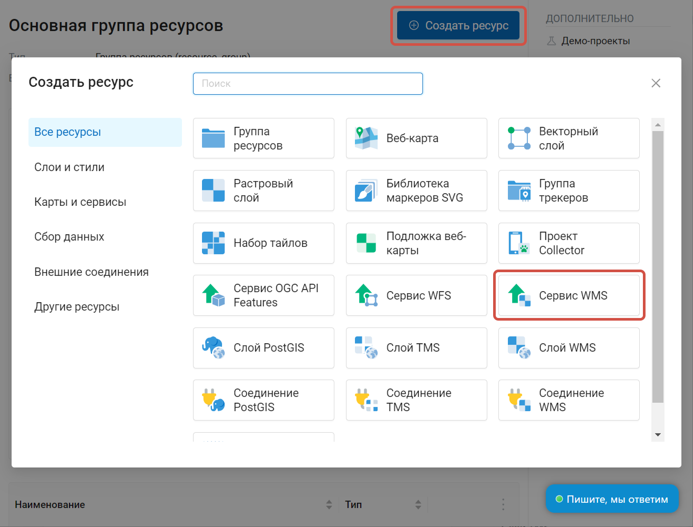

   Выбор типа ресурса "Сервис WMS"
   
   
На вкладке "Ресурс" указывается наименование сервиса WMS (:numref:`admin_layers_create_wms_service_name_rus`). Оно будет отображаться в административном интерфейсе. Поле Ключ является необязательным к заполнению.

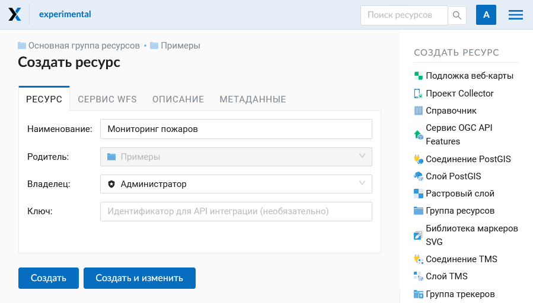
   
   Наименование сервиса WMS

На вкладке "Описание" можно добавить произвольный текст, описывающий текущий ресурс (:numref:`admin_layers_create_wms_description`)

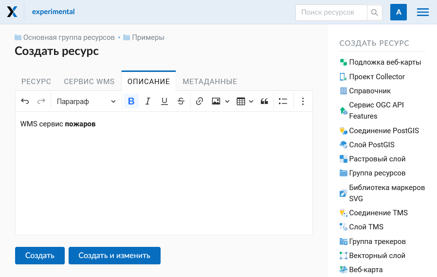

   Описание Сервиса WMS
   
В "Метаданные" ресурса можно записать информацию в формате "ключ-значение" (:numref:`admin_layers_create_wms_metadata`).
Как правило, метаданные используются для разработки сторонних приложений с помощью `API <https://docs.nextgis.ru/docs_ngweb_dev/doc/developer/toc.html>`_.

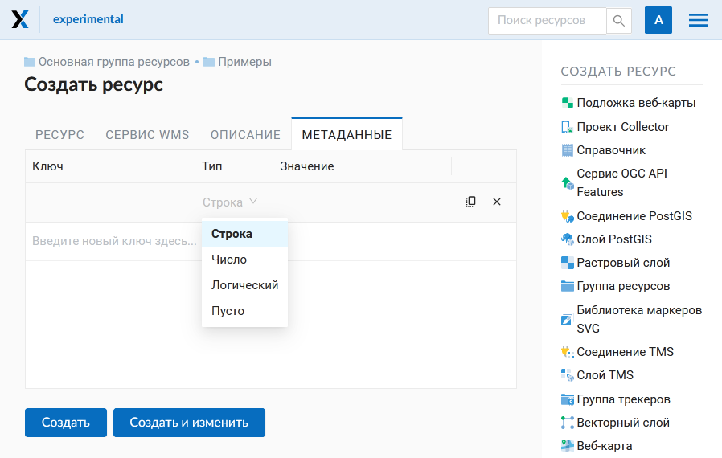

   Метаданные Сервиса WMS
   

На вкладке "Сервис WMS" необходимо добавить ссылки на нужные слои или стили. (:numref:`ngweb_admin_layers_create_wms_service_url`). Также можно указать диапазон масштабных уровней отображения данных.

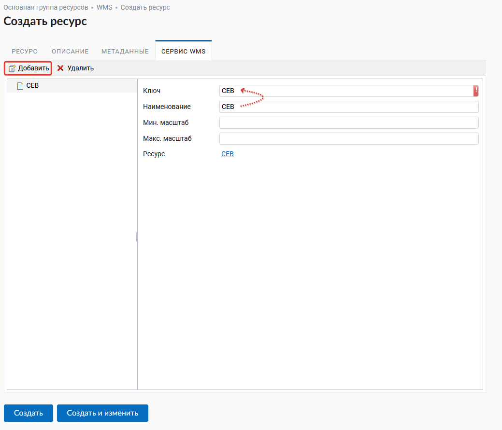

   Окно параметров соединения WMS

После создания ресурса выведется сообщение с URL WMS-сервиса, который можно 
использовать в других программах, например :program:`NextGIS QGIS`, или :program:`JOSM`. 
Далее необходимо `настроить права доступа к WMS-сервису <https://docs.nextgis.ru/docs_ngcom/source/permissions.html#ngcom-permissions-cases>`_ для стороннего использования различными пользователями.

Cлой NextGIS Web можно добавлять в настольные, мобильные и Веб ГИС различными способами.

.. _ngw_service_using_wms:

Использование сервиса WMS
^^^^^^^^^^^^^^^^^^^^^^^^^

NextGIS Web является сервером WMS. Соответственно подключить созданные в нем сервисы WMS можно 
в любом клиентском ПО, поддерживающем протокол WMS. Для этого нужно знать URL WMS-сервиса, 
который высвечивается на странице настроек конкретного сервиса.

Например:

.. code-block:: html

   https://demo.nextgis.ru/api/resource/4817/wms

Для использования сервиса через утилиты GDAL нужно создать для него файл XML. Для создания такого файла нужно знать
URL сервиса WMS. Эти параметры нужно подставить в строку ServerUrl примера ниже. Все остальное 
остается неизменным.

.. code-block:: xml

   <GDAL_WMS>
    <Service name="WMS">
        <Version>1.1.1</Version>
        <ServerUrl>https://demo.nextgis.ru/api/resource/4817/wms</ServerUrl>
        <SRS>EPSG:3857</SRS>
        <ImageFormat>image/png</ImageFormat>
        <Layers>moscow_boundary_multipolygon</Layers>
        <Styles></Styles>
    </Service>
    <DataWindow>
      <UpperLeftX>-20037508.34</UpperLeftX>
      <UpperLeftY>20037508.34</UpperLeftY>
      <LowerRightX>20037508.34</LowerRightX>
      <LowerRightY>-20037508.34</LowerRightY>
      <SizeY>40075016</SizeY>
      <SizeX>40075016.857</SizeX>
    </DataWindow>
    <Projection>EPSG:3857</Projection>
    <BandsCount>3</BandsCount>
   </GDAL_WMS>

Если нужна картинка с альфа каналом, следует указать ``<BandsCount>4</BandsCount>``.

Пример вызова утилиты GDAL. Она получает картинку из NextGIS WEB по WMS и сохраняет её в GeoTIFF.

.. code-block:: shell

   gdal_translate -of "GTIFF" -outsize 1000 0  -projwin  4143247 7497160 4190083 7468902   ngw.xml test.tiff

.. _ngw_create_tms_layer:

Слой TMS
--------

.. _ngw_create_tms_connection:

Соединение TMS
^^^^^^^^^^^^^^

Для добавления слоя TMS сначала необходимо создать ресурс Соединение :term:`TMS`. Нажмите кнопку **Создать ресурс** и выберите во всплывающем окне тип ресурса **Соединение TMS** (см. :numref:`TMS_connection_create`).

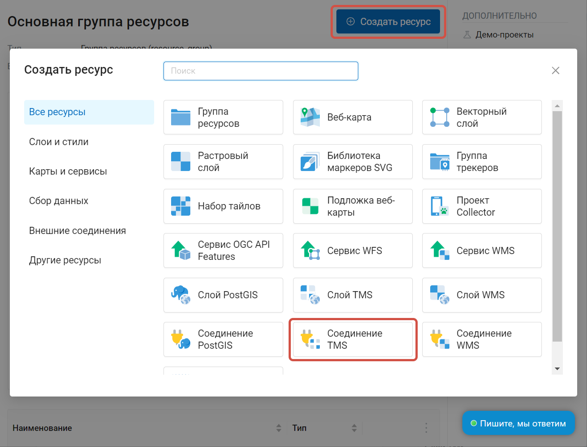

   Выбор типа ресурса "Соединение TMS"
   
Далее необходимо ввести наименование подключения, которое будет отображаться в административном веб интерфейсе (см. :numref:`TMS_connection_name`).

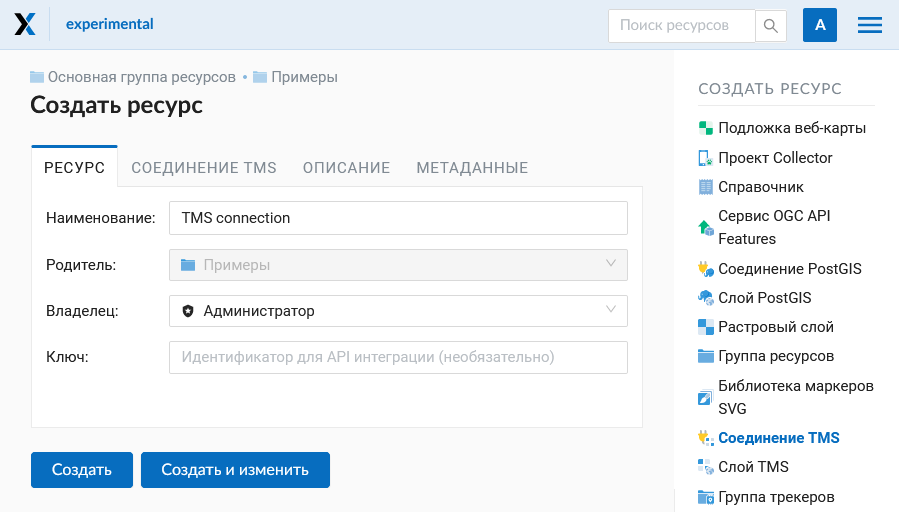

   Наименование ресурса Соединение TMS
   
Поле "Ключ" является необязательным к заполнению. На соответствующих вкладках можно добавить описание ресурса и метаданные.
Как правило, метаданные используются для разработки сторонних приложений с помощью `API <https://docs.nextgis.ru/docs_ngweb_dev/doc/developer/toc.html>`_.
Вкладка "Соединение TMS" отвечает за выбор и настройку одного из способов подключения к TMS серверу - настраиваемый или из геосервисов NextGIS (см. :numref:`TMS_connection_type`).

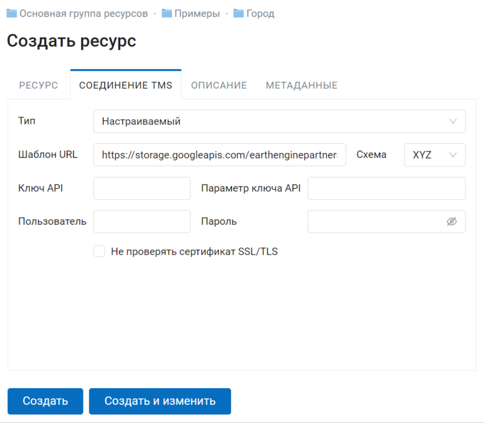

   Настройка способа подключения TMS

В случае настраиваемого способа подключения пользователь должен указать шаблон URL, параметры ключа API и используемую тайловую схему. Для геосервисов NextGIS указывается только пользовательский ключ API. После заполнения всех полей нажатие кнопки **Создать** завершает процесс создания ресурса Соединение TMS.

.. _ngw_tms_layer:

Слой TMS
^^^^^^^^

Ресурс **Слой TMS** добавляется на базе созданного ранее Соединения TMS. Для этого следует выбрать соответствующий тип ресурса из меню создания (см. :numref:`TMS_layer_create`).

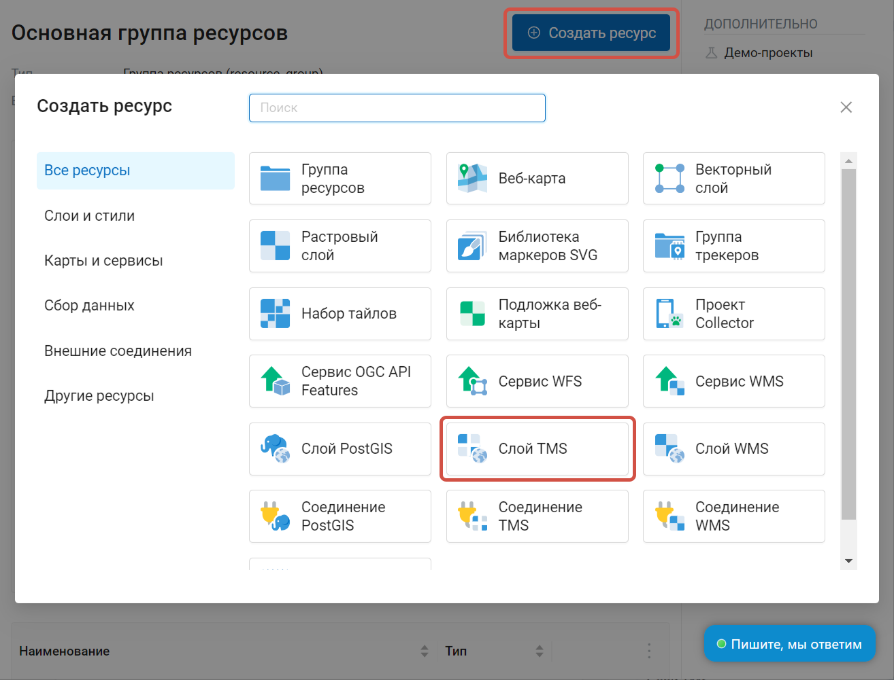
   
   Выбор типа ресурса "Слой TMS"

На первой вкладке указывается наименование слоя для отображения в административном интерфейсе (см. :numref:`TMS_layer_name`).

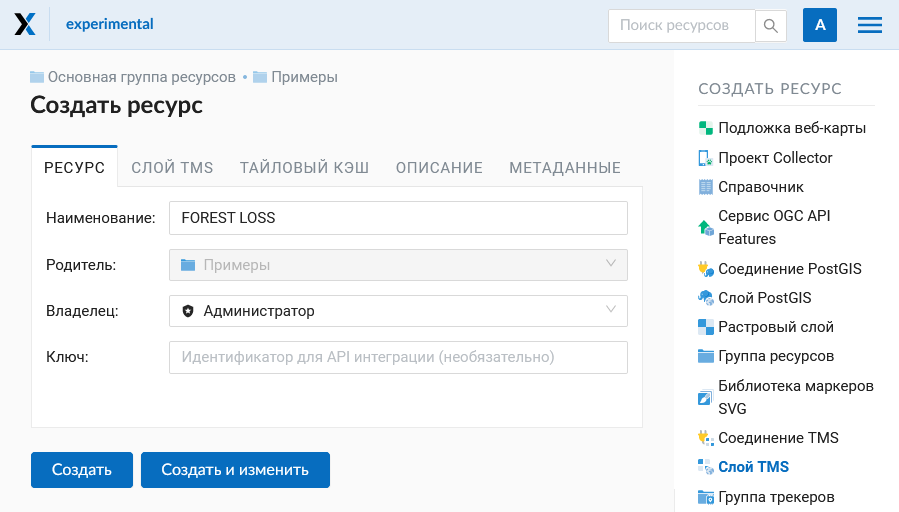

   Наименование TMS слоя

Кэширование обеспечивает повышение скорости отображения слоев веб карты. Настройки тайлового кэша подробнее описаны в `данном <https://docs.nextgis.ru/docs_ngweb/source/mapstyles.html#ngw-create-tile-cache>`_ разделе.
   
На вкладке "Слой TMS" находятся основные настройки отображения (см. :numref:`TMS_layer_settings_rus`):

* Соединение TMS - выберите ранее созданное подключение TMS
* Система координат для отображения информации (выбирается из выпадающего списка)
* Минимальный и максимальный масштаб отображения данных
* Охват в градусах
* Размер тайлов в пикселях

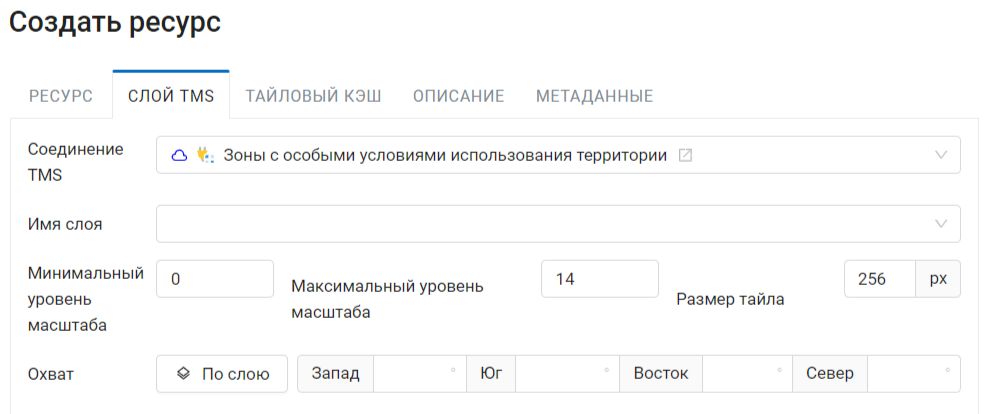
   
   Настройки TMS слоя

После создания слоя пользователь может добавить его на веб-карту для отображения. Добавляется именно **слой** TMS, стиль для него не нужен.
   
.. _ngw_connect_tms_gdal:

Использование сервиса TMS
^^^^^^^^^^^^^^^^^^^^^^^^^

NextGIS Web является сервером TMS. Соответственно подключить созданные в нем слои/стили можно 
в любом клиентском ПО, поддерживающем протокол TMS. Для этого нужно знать URL сервиса TMS. 

Ссылка формируется следующим образом, пример:

.. code-block:: html

   https://demo.nextgis.ru/api/component/render/tile?z={z}&x={x}&y={y}&resource=234

Для использования TMS через утилиты GDAL нужно создать для него файл XML. Для создания такого файла нужно знать URL TMS. Эти параметры нужно подставить в строку ServerUrl примера ниже. Все остальное 
остается неизменным.

.. code-block:: xml

   <GDAL_WMS>
    <Service name="TMS">
        <ServerUrl>https://demo.nextgis.ru/api/component/render/tile?z={z}&x={x}&y={y}&resource=234</ServerUrl>
    </Service>
    <DataWindow>
        <UpperLeftX>-20037508.34</UpperLeftX>
        <UpperLeftY>20037508.34</UpperLeftY>
        <LowerRightX>20037508.34</LowerRightX>
        <LowerRightY>-20037508.34</LowerRightY>
        <TileLevel>18</TileLevel>
        <TileCountX>1</TileCountX>
        <TileCountY>1</TileCountY>
        <YOrigin>top</YOrigin>
    </DataWindow>
    <Projection>EPSG:3857</Projection>
    <BlockSizeX>256</BlockSizeX>
    <BlockSizeY>256</BlockSizeY>
    <BandsCount>4</BandsCount>
    <Cache />
   </GDAL_WMS> 

.. _ngw_tile_set:

Набор тайлов
------------

Нажмите кнопку **Создать ресурс** и выберите во всплывающем окне тип ресурса **Набор тайлов**.

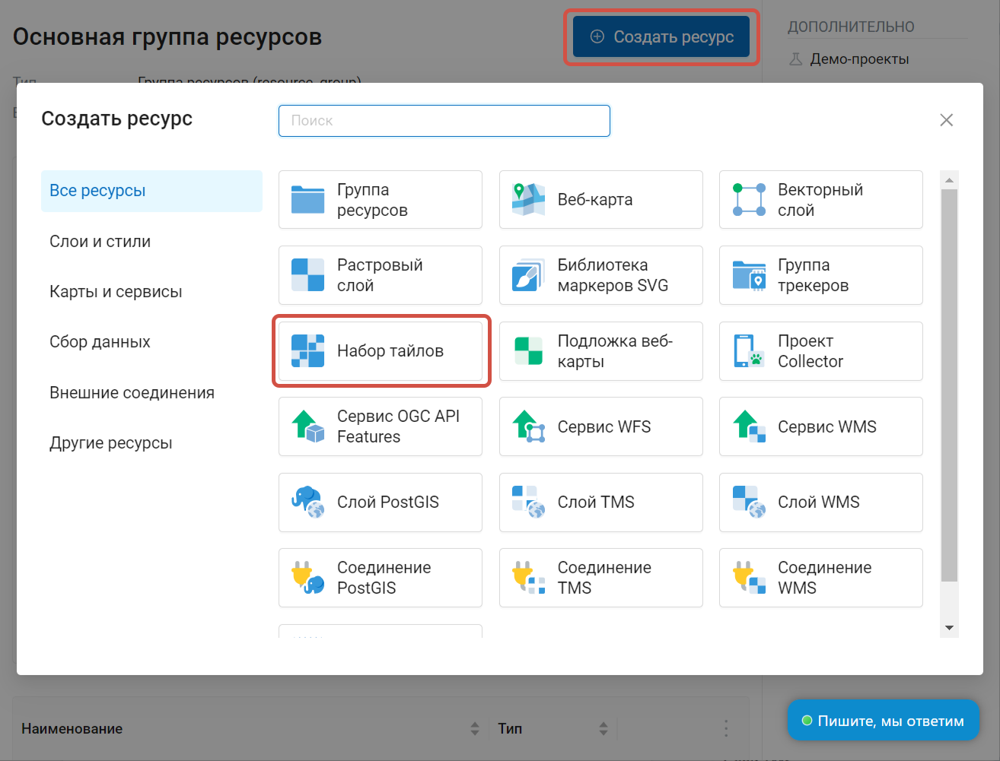

Далее необходимо ввести наименование набора тайлов, которое будет отображаться в административном веб интерфейсе.

Поле «Ключ» является необязательным к заполнению. На соответствующих вкладках можно добавить описание ресурса и метаданные. Как правило, метаданные используются для разработки сторонних приложений с помощью API. 

Во вкладке «Набор тайлов» необходимо загрузить набор тайлов в формате MBTiles или zip-архив. Тайлы должны быть в формате PNG или JPEG и иметь размер 256х256 пикселей.

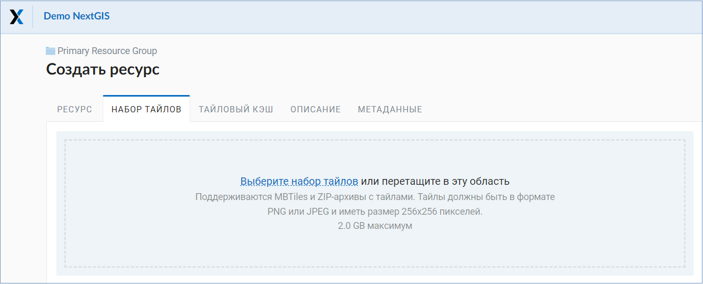

Во вкладке «Тайловый кэш» пользователь может задать настройки кэширования:

* Включение - включение/выключение кэширования тайлов;
* Разрешить тайлы для запросов изображений - при запросе изображения (не тайла) использовать закэшированные тайлы при их наличии;
* Максимальный масштабный уровень - пороговое значение, выше которого обращение к кэшу не происходит, изображение карты рендерится на лету;
* TTL, сек (Time to live) - “время жизни” или хранения тайлов на сервере в секундах, после которого при следующем запросе изображение будет формироваться заново. Если TTL = 0, то время хранения тайлов не ограничено;
* Очистить - write only - очищает тайловый кэш при сохранении стиля.

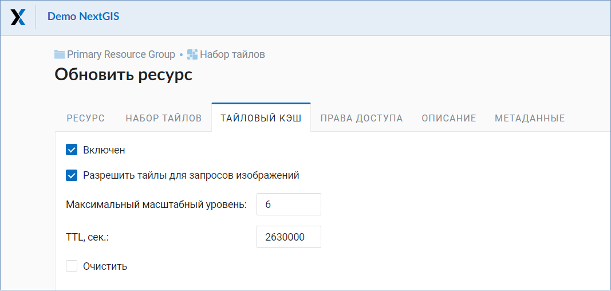

После заполнения всех полей нажатие кнопки **Создать** завершает процесс создания ресурса **Набор тайлов**.

Процесс создания также представлен в видео:

.. raw:: html

   <iframe width="560" height="315" src="https://rutube.ru/play/embed/824fbfb5c0d10a2977e3e828f6c4fd9a/" frameBorder="0" allow="clipboard-write; autoplay" webkitAllowFullScreen mozallowfullscreen allowFullScreen></iframe>

Смотреть на `youtube <https://youtu.be/5ccduELAk3Y>`__, `rutube <https://rutube.ru/video/824fbfb5c0d10a2977e3e828f6c4fd9a/>`__.

.. _ngw_wfs:

Слой WFS
--------

:term:`WFS` позволяет получать данные, опубликованные на сторонних ГИС-серверах (arcgis, geoserver и т.п.), применять к ним свои стили, добавлять их на веб карты.

Сначала нужно создать соединение WFS.

.. _ngw_wfs_connection:

Соединение WFS
^^^^^^^^^^^^^^^

Нажмите кнопку **Создать ресурс** и выберите во всплывающем окне тип ресурса **Соединение WFS**.

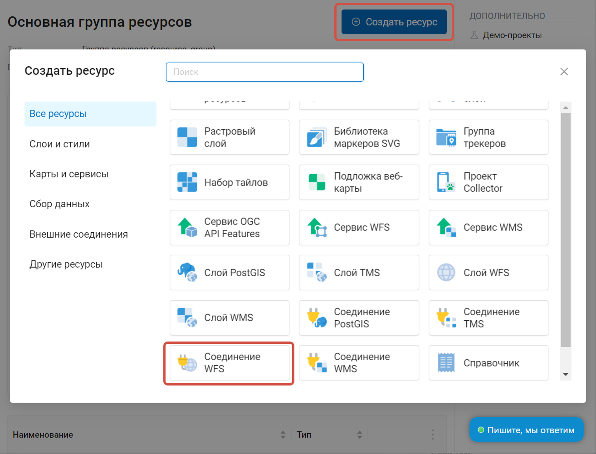

   Выбор типа ресурса "Соединение WFS"
   
Далее можно ввести пользовательское наименование подключения, которое будет отображаться в административном веб интерфейсе.

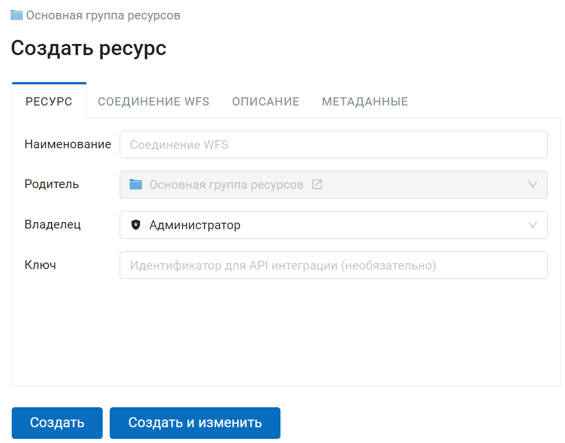

   Наименование ресурса Соединение WFS
   
Поле "Ключ" является необязательным к заполнению. На соответствующих вкладках можно добавить описание ресурса и метаданные.

На вкладке "Cоединение WFS" вводятся параметры подключения к **Серверу WFS**, который предоставляет данные:

* URL
* Имя пользователя 
* Пароль 
* Версия WFS

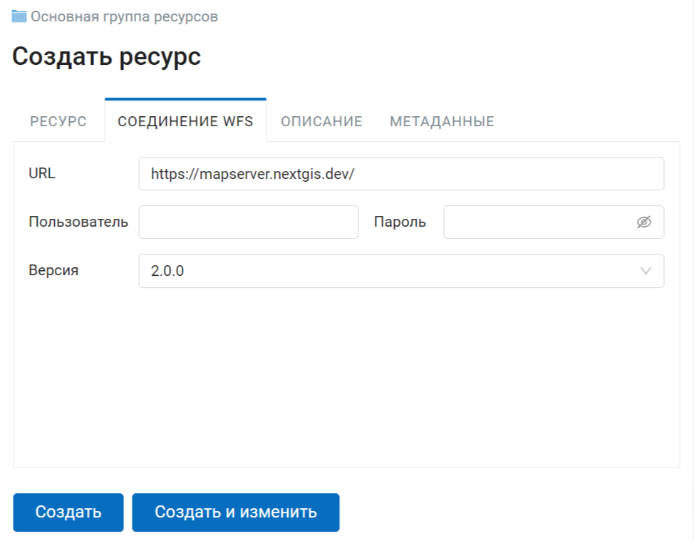

   Настройка подключения WFS

В случае, если выбранная версия не поддерживается, после нажатия кнопки **Создать** вы получите сообщение об ошибке:

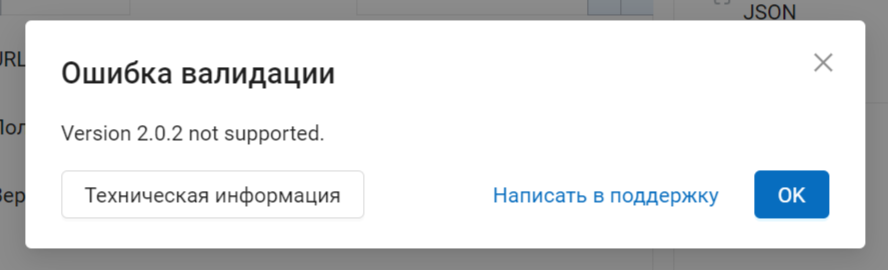

   Сообщение о некорректной версии

Далее нужно создать ресурс слоя WFS.

.. _ngw_wfs_layer:

Слой WFS
^^^^^^^^^

Ресурс **Слой WFS** добавляется на базе созданного ранее Соединения WFS. Для этого следует выбрать соответствующий тип ресурса из меню создания.

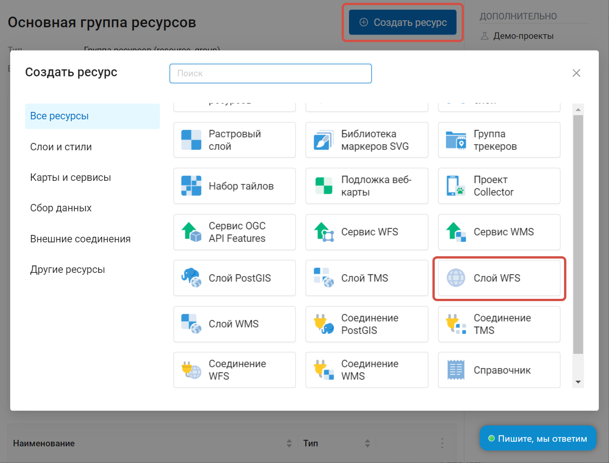
   
   Выбор типа ресурса "Слой WFS"

В открывшемся окне на вкладке "Слой WFS" выберите ранее созданное Соединение WFS. Затем укажите нужный слой и поле геометрии. SRID добавится автоматически.

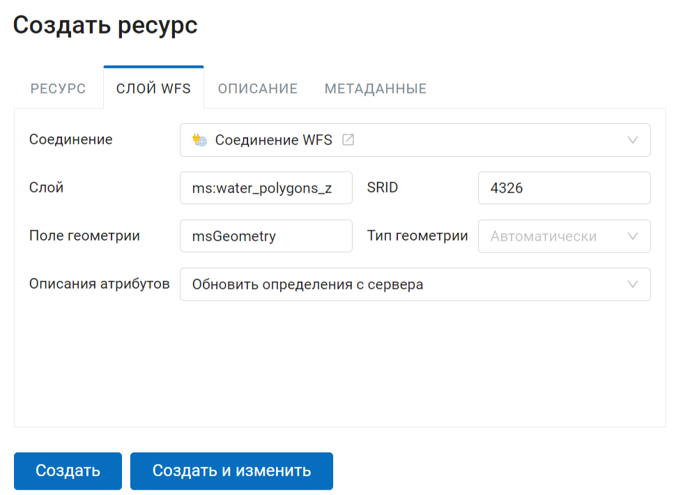

   Настройки слоя WFS

На вкладке "Ресурс" можно указать пользовательское название ресурса. Также вы можете также задать описание и метаданные на соответствующих вкладках.

Для того, чтобы добавить слой WFS на веб-карту, у него должен быть стиль. Вы можете создать стиль QGIS по умолчанию или `добавить свой стиль <https://docs.nextgis.ru/docs_ngweb/source/mapstyles.html>`_ QGIS или Mapserver через меню "Создать ресурс".

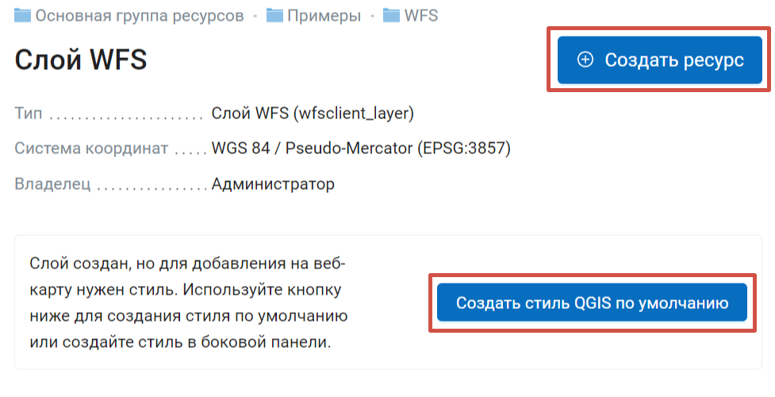

   Варианты добавления стиля к созданному слою WFS

.. _ngw_wfs_service:

Cервис WFS
----------

.. _ngw_create_service_wfs:

Создание сервиса WFS
^^^^^^^^^^^^^^^^^^^^

Настройка сервиса WFS осуществляется так же, как для WMS-сервиса, только добавляется не стиль, а слой.
   
.. note::
    На данный момент поддерживаются фильтры Intersects, ResourceId (ObjectId, FeatureId).

NextGIS Web является сервером WFS - может публиковать сервисы WFS на базе векторных слоёв. Используя эти сервисы, сторонние программы 
могут изменять векторные данные на сервере. Поддерживаемые версии протокола WFS: 1.0, 1.1, 2.0, 2.0.2.

Нажмите кнопку **Создать ресурс** и выберите во всплывающем окне тип ресурса **Сервис WFS** (:numref:`admin_layers_create_wfs_service`). 

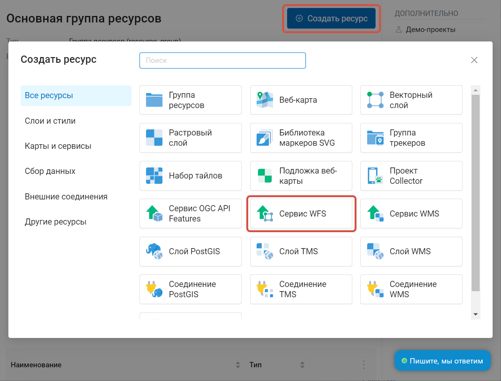

   Выбор типа ресурса "Сервис WFS"
   
На вкладке **Ресурс** указывается наименование сервиса (:numref:`ngweb_admin_layers_create_wfs_service_name`). Поле "Ключ" предназначено для разработчиков, заполенять его не обязательно.

   Наименование Сервиса WFS
   
   
На вкладке "Описание" можно добавить произвольный текст, описывающий текущий ресурс (:numref:`ngweb_admin_layers_create_wfs_description`)

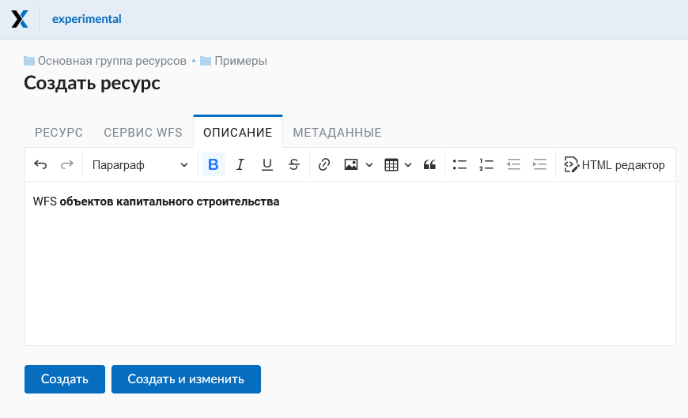

   Описание Сервиса WFS
   
В "Метаданные" ресурса можно записать информацию в формате "ключ-значение" (:numref:`admin_layers_create_wfs_metadata`).
Как правило, метаданные используются для разработки сторонних приложений с помощью `API <https://docs.nextgis.ru/docs_ngweb_dev/doc/developer/toc.html>`_.

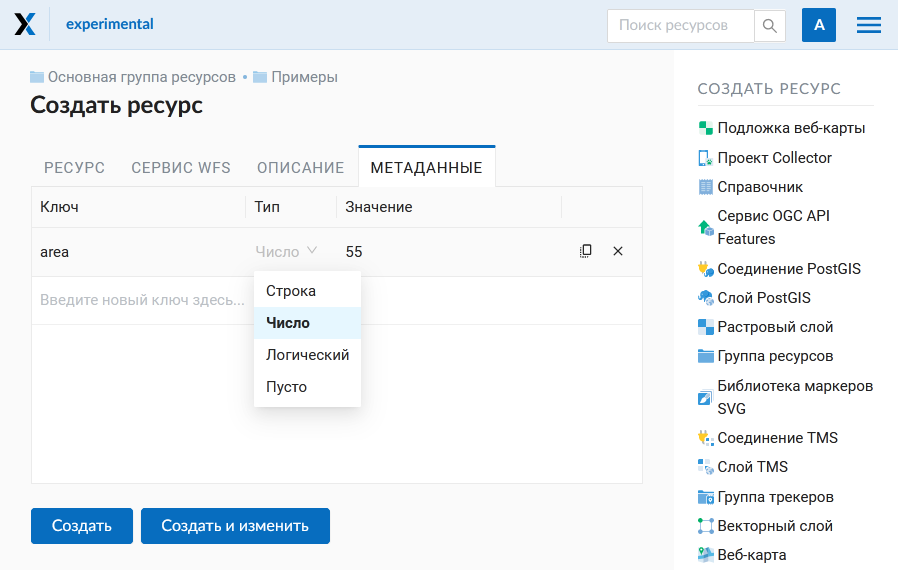

   Метаданные Сервиса WFS

Вкладка "Сервис WFS" отвечает за слои, включаемые в сервис (:numref:`ngweb_admin_layers_create_wfs_service_settings`). Для каждого 
добавленного слоя нужно указать число возвращаемых из базы объектов. По умолчанию это значение равно 1000.
Если в этом поле значение убрать совсем, то ограничение будет снято и будут передаваться все объекты. Однако это может привести 
к значительной нагрузке на сервер и значительным задержкам при передаче больших объемов данных.

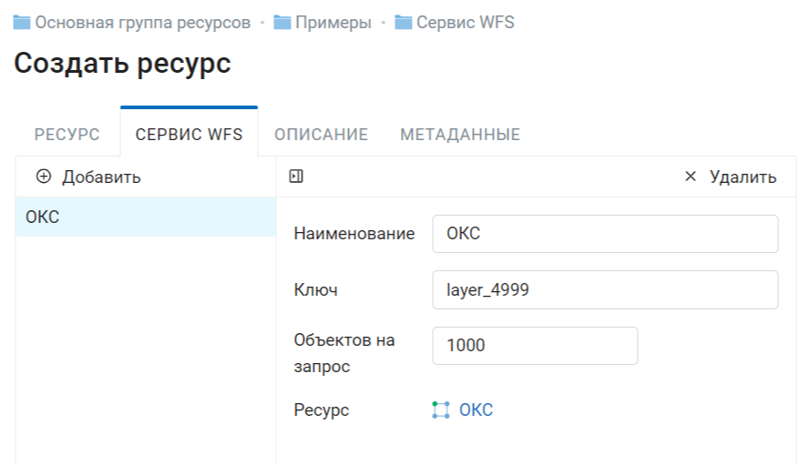

   Окно параметров сервиса WFS

.. _ngw_service_using_wfs:

Использование сервиса WFS
^^^^^^^^^^^^^^^^^^^^^^^^^

После создания ресурса вам будет доступен URL сервиса WFS, который вы можете использовать в других программах, например :program:`NextGIS QGIS`. 

Если это необходимо, можно настроить права доступа к сервису WFS (см. главу :ref:`ngcom_permissions_intro`).

Программно подключаться к созданным сервисам WFS можно по ссылкам следующего вида (также `поддерживается <https://docs.nextgis.ru/docs_ngweb_dev/doc/developer/auth.html>`_ basic auth):

.. sourcecode:: http

   https://mywebgis.nextgis.com/api/resource/2413/wfs?SERVICE=WFS&TYPENAME=ngw_id_2412&username=administrator&password=mypassword&srsname=EPSG:3857&VERSION=1.0.0&REQUEST=GetFeature

.. _ngw_OGC_API_Features:

Cервис OGC API Features
-----------------------

Создание сервиса OGC API Features
^^^^^^^^^^^^^^^^^^^^^^^^^^^^^^^^^

Настройка сервиса :term:`OGC API Features` осуществляется так же, как для WFS-сервиса.
   
NextGIS Web является сервером OGC API Features - может публиковать сервисы OGC API Features на базе векторных слоёв. Используя эти сервисы, сторонние программы могут изменять векторные данные на сервере. Поддерживаемые версии протокола OGC API Features: 1.0.0.

Для развёртывания сервиса OGC API Features нажмите кнопку **Создать ресурс** и выберите во всплывающем окне тип ресурса **Сервис OGC API Features**. (:numref:`admin_layers_create_ogc_api_features_service_rus`). 

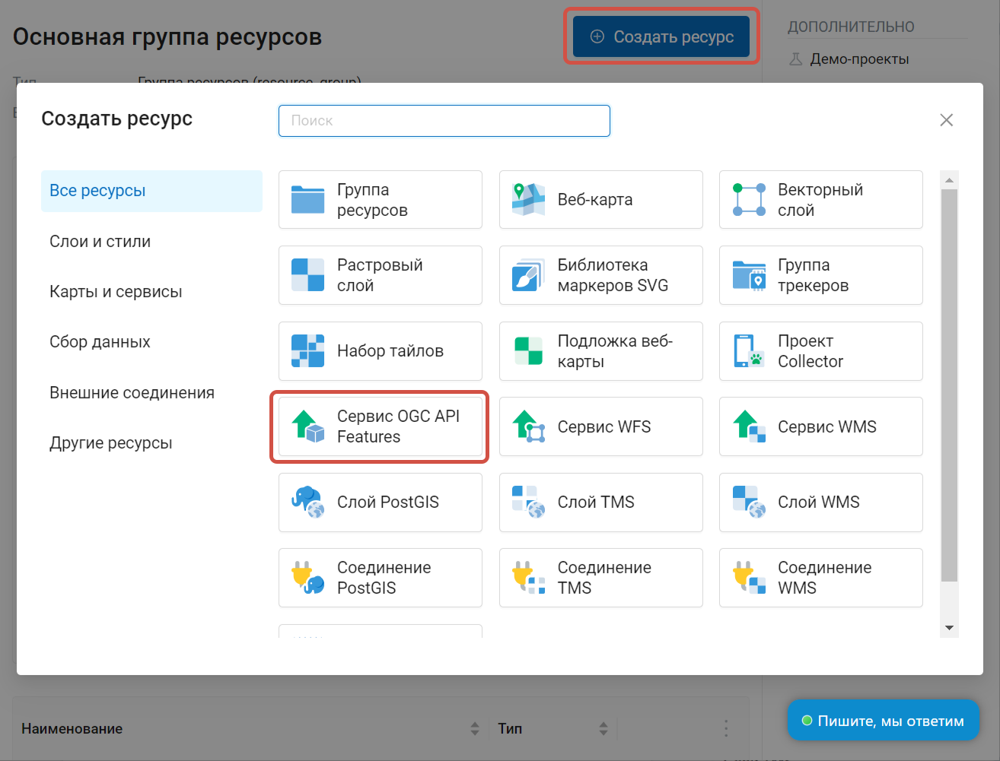

   Выбор действия "Сервис OGC API Features"
   
На вкладке **Ресурс** указывается наименование сервиса (:numref:`admin_layers_create_ogc_api_features_service_name_rus`). Поле "Ключ" предназначено для разработчиков, заполенять его не обязательно.

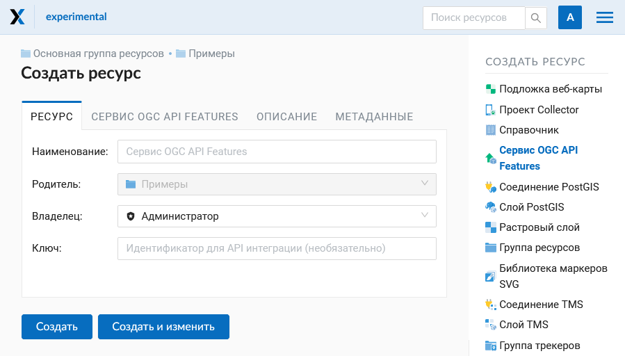

   Наименование Сервиса OGC API Features
   
   
На вкладке "Описание" можно добавить произвольный текст, описывающий текущий ресурс (:numref:`admin_layers_create_ogc_api_features_service_description_rus`)

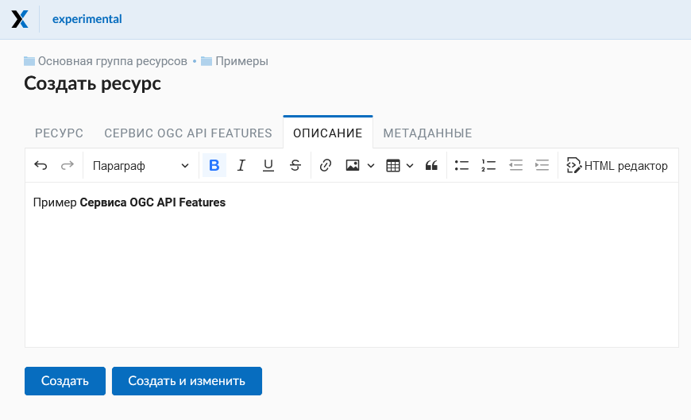

   Описание Сервиса OGC API Features
   
В "Метаданные" ресурса можно записать информацию в формате "ключ-значение" (:numref:`admin_layers_create_ogc_api_features_service_metadata_rus`).
Как правило, метаданные используются для разработки сторонних приложений с помощью `API <https://docs.nextgis.ru/docs_ngweb_dev/doc/developer/toc.html>`_.

   Метаданные Сервиса OGC API Features

Вкладка "Сервис OGC API Features" отвечает за слои, включаемые в сервис (:numref:`admin_layers_create_ogc_api_features_service_settings_rus`). Для каждого 
добавленного слоя нужно указать число возвращаемых из базы объектов. По умолчанию это значение равно 1000.
Если в этом поле значение убрать совсем, то ограничение будет снято и будут передаваться все объекты. Однако это может привести 
к значительной нагрузке на сервер и значительным задержкам при передаче больших объемов данных.

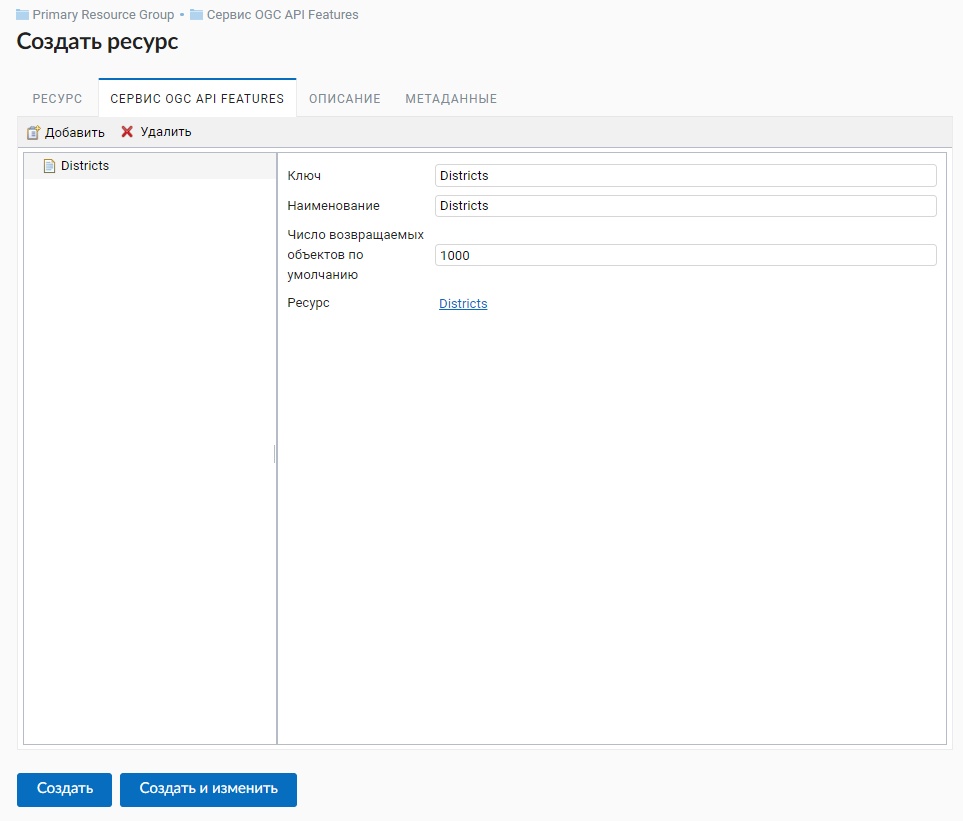

   Окно параметров сервиса OGC API Features

.. _ngw_service_using_OGC_API_Features:

Использование сервиса OGC API Features
^^^^^^^^^^^^^^^^^^^^^^^^^^^^^^^^^^^^^^^

После создания ресурса вам будет доступен URL сервиса OGC API Features, который вы можете использовать в других программах, например :program:`QGIS`. 

Если это необходимо, можно `настроить права доступа к сервису OGC API Features <https://docs.nextgis.ru/docs_ngcom/source/permissions.html#ngcom-permissions-cases>`_.

Программно подключаться к созданным сервисам OGC API Features можно по ссылкам следующего вида (также `поддерживается <https://docs.nextgis.ru/docs_ngweb_dev/doc/developer/auth.html>`_ basic auth):

.. sourcecode:: http

   https://yourwebgis.nextgis.com/api/resource/208/ogcf

