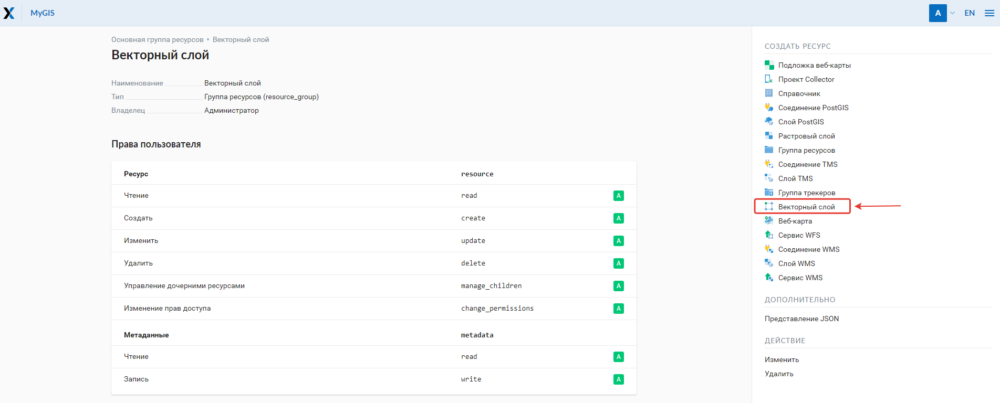
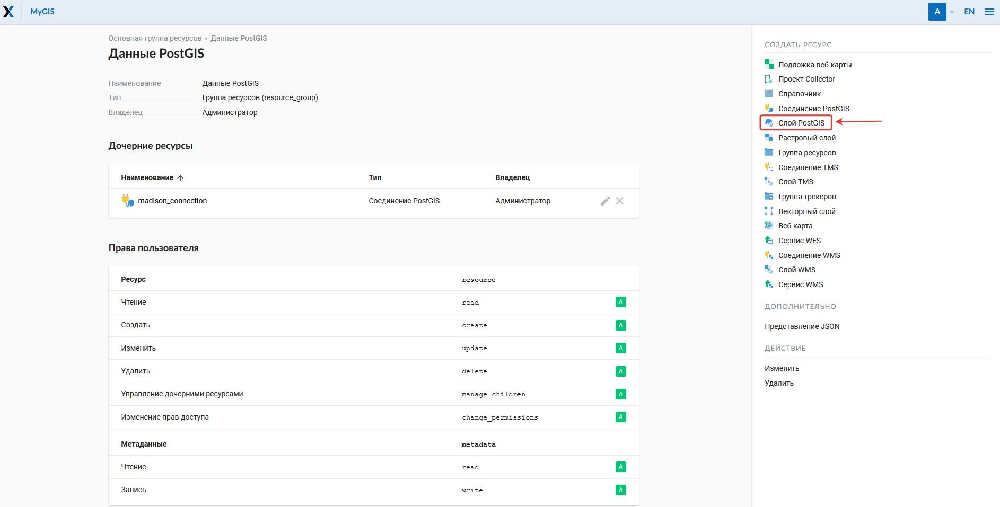
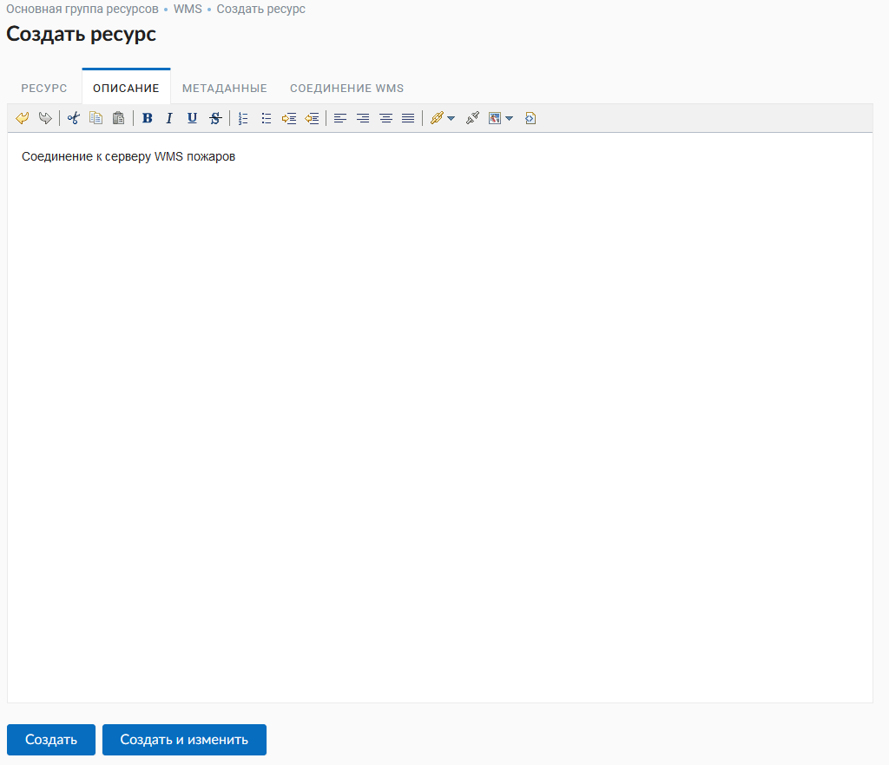
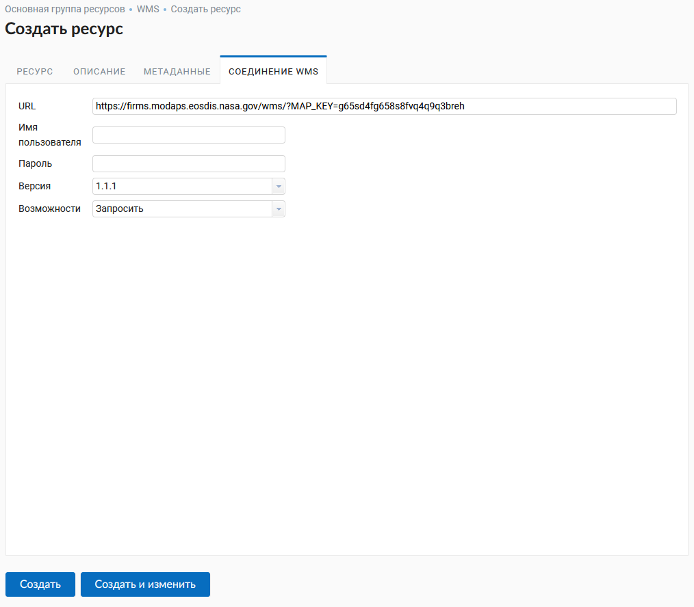

.. sectionauthor:: Артём Светлов <artem.svetlov@nextgis.ru>
.. sectionauthor:: Роман Гайнуллов <roman.gainullov@nextgis.ru>

.. _ngw_create_layers:

Добавление ресурсов
===================

NextGIS Web строится на **ресурсном** подходе - каждый компонент системы (слой, группа, сервис) является её ресурсом.
Одним из таких типов ресурсов является **слой** - растровое изображение или векторный файл (таблица базы данных).

Для каждого слоя может быть создано **неограниченное** количество **стилей** - способов визуализации геоданных на веб-карте.

Интерфейс добавления PostGIS, векторных и растровых слоев приблизительно одинаковый - создается ресурс слоя, внутри него - ресурсы стилей.
Последние визуализируют данные на веб-карте.

.. _ngw_create_basemap:

Подлложка веб-карты
------------------

В блоке операций выберите из списка «Подложка веб-карты» (:numref:`ngweb_admin_create_basemap`).
В открывшемся окне введите название ресурса, которое будет отображаться в административном интерфейсе (:numref:`ngweb_admin_basemap_name`).

   Выбор ресурса "Подложка веб-карты"
   
   

   Наименование подложки веб-карты
   
   
На соответствующих картах настраивается "Описание" и "Метаданные" слоя (:numref:`ngweb_admin_basemap_desc`).

   Описание подложки веб-карты
   

На вкладке "Подложка веб-карты" задается URL-адрес TMS сервиса (:numref:`ngweb_admin_basemap_param`). Есть два пути для его указания:

* Использовать настройки из `QMS <https://qms.nextgis.com/>`_. Если установлен данный флаг, то необходимо найти нужный сервис в строке поиска.
* Ввести адрес вручную. Работает, если флаг QMS снят.

   Параметры подложки веб-карты

.. _ngw_create_raster_layer:

Растровый слой
--------------

Растровые изображения в NextGIS Web загружаются через специальный ресурс "Растровый слой".

.. _ngw_process_create_raster_layer:

Процесс создания
^^^^^^^^^^^^^^^^^^
Перейдите в группу ресурсов (папку), в которой необходимо создать рстровый слой.
В блоке операций «Создать ресурс» выберите из списка «Растровый слой» (см. :numref:`ngweb_admin_layers_create_raster_layer`).

   Выбор действия "Растровый слой"

В открывшемся окне укажите наименование растрового слоя (см. :numref:`ngweb_admin_layers_create_raster_layer_resourse_name`).
Оно будет отображаться в административном интерфейсе. Поле «Ключ» является необязательным к заполнению.

   Наименование растрового слоя

На вкладке «Описание» можно добавить произвольный текст, описывающий содержимое данного слоя (:numref:`ngweb_admin_layers_create_raster_layer_resourse_description`).

   Описание растрового слоя

В «Метаданные» слоя можно записать информацию в формате «ключ-значение» (:numref:`ngweb_admin_layers_create_raster_layer_resourse_metadata`).

   Метаданные растрового слоя

На вкладке «Растровый слой» необходимо загрузить файл геоданных в формате GeoTIFF.
В зависимости от тарифного плана в окне отображается максимально допустимый объем загружаемого файла (:numref:`ngweb_admin_layers_create_raster_layer_upload`).

   Окно загрузки растрового файла

После загрузки файла нажмите кнопку **Создать**.

.. _ngw_process_create_raster_style:

Стиль QGIS (для растров)
^^^^^^^^^^^^^^^^^^^^^^^^

После удачной загрузки растра необходимо создать стиль QGIS. Эта процедура аналогична добавлению `стиля <https://docs.nextgis.ru/docs_ngweb/source/mapstyles.html#qgis>`_ для векторного слоя. Создать его можно в NextGIS QGIS.
При создании веб-карты (подробнее см. :ref:`ngw_map_create`) можно добавить загруженный растр на карту, выбрав данный стиль.

Растровый слой с прозрачностью (обрезкой, альфа-каналом)
^^^^^^^^^^^^^^^^^^^^^^^^^^^^^^^^^^^^^^^^^^^^^^^^^^^^^^^^

Большинство утилит не создают канал прозрачности (А или альфа канал), а только добавляют значение NoData. 
Для преобразования значений NoData в альфа канал можно воспользоваться утилитой 
командной строки  :program:`gdalwarp`. Ниже приведен пример команды.

.. code-block:: shell

   gdalwarp -t_srs EPSG:3857 -multi -dstalpha -dstnodata none -wo \
   "UNIFIED_SRC_NODATA=YES" -co COMPRESS=JPEG \ 
   d:\temp\o\ast_20010730_010043_rgb.tif d:\temp\o\ast_20010730_010043_rgba.tif

Загрузка растров с индексированными цветами
^^^^^^^^^^^^^^^^^^^^^^^^^^^^^^^^^^^^^^^^^^^

Загрузка растров с индексированными цветами происходит так же, как и растров в RGB.
Если файл находится не в GeoTIFF, то его можно сконвертировать так

.. code-block:: shell

    gdal_translate yaroslavl.map  yaroslavl.tif

.. _ngw_create_vector_layer:

Векторный слой из файла
-----------------------

В NextGIS Web можно создавать векторные слои на основе геоданных в форматах :term:`ESRI Shape`, :term:`GeoJSON`, :term:`KML` и :term:`GML`. 

.. _ngw_process_create_vector_layer:

Процесс создания
^^^^^^^^^^^^^^^^^^

Перейдите в группу ресурсов (папку), в которой необходимо создать векторный слой.
В блоке операций "Создать ресурс" выберите из списка "Векторный слой" (см. :numref:`ngweb_admin_layers_create_vector_layer`). 

   Выбор действия "Векторный слой".
 
В открывшемся окне укажите название векторного слоя (:numref:`ngweb_admin_layers_create_vector_layer_resourse_name`). Оно будет отображаться в административном интерфейсе.
Поле "Ключ" является необязательным к заполнению.

   Наименование векторного слоя
   
   
На вкладке "Описание" можно добавить произвольный текст, описывающий содержимое данного слоя (:numref:`ngweb_admin_layers_create_vector_layer_resourse_description`).

   Описание векторного слоя

В "Метаданные" слоя можно записать информацию в формате "ключ-значение" (:numref:`ngweb_admin_layers_create_vector_layer_resourse_metadata`).

   Метаданные векторного слоя

На вкладке "Векторный слой" необходимо загрузить файл геоданных в формате ESRI Shapefile (zip-архив), GeoJSON, GML или KML. В зависимости от `тарифного плана <http://nextgis.ru/nextgis-com/plans>`_ в окне отображается максимально допустимый объем загружаемого файла (:numref:`ngweb_admin_layers_create_vector_layer_upload`).

Ниже предлагается определить дополнительные параметры создания векторного слоя. В зависимости от качества данных можно следующим образом обрабатывать ошибки геометрии при загрузке файла:

* Не исправлять ошибки 
* Исправлять без потери данных (если это будет возможно)
* Исправлять с возможными потерями

Исходя из данных далее указываются тип геометрии, наличие/отсутствие мультигеометрий, Z-координаты и источник FID (field-ID, определять автоматически или указать из определенного поля). На выбор представлены две кодировки - Юникод UTF-8 или Кириллица Windows-1251. Если в ESRI Shapefile присутствует файл с описанием кодировки [расширение .cpg], то он будет учитываться при загрузке. Для формата GeoJSON кодировка всегда должна быть UTF-8. Подробнее о дополнительных параметрах можно прочитать `здесь <https://docs.nextgis.ru/docs_ngweb/source/vect_layer_upload_params.html>`_.

   Окно загрузки векторного файла

После загрузки файла и указания параметров нажмите кнопку **Создать**.

Далее можно создавать `стиль <https://docs.nextgis.ru/docs_ngweb/source/mapstyles.html#qgis>`_, который в последующем будет визуализировать данные слоя на `веб-карте <https://docs.nextgis.ru/docs_ngweb/source/webmaps_admin.html#ngw-map-create>`_.

.. _ngw_vector_data_requirements:

Требования к исходным данным
^^^^^^^^^^^^^^^^^^^^^^^^^^^^^

В качестве исходного файла можно загружать следующие форматы:

* :term:`ESRI Shape`
* :term:`GeoJSON`
* :term:`KML`
* :term:`GML`

.. note:: 
   В случае ESRI Shapefile все составляющие его части (dbf, shp, shx, prj и др.) должны быть 
   упакованы в архив формата Zip. 
   Шейп-файл должен быть в кодировке UTF-8 или Windows-1251.
  
.. tip:: 
   Если вы загружаете данные через административный интерфейс, не используйте для загрузки данные в 
   :abbr:`СК (системе координат)` EPSG:3857 (Web Mercator), используйте EPSG:4326 или другие.

.. note:: 
   Мы рекомендуем **не** использовать кириллицу в названиях полей атрибутов. Несмотря на то, что в большинстве случаев такие данные могут быть загружены в Веб ГИС и показаны на картах, в некоторых случаях вы можете испытывать проблемы с работой с такими данными в NextGIS Mobile и визуализацией (особенно если условные обозначения сформированы на базе одного из таких полей). Переименуйте поля латиницей перед загрузкой и используйте синонимы полей (алиасы) для их отображения кириллицей на картах.

.. warning::
   Во входном файле не должно быть полей с названиями: id (ID), geom(GEOM). Если загрузка выполнена с такими названиями полей, то после их можно переименовать через настройки слоя.

.. warning:: 
   Для работы по протоколу :term:`WFS` названия атрибутов могут начинаться только с буквы или нижнего подчёркивания(_), в названии атрибутов допустимы только буквы, цифры, нижнее подчёркивание (_), тире (-) и точки(.). 
 

.. _ngw_create_postgis:

Векторный слой из PostGIS
-------------------------

Для добавления векторного слоя из :abbr:`БД (база данных)` PostgreSQL с модулем расширения PostGIS необходимо 
сначала создать ресурс — соединение PostGIS. 

.. _ngw_create_postgis_connection:

Соединение PostGIS
^^^^^^^^^^^^^^^^^^

Для этого в блоке операций "Создать ресурс" следует выбрать "Cоединение PostGIS" (см. :numref:`admin_layers_create_postgis_connection_resourse`). 

.. figure:: _static/admin_layers_create_postgis_connection_resourse_rus.png
   :name: admin_layers_create_postgis_connection_resourse
   :align: center
   :width: 20cm

   Выбор действия "Соединение PostGIS"

В открывшемся окне укажите наименование PostGIS соединения (:numref:`ngweb_admin_layers_create_postgis_connection_resourse_name`). Оно будет отображаться в административном интерфейсе (не путайте это наименование и название слоёв в базе данных). Поле «Ключ» является необязательным к заполнению.

   Наименование соединения PostGIS

На вкладке «Описание» можно добавить произвольный текст, описывающий создаваемый ресурс (:numref:`ngweb_admin_layers_create_postgis_connection_resourse_description`).

.. figure:: _static/admin_layers_create_postgis_connection_resourse_description_rus.png
   :name: ngweb_admin_layers_create_postgis_connection_resourse_description
   :align: center
   :width: 20cm

   Описание соединения PostGIS

В «Метаданные» ресурса можно записать информацию в формате «ключ-значение» (:numref:`ngweb_admin_layers_create_postgis_connection_resourse_metadata`).

   Метаданные соединения PostGIS
   
   
На вкладке "Cоединение PostGIS" необходимо ввести параметры подключения к :abbr:`БД (база данных)` PostGIS, из которой 
будут забираться ваши данные (:numref:`ngweb_admin_layers_create_postgis_connection_db_logins`).

.. figure:: _static/admin_layers_create_postgis_connection_db_logins_rus.png
   :name: ngweb_admin_layers_create_postgis_connection_db_logins
   :align: center
   :width: 20cm

   Окно параметров соединения PostGIS.
   
После указания параметров нажмите кнопку **Создать**.   

.. _ngw_create_postgis_layer:

Слой PostGIS
^^^^^^^^^^^^^^^^^^

Далее можно приступать к добавлению отдельных слоёв PostGIS. Для этого в блоке операций необходимо выбрать "Слой PostGIS" (см. :numref:`admin_layers_create_postgis_layer`). 

   Выбор действия "Слой PostGIS"
   
   
На вкладке "Ресурс" указывается наименование слоя PostGIS (:numref:`ngweb_admin_layers_create_postgis_layer_resourse_name`). Оно будет отображаться в административном интерфейсе и дереве слоев веб-карты после добавления. Поле Ключ является необязательным к заполнению.
   

   Наименование Слоя PostGIS
   

В "Описании" можно задать произвольный текст, отражающий содержание ресурса (:numref:`ngweb_admin_layers_create_postgis_layer_resourse_description`).

.. figure:: _static/admin_layers_create_postgis_layer_resourse_description_rus.png
   :name: ngweb_admin_layers_create_postgis_layer_resourse_description
   :align: center
   :width: 20cm

   Описание слоя PostGIS.=
   

На соответствующей вкладке есть возможность добавить метданные слоя PostGIS (:numref:`ngweb_admin_layers_create_postgis_layer_resourse_metadata`).

   Метаданные слоя PostGIS
  
  
На вкладке "Слой PostGIS" настраиваются параметры слоя (:numref:`ngweb_admin_layers_create_postgis_layer_tablename`).

   Окно параметров слоя PostGIS
   

Здесь необходимо выполнить следующие действия:

#. Из выпадающего списка выбрать подключение к :abbr:`БД (база данных)` (созданное ранее).
#. Ввести схему :abbr:`БД (база данных)`, в которой находится слой PostGIS. 
	В одной базе данных PostgreSQL может быть несколько схем, внутри каждой схемы лежат таблицы и представления. Если схема одна, то она называется public. Подробнее смотрите в руководствах по :program:`СУБД PostgreSQL`.
#. Ввести название таблицы (слоя PostGIS). 
	Вам потребуется знать названия ваших таблиц и полей в базе данных. 
	Отображение таблиц и представлений не входит в задачи NextGIS Web. Для просмотра можно воспользоваться :program:`NextGIS QGIS` или :program:`PgAdmin`.
#. Ввести "Поле ID". 
	При загрузке данных в PostGIS через NextGIS QGIS обычно создается поле с названием ogc_fid, при загрузке иным способом название поля может отличаться.
	Поле ID должно удовлетворять ограничениям на тип данных: быть числовым (**numeric**) и являться первичным ключом.
#. Ввести "Поле геометрии".
	При загрузке данных в PostGIS через :program:`NextGIS QGIS`  обычно создается поле геометрии с названием wkb_geometry, при загрузке иным способом название поля может отличаться.
#. Поля "Тип геометрии", "Система координат", "Описание атрибутов" и "SRID" являются не обязательными, и их значения могут быть оставлены по умолчанию.

После указания параметров нажмите кнопку **Создать**.   

.. _ngw_create_postgis_details:

Детали
^^^^^^^

Программное обеспечение NextGIS Web поддерживает добавление таблиц, в которых в 
поле геометрии хранятся совместно точечные, линейные и полигональные геометрии. 
Это необходимо для отображения специфических наборов данных: например, если в одной 
таблице хранятся координаты городских парков в виде полигонов и мусорных урн в виде 
точек. В этом случае в NextGIS Web нужно добавить три отдельных слоя для каждого 
типа геометрии, и выбрать нужный элемент в поле "Тип геометрии".

После создания слоя для отображения подписей к геометриям необходимо задать атрибут 
наименования. Для этого следует зайти на страницу редактирования слоя и выбрать нужное поле 
в списке "Атрибут наименования".

Если в :abbr:`БД (база данных)` были изменены какие либо данные, касающиеся структуры (названия или типы полей, 
изменен их состав, переименованы таблицы и т. п.), то в свойствах соответствующего 
слоя необходимо обновить описания атрибутов. Для этого для выбранного слоя следует 
выбрать действие "Изменить", на вкладке "Слой PostGIS" в поле "Описания атрибутов" выбрать "Загрузить" из базы данных и нажать "Сохранить".

.. _ngw_create_postgis_problems:

Возможные проблемы со слоями PostGIS
^^^^^^^^^^^^^^^^^^^^^^^^^^^^^^^^^^^^

Вы создали подключение и пытаетесь создать на его основе слой PostGIS. 

Если вы получаете ошибку:

1. Невозможно подключиться к базе данных!

Проверьте, доступна ли база данных к которой вы подключаетесь, правильная ли у вас учетная запись. Это удобно делать через pgAdmin или QGIS.

Имейте в виду, что база может быть временно отключена или изменились параметры доступа.

Создание слоя с условиями
^^^^^^^^^^^^^^^^^^^^^^^^^

В :program:`NextGIS Web` нельзя указывать условия отбора записей из слоя (SQL конструкция WHERE). 
Это делается для обеспечения безопасности (исключения атак SQL Injection). Для обеспечения 
такой возможности необходимо в БД создать представления с соответствующими условиями отбора.

Для этого необходимо подключится к :abbr:`БД (база данных)` PostgreSQL/PostGIS при помощи :program:`pgAdminIII`, 
перейти в схему данных, где следует создать представление и в элементе дерева "Представления" 
правой клавишей мыши вызвать контекстное меню и выбрать "Создать новое представление" (см. :numref:`ngweb_pgadmin3`. п. 1). 
Также диалог можно вызвать правым кликом на названии схемы, выбрав "Новый объект" и далее "Новое представление".
Далее в открывшемся диалоге необходимо указать:

#. Название представления (вкладка "Свойства").
#. Схему данных, в которой необходимо создать представление (вкладка "Свойства").
#. Необходимый SQL запрос (вкладка "Определение").

.. figure:: _static/pgadmin3_rus.png
   :name: ngweb_pgadmin3
   :align: center
   :width: 20cm

   Главное окно ПО :program:`pgAdminIII`.

   Цифрами на рисунка обозначено: 1 – дерево элементов базы данных; 2 – кнопка 
   открытия таблицы (активна при выделенной таблице); 3 – содержимое запроса в 
   представлении.

После этого, не выходя из :program:`pgAdminIII`, можно открыть представление для 
проверки корректности введенного SQL запроса (см. :numref:`ngweb_pgadmin3`. п. 2). 

.. _ngw_create_wms_layer:

Cлой WMS
--------

Программное обеспечение NextGIS Web является клиентом :term:`WMS`. Для подключения слоя WMS 
необходимо знать его адрес. Сервер WMS, предоставляющий подключаемый слой, должен 
отдавать его в том числе в системе координат EPSG:3857. Проверить наличие этой системы 
координат для подключаемого слоя можно, сделав запрос ``GetCapabilites`` к серверу и 
посмотрев результат. Например, слой WMS, предоставляемый Geofabrik (GetCapabilities), 
умеет отдавать данные в EPSG:4326 и EPSG:900913. Хотя фактически EPSG:900913 и EPSG:3857 - это одно и то же, 
но NextGIS WEB запрашивает данные в 3857, а этот сервер WMS такую проекцию не поддерживает.

.. _ngw_create_wms_connection:

Соединение WMS
^^^^^^^^^^^^^^^

Для добавления слоя WMS необходимо сначала создать подключение к серверу WMS (достаточно одного соединения для множества слоёв). Для этого в блоке операций «Создать ресурс» следует выбрать **Cоединение WMS** (см. :numref:`admin_layers_create_wms_connection`). 

   Выбор действия "Cоединение WMS"
   

В открывшемся окне укажите наименование WMS соединения (:numref:`admin_layers_create_wms_connection_name`). Оно будет отображаться в административном интерфейсе (не путайте это наименование и названия слоёв в базе данных). Поле «Ключ» является необязательным к заполнению.

   Наименование Соединения WMS

На вкладке "Описание" можно добавить произвольный текст, описывающий текущий ресурс (:numref:`ngweb_admin_layers_create_wms_connection_description`)

   Описание Соединения WMS
   
В «Метаданные» ресурса можно записать информацию в формате «ключ-значение» (:numref:`admin_layers_create_wms_connection_metadata`).

   Метаданные Соединения WMS

На вкладке «Cоединение WMS» необходимо ввести параметры подключения (:numref:`ngweb_admin_layers_create_wms_connection_url`) к **Серверу WMS**, который предоставляет данные:

* URL
* Имя пользователя
* Пароль
* Версия WMS
* Возможности (управление запросом ``GetCapabilites`` к WMS-серверу)

   Окно параметров Cоединения WMS

После указания параметров нажмите кнопку **Создать**.   

.. _ngw_create_layer_wms:

Слой WMS
^^^^^^^^

Далее можно приступать к добавлению отдельных слоёв WMS. Для этого следует перейти в группу, где необходимо создать слой и в блоке операций выбрать **Слой WMS** (см. :numref:`admin_layers_create_wms_layer`). 

.. figure:: _static/admin_layers_create_wms_layer_rus.png
   :name: admin_layers_create_wms_layer
   :align: center
   :width: 20cm

   Выбор действия "Слой WMS"
   

На вкладке **Ресурс** указывается наименование слоя WMS (:numref:`ngweb_admin_layers_create_wms_layer_name`). Оно будет отображаться в административном интерфейсе и дереве слоев веб-карты после добавления. Поле Ключ является необязательным к заполнению.

.. figure:: _static/admin_layers_create_wms_layer_name_rus.png
   :name: ngweb_admin_layers_create_wms_layer_name
   :align: center
   :width: 20cm

   Наименование слоя WMS

На вкладке **Описание** можно добавить произвольный текст, описывающий содержимое слоя (:numref:`ngweb_admin_layers_create_wms_layer_description`).

   Описание слоя WMS

Настройки тайлового кэша подробнее описаны в `данном <https://docs.nextgis.ru/docs_ngweb/source/mapstyles.html#ngw-create-tile-cache>`_ разделе.

На соответствующей вкладке есть возможность добавить метаданные слоя в формате "ключ-значение" (:numref:`ngweb_admin_layers_create_wms_layer_metadata`).

   Метаданные слоя WMS

На вкладке "Слой WMS" настраиваются параметры (:numref:`ngweb_admin_layers_create_wms_layer_parameters`):

* Выбор Соединения WMS (созданного ранее)
* Формат изображения (список MIME-типов данных, предоставляемых сервером)
* Выбор слоя из списка (можно выбрать несколько)

.. figure:: _static/admin_layers_create_wms_layer_parameters_rus.png
   :name: ngweb_admin_layers_create_wms_layer_parameters
   :align: center
   :width: 20cm

   Окно настройки параметров слоя WMS

На последней вкладке добавляются вендор параметры (:numref:`ngweb_admin_layers_create_wms_layer_vendorparameters`). Это нестандартные параметры запроса, которые определяются реализацией для обеспечения расширенных возможностей и зависят от поставщика WMS.

   Вендор параметры слоя WMS

После указания параметров нажмите кнопку **Создать**.   

.. warning:: 
   Идентификационные запросы к внешним WMS сервисам с Веб карт не поддерживаются. 

.. _ngw_create_wms_service:

Сервис WMS
----------

.. _ngw_create_service_wms:

Создание WMS-сервиса
^^^^^^^^^^^^^^^^^^^^

Программное обеспечение NextGIS Web может работать как сервер WMS. По этому протоколу 
клиенты запрашивают картинку карты по заданному охвату. 

Для развёртывания WMS-сервиса необходимо добавить ресурс. Для этого в блоке операций "Создать ресурс" следует выбрать **Сервис WMS** (см. :numref:`admin_layers_create_wms_service`). 

.. figure:: _static/admin_layers_create_wms_service_rus.png
   :name: admin_layers_create_wms_service
   :align: center
   :width: 20cm

   Выбор действия "Сервис WMS"
   
   
На вкладке "Описание" можно добавить произвольный текст, описывающий текущий ресурс (:numref:`ngweb_admin_layers_create_wms_description`)

   Описание Сервиса WMS
   
В «Метаданные» ресурса можно записать информацию в формате «ключ-значение» (:numref:`admin_layers_create_wms_metadata`).

   Метаданные Сервиса WMS
   

На вкладке "Сервис WMS" необходимо добавить ссылки на стили нужных слоев.  Для каждого 
добавленого стиля нужно указать уникальный ключ, который можно скопировать из названия, (:numref:`ngweb_admin_layers_create_wms_service_url`) и диапазон масштабных уровней отображения данных.

.. figure:: _static/admin_layers_create_wms_service_url_rus.png
   :name: ngweb_admin_layers_create_wms_service_url
   :align: center
   :width: 20cm

   Окно параметров соединения WMS

После создания ресурса выведется сообщение с URL WMS-сервиса, который можно 
использовать в других программах, например :program:`NextGIS QGIS`, или :program:`JOSM`. 
Далее необходимо настроить права доступа к WMS-сервису (см. :ref:`ngw_access_rights`) для стороннего использования различными пользователями.

Cлой NextGIS Web можно добавлять в настольные, мобильные и Веб ГИС различными способами.

.. _ngw_service_using_wms:

Использование сервиса WMS
^^^^^^^^^^^^^^^^^^^^^^^^^

NextGIS Web является сервером WMS. Соответственно подключить созданные в нем сервисы WMS можно 
в любом клиентском ПО, поддерживающем протокол WMS. Для этого нужно знать URL WMS-сервиса, 
который высвечивается на странице настроек конкретного сервиса.

Например:

.. code-block:: html

   https://demo.nextgis.com/api/resource/4817/wms?

Для использования сервиса через утилиты GDAL нужно создать для него файл XML. Для создания такого файла нужно знать
URL сервиса WMS. Эти параметры нужно подставить в строку ServerUrl примера ниже. Все остальное 
остается неизменным.

.. code-block:: xml

   <GDAL_WMS>
    <Service name="WMS">
        <Version>1.1.1</Version>
        <ServerUrl>https://demo.nextgis.com/api/resource/4817/wms?</ServerUrl>
        <SRS>EPSG:3857</SRS>
        <ImageFormat>image/png</ImageFormat>
        <Layers>moscow_boundary_multipolygon</Layers>
        <Styles></Styles>
    </Service>
    <DataWindow>
      <UpperLeftX>-20037508.34</UpperLeftX>
      <UpperLeftY>20037508.34</UpperLeftY>
      <LowerRightX>20037508.34</LowerRightX>
      <LowerRightY>-20037508.34</LowerRightY>
      <SizeY>40075016</SizeY>
      <SizeX>40075016.857</SizeX>
    </DataWindow>
    <Projection>EPSG:3857</Projection>
    <BandsCount>3</BandsCount>
   </GDAL_WMS>

Если нужна картинка с альфа каналом, следует указать ``<BandsCount>4</BandsCount>``.

Пример вызова утилиты gdal. Она получает картинку из NextGIS WEB по WMS, и сохраняет её в GeoTIFF

.. code-block:: shell

   gdal_translate -of "GTIFF" -outsize 1000 0  -projwin  4143247 7497160 4190083 7468902   ngw.xml test.tiff

.. _ngw_create_tms_layer:

Слой TMS
--------

.. _ngw_create_tms_connection:

Соединение TMS
^^^^^^^^^^^^^^

Для добавления слоя TMS сначала необходимо создать ресурс соединение TMS. Для этого следует в блоке операций *Создать ресурс* выбрать **TMS connection** (см. :numref:`TMS_connection_create`).

.. figure:: _static/TMS_connection_create.png
   :name: TMS_connection_create
   :align: center
   :width: 16cm

   Выбор ресурса Соединение TMS
   
Далее необходимо ввести наименование подключения, которое будет отображаться в административном веб интерфейсе (см. :numref:`TMS_connection_name`).

.. figure:: _static/TMS_connection_name.png
   :name: TMS_connection_name
   :align: center
   :width: 16cm

   Наименование ресурса Соединение TMS
   
Поле «Ключ» является необязательным к заполнению. На соответствующих вкладках можно добавить описание ресурса и метаданные.
Вкладка TMS connection отвечает за выбор и настройку одного из способов подключения к TMS серверу - настраиваемый или из геосервисов NextGIS (см. :numref:`TMS_connection_type`).

.. figure:: _static/TMS_connection_type.png
   :name: TMS_connection_type
   :align: center
   :width: 16cm

   Настройка способа подключения TMS

В случае настраиваемого способа подключения пользователь должен указать шаблон URL, параметры ключа API и используемую тайловую схему. Для геосервисов NextGIS указывается только пользовательский API-key. После заполнения всех полей нажатие кнопки *Создать* завершает процесс создания ресурса **TMS Connection**.

.. _ngw_tms_layer:

Слой TMS
^^^^^^^^

Ресурс **Слой TMS** добавляется на базе созданного ранее подключения **TMS Connection**. Для этого следует выбрать соответствующий тип ресурса из меню создания (см. :numref:`TMS_layer_create`).

.. figure:: _static/TMS_layer_create.png
   :name: TMS_layer_create
   :align: center
   :width: 16cm
   
   Выбор ресурса Слой TMS

На первой вкладке указывается наименование слоя для отображения в административном интерфейсе (см. :numref:`TMS_layer_name`).

.. figure:: _static/TMS_layer_name.png
   :name: TMS_layer_name
   :align: center
   :width: 16cm

   Наименование TMS слоя

Кэширование обеспечивает повышение скорости отображения слоев веб карты. Настройки тайлового кэша подробнее описаны в `данном <https://docs.nextgis.ru/docs_ngweb/source/mapstyles.html#ngw-create-tile-cache>`_ разделе.
   
После создания слоя пользователь может добавить его на веб-карту для отображения. Добавляется именно **слой** TMS, стиль для него не нужен.
   
.. _ngw_connect_tms_gdal:

Использование сервиса TMS
^^^^^^^^^^^^^^^^^^^^^^^^^

NextGIS Web является сервером TMS. Соответственно подключить созданные в нем слои/стили можно 
в любом клиентском ПО, поддерживающем протокол TMS. Для этого нужно знать URL сервиса TMS. 

Ссылка формируется следующим образом, пример:

.. code-block:: html

   https://demo.nextgis.com/api/component/render/tile?z={z}&x={x}&y={y}&resource=234

Для использования TMS через утилиты GDAL нужно создать для него файл XML. Для создания такого файла нужно знать
URL TMS. Эти параметры нужно подставить в строку ServerUrl примера ниже. Все остальное 
остается неизменным.

.. code-block:: xml

   <GDAL_WMS>
    <Service name="TMS">
        <ServerUrl>https://demo.nextgis.com/api/component/render/tile?z={z}&x={x}&y={y}&resource=234</ServerUrl>
    </Service>
    <DataWindow>
        <UpperLeftX>-20037508.34</UpperLeftX>
        <UpperLeftY>20037508.34</UpperLeftY>
        <LowerRightX>20037508.34</LowerRightX>
        <LowerRightY>-20037508.34</LowerRightY>
        <TileLevel>18</TileLevel>
        <TileCountX>1</TileCountX>
        <TileCountY>1</TileCountY>
        <YOrigin>top</YOrigin>
    </DataWindow>
    <Projection>EPSG:3857</Projection>
    <BlockSizeX>256</BlockSizeX>
    <BlockSizeY>256</BlockSizeY>
    <BandsCount>4</BandsCount>
    <Cache />
   </GDAL_WMS> 

.. _ngw_wfs_service:

Cервис WFS
----------

.. _ngw_create_service_wfs:

Создание WFS-сервиса
^^^^^^^^^^^^^^^^^^^^

Настройка сервиса WFS осуществляется так же, как для WMS-сервиса, только добавляется 
не стиль, а слой.

.. warning:: 
   Названия полей векторного слоя, на базе которого создается сервис WFS, не должны содержать кириллических символов.

NextGIS Web может работать как сервер WFS. По этому протоколу сторонние программы 
могут изменять векторные данные на сервере. Поддерживаемые версии протокола WFS: 1.0, 1.1, 2.0, 2.0.2.

Для развёртывания сервиса WFS необходимо добавить ресурс. Для этого в блоке операций "Создать ресурс" следует выбрать **Сервис WFS** (:numref:`admin_layers_create_wfs_service`). 

.. figure:: _static/admin_layers_create_wfs_service_rus.png
   :name: admin_layers_create_wfs_service
   :align: center
   :width: 20cm

   Выбор действия "Сервис WFS"
   
На вкладке "Ресурс" указывается наименование сервиса (:numref:`ngweb_admin_layers_create_wfs_service_name`). Поле "ключ" предназначено для задач сторонней разработки и к заполению не обязательно.

.. figure:: _static/admin_layers_create_wfs_service_name_rus.png
   :name: ngweb_admin_layers_create_wfs_service_name
   :align: center
   :width: 20cm

   Наименование Сервиса WFS
   
   
На вкладке "Описание" можно добавить произвольный текст, описывающий текущий ресурс (:numref:`ngweb_admin_layers_create_wfs_description`)

   Описание Сервиса WFS
   
В «Метаданные» ресурса можно записать информацию в формате «ключ-значение» (:numref:`admin_layers_create_wfs_metadata`).

   Метаданные Сервиса WFS

Вкладка "Серсвис WFS" отвечает за слои, включаемые в сервис (:numref:`ngweb_admin_layers_create_wfs_service_settings`). Для каждого 
добавленого слоя нужно указать уникальный ключ на латинице и число возвращаемых из базы объектов. По умолчанию это значение равно 1000.
Если в этом поле значение убрать совсем, то ограничение будет снято и будут передаваться все объекты. Однако, это может привести 
к значительной нагрузке на сервер и значительным задержкам при передаче больших объемов данных.

   Окно параметров сервиса WFS

Для каждого слоя так же можно задать ограничение на количество передаваемых объектов за один раз. 
По умолчанию это значение равно 1000. 

.. _ngw_service_using_wfs:

Использование сервиса WFS
^^^^^^^^^^^^^^^^^^^^^^^^^

После создания ресурса вам будет доступен URL WFS-сервиса, который вы можете использовать в других программах, например :program:`NextGIS QGIS`. 

Далее необходимо настроить права доступа к WFS-сервису (см. главу :ref:`ngw_access_rights`).

Программно подключаться к созданным сервисам WFS можно по ссылкам вида (также `поддерживается <https://docs.nextgis.ru/docs_ngweb_dev/doc/developer/auth.html>`_ basic auth):

.. sourcecode:: http

   https://mywebgis.nextgis.com/api/resource/2413/wfs?SERVICE=WFS&TYPENAME=ngw_id_2412&username=administrator&password=mypassword&srsname=EPSG:3857&VERSION=1.0.0&REQUEST=GetFeature

.. _ngw_resourses_group:

Создание группы ресурсов
------------------------

Ресурсы можно объединять в группы. Например, в одну группу можно сложить базовые данные, 
в другую группу –  космические снимки, в третью – тематические данные и т.д.

Группы служат для удобной организации слоев в панели управления, а также для удобного 
назначения прав доступа. 

Для создания группы ресурсов необходимо перейти в ту группу (корневая или др.), где будет создана новая группа ресурсов, и 
в блоке операций "Создать ресурс" выбрать "Группа ресурсов" (см. :numref:`admin_layers_create_resource_group`). 

.. figure:: _static/admin_layers_create_resource_group_rus.png
   :name: admin_layers_create_resource_group
   :align: center
   :width: 16cm

   Выбор действия "Группа ресурсов".
   
При этом откроется окно, представленное на :numref:`ngweb_admin_layers_create_group`.

.. figure:: _static/admin_layers_create_group_rus.png
   :name: ngweb_admin_layers_create_group
   :align: center
   :width: 16cm

   Окно создания группы ресурсов.

В открывшемся окне необходимо указать название группы, которое будет отображаться в административном веб интерфейсе, 
а также в дереве слоев карты, и нажать кнопку "Создать".

Поле "Ключ" является необязательным к заполнению.

Можно добавить описание ресурса и метаданные на соответствующих вкладках. 

.. _ngw_create_lookup_table:

Cправочники
----------------------------

Для создания справочника необходимо перейти в ту группу ресурсов (корневая или др.), где будет создана справочник, и 
в блоке операций "Создать ресурс" выбрать "Справочник" (см. :numref:`admin_layers_create_lookup_table`). 

.. figure:: _static/admin_layers_create_lookup_table_rus.png
   :name: admin_layers_create_lookup_table
   :align: center
   :width: 20cm

   Выбор действия "Справочник"
   
При этом откроется окно, представленное на :numref:`ngweb_admin_layers_create_lookup`.

.. figure:: _static/ngweb_admin_layers_create_lookup_rus.png
   :name: ngweb_admin_layers_create_lookup
   :align: center
   :width: 20cm

   Окно создания справочника

В открывшемся окне необходимо указать название справочника.

Поле "Ключ" является необязательным к заполнению.

Можно добавить описание ресурса и метаданные на соответствующих вкладках.

Если переключиться с вкладки "Ресурс" на вкладку "Справочник", откроется окно, представленное на  :numref:`ngweb_creating_a_new_directory_group`. 

.. figure:: _static/ngweb_creating_a_new_directory.png
   :name: ngweb_creating_a_new_directory_group
   :align: center
   :width: 20cm

   Окно параметров справочника
   
Откроется окно в виде таблицы с кнопками "Добавить" и "Удалить". При нажатии на кнопку "Добавить" выпадает вкладка "Text", 
которая предоставляет возможность ввести данные справочника в виде "ключ" - "значение". 
После ввода необходимых данных, следует нажать на кнопку "Сохранить". 
Окно примет вид :numref:`ngweb_new_resource_group`.

.. figure:: _static/ngweb_new_resource.png
   :name: ngweb_new_resource_group
   :align: center
   :width: 20cm

   Создание нового ресурса

Для внесения изменений в справочник следует в панели операций "Действие" выбрать 
"Изменить", после чего откроется окно для редактирования данных ресурса.
В окне необходимо перейти на вкладку "Справочник" на которой можно изменить состав значений 
справочника:

* добавить новую пару ключ - значение
* изменить текущую пару ключ - значение
* удалить пару ключ - значение

.. _ngw_create_svg_marker_lib:

Библиотека маркеров SVG
----------------------

Ресурс позволяет создавать библиотеки svg-иконок (маркеров) для их последующего отображения на веб-карте с помощью `QGIS стилей <https://docs.nextgis.ru/docs_ngweb/source/mapstyles.html#qgis>`_ векторных слоев.
Для создания библиотеки необходимо выбрать **Библиотека маркеров SVG** в блоке операций с правой стороны (см. :numref:`select_svg_lib`).

   
   Выбор ресурса Библиотека маркеров SVG

Откроется окно создания ресурса. На первой вкладке введите название ресурса маркеров (см. :numref:`name_svg_lib`).

   
   Название ресурса Библиотеки маркеров SVG
   
При необходимости добавьте описание и метаданные на второй и третьей вкладке.
На четвертой вкладке необходимо загрузить svg-маркеры с вашего устройства (см. :numref:`upload_svg`). Маркеры можно загрузить как отдельными файлами, так и zip-архивом.
В архиве не должно быть ничего, кроме маркеров.

   
   Загрузка SVG-маркера

После загрузки всех иконок в библиотеку они отобразятся списком с именами файлов. Для завершения создания ресурса необходимо нажать кнопку **Создать** (см. :numref:`create_svg_lib`).

   
   Создание библиотеки маркеров SVG
   
.. figure:: _static/list_svg.png
   :name: list_svg
   :align: center
   :width: 16cm
   
   Список загруженных в библиотеку SVG-маркеров
   
Процесс добавления библиотек маркеров к стилю векторного слоя описан `здесь <https://docs.nextgis.ru/docs_ngweb/source/mapstyles.html#qgis>`_.

Типовая структура
-----------------

С учетом опыта использования NextGIS Web рекомендуется следующая типовая структура 
организации ресурсов.

Типовая структура ::

  Основная группа ресурсов
	Веб-карты
		Основная веб-карта
		Тестовая веб-карта
	Подключения PostGIS
		PostGIS на сервере
	Слои данных
		Базовые данные
			Границы объектов
			Инфраструктура - линейные объекты
			Учётные площадки
		Тематические данные
			Результаты замеров на учётных площадках
			Результаты замеров на учётных маршрутах
			Точки встреч редких видов
		Рельеф
			ASTER DEM
				ЦМР
				Изолинии
		Топографические данные
			Openstreetmap
				Автодороги
				Административные границы
				Гидросеть
				Железнодорожные станции
				Железные дороги
				Землепользование
			1 : 100000
				M-37-015
				M-37-016
				M-37-017
		Съёмка
			Landsat-8
			Ikonos
