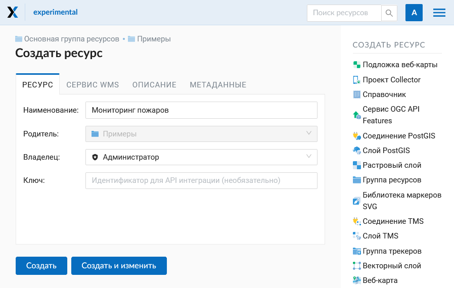
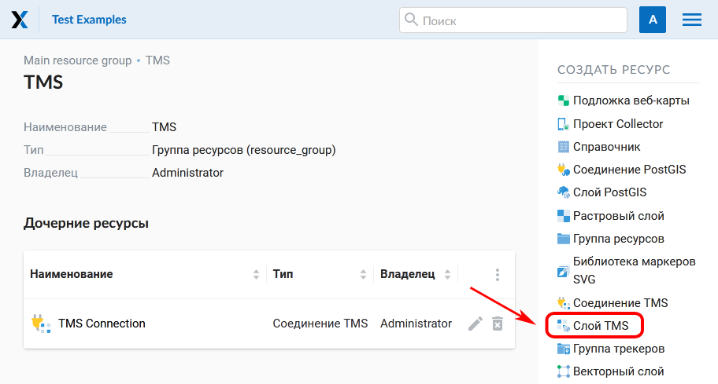
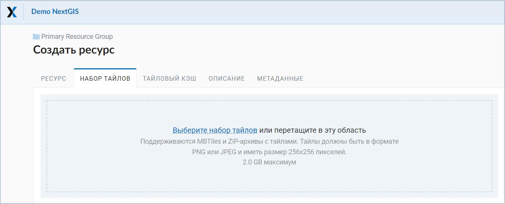
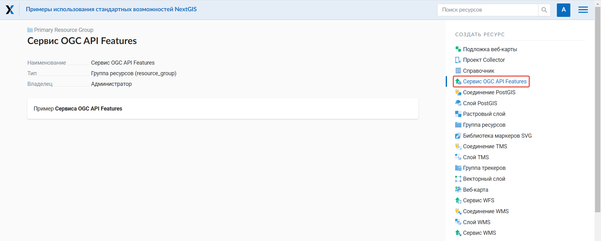

.. sectionauthor:: Артём Светлов <artem.svetlov@nextgis.ru>
.. sectionauthor:: Роман Гайнуллов <roman.gainullov@nextgis.ru>

.. _ngw_create_layers:

Добавление ресурсов
===================

NextGIS Web строится на **ресурсном** подходе - каждый компонент системы (слой, группа, сервис) является её ресурсом.
Одним из таких типов ресурсов является **слой** - растровое изображение или векторный файл (таблица базы данных).

Для каждого слоя может быть создано **неограниченное** количество **стилей** - способов визуализации геоданных на веб-карте.

Интерфейс добавления векторных, растровых и PostGIS слоев приблизительно одинаковый - создается ресурс слоя, внутри него - ресурсы стилей.
Последние визуализируют данные на веб-карте.

.. _ngw_create_basemap:

Подложка веб-карты
------------------

В блоке операций выберите из списка **Подложка веб-карт** (:numref:`ngweb_admin_create_basemap`).
В открывшемся окне введите название ресурса, которое будет отображаться в административном интерфейсе (:numref:`ngweb_admin_basemap_name`).

   Выбор ресурса "Подложка веб-карты"
   
   

   Наименование подложки веб-карты
   
   
На соответствующих вкладках можно добавить "Описание" и "Метаданные" ресурса (:numref:`ngweb_admin_basemap_desc`).
Как правило, метаданные используются для разработки сторонних приложений с помощью `API <https://docs.nextgis.ru/docs_ngweb_dev/doc/developer/toc.html>`_.

   Описание подложки веб-карты
   

На вкладке "Подложка веб-карты" задается URL-адрес TMS сервиса (:numref:`ngweb_admin_basemap_param`). Есть два пути для его указания:

* Найти нужный сервис в строке поиска. Остальные поля будут заполнены автоматически.
* Ввести адрес вручную. 

   Параметры подложки веб-карты

.. _ngw_data_preview:

Предварительный просмотр
-----------------------

Функция предварительного просмотра позволяет увидеть на подложке геометрии загруженных данных без добавления их на веб-карту.

.. note:: 
	Для векторных данных (vector layer) предварительный просмотр возможен как для слоя, так и для стиля. Для растровых - только для стиля. Для TMS и WFS слоев просмотр также доступен.
	
Находясь в соответствующем ресурсе, нажмите на иконку "глаз" напротив названия вложенного ресурса или на кнопку **Просмотр** в правом меню в разделе *Дополнительно*.

Откроется окно визуального предварительного просмотра загруженных геометрий без возможности более детального взаимодействия (просмотра атрибутов, идентификации объектов и др.).

   Выбор функции предварительного просмотра данных
   

   Предварительный просмотр данных

.. _ngw_create_raster_layer:

Растровый слой
--------------

Растровые изображения в NextGIS Web загружаются через специальный ресурс "Растровый слой".

.. _ngw_process_create_raster_layer:

Процесс создания
^^^^^^^^^^^^^^^^^^
Перейдите в группу ресурсов (папку), в которой необходимо создать рстровый слой.
В блоке операций "Создать ресурс" выберите из списка **Растровый слой** (см. :numref:`ngweb_admin_layers_create_raster_layer`).

   Выбор действия "Растровый слой"

В открывшемся окне на вкладке "Растровый слой" необходимо загрузить файл геоданных в формате GeoTIFF.
В зависимости от тарифного плана в окне отображается максимально допустимый объем загружаемого файла (:numref:`ngweb_admin_layers_create_raster_layer_upload`).

Если вы планируете подключать этот растр в QGIS напрямую из Веб ГИС, при загрузке включите режим Загрузить как Cloud Optimized GeoTIFF (COG). Это оптимизирует его специальным образом для более быстрого подключения и отображения.

   Окно загрузки растрового файла

Во вкладке "Наименование" укажите наименование растрового слоя (см. :numref:`ngweb_admin_layers_create_raster_layer_resourse_name`).
Оно будет отображаться в административном интерфейсе. Поле "Ключ" является необязательным к заполнению.

   Наименование растрового слоя

На вкладке "Описание" можно добавить произвольный текст, описывающий содержимое данного слоя (:numref:`ngweb_admin_layers_create_raster_layer_resourse_description`).

   Описание растрового слоя

В "Метаданные" слоя можно записать информацию в формате "ключ-значение" (:numref:`ngweb_admin_layers_create_raster_layer_resourse_metadata`).
Как правило, метаданные используются для разработки сторонних приложений с помощью `API <https://docs.nextgis.ru/docs_ngweb_dev/doc/developer/toc.html>`_.

   Метаданные растрового слоя

После указания всех необходимых параметров нажмите кнопку **Создать**.

.. _ngw_process_create_raster_style:

Стиль QGIS (для растров)
^^^^^^^^^^^^^^^^^^^^^^^^

После удачной загрузки растра необходимо создать стиль QGIS. Эта процедура аналогична добавлению `стиля <https://docs.nextgis.ru/docs_ngweb/source/mapstyles.html#qgis>`_ для векторного слоя. Создать его можно в NextGIS QGIS.
При создании веб-карты (подробнее см. :ref:`ngw_map_create`) можно добавить загруженный растр на карту, выбрав данный стиль.

Растровый слой с прозрачностью (обрезкой, альфа-каналом)
^^^^^^^^^^^^^^^^^^^^^^^^^^^^^^^^^^^^^^^^^^^^^^^^^^^^^^^^

Большинство утилит не создают канал прозрачности (А или альфа канал), а только добавляют значение NoData. 
Для преобразования значений NoData в альфа канал можно воспользоваться утилитой 
командной строки  :program:`gdalwarp`. Ниже приведен пример команды.

.. code-block:: shell

   gdalwarp -t_srs EPSG:3857 -multi -dstalpha -dstnodata none -wo \
   "UNIFIED_SRC_NODATA=YES" -co COMPRESS=JPEG \ 
   d:\temp\o\ast_20010730_010043_rgb.tif d:\temp\o\ast_20010730_010043_rgba.tif

Загрузка растров с индексированными цветами
^^^^^^^^^^^^^^^^^^^^^^^^^^^^^^^^^^^^^^^^^^^

Загрузка растров с индексированными цветами происходит так же, как и растров в RGB.
Если файл находится не в GeoTIFF, то его можно сконвертировать так

.. code-block:: shell

    gdal_translate yaroslavl.map  yaroslavl.tif

.. _ngw_create_vector_layer:

Векторный слой из файла
-----------------------

В NextGIS Web можно создавать векторные слои на основе геоданных в форматах :term:`ESRI Shapefile`, :term:`GeoJSON`, :term:`KML`, :term:`GML` и :term:`GeoPackage`. 

.. _ngw_process_create_vector_layer:

Процесс создания
^^^^^^^^^^^^^^^^^^

Перейдите в группу ресурсов (папку), в которой необходимо создать векторный слой.
В блоке операций "Создать ресурс" выберите из списка **Векторный слой** (см. :numref:`ngweb_admin_layers_create_vector_layer`). 

   Выбор действия "Векторный слой"
 
На открывшейся вкладке "Векторный слой" необходимо загрузить файл геоданных в формате ESRI Shapefile (zip-архив), GeoJSON, GML, KML или GeoPackage. В зависимости от `тарифного плана <http://nextgis.ru/nextgis-com/plans>`_ в окне отображается максимально допустимый объем загружаемого файла (:numref:`ngweb_admin_layers_create_vector_layer_upload`).
NextGIS Web может принимать многослойные наборы данных на входе. Если в архиве содержится несколько слоёв, то после его загрузки пользователю будет предложено выбрать слой, на основе которого будет создан ресурс "Векторный слой".

   Окно загрузки векторного файла

Ниже предлагается определить дополнительные параметры создания векторного слоя. В зависимости от качества данных можно следующим образом обрабатывать ошибки геометрии при загрузке файла:

* Не исправлять ошибки 
* Исправлять без потери данных (если это будет возможно)
* Исправлять с возможными потерями

Исходя из данных далее указываются тип геометрии, наличие/отсутствие мультигеометрий, Z-координаты и источник FID (field-ID, определять автоматически или указать из определенного поля). Если в ESRI Shapefile присутствует файл с описанием кодировки [расширение .cpg], то он будет учитываться при загрузке. Для формата GeoJSON кодировка всегда должна быть UTF-8. Подробнее о дополнительных параметрах можно прочитать `здесь <https://docs.nextgis.ru/docs_ngweb/source/vect_layer_upload_params.html>`_.

Во вкладке "Ресурс" укажите название векторного слоя (:numref:`ngweb_admin_layers_create_vector_layer_resourse_name`). Оно будет отображаться в административном интерфейсе.
Поле "Ключ" является необязательным к заполнению.

   Наименование векторного слоя
   
   
На вкладке "Описание" можно добавить произвольный текст, описывающий содержимое данного слоя (:numref:`ngweb_admin_layers_create_vector_layer_resourse_description`).

   Описание векторного слоя

В "Метаданные" слоя можно записать информацию в формате "ключ-значение" (:numref:`ngweb_admin_layers_create_vector_layer_resourse_metadata`).
Как правило, метаданные используются для разработки сторонних приложений с помощью `API <https://docs.nextgis.ru/docs_ngweb_dev/doc/developer/toc.html>`_.

   Метаданные векторного слоя

После завершения ввода нужных данных нажмите кнопку **Создать**.

Далее можно создавать `стиль <https://docs.nextgis.ru/docs_ngweb/source/mapstyles.html#qgis>`_, который в последующем будет визуализировать данные слоя на `веб-карте <https://docs.nextgis.ru/docs_ngweb/source/webmaps_admin.html#ngw-map-create>`_.

.. _ngw_vector_data_requirements:

Требования к исходным данным
^^^^^^^^^^^^^^^^^^^^^^^^^^^^^

В качестве исходного файла можно загружать следующие форматы:

* :term:`ESRI Shapefile`
* :term:`GeoJSON`
* :term:`KML`
* :term:`GML`
* :term:`GeoPackage`

Если нужно загрузить данные в другом формате, вы можете использовать :ref:`NextGIS Connect <ngcom_ngqgis_connect_data_upload>`.

.. note:: 
   В случае ESRI Shapefile все составляющие его части (dbf, shp, shx, prj и др.) должны быть 
   упакованы в архив формата Zip. 

.. note:: 
   Мы рекомендуем **не** использовать кириллицу в названиях полей атрибутов. Несмотря на то, что в большинстве случаев такие данные могут быть загружены в Веб ГИС и показаны на картах, в некоторых случаях вы можете испытывать проблемы с работой с такими данными в NextGIS Mobile и визуализацией (особенно если условные обозначения сформированы на базе одного из таких полей). Переименуйте поля латиницей перед загрузкой и используйте синонимы полей (алиасы) для их отображения кириллицей на картах.

Если во входном файле есть поля с названиями: id (ID) или geom (GEOM), то при загрузке они будут переименованы или превращены во внутренние идентификаторы (поле id).

.. _ngw_create_empty_vector_layer:

Пустой векторный слой
-------------------------

Создание пустого векторного слоя позволяет начать вести базу данных в ВебГИС без использования настольного приложения. 

Перейдите в группу ресурсов (папку), в которой необходимо создать векторный слой.
В блоке операций "Создать ресурс" выберите из списка **Векторный слой** (см. :numref:`ngweb_admin_layers_create_vector_layer_2`). 

   Выбор действия "Векторный слой"

В открывшемся окне в выпадающем меню выберите "Создать пустой слой". Ниже появится поле выбора типа геометрии слоя. По умолчанию создается точечный слой.

   Окно выбора геометрии пустого слоя

Во вкладке "Ресурс" укажите название векторного слоя (:numref:`ngweb_admin_layers_create_vector_layer_resourse_name`). Оно будет отображаться в административном интерфейсе.
Поле "Ключ" является необязательным к заполнению.

На вкладке "Описание" можно добавить произвольный текст, описывающий содержимое данного слоя (:numref:`ngweb_admin_layers_create_vector_layer_resourse_description`). 

В "Метаданные" слоя можно записать информацию в формате "ключ-значение" (:numref:`ngweb_admin_layers_create_vector_layer_resourse_metadata`).
Как правило, метаданные используются для разработки сторонних приложений с помощью `API <https://docs.nextgis.ru/docs_ngweb_dev/doc/developer/toc.html>`_.

После завершения ввода нужных данных нажмите кнопку **Создать**.

Далее можно создавать `стиль <https://docs.nextgis.ru/docs_ngweb/source/mapstyles.html#qgis>`_, который в последующем будет визуализировать данные слоя на `веб-карте <https://docs.nextgis.ru/docs_ngweb/source/webmaps_admin.html#ngw-map-create>`_.

Для добавления объектов на пустой слой можно использовать `инструменты редактирования веб-карты <https://docs.nextgis.ru/docs_ngcom/source/data_edit.html#ngcom-data-create-objects>`_.

.. _ngw_create_postgis:

Векторный слой из PostGIS
-------------------------

Для добавления векторного слоя из :abbr:`БД (база данных)` PostgreSQL с модулем расширения PostGIS необходимо 
сначала создать ресурс — соединение PostGIS. 

.. _ngw_create_postgis_connection:

Соединение PostGIS
^^^^^^^^^^^^^^^^^^

Для этого в блоке операций "Создать ресурс" следует выбрать **Cоединение PostGIS** (см. :numref:`admin_layers_create_postgis_connection_resourse`). 

   Выбор действия "Соединение PostGIS"

В открывшемся окне укажите наименование PostGIS соединения (:numref:`ngweb_admin_layers_create_postgis_connection_resourse_name`). Оно будет отображаться в административном интерфейсе (не путайте это наименование и название слоёв в базе данных). Поле "Ключ" является необязательным к заполнению.

   Наименование соединения PostGIS

На вкладке "Описание" можно добавить произвольный текст, описывающий создаваемый ресурс (:numref:`ngweb_admin_layers_create_postgis_connection_resourse_description`).

   Описание соединения PostGIS

В "Метаданные" ресурса можно записать информацию в формате "ключ-значение" (:numref:`ngweb_admin_layers_create_postgis_connection_resourse_metadata`).
Как правило, метаданные используются для разработки сторонних приложений с помощью `API <https://docs.nextgis.ru/docs_ngweb_dev/doc/developer/toc.html>`_.

   Метаданные соединения PostGIS
   
   
На вкладке "Cоединение PostGIS" необходимо ввести параметры подключения к :abbr:`БД (база данных)` PostGIS, из которой 
будут забираться ваши данные (:numref:`ngweb_admin_layers_create_postgis_connection_db_logins`).

.. figure:: _static/admin_layers_create_postgis_connection_db_logins_rus.png
   :name: ngweb_admin_layers_create_postgis_connection_db_logins
   :align: center
   :width: 20cm

   Окно параметров соединения PostGIS.
   
После указания параметров нажмите кнопку **Создать**.   

.. _ngw_create_postgis_layer:

Слой PostGIS
^^^^^^^^^^^^^^^^^^

Далее можно приступать к добавлению отдельных слоёв PostGIS. Для этого в блоке операций необходимо выбрать **Слой PostGIS** (см. :numref:`admin_layers_create_postgis_layer`). 

   Выбор действия "Слой PostGIS"
   
   
На вкладке "Ресурс" указывается наименование слоя PostGIS (:numref:`ngweb_admin_layers_create_postgis_layer_resourse_name`). Оно будет отображаться в административном интерфейсе и дереве слоев веб-карты после добавления. Поле Ключ является необязательным к заполнению.
   

   Наименование Слоя PostGIS
   

В "Описании" можно задать произвольный текст, отражающий содержание ресурса (:numref:`ngweb_admin_layers_create_postgis_layer_resourse_description`).

   Описание слоя PostGIS
   

На соответствующей вкладке есть возможность добавить метданные слоя PostGIS (:numref:`ngweb_admin_layers_create_postgis_layer_resourse_metadata`).
Как правило, метаданные используются для разработки сторонних приложений с помощью `API <https://docs.nextgis.ru/docs_ngweb_dev/doc/developer/toc.html>`_.

   Метаданные слоя PostGIS
  
  
На вкладке "Слой PostGIS" настраиваются параметры слоя (:numref:`ngweb_admin_layers_create_postgis_layer_tablename`).

   Окно параметров слоя PostGIS
   

Здесь необходимо выполнить следующие действия:

#. Из выпадающего списка выбрать подключение к :abbr:`БД (база данных)` (созданное ранее).
#. Выбрать схему :abbr:`БД (база данных)`, в которой находится слой PostGIS. 
	В одной базе данных PostgreSQL может быть несколько схем, внутри каждой схемы лежат таблицы и представления. Если схема одна, то она называется public. Подробнее смотрите в руководствах по :program:`СУБД PostgreSQL`.
#. Выбрать название таблицы (слоя PostGIS). 
	Вам потребуется знать названия ваших таблиц и полей в базе данных. 
	Отображение таблиц и представлений не входит в задачи NextGIS Web. Для просмотра можно воспользоваться :program:`NextGIS QGIS` или :program:`PgAdmin`.
#. Выбрать "Поле ID". 
	При загрузке данных в PostGIS через NextGIS QGIS обычно создается поле с названием ogc_fid, при загрузке иным способом название поля может отличаться.
	Поле ID должно удовлетворять ограничениям на тип данных: быть числовым (**numeric**) и являться первичным ключом.
#. Выбрать "Поле геометрии".
	При загрузке данных в PostGIS через :program:`NextGIS QGIS`  обычно создается поле геометрии с названием wkb_geometry, при загрузке иным способом название поля может отличаться.
#. Поля "Тип геометрии", "Система координат", "Описание атрибутов" и "SRID" являются не обязательными, и их значения могут быть оставлены по умолчанию.

После указания параметров нажмите кнопку **Создать**.   

.. _ngw_create_postgis_details:

Детали
^^^^^^^

Программное обеспечение NextGIS Web поддерживает добавление таблиц, в которых в 
поле геометрии хранятся совместно точечные, линейные и полигональные геометрии. 
Это необходимо для отображения специфических наборов данных: например, если в одной 
таблице хранятся координаты городских парков в виде полигонов и мусорных урн в виде 
точек. В этом случае в NextGIS Web нужно добавить три отдельных слоя для каждого 
типа геометрии, и выбрать нужный элемент в поле "Тип геометрии".

После создания слоя для отображения подписей к геометриям необходимо задать атрибут 
наименования. Для этого следует зайти на страницу редактирования слоя и выбрать нужное поле 
в списке "Атрибут наименования".

Если в :abbr:`БД (база данных)` были изменены какие либо данные, касающиеся структуры (названия или типы полей, 
изменен их состав, переименованы таблицы и т. п.), то в свойствах соответствующего 
слоя необходимо обновить описания атрибутов. Для этого для выбранного слоя следует 
выбрать действие "Изменить", на вкладке "Слой PostGIS" в поле "Описания атрибутов" выбрать "Загрузить" из базы данных и нажать "Сохранить".

.. _ngw_postgis_diagnostics:

Диагностика PostGIS
^^^^^^^^^^^^^^^^^^^

Проверить корректность введенных данных при добавлении ресурса **Соединение PostGIS** или **Слой PostGIS** можно при помощи инструмента **Диагностика**. 
Для этого вам необходимо нажать на кнопку  **Диагностика** на панели справа.

В случае, если при создании PostGIS-соединения или PostGIS слоя все поля заполнены верно - диагностика пройдет успешно.

В случае, если какие-то из введенных данных не корректны - появится сообщение об ошибке.

.. _ngw_postgis_diagnostics:

.. _ngw_create_postgis_problems:

Возможные проблемы со слоями PostGIS
^^^^^^^^^^^^^^^^^^^^^^^^^^^^^^^^^^^^

Вы создали подключение и пытаетесь создать на его основе слой PostGIS. 

Если вы получаете ошибку:

1. Невозможно подключиться к базе данных!

Проверьте, доступна ли база данных к которой вы подключаетесь, правильная ли у вас учетная запись. Это удобно делать через pgAdmin или QGIS.

Имейте в виду, может быть так, что база временно отключена или изменились параметры доступа.

Создание слоя с условиями
^^^^^^^^^^^^^^^^^^^^^^^^^

В :program:`NextGIS Web` нельзя указывать условия отбора записей из слоя (SQL конструкция WHERE). 
Это делается для обеспечения безопасности (исключения атак SQL Injection). Для обеспечения 
такой возможности необходимо в БД создать представления с соответствующими условиями отбора.

Для этого необходимо подключится к :abbr:`БД (база данных)` PostgreSQL/PostGIS при помощи :program:`pgAdminIII`, 
перейти в схему данных, где следует создать представление и в элементе дерева "Представления" 
правой клавишей мыши вызвать контекстное меню и выбрать "Создать новое представление" (см. :numref:`ngweb_pgadmin3`. п. 1). 
Также диалог можно вызвать правым кликом на названии схемы, выбрав "Новый объект" и далее "Новое представление".
Далее в открывшемся диалоге необходимо указать:

#. Название представления (вкладка "Свойства").
#. Схему данных, в которой необходимо создать представление (вкладка "Свойства").
#. Необходимый SQL запрос (вкладка "Определение").

.. figure:: _static/pgadmin3_rus.png
   :name: ngweb_pgadmin3
   :align: center
   :width: 20cm

   Главное окно ПО :program:`pgAdminIII`.

   Цифрами на рисунка обозначено: 1 – дерево элементов базы данных; 2 – кнопка 
   открытия таблицы (активна при выделенной таблице); 3 – содержимое запроса в 
   представлении.

После этого, не выходя из :program:`pgAdminIII`, можно открыть представление для 
проверки корректности введенного SQL запроса (см. :numref:`ngweb_pgadmin3`. п. 2). 

.. _ngw_create_wms_layer:

Cлой WMS
--------

.. note:: 
	В настоящее время поддерживаются версии WMS 1.1.1 и 1.3.0.

NextGIS Web является клиентом :term:`WMS`. Для подключения слоя WMS необходимо знать его адрес. 

Сервер WMS, предоставляющий подключаемый слой, должен отдавать его в системе координат EPSG:3857. Обычно сервера умеют отдавать WMS в нескольких указанных в конфигурации СК, одна из них обязательно должна быть 3857.

Код должен быть строго 3857, 900913 не подойдет. Например, слой WMS, предоставляемый Geofabrik (GetCapabilities), умеет отдавать данные в EPSG:4326 и EPSG:900913. Фактически EPSG:900913 и EPSG:3857 - это одно и то же, но NextGIS Web запрашивает данные в EPSG:3857, а этот сервер WMS такую СК не поддерживает. Подключенные данные не будут отображаться на карте.

Проверить наличие 3857 для подключаемого слоя можно, выполнив запрос GetCapabilites к серверу и изучив ответ сервера.

.. _ngw_create_wms_connection:

Соединение WMS
^^^^^^^^^^^^^^^

Для добавления слоя WMS необходимо сначала создать подключение к серверу WMS (достаточно одного соединения для множества слоёв). Для этого в блоке операций "Создать ресурс" следует выбрать **Cоединение WMS** (см. :numref:`admin_layers_create_wms_connection`). 

   Выбор действия "Cоединение WMS"
   

В открывшемся окне укажите наименование WMS соединения (:numref:`admin_layers_create_wms_connection_name`). Оно будет отображаться в административном интерфейсе (не путайте это наименование и названия слоёв в базе данных). Поле "Ключ" является необязательным к заполнению.

   Наименование Соединения WMS

На вкладке "Описание" можно добавить произвольный текст, описывающий текущий ресурс (:numref:`ngweb_admin_layers_create_wms_connection_description`)

   Описание Соединения WMS
   
В "Метаданные" ресурса можно записать информацию в формате "ключ-значение" (:numref:`admin_layers_create_wms_connection_metadata`).
Как правило, метаданные используются для разработки сторонних приложений с помощью `API <https://docs.nextgis.ru/docs_ngweb_dev/doc/developer/toc.html>`_.

   Метаданные Соединения WMS

На вкладке "Cоединение WMS" необходимо ввести параметры подключения (:numref:`ngweb_admin_layers_create_wms_connection_url`) к **Серверу WMS**, который предоставляет данные:

* URL
* Имя пользователя
* Пароль
* Версия WMS
* Возможности (управление запросом ``GetCapabilites`` к WMS-серверу)

   Окно параметров Cоединения WMS

После указания параметров нажмите кнопку **Создать**.   

.. _ngw_create_layer_wms:

Слой WMS
^^^^^^^^

Далее можно приступать к добавлению отдельных слоёв WMS. Для этого следует перейти в группу, где необходимо создать слой и в блоке операций выбрать **Слой WMS** (см. :numref:`admin_layers_create_wms_layer`). 

   Выбор действия "Слой WMS"
   

На вкладке "Ресурс" указывается наименование слоя WMS (:numref:`ngweb_admin_layers_create_wms_layer_name`). Оно будет отображаться в административном интерфейсе и дереве слоев веб-карты после добавления. Поле Ключ является необязательным к заполнению.

   Наименование слоя WMS

На вкладке "Описание" можно добавить произвольный текст, описывающий содержимое слоя (:numref:`ngweb_admin_layers_create_wms_layer_description`).

   Описание слоя WMS

Настройки тайлового кэша подробнее описаны в `данном <https://docs.nextgis.ru/docs_ngweb/source/mapstyles.html#ngw-create-tile-cache>`_ разделе.

На соответствующей вкладке есть возможность добавить метаданные слоя в формате "ключ-значение" (:numref:`ngweb_admin_layers_create_wms_layer_metadata`).
Как правило, метаданные используются для разработки сторонних приложений с помощью `API <https://docs.nextgis.ru/docs_ngweb_dev/doc/developer/toc.html>`_.

   Метаданные слоя WMS

На вкладке "Слой WMS" настраиваются параметры (:numref:`ngweb_admin_layers_create_wms_layer_parameters`):

* Выбор Соединения WMS (созданного ранее)
* Формат изображения (список MIME-типов данных, предоставляемых сервером)
* Выбор слоя из списка (можно выбрать несколько)

.. figure:: _static/admin_layers_create_wms_layer_parameters_rus.png
   :name: ngweb_admin_layers_create_wms_layer_parameters
   :align: center
   :width: 20cm

   Окно настройки параметров слоя WMS

На последней вкладке добавляются вендор параметры (:numref:`ngweb_admin_layers_create_wms_layer_vendorparameters`). Это нестандартные параметры запроса, которые определяются реализацией для обеспечения расширенных возможностей и зависят от поставщика WMS.

   Вендор параметры слоя WMS

После указания параметров нажмите кнопку **Создать**.   

.. warning:: 
   Идентификационные запросы к внешним WMS сервисам с Веб карт не поддерживаются. 

.. _ngw_create_wms_service:

Сервис WMS
----------

.. _ngw_create_service_wms:

Создание WMS-сервиса
^^^^^^^^^^^^^^^^^^^^

Программное обеспечение NextGIS Web может работать как сервер WMS. По этому протоколу 
клиенты запрашивают картинку карты по заданному охвату. 

Для развёртывания WMS-сервиса необходимо добавить ресурс. Для этого в блоке операций "Создать ресурс" следует выбрать **Сервис WMS** (см. :numref:`admin_layers_create_wms_service`). 

   Выбор действия "Сервис WMS"
   
   
На вкладке "Ресурс" указывается наименование сервиса WMS (:numref:`admin_layers_create_wms_service_name_rus`). Оно будет отображаться в административном интерфейсе. Поле Ключ является необязательным к заполнению.

   
   Наименование сервиса WMS

На вкладке "Описание" можно добавить произвольный текст, описывающий текущий ресурс (:numref:`admin_layers_create_wms_description`)

   Описание Сервиса WMS
   
В "Метаданные" ресурса можно записать информацию в формате "ключ-значение" (:numref:`admin_layers_create_wms_metadata`).
Как правило, метаданные используются для разработки сторонних приложений с помощью `API <https://docs.nextgis.ru/docs_ngweb_dev/doc/developer/toc.html>`_.

   Метаданные Сервиса WMS
   

На вкладке "Сервис WMS" необходимо добавить ссылки на нужные слои или стили. (:numref:`ngweb_admin_layers_create_wms_service_url`). Также можно указать диапазон масштабных уровней отображения данных.

   Окно параметров соединения WMS

После создания ресурса выведется сообщение с URL WMS-сервиса, который можно 
использовать в других программах, например :program:`NextGIS QGIS`, или :program:`JOSM`. 
Далее необходимо настроить права доступа к WMS-сервису (см. :ref:`ngw_access_rights`) для стороннего использования различными пользователями.

Cлой NextGIS Web можно добавлять в настольные, мобильные и Веб ГИС различными способами.

.. _ngw_service_using_wms:

Использование сервиса WMS
^^^^^^^^^^^^^^^^^^^^^^^^^

NextGIS Web является сервером WMS. Соответственно подключить созданные в нем сервисы WMS можно 
в любом клиентском ПО, поддерживающем протокол WMS. Для этого нужно знать URL WMS-сервиса, 
который высвечивается на странице настроек конкретного сервиса.

Например:

.. code-block:: html

   https://demo.nextgis.ru/api/resource/4817/wms

Для использования сервиса через утилиты GDAL нужно создать для него файл XML. Для создания такого файла нужно знать
URL сервиса WMS. Эти параметры нужно подставить в строку ServerUrl примера ниже. Все остальное 
остается неизменным.

.. code-block:: xml

   <GDAL_WMS>
    <Service name="WMS">
        <Version>1.1.1</Version>
        <ServerUrl>https://demo.nextgis.ru/api/resource/4817/wms</ServerUrl>
        <SRS>EPSG:3857</SRS>
        <ImageFormat>image/png</ImageFormat>
        <Layers>moscow_boundary_multipolygon</Layers>
        <Styles></Styles>
    </Service>
    <DataWindow>
      <UpperLeftX>-20037508.34</UpperLeftX>
      <UpperLeftY>20037508.34</UpperLeftY>
      <LowerRightX>20037508.34</LowerRightX>
      <LowerRightY>-20037508.34</LowerRightY>
      <SizeY>40075016</SizeY>
      <SizeX>40075016.857</SizeX>
    </DataWindow>
    <Projection>EPSG:3857</Projection>
    <BandsCount>3</BandsCount>
   </GDAL_WMS>

Если нужна картинка с альфа каналом, следует указать ``<BandsCount>4</BandsCount>``.

Пример вызова утилиты GDAL. Она получает картинку из NextGIS WEB по WMS и сохраняет её в GeoTIFF.

.. code-block:: shell

   gdal_translate -of "GTIFF" -outsize 1000 0  -projwin  4143247 7497160 4190083 7468902   ngw.xml test.tiff

.. _ngw_create_tms_layer:

Слой TMS
--------

.. _ngw_create_tms_connection:

Соединение TMS
^^^^^^^^^^^^^^

Для добавления слоя TMS сначала необходимо создать ресурс Соединение TMS. Для этого следует в блоке операций "Создать ресурс" выбрать **Соединение TMS** (см. :numref:`TMS_connection_create`).

   Выбор ресурса Соединение TMS
   
Далее необходимо ввести наименование подключения, которое будет отображаться в административном веб интерфейсе (см. :numref:`TMS_connection_name`).

   Наименование ресурса Соединение TMS
   
Поле "Ключ" является необязательным к заполнению. На соответствующих вкладках можно добавить описание ресурса и метаданные.
Как правило, метаданные используются для разработки сторонних приложений с помощью `API <https://docs.nextgis.ru/docs_ngweb_dev/doc/developer/toc.html>`_.
Вкладка "Соединение TMS" отвечает за выбор и настройку одного из способов подключения к TMS серверу - настраиваемый или из геосервисов NextGIS (см. :numref:`TMS_connection_type`).

   Настройка способа подключения TMS

В случае настраиваемого способа подключения пользователь должен указать шаблон URL, параметры ключа API и используемую тайловую схему. Для геосервисов NextGIS указывается только пользовательский ключ API. После заполнения всех полей нажатие кнопки **Создать** завершает процесс создания ресурса Соединение TMS.

.. _ngw_tms_layer:

Слой TMS
^^^^^^^^

Ресурс **Слой TMS** добавляется на базе созданного ранее Соединения TMS. Для этого следует выбрать соответствующий тип ресурса из меню создания (см. :numref:`TMS_layer_create`).

   
   Выбор ресурса Слой TMS

На первой вкладке указывается наименование слоя для отображения в административном интерфейсе (см. :numref:`TMS_layer_name`).

   Наименование TMS слоя

Кэширование обеспечивает повышение скорости отображения слоев веб карты. Настройки тайлового кэша подробнее описаны в `данном <https://docs.nextgis.ru/docs_ngweb/source/mapstyles.html#ngw-create-tile-cache>`_ разделе.
   
На вкладке "Слой TMS" находятся основные настройки отображения (см. :numref:`TMS_layer_settings_rus`):

* Соединение TMS - выберите ранее созданное подключение TMS
* Система координат для отображения информации (выбирается из выпадающего списка)
* Минимальный и максимальный масштаб отображения данных
* Охват в градусах
* Размер тайлов в пикселях

   
   Настройки TMS слоя

После создания слоя пользователь может добавить его на веб-карту для отображения. Добавляется именно **слой** TMS, стиль для него не нужен.
   
.. _ngw_connect_tms_gdal:

Использование сервиса TMS
^^^^^^^^^^^^^^^^^^^^^^^^^

NextGIS Web является сервером TMS. Соответственно подключить созданные в нем слои/стили можно 
в любом клиентском ПО, поддерживающем протокол TMS. Для этого нужно знать URL сервиса TMS. 

Ссылка формируется следующим образом, пример:

.. code-block:: html

   https://demo.nextgis.ru/api/component/render/tile?z={z}&x={x}&y={y}&resource=234

Для использования TMS через утилиты GDAL нужно создать для него файл XML. Для создания такого файла нужно знать URL TMS. Эти параметры нужно подставить в строку ServerUrl примера ниже. Все остальное 
остается неизменным.

.. code-block:: xml

   <GDAL_WMS>
    <Service name="TMS">
        <ServerUrl>https://demo.nextgis.ru/api/component/render/tile?z={z}&x={x}&y={y}&resource=234</ServerUrl>
    </Service>
    <DataWindow>
        <UpperLeftX>-20037508.34</UpperLeftX>
        <UpperLeftY>20037508.34</UpperLeftY>
        <LowerRightX>20037508.34</LowerRightX>
        <LowerRightY>-20037508.34</LowerRightY>
        <TileLevel>18</TileLevel>
        <TileCountX>1</TileCountX>
        <TileCountY>1</TileCountY>
        <YOrigin>top</YOrigin>
    </DataWindow>
    <Projection>EPSG:3857</Projection>
    <BlockSizeX>256</BlockSizeX>
    <BlockSizeY>256</BlockSizeY>
    <BandsCount>4</BandsCount>
    <Cache />
   </GDAL_WMS> 

.. _ngw_tile_set:

Набор тайлов
------------
Для добавления **Набора тайлов** необходимо в блоке операций «Создать ресурс» выбрать **Набор тайлов**.

.. figure:: _static/Tileset_create_rus.png
   :name: Tileset_create_rus
   :align: center
   :width: 16cm

Далее необходимо ввести наименование набора тайлов, которое будет отображаться в административном веб интерфейсе.

Поле «Ключ» является необязательным к заполнению. На соответствующих вкладках можно добавить описание ресурса и метаданные. Как правило, метаданные используются для разработки сторонних приложений с помощью API. 

Во вкладке «Набор тайлов» необходимо загрузить набор тайлов в формате MBTiles или zip-архив. Тайлы должны быть в формате PNG или JPEG и иметь размер 256х256 пикселей.

Во вкладке «Тайловый кэш» пользователь может задать настройки кэширования:

* Включение - включение/выключение кэширования тайлов;
* Разрешить тайлы для запросов изображений - при запросе изображения (не тайла) использовать закэшированные тайлы при их наличии;
* Максимальный масштабный уровень - пороговое значение, выше которого обращение к кэшу не происходит, изображение карты рендерится на лету;
* TTL, сек (Time to live) - “время жизни” или хранения тайлов на сервере в секундах, после которого при следующем запросе изображение будет формироваться заново. Если TTL = 0, то время хранения тайлов не ограничено;
* Очистить - write only - очищает тайловый кэш при сохранении стиля.

После заполнения всех полей нажатие кнопки **Создать** завершает процесс создания ресурса **Набор тайлов**.

.. _ngw_wfs_service:

Cервис WFS
----------

.. _ngw_create_service_wfs:

Создание сервиса WFS
^^^^^^^^^^^^^^^^^^^^

Настройка сервиса WFS осуществляется так же, как для WMS-сервиса, только добавляется не стиль, а слой.
   
.. note::
    На данный момент поддерживаются фильтры Intersects, ResourceId (ObjectId, FeatureId).

NextGIS Web является сервером WFS - может публиковать сервисы WFS на базе векторных слоёв. Используя эти сервисы, сторонние программы 
могут изменять векторные данные на сервере. Поддерживаемые версии протокола WFS: 1.0, 1.1, 2.0, 2.0.2.

Для развёртывания сервиса WFS необходимо в блоке операций "Создать ресурс" выбрать **Сервис WFS** (:numref:`admin_layers_create_wfs_service`). 

   Выбор действия "Сервис WFS"
   
На вкладке **Ресурс** указывается наименование сервиса (:numref:`ngweb_admin_layers_create_wfs_service_name`). Поле "Ключ" предназначено для разработчиков, заполенять его не обязательно.

   Наименование Сервиса WFS
   
   
На вкладке "Описание" можно добавить произвольный текст, описывающий текущий ресурс (:numref:`ngweb_admin_layers_create_wfs_description`)

   Описание Сервиса WFS
   
В "Метаданные" ресурса можно записать информацию в формате "ключ-значение" (:numref:`admin_layers_create_wfs_metadata`).
Как правило, метаданные используются для разработки сторонних приложений с помощью `API <https://docs.nextgis.ru/docs_ngweb_dev/doc/developer/toc.html>`_.

   Метаданные Сервиса WFS

Вкладка "Сервис WFS" отвечает за слои, включаемые в сервис (:numref:`ngweb_admin_layers_create_wfs_service_settings`). Для каждого 
добавленного слоя нужно указать число возвращаемых из базы объектов. По умолчанию это значение равно 1000.
Если в этом поле значение убрать совсем, то ограничение будет снято и будут передаваться все объекты. Однако это может привести 
к значительной нагрузке на сервер и значительным задержкам при передаче больших объемов данных.

.. figure:: _static/admin_layers_create_wfs_service_settings_rus.png
   :name: ngweb_admin_layers_create_wfs_service_settings
   :align: center
   :width: 20cm

   Окно параметров сервиса WFS

.. _ngw_service_using_wfs:

Использование сервиса WFS
^^^^^^^^^^^^^^^^^^^^^^^^^

После создания ресурса вам будет доступен URL сервиса WFS, который вы можете использовать в других программах, например :program:`NextGIS QGIS`. 

Если это необходимо, можно настроить права доступа к сервису WFS (см. главу :ref:`ngw_access_rights`).

Программно подключаться к созданным сервисам WFS можно по ссылкам следующего вида (также `поддерживается <https://docs.nextgis.ru/docs_ngweb_dev/doc/developer/auth.html>`_ basic auth):

.. sourcecode:: http

   https://mywebgis.nextgis.com/api/resource/2413/wfs?SERVICE=WFS&TYPENAME=ngw_id_2412&username=administrator&password=mypassword&srsname=EPSG:3857&VERSION=1.0.0&REQUEST=GetFeature

.. _ngw_OGC_API_Features:

Cервис OGC API Features
-----------------------

Создание сервиса OGC API Features
^^^^^^^^^^^^^^^^^^^^^^^^^^^^^^^^^

Настройка сервиса OGC API Features осуществляется так же, как для WFS-сервиса.
   
NextGIS Web является сервером OGC API Features - может публиковать сервисы OGC API Features на базе векторных слоёв. Используя эти сервисы, сторонние программы могут изменять векторные данные на сервере. Поддерживаемые версии протокола OGC API Features: 1.0.0.

Для развёртывания сервиса OGC API Features необходимо в блоке операций «Создать ресурс» выбрать **Сервис OGC API Features**. (:numref:`admin_layers_create_ogc_api_features_service_rus`). 

   Выбор действия "Сервис OGC API Features"
   
На вкладке **Ресурс** указывается наименование сервиса (:numref:`admin_layers_create_ogc_api_features_service_name_rus`). Поле "Ключ" предназначено для разработчиков, заполенять его не обязательно.

   Наименование Сервиса OGC API Features
   
   
На вкладке "Описание" можно добавить произвольный текст, описывающий текущий ресурс (:numref:`admin_layers_create_ogc_api_features_service_description_rus`)

   Описание Сервиса OGC API Features
   
В "Метаданные" ресурса можно записать информацию в формате "ключ-значение" (:numref:`admin_layers_create_ogc_api_features_service_metadata_rus`).
Как правило, метаданные используются для разработки сторонних приложений с помощью `API <https://docs.nextgis.ru/docs_ngweb_dev/doc/developer/toc.html>`_.

   Метаданные Сервиса OGC API Features

Вкладка "Сервис OGC API Features" отвечает за слои, включаемые в сервис (:numref:`admin_layers_create_ogc_api_features_service_settings_rus`). Для каждого 
добавленного слоя нужно указать число возвращаемых из базы объектов. По умолчанию это значение равно 1000.
Если в этом поле значение убрать совсем, то ограничение будет снято и будут передаваться все объекты. Однако это может привести 
к значительной нагрузке на сервер и значительным задержкам при передаче больших объемов данных.

   Окно параметров сервиса OGC API Features

.. _ngw_service_using_OGC_API_Features:

Использование сервиса OGC API Features
^^^^^^^^^^^^^^^^^^^^^^^^^

После создания ресурса вам будет доступен URL сервиса OGC API Features, который вы можете использовать в других программах, например :program:`QGIS`. 

Если это необходимо, можно настроить права доступа к сервису OGC API Features (см. главу :ref:`ngw_access_rights`).

Программно подключаться к созданным сервисам OGC API Features можно по ссылкам следующего вида (также `поддерживается <https://docs.nextgis.ru/docs_ngweb_dev/doc/developer/auth.html>`_ basic auth):

.. sourcecode:: http

   https://yourwebgis.nextgis.com/api/resource/208/ogcf

.. _ngw_resourses_group:
Создание группы ресурсов
------------------------

Ресурсы можно объединять в группы. Например, в одну группу можно сложить базовые данные, 
в другую группу –  космические снимки, в третью – тематические данные и т.д.

Группы служат для удобной организации слоев в панели управления, а также для удобного 
назначения прав доступа. 

Для создания группы ресурсов необходимо перейти в ту группу (корневая или др.), где будет создана новая группа ресурсов, и 
в блоке операций "Создать ресурс" выбрать **Группа ресурсов** (см. :numref:`admin_layers_create_resource_group`). 

.. figure:: _static/admin_layers_create_resource_group_rus_2.png
   :name: admin_layers_create_resource_group
   :align: center
   :width: 20cm

   Выбор действия "Группа ресурсов"
   
При этом откроется окно, представленное на :numref:`ngweb_admin_layers_create_group`.

   Окно создания группы ресурсов

В открывшемся окне необходимо указать название группы, которое будет отображаться в административном веб интерфейсе, 
а также в дереве слоев карты, и нажать кнопку **Создать**.

Поле "Ключ" является необязательным к заполнению.

Можно добавить описание ресурса и метаданные на соответствующих вкладках. 
Как правило, метаданные используются для разработки сторонних приложений с помощью `API <https://docs.nextgis.ru/docs_ngweb_dev/doc/developer/toc.html>`_.

.. _ngw_create_lookup_table:

Справочник
----------------------------

Для создания справочника необходимо перейти в ту группу ресурсов (корневая или др.), где будет создана справочник, и 
в блоке операций "Создать ресурс" выбрать **Справочник** (см. :numref:`admin_layers_create_lookup_table`). 

.. figure:: _static/admin_layers_create_lookup_table_rus_2.png
   :name: admin_layers_create_lookup_table
   :align: center
   :width: 20cm

   Выбор действия "Справочник"
   
Во вкладке **Ресурс** указываетя название справочника. Оно будет отображаться в административном интерфейсе и дереве слоев веб-карты после добавления. Поле Ключ является необязательным к заполнению.

   Наименование справочника

На вкладке "Справочник" введите данные в виде "ключ - значение". Также можно добавить справочник, импортировав его из файла.

   Окно данных справочника

Можно добавить описание ресурса и метаданные на соответствующих вкладках.
Как правило, метаданные используются для разработки сторонних приложений с помощью `API <https://docs.nextgis.ru/docs_ngweb_dev/doc/developer/toc.html>`_.

После ввода необходимых данных следует нажать на кнопку **Сохранить**. 
Окно примет вид :numref:`ngweb_new_resource_lookup`.

   Созданный справочник

Для внесения изменений в справочник следует в панели операций "Действие" выбрать 
**Изменить**, после чего откроется окно для редактирования данных ресурса.
В окне необходимо перейти на вкладку "Справочник", на которой можно изменить состав значений 
справочника:

* добавить новую пару ключ - значение
* изменить текущую пару ключ - значение
* удалить пару ключ - значение

Также можно экспортировать справочник в формате CSV.

Справочник можно также подключить к векторному слою, это позволит выбирать значение атрибута из списка. Для этого перейдите в редактирование векторного слоя, во вкладке Атрибуты выберите нужную строку и нажмите на стрелку вниз в колонке Справочник.

.. _ngw_create_svg_marker_lib:

Библиотека маркеров SVG
----------------------

Ресурс позволяет создавать библиотеки SVG-иконок (маркеров) для их последующего отображения на веб-карте с помощью `QGIS стилей <https://docs.nextgis.ru/docs_ngweb/source/mapstyles.html#qgis>`_ векторных слоев.
Для создания библиотеки необходимо выбрать **Библиотека маркеров SVG** в блоке операций с правой стороны (см. :numref:`select_svg_lib`).

   
   Выбор ресурса Библиотека маркеров SVG

Откроется окно создания ресурса. На первой вкладке введите название ресурса маркеров (см. :numref:`name_svg_lib`).

   
   Название ресурса Библиотеки маркеров SVG
   
При необходимости добавьте описание и метаданные на второй и третьей вкладке.
Как правило, метаданные используются для разработки сторонних приложений с помощью `API <https://docs.nextgis.ru/docs_ngweb_dev/doc/developer/toc.html>`_.
На четвертой вкладке необходимо загрузить svg-маркеры с вашего устройства (см. :numref:`upload_svg`). Маркеры можно загрузить как отдельными файлами, так и zip-архивом.
В архиве не должно быть ничего, кроме маркеров.

.. figure:: _static/upload_svg_rus.png
   :name: upload_svg
   :align: center
   :width: 20cm
   
   Загрузка SVG-маркера

После загрузки всех иконок в библиотеку они отобразятся списком с именами файлов. Для завершения создания ресурса необходимо нажать кнопку **Создать** (см. :numref:`create_svg_lib`).

   
   Создание библиотеки маркеров SVG
   

   
   Список загруженных в библиотеку SVG-маркеров
   
Процесс добавления библиотек маркеров к стилю векторного слоя описан `здесь <https://docs.nextgis.ru/docs_ngweb/source/mapstyles.html#qgis>`_.

Типовая структура
-----------------

С учетом опыта использования NextGIS Web рекомендуется следующая типовая структура 
организации ресурсов.

Типовая структура ::

  Основная группа ресурсов
	Веб-карты
		Основная веб-карта
		Тестовая веб-карта
	Подключения PostGIS
		PostGIS на сервере
	Слои данных
		Базовые данные
			Границы объектов
			Инфраструктура - линейные объекты
			Учётные площадки
		Тематические данные
			Результаты замеров на учётных площадках
			Результаты замеров на учётных маршрутах
			Точки встреч редких видов
		Рельеф
			ASTER DEM
				ЦМР
				Изолинии
		Топографические данные
			Openstreetmap
				Автодороги
				Административные границы
				Гидросеть
				Железнодорожные станции
				Железные дороги
				Землепользование
			1 : 100000
				M-37-015
				M-37-016
				M-37-017
		Съёмка
			Landsat-8
			Ikonos
