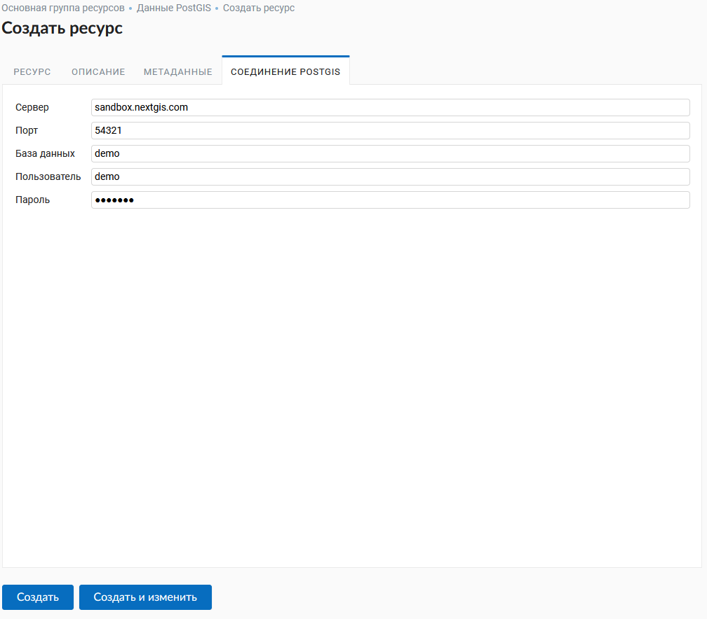
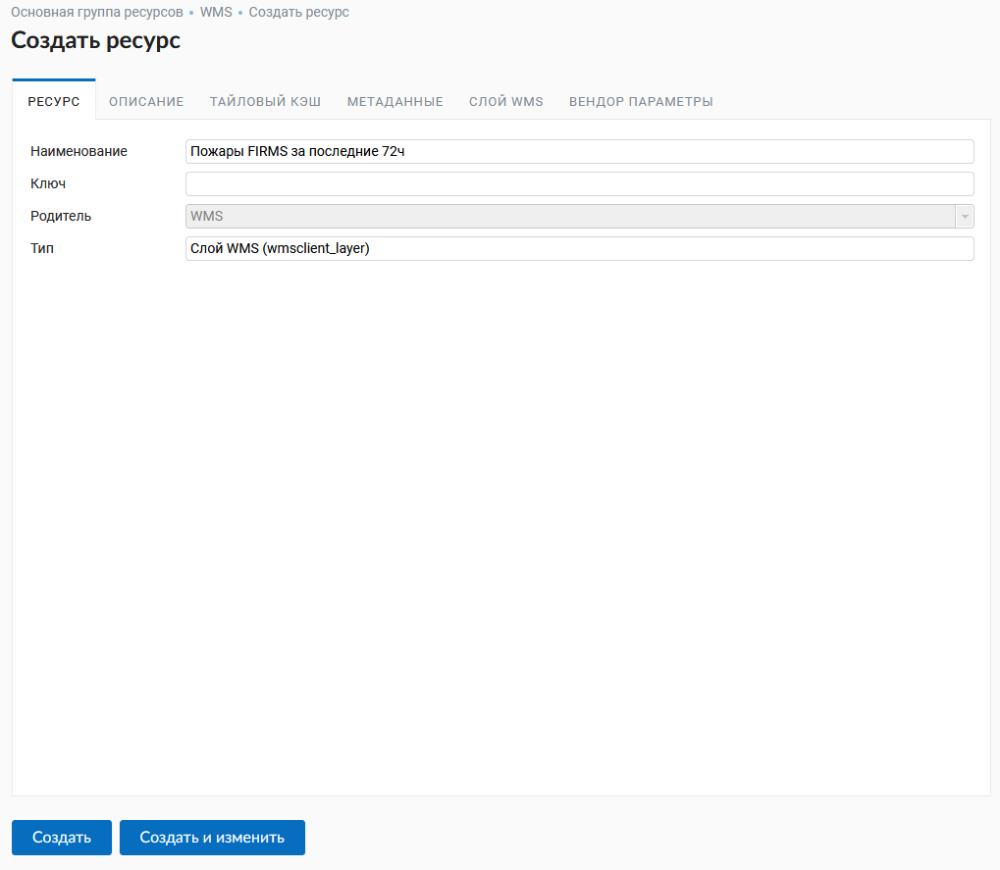
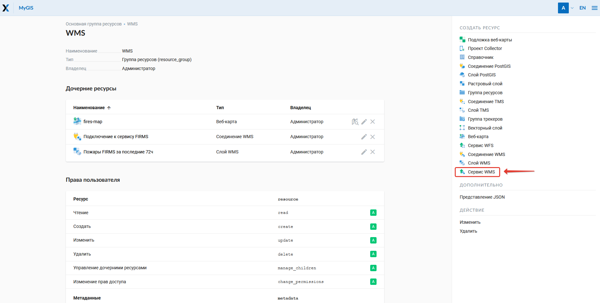
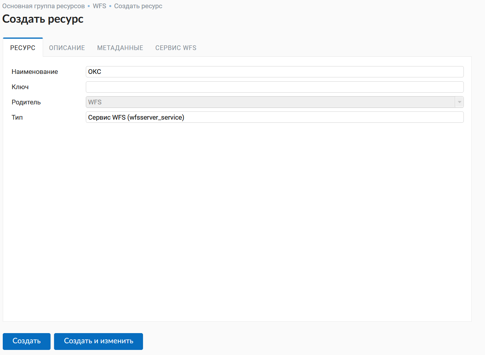

.. sectionauthor:: Артём Светлов <artem.svetlov@nextgis.ru>

.. _ngw_create_layers:

Добавление ресурсов
===================

Одним из основных компонентов ПО NextGIS Web является слой. Слой - это растровое 
изображение или векторный файл (таблица базы данных). Для объединения слоев в виде карты 
необходимо настроить стиль (или набор стилей) отображения слоя.

Стили могут настраиваться только для векторных слоев.

Интерфейс добавления PostGIS, векторных и растровых слоев приблизительно одинаковый. 
Нужно ввести параметры слоя, затем добавить стиль.

.. _ngw_create_raster_layer:

Растровый слой
--------------

Для добавления растрового слоя следует перейти в группу, где необходимо его создать, и в 
блоке операций "Создать ресурс" выбрать "Растровый слой" (см. :numref:`ngweb_admin_layers_create_raster_layer`). 

.. figure:: _static/admin_layers_create_raster_layer_rus.png
   :name: ngweb_admin_layers_create_raster_layer
   :align: center
   :width: 16cm

   Выбор действия "Растровый слой".

В результате этих действий откроется окно, представленное на :numref:`ngweb_admin_layers_create_raster_layer_resourse_description`. 

.. figure:: _static/admin_layers_create_raster_layer_resourse_description_rus.png
   :name: ngweb_admin_layers_create_raster_layer_resourse_description
   :align: center
   :width: 16cm

   Окно создания растрового слоя.

Далее следует ввести наименование слоя, которое будет отображаться в административном веб интерфейсе, 
а также в дереве слоев карт. Поле "Ключ" является необязательным к заполнению.

Можно добавить описание ресурса и метаданные на соответствующих вкладках. 

Если переключиться с вкладки "Ресурс" на вкладку "Растровый слой", откроется окно, представленное на :numref:`ngweb_admin_layers_create_raster_layer_upload`.

.. figure:: _static/admin_layers_create_raster_layer_upload_rus.png
   :name: ngweb_admin_layers_create_raster_layer_upload
   :align: center
   :width: 16cm

   Окно загрузки растрового файла.

Далее необходимо выбрать систему координат, в которую будет перепроецирован растр 
(по умолчанию имеется только WGS84 / Pseudo Mercator [EPSG:3857]) и указать сам файл. 

.. warning:: 
   Файл может быть только формата GeoTIFF с 3 или 4 каналами (RGB или RGBA).

После удачной загрузки растра необходимо создать стиль (если он не был создан автоматически). 
При создании карты (подробнее см. подразд. :ref:`ngw_map_create`) можно добавлять 
растр на карту, выбрав растр и его стиль.

Растровый слой с прозрачностью (обрезкой, альфа-каналом)
^^^^^^^^^^^^^^^^^^^^^^^^^^^^^^^^^^^^^^^^^^^^^^^^^^^^^^^^

Большинство утилит не создают канал прозрачности (А или альфа канал), а только добавляют значение NoData. 
Для преобразования значений NoData в альфа канал можно воспользоваться утилитой 
командной строки  :program:`gdalwarp`. Ниже приведен пример команды.

.. code-block:: shell

   gdalwarp -t_srs EPSG:3857 -multi -dstalpha -dstnodata none -wo \
   "UNIFIED_SRC_NODATA=YES" -co COMPRESS=JPEG \ 
   d:\temp\o\ast_20010730_010043_rgb.tif d:\temp\o\ast_20010730_010043_rgba.tif

.. tip:: 
   В NextGIS Manager эту операцию можно сделать проще. В программе есть функционал 
   загрузки растра в NextGIS Web и обрезки по альфа каналу. 

.. _ngw_create_vector_layer:

Векторный слой из файла
-----------------------

Для добавления векторного слоя следует перейти в группу, где необходимо его создать, и в блоке операций "Создать ресурс" выбрать из списка вкладку "Векторный слой" (см. :numref:`ngweb_admin_layers_create_vector_layer`). 

.. figure:: _static/admin_layers_create_vector_layer_rus.png
   :name: ngweb_admin_layers_create_vector_layer
   :align: center
   :width: 16cm

   Выбор действия "Векторный слой".
 
В результате этих действий откроется окно, представленное на :numref:`ngweb_admin_layers_create_vector_layer_resourse_description`. 

.. figure:: _static/admin_layers_create_vector_layer_resourse_description_rus.png
   :name: ngweb_admin_layers_create_vector_layer_resourse_description
   :align: center
   :width: 16cm

   Окно создания векторного слоя.
   
В открывшемся окне необходимо ввести наименование слоя, которое будет отображаться 
в административном веб интерфейсе, а также в дереве слоев карты. 
Поле "Ключ" является необязательным к заполнению. 

Можно добавить описание ресурса и метаданные на соответствующих вкладках. 

Если переключиться с вкладки "Ресурс" на вкладку "Векторный слой", откроется окно, представленное на :numref:`ngweb_admin_layers_create_vector_layer_upload`.

.. figure:: _static/admin_layers_create_vector_layer_upload_rus.png
   :name: ngweb_admin_layers_create_vector_layer_upload
   :align: center
   :width: 16cm

   Окно загрузки векторного файла.

Далее необходимо выбрать систему координат, в которую будет перепроецированы векторные
данные (по умолчанию имеется только WGS84 / Pseudo Mercator [EPSG:3857]), кодировку файла (UTF-8 или Windows-1251, также необходимо указать кодировку атрибутов: если она не указана, то данные в ESRI Shapefile должен сопровождать файл с 
описанием кодировки [расширение .cpg], в случае GeoJSON кодировка всегда должна быть UTF-8.) и указать сам исходный файл. 
В качестве исходного файла можно загружать следующие форматы: 

* :term:`ESRI Shapefile`
* :term:`GeoJSON`

.. note:: 
   В случае ESRI Shapefile все составляющие его части (dbf, shp, shx, prj и др.) должны быть 
   упакованы в архив формата Zip. 
   Шейп-файл должен быть в кодировке UTF-8 или Windows-1251.
  
.. tip:: 
   Если вы загружаете данные через административный интерфейс, не используйте для загрузки данные в 
   :abbr:`СК (системе координат)` EPSG:3857 (Web Mercator), используйте EPSG:4326 или другие СК 
   (EPSG:3857 указанная на вкладке "Векторный слой" это СК хранения данных, она не имеет отношения 
   к СК загружаемых данных).

.. warning:: 
   Мы рекомендуем не использовать кириллицу в названиях полей атрибутов. Несмотря на то, что в большинстве случаев такие данные могут быть загружены в Веб ГИС и показаны на картах, в некоторых случаях вы можете испытывать проблемы с работой с такими данными в NextGIS Mobile и визуализацией (особенно если условные обозначения сформированы на базе одного из таких полей). Переименуйте поля латиницей перед загрузкой и используйте синонимы полей (алиасы) для их отображения кириллицей на картах.

Во входном файле не должно быть невалидных геометрий (в :program:`NextGIS QGIS` соответствующий 
инструмент должен выдавать пустой список невалидных геометрий), даты не должны 
иметь значения NULL, не должно быть полей с названиями: *id (ID), geom(GEOM)*. Если загрузка выполнена с такими 
названиями полей, то после загрузки можно переименовать их через настройки слоя.

Для работы по протоколу :term:`WFS` названия атрибутов могут начинаться только с буквы или нижнего подчёркивания(_), в названии атрибутов допустимы только буквы, цифры, нижнее подчёркивание (_), тире (-) и точки(.).  

Если в файле имеются мультигеометрии, то тип поля геометрии должен быть мультигеометрией. 
Программы-клиенты в таком случае должны перед загрузкой преобразовывать тип поля. 
Вручную это можно сделать утилитой ogr2ogr

.. code-block:: shell

   ogr2ogr -nlt MULTIPOLYGON multipolygon_output.shp polygon_input.shp

Cистема координат геометрий должна распознаваться GDAL (вывод gdalinfo должен содержать описание СК). 

После удачной загрузки векторного файла необходимо создать стиль. 
Подробнее о создании стилей описано в подразделе :ref:`ngw_style_create`.

При создании карты (подробнее см. :ref:`ngw_map_create`) можно добавлять 
векторный слой на карту, указывая его стиль.

.. tip:: 
   В NextGIS Manager эту операцию можно сделать проще. В программе есть функционал
   загрузки в NextGIS Web векторных файлов разных форматов, без необходимости 
   отдельного архивирования. 

.. _ngw_create_postgis_layer:

Векторный слой из PostGIS
-------------------------

Для добавления векторного слоя из :abbr:`БД (база данных)` PostgreSQL с модулем расширения PostGIS необходимо 
сначала создать ресурс — соединение PostGIS (достаточно создать одно подключение). Для этого в блоке операций "Создать ресурс" следует выбрать "Cоединение PostGIS" (см. :numref:`admin_layers_create_postgis_connection_resourse`). 

   Выбор действия "Соединение PostGIS".
   
Откроется окно, представленное на :numref:`ngweb_admin_layers_create_postgis_connection_resourse_description`

   Окно добавления соединения PostGIS.

Далее необходимо ввести наименование подключения, которое будет отображаться в административном 
веб интерфейсе. Не путайте потом это название и название слоёв в базе данных. 

Поле "Ключ" является необязательным к заполнению.

Можно добавить описание ресурса и метаданные на соответствующих вкладках. 

Если переключиться с вкладки "Ресурс" на вкладку "Cоединение PostGIS", откроется окно, представленное на :numref:`ngweb_admin_layers_create_postgis_connection_db_logins`

   Окно параметров соединения PostGIS.

Здесь необходимо ввести параметры подключения к :abbr:`БД (база данных)` PostGIS, из которой 
будут отображаться ваши данные.  

Далее можно приступать к добавлению отдельных слоёв PostGIS. Для этого следует перейти в группу, 
где необходимо их создать, и в блоке операций "Создать ресурс" выбрать "Слой PostGIS" (см. :numref:`admin_layers_create_postgis_layer`). 

.. figure:: _static/admin_layers_create_postgis_layer_rus.png
   :name: admin_layers_create_postgis_layer
   :align: center
   :width: 16cm

   Выбор действия "Слой PostGIS".
   
Откроется окно, представленное на :numref:`ngweb_admin_layers_create_postgis_layer_resourse_description`

   Окно добавления слоя PostGIS.

Здесь необходимо ввести наименование слоя, которое будет отображаться в административном веб интерфейсе, 
а также в дереве слоев карты. 

Поле "Ключ" является необязательным к заполнению.

Можно добавить описание ресурса и метаданные на соответствующих вкладках. 

Если переключиться с вкладки "Ресурс" на вкладку "Слой PostGIS", откроется окно, представленное на :numref:`ngweb_admin_layers_create_postgis_layer_tablename`

.. figure:: _static/admin_layers_create_postgis_layer_tablename_rus.png
   :name: ngweb_admin_layers_create_postgis_layer_tablename
   :align: center
   :width: 16cm

   Окно параметров слоя PostGIS.

В данной вкладке необходимо выполнить следующие действия:

#. Из выпадающего списка выбрать подключение к :abbr:`БД (база данных)` (cоздание подключения описано в этом же пункте, чуть выше).
#. Ввести схему :abbr:`БД (база данных)`, в которой находится слой PostGIS. 
	В одной базе данных PostgreSQL может быть несколько схем, внутри каждой схемы лежат таблицы и представления. Если схема одна, то она называется public. Подробнее смотрите в руководствах по :program:`СУБД PostgreSQL`.
#. Ввести название таблицы (слоя PostGIS). 
	Вам потребуется знать названия ваших таблиц и полей в базе данных. 
	Отображение таблиц и представлений не входит в задачи NextGIS Web. Для просмотра можно воспользоваться :program:`NextGIS QGIS` или :program:`PgAdmin`.
#. Ввести "Поле ID". 
	При загрузке данных в PostGIS через NextGIS QGIS обычно создается поле с названием ogc_fid, при загрузке иным способом название поля может отличаться.
	Поле ID должно удовлетворять ограничениям на тип данных: быть числовым (**numeric**) и являться первичным ключом.
#. Ввести "Поле геометрии" (при загрузке данных в PostGIS через :program:`NextGIS QGIS`  обычно создается поле геометрии с названием wkb_geometry, при загрузке иным способом название поля может отличаться).
#. Поля "Тип геометрии", "Система координат", "Описание атрибутов" и "SRID" являются не обязательными, и их значения могут быть оставлены по умолчанию.

Программное обеспечение NextGIS Web поддерживает добавление таблиц, в которых в 
поле геометрии хранятся совместно точечные, линейные и полигональные геометрии. 
Это необходимо для отображения специфических наборов данных: например, если в одной 
таблице хранятся координаты городских парков в виде полигонов и мусорных урн в виде 
точек. В этом случае в NextGIS Web нужно добавить три отдельных слоя для каждого 
типа геометрии, и выбрать нужный элемент в поле "Тип геометрии".

После создания слоя для отображения подписей к геометриям необходимо задать атрибут 
наименования. Для этого следует зайти на страницу редактирования слоя и выбрать нужное поле 
в списке "Атрибут наименования".

Если в :abbr:`БД (база данных)` были изменены какие либо данные, касающиеся структуры (названия или типы полей, 
изменен их состав, переименованы таблицы и т. п.), то в свойствах соответствующего 
слоя необходимо обновить описания атрибутов. Для этого, для выбранного слоя следует 
выбрать действие "Изменить", на вкладке "Слой PostGIS" в поле "Описания атрибутов" выбрать "Загрузить" из базы данных и нажать "Сохранить".

Возможные проблемы со слоями PostGIS
^^^^^^^^^^^^^^^^^^^^^^^^^^^^^^^^^^^^

Вы создали подключение и пытаетесь создать на его основе слой PostGIS. 

Если вы получаете ошибку:

1. Невозможно подключиться к базе данных!

Проверьте, доступна ли база данных к которой вы подключаетесь, правильная ли у вас учетная запись. Это удобно делать через pgAdmin или QGIS.

Имейте в виду, что база может быть временно отключена или изменились параметры доступа.

Создание слоя с условиями
^^^^^^^^^^^^^^^^^^^^^^^^^

В :program:`NextGIS Web` нельзя указывать условия отбора записей из слоя (SQL конструкция WHERE). 
Это делается для обеспечения безопасности (исключения атак SQL Injection). Для обеспечения 
такой возможности необходимо в БД создать представления с соответствующими условиями отбора.

Для этого необходимо подключится к :abbr:`БД (база данных)` PostgreSQL/PostGIS при помощи :program:`pgAdminIII`, 
перейти в схему данных, где следует создать представление и в элементе дерева "Представления" 
правой клавишей мыши вызвать контекстное меню и выбрать "Создать новое представление" (см. :numref:`ngweb_pgadmin3`. п. 1). 
Также диалог можно вызвать правым кликом на названии схемы, выбрав "Новый объект" и далее "Новое представление".
Далее в открывшемся диалоге необходимо указать:

#. Название представления (вкладка "Свойства").
#. Схему данных, в которой необходимо создать представление (вкладка "Свойства").
#. Необходимый SQL запрос (вкладка "Определение").

.. figure:: _static/pgadmin3_rus.png
   :name: ngweb_pgadmin3
   :align: center
   :width: 16cm

   Главное окно ПО :program:`pgAdminIII`.

   Цифрами на рисунка обозначено: 1 – дерево элементов базы данных; 2 – кнопка 
   открытия таблицы (активна при выделенной таблице); 3 – содержимое запроса в 
   представлении.

После этого, не выходя из :program:`pgAdminIII`, можно открыть представление для 
проверки корректности введенного SQL запроса (см. :numref:`ngweb_pgadmin3`. п. 2). 

.. _ngw_create_wms_layer:

Cлой WMS
--------

Программное обеспечение NextGIS Web является клиентом :term:`WMS`. Для подключения слоя WMS 
необходимо знать его адрес. Сервер WMS, предоставляющий подключаемый слой, должен 
отдавать его в том числе в системе координат EPSG:3857. Проверить наличие этой системы 
координат для подключаемого слоя можно, сделав запрос ``GetCapabilites`` к серверу и 
посмотрев результат. Например, слой WMS, предоставляемый Geofabrik (GetCapabilities), 
умеет отдавать данные в EPSG:4326 и EPSG:900913. Хотя фактически EPSG:900913 и EPSG:3857 - это одно и то же, 
но NextGIS WEB запрашивает данные в 3857, а этот сервер WMS такую проекцию не поддерживает.

Для добавления слоя WMS необходимо сначала создать ресурс — соединение WMS (достаточно создать одно подключение для множества слоёв). Для того, чтобы сделать это, следует в блоке операций "Создать ресурс" выбрать "Cоединение WMS" (см. :numref:`admin_layers_create_wms_connection`). 

.. figure:: _static/admin_layers_create_wms_connection_rus.png
   :name: admin_layers_create_wms_connection
   :align: center
   :width: 16cm

   Выбор действия "Cоединение WMS".
   
Откроется окно, представленное на :numref:`ngweb_admin_layers_create_wms_connection_description`.

.. figure:: _static/admin_layers_create_wms_connection_description_rus.png
   :name: ngweb_admin_layers_create_wms_connection_description
   :align: center
   :width: 16cm

   Окно добавления подключения WMS.

Далее необходимо ввести наименование подключения, которое будет отображаться в административном 
веб интерфейсе. Не путайте потом это название с названием отдельных слоёв. 

Поле "Ключ" является необязательным к заполнению.

Можно добавить описание ресурса и метаданные на соответствующих вкладках. 

Если переключиться с вкладки "Ресурс" на вкладку "Cоединение WMS", откроется окно, представленное на :numref:`ngweb_admin_layers_create_wms_connection_url`.

.. figure:: _static/admin_layers_create_wms_connection_url_rus.png
   :name: ngweb_admin_layers_create_wms_connection_url
   :align: center
   :width: 16cm

   Окно параметров соединения WMS.

Здесь необходимо ввести параметры подключения к WMS-серверу, из которого будут 
отображаться ваши данные. 

Далее можно приступать к добавлению отдельных слоёв WMS. Для этого следует перейти в группу, где необходимо создать слой WMS и в блоке операций "Создать ресурс" выбрать "Слой WMS" (см. :numref:`admin_layers_create_wms_layer`). 

.. figure:: _static/admin_layers_create_wms_layer_rus.png
   :name: admin_layers_create_wms_layer
   :align: center
   :width: 16cm

   Выбор действия "Слой WMS". 
   
Откроется окно, представленное на :numref:`ngweb_admin_layers_create_wms_layer_name`.

   Окно параметров слоя WMS.

Здесь необходимо ввести наименование слоя, которое будет отображаться в административном веб интерфейсе, 
а также в дереве слоев карты. 

Поле "Ключ" является необязательным к заполнению.

Можно добавить описание ресурса и метаданные на соответствующих вкладках. 

Если переключиться с вкладки "Ресурс" на вкладку "Cлой WMS", откроется окно, представленное на :numref:`ngweb_admin_layers_create_wms_layer_parameters`.

   Окно настройки параметров слоя WMS.

В данной вкладке необходимо выполнить следующие действия:

1. Выбрать подключение WMS, которое было создано ранее.
2. Выбрать систему координат, в которой следует запрашивать данные у сервера WMS 
   (по умолчанию имеется только WGS84 / Pseudo Mercator [EPSG:3857]).
3. Если параметры подключения указаны верно, то в поле "Формат" выведется 
   список MIME-типов данных, предоставляемых сервером. Следует выбрать подходящий формат.
4. Если параметры подключения указаны верно, то в поле "WMS-слои" выведется 
   список слоёв, предоставляемых сервером. Следует выбрать те слои, которые нужны, нажимая 
   по подчёркнутым названиям. Можно выбрать несколько слоёв.

.. note::
   Параметры для добавления слоя WMS с ПКК (публичной кадастровой карты Росреестра РФ)
   
   URL http://pkk5.rosreestr.ru/arcgis/services/Cadastre/CadastreWMS/MapServer/WMSServer

Поддерживаемые версии протокола WMS: 1.3.0

.. warning:: 
   Идентификационные запросы к внешним WMS сервисам с Веб карт не поддерживаются. 

.. _ngw_create_wms_service:

Сервис WMS
----------

Программное обеспечение NextGIS Web может работать как сервер WMS. По этому протоколу 
клиенты запрашивают картинку карты по заданному охвату. 

Для развёртывания WMS-сервиса необходимо добавить ресурс. Для этого в блоке операций "Создать ресурс" следует выбрать "WMS-сервис" (см. :numref:`admin_layers_create_wms_service`). 

   Выбор действия "Сервис WMS".
   
Откроется окно, представленное на :numref:`ngweb_admin_layers_create_wms_service_name`. 

   Окно параметров сервиса WMS.

Здесь необходимо ввести наименование слоя, которое будет отображаться в административном веб интерфейсе, 
а также в дереве слоев карты.

Поле "Ключ" является необязательным к заполнению.

Можно добавить описание ресурса и метаданные на соответствующих вкладках. 

Если переключиться с вкладки "Ресурс" на вкладку "Сервис WMS", откроется окно, представленное на :numref:`ngweb_admin_layers_create_wms_service_url`. Здесь следует добавить в список ссылки на стили нужных слоёв. Для каждого 
добавленого стиля нужно указать уникальный ключ, который можно скопировать из названия.

.. figure:: _static/admin_layers_create_wms_service_url_rus.png
   :name: ngweb_admin_layers_create_wms_service_url
   :align: center
   :width: 16cm

   Окно параметров соединения WMS.

После создания ресурса выведется сообщение с URL WMS-сервиса, который можно 
использовать в других программах, например :program:`NextGIS QGIS`, или :program:`JOSM`. 
Далее необходимо настроить права доступа к WMS-сервису (см. :ref:`ngw_access_rights`).

Cлой NextGIS Web можно добавлять в настольные, мобильные и Веб ГИС несколькими способами.

Подключение к WMS
^^^^^^^^^^^^^^^^^^^^^^^^^

NextGIS Web является сервером WMS. Соответственно подключить его слои как WMS можно 
в любом клиентском ПО, поддерживающем слои WMS. Для этого нужно знать URL WMS-сервиса, 
который высвечивается на странице его настроек. 

Например:

.. code-block:: html

   http://demo.nextgis.ru/resource/60/wms?

Подключение к WMS в GDAL
^^^^^^^^^^^^^^^^^^^^^^^^^^^^^^^^^^^^^^^^^^^^^^^^^^

Конкретные слои NextGIS Web можно подключать как WMS. Для использования их через 
утилиты GDAL нужно создать для необходимого слоя файл XML. Для создания такого файла нужно знать
URL WMS-сервиса. Эти параметры нужно подставить в строку ServerUrl примера ниже. Все остальное 
остается неизменным.

.. code-block:: xml

   <GDAL_WMS>
    <Service name="WMS">
        <Version>1.1.1</Version>
        <ServerUrl>http://demo.nextgis.com/practice2/api/resource/15/wms?</ServerUrl>
        <SRS>EPSG:3857</SRS>
        <ImageFormat>image/png</ImageFormat>
        <Layers>moscow_boundary_multipolygon</Layers>
        <Styles></Styles>
    </Service>
    <DataWindow>
      <UpperLeftX>-20037508.34</UpperLeftX>
      <UpperLeftY>20037508.34</UpperLeftY>
      <LowerRightX>20037508.34</LowerRightX>
      <LowerRightY>-20037508.34</LowerRightY>
      <SizeY>40075016</SizeY>
      <SizeX>40075016.857</SizeX>
    </DataWindow>
    <Projection>EPSG:3857</Projection>
    <BandsCount>3</BandsCount>
   </GDAL_WMS>

Если нужна картинка с альфа каналом, следует указать ``<BandsCount>4</BandsCount>``.

Пример вызова утилиты gdal. Она получает картинку из NextGIS WEB по WMS, и сохраняет её в GeoTIFF

.. code-block:: shell

   gdal_translate -of "GTIFF" -outsize 1000 0  -projwin  4143247 7497160 4190083 7468902   ngw.xml test.tiff

.. _ngw_create_tms_service:

Подключение к TMS в GDAL
^^^^^^^^^^^^^^^^^^^^^^^^^^^^^^^^^^^^^^^^^^^^^^^^^^

Конкретные слои NextGIS Web можно подключать как TMS. Для этого нужно создать для 
необходимого слоя файл XML. Для создания такого файла нужно знать адрес, где развернут 
NextGIS WEB, и номер нужного слоя (в примере: адрес - http://demo.nextgis.com/ngw_kl, номер слоя - 5). 
Эти параметры нужно подставить в строку ServerUrl примера ниже. Все остальное 
остается неизменным.

.. code-block:: xml

   <GDAL_WMS>
    <Service name="TMS">
        <ServerUrl>http://demo.nextgis.com/api/component/render/tile?z=${z}&x=${x}&y=${y}&resource=5</ServerUrl>
    </Service>
    <DataWindow>
        <UpperLeftX>-20037508.34</UpperLeftX>
        <UpperLeftY>20037508.34</UpperLeftY>
        <LowerRightX>20037508.34</LowerRightX>
        <LowerRightY>-20037508.34</LowerRightY>
        <TileLevel>18</TileLevel>
        <TileCountX>1</TileCountX>
        <TileCountY>1</TileCountY>
        <YOrigin>top</YOrigin>
    </DataWindow>
    <Projection>EPSG:3857</Projection>
    <BlockSizeX>256</BlockSizeX>
    <BlockSizeY>256</BlockSizeY>
    <BandsCount>4</BandsCount>
    <Cache />
   </GDAL_WMS> 

.. _ngw_wfs_service:

Cервис WFS
----------

Настройка сервиса WFS осуществляется так же, как для WMS-сервиса, только добавляется 
не стиль, а слой.

NextGIS Web может работать как сервер WFS. По этому протоколу сторонние программы 
могут изменять векторные данные на сервере.

Для развёртывания сервиса WFS необходимо добавить ресурс. Для этого в блоке операций "Создать ресурс" следует выбрать "WFS-сервис" (см. :numref:`admin_layers_create_wfs_service`). 

   Выбор действия "Сервис WFS".
   
Откроется окно, представленное на :numref:`ngweb_admin_layers_create_wfs_service_name`. 

   Окно параметров сервиса WFS.
  
Здесь необходимо ввести наименование слоя, которое будет отображаться в административном веб интерфейсе, 
а также в дереве слоев карты.

Поле "Ключ" является необязательным к заполнению.

Можно добавить описание ресурса и метаданные на соответствующих вкладках. 

Если переключиться с вкладки "Ресурс" на вкладку "Сервис WFS", откроется окно, представленное на :numref:`ngweb_admin_layers_create_wfs_service_url`. Здесь следует добавить в список ссылки на стили нужных слоёв. Для каждого 
добавленого стиля нужно указать уникальный ключ, который можно скопировать из названия.

.. figure:: _static/admin_layers_create_wfs_service_url_rus.png
   :name: ngweb_admin_layers_create_wfs_service_url
   :align: center
   :width: 16cm

   Окно параметров соединения WFS.

Для каждого слоя так же можно задать ограничение на количество передаваемых объектов за один раз. 
По умолчанию это значение равно 1000. Если в этом поле значение убрать совсем, то 
ограничение будет снято и будут передаваться все объекты. Однако, это может привести 
к значительной нагрузке на сервер и значительным задержкам при передаче больших объемов данных.

После создания ресурса вам нужно перезайти в этот ресурс в административном веб интерфейсе. После этого выведется сообщение с URL WFS-сервиса, который вы можете использовать в других программах, например :program:`NextGIS QGIS`. 

Далее необходимо настроить права доступа к WFS-сервису (см. главу :ref:`ngw_access_rights`).

.. _ngw_resourses_group:

Создание группы ресурсов
------------------------

Ресурсы можно объединять в группы. Например, в одну группу можно сложить базовые данные, 
в другую группу –  космические снимки, в третью – тематические данные и т.д.

Группы служат для удобной организации слоев в панели управления, а также для удобного 
назначения прав доступа. 

Для создания группы ресурсов необходимо перейти в ту группу (корневая или др.), где будет создана новая группа ресурсов, и 
в блоке операций "Создать ресурс" выбрать "Группа ресурсов" (см. :numref:`admin_layers_create_resource_group`). 

.. figure:: _static/admin_layers_create_resource_group_rus.png
   :name: admin_layers_create_resource_group
   :align: center
   :width: 16cm

   Выбор действия "Группа ресурсов".
   
При этом откроется окно, представленное на :numref:`ngweb_admin_layers_create_group`.

.. figure:: _static/admin_layers_create_group_rus.png
   :name: ngweb_admin_layers_create_group
   :align: center
   :width: 16cm

   Окно создания группы ресурсов.

В открывшемся окне необходимо указать название группы, которое будет отображаться в административном веб интерфейсе, 
а также в дереве слоев карты, и нажать кнопку "Создать".

Поле "Ключ" является необязательным к заполнению.

Можно добавить описание ресурса и метаданные на соответствующих вкладках. 

.. _ngw_create_lookup_table:

Cправочники
----------------------------

Для создания справочника необходимо перейти в ту группу ресурсов (корневая или др.), где будет создана справочник, и 
в блоке операций "Создать ресурс" выбрать "Справочник" (см. :numref:`admin_layers_create_lookup_table`). 

.. figure:: _static/admin_layers_create_lookup_table_rus.png
   :name: admin_layers_create_lookup_table
   :align: center
   :width: 16cm

   Выбор действия "Справочник".
   
При этом откроется окно, представленное на :numref:`ngweb_admin_layers_create_lookup`.

.. figure:: _static/ngweb_admin_layers_create_lookup_rus.png
   :name: ngweb_admin_layers_create_lookup
   :align: center
   :width: 16cm

   Окно создания справочника.

В открывшемся окне необходимо указать название справочника.

Поле "Ключ" является необязательным к заполнению.

Можно добавить описание ресурса и метаданные на соответствующих вкладках.

Если переключиться с вкладки "Ресурс" на вкладку "Справочник", откроется окно, представленное на  :numref:`ngweb_creating_a_new_directory_group`. 

.. figure:: _static/ngweb_creating_a_new_directory.png
   :name: ngweb_creating_a_new_directory_group
   :align: center
   :width: 16cm

   Окно параметров справочника.
   
Откроется окно в виде таблицы с кнопками "Добавить" и "Удалить". При нажатии на кнопку "Добавить" выпадает вкладка "Text", 
которая предоставляет возможность ввести данные справочника в виде "ключ" - "значение". 
После ввода необходимых данных, следует нажать на кнопку "Сохранить". 
Окно примет вид :numref:`ngweb_new_resource_group`.

.. figure:: _static/ngweb_new_resource.png
   :name: ngweb_new_resource_group
   :align: center
   :width: 16cm

   Создание нового ресурса.

Для внесения изменений в справочник следует в панели операций "Действие" выбрать 
"Изменить", после чего откроется окно для редактирования данных ресурса.
В окне необходимо перейти на вкладку "Справочник" на которой можно изменить состав значений 
справочника:

* добавить новую пару ключ - значение
* изменить текущую пару ключ - значение
* удалить пару ключ - значение

Типовая структура
-----------------

С учетом опыта использования NextGIS Web рекомендуется следующая типовая структура 
организации ресурсов.

Типовая структура ::

  Основная группа ресурсов
	Веб-карты
		Основная веб-карта
		Тестовая веб-карта
	Подключения PostGIS
		PostGIS на сервере
	Слои данных
		Базовые данные
			Границы объектов
			Инфраструктура - линейные объекты
			Учётные площадки
		Тематические данные
			Результаты замеров на учётных площадках
			Результаты замеров на учётных маршрутах
			Точки встреч редких видов
		Рельеф
			ASTER DEM
				ЦМР
				Изолинии
		Топографические данные
			Openstreetmap
				Автодороги
				Административные границы
				Гидросеть
				Железнодорожные станции
				Железные дороги
				Землепользование
			1 : 100000
				M-37-015
				M-37-016
				M-37-017
		Съёмка
			Landsat-8
			Ikonos
