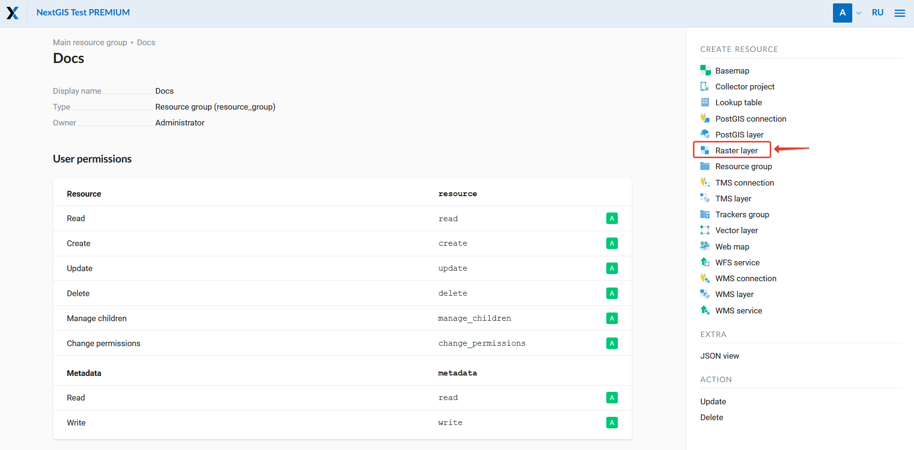

.. sectionauthor:: Artem Svetlov <artem.svetlov@nextgis.ru>

.. _ngw_create_layers:

Adding resources
================

Layer is one of the main components of NextGIS Web software. Layer is a raster image or a vector file (table from database). To join layers on a map you need to set a style (or style set) to display a layer.

Styles may be set only for vector layers.

Interface for adding of PostGIS layers, vector and raster layers is practically the same. 
Firstly you provide layer parameters and then add a style.

.. _ngw_create_raster_layer:

Raster layer
------------

To add a raster layer navigate to a group where you want to create it. In 
actions pane "Create resource" click "Raster layer" (see :numref:`ngweb_admin_layers_create_raster_layer`). 

   Selection of "Raster layer" action.
   
Create resource dialog for raster layer will open and will look like 
:numref:`admin_layers_create_raster_layer_resourse_description`. 

.. figure:: _static/admin_layers_create_raster_layer_resourse_description_eng.png
   :name: admin_layers_create_raster_layer_resourse_description
   :align: center
   :width: 16cm

   Create resource dialog for raster layer.

Enter display name that will be visible in administrator interface and in map 
layer tree. 

Field "Keyname" is optional.

You can also add resource description and metadata on the corresponding tabs. 

Switch from "Resource" tab to "Raster layer" tab, which is presented on :numref:`admin_layers_create_raster_layer_upload`.

.. figure:: _static/admin_layers_create_raster_layer_upload_eng.png
   :name: admin_layers_create_raster_layer_upload
   :align: center
   :width: 16cm

   Raster layer tab with button for upload of raster file.

Here specify a coordinate system the raster will be reprojected to (by default there is only WGS84 / Pseudo Mercator (EPSG:3857)) and select a file. 

.. note:: 
   The file should be in GeoTIFF format with 3 or 4 bands (RGB or RGBA). 
 
After a file is successfully uploaded you need to create a style (if it was not 
create automatically). When creating a map (for more information see subsection :ref:`ngw_map_create`) you can add a raster to a map by selecting a raster and its style.

Raster layer with transparency (clip or alpha channel)
^^^^^^^^^^^^^^^^^^^^^^^^^^^^^^^^^^^^^^^^^^^^^^^^^^^^^^^^

Most of utilities does not create alpha channel and only add a NoData value. 
To transform NoData value to alpha channel use a command line utility 
:program:`gdalwarp`. Here is an example of this command.

.. code:: shell

   gdalwarp -t_srs EPSG:3857 -multi -dstalpha -dstnodata none -wo \
   "UNIFIED_SRC_NODATA=YES" -co COMPRESS=JPEG \ 
   d:\temp\o\ast_20010730_010043_rgb.tif d:\temp\o\ast_20010730_010043_rgba.tif

.. tip:: 
   NextGIS Manager simplifies this process. Software has an option to  
   upload a raster to NextGIS Web and cut using alpha channel. 

.. _ngw_create_vector_layer:

Vector layer from file
-----------------------
To add a vector layer navigate to a group where you want to create it. In 
actions pane "Create resource" click "Vector layer" (see :numref:`ngweb_admin_layers_create_vector_layer`). 

.. figure:: _static/admin_layers_create_vector_layer_eng.png
   :name: ngweb_admin_layers_create_vector_layer
   :align: center
   :width: 16cm

   Selection of "Vector layer" action.
   
Create resource dialog for vector layer will open and will look like :numref:`admin_layers_create_vector_layer_resourse_description`. 

.. figure:: _static/admin_layers_create_vector_layer_resourse_description_eng.png
   :name: admin_layers_create_vector_layer_resourse_description
   :align: center
   :width: 16cm

   Create resource dialog for vector layer.
   
Enter display name that will be visible in administrator interface and in map 
layer tree. 

Field "Keyname" is optional.

You can also add resource description and metadata on the corresponding tabs. 

Switch from "Resource" tab to "Vector layer tab", which is presented on :numref:`admin_layers_create_vector_layer_upload`.

.. figure:: _static/admin_layers_create_vector_layer_upload_eng.png
   :name: admin_layers_create_vector_layer_upload
   :align: center
   :width: 16cm

   Vector layer tab with button for upload of vector file.

Here specify a coordinate system the vector data will be reprojected 
to (by default there is only WGS84 / Pseudo Mercator (EPSG:3857)), encoding type (UTF-8 or 
   Windows-1251; also you need to specify encoding that is used for attributes: if encoding is not set ESRI Shapefile should have a file with encoding description (.cpg extension), in case of GeoJSON encoding is always UTF-8) and select source file.  
Source files could be in the following formats: 

* ESRI Shapefile
* GeoJSON

.. note:: 
   In case of ESRI Shapefile all components (dbf, shp, shx, prj and other files) 
   should be compressed to a zip-archive. Shapefile should have UTF-8 or 
   Windows-1251 encoding.
  
.. warning:: 
   If you upload data through web-interface, do not use EPSG:3857. 
   Use EPSG:4326 or other coordinate systems (EPSG:3857 mentioned on Vector layer 
   tab is a storage CRS not related to data CRS).
   
Output file should not have invalid geometries (QGIS tool should output an empty 
list of invalid geometries), dates should not have NULL values, there should not 
be attribute names: *id (ID), geom(GEOM)*.

Special restriction for WFS protocol: attribute names should begin only with letter or (_), next allowed sybmols in name is letters, digits, (-), (_), (.).

In case there are multigeometries in the file, field type of the geometry should be multigeometry. In this case program-clients should convert field type before uploading. You can do it manually with ogr2ogr utility

.. code-block:: shell

   ogr2ogr -nlt MULTIPOLYGON multipolygon_output.shp polygon_input.shp
   
Coordinate system should be recognized by GDAL (output of gdalinfo should contain 
coordinate system definition). 

After a file is successfully uploaded you need to create a style. 
For more information about creation of styles see subsection  :ref:`ngw_style_create`.

When creating a map (for more information see  subsection. :ref:`ngw_map_create`) 
you can add a vector layer to a map by selecting its style.

.. tip:: 
   NextGIS Manager simplifies this process. Software has an option to 
   upload of vector files in different formats to NextGIS Web without  
   separate archiving. 

.. _ngw_create_postgis_layer:

Vector layer from PostGIS
-------------------------

To add a vector layer from database PostgreSQL with PostGIS extension you need to create a
resource PostGIS connection. It is enough to create one connection. 
In actions pane "Create resource" click "PostGIS connection" (see :numref:`admin_layers_create_postgis_connection_resourse`). 

.. figure:: _static/admin_layers_create_postgis_connection_resourse_eng.png
   :name: admin_layers_create_postgis_connection_resourse
   :align: center
   :width: 16cm

   Selection of "PostGIS connection" action.
 
Create PostGIS connection dialog is shown on :numref:`admin_layers_create_postgis_connection_resourse_description`

.. figure:: _static/admin_layers_create_postgis_connection_resourse_description_eng.png
   :name: admin_layers_create_postgis_connection_resourse_description
   :align: center
   :alt: map to buried treasure
   :width: 16cm

   Create resource dialog for PostGIS connection.

Enter display name that will be visible in administrator interface. Do not 
confuse this name with a name of layers in a database. 

Field "Keyname" is optional.

You can also add resource description and metadata on the corresponding tabs.

Switch from "Resource" to "PostGIS connection" tab, which is presented on :numref:`admin_layers_create_postgis_connection_db_logins`. 

.. figure:: _static/admin_layers_create_postgis_connection_db_logins_eng.png
   :name: admin_layers_create_postgis_connection_db_logins
   :align: center
   :width: 16cm

   PostGIS connection tab of Create resource dialog.

Here enter PostGIS database connection parameters to connect data for display.  

Then you can add single PostGIS layers. Navigate to a group where you want create 
layers and in actions pane "Create resource" select "PostGIS layer" (see :numref:`admin_layers_create_postgis_layer`).

.. figure:: _static/admin_layers_create_postgis_layer_eng.png
   :name: admin_layers_create_postgis_layer
   :align: center
   :width: 16cm

   Selection of "PostGIS layer" action.
   
Create resource dialog for PostGIS layer is presented on :numref:`admin_layers_create_postgis_layer_resourse_description`

.. figure:: _static/admin_layers_create_postgis_layer_resourse_description_eng.png
   :name: admin_layers_create_postgis_layer_resourse_description
   :align: center
   :width: 16cm

   Create resource dialog for PostGIS layer.

Enter display name that will be visible in administrator interface and in map 
layer tree. 

Field "Keyname" is optional.

You can also add resource description and metadata on the corresponding tabs.

Switch from "Resource" tab to "PostGIS layer" tab, which is presented on 
:numref:`admin_layers_create_postgis_layer_tablename`. 

.. figure:: _static/admin_layers_create_postgis_layer_tablename_eng.png
   :name: admin_layers_create_postgis_layer_tablename
   :align: center
   :width: 16cm

   PostGIS layer tab of create resource dialog.

Then perform the following steps:

#. From a dropdown list select a database connection (creation of a connection is described above).
#. Enter a schema of a database where layer data is stored. 
   Single database can store multiple schemas. Each schema contains tables and views. If there is only one schema its called public. For more information see :program:`PostgreSQL DBMS` manual.
#. Enter Table name (PostGIS layer). 
   You need to know names of tables and columns in your database. 
   Display of tables and views is not a feature of NextGIS Web. To view them you can use: `NextGIS QGIS` or :program:`PgAdmin` software.
#. Enter "ID column". 
   When data is loaded into PostGIS using :program: NextGIS QGIS 
   software an ogc_fid column is created. If data was loaded in another way the 
   name of column may be different.
   An ID column should follow rules for data type: the value type should be a 
   number (**numeric**) and it should be a primary key.
#. Enter "Geometry column" name (if data was loaded to PostGIS using  
   :program:`NextGIS QGIS` software usually a geometry column called 
   wkb_geometry is created. If data is loaded in another way the name of column 
   may be different).
#. Parameters "Geometry type", "Coordinate system",
   "Attribute definitions" and "SRID" are not required so you can use default 
   values.

NextGIS Web software supports adding of tables with point, line and polygon geometries stored in a single geometry column. 
This is required for some specific datasets: e.g. if one table stores coordinates for parks as polygons and trash cans as points in a single table. In this case in NextGIS Web you need to add three different layers for each type of geometry and select appropriate geometry type in "Geometry type" parameter.

After layer is created you need to set a label attribute to display labels. Navigate to layer edit dialog and set a checkbox for the required field in "Label attribute" column.

If structure of a database has changed (column names, column types, number of columns, table names etc.) you need to update attribute definitions in layer properties. To perform changes select in actions pane :"Update" and then on "PostGIS layer" tab change "Attribute definitions" to "Reload" and click "Save".

PostGIS layer troubleshooting
^^^^^^^^^^^^^^^^^^^^^^^^^^^^^

You created a connection and trying to create a PostGIS layer based on it and getting errors. 

If you get:

1. Cannot connect to the database!

Check if the database is available, is it up, do you have right credentials? You can all these using pgAdmin or QGIS.

Note that databases go up and down and credentials change.

Create layers with conditions
^^^^^^^^^^^^^^^^^^^^^^^^^^^^^^

In :program:`NextGIS Web` you can not define queries using a WHERE SQL expression. 
This provides additional security (prevention of SQL Injection attack). To 
provide query capability you need to create views with appropriate queries.

To do this connect to PostgreSQL/PostGIS database using :program:`pgAdminIII`, 
then navigate to data schema where you want to create a view, right click tree 
item "Views" and select "New view" (see item 1 in :numref:`pgadmin3`). Also you can right click on schema name and select "New object" and then "New view". Enter the following information to create new view dialog:

#. View name («Properties» tab).
#. Data schema where to create a view («Properties» tab).
#. SQL query («Definition» tab).

.. figure:: _static/pgadmin3_eng.png
   :name: pgadmin3
   :align: center
   :width: 16cm

   Main dialog of :program:`pgAdminIII` software.

   The numbers indicate: 1. – Database items tree; 2 – a button for  
   table open (is active if a table is selected in tree); 3 – SQL query for  
   view.

After that you can display a view to check if query is correct without closing :program:`pgAdminIII` (see  item 2 in :numref:`pgadmin3`). 

.. _ngw_create_wms_layer:

WMS layer
---------

NextGIS Web is a WMS client. To connect a WMS layer you need to know its address. WMS server should be able to serve it using a coordinate system EPSG:3857. You can check for this coordinate system presence by making a GetCapabilites request to a server and examining the response. For example a WMS layer provided by Geofabrik (GetCapabilities), responds in EPSG:4326 and EPSG:900913. While EPSG:900913 and EPSG:3857 are technically the same, NGW requests data in 3857 and server does not support for that coordinate system.

To add WMS layer you need to create a resource called WMS connection. You may create a single connection for many layers.
In actions pane "Create resource" click "WMS connection" (see :numref:`admin_layers_create_wms_connection`). 

.. figure:: _static/admin_layers_create_wms_connection_eng.png
   :name: admin_layers_create_wms_connection
   :align: center
   :width: 16cm

   Selection of "WMS connection" action.
   
Create resource dialog for WMS connection is presented on :numref:`admin_layers_create_wms_connection_description`.

   Create resource dialog for WMS connection.

Enter display name that will be visible in administrator interface. Do not 
confuse this name with a name of layers in a database. 

Field "Keyname" is optional.

You can also add resource description and metadata on the corresponding tabs.
 
Switch from "Resource" tab to "WMS connection" tab, which is presented on :numref:`admin_layers_create_wms_connection_url`.

.. figure:: _static/admin_layers_create_wms_connection_url_eng.png
   :name: admin_layers_create_wms_connection_url
   :align: center
   :width: 16cm

   WMS connection tab of Create resource dialog.

Here enter  WMS server connection parameters from which you want to display data. 

Then you can add single WMS layers. Navigate to a group where you want create 
WMS layers and in actions pane "Create resource" select "WMS layer" (see :numref:`admin_layers_create_wms_layer`). 

.. figure:: _static/admin_layers_create_wms_layer_eng.png
   :name: admin_layers_create_wms_layer
   :align: center
   :width: 16cm

   Selection of "WMS layer" action.

Create resource dialog for WMS layer is presented :numref:`admin_layers_create_wms_layer_name`.

.. figure:: _static/admin_layers_create_wms_layer_name_eng.png
   :name: admin_layers_create_wms_layer_name
   :align: center
   :width: 16cm

   Create resource dialog for WMS layer.

Enter display name that will be visible in administrator interface and in map 
layer tree. 

Field "Keyname" is optional.

You can also add resource description and metadata on the corresponding tabs.

Switch from "Resource" tab to "WMS" tab, which is presented on :numref:`admin_layers_create_wms_layer_parameters`.

.. figure:: _static/admin_layers_create_wms_layer_parameters_eng.png
   :name: admin_layers_create_wms_layer_parameters
   :align: center
   :width: 16cm

   WMS layer tab of Create resource dialog.

Then perform the following steps:

1. Select WMS connection that was created earlier.
2. Select coordinate system which to use for requests to WMS server 
   (by default there are only WGS84 / Pseudo Mercator (EPSG:3857) ).
3. If parameters are correct the parameter "Format" will display 
   MIME-types list that are served by a server. Select an appropriate one.
4. If parameters are correct the parameter "WMS layers" will display 
   a list of layers that are server by a server. Select required layers by clicking 
   underlined names. You can select several layers.

.. note::
   Parameters to add a WMS layer for Public cadastral map by Rosreestr:

URL http://maps.rosreestr.ru/arcgis/services/Cadastre/CadastreWMS/MapServer/WmsServer?

Supported versions of WMS protocol: 1.1.1, 1.3

.. note:: 
   Identification requests to external WMS layers from Web maps are not supported yet.

.. _ngw_create_wms_service:

WMS service
------------

NextGIS Web software could perform as WMS server. This protocol is used to provide images for requested extent. 

To deploy a WMS service you need to add a resource. To do it in actions pane "Create resource" click "WMS service" (see :numref:`admin_layers_create_wms_service`). 

.. figure:: _static/admin_layers_create_wms_service_eng.png
   :name: admin_layers_create_wms_service
   :align: center
   :width: 16cm

   Selection of "WMS service" action.
   
Create resource dialog for WMS service is presented on :numref:`ngweb_admin_layers_create_wms_service_name`. 

.. figure:: _static/admin_layers_create_wms_service_name_eng.png
   :name: ngweb_admin_layers_create_wms_service_name
   :align: center
   :width: 16cm

   Create resource dialog for WMS service.

Enter display name that will be visible in administrator interface. Do not 
confuse this name with a name of layers in a database. 

Field "Keyname" is optional.

You can also add resource description and metadata on the corresponding tabs.
 
Switch from "Resource" tab to "WMS service" tab, which is presented on :numref:`ngweb_admin_layers_create_wms_service_url`. Here add links to styles of required layers to a list (see (see :numref:`ngweb_admin_layers_create_wms_service_url`)  For each added style you should set a unique key. You can copy it from the name. 

.. figure:: _static/admin_layers_create_wms_service_url_eng.png
   :name: ngweb_admin_layers_create_wms_service_url
   :align: center
   :width: 16cm

   WMS service tab of Create resource dialog. 

After a resource is created you will see a message with WMS service URL which you can use in other software, e.g. :program:`NextGIS QGIS` or :program:`JOSM`. 
Then you need to set access permissions for WMS service (see section :ref:`ngw_access_rights`).

NextGIS Web layer could be added to desktop, mobile and web gis in different ways.

WMS connection
^^^^^^^^^^^^^^^^^

NextGIS Web is a WMS server. Any WMS layes could be added to a software that supports WMS layers. You need to know WMS service URL. You can get in on WMS service properties page. Example:

.. code:: html

   http://demo.nextgis.ru/resource/60/wms?

Using WMS connection in GDAL
^^^^^^^^^^^^^^^^^^^^^^^^^^^^

Single NextGIS Web layers could be added as WMS. To use them through GDAL utilities you need to create an XML file for required layer. You need to know an URL for WMS service to create that file.
Enter these parameters to ServerUrl string in example below. The rest remains unchanged.

.. code:: xml

   <GDAL_WMS>
    <Service name="WMS">
        <Version>1.1.1</Version>
        <ServerUrl>http://dev.nextgis.com/practice2/api/resource/85/wms?</ServerUrl>
        <SRS>EPSG:3857</SRS>
        <ImageFormat>image/png</ImageFormat>
        <Layers>moscow_boundary_multipolygon</Layers>
        <Styles></Styles>
    </Service>
    <DataWindow>
      <UpperLeftX>-20037508.34</UpperLeftX>
      <UpperLeftY>20037508.34</UpperLeftY>
      <LowerRightX>20037508.34</LowerRightX>
      <LowerRightY>-20037508.34</LowerRightY>
      <SizeY>40075016</SizeY>
      <SizeX>40075016.857</SizeX>
    </DataWindow>
    <Projection>EPSG:3857</Projection>
    <BandsCount>3</BandsCount>
   </GDAL_WMS>

If you need an image with transparency (alpha channel) set <BandsCount>4</BandsCount>

Gdal utility call example. The utility gets an image by WMS from NGW and saves it to a GeoTIFF format

.. code:: bash

   $ gdal_translate -of "GTIFF" -outsize 1000 0  -projwin  4143247 7497160 \
   4190083 7468902   ngw.xml test.tiff

.. _ngw_create_tms_service:

Using TMS connection in GDAL
^^^^^^^^^^^^^^^^^^^^^^^^^^^^

Single layers of NextGIS Web could be added as TMS. Create an XML file for required layer. To create this file you need the information about NGW address and a layer number (in the example: address - http://demo.nextgis.ru/ngw_kl, layer number - 5). 
Enter these parameters to ServerUrl string in example below. The rest remains unchanged.

.. code:: xml

   <GDAL_WMS>
    <Service name="TMS">
        <ServerUrl>http://demo.nextgis.ru/api/component/render/tile?
                   z=${z}&x=${x}&y=${y}&resource=5
        </ServerUrl>
    </Service>
    <DataWindow>
        <UpperLeftX>-20037508.34</UpperLeftX>
        <UpperLeftY>20037508.34</UpperLeftY>
        <LowerRightX>20037508.34</LowerRightX>
        <LowerRightY>-20037508.34</LowerRightY>
        <TileLevel>18</TileLevel>
        <TileCountX>1</TileCountX>
        <TileCountY>1</TileCountY>
        <YOrigin>top</YOrigin>
    </DataWindow>
    <Projection>EPSG:3857</Projection>
    <BlockSizeX>256</BlockSizeX>
    <BlockSizeY>256</BlockSizeY>
    <BandsCount>4</BandsCount>
    <Cache />
   </GDAL_WMS> 

.. _ngw_wfs_service:

WFS service
------------

WFS layer setup is performed the same way as for WMS service but you add a layer instead of a style.

NextGIS Web can act as WFS server. Third party software could edit vector data on server using this protocol.

To deploy a WFS service you need to add a resource. To do it in actions pane "Create resource" click "WFS service" (see :numref:`admin_layers_create_wfs_service`). 

.. figure:: _static/admin_layers_create_wfs_service_eng.png
   :name: admin_layers_create_wfs_service
   :align: center
   :width: 16cm

   Selection of "WFS service" action.
   
Create resource dialog for WFS service is presented on :numref:`ngweb_admin_layers_create_wfs_service_name`. 

.. figure:: _static/admin_layers_create_wfs_service_name_eng.png
   :name: ngweb_admin_layers_create_wfs_service_name
   :align: center
   :width: 16cm

   Create resource dialog for WFS service.

Enter display name that will be visible in administrator interface. Do not 
confuse this name with a name of layers in a database. 

Field "Keyname" is optional.

You can also add resource description and metadata on the corresponding tabs.
 
Switch from "Resource" tab to "WFS service" tab, which is presented on :numref:`ngweb_admin_layers_create_wfs_service_url`. Here add links to styles of required layers to a list (see :numref:`ngweb_admin_layers_create_wfs_service_url`.)  For each added style you should set a unique key. You can copy it from the name. 

.. figure:: _static/admin_layers_create_wfs_service_url_eng.png
   :name: ngweb_admin_layers_create_wfs_service_url
   :align: center
   :width: 16cm

   WFS service tab of Create resource dialog. 

For each layer you can set a limit for the number of features transfered at once. 
By default the value is 1000. If this parameter is empty the limit will be disable and all features will be trasfered to the client. But this could result in high load of a server and cause significant timeouts because of high volumes of transfered data.

After a resource is created you need to open it in administrator interface one more time. You will see a message with WFS service URL which you can use in other software, for example :program:`NextGIS QGIS`. 

Then you need to set access permissions for WFS service. See  section :ref:`ngw_access_rights`.

.. _ngw_resources_group:

Creation of a resource group
----------------------------

Resources could be joined to groups. For example you can join base layers to one group, satellite imagery to another group and thematic data to one more group etc.

Groups help organize layers in Control panel and help manage access permissions in a convenient way. 

To create a resource group navigate to the group, where you want to create a new one (root group or another), and in actions pane "Create resource" click "Resource group" (see :numref:`admin_layers_create_resource_group`). 

.. figure:: _static/admin_layers_create_resource_group_eng.png
   :name: admin_layers_create_resource_group
   :align: center
   :width: 16cm

   Selection of "Resource group" action.
    
Create resource dialog for resource group is presented on :numref:`admin_layers_create_group`.

.. figure:: _static/admin_layers_create_group_eng.png
   :name: admin_layers_create_group
   :align: center
   :width: 16cm

   Create resource dialog for resource group.

In create resource dialog enter display name, that will be visible in administrator interface and in map 
layer tree, and then click "Create". 

Field "Keyname" is optional.

You can also add resource description and metadata on the corresponding tabs.

.. _ngw_create_lookup_table:

Lookup table
-------------

To create a lookup table navigate to the group, where you want to create it (root group or another), and in actions pane "Create resource" click "Lookup table" (see :numref:`admin_layers_create_lookup_table`). 

.. figure:: _static/admin_layers_create_lookup_table_eng.png
   :name: admin_layers_create_lookup_table
   :align: center
   :width: 16cm

   Selection of "Lookup table" action.
   
Create resource dialog for resource group is presented on :numref:`ngweb_admin_layers_create_lookup`.

.. figure:: _static/ngweb_admin_layers_create_lookup_eng.png
   :name: ngweb_admin_layers_create_lookup
   :align: center
   :width: 16cm

   Create resource dialog for lookup table.

In create resource dialog enter display name.

Field "Keyname" is optional.

You can also add resource description and metadata on the corresponding tabs.

Switch from "Resource" tab to "Lookup table" tab, which is presented on :numref:`ngweb_creating_a_new_directory_group`.

.. figure:: _static/ngweb_creating_a_new_directory_eng.png
   :name: ngweb_creating_a_new_directory_group
   :align: center
   :width: 16cm

   Lookup table tab of Create resource dialog.
   
In opened window there are options "Add" and "Delete". "Text" tab in a dropdown list of "Add" option allows to fill in lookup table data as "key" - "value" pairs. Then press "Save" button. The window will then look as on :numref:`ngweb_new_resource_group`

.. figure:: _static/ngweb_new_resource_eng.png
   :name: ngweb_new_resource_group
   :align: center
   :width: 16cm

   Creation of new resource.

To change anything in lookup table in actions pane "Action" click "Update". The window of resource update will open. Switch to "Lookup table" tab, where you can change lookup table's contents:

* to add a new key - value pair
* to change current key - value pair
* to delete key - value pair

Typical structure
------------------

With NextGIS Web application experience we recommend the following typical structure for organizing resources.

Typical structure ::

  Main resource group
	Web maps
		Master web map
		Test web map
	PostGIS connections
		PostGIS on server
	Data layers
		Base data
			Borders
			Infrastructure - linear features
			Accounting area
		Thematic data
			Results of measurements on accounting area
			Results of measurements on accounting routes
			Observation points for rare species
		Relief
			ASTER DEM
				DEM
				Isolines
		Topographic data
			Openstreetmap
				Roads
				Administrative borders
				Hydrology
				Railway stations
				Railway roads
				Landuse
			1 : 100000
				M-37-015
				M-37-016
				M-37-017
		Satellite imagery
			Landsat-8
			Ikonos
