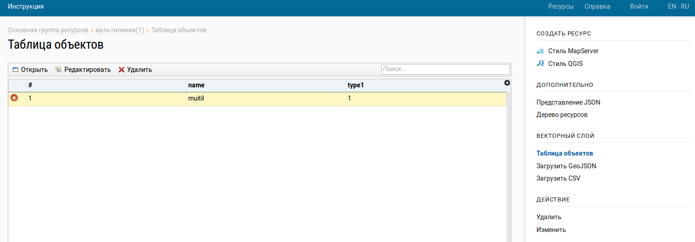
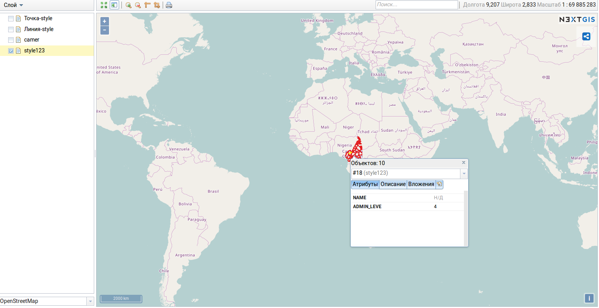
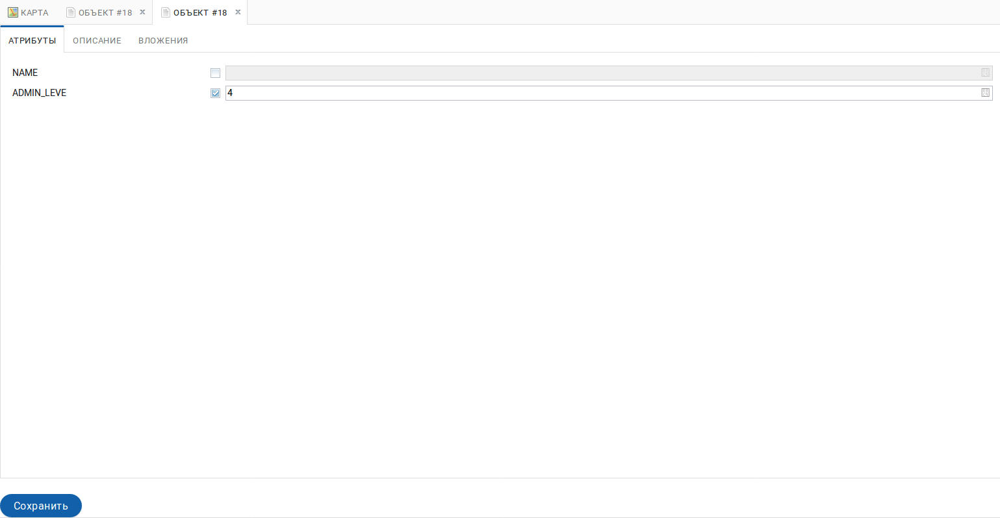
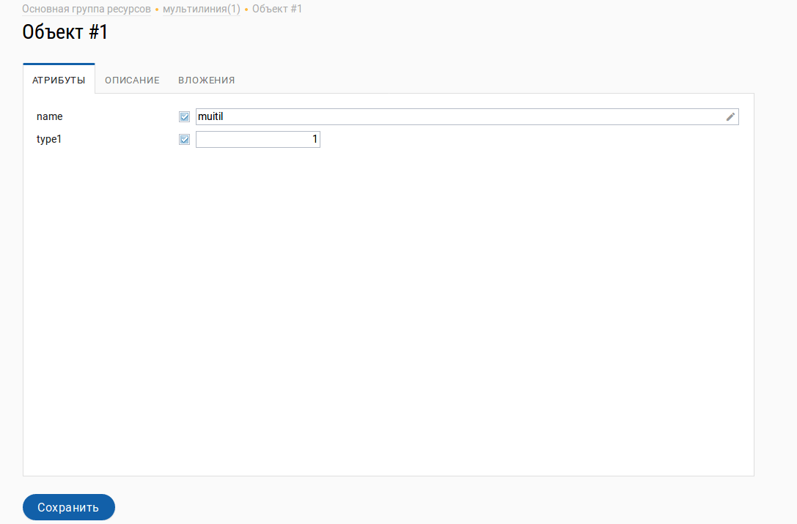
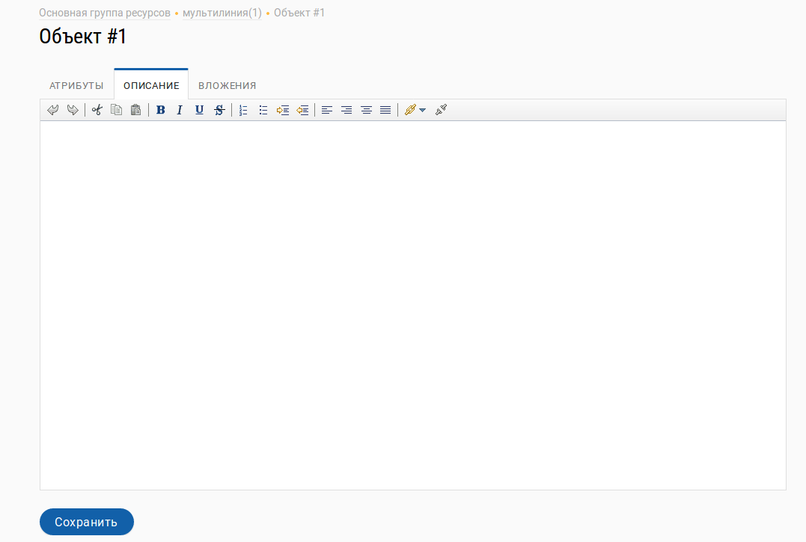
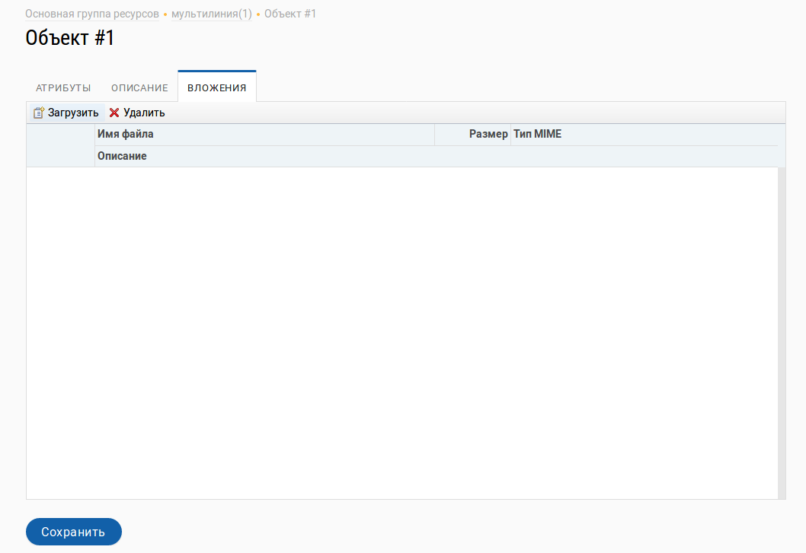

.. sectionauthor:: Артём Светлов <artem.svetlov@nextgis.ru>

.. _ngw_change_layers:

Редактирование векторных слоев
================================

Введение
---------

По окончании создания слоя становятся доступными настройки созданного слоя. 
Для редактирования слоя необходимо зайти в его описание и в блоке :guilabel:`Операции` 
выбрать :guilabel:`Редактирование`. При этом откроется окно редактирования свойств 
этого слоя. Кроме того, редактирование можно запустить в таблице слоев группы из 
колонки :guilabel:`Операции`.

.. _ngw_attributes:

Редактирование значений атрибутов
----------------------------------

Программное обеспечение NextGIS Web позволяет редактировать атрибуты географических 
объектов. Редактирование атрибутов можно вызывать из административного интерфейса
и из просмотра карты. 

* Редактирование атрибутов из админки: 

  - Откройте векторный слой, нажмите в правом меню :guilabel:`Таблица объектов`. 
  - Откроется таблица. Выберите нужную строку в таблице и в этой строке слева в пустом 
    окошке проставьте отметку для выделения строки для выполнения действий над объектом. 
  - Нажмите на кнопку :guilabel:`Изменить` справа внизу экрана :numref:`ngweb_editing_attributes2.7`.

   
   Редактирование атрибутов из админки.

* Редактирование атрибутов при просмотре карты: 
  
  - щёлкните инструментом идентификации по объекту, 
  - нажмите на кнопку редактирования (последняя кнопка в таблице после вкладки Вложение) :numref:`ngweb_editing_when_viewing_map`:

   Редактирование атрибутов при просмотре карты.

В открывшемся окне можно изменять значения атрибутов :numref:`ngweb_editing_when_viewing_map1`: 

   Окно редактирования атрибутов слоя.

Описание, заданное на вкладке "Описание", будет видно при просмотре карты в окне идентификации. 

В окне редактирования атрибутов слоя имеются следующие вкладки:

* вкладка Атрибуты :numref:`ngweb_tab_attributes`:

 
   Вкладка Атрибуты.

* вкладка Описание :numref:`ngweb_tab_description`:

   Вкладка Описание.

* вкладка Вложение :numref:`ngweb_tab_attachment`:

 
   Вкладка Вложение.

.. note::

   При редактировании слоя из PostGIS изменения атрибутов сохраняются в PostGIS, 
   а описания - в локальной базе. При редактировании слоя из Shapefile изменения 
   атрибутов и описания сохраняются в локальной базе.

.. note::

   Геоданные с изменёнными атрибутами можно выгрузить по ссылке Загрузить GeoJSON 
   или раздав слой по протоколу WFS. Функционала выгрузки описаний сейчас нет.

.. _ngw_add_photos:

Добавлений фотографий к геоданным
----------------------------------

Программное обеспечение NextGIS Web позволяет прикреплять к записям фотографии. 
При этом, при идентификации объекта на карте во всплывающем окне будет отображены 
как атрибуты идентифицируемого объекта, так и фотографии, которые были ему сопоставлены (см. :numref:`ngweb_webmap_identification_photos`).

.. figure:: _static/webmap_identification_photos.png
   :name: ngweb_webmap_identification_photos
   :align: center
   :width: 16cm

   Всплывающее окно результатов идентификации с фотографиями.

Добавление фотографий осуществляется в режиме просмотра карты. 

.. note:: 
   По умолчанию добавлять фотографии могут все пользователи, но можно настроить 
   так, чтобы добавлять могли только отдельные пользователи (см. 
   :ref:`ngw_access_rights`).

1. Щёлкните инструментом идентификации по объекту.
2. Нажмите на кнопку редактирования.
3. В окне редактирования откройте вкладку :guilabel:`Прикреплённые файлы` 
   (см. :numref:`ngweb_admin_object_edit_attr`).

.. figure:: _static/admin_object_edit_attr.png
   :name: ngweb_admin_object_edit_attr
   :align: center
   :width: 16cm

   Окно редактирования атрибутов.

4. Загрузите фотографии. Поддерживаются форматы JPEG, PNG. GIF не поддерживается (см. :numref:`ngweb_admin_object_edit_photos1`).

.. figure:: _static/admin_object_edit_photos1.png
   :name: ngweb_admin_object_edit_photos1
   :align: center
   :width: 16cm

   Окно загрузки фотографий к объекту.

5. Нажмите :guilabel:`Сохранить`, введите подписи к фотографиям, потом ещё раз 
   нажмите :guilabel:`Сохранить`  (см. :numref:`ngweb_admin_object_edit_photos2`).

.. figure:: _static/admin_object_edit_photos2.png
   :name: ngweb_admin_object_edit_photos2
   :align: center
   :width: 16cm

   Окно загрузки фотографий к объекту с введёными подписями.

Теперь при просмотре карты в окне идентификации на вкладке :guilabel:`Прикреплённые файлы` 
видны превью фотографий (см. :numref:`ngweb_webmap_identification_photos`).

При нажатии на фотографию открывается лайтбокс (всплывающее окно в браузере, работающее 
на JavaScript). Размер фотографии вписывается в окно. Фотографии подписываются, 
пользователю можно переходить между фотографиями, используя клавиши вправо-влево 
на клавиатуре (см. :numref:`ngweb_webmap_identification_photo_lightbox`).

.. figure:: _static/webmap_identification_photo_lightbox.png
   :name: ngweb_webmap_identification_photo_lightbox
   :align: center
   :width: 16cm

   Окно идентификации с загруженными фотографиями.  

Для удаления фотографий, выделите её в админке, нажмите кнопку :guilabel:`Удалить`, 
а потом нажмите кнопку :guilabel:`Сохранить`.

