.. sectionauthor:: Artem Svetlov <artem.svetlov@nextgis.ru>

.. _ngw_change_layers:

Layer settings
================================

Introduction
-------------

Layers settings become available after a layer creation.

To edit a layer you need to navigate to a child resource group (see item 4 in :numref:`admin_index_pic`), where would be displayed resource types. Then select from child resources a resource with type vector layer and press the "Pencil" icon opposite the resource or select the layer and then select an action called "Update" in actions pane (see :numref:`ngw_window_update_edit_resource`). The window "Update resource" will open, where you can edit the layer.

.. _ngw_vector_file_replace:

Delete or replace all features
-------------------------

NextGIS Web software allows to delete all features of a layer or replace them by uploading a new file.

Click on the pencil icon next to the layer. 

In the "Vector layer" tab select the action from the dropdown menu.

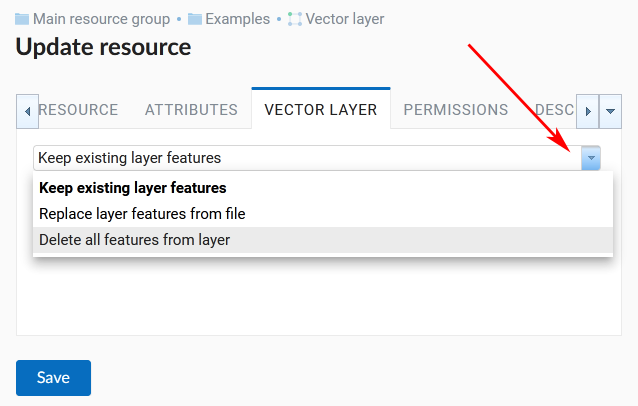
   
   Options to edit the layer file

You can delete all the features. This will result in an empty layer of the same structure that you can add new features to. To do so, select "Delete all features from layer", tick to confirm and press **Save**.

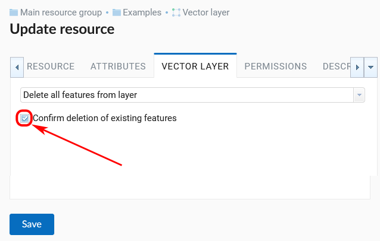
   
   Deleting all features from the layer

You can replace all the features by uploading a previously prepared file. Select "Replace layer features from file". Open the file or drag and drop it into the frame. 

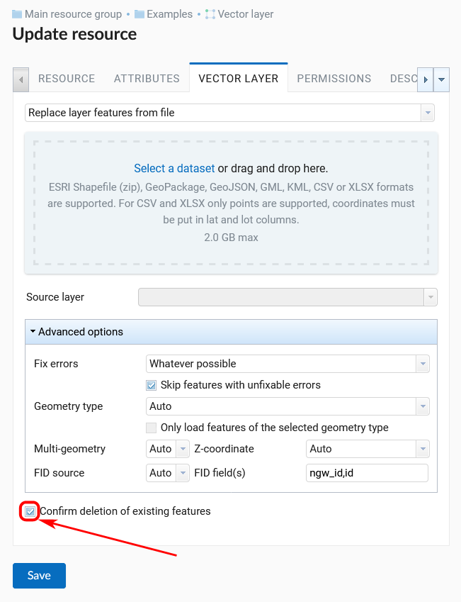
   
   Replacing layer file

If the file has multiple layers, select the one you need in the "Source layer" field. You can also set up other properties, as while creating a new vector layer.

.. note:
   You can use any type of geometry to replace the existing file. Keep in mind that if the geometry type changes, all styles connected with the layer may stop working, because they do not contain markers for other geometry types.

.. _ngw_attributes_edit:

Edit attribute values
----------------------------------

NextGIS Web software allows to edit attributes for geographical features. Editing could be launched from administrator interface or from a map display. 

* Editing of attributes from administrator interface: 

  - Click the "Table" icon opposite the resource or select an action for a vector layer called "Feature table" in actions pane (see :numref:`admin_table_objects_upload`).
  - A feature table for the layer will open. Click a radio 
  button at the left side of a row you want to edit.
  - Click "Edit" button (see :numref:`ngweb_editing_attributes2.7`).

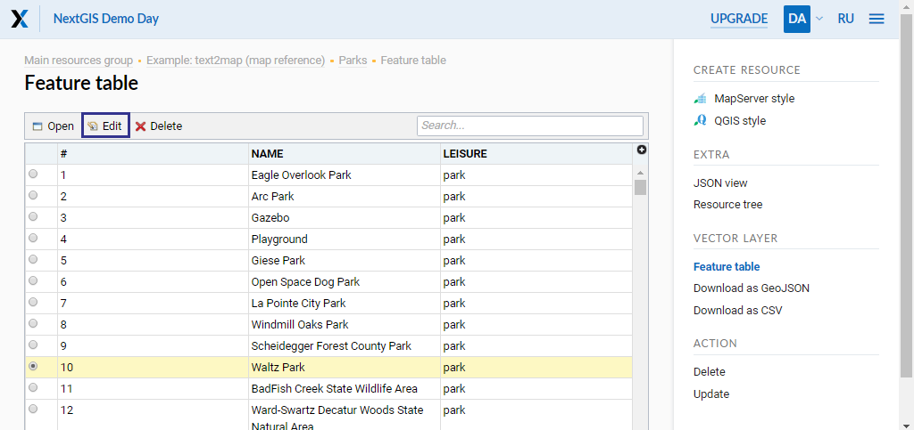
   
   Editing of attributes from administrator interface.
  
* Editing of attributes from a map display: 

  - Open a web-map.
  - Click on a map with identify tool active.
  - Click edit button in identify window (the last tab, see :numref:`ngweb_editing_when_viewing_map`).

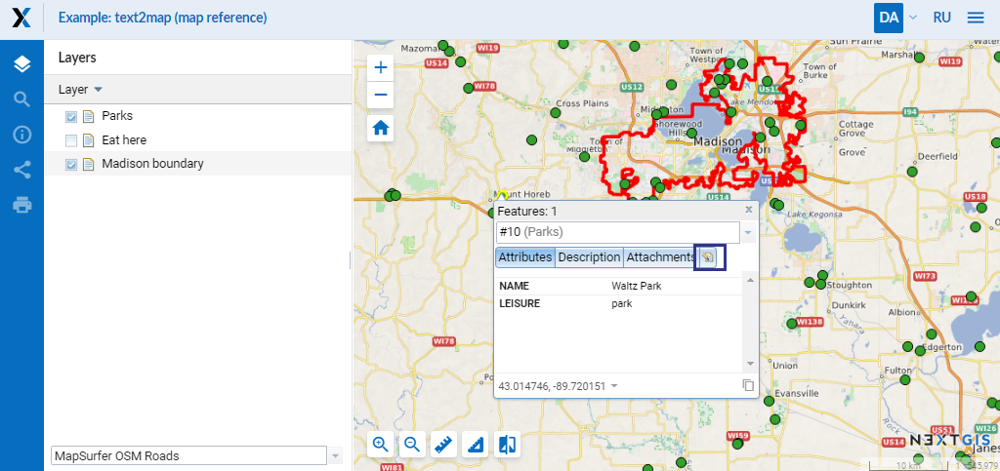

   Editing of attributes from a map display.

You can change attribute values in opened window. Description made on "Description" tab will be visible on a map display in indentify window. 

In the editing of attributes window there are the next tabs:

* "Attributes" tab (see :numref:`ngweb_tab_attributes`).

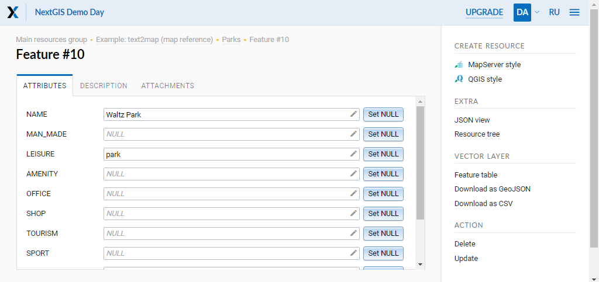
 
   "Attributes" tab.

* "Description" tab (see :numref:`ngweb_tab_description`).

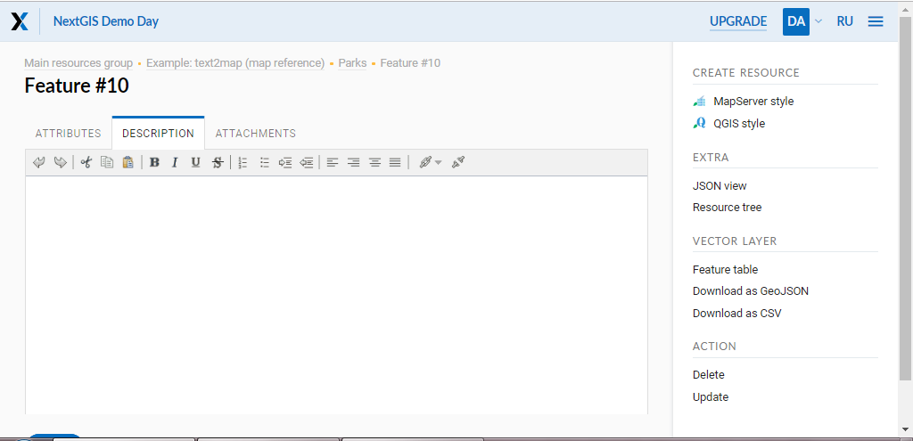

   "Description" tab.

* "Attachments" tab (see :numref:`ngweb_tab_attachment`).

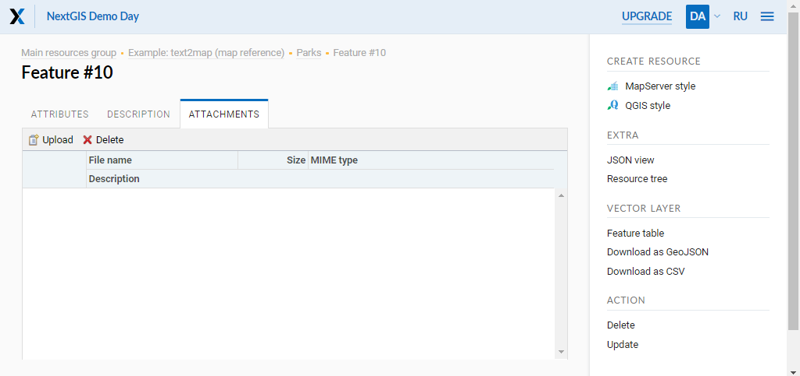
 
   "Attachments" tab.

.. note::

When editing a PostGIS layer attribute changes are saved to PostGIS database and descriptions are saved to a local database. 
When editing a layer based on a Shapefile attribute changes are saved to a local database. 

.. note::

Geodata with changed attributes could be downloaded by link :guilabel:`Download as 
GeoJSON` or published as WFS service. Download of descriptions is currently unavailable.

.. _ngw_add_photos:

Adding photos to geodata
----------------------------------

NextGIS Web software support adding photos to feature records. 
If a feature has attached photos they will be shown with a description and attributes in identify window (see  :numref:`webmap_identification_photos`).

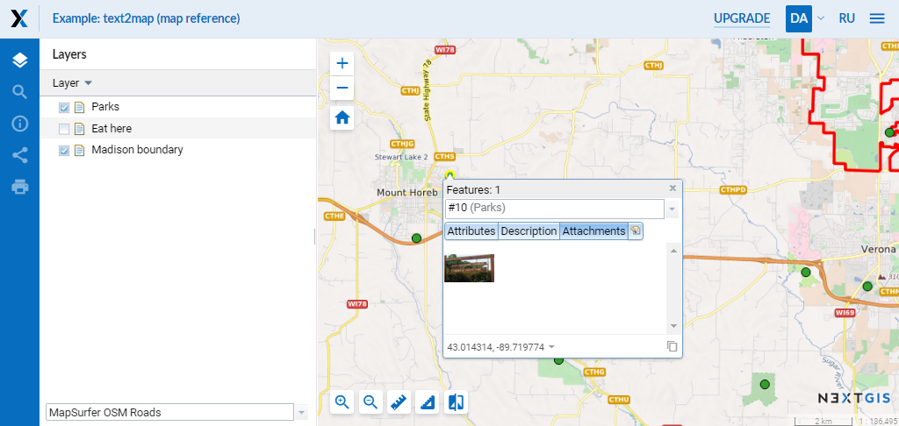

   Identify window with an identify result with attached photos.

You can add photos in a map display. To do it:

1. Click on a feature on a map with active Identify tool.
2. Click edit button in Identify window (see :numref:`ngweb_editing_when_viewing_map`).
3. In the edit tab navigate to "Attachments" tab (see :numref:`ngweb_tab_attachment`).
4. Upload photos. JPEG and PNG formats are supported. GIF format is not supported (see. :numref:`admin_object_edit_photos1`).

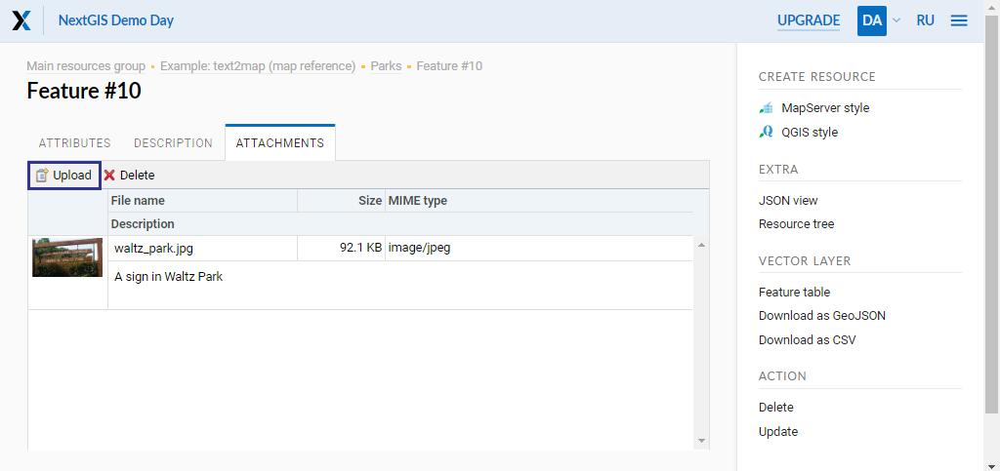

   Attachments tab of edit feature window for upload of photos.

5. Enter Description and click "Save".

After upload of photos you can see previews of photos on "Attachments" tab if identify window (see  :numref:`webmap_identification_photos`).

After a click on a photo preview a lightbox window is open (a javascript powered window in browser). Photo size is adjusted to fit the window. Photos have descriptions and user can navigate through photos using left and right arrow keys on a keyboard (see  :numref:`webmap_identification_photo_lightbox`).

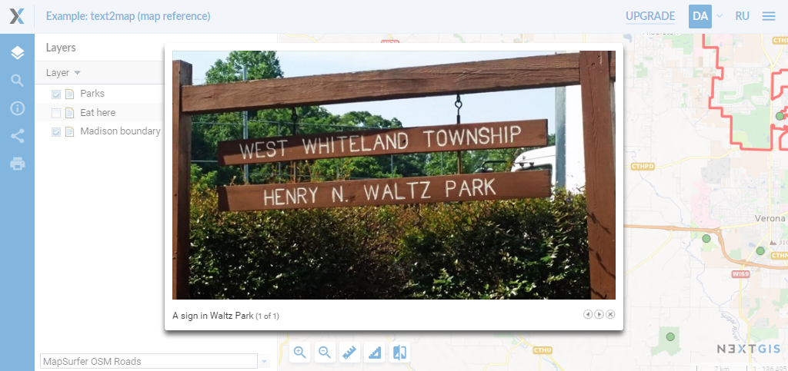

   A lightbox with uploaded photos for an identified feature.  

.. note:: 
   By default photos could be added by any user but there is an option 
   to limit number of users who can upload photos (see  
   :ref:`ngw_access_rights`).

To delete a photo select it on "Attachments" tab of editting attributes window and click "Delete", and then click "Save" button.

