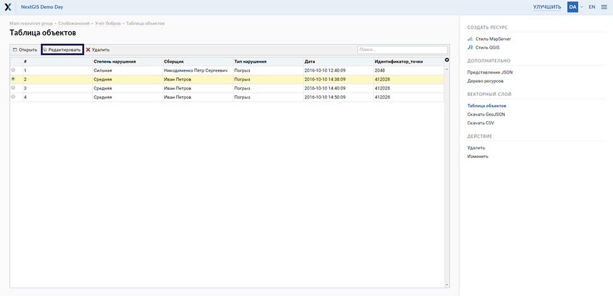
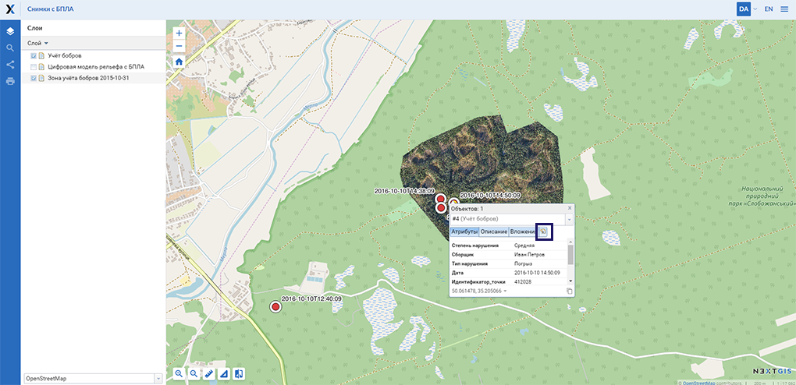
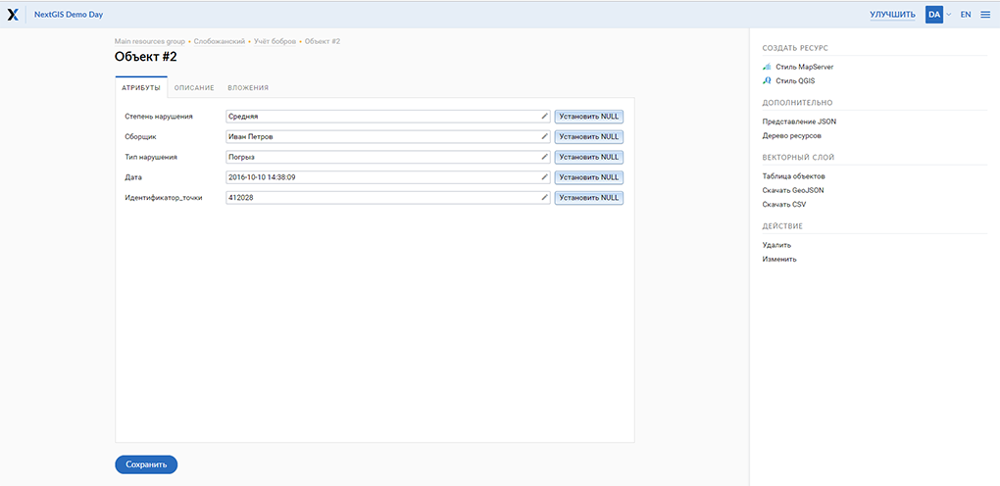
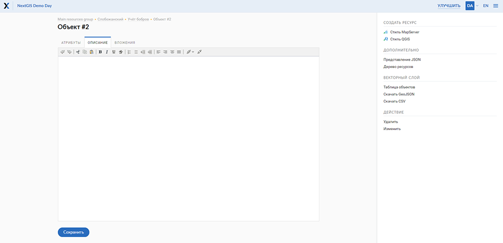
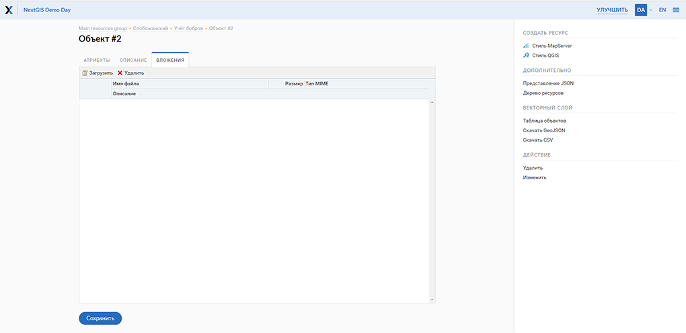
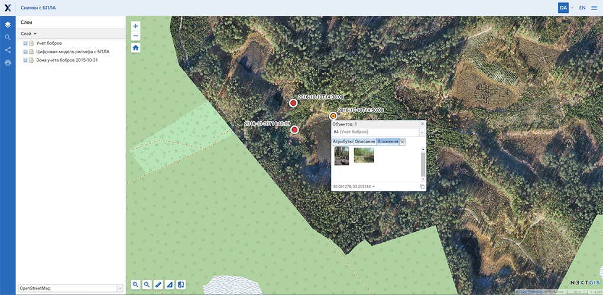
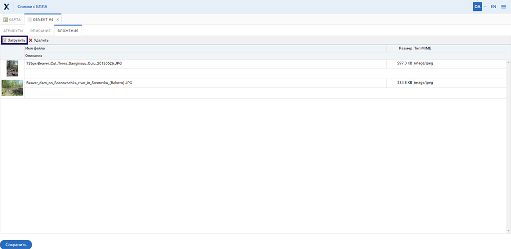
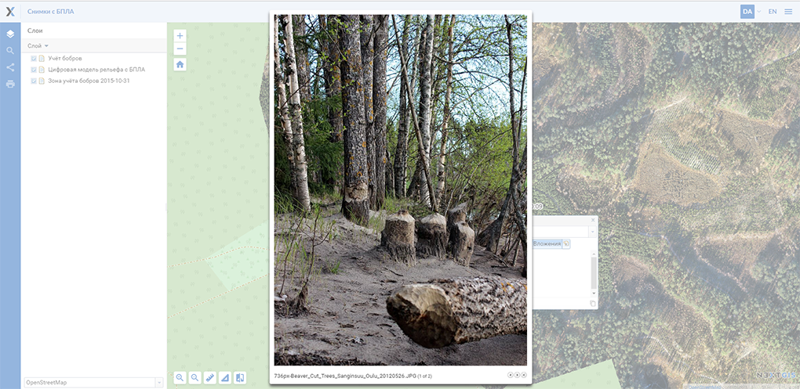

.. sectionauthor:: Артём Светлов <artem.svetlov@nextgis.ru>

.. _ngw_change_layers:

Редактирование векторных слоев
================================

Введение
---------

По окончании создания слоя становятся доступными настройки созданного слоя. 
Для редактирования слоя необходимо войти в административный интерфейс (см. :numref:`ngweb_resource_group`), перейти к группе 
дочерних ресурсов (см. :numref:`ngweb_main_page_administrative_interface_pic`, п.4), выбрать тип ресурса "векторный слой", и нажать на значок карандаша напротив выбранного слоя или нажать на выбранный слой, а затем в блоке операций выбрать действие над ресурсом "Изменить" (см. :numref:`ngw_window_update_edit_resource`). При этом откроется окно редактирования свойств 
этого слоя.

.. _ngw_attributes:

Редактирование значений атрибутов
----------------------------------

Программное обеспечение NextGIS Web позволяет редактировать атрибуты географических 
объектов. Редактирование атрибутов можно вызывать из административного интерфейса
и из режима просмотра веб-карты. 

* Редактирование атрибутов из административного интерфейса: 

  - Нажать на значок таблицы напротив векторного слоя или открыть этот слой, а затем в блоке операций выбрать действие над слоем - "Таблица объектов" (см. :numref:`ngweb_Object_table`).
  - Откроется таблица. Выбрать нужную строку в таблице и в этой строке слева в пустом 
    окошке проставить отметку для выделения строки для выполнения действий над объектом. 
  - Нажать на кнопку "Редактировать" над таблицей (см. :numref:`ngweb_editing_attributes2.7`).

   
   Редактирование атрибутов из административного интерфейса.

* Редактирование атрибутов при просмотре карты: 
  
  - Открыть веб-карту.
  - Выбрать объект и нажать на него инструментом идентификации. 
  - Нажать на кнопку редактирования (последняя вкладка, см. :numref:`ngweb_editing_when_viewing_map`).

   Редактирование атрибутов при просмотре карты.

В открывшемся окне можно изменять значения атрибутов. Описание, заданное на вкладке "Описание", будет видно при просмотре карты в окне идентификации. 

В окне редактирования атрибутов слоя имеются следующие вкладки:

* вкладка "Атрибуты" (см. :numref:`ngweb_tab_attributes`)

 
   Вкладка "Атрибуты".

* вкладка "Описание" (см. :numref:`ngweb_tab_description`)

   Вкладка "Описание".

* вкладка "Вложения" (см. :numref:`ngweb_tab_attachment`)

 
   Вкладка "Вложения".

.. note::

   При редактировании слоя из PostGIS изменения атрибутов сохраняются в PostGIS, 
   а описания - в локальной базе. При редактировании слоя из Shapefile изменения 
   атрибутов и описания сохраняются в локальной базе.

.. note::

   Геоданные с изменёнными атрибутами можно выгрузить по ссылке "Загрузить GeoJSON" 
   или раздав слой по протоколу WFS. Функционала выгрузки описаний нет.

.. _ngw_add_photos:

Добавлений фотографий к геоданным
----------------------------------

Программное обеспечение NextGIS Web позволяет прикреплять к записям фотографии. 
При этом, при идентификации объекта на карте во всплывающем окне будет отображены 
как атрибуты объекта, так и фотографии, которые были ему сопоставлены (см. :numref:`ngweb_webmap_identification_photos`).

   Всплывающее окно результатов идентификации объекта с фотографиями.

Добавление фотографий осуществляется в режиме просмотра карты. Для этого нужно выполнить следующие действия:

1. Щёлкнуть инструментом идентификации по объекту.
2. Нажать на кнопку редактирования (см. :numref:`ngweb_editing_when_viewing_map`).
3. В окне редактирования открыть вкладку "Вложения" (см. :numref:`ngweb_tab_attachment`).
4. Загрузить фотографии. Поддерживаются форматы JPEG, PNG. 
   Формат GIF не поддерживается (см. :numref:`ngweb_admin_object_edit_photos1`).

   Окно загрузки фотографий к объекту.

5. Ввести подписи к фотографиям и нажать "Сохранить".

Теперь при просмотре карты в окне идентификации на вкладке "Вложения" 
видны превью фотографий (см. :numref:`ngweb_webmap_identification_photos`).

При нажатии на фотографию открывается лайтбокс (всплывающее окно в браузере, работающее 
на JavaScript). Размер фотографии вписывается в окно. Фотографии подписываются, 
пользователю можно переходить между фотографиями, используя клавиши вправо-влево 
на клавиатуре (см. :numref:`ngweb_webmap_identification_photo_lightbox`).

   Окно идентификации с загруженными фотографиями.  

.. note:: 
   По умолчанию фотографии могут добавлять все пользователи, но можно настроить 
   так, чтобы добавлять могли только отдельные пользователи (см. 
   :ref:`ngw_access_rights`).
   
Для удаления фотографии следует выделить её в окне редактирования атрибутов слоя на вкладке "Вложения", нажать кнопку "Удалить", 
а затем нажать кнопку "Сохранить".

