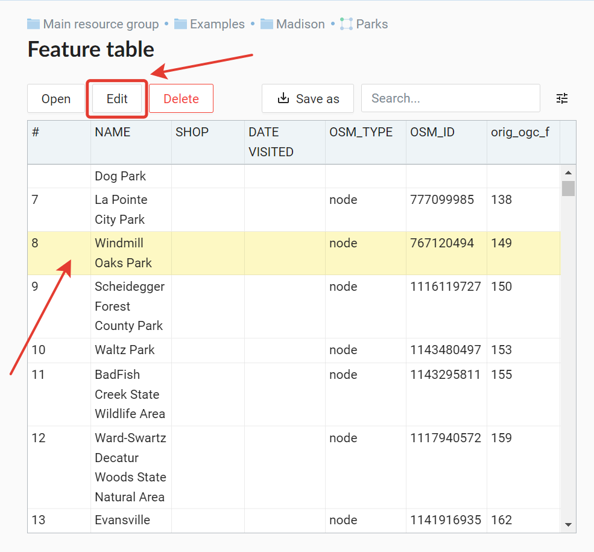
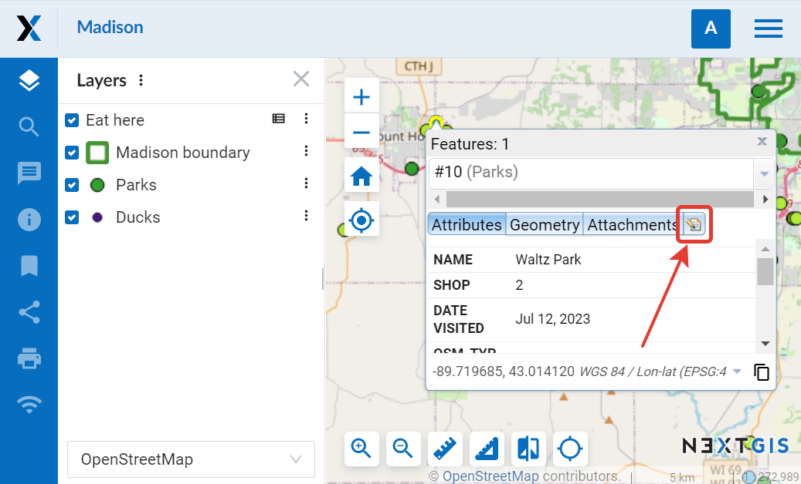
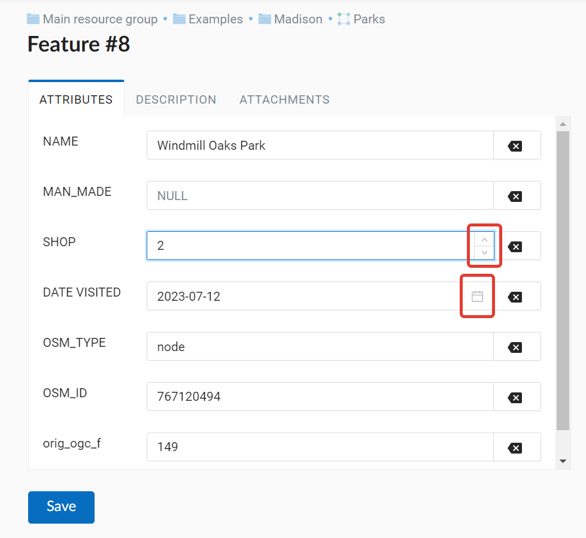
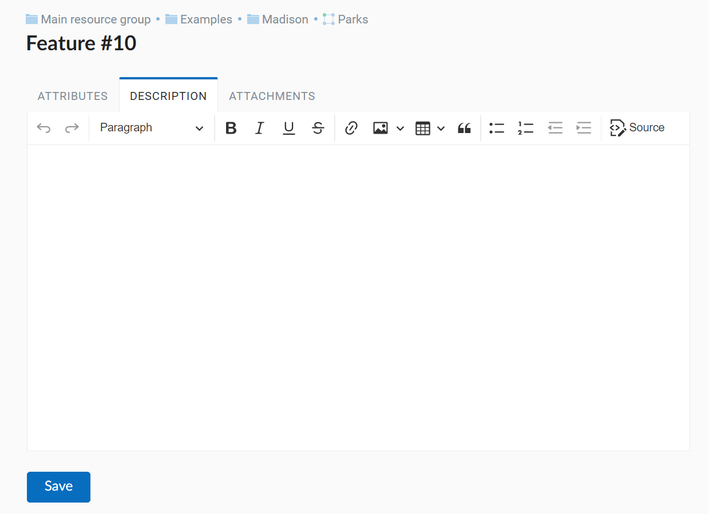
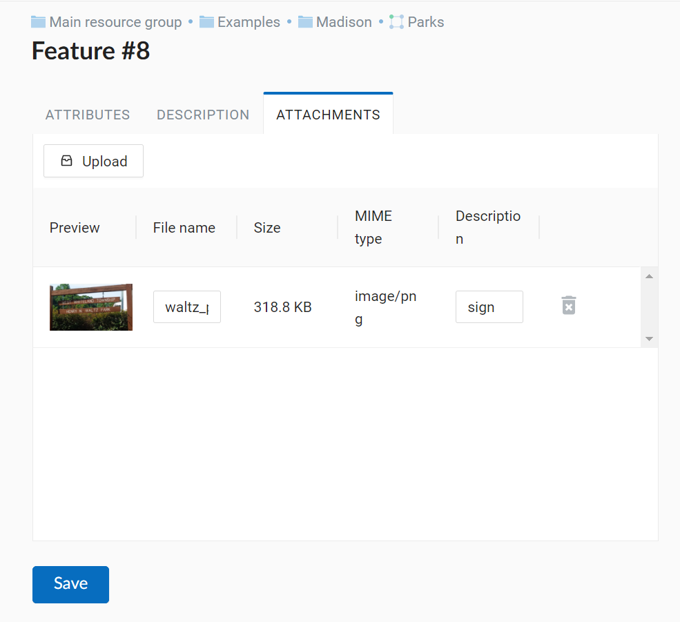
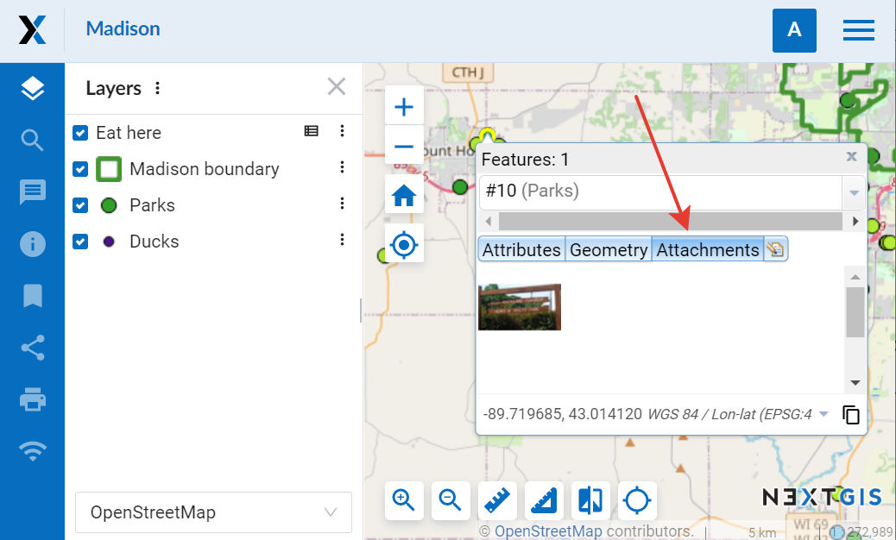
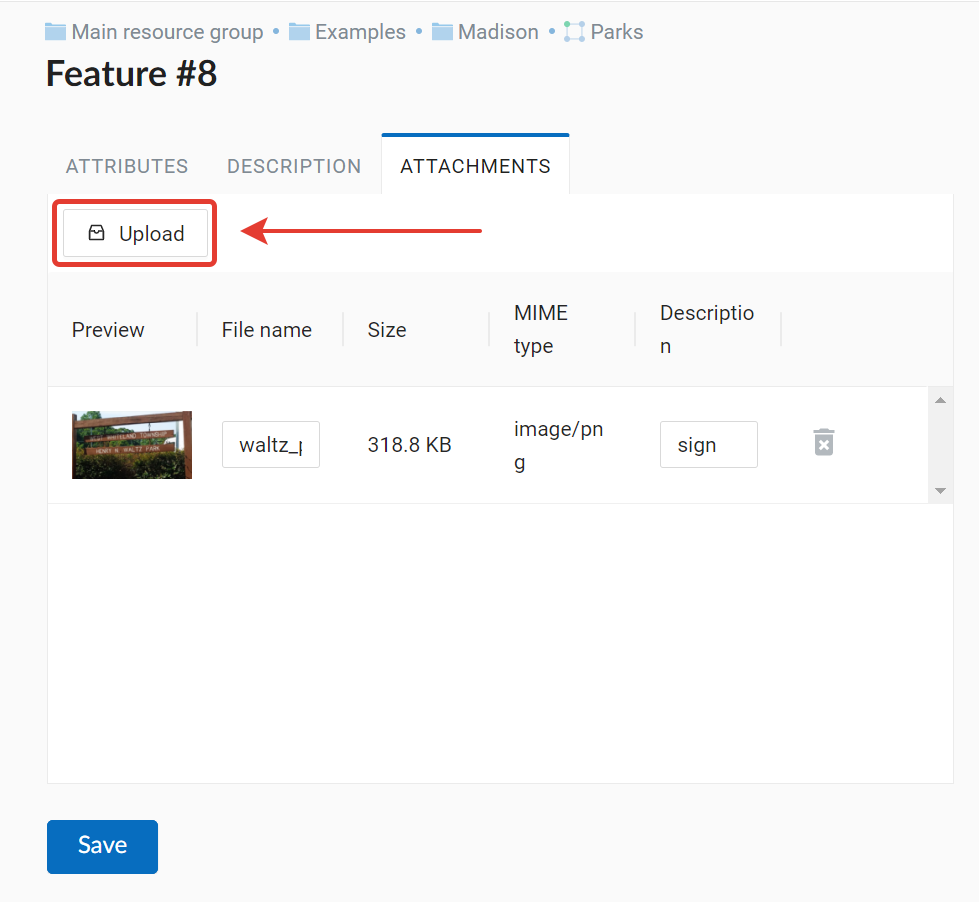

.. sectionauthor:: Artem Svetlov <artem.svetlov@nextgis.ru>

.. _ngw_change_layers:

Layer settings
================================

Introduction
-------------

Layers settings become available after a layer creation.

To edit a layer you need to navigate to a child resource group (see item 4 in :numref:`admin_index_pic`), where would be displayed resource types. Then select from child resources a resource with type vector layer and press the "Pencil" icon opposite the resource or select the layer and then select an action called "Update" in actions pane (see :numref:`ngw_window_update_edit_resource`). The window "Update resource" will open, where you can edit the layer.

.. _ngw_vector_file_replace:

Delete or replace all features
-------------------------

NextGIS Web software allows to delete all features of a layer or replace them by uploading a new file.

Click on the pencil icon next to the layer. 

In the "Vector layer" tab select the action from the dropdown menu.

.. figure:: _static/ngw_update_vector_file_options_en.png
   :name: ngw_update_vector_file_options_pic
   :align: center
   :width: 15cm
   
   Options to edit the layer file

You can delete all the features. This will result in an empty layer of the same structure that you can add new features to. To do so, select "Delete all features from layer", tick to confirm and press **Save**.

.. figure:: _static/ngw_update_vector_file_clear_en.png
   :name: ngw_update_vector_file_clear_pic
   :align: center
   :width: 15cm
   
   Deleting all features from the layer

You can replace all the features by uploading a previously prepared file. Select "Replace layer features from file". Open the file or drag and drop it into the frame. 

.. figure:: _static/ngw_update_vector_file_replace_en.png
   :name: ngw_update_vector_file_replace_pic
   :align: center
   :width: 15cm
   
   Replacing layer file

If the file has multiple layers, select the one you need in the "Source layer" field. You can also set up other properties, as while creating a new vector layer.

If you replace the file, now only the features, but the structure of the attributes and other properties will be changed to match the new file.

.. note:
   You can use any type of geometry to replace the existing file. Keep in mind that if the geometry type changes, all styles connected with the layer may stop working, because they do not contain markers for other geometry types.

.. _ngw_attributes_edit:

Edit attribute values
----------------------------------

NextGIS Web software allows to edit attributes for geographical features. Editing could be launched from the administrator interface or from the map display. 

* Editing attributes from administrator interface: 

  - Click the table icon opposite the resource or select an action for a vector layer called "Feature table" in the actions pane (see :numref:`admin_table_objects_upload`).
  - A feature table for the layer will open. Select the row you want to edit. It will be highlighted in yellow.
  - Click **Edit** button (see :numref:`ngweb_editing_attributes2.7`).

   
   Editing attributes from administrator interface
  
* Editing attributes from the map display: 

  - Open a Web Map.
  - Click on the map with Identify tool active.
  - Click edit button in the Identify window (the last tab, see :numref:`ngweb_editing_when_viewing_map`).

   Editing attributes from the map

You can change attribute values in the opened window. Description made on "Description" tab will be visible on the map display in the indentify window. 

Editing page has following tabs:

* "Attributes" tab (see :numref:`ngweb_tab_attributes`).

 
   "Attributes" tab

To edit an attribute click on the field.

Numbers can be typed in or modified with errows that appear on the right end of the field.

Dates also can be typed in or selected in the calender. To open the calender click the icon on the right end of the field.

* "Description" tab (see :numref:`ngweb_tab_description`).

   "Description" tab

* "Attachments" tab (see :numref:`ngweb_tab_attachment`).

 
   "Attachments" tab

.. note::

When editing a PostGIS layer attribute changes are saved to PostGIS database and descriptions are saved to a local database. 
When editing a layer based on a Shapefile attribute all changes are saved to a local database. 

.. note::

Geodata with changed attributes could be downloaded by link :guilabel:`Download as 
GeoJSON` or published as WFS service. Download of descriptions is currently unavailable.

.. _ngw_add_photos:

Adding photos to geodata
----------------------------------

NextGIS Web software supports adding photos to features. 
If a feature has attached photos, they will be shown along with description and attributes in the identify window (see  :numref:`webmap_identification_photos`).

   Identify window for a feature with attached photos

You can add photos in a map display.

1. Click on a feature on the map with active Identify tool.
2. Click edit button in the Identify window (see :numref:`ngweb_editing_when_viewing_map`).
3. In the edit tab navigate to "Attachments" tab (see :numref:`ngweb_tab_attachment`).
4. Upload photos. JPEG and PNG formats are supported. GIF format is not supported (see. :numref:`admin_object_edit_photos1`).

   Uploading photos in the "Attachments" tab

5. Enter description for the image and click **Save**.

After uploading you can see previews of photos on the "Attachments" tab of the identify window (see  :numref:`webmap_identification_photos`).

After a click on a photo preview a lightbox window is open (a javascript powered window in browser). Photo size is adjusted to fit the window. Photos have descriptions and user can navigate through them using left and right arrow keys on the keyboard (see  :numref:`webmap_identification_photo_lightbox`).

.. figure:: _static/webmap_identification_photo_lightbox_eng_2.png
   :name: webmap_identification_photo_lightbox
   :align: center
   :width: 16cm

   A lightbox with uploaded photos for the identified feature

.. note:: 
   By default photos could be added by any user but there is an option 
   to limit number of users who can upload photos (see  
   :ref:`ngw_access_rights`).

To delete a photo select it on "Attachments" tab of editting attributes window and click "Delete", and then click **Save** button.

