.. sectionauthor:: Артём Светлов <artem.svetlov@nextgis.ru>

.. _ngw_change_layers:

Редактирование векторных слоев
================================

Введение
---------

По окончании создания слоя становятся доступными настройки созданного слоя. 
Для редактирования слоя необходимо войти в административный интерфейс (см. :numref:`ngweb_resource_group`), перейти к группе 
дочерних ресурсов (см. :numref:`ngweb_main_page_administrative_interface_pic`, п.4), выбрать тип ресурса "векторный слой", и нажать на значок карандаша напротив выбранного слоя или нажать на выбранный слой, а затем в блоке операций выбрать действие над ресурсом "Изменить" (см. :numref:`ngw_window_update_edit_resource`). При этом откроется окно редактирования свойств 
этого слоя.

.. _ngw_vector_file_replace:

Очистка и замена слоя
-------------------------

В NextGIS Web можно удалить все объекты слоя или заменить их, загрузив другой файл.

Нажмите на значок карандаша напротив выбранного слоя. Во вкладке "Векторный слой" выберите необходимое действие в выпадающем меню.

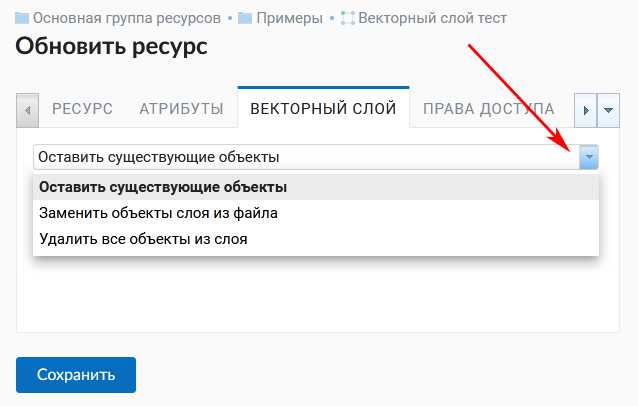
   
   Варианты изменения файла слоя

Вы можете удалить все объекты, оставив пустой слой со структурой для дальнейшего наполнения. Для этого выберите "Удалить все объекты из слоя", поставьте флажок для подтверждения удаления и нажмите **Сохранить**.

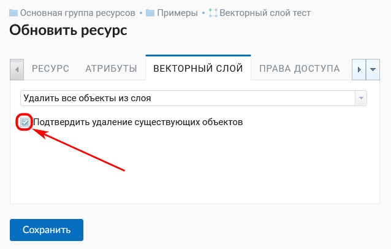
   
   Очистка слоя с удалением всех объектов

Можно заменить все объекты другими, использовав заранее подготовленный файл. Для этого выберите "Заменить объекты слоя из файла". Откройте нужный файл или перетащите его в пунктирную рамку. 

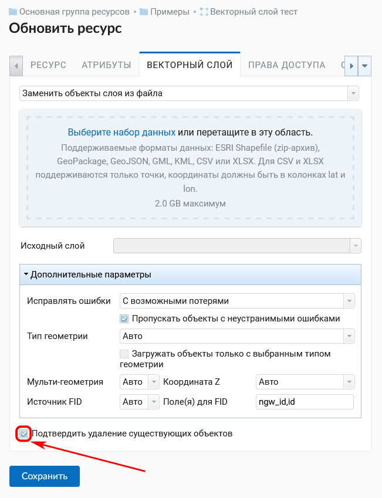
   
   Замена файла слоя

Если файл содержит несколько слоёв, выберите необходимый в поле "Исходный слой". Также можно настроить другие параметры загрузки файла, как и при создании нового векторного слоя.

При замене файла структура атрибутов, тип геометрии и другие параметры будут изменены в соответствии с новым загруженным файлом.

.. note:
   При перезаписи можно выбрать файл с другим типом геометрии. При этом скорее всего перестанут работать все связанные с векторным слоем стили, поскольку в них задано отображение данных другой геометрии.

.. _ngw_attributes:

Редактирование значений атрибутов
----------------------------------

Программное обеспечение NextGIS Web позволяет редактировать атрибуты географических 
объектов. Редактирование атрибутов можно вызывать из административного интерфейса
и из режима просмотра веб-карты. 

* Редактирование атрибутов из административного интерфейса: 

  - Нажать на значок таблицы напротив векторного слоя или открыть этот слой, а затем в блоке операций выбрать действие над слоем - "Таблица объектов" (см. :numref:`ngweb_Object_table`).
  - Откроется таблица. Кликнуть на нужную строку в таблице, она будет выделена желтым. 
  - Нажать на кнопку "Редактировать" над таблицей (см. :numref:`ngweb_editing_attributes2.7`).

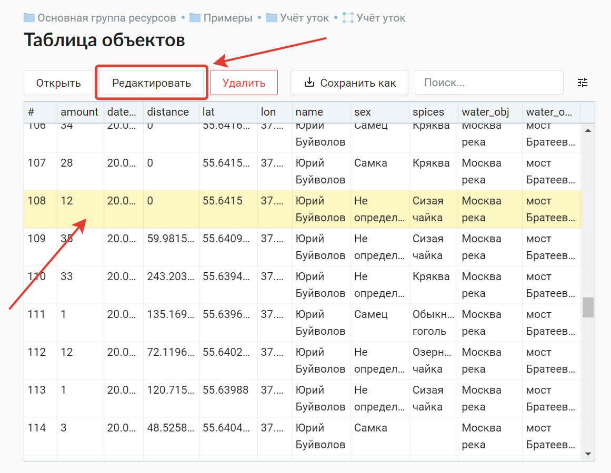
   
   Редактирование атрибутов из административного интерфейса

* Редактирование атрибутов при просмотре карты: 
  
  - Открыть веб-карту.
  - Выбрать объект и нажать на него инструментом идентификации. 
  - Нажать на кнопку редактирования (последняя вкладка, см. :numref:`ngweb_editing_when_viewing_map`).

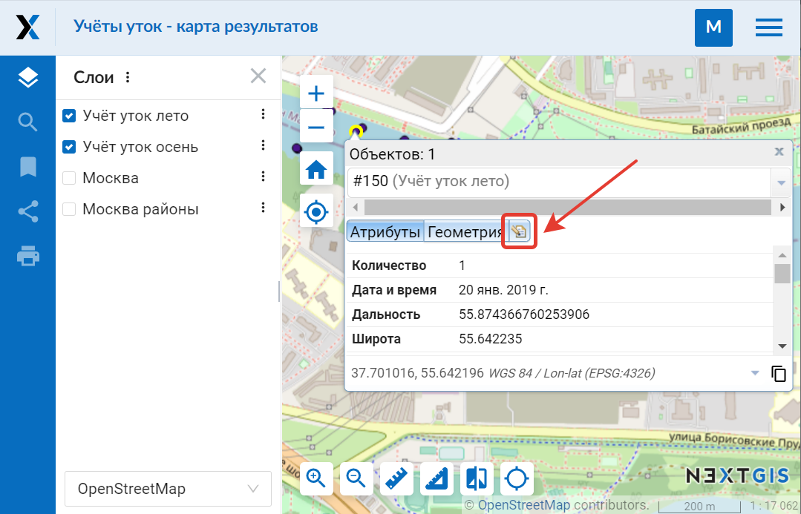

   Редактирование атрибутов при просмотре карты

В открывшемся всплывающем окне можно изменять значения атрибутов. Описание, заданное на вкладке "Описание", будет видно при просмотре карты в окне идентификации. 

В окне редактирования атрибутов слоя имеются следующие вкладки:

* вкладка "Атрибуты" (см. :numref:`ngweb_tab_attributes`)

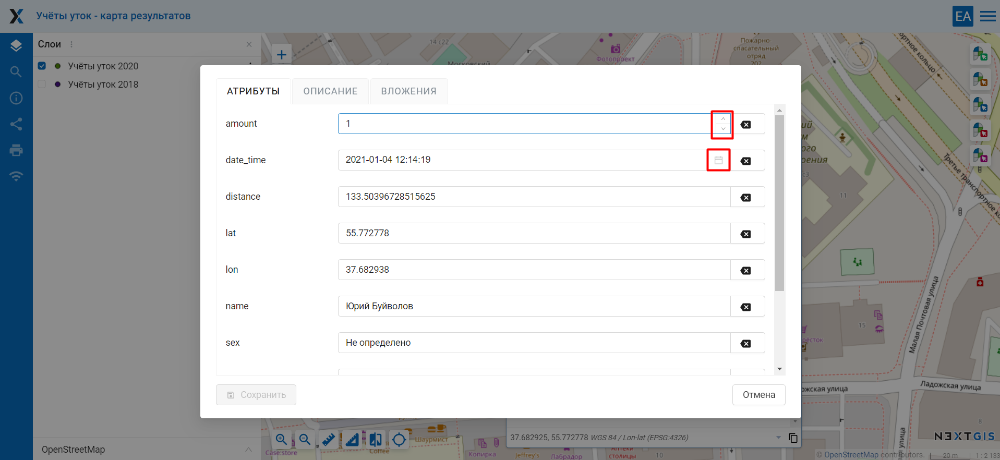
 
   Вкладка "Атрибуты"

Для редактирования атрибута просто кликните на нужной строчке. 

Числовые атрибуты можно вводить вручную или изменять, нажимая на стрелки, появляющиеся в правом конце поля. 

Дату также можно ввести вручную или выбрать в календаре - чтобы вызвать его, нажмите иконку в правом конце поля.

* вкладка "Вложения" (см. :numref:`ngweb_tab_attachment`)

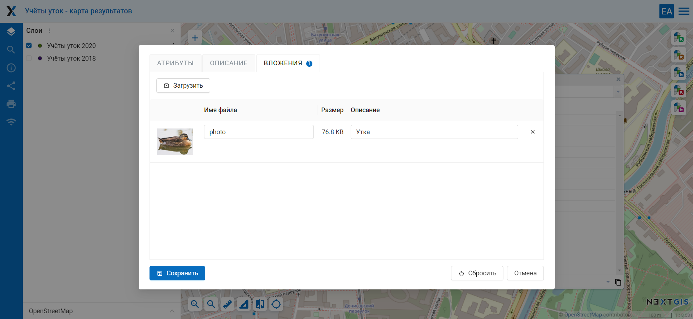
 
   Вкладка "Вложения"

* вкладка "Описание" (см. :numref:`ngweb_tab_description`)

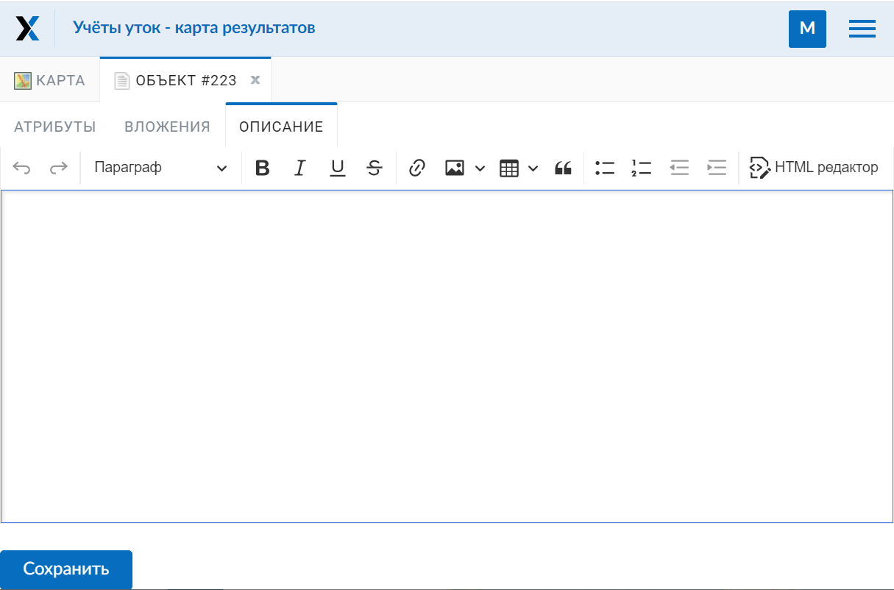

   Вкладка "Описание"

.. note::
   При редактировании слоя из PostGIS изменения атрибутов сохраняются в PostGIS, 
   а описания - в локальной базе. При редактировании слоя из Shapefile изменения 
   атрибутов и описания сохраняются в локальной базе.

.. note::
   Геоданные с изменёнными атрибутами можно выгрузить по ссылке "Загрузить GeoJSON" 
   или раздав слой по протоколу WFS. Функционала выгрузки описаний нет.

.. _ngw_add_photos:

Добавление фотографий к геоданным
----------------------------------

Программное обеспечение NextGIS Web позволяет прикреплять к записям фотографии. 
При этом, при идентификации объекта на карте во всплывающем окне будет отображены 
как атрибуты объекта, так и фотографии, которые были ему сопоставлены (см. :numref:`ngweb_webmap_identification_photos`).

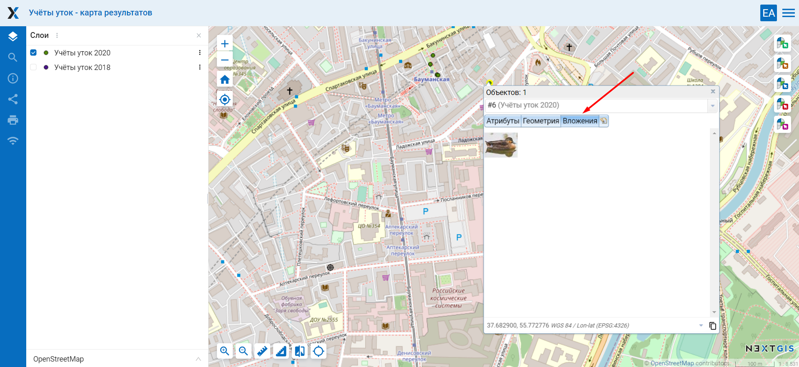

   Всплывающее окно результатов идентификации объекта с фотографиями

Добавление фотографий осуществляется в режиме просмотра карты или через редактирование атрибутов из административного интерфейса. Для добавления фотографий в режиме просмотра карты нужно выполнить следующие действия:

1. Щёлкнуть инструментом идентификации по объекту.
2. Нажать на кнопку редактирования (см. :numref:`ngweb_editing_when_viewing_map`).
3. В окне редактирования открыть вкладку "Вложения" (см. :numref:`ngweb_tab_attachment`).
4. Загрузить фотографии. Поддерживаются форматы JPEG, PNG. 
   Формат GIF не поддерживается (см. :numref:`ngweb_admin_object_edit_photos1`).

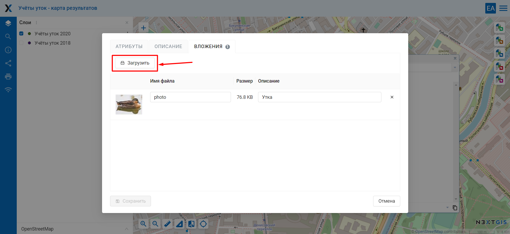

   Окно загрузки фотографий к объекту

5. Ввести подписи к фотографиям и нажать "Сохранить".

Теперь при просмотре карты в окне идентификации на вкладке "Вложения" 
видны превью фотографий (см. :numref:`ngweb_webmap_identification_photos`).

При нажатии на фотографию открывается лайтбокс (всплывающее окно в браузере, работающее 
на JavaScript). Размер фотографии вписывается в окно. Фотографии подписываются, 
пользователю можно переходить между фотографиями, используя клавиши вправо-влево 
на клавиатуре (см. :numref:`ngweb_webmap_identification_photo_lightbox`).

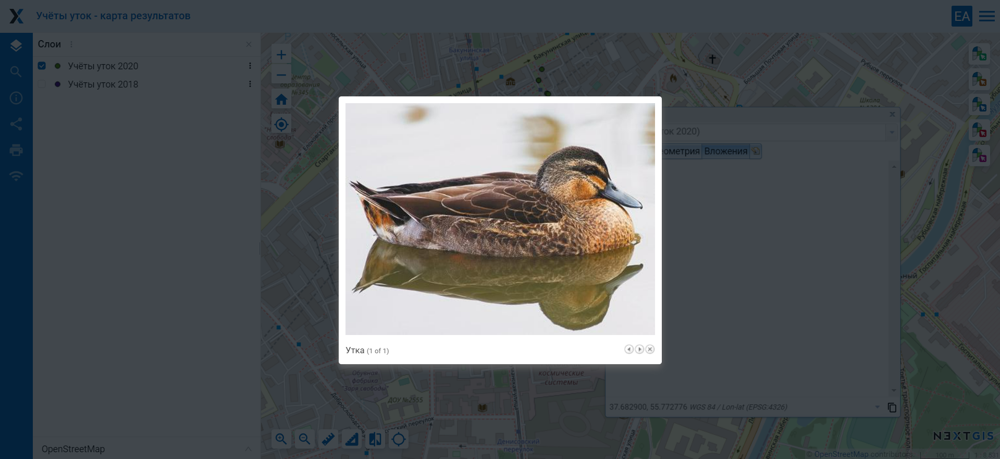

   Развернутая фотография во всплывающем окне

.. note:: 
   По умолчанию фотографии могут добавлять все пользователи, но можно настроить 
   так, чтобы добавлять могли только отдельные пользователи (см. 
   :ref:`ngw_access_rights`).
   
Для удаления фотографии следует выделить её в окне редактирования атрибутов слоя на вкладке "Вложения", нажать кнопку "Удалить", 
а затем нажать кнопку "Сохранить".

