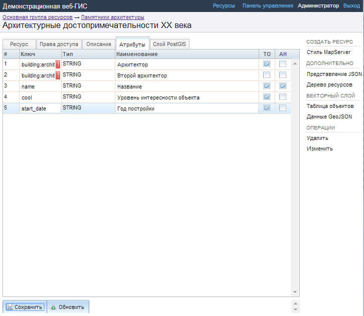
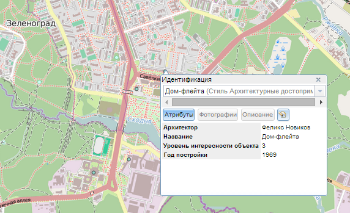
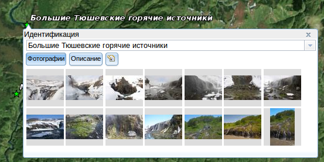
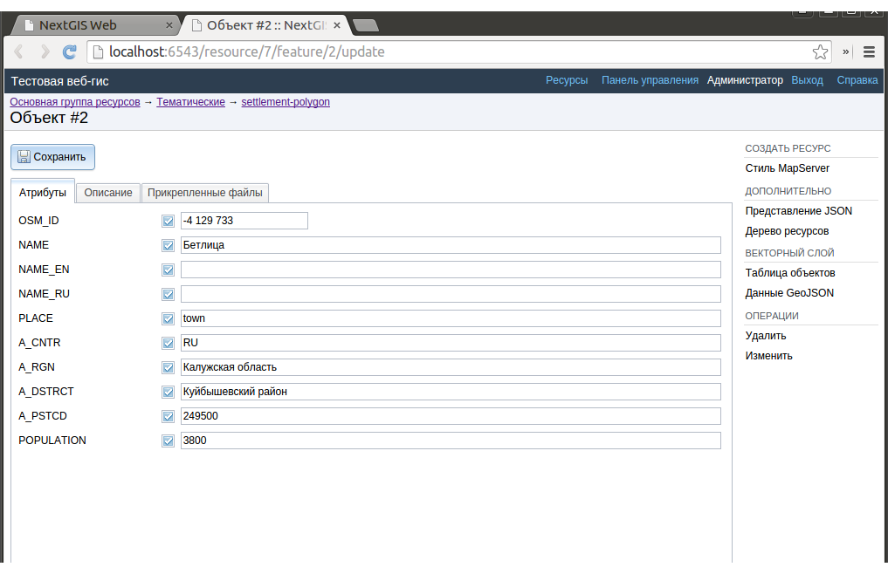
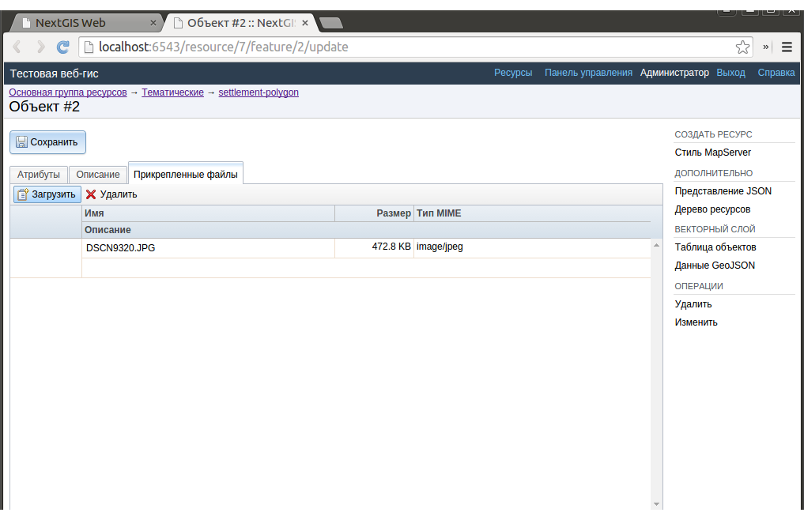
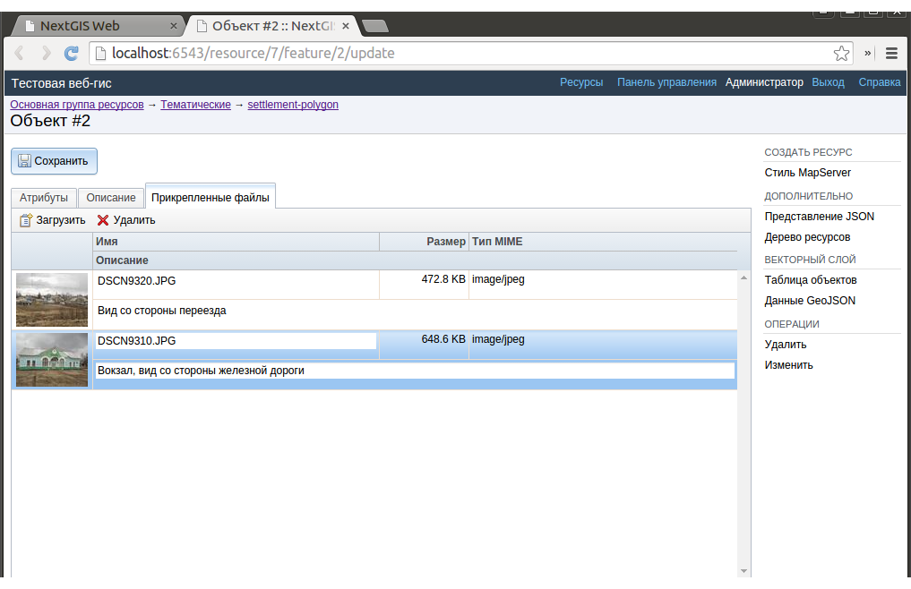
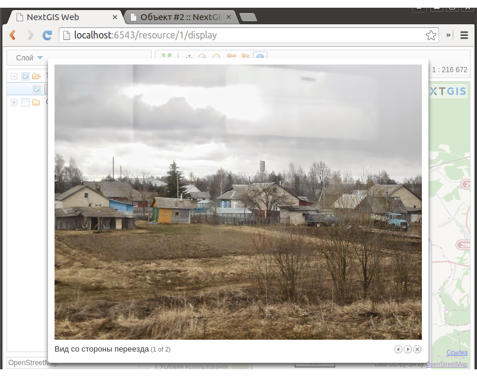

.. sectionauthor:: Артём Светлов <artem.svetlov@nextgis.ru>

.. _webmap:

Настройки слоёв
================================

Введение
--------------------------------

Настройки слоёв, которые становятся доступными после его создания

Для редактирования слоя необходимо зайти в его описание и в блоке :guilabel:`Операции` выбрать :guilabel:`Редактирование`. При этом откроется окно редактирования свойств этого слоя. Кроме того, редактирование можно запустить в таблице слоев группы из колонки :guilabel:`Операции`.

Атрибуты слоёв
-------------------------------------

Дополнительно к параметрам, которые вводились при создании слоя в окне присутствует вкладка :guilabel:`Атрибуты` (см. :numref:`admin_layers_attr`)

   Окно редактирования слоя, вкладка :guilabel:`Атрибуты`

Галочка в столбце :guilabel:`ТО` обозначает, что поле выводится в окне идентификации.
Галочка в столбце :guilabel:`АН` обозначает, что из этого поля берётся название для идентификации, а также при формировании списка закладок. Также можно поставить отметки напротив тех полей, которые следует показывать во всплывающем окне идентификации. Для каждого имени поля можно поставить в соответствие псевдоним для отображения вместо имени поля в окне идентификации.

   Окно идентификации

Добавлений фотографий к геоданным
-------------------------------------

Программное обеспечение NextGIS Web позволяет прикреплять к записям фотографии. При этом, при идентификации объекта на карте, во всплывающем окне будет отображены как атрибуты идентифицируемого объекта, так и фотографии, которые были ему сопоставлены (см. :numref:`webmap_identification_photos`).

   Всплывающее окно результатов идентификации с фотографиями.

Добавление фотографий осуществляется в режиме просмотра карты. 

.. note:: По умолчанию добавлять фотографии могут все пользователи, но можно настроить так, что бы добавлять могли только отдельные пользователи. См. ###LINK###

1. Щёлкните инструментом идентификации по объекту

2. Нажмите на кнопку редактирования (см. :numref:`webmap_identification_photos`).

   Окно идентификации. 

3. В окне редактирования откройте вкладку :guilabel:`Прикреплённые файлы` (см. :numref:`admin_object_edit_attr`).

   Окно редактирования атрибутов.

4. Загрузите фотографии. Поддерживаются форматы JPEG, PNG. GIF не поддерживается (см. :numref:`admin_object_edit_photos1`).

   Окно загрузки фотографий к объекту.

 
5. Нажмите :guilabel:`Сохранить`, введите подписи к фотографиям, потом ещё раз нажмите :guilabel:`Сохранить`  (см. :numref:`admin_object_edit_photos2`).

   Окно загрузки фотографий к объекту с введёными подписями.

Теперь при просмотре карты в окне идентификации на вкладке :guilabel:`Прикреплённые файлы` видны превью фотографий  (см. :numref:`webmap_identification_photos`).

   Окно идентификации с загруженными фотографиями. 

По нажатию на фотографию открывается лайтбокс (всплывающее окно в браузере, работающее на JavaScript). Размер фотографии вписывается в окно. Можно переходить вправо-влево, фотографии подписываются(см. :numref:`webmap_identification_photo_lightbox`).

   Окно идентификации с загруженными фотографиями.  

Для удаления фотографий - выделите её в админке, нажмите кнопку :guilabel:`Удалить`, потом нажмите кнопку :guilabel:`Сохранить`.

