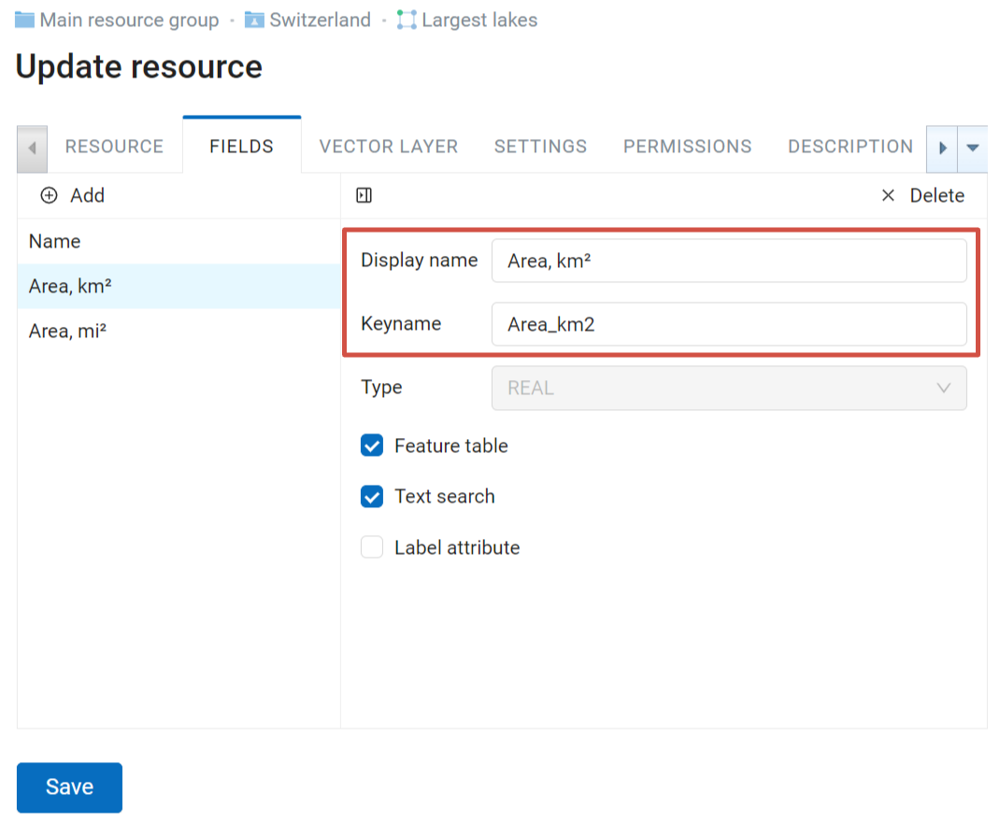
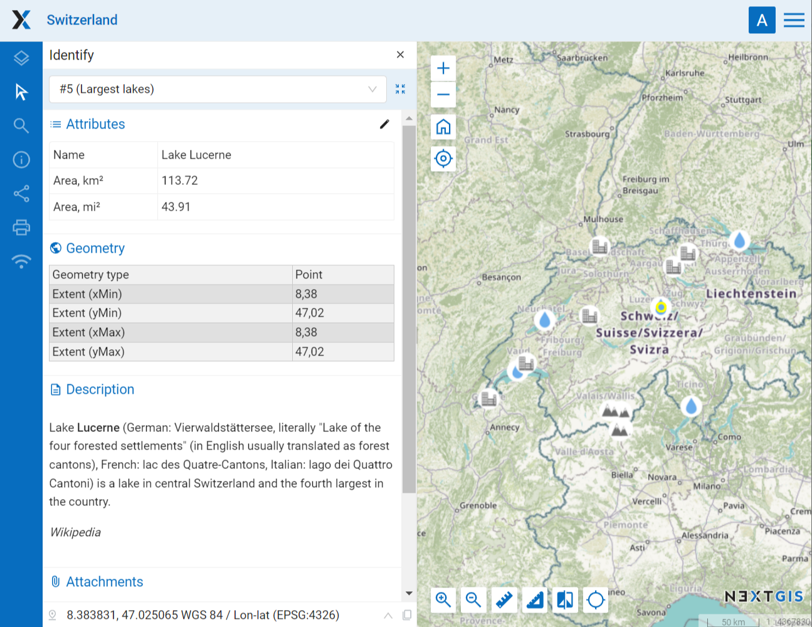
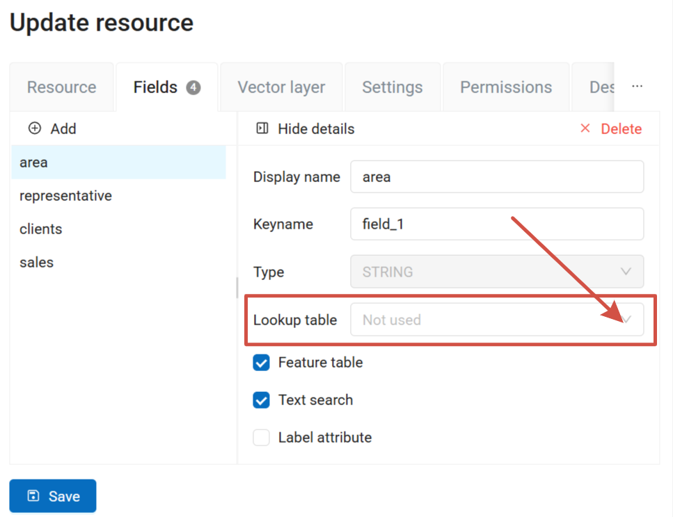
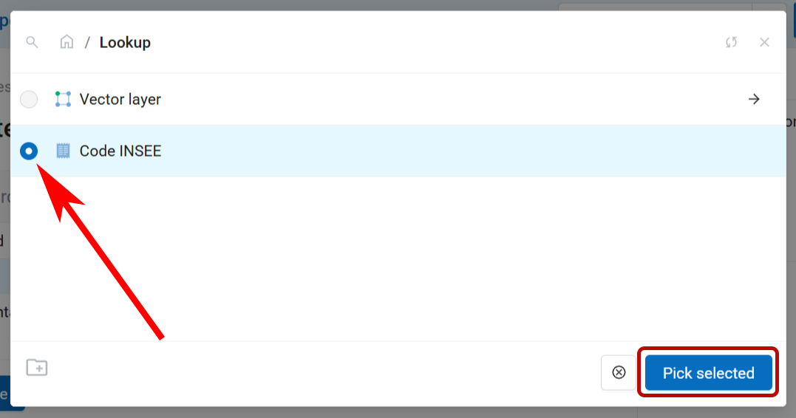
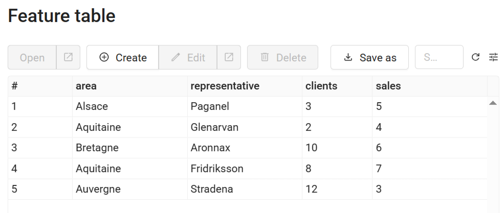
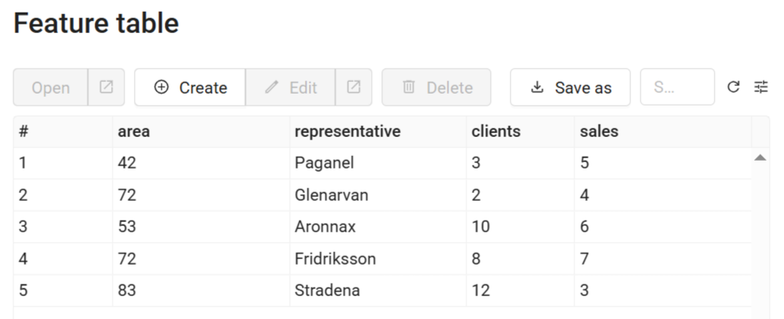
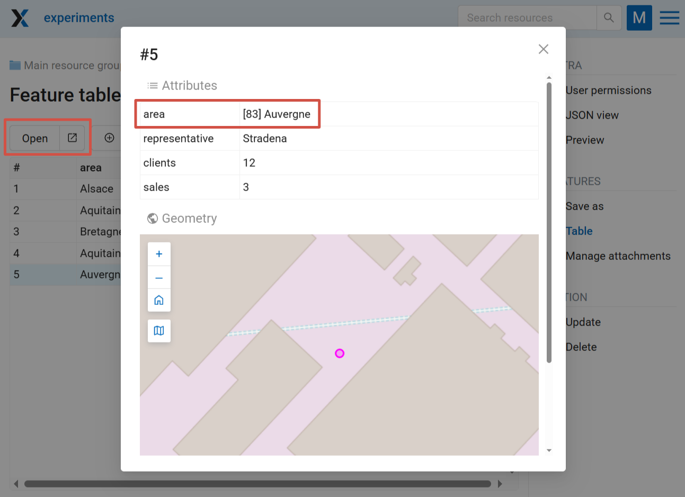
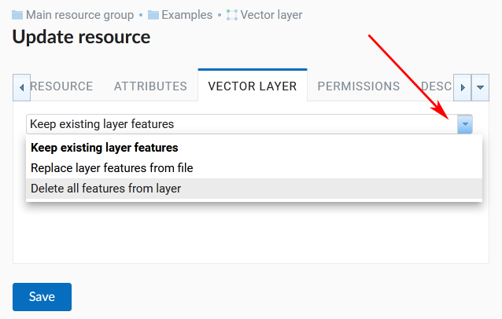
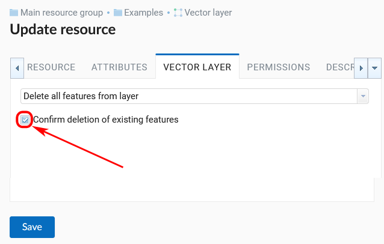
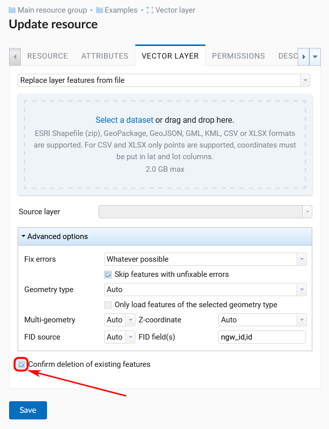

.. _ngw_change_layers:

Vector layer settings
================================

To edit a layer `log in to the Web GIS  <https://docs.nextgis.com/docs_ngweb/source/admin_interface.html#ngw-admin-login>`_.

To modify layer settings, open the group containing the layer (see :numref:`admin_index_pic`, item 5), find the layer in the list and click on the pencil icon next to it. 

It opens the `Update resource <https://docs.nextgis.com/docs_ngweb/source/edit_resource.html>`_ page. On this page you can edit the settings standard for all types of resources (parent, description, metadata, access permission) and specific for vector layers: 

* `delete or replace all the features <https://docs.nextgis.com/docs_ngweb/source/layers_settings.html#ngw-vector-file-replace>`_;
*  edit `fields and their aliases <https://docs.nextgis.com/docs_ngweb/source/layers_settings.html#ngw-attributes-edit>`_;
* `enable editing <https://docs.nextgis.com/docs_ngweb/source/.feature_edit.html#ngw-allow-edit>`_ for vector features and annotations on the map. 

:ref:`Web GIS <ngcom_description>` interface allows to `edit <https://docs.nextgis.com/docs_ngweb/source/feature_edit.html>`_ geometries on the map and feature attribute values, add description and `attachments <https://docs.nextgis.com/docs_ngweb/source/feature_edit.html#ngw-attachments>`_ (photos etc) to features of Vector layers and `PostGIS layers <https://docs.nextgis.com/docs_ngweb/source/postgis_details.html#postgis>`_.

.. _ngw_attributes_edit:

Edit vector layer attributes table
-----------------------------------

"Fields" tab contains a table with vector layer attributes (see :numref:`ngweb_admin_layers_attr`). 

On this tab you can:

* |button_plus_layer| Add a new field;
* Delete a field by pressing the |attr_delete_symbol| symbol at the end of the row;
* Edit a field. Click on a table row to open the properties of the field. 

.. figure:: _static/vector_layer_field_list_en.png
   :name: ngweb_admin_layers_attr
   :align: center
   :width: 16cm

   "Fields" tab

The table contains the following columns:

* Display name that is used in the identification window instead of the keyname;
* Keyname - technical name of the attribute, can be comprised only of plain latin symbols;

   Display name with superscript symbol and keyname of the field

   The identification window. Names of the fields are displayed with superscript symbols

* Type - defines what data can be stored in the fiels:

   * INTEGER - numbers between -2147483647 and 2147483647, no decimals;
   * BIGINT - long numbers without decimals, between -9223372036854775807 and 9223372036854775807;
   * REAL - floating-point numbers, e.g. 44.4444;
   * STRING - a text of any length; 
   * DATE - date; 
   * TIME - time;
   * DATETIME - date and time.

For the next three parameters a dark symbol means "on" and a light symbol means "off".

.. |attr_label_symbol| image:: _static/attr_label_symbol.png
   :width: 6mm
.. |attr_text_search_symbol| image:: _static/attr_text_search_symbol.png
   :width: 6mm
.. |attr_table_symbol| image:: _static/attr_table_symbol.png
   :width: 6mm

.. |button_plus_layer| image:: _static/button_plus_layer.png
   :width: 6mm
   :alt: +

.. |attr_delete_symbol| image:: _static/attr_delete_symbol.png
   :width: 6mm
   :alt: X

.. |button_hide_details| image:: _static/button_hide_details.png
   :width: 6mm

* |attr_table_symbol| Feature table - the attribute is displayed in the identification window.
* |attr_text_search_symbol| Text search - you can disable text search in the values of the attribute.
* |attr_label_symbol| Label attribute - value from this fielsd is used as feature name for `search results <https://docs.nextgis.com/docs_ngweb/source/webmaps_client.html#ngw-webmaps-client-search>`_, `identification <https://docs.nextgis.com/docs_ngweb/source/webmaps_client.html#ngw-webmaps-client-ident>`_ and `bookmarks <https://docs.nextgis.com/docs_ngweb/source/webmaps_admin.html#ngw-map-bookmarks>`_.

You can also `add a Lookup table <https://docs.nextgis.com/docs_ngweb/source/layers_settings.html#lookup-add-to-field>`_. It allows to select values of the attribute when you add or edit features. 

To go back to the table view, click |button_hide_details| **Hide details** in the top row of the form.

After all edits are made, click **Save**.

.. _lookup_add_to_field:

Connect lookup table to a field
~~~~~~~~~~~~~~~~~~~~~~~~~~~~~~~~~~~~~~~~~~~~~~~~

First create a `Lookup table <https://docs.nextgis.com/docs_ngweb/source/create_other.html#ngw-create-lookup-table>`_ resource with the desired list of key-value pairs.

To connect a lookup table to the layer, open the Edit dialog and to to the Attributes tab. Select the attribute, then click on the downward arrow in the Lookup table field.

   Connecting lookup table to a field

Then select the lookup table resource in the pop-up window.

   Adding lookup table to a field

In the feature table you'll see the detailed name, while the short key will be stored in the data.

   Feature table with connected Lookup table: names displayed

   Feature table without the Lookup table: numeric code displayed

In the feature preview as well as in the Identify panel on the Web Map you'll see both parts of the key-value pair: first the key enclosed in square brackets, then the longer value.

   Feature preview. Both the code and the name are displayed

To use the same list of values while gathering data in the field, export the Lookup table as CSV and `add it to the field <https://docs.nextgis.com/docs_formbuilder/source/controls.html#fb-edit-combobox-pic>`_ of the data collection form.

.. _ngw_vector_file_replace:

Delete or replace all features
-------------------------------

NextGIS Web software allows to delete all features of a layer or replace them by uploading a new file.

Click on the pencil icon next to the layer. 

In the "Vector layer" tab select the action from the dropdown menu.

   
   Options to edit the layer file

You can delete all the features. This will result in an empty layer of the same structure that you can add new features to. To do so, select "Delete all features from layer", tick to confirm and press **Save**.

   
   Deleting all features from the layer

You can replace all the features by uploading a previously prepared file. Select "Replace layer features from file". Open the file or drag and drop it into the frame. 

   
   Replacing layer file

If the file has multiple layers, select the one you need in the "Source layer" field. You can also set up other properties, as while creating a new vector layer.

If you replace the file, not only the features, but the structure of the attributes and other properties will be changed to match the new file.

.. note::

   You can use any type of geometry to replace the existing file. Keep in mind that if the geometry type changes, all styles connected with the layer may stop working, because they do not contain markers for other geometry types.
