.. sectionauthor:: Артём Светлов <artem.svetlov@nextgis.ru>

.. _ngw_change_layers:

Редактирование векторных слоев
================================

Введение
---------

Для редактирования основных параметров слоя необходимо войти в административный интерфейс (см. :numref:`ngweb_resource_group`), перейти к группе дочерних ресурсов (см. :numref:`ngweb_main_page_administrative_interface_pic`, п.4) и нажать на значок карандаша напротив нужного слоя или нажать на выбранный слой, а затем в блоке операций выбрать действие над ресурсом "Изменить" (см. :numref:`ngw_window_update_edit_resource`). При этом откроется окно редактирования свойств этого слоя. Здесь можно очистить слой, заменить файл на новый, а также изменить набор аттрибутов.

:ref:`Веб ГИС <ngcom_description>` также позволяет `редактировать <https://docs.nextgis.ru/docs_ngweb/source/layers_settings.html>`_ объекты на карте и их атрибуты,  добавлять описания отдельных объектов и `вложения <https://docs.nextgis.ru/docs_ngweb/source/layers_settings.html#ngw-attachments>`_ (в том числе фотографии) в Векторных слоях  и `Слоях PostGIS <https://docs.nextgis.ru/docs_ngweb/source/layers.html#postgis>`_.

.. _ngw_attributes_edit:

Редактирование таблицы атрибутов векторного слоя
-------------------------------------------------

Вкладка "Поля" содержит таблицу, в которой перечислены атрибуты выбранного слоя (см. :numref:`ngweb_admin_layers_attr`). При клике на строку таблицы откроется форма редактирования атрибута. 

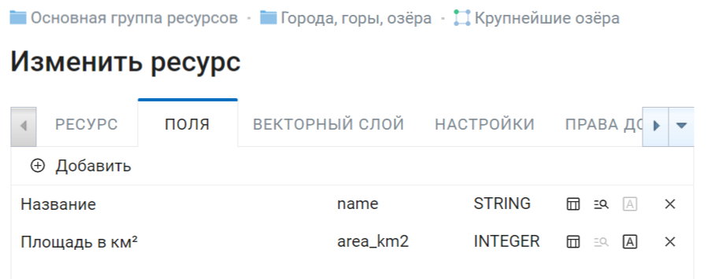

   Вкладка "Поля"

Колонки таблицы:

* Наименование атрибутивного поля - псевдоним для отображения вместо технического ключа поля в окне идентификации.
* Ключ - техническое название поля, должно содержать только простую латиницу
* Тип поля

Для следующих трех параметров темный значок в таблице означает "включен", светлый - "выключен". Их можно изменять, нажимая на значки, или в диалоге редактирования атрибута.

* |attr_table_symbol| Таблица объектов - обозначает, что содержимое этого поля выводится в окне идентификации.
* |attr_text_search_symbol| Текстовый поиск - можно отключить поиск по значениям этого атрибута.
* |attr_label_symbol| Атрибут наименование - значение из этого поля будет использоваться как название объекта на карте.

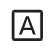

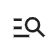

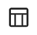

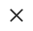

В конце строки находится кнопка:

* |attr_delete_symbol| Удалить объект

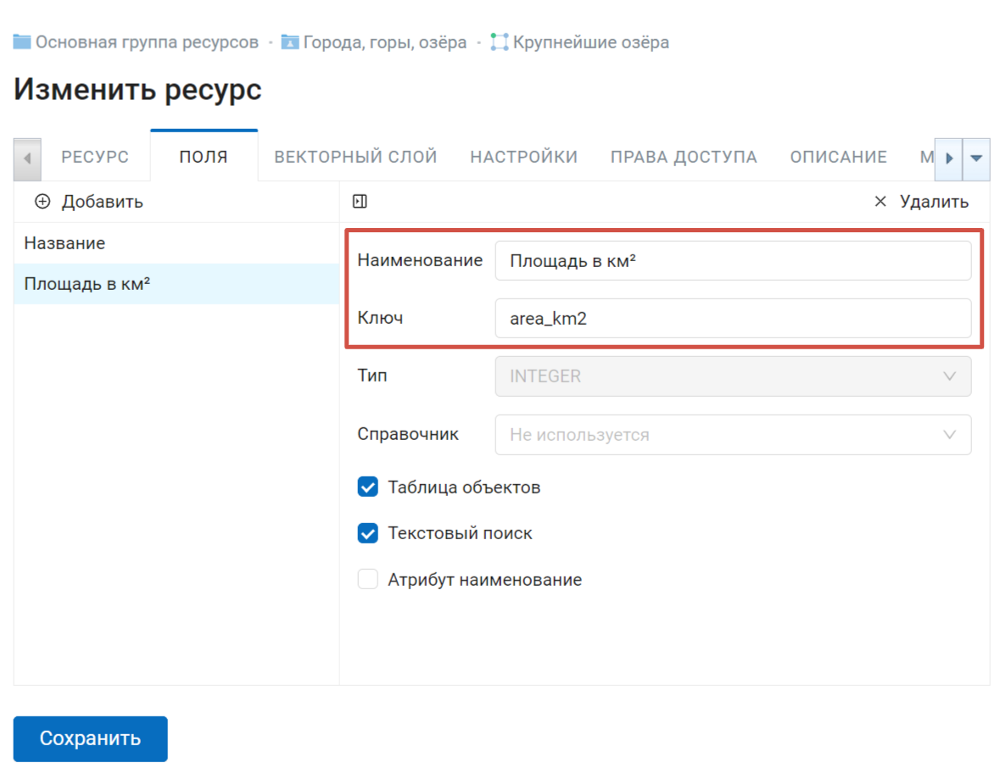

   Диалог редактирования атрибутивного поля. Наименование поля с верхним индексом и его ключ выделены

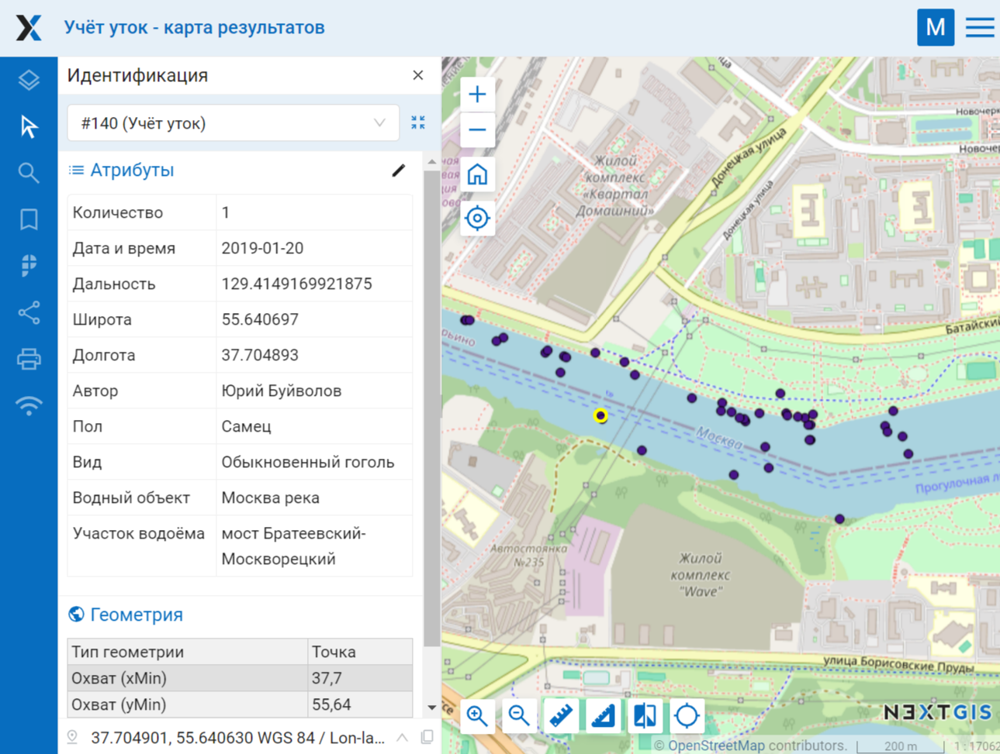

   Окно идентификации. Отображаются наименования полей на русском языке

При редактировании атрибута также можно подключить `справочник <https://docs.nextgis.ru/docs_ngweb/source/create_other.html#ngw-create-lookup-table>`_, из которого будут браться значения атрибута при добавлении или редактировании объектов. Для того, чтобы добавить справочник, нажмите на поле и выберите во всплывающем окне соответствующий ресурс.

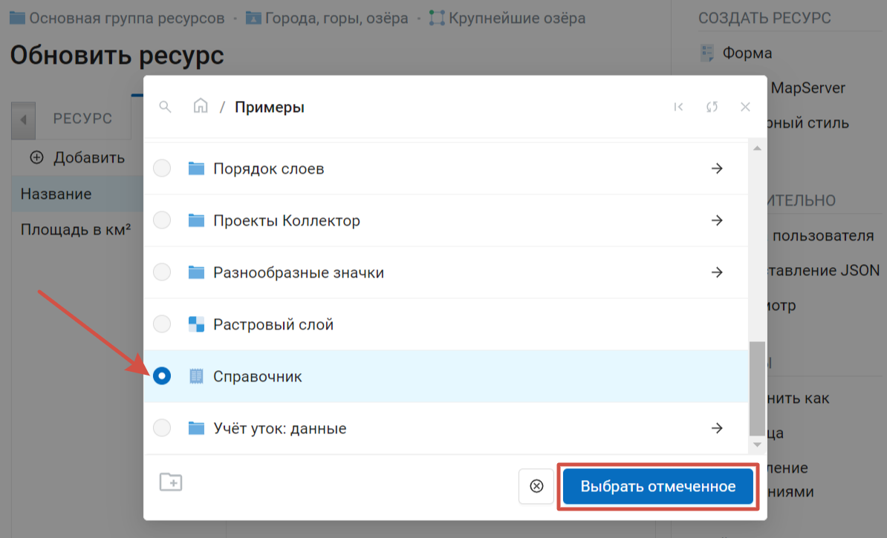

   Добавление справочника

Чтобы вернуться в режим таблицы, нажмите стрелочку в верхнем ряду.

После внесения изменений нажмите **Сохранить**.

.. _ngw_vector_file_replace:

Очистка и замена слоя
-------------------------

В NextGIS Web можно удалить все объекты слоя или заменить их, загрузив другой файл.

Нажмите на значок карандаша напротив выбранного слоя. Во вкладке "Векторный слой" выберите необходимое действие в выпадающем меню.

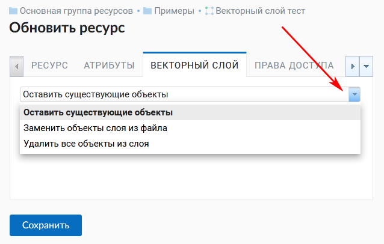
   
   Варианты изменения файла слоя

Вы можете удалить все объекты, оставив пустой слой со структурой для дальнейшего наполнения. Для этого выберите "Удалить все объекты из слоя", поставьте флажок для подтверждения удаления и нажмите **Сохранить**.

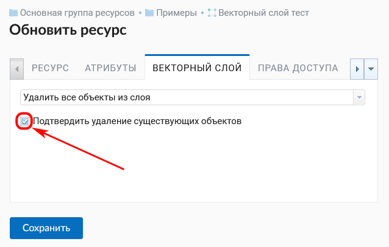
   
   Очистка слоя с удалением всех объектов

Можно заменить все объекты другими, использовав заранее подготовленный файл. Для этого выберите "Заменить объекты слоя из файла". Откройте нужный файл или перетащите его в пунктирную рамку. 

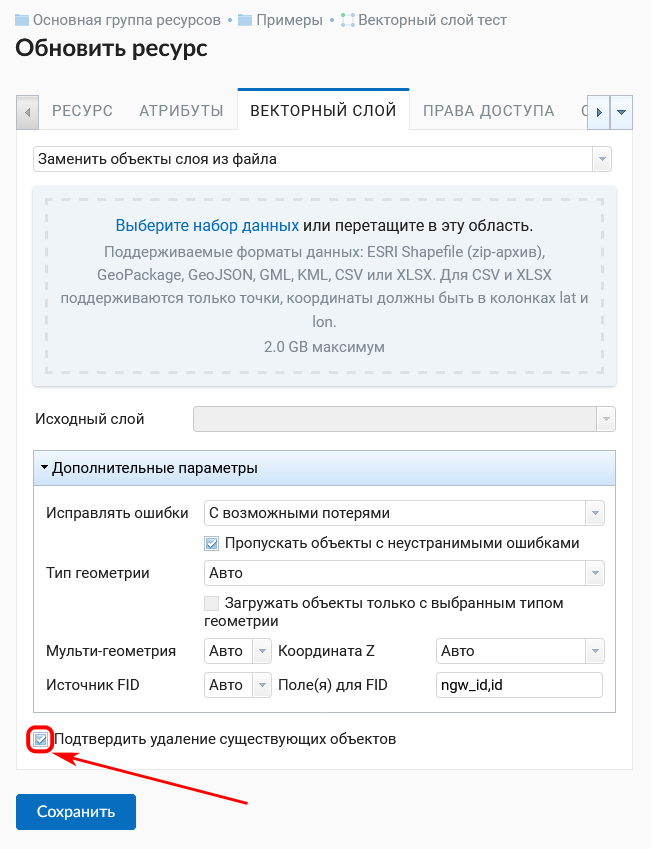
   
   Замена файла слоя

Если файл содержит несколько слоёв, выберите необходимый в поле "Исходный слой". Также можно настроить другие параметры загрузки файла, как и при создании нового векторного слоя.

При замене файла структура атрибутов, тип геометрии и другие параметры будут изменены в соответствии с новым загруженным файлом.

.. note:
   При перезаписи можно выбрать файл с другим типом геометрии. При этом скорее всего перестанут работать все связанные с векторным слоем стили, поскольку в них задано отображение данных другой геометрии.

.. _ngw_allow_edit:

Настройка прав доступа к редактированию объектов на веб-карте
---------------------------------------------------------------

По умолчанию редактирование веб-карты всегда отключено. Чтобы пользователь смог вносить изменения в слои на карте, редактирование нужно включить в настройках веб-карты. Изменить доступность возможности редактирования можно в окне "Обновить ресурс" Веб-карты. Как открыть это окно, описано в разделе :ref:`Обновление ресурса <ngw_update_resource>`.

На вкладке "Настройки" можно разрешить или запретить редактирование всех слоев карты, поставив или сняв галочку напротив опции «Разрешить редактирование слоев» (см. :numref:`webmap_allow_editting`), соответственно:

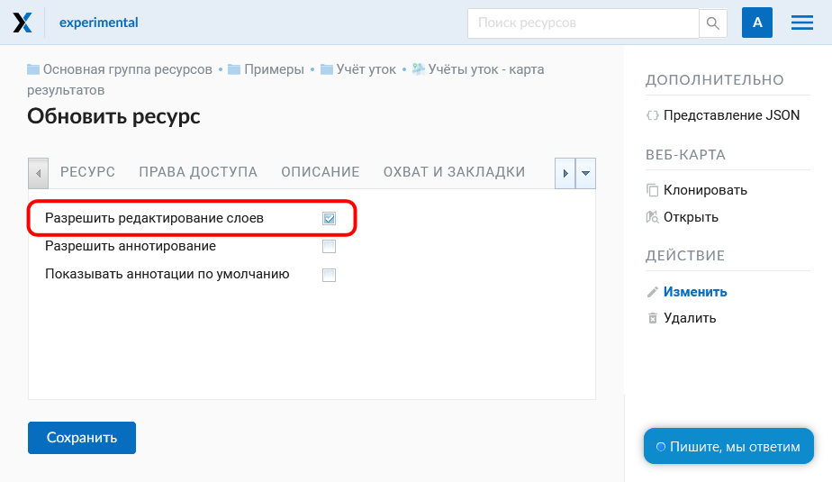

   Опция «Разрешить редактирование слоев»

.. note:: 
	По умолчанию редактирование слоев отключено.
	
Для того, чтобы запретить редактирование определенных слоев отдельным пользователям, на вкладке «Права доступа» окна "Обновить ресурс" необходимо добавить правило, которое запретит записывать данные (право «Ресурс: изменение» / data:write) определенному пользователю или группе пользователей (см. :numref:`webmap_forbid_editting`). Если у человека недостаточно прав, он не сможет перейти в режим редактирования.

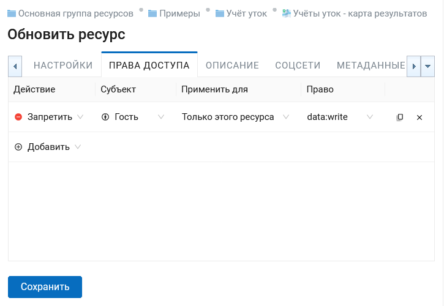

   Изменение прав доступа к редактированию для отдельных пользователей

.. _ngw_edit_objects:

Редактирование векторного объекта 
--------------------------------------------

Вы можете редактировать **геометрии и атрибуты** объектов в Векторных слоях через веб-интерфейс или `с помощью настольного приложения QGIS <https://docs.nextgis.ru/docs_ngconnect/source/edit.html>`_.

1. Откройте `Веб-карту <https://docs.nextgis.ru/docs_ngweb/source/webmaps_client.html>`_ и найдите слой, в котором находится редактируемый объект.
2. Откройте выпадающее меню, нажав на три точки справа от имени слоя (см. :numref:`webmap_edit`), и поставьте галочку напротив пункта "Редактирование".

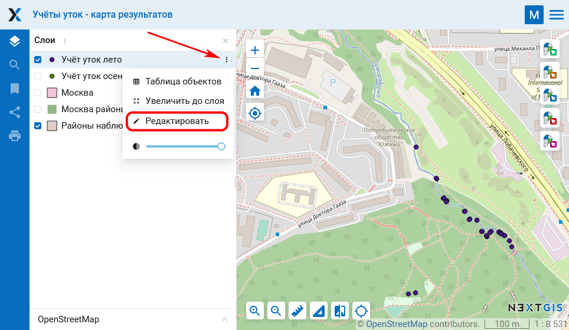

   Меню слоя на веб-карте

3. На Веб-карте появится панель инструментов, позволяющая провести редактирование (см. :numref:`webmap_edit_panel`):

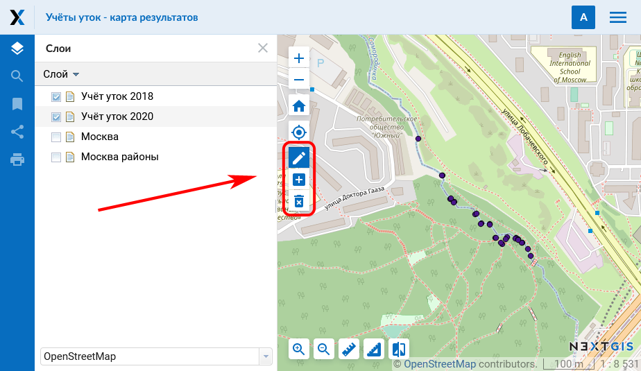

   Панель инструментов для редактирования
   

.. _ngw_create_objects:

Создание нового объекта (точка, линия, полигон)
~~~~~~~~~~~~~~~~~~~~~~~~~~~~~~~~~~~~~~~~~~~~~~~~

1. На панели инструментов для редактирования нажмите кнопку "Создать объекты" (иконка с белым крестиком на синем поле, см. :numref:`webmap_create_objects`):

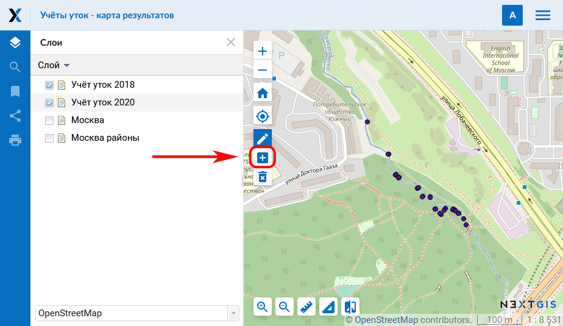

   Кнопка "Создать объекты" на панели инструментов для редактирования

2. Возле курсора мыши появится синий кружок, с помощью которого можно добавлять новые объекты. Щелкните в том месте карты, где необходимо создать новый объект. 

3. Отроется окно ввода значений атрибутов объекта. Заполните хотя бы одно поле и нажмите **ОК**. Чтобы очистить форму, нажмите **Сбросить**.

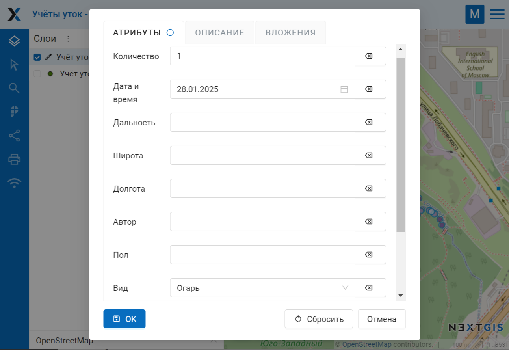

   Введение атрибутов нового объекта

Можно добавить несколько новых объектов подряд. При создании линии необходимо щелчками на карте указать положение ее начала и конца. При создании полигона каждый последующий щелок будет указывать положение очередного его узла, чтобы завершить создание полигона, необходимо щелкнуть по его начальной точке. При создании узлов будет работать прилипание.

4. Для того, чтобы завершить создание новых объектов, нажмите "Завершить редактирование" в меню слоя.
5. Откроется диалоговое окно, в котором необходимо выбрать, сохранять ли внесенные изменения, не сохранять или остаться в режиме редактирования (для этого нажмите "Отменить"):

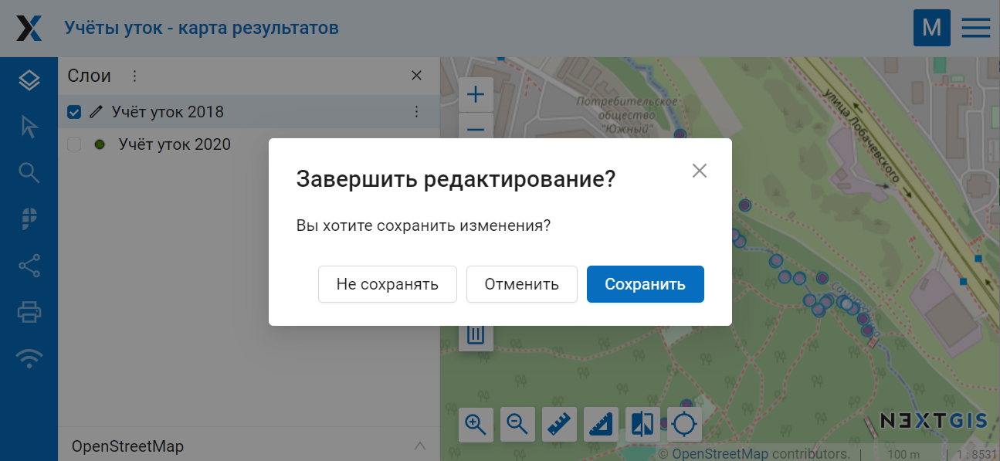

   Диалоговое окно завершения редактирования

.. _ngw_delete_objects:

Удаление объекта
~~~~~~~~~~~~~~~~

1. На панели инструментов для редактирования нажмите кнопку "Удалить объекты" (иконка с корзиной, см. :numref:`webmap_delete_objects`):

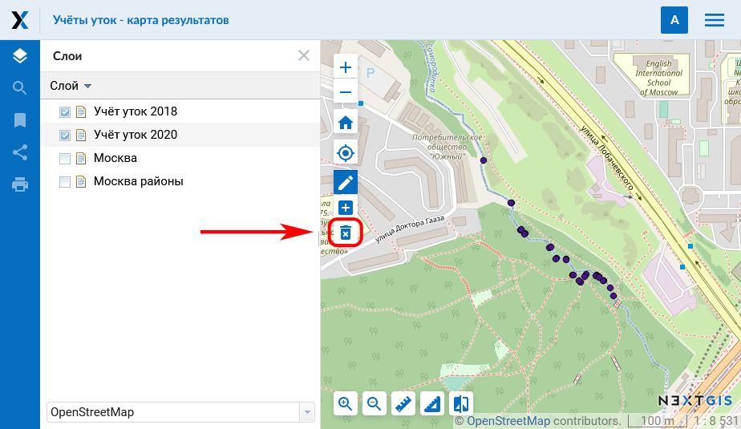

   Кнопка "Удалить объекты" на панели инструментов для редактирования

2. Объекты, положение которых можно изменить, изменят интенсивность цвета на более слабую. Курсор превратится в черный крестик.

3. Выберите на карте объекты, которые хотите удалить, щелкнув по ним курсором мыши. Выбранные объекты снова станут темными.

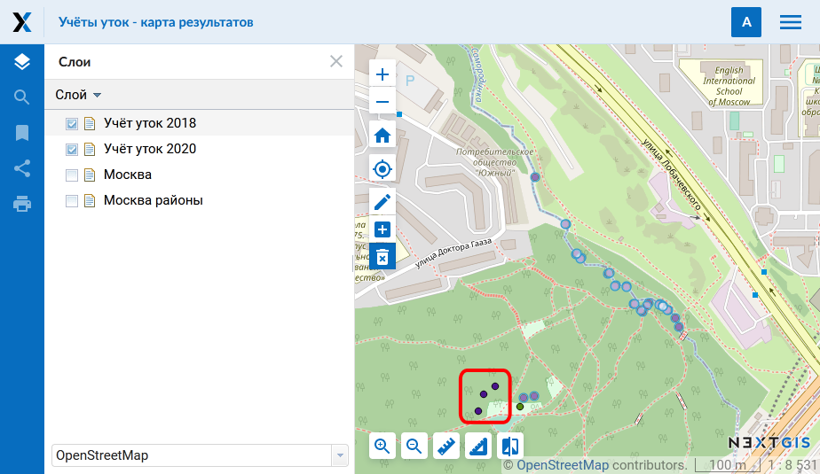
   
   Слой с фиолетовыми маркерами активен. Рамкой показаны точки, выбранные для удаления
   
4. Для того, чтобы завершить удаление объектов, нажмите "Завершить редактирование" в меню слоя.
5. Откроется диалоговое окно, в котором необходимо выбрать "Сохранить", чтобы завершить процесс удаления (см. :numref:`webmap_finish_edit`).

.. _ngw_move_objects:

Изменение положения объекта или его узлов
~~~~~~~~~~~~~~~~~~~~~~~~~~~~~~~~~~~~~~~~~~~

1. Убедитесь, что на панели инструментов для редактирования нажата кнопка "Изменить объекты" (иконка с карандашом, она активна по умолчанию при переходе в режим редактировния, см. :numref:`webmap_change_objects`):

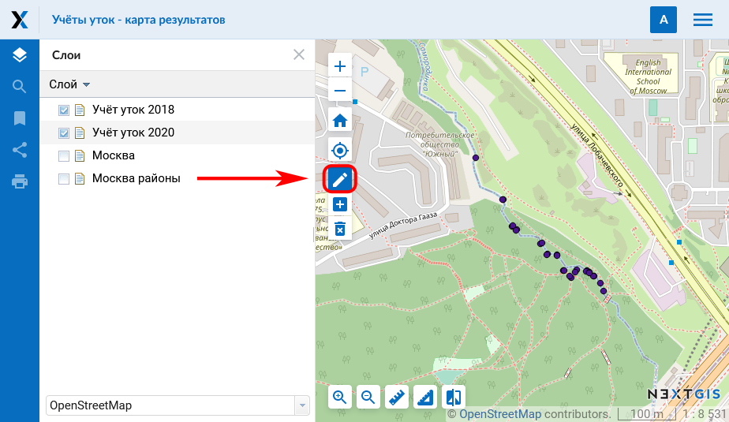

   Кнопка "Изменить объекты" на панели инструментов для редактирования

2. Объекты, положение которых можно изменить, сменят интенсивность цвета на более слабую.
3. Наведите курсор на объект (точка) или один из его узлов (линия, полигон) и переместите его, зажав левую кнопку мыши и отпустив ее на новом месте. При перемещении узлов будет работать прилипание.

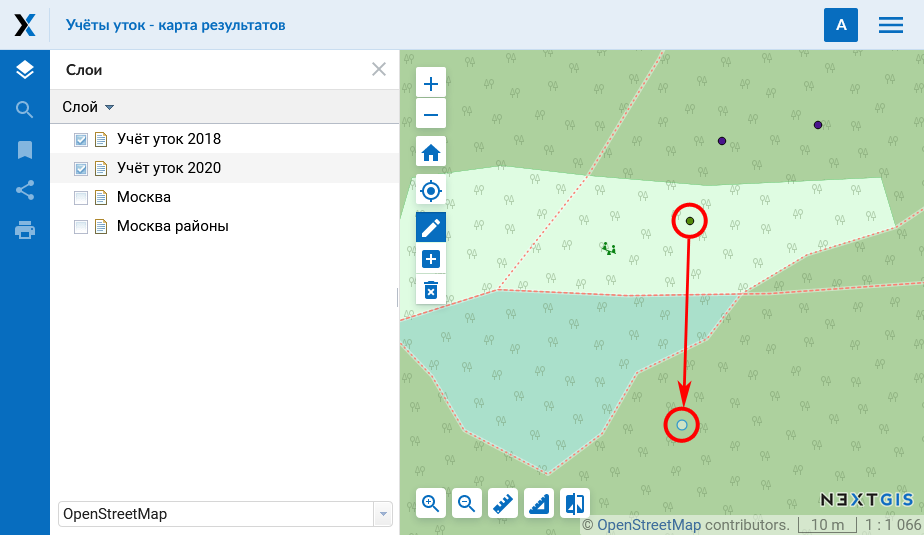
   
   Перемещение точки. До завершения редактирования на карте отображается одновременно старое и новое положение выбранной точки

4. Для завершение перемещения нажмите "Завершить редактирование" в меню слоя.
5. Откроется диалоговое окно, в котором необходимо выбрать "Сохранить", чтобы завершить процесс изменения (см. :numref:`webmap_finish_edit`).

.. note:: 
	Одновременно можно редактировать несколько слоев. Для этого необходимо зайти в режим редактирования в каждом слое, который нужно изменить. Прилипание в этом случае будет работать к объектам всех редактируемых слоев.

.. _ngw_vertices:

Добавление и удаление узлов
~~~~~~~~~~~~~~~~~~~~~~~~~~~~

Для того, чтобы удалить лишний узел, в режиме редактирования объекта нужно зажать клавишу **Shift** и кликнуть по этому узлу. 

Чтобы добавить узел, нажмите на линию между двумя существующими узлами и потяните к нужной точке.

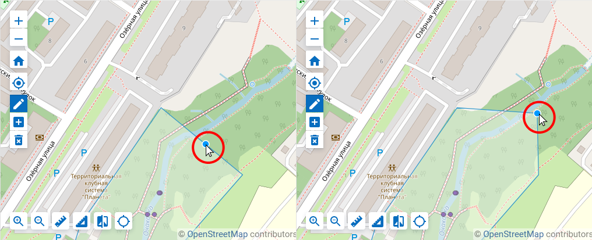
   
   Создание нового узла

.. _ngw_attributes:

Редактирование значений атрибутов
----------------------------------

Программное обеспечение NextGIS Web позволяет редактировать атрибуты географических 
объектов. Редактирование атрибутов можно вызывать из административного интерфейса
и из режима просмотра веб-карты. 

* Редактирование атрибутов из административного интерфейса: 

  - Нажать на значок таблицы напротив векторного слоя или открыть этот слой, а затем в блоке операций выбрать действие над слоем - "Таблица объектов" (см. :numref:`ngweb_Object_table`).
  - Откроется таблица. Кликнуть на нужную строку в таблице, она будет выделена желтым. 
  - Нажать на кнопку "Редактировать" над таблицей (см. :numref:`ngweb_editing_attributes2.7`).

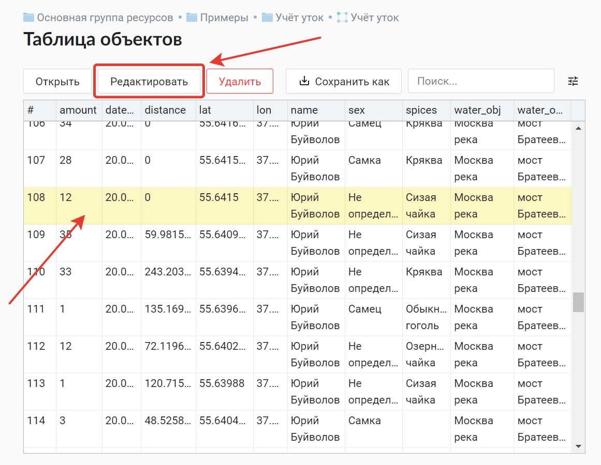
   
   Редактирование атрибутов из административного интерфейса

* Редактирование атрибутов при просмотре карты: 
  
  - Открыть веб-карту.
  - Выбрать объект и нажать на него инструментом идентификации. 
  - В панели идентификации нажать на кнопку редактирования (см. :numref:`ngweb_editing_when_viewing_map`).

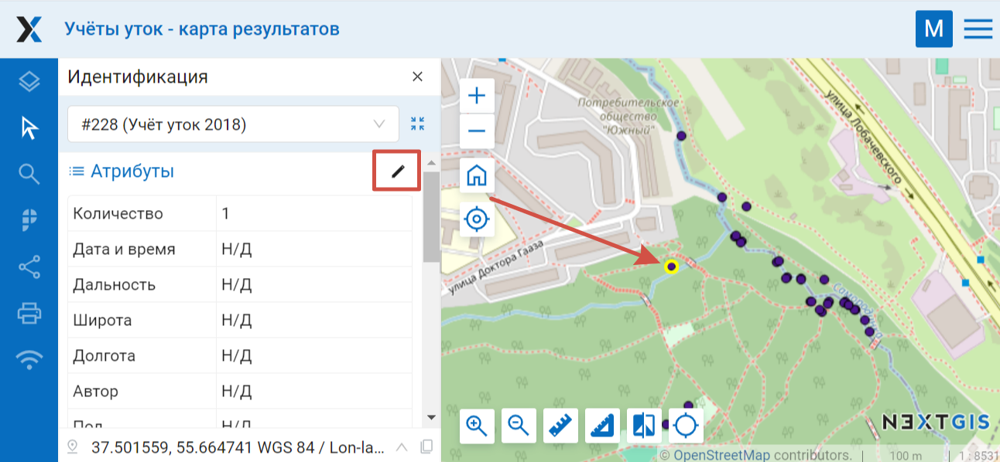

   Переход к редактированию атрибутов при просмотре карты

В открывшемся всплывающем окне можно изменять значения атрибутов. Описание, заданное на вкладке "Описание", будет видно при просмотре карты в окне идентификации. 

В окне редактирования атрибутов слоя имеются следующие вкладки:

* вкладка "Атрибуты" (см. :numref:`ngweb_tab_attributes`)

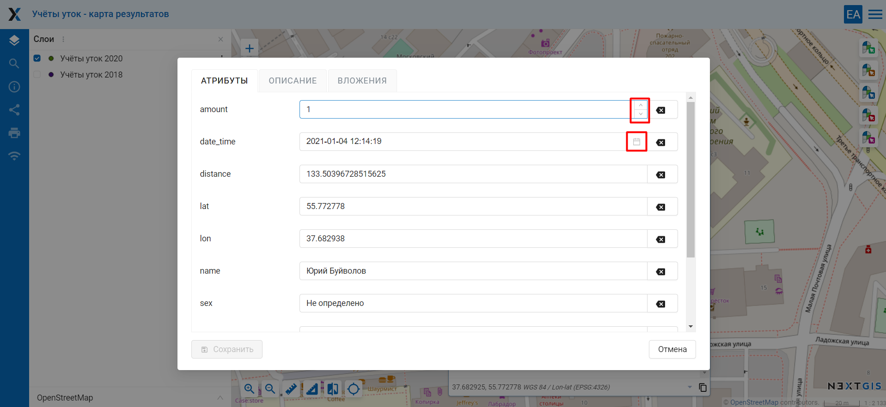
 
   Вкладка "Атрибуты"

Для редактирования атрибута просто кликните на нужной строчке. 

Числовые атрибуты можно вводить вручную или изменять, нажимая на стрелки, появляющиеся в правом конце поля. 

Дату также можно ввести вручную или выбрать в календаре - чтобы вызвать его, нажмите иконку в правом конце поля.

К текстовым полям можно подключить Справочник, тогда значение будет выбираться из выпадающего списка.

* вкладка "Вложения" (см. :numref:`ngweb_tab_attachment`)

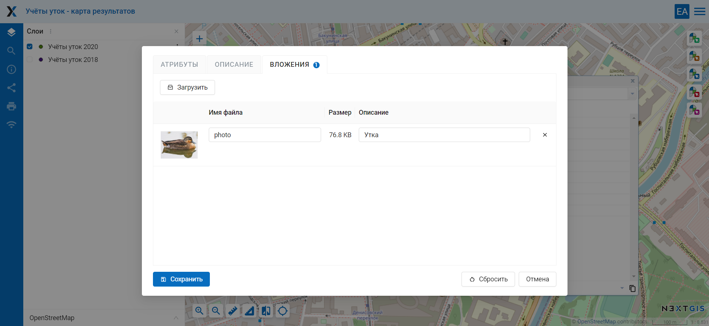
 
   Вкладка "Вложения"

* вкладка "Описание" (см. :numref:`ngweb_tab_description`)

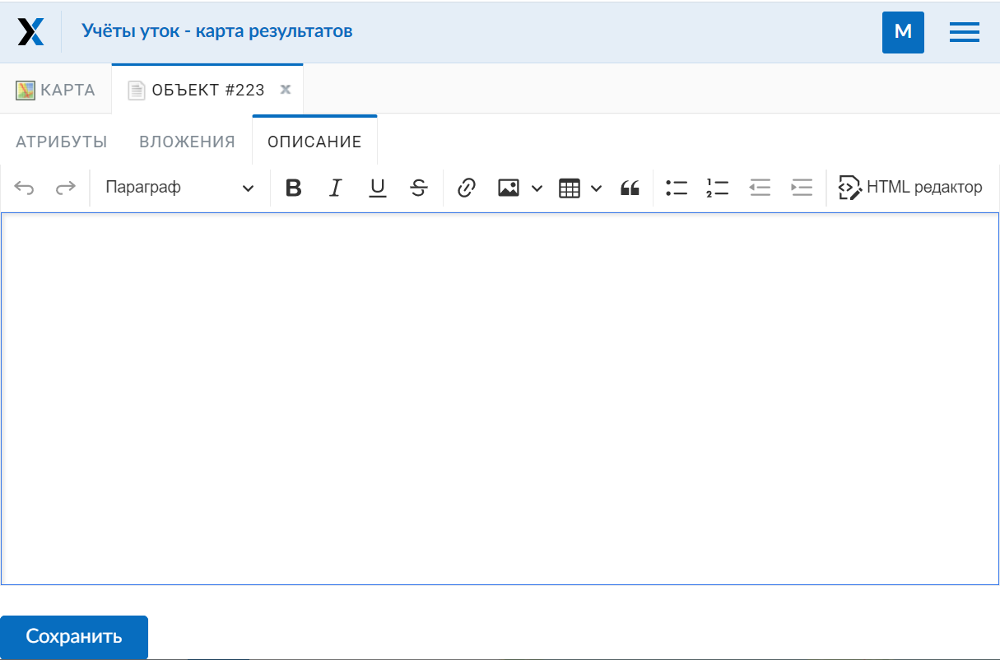

   Вкладка "Описание"

.. note::
   При редактировании слоя из PostGIS изменения атрибутов сохраняются в PostGIS, 
   а описания - в локальной базе. При редактировании слоя из Shapefile изменения 
   атрибутов и описания сохраняются в локальной базе.

.. note::
   Геоданные с изменёнными атрибутами можно выгрузить по ссылке "Загрузить GeoJSON" 
   или раздав слой по протоколу WFS. Функционала выгрузки описаний нет.

.. _ngw_attachments:

Вложения
------------

Программное обеспечение NextGIS Web позволяет прикреплять к записям фотографии, панорамы и другие файлы. 
При этом, при идентификации объекта на карте в панели идентификации будет отображены 
как атрибуты объекта, так и вложения, которые были ему сопоставлены (см. :numref:`attachm_tab_pic`).

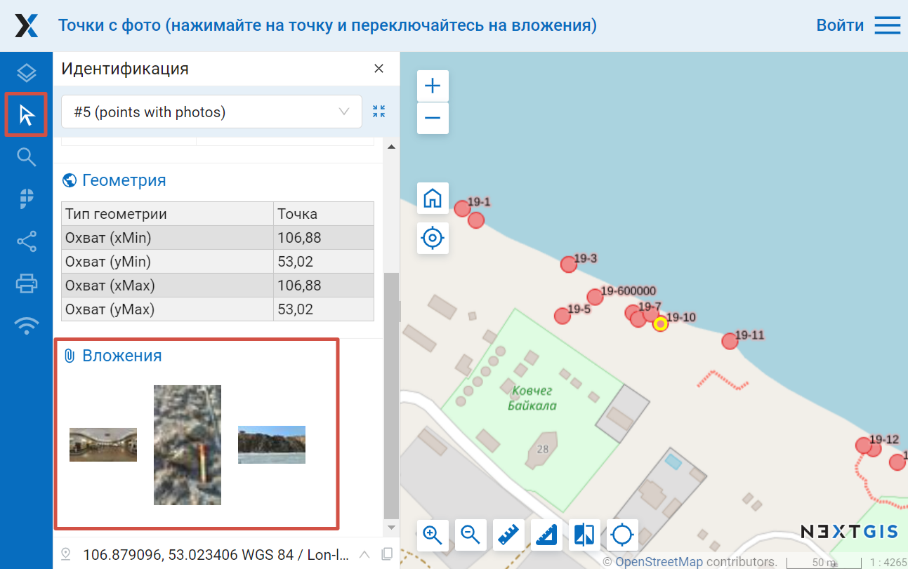

   Вложения на карточке объекта

Для просмотра из веб-интерфейса поддерживаются форматы:

* Изображения JPEG, PNG. Формат GIF не поддерживается.
* Панорамы, соответствующие `спецификации <https://developers.google.com/streetview/spherical-metadata?hl=ru>`_.

Можно прикрепить и любые другие файлы, если их не нужно просматривать непосредственно с карты.

При нажатии на фотографию открывается лайтбокс (всплывающее окно в браузере, работающее 
на JavaScript). Размер фотографии вписывается в окно. Фотографии подписываются, 
пользователю можно переходить между фотографиями, используя клавиши вправо-влево 
на клавиатуре (см. :numref:`ngweb_webmap_identification_photo_lightbox`).

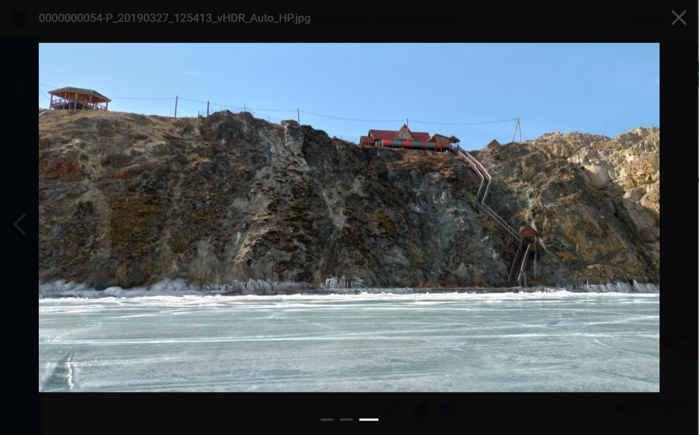

   Развернутая фотография во всплывающем окне

Навигация по панорамам осуществляется мышью. Зажимайте левую кнопку мыши и вращайте камеру. Колёсиком приближайте и отдаляйте обзор. Режим панорамы у снимка можно отключать (круглая синяя кнопка в верхнем углу).

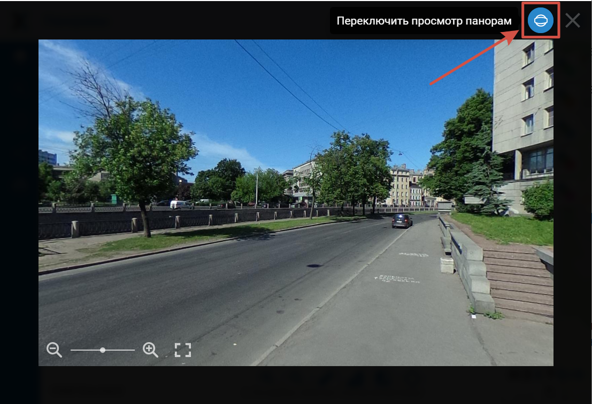

   Панорама, открытая с веб-карты

.. _ngw_add_photos:

Добавление вложений к единичному объекту
~~~~~~~~~~~~~~~~~~~~~~~~~~~~~~~~~~~~~~~~~

Чтобы прикрепить файл к объекту, откройте окно редактирования. Его можно вызвать разными способами:

* Кликнуть на нужном объекте на веб-карте и во всплывающем окошке нажать кнопку редактирования.
* Открыть на карте таблицу объектов, выделить нужный и нажать кнопку **Редактировать**.
* Открыть таблицу объектов со страницы ресурса, выделить нужную строку и нажать кнопку **Редактировать**.

В окне редактирования откройте вкладку "Вложения" и загрузите файлы. 

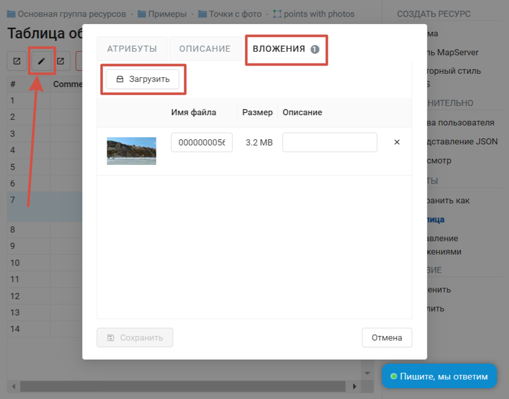

   Добавление вложения

Введите подписи и нажмите "Сохранить".

Теперь при просмотре карты в окне идентификации на вкладке "Вложения" 
видны превью фотографий (см. :numref:`attachm_tab_pic`).

.. note:: 
   По умолчанию вложения могут добавлять все пользователи, но можно настроить 
   так, чтобы добавлять могли только отдельные пользователи (см. 
   `Как настроить права доступа <https://docs.nextgis.ru/docs_ngcom/source/permissions.html>`_).

Можно редактировать имя файла и описание ранее добавленных вложений. Чтобы удалить вложение, нажмите на крестик справа от него. Если при редактировании вы ошиблись, нажмите кнопку **Сбросить**, внесённые изменения будут отменены.   

Для удаления вложения следует выделить его в окне редактирования атрибутов слоя на вкладке "Вложения", нажать кнопку "Удалить", а затем нажать кнопку "Сохранить".

Процесс загрузки вложений также представлен в видео:

.. raw:: html

   <iframe width="560" height="315" src="https://rutube.ru/play/embed/9f0d58e1850b6740b1823763da6dfc97/" frameBorder="0" allow="clipboard-write; autoplay" webkitAllowFullScreen mozallowfullscreen allowFullScreen></iframe>

Посмотреть на `youtube <https://youtu.be/MMPhQeLXZDQ>`_, `rutube <https://rutube.ru/video/9f0d58e1850b6740b1823763da6dfc97/>`_.

.. _ngw_attachments_panoramas:

Использование панорам
~~~~~~~~~~~~~~~~~~~~~~~

К объектам можно добавлять не только фографии, но и панорамы. Они дают возможность погружаться в новые локации и изучать детали уже знакомых мест.

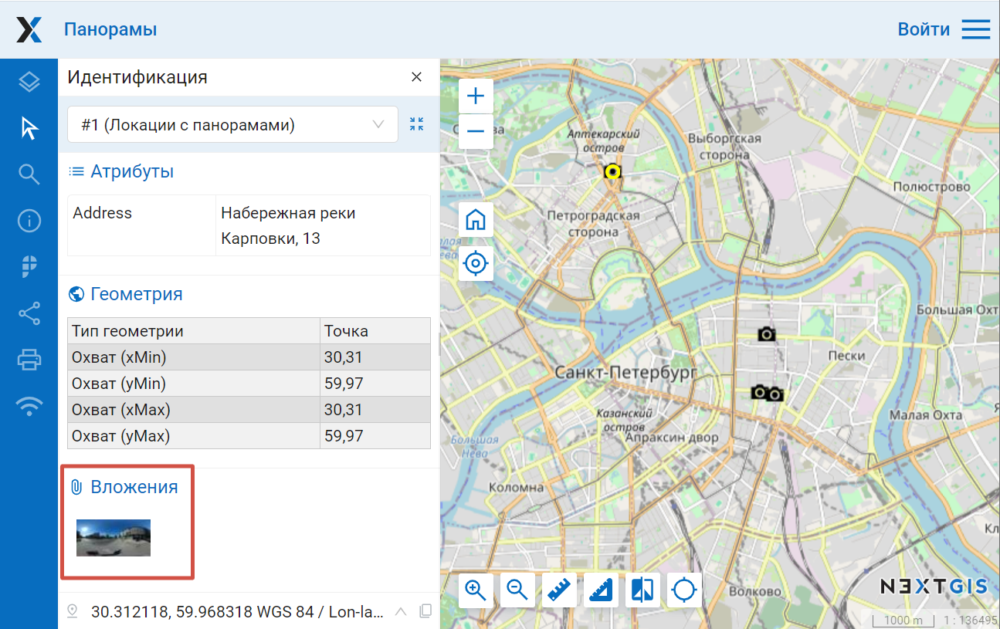

   Превью панорамы в карточке объекта

Загружаемые панорамные снимки должны соответствовать спецификации `Google XMP Photo Sphere <https://developers.google.com/streetview/spherical-metadata?hl=ru>`_.

Работа с панорамами представлена в видео:

.. raw:: html

   <iframe width="560" height="315" src="https://rutube.ru/play/embed/d1f08ddae9780ce93246f8e81748d4c4/" frameBorder="0" allow="clipboard-write; autoplay" webkitAllowFullScreen mozallowfullscreen allowFullScreen></iframe>

Посмотреть на `youtube <https://youtu.be/X5c2Wy1CItw>`_, `rutube <https://rutube.ru/video/d1f08ddae9780ce93246f8e81748d4c4/>`_.

.. _ngw_attachments_imp_exp:

Экспорт и импорт вложений
~~~~~~~~~~~~~~~~~~~~~~~~~~~

Для копирования вложений между слоями или создания резервной копии все вложения слоя можно экспортировать в виде архива (При стандартном сохранении слоя они включены в файл не будут). 

На странице слоя выберите действие **Управление вложениями**.

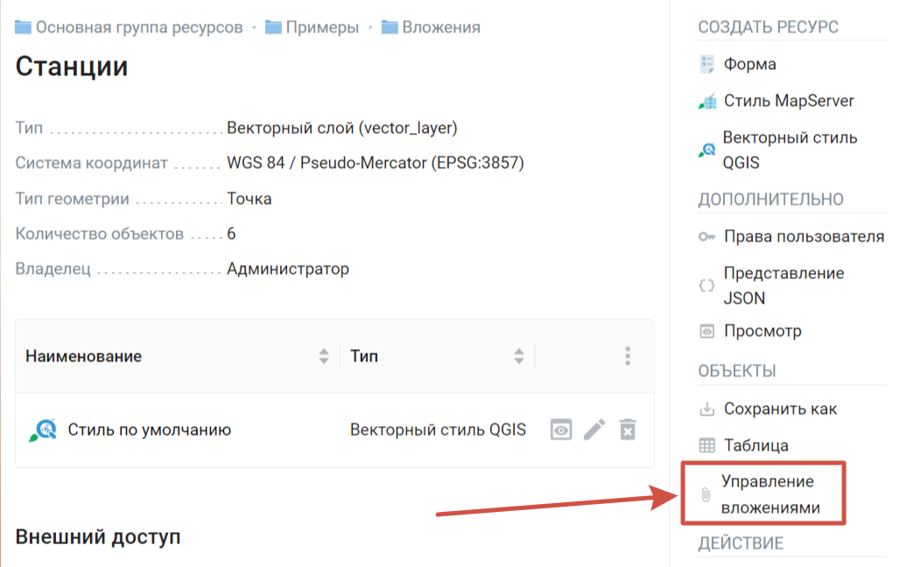

   Управление вложениями

Для того, чтобы сохранить вложения, выберите вкладку **Экспорт** и нажмите кнопку **Экспортировать вложения в ZIP-архив**. Полученный архив будет содержать все вложения в директориях с именами объектов. Метаданные вложений сохраняются в отдельном JSON-файле.

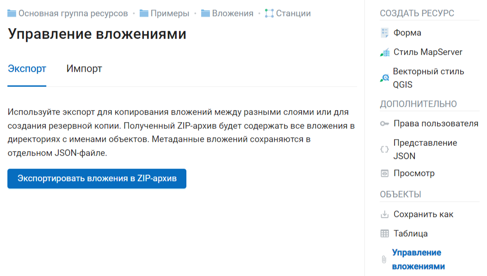

   Экспорт вложений на устройство

Полученный таким образом архив можно импортировать, чтобы добавить вложения к слою. Для этого откройте вкладку **Импорт**, нажмите **Импортировать вложения из ZIP-архива** и выберите на устройстве соответствующий файл. Архив должен содержать директории названные по идентификаторам объектов. Каждая директория может содержать одно или несколько вложений. Дубликаты будут пропущены. Если нужно заменить ранее добавленные вложения, отметьте галочку "Удалить существующие вложения".

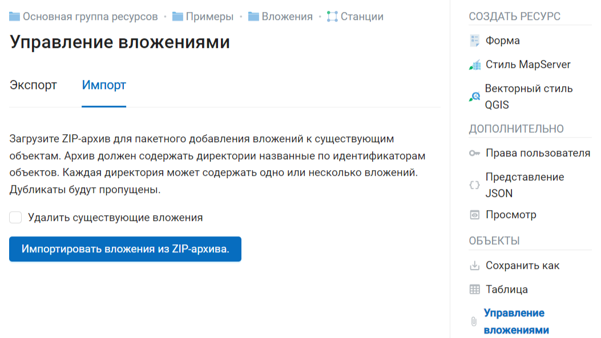

   Импорт вложений из архива

Процесс импорта и экспорта вложений также представлен в видео:

.. raw:: html

   <iframe width="560" height="315" src="https://rutube.ru/play/embed/62233baae1d2c10e21ad4709ecffe5cc/" frameBorder="0" allow="clipboard-write; autoplay" webkitAllowFullScreen mozallowfullscreen allowFullScreen></iframe>

Посмотреть видео на `youtube <https://youtu.be/8R4uY5CCE3w>`_, `rutube <https://rutube.ru/video/62233baae1d2c10e21ad4709ecffe5cc/>`_.
