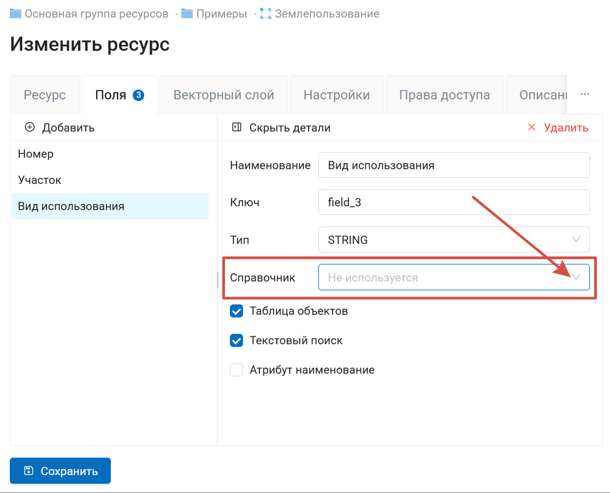
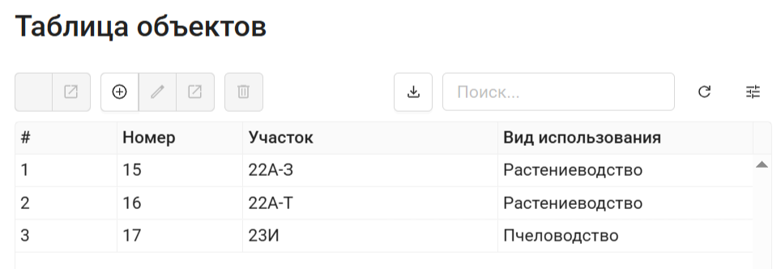
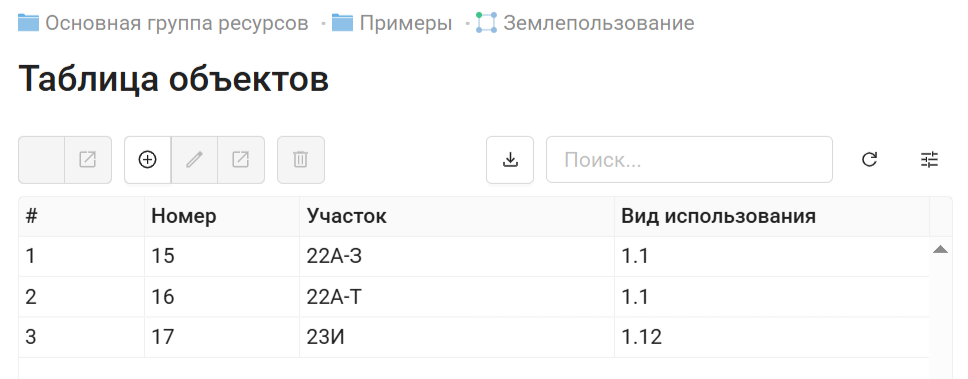
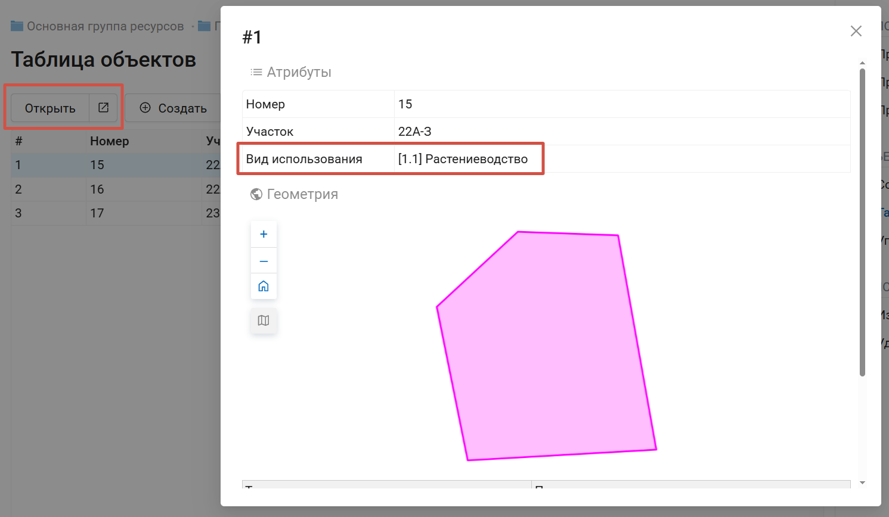

.. _ngw_change_layers:

Настройки векторного слоя
========================================

Для изменения основных параметров слоя необходимо `авторизоваться в Веб ГИС <https://docs.nextgis.ru/docs_ngweb/source/admin_interface.html#ngw-admin-login>`_.

Чтобы изменить настройки слоя, перейдите к группе, где он находится (см. :numref:`ngweb_main_page_administrative_interface_pic`, п.5) и нажмите на значок карандаша напротив нужного слоя. При этом откроется окно `изменения ресурса <https://docs.nextgis.ru/docs_ngweb/source/edit_resource.html>`_.

 Помимо стандартных для всех типов ресурсов настроек (родитель, описание, метаданные, права доступа) здесь можно 
 
 * `очистить слой <https://docs.nextgis.ru/docs_ngweb/source/layers_settings.html#ngw-vector-file-replace>`_, 
 * `заменить файл данных на новый <https://docs.nextgis.ru/docs_ngweb/source/layers_settings.html#ngw-vector-file-replace>`_, 
 * изменить `набор и псевдонимы полей <https://docs.nextgis.ru/docs_ngweb/source/layers_settings.html#ngw-attributes-edit>`_, 
 * включать и выключать версионирование слоя

Версионирование позволяетт нескольким пользователям редактировать синхронизируемый слой в настольном приложении QGIS `при помощи NextGIS Connect <https://docs.nextgis.ru/docs_ngconnect/source/edit.html#>`_.

.. figure:: _static/create_vector_layer_vers_ru.png
   :name: create_vector_layer_vers_pic
   :align: center
   :width: 16cm

   Включение версионирования слоя

В Панели управления вы можете настроить, чтобы версионирование было включено по умолчанию `для всех создаваемых Веб ГИС векторных слоёв <https://docs.nextgis.ru/docs_ngweb/source/version.html#vers-ngw-default>`_.

:ref:`Веб ГИС <ngcom_description>` позволяет `редактировать <https://docs.nextgis.ru/docs_ngweb/source/layers_settings.html>`_ объекты на карте и их атрибуты,  добавлять описания отдельных объектов и `вложения <https://docs.nextgis.ru/docs_ngweb/source/layers_settings.html#ngw-attachments>`_ (в том числе фотографии) в Векторных слоях  и `Слоях PostGIS <https://docs.nextgis.ru/docs_ngweb/source/postgis_details.html>`_.  `Включить возможность редактирования <https://docs.nextgis.ru/docs_ngweb/source/feature_edit.html#ngw-allow-edit>`_ объектов и аннотаций можно в настройках веб-карты. 

.. _ngw_attributes_edit:

Поля векторного слоя
------------------------------------

Вкладка "Поля" содержит таблицу, в которой перечислены поля (атрибуты) выбранного слоя (см. :numref:`ngweb_admin_layers_attr`). На этой вкладке можно:

* |button_plus_layer| Добавить новое поле
* |attr_delete_symbol| Удалить поле, нажав на крестик в конце строки
* Редактировать поле. Кликните на строку таблицы, чтобы открыть форму редактирования.

.. |button_plus_layer| image:: _static/button_plus_layer.png
   :width: 6mm

.. |attr_delete_symbol| image:: _static/attr_delete_symbol.png
   :width: 6mm

.. figure:: _static/vector_fields_ru_2.png
   :name: ngweb_admin_layers_attr
   :align: center
   :width: 16cm

   Вкладка "Поля"

Параметры полей:

* Наименование атрибутивного поля - псевдоним для отображения вместо технического ключа поля в окне идентификации.
* Ключ - техническое название поля, должно содержать только простую латиницу

.. figure:: _static/key_field_name_ru_2.png
   :name: key_field_name_pic
   :align: center
   :width: 20cm    

   Диалог редактирования атрибутивного поля. Наименование поля с верхним индексом и его ключ выделены

.. figure:: _static/webmap_identification_rus_3.png
   :name: ngweb_webmap_identification
   :align: center
   :width: 20cm

   Окно идентификации. Отображаются наименования полей на русском языке

* Тип поля

Тип поля определяет, какие значения можно в него добавлять. Например, если вы выберете целочисленный тип, то ввести строку (текст) вы в него не сможете. Если вы не уверены какой тип выбрать - выбирайте текстовый (STRING). Доступные типы полей:

* INTEGER - целочисленное значение. Можно ввести только цифры от -2147483647 до 2147483647.
* BIGINT - большое целочисленное значение. Можно ввести только цифры от -9223372036854775807 до 9223372036854775807.
* REAL - числа с плавающей запятой. Можно ввести только цифры в формате 44.4444.
* STRING - текстовое (строковое) значение. Строка любой длины. 
* DATE - дата. 
* TIME - время.
* DATETIME - дата и время;
* BOOLEAN - логическое поле, возможные значения "Истина" и "Ложь".

Для следующих трех параметров темный значок в таблице означает "включен", светлый - "выключен". Их можно изменять, нажимая на значки, или в диалоге редактирования атрибута.

* |attr_table_symbol| Таблица объектов - если снять этот флажок, поле не будет отображаться в таблице объектов и панели идентификации.
* |attr_text_search_symbol| Текстовый поиск - можно отключить поиск по значениям этого атрибута.
* |attr_label_symbol| Атрибут наименование - значение из этого поля будет использоваться как название объекта при `поиске <https://docs.nextgis.ru/docs_ngweb/source/webmaps_client.html#ngw-webmaps-client-search>`_, `идентификации <https://docs.nextgis.ru/docs_ngweb/source/webmaps_client.html#ngw-webmaps-client-ident>`_ и добавлении в `закладки <https://docs.nextgis.ru/docs_ngweb/source/webmaps_admin.html#ngw-map-bookmarks>`_.

.. note:: Если вы хотите задать поле, значение которого будет использоваться в качестве подписи объекта на карте, это можно сделать через `настройки стиля <https://docs.nextgis.ru/docs_ngweb/source/mapstyles.html#ngw-qgis-style-custom>`_.

.. |attr_label_symbol| image:: _static/attr_label_symbol.png
   :width: 6mm

.. |attr_text_search_symbol| image:: _static/attr_text_search_symbol.png
   :width: 6mm

.. |attr_table_symbol| image:: _static/attr_table_symbol.png
   :width: 6mm

При редактировании атрибута также можно `подключить справочник <https://docs.nextgis.ru/docs_ngweb/source/layers_settings.html#lookup-add-to-field>`_, из которого будут браться значения атрибута при добавлении или редактировании объектов. 

Чтобы вернуться в режим таблицы, нажмите стрелочку в верхнем ряду.

После внесения изменений нажмите **Сохранить**.

.. _lookup_add_to_field:

Подключение справочника к полю векторного слоя
~~~~~~~~~~~~~~~~~~~~~~~~~~~~~~~~~~~~~~~~~~~~~~~~

Сначала создайте ресурс `справочник <https://docs.nextgis.ru/docs_ngweb/source/create_other.html#ngw-create-lookup-table>`_ с необходимым набором значений.

Далее перейдите в редактирование векторного слоя, во вкладке Атрибуты выберите нужный и нажмите на стрелку вниз в поле Справочник.

   Подключение справочника к полю векторного слоя

Затем выберите во всплывающем окне соответствующий ресурс.

.. figure:: _static/update_add_lookup_ru.png
   :name: update_add_lookup_pic
   :align: center
   :width: 20cm

   Выбор справочника

Теперь в таблице атрибутов будет отображаться развёрнутое значение, указанное в справочнике, но в сами данные будет записываться краткий технический ключ.

   Таблица объектов слоя с подключённым справочником: отображаются названия

   Таблица объектов слоя без справочника: отображается цифровой код

В превью объекта, а также в панели идентификации на карте будут отображаться обе части справочника: в квадратных скобках - ключ, затем - развёрнутое значение.

   Превью объекта, в поле "Вид использования" показаны и ключ, и значение из справочника

.. _ngw_vector_file_replace:

Очистка и замена слоя
-------------------------

В NextGIS Web можно удалить все объекты слоя или заменить их, загрузив другой файл.

Нажмите на значок карандаша напротив выбранного слоя. Во вкладке "Векторный слой" выберите необходимое действие в выпадающем меню.

.. figure:: _static/ngw_update_vector_file_options_ru.png
   :name: ngw_update_vector_file_options_pic
   :align: center
   :width: 15cm
   
   Варианты изменения файла слоя

Вы можете удалить все объекты, оставив пустой слой со структурой для дальнейшего наполнения. Для этого выберите "Удалить все объекты из слоя", поставьте флажок для подтверждения удаления и нажмите **Сохранить**.

.. figure:: _static/ngw_update_vector_file_clear_ru.png
   :name: ngw_update_vector_file_clear_pic
   :align: center
   :width: 15cm
   
   Очистка слоя с удалением всех объектов

Можно заменить все объекты другими, использовав заранее подготовленный файл. Для этого выберите "Заменить объекты слоя из файла". Откройте нужный файл или перетащите его в пунктирную рамку. 

.. figure:: _static/ngw_update_vector_file_replace_ru.png
   :name: ngw_update_vector_file_replace_pic
   :align: center
   :width: 15cm
   
   Замена файла слоя

Если файл содержит несколько слоёв, выберите необходимый в поле "Исходный слой". Также можно настроить другие параметры загрузки файла, как и при создании нового векторного слоя.

При замене файла структура атрибутов, тип геометрии и другие параметры будут изменены в соответствии с новым загруженным файлом.

.. note:
   При перезаписи можно выбрать файл с другим типом геометрии. При этом скорее всего перестанут работать все связанные с векторным слоем стили, поскольку в них задано отображение данных другой геометрии.

