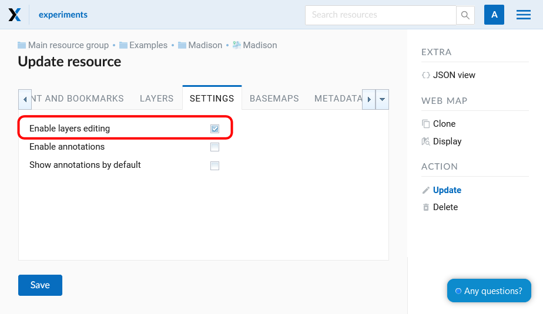
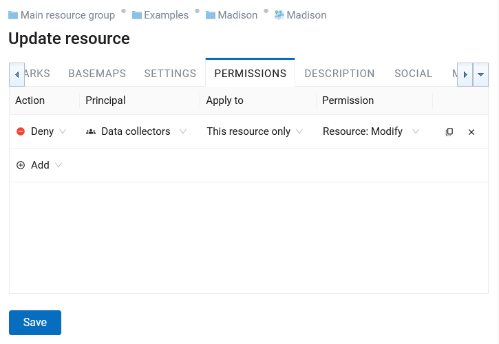
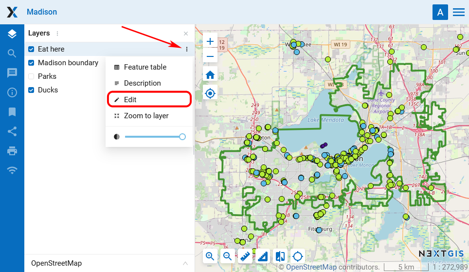
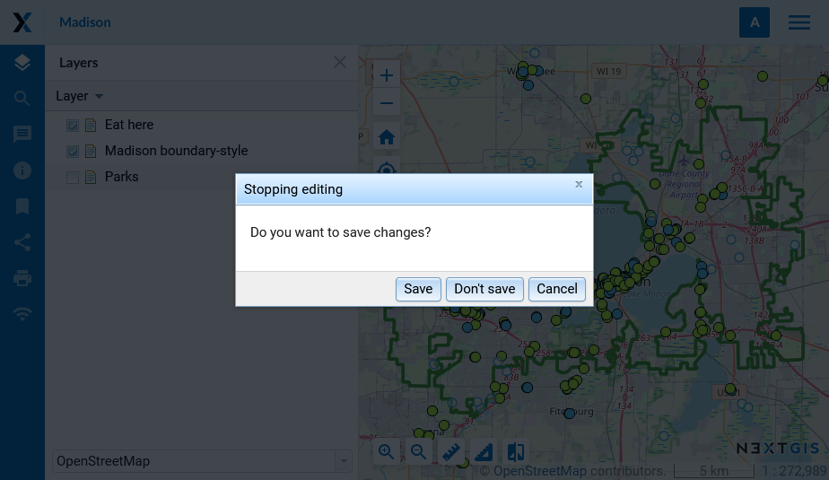
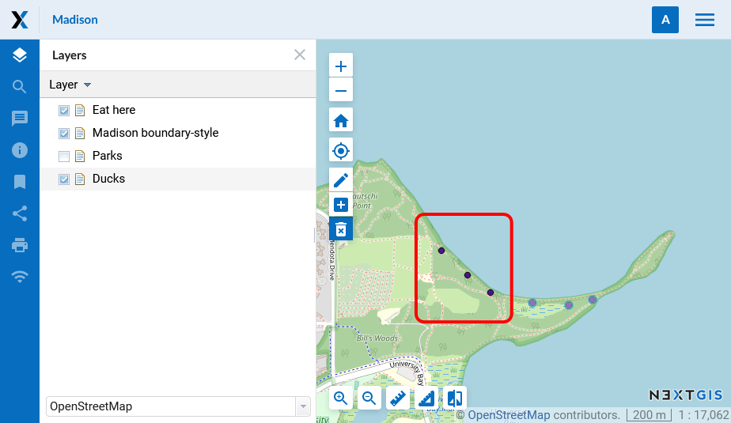
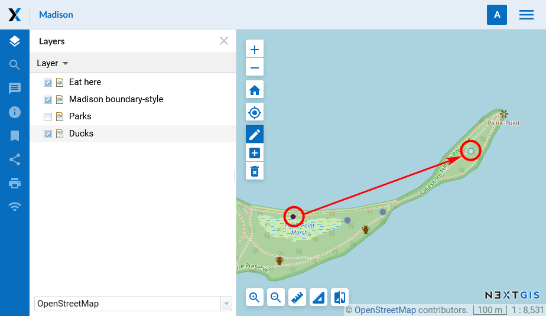
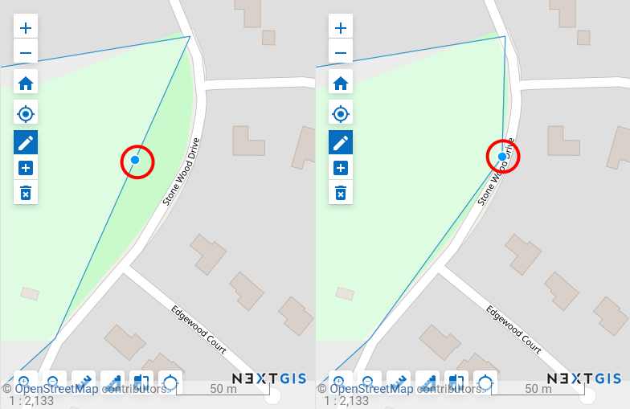
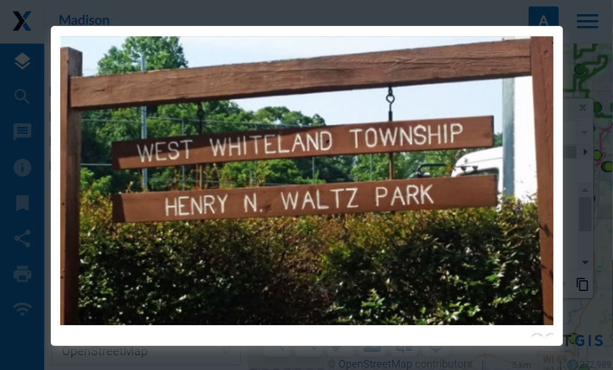

.. sectionauthor:: Artem Svetlov <artem.svetlov@nextgis.ru>

.. _ngw_change_layers:

Vector layer settings
================================

Introduction
---------

To edit a layer you need to navigate to a child resource group (see item 4 in :numref:`admin_index_pic`), where would be displayed resource types. Then select from child resources a resource with type vector layer and press the "Pencil" icon opposite the resource or select the layer and then select an action called "Update" in actions pane (see :numref:`ngw_window_update_edit_resource`). The window "Update resource" will open, where you can edit the layer properties, clear the layer or upload a new file for it, and modify attributes.

:ref:`Web GIS <ngcom_description>` also allows to edit objects and their attributes and to add descriptions of features and to them attachments (including photos). This works for :ref:`Vector layers <ngcom_vector_layer>` and :ref:`PostGIS layers <ngcom_postgis_layer>`.

Allow editing
----------------------------------------

By default editing of a Web Map is disabled. To allow users to modify the layers of the map, enable editing in the Web Map settings. To find out how to open the "Update resource" dialog, see  :ref:`this chapter<ngw_update_resource>`. 

You can allow or deny editing of all map layers on the “Settings” tab by ticking or clearing a box next to “Enable layers editing” field (see :numref:`webmap_allow_editting`)

   "Enable layers editing" is turned on

.. note:: 
	By default layer editing is turned off.
	
To forbid some users to edit layers add a rule to deny specified users or groups of users to write data (permission ``"Data:Write"``) on the "Permissions" tab of the "Update resorce" dialog (see :numref:`webmap_forbid_editting`).  For user without permission the edit mode is unavailable.

   Changes of editing permission for particular users

.. _ngw_vector_file_replace:

Delete or replace all features
-------------------------

NextGIS Web software allows to delete all features of a layer or replace them by uploading a new file.

Click on the pencil icon next to the layer. 

In the "Vector layer" tab select the action from the dropdown menu.

.. figure:: _static/ngw_update_vector_file_options_en.png
   :name: ngw_update_vector_file_options_pic
   :align: center
   :width: 15cm
   
   Options to edit the layer file

You can delete all the features. This will result in an empty layer of the same structure that you can add new features to. To do so, select "Delete all features from layer", tick to confirm and press **Save**.

.. figure:: _static/ngw_update_vector_file_clear_en.png
   :name: ngw_update_vector_file_clear_pic
   :align: center
   :width: 15cm
   
   Deleting all features from the layer

You can replace all the features by uploading a previously prepared file. Select "Replace layer features from file". Open the file or drag and drop it into the frame. 

.. figure:: _static/ngw_update_vector_file_replace_en.png
   :name: ngw_update_vector_file_replace_pic
   :align: center
   :width: 15cm
   
   Replacing layer file

If the file has multiple layers, select the one you need in the "Source layer" field. You can also set up other properties, as while creating a new vector layer.

If you replace the file, not only the features, but the structure of the attributes and other properties will be changed to match the new file.

.. note:
   You can use any type of geometry to replace the existing file. Keep in mind that if the geometry type changes, all styles connected with the layer may stop working, because they do not contain markers for other geometry types.

.. _ngw_edit_objects:

Edit vector feature on a Web Map 
--------------------------------------

1. Open :ref:`Web Map <ngcom_webmap_create>` and select the layer with the feature you need to edit.
2. Open dropdown menu by pressing the three dots to the right of the layer name (see :numref:`webmap_edit`), then select "Edit".

   Entering the editing mode

3. Editing toolbar will appear on the Web Map (see :numref:`webmap_edit_panel`):

.. figure:: _static/webgis_edit_objects_panel_eng_2.png
   :name: webmap_edit_panel
   :align: center
   :width: 20cm

   Editing toolbar
   

.. _ngw_create_objects:

Create a new feature (point, line, polygon)
~~~~~~~~~~~~~~~~~~~~~~~~~~~~~~~~~~~~~~~~~~~~~~~~

1. On the editing toolbar activate "Create features" button (see :numref:`webmap_create_objects`):

.. figure:: _static/webgis_create_new_objects_eng_2.png
   :name: webmap_create_objects
   :align: center
   :width: 20cm

   "Create features" button on the editing toolbar

2. A blue circle will appear nearby a mouse pointer, with it you can add new features. Click on the map to create a new feature. You can add several new features one after another. While creating a line you need to indicate its start and end points by clicking on the map. While creating a polygon each new click on the map will indicate its new vertice, to finish a polygon you need to click on its start point. You can use adhesion while creating vertices.
3. To finish creation of the new feature press "Stop editing" in the layer menu.
4. In the opened dialog select "Save" to save changes, "Don't save" to discard them, or "Cancel" to stay in the edit mode:

   Dialog window of finishing edits

.. _ngw_delete_objects:

Delete a feature
~~~~~~~~~~~~~~~~

1. On the editing toolbar activate "Delete features" button (see :numref:`webmap_delete_objects`):

.. figure:: _static/webgis_delete_objects_eng_2.png
   :name: webmap_delete_objects
   :align: center
   :width: 20cm

   "Delete features" button on the editing toolbar

2. Features you can modify will reduce their color intensity and have a blue outline. The pointer will become a black cross.

3. Left-click to select the features you would like to delete. Selected features will become dark again.

   
   The layer with the purple points is active. The marked points have been selected to be deleted
   
4. Select "Stop editing" in the layer dropdown menu.
5. In the opened dialog select "Save" (see :numref:`webmap_finish_edit`).

.. _ngw_move_objects:

Move a feature or its vertices
~~~~~~~~~~~~~~~~~~~~~~~~~~~~~~~~~~~~~~~~~~~

1. On the editing toolbar activate "Modify features" button (pencil icon, see :numref:`webmap_change_objects`):

.. figure:: _static/webgis_change_objects_eng_2.png
   :name: webmap_change_objects
   :align: center
   :width: 20cm

   "Modify features" button on the editing toolbar

2. Features you can modify will reduce their color intensity and have a blue outline.
3. Select a feature (point) or one of its vertices (line, polygon) with the pointer and drag it,  then release on a new place. For vertices modifying an adhesion will work.

   
   Moving a point. Before you confirm the edit, both its initial and its final location will be visible on the map

4. Select "Stop editing" in the layer dropdown menu.
5. In the opened dialog select "Save" (see :numref:`webmap_finish_edit`).

.. note:: 
	You can edit several layers simultaneously. To do it enter the edit mode in every layer you want to edit. Adhesion will work for features of all these layers.

Add and delete vertices
~~~~~~~~~~~~~~~~~~~~~~~~~~~~

To delete a vertice enter the editing mode, hold **Shift** and click on the vertice. 

To add a vertice, click on the line between two existing vertices and drag it to the desired location.

   
   Creating a new vertice

.. _ngw_attributes_edit:

Edit attribute values
----------------------------------

NextGIS Web software allows to edit attributes for geographical features. Editing could be launched from the administrator interface or from the map display. 

* Editing attributes from administrator interface: 

  - Click the table icon opposite the resource or select an action for a vector layer called "Feature table" in the actions pane (see :numref:`admin_table_objects_upload`).
  - A feature table for the layer will open. Select the row you want to edit. It will be highlighted in yellow.
  - Click **Edit** button (see :numref:`ngweb_editing_attributes2.7`).

   
   Editing attributes from administrator interface
  
* Editing attributes from the map display: 

  - Open a Web Map.
  - Click on the map with Identify tool active.
  - Click edit button in the Identify window (the last tab, see :numref:`ngweb_editing_when_viewing_map`).

   Editing attributes from the map

You can change attribute values in the opened window. Description made on "Description" tab will be visible on the map display in the indentify window. 

Editing page has following tabs:

* "Attributes" tab (see :numref:`ngweb_tab_attributes`).

 
   "Attributes" tab

To edit an attribute click on the field.

Numbers can be typed in or modified with errows that appear on the right end of the field.

Dates also can be typed in or selected in the calender. To open the calender click the icon on the right end of the field.

* "Description" tab (see :numref:`ngweb_tab_description`).

   "Description" tab

* "Attachments" tab (see :numref:`ngweb_tab_attachment`).

 
   "Attachments" tab

.. note::

When editing a PostGIS layer attribute changes are saved to PostGIS database and descriptions are saved to a local database. 
When editing a layer based on a Shapefile attribute all changes are saved to a local database. 

.. note::

Geodata with changed attributes could be downloaded by link :guilabel:`Download as 
GeoJSON` or published as WFS service. Download of descriptions is currently unavailable.

.. _ngw_add_photos:

Adding photos to geodata
----------------------------------

NextGIS Web software supports adding photos to features. 
If a feature has attached photos, they will be shown along with description and attributes in the identify window (see  :numref:`webmap_identification_photos`).

   Identify window for a feature with attached photos

You can add photos in a map display.

1. Click on a feature on the map with active Identify tool.
2. Click edit button in the Identify window (see :numref:`ngweb_editing_when_viewing_map`).
3. In the edit tab navigate to "Attachments" tab (see :numref:`ngweb_tab_attachment`).
4. Upload photos. JPEG and PNG formats are supported. GIF format is not supported (see. :numref:`admin_object_edit_photos1`).

   Uploading photos in the "Attachments" tab

5. Enter description for the image and click **Save**.

After uploading you can see previews of photos on the "Attachments" tab of the identify window (see  :numref:`webmap_identification_photos`).

After a click on a photo preview a lightbox window is open (a javascript powered window in browser). Photo size is adjusted to fit the window. Photos have descriptions and user can navigate through them using left and right arrow keys on the keyboard (see  :numref:`webmap_identification_photo_lightbox`).

   A lightbox with uploaded photos for the identified feature

.. note:: 
   By default photos could be added by any user but there is an option 
   to limit number of users who can upload photos (see  
   :ref:`ngw_access_rights`).

To delete a photo select it on "Attachments" tab of editting attributes window and click "Delete", and then click **Save** button.

