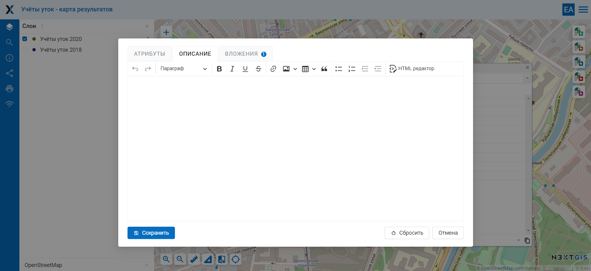

.. sectionauthor:: Артём Светлов <artem.svetlov@nextgis.ru>

.. _ngw_change_layers:

Редактирование векторных слоев
================================

Введение
---------

Для редактирования основных параметров слоя необходимо войти в административный интерфейс (см. :numref:`ngweb_resource_group`), перейти к группе дочерних ресурсов (см. :numref:`ngweb_main_page_administrative_interface_pic`, п.4) и нажать на значок карандаша напротив нужного слоя или нажать на выбранный слой, а затем в блоке операций выбрать действие над ресурсом "Изменить" (см. :numref:`ngw_window_update_edit_resource`). При этом откроется окно редактирования свойств этого слоя. Здесь можно очистить слой, заменить файл на новый, а также изменить набор аттрибутов.

:ref:`Веб ГИС <ngcom_description>` также позволяет редактировать объекты на карте и их атрибуты,  добавлять описания отдельных объектов и вложения (в том числе фотографии) в :ref:`Векторных слоях <ngcom_vector_layer>` и :ref:`Слоях PostGIS <ngcom_postgis_layer>`.

Настройка прав доступа к редактированию
----------------------------------------

По умолчанию редактирование веб-карты всегда отключено. Чтобы пользователь смог вносить изменения в слои на карте, редактирование нужно включить в настройках веб-карты. Изменить доступность возможности редактирования можно в окне "Обновить ресурс" Веб-карты. Как открыть это окно, описано в разделе :ref:`Обновление ресурса <ngw_update_resource>`.

На вкладке "Настройки" можно разрешить или запретить редактирование всех слоев карты, поставив или сняв галочку напротив опции «Разрешить редактирование слоев» (см. :numref:`webmap_allow_editting`), соответственно:

.. figure:: _static/webgis_allow_editting_ru.png
   :name: webmap_allow_editting
   :align: center
   :width: 20cm

   Опция «Разрешить редактирование слоев»

.. note:: 
	По умолчанию редактирование слоев отключено.
	
Для того, чтобы запретить редактирование определенных слоев отдельным пользователям, на вкладке «Права доступа» окна "Обновить ресурс" необходимо добавить правило, которое запретит записывать данные (право «Ресурс: изменение» / data:write) определенному пользователю или группе пользователей (см. :numref:`webmap_forbid_editting`). Если у человека недостаточно прав, он не сможет перейти в режим редактирования.

   Изменение прав доступа к редактированию для отдельных пользователей

.. _ngw_vector_file_replace:

Очистка и замена слоя
-------------------------

В NextGIS Web можно удалить все объекты слоя или заменить их, загрузив другой файл.

Нажмите на значок карандаша напротив выбранного слоя. Во вкладке "Векторный слой" выберите необходимое действие в выпадающем меню.

   
   Варианты изменения файла слоя

Вы можете удалить все объекты, оставив пустой слой со структурой для дальнейшего наполнения. Для этого выберите "Удалить все объекты из слоя", поставьте флажок для подтверждения удаления и нажмите **Сохранить**.

.. figure:: _static/ngw_update_vector_file_clear_ru.png
   :name: ngw_update_vector_file_clear_pic
   :align: center
   :width: 15cm
   
   Очистка слоя с удалением всех объектов

Можно заменить все объекты другими, использовав заранее подготовленный файл. Для этого выберите "Заменить объекты слоя из файла". Откройте нужный файл или перетащите его в пунктирную рамку. 

   
   Замена файла слоя

Если файл содержит несколько слоёв, выберите необходимый в поле "Исходный слой". Также можно настроить другие параметры загрузки файла, как и при создании нового векторного слоя.

При замене файла структура атрибутов, тип геометрии и другие параметры будут изменены в соответствии с новым загруженным файлом.

.. note:
   При перезаписи можно выбрать файл с другим типом геометрии. При этом скорее всего перестанут работать все связанные с векторным слоем стили, поскольку в них задано отображение данных другой геометрии.

.. _ngw_edit_objects:

Редактирование векторного объекта 
--------------------------------------

1. Откройте :ref:`Веб-карту <ngcom_webmap_create>` и найдите слой, в котором находится редактируемый объект.
2. Откройте выпадающее меню, нажав на три точки справа от имени слоя (см. :numref:`webmap_edit`), и поставьте галочку напротив пункта "Редактирование".

   Меню слоя на веб-карте

3. На Веб-карте появится панель инструментов, позволяющая провести редактирование (см. :numref:`webmap_edit_panel`):

   Панель инструментов для редактирования
   

.. _ngw_create_objects:

Создание нового объекта (точка, линия, полигон)
~~~~~~~~~~~~~~~~~~~~~~~~~~~~~~~~~~~~~~~~~~~~~~~~

1. На панели инструментов для редактирования нажмите кнопку "Создать объекты" (иконка с белым крестиком на синем поле, см. :numref:`webmap_create_objects`):

   Кнопка "Создать объекты" на панели инструментов для редактирования

2. Возле курсора мыши появится синий кружок, с помощью которого можно добавлять новые объекты. Щелкните в том месте карты, где необходимо создать новый объект. Можно добавить несколько новых объектов подряд. При создании линии необходимо щелчками на карте указать положение ее начала и конца. При создании полигона каждый последующий щелок будет указывать положение очередного его узла, чтобы завершить создание полигона, необходимо щелкнуть по его начальной точке. При создании узлов будет работать прилипание.
3. Для того, чтобы завершить создание новых объектов, нажмите "Завершить редактирование" в меню слоя.
4. Откроется диалоговое окно, в котором необходимо выбрать, сохранять ли внесенные изменения, не сохранять или остаться в режиме редактирования:

.. figure:: _static/webgis_finish_editting_ru.png
   :name: webmap_finish_edit
   :align: center
   :width: 20cm

   Диалоговое окно завершения редактирования

.. _ngw_delete_objects:

Удаление объекта
~~~~~~~~~~~~~~~~

1. На панели инструментов для редактирования нажмите кнопку "Удалить объекты" (иконка с корзиной, см. :numref:`webmap_delete_objects`):

   Кнопка "Удалить объекты" на панели инструментов для редактирования

2. Объекты, положение которых можно изменить, изменят интенсивность цвета на более слабую. Курсор превратится в черный крестик.

3. Выберите на карте объекты, которые хотите удалить, щелкнув по ним курсором мыши. Выбранные объекты снова станут темными.

.. figure:: _static/webgis_delete_objects_select_ru.png
   :name: webgis_delete_objects_select
   :align: center
   :width: 20cm
   
   Слой с фиолетовыми маркерами активен. Рамкой показаны точки, выбранные для удаления
   
4. Для того, чтобы завершить удаление объектов, нажмите "Завершить редактирование" в меню слоя.
5. Откроется диалоговое окно, в котором необходимо выбрать "Сохранить", чтобы завершить процесс удаления (см. :numref:`webmap_finish_edit`).

.. _ngw_move_objects:

Изменение положения объекта или его узлов
~~~~~~~~~~~~~~~~~~~~~~~~~~~~~~~~~~~~~~~~~~~

1. Убедитесь, что на панели инструментов для редактирования нажата кнопка "Изменить объекты" (иконка с карандашом, она активна по умолчанию при переходе в режим редактировния, см. :numref:`webmap_change_objects`):

   Кнопка "Изменить объекты" на панели инструментов для редактирования

2. Объекты, положение которых можно изменить, сменят интенсивность цвета на более слабую.
3. Наведите курсор на объект (точка) или один из его узлов (линия, полигон) и переместите его, зажав левую кнопку мыши и отпустив ее на новом месте. При перемещении узлов будет работать прилипание.

.. figure:: _static/webgis_move_objects_ru.png
   :name: webgis_move_objects
   :align: center
   :width: 20cm
   
   Перемещение точки. До завершения редактирования на карте отображается одновременно старое и новое положение выбранной точки

4. Для завершение перемещения нажмите "Завершить редактирование" в меню слоя.
5. Откроется диалоговое окно, в котором необходимо выбрать "Сохранить", чтобы завершить процесс изменения (см. :numref:`webmap_finish_edit`).

.. note:: 
	Одновременно можно редактировать несколько слоев. Для этого необходимо зайти в режим редактирования в каждом слое, который нужно изменить. Прилипание в этом случае будет работать к объектам всех редактируемых слоев.

Добавление и удаление узлов
~~~~~~~~~~~~~~~~~~~~~~~~~~~~

Для того, чтобы удалить лишний узел, в режиме редактирования объекта нужно зажать клавишу **Shift** и кликнуть по этому узлу. 

Чтобы добавить узел, нажмите на линию между двумя существующими узлами и потяните к нужной точке.

   
   Создание нового узла

.. _ngw_attributes:

Редактирование значений атрибутов
----------------------------------

Программное обеспечение NextGIS Web позволяет редактировать атрибуты географических 
объектов. Редактирование атрибутов можно вызывать из административного интерфейса
и из режима просмотра веб-карты. 

* Редактирование атрибутов из административного интерфейса: 

  - Нажать на значок таблицы напротив векторного слоя или открыть этот слой, а затем в блоке операций выбрать действие над слоем - "Таблица объектов" (см. :numref:`ngweb_Object_table`).
  - Откроется таблица. Кликнуть на нужную строку в таблице, она будет выделена желтым. 
  - Нажать на кнопку "Редактировать" над таблицей (см. :numref:`ngweb_editing_attributes2.7`).

   
   Редактирование атрибутов из административного интерфейса

* Редактирование атрибутов при просмотре карты: 
  
  - Открыть веб-карту.
  - Выбрать объект и нажать на него инструментом идентификации. 
  - Нажать на кнопку редактирования (последняя вкладка, см. :numref:`ngweb_editing_when_viewing_map`).

.. figure:: _static/ngweb_editing_when_viewing_map_rus_2.png
   :name: ngweb_editing_when_viewing_map
   :align: center
   :width: 16cm

   Редактирование атрибутов при просмотре карты

В открывшемся всплывающем окне можно изменять значения атрибутов. Описание, заданное на вкладке "Описание", будет видно при просмотре карты в окне идентификации. 

В окне редактирования атрибутов слоя имеются следующие вкладки:

* вкладка "Атрибуты" (см. :numref:`ngweb_tab_attributes`)

.. figure:: _static/ngweb_tab_attributes_rus_2.png
   :name: ngweb_tab_attributes
   :align: center
   :width: 16cm
 
   Вкладка "Атрибуты"

Для редактирования атрибута просто кликните на нужной строчке. 

Числовые атрибуты можно вводить вручную или изменять, нажимая на стрелки, появляющиеся в правом конце поля. 

Дату также можно ввести вручную или выбрать в календаре - чтобы вызвать его, нажмите иконку в правом конце поля.

* вкладка "Вложения" (см. :numref:`ngweb_tab_attachment`)

.. figure:: _static/ngweb_tab_attachment_rus_2.png
   :name: ngweb_tab_attachment
   :align: center
   :width: 16cm
 
   Вкладка "Вложения"

* вкладка "Описание" (см. :numref:`ngweb_tab_description`)

   Вкладка "Описание"

.. note::
   При редактировании слоя из PostGIS изменения атрибутов сохраняются в PostGIS, 
   а описания - в локальной базе. При редактировании слоя из Shapefile изменения 
   атрибутов и описания сохраняются в локальной базе.

.. note::
   Геоданные с изменёнными атрибутами можно выгрузить по ссылке "Загрузить GeoJSON" 
   или раздав слой по протоколу WFS. Функционала выгрузки описаний нет.

.. _ngw_add_photos:

Добавление фотографий к геоданным
----------------------------------

Программное обеспечение NextGIS Web позволяет прикреплять к записям фотографии. 
При этом, при идентификации объекта на карте во всплывающем окне будет отображены 
как атрибуты объекта, так и фотографии, которые были ему сопоставлены (см. :numref:`ngweb_webmap_identification_photos`).

   Всплывающее окно результатов идентификации объекта с фотографиями

Добавление фотографий осуществляется в режиме просмотра карты или через редактирование атрибутов из административного интерфейса. Для добавления фотографий в режиме просмотра карты нужно выполнить следующие действия:

1. Щёлкнуть инструментом идентификации по объекту.
2. Нажать на кнопку редактирования (см. :numref:`ngweb_editing_when_viewing_map`).
3. В окне редактирования открыть вкладку "Вложения" (см. :numref:`ngweb_tab_attachment`).
4. Загрузить фотографии. Поддерживаются форматы JPEG, PNG. 
   Формат GIF не поддерживается (см. :numref:`ngweb_admin_object_edit_photos1`).

   Окно загрузки фотографий к объекту

5. Ввести подписи к фотографиям и нажать "Сохранить".

Теперь при просмотре карты в окне идентификации на вкладке "Вложения" 
видны превью фотографий (см. :numref:`ngweb_webmap_identification_photos`).

При нажатии на фотографию открывается лайтбокс (всплывающее окно в браузере, работающее 
на JavaScript). Размер фотографии вписывается в окно. Фотографии подписываются, 
пользователю можно переходить между фотографиями, используя клавиши вправо-влево 
на клавиатуре (см. :numref:`ngweb_webmap_identification_photo_lightbox`).

.. figure:: _static/webmap_identification_photo_lightbox_rus_2.png
   :name: ngweb_webmap_identification_photo_lightbox
   :align: center
   :width: 16cm

   Развернутая фотография во всплывающем окне

.. note:: 
   По умолчанию фотографии могут добавлять все пользователи, но можно настроить 
   так, чтобы добавлять могли только отдельные пользователи (см. 
   :ref:`ngw_access_rights`).
   
Для удаления фотографии следует выделить её в окне редактирования атрибутов слоя на вкладке "Вложения", нажать кнопку "Удалить", 
а затем нажать кнопку "Сохранить".
