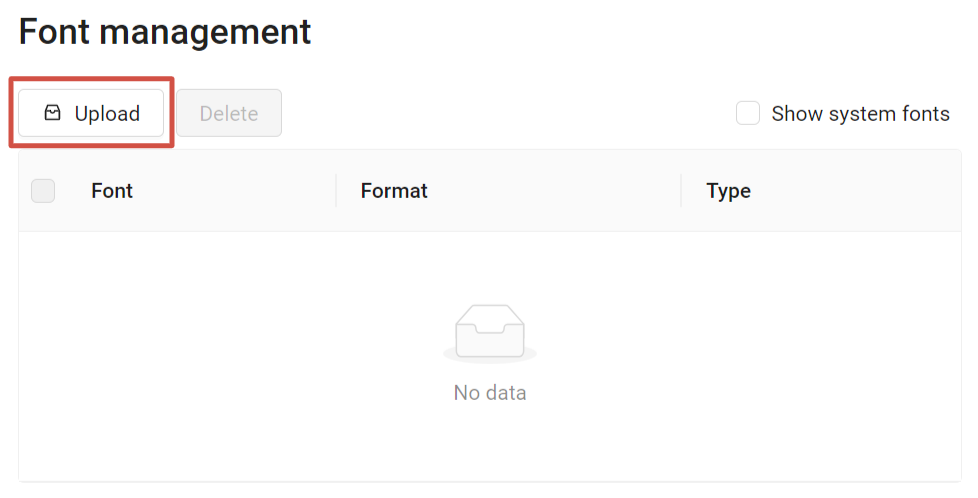
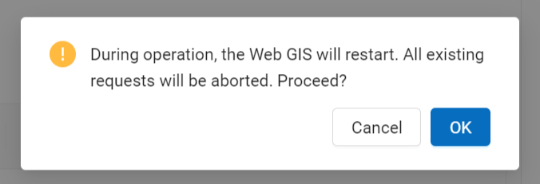
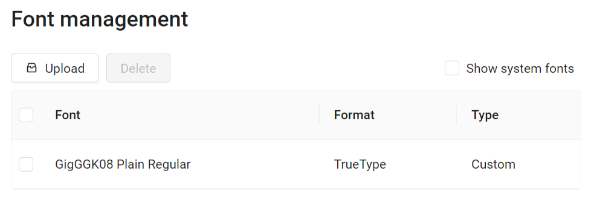
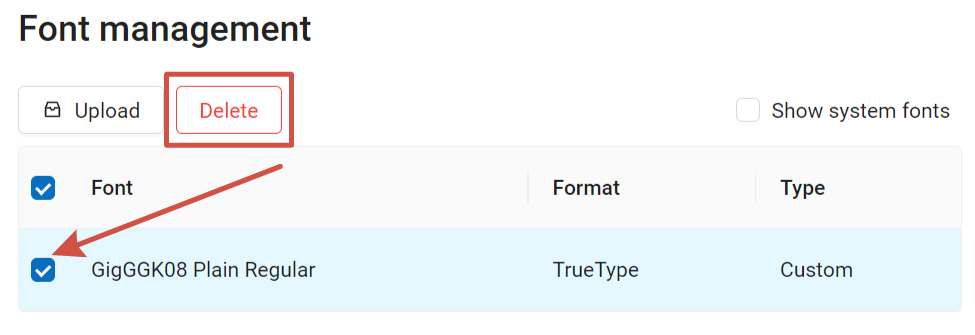

Design customization
=====================

The look of your Web GIS can be modified. You can customize logos, title, fonts, colors of the header, background, buttons and other elements.

.. note::
   These settings can only be changed by an administrator. Apart from changing the Web GIS name and fonts, other design settings are only available on the `Premium <https://nextgis.com/pricing-base/>`_ subscription plan.

Web GIS name
-------------

It's the title displayed next to the logo on the top bar of the page. By default it's the same as the Web GIS URL, but it can be changed.

.. figure:: _static/webgis_name_default_en.png
   :name: webgis_name_default_pic
   :align: center
   :width: 20cm

   Default name

.. figure:: _static/webgis_name_custom_en.png
   :name: webgis_name_custom_pic
   :align: center
   :width: 20cm

   Custom name

.. _ngw_fonts:

Font management
--------------------

NestGIS Web allows to upload custom fonts in addition to system ones.

To open the font management page, go to the Main menu, open the Control panel and in the Settings section select "Font management". If no additional fonts have been uploaded, the list is empty.

To view the pre-installed fonts, tick "Show system fonts".

.. figure:: _static/font_manag_en.png
   :name: font_manag_pic
   :align: center
   :width: 16cm

   Font management page. System fonts are shown. A custom font is selected.

On this page you can view the list of system and custom fonts, upload or delete custom fonts.

.. _ngw_fonts_add:

How to add a font
~~~~~~~~~~~~~~~~~~~~~~

Users can add custom fonts.

.. important::
	The font must be used as labels in the appropriate QGIS style for the layer to which you want to apply this font. More about `labels <https://docs.qgis.org/3.34/en/docs/training_manual/vector_classification/label_tool.html>`_ in QGIS.

Technical requirements:

* TTF or OTF format;
* File size up to 10MB;
* Filename only has basic latin characters, numbers, underscore (_) and dash (-).

To add a custom font, on the Font management page press **Upload** and select the font file from your device.

   Uploading custom font

To install the font the Web GIS needs to restart. Make sure there are no ongoing requests, restarting Web GIS aborts them.

   Web GIS restart alert

Press **Ok** to complete font uploading.

After the installation is complete, the new font will appear in the list, marked as "Custom".

   Custom font added successfully

See the process in our video:

.. raw:: html

   <iframe width="560" height="315" src="https://www.youtube.com/embed/4TFxD9hz9i8?si=jVYizefJ7TTXmZCd" title="YouTube video player" frameborder="0" allow="accelerometer; autoplay; clipboard-write; encrypted-media; gyroscope; picture-in-picture; web-share" referrerpolicy="strict-origin-when-cross-origin" allowfullscreen></iframe>

Watch on `youtube <https://youtu.be/4TFxD9hz9i8?si=jYtMc9kM1h4B_8hV>`_.

.. _ngw_fonts_del:

How to delete a custom font
~~~~~~~~~~~~~~~~~~~~~~~~~~~~~~~

Only custom fonts added by users can be deleted.

To delete a font, go to Font management page of the Control panel. Tick the font you'd like to delete.

Press **Delete**. While deleting a font, as while installing one, Web GIS needs to be restarted.

   Deleting custom font

.. _ngweb_CSS_logo:

Upload a logo
-------------
You can change the upper-left logo (present on all pages), you can't change the Web map logo (lower right).

To upload a logo choose :guilabel:`Custom logo` on control panel (see item 1 in :numref:`admin_index_pic`) and in opened window upload a file in PNG format with height up to 45 px, width up to 200 px. Then press "Save".

.. _ngw_CSS:

Customize the design with CSS
-------------------------------------------

You can modify the look of NextGIS Web using CSS.
From the main menu (see :numref:`admin_index_pic`) open the Control Panel (see :numref:`ngweb_main_page_main_menu_pic`).
In the Control Panel (see :numref:`admin_control_panel`) select **Custom CSS** in the Settings section.
Here you can enter your own :term:`CSS` rules. They will be used throughout your Web GIS on all its pages. 

Custom CSS examples
-------------------------------------------

Change main Web GIS color 
~~~~~~~~~~~~~~~~~~~~~~~~~~~~~~~~

Affects header, symbols in the header, buttons, field contours, links highlighted on hover etc.

.. code-block:: css

	:root {
  	--primary: red
	}

Change main font color 
~~~~~~~~~~~~~~~~~~~~~~~~~~~~~~~~

Affects menu, name and parameters of displayed resource group etc.

.. code-block:: css

	:root {
  	--text-base: #ff6600
	}

Change additional font color
~~~~~~~~~~~~~~~~~~~~~~~~~~~~~~~~

Affects paths for the displayed resource, parameters etc.

.. code-block:: css

	:root {
  	--text-secondary: rgb(40 200 40 / .8)
	}

.. _ngw_res_export:

Hide resource export
---------------------

To hide the ability to export data from Web GIS from certain categories of users, you need to:

* Go to Control Panel -> Settings -> Resource export
* Select the type of users that **will be able** to export data (only administrators / users with Data:Read or Data:Modify permissions)

Users who do not fit the selected list will not see the "Save as" link in the interface.

.. figure:: _static/admin_system_res_export_en_2.png
   :name: admin_system_res_export_en
   :align: center
   :width: 20cm

   Selecting a category of users entitled to export data

.. figure:: _static/action_panel_export_en.png
   :name: admin_system_export_en
   :align: center
   :width: 20cm

   Data export available in the Features panel

The categories of users you can select to have access to "Save as" action:

- administrators 

or users with the permission to:

- Read data
- Modify data

All other users will not be able to save data from the Web GIS interface.

More on how to set up permissions to read and modify data `here <https://docs.nextgis.com/docs_ngcom/source/permissions.html>`_.

.. note:: 
   This setting does not in any way affect the ability to receive data through the `REST API <https://docs.nextgis.com/docs_ngweb_dev/doc/developer/toc.html>`_ in accordance with the set `permissions <https://docs.nextgis.com/docs_ngweb/source/permissions.html>`_ to them.

.. _ngw_homepage:

How to change the homepage address
----------------------------------

By default the starting page of your Web GIS is the main resource group page (``/resource/0``). The starting page is the page that gets open first wherenever some visit your Web GIS or clicks on the logo in top left corver.

You can change which page will be opened first to any other resource of the system. For example, if you'd like your visitors to always start from a map, you can change this setting to this map.

#. Sign in as the user with administrative privileges and open Control panel, then select :guilabel:`Home path`. 
#. Enter path to the resource page that should be opened first when you Web GIS is accessed. For example: ``/resource/644/display``

After making this setting visiting ``http://yourwebgis.nextgis.com`` will open not the main resource contents page, but the page you've set up. To access main resource content page after this setting you will need to go directly to: ``http://yourwebgis.nextgis.com/resource/0``.

