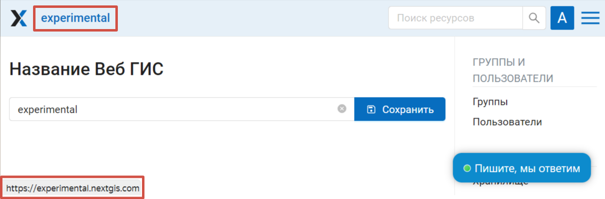
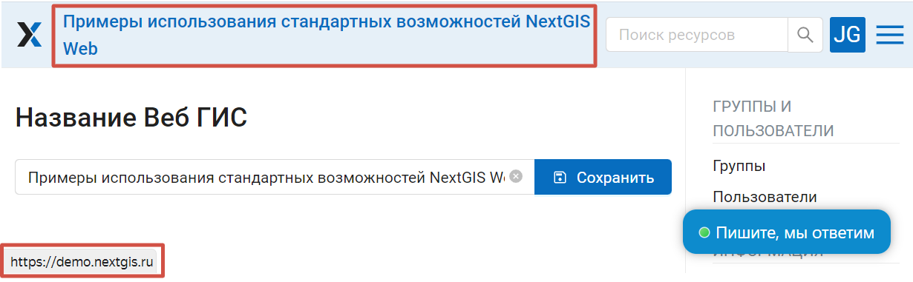
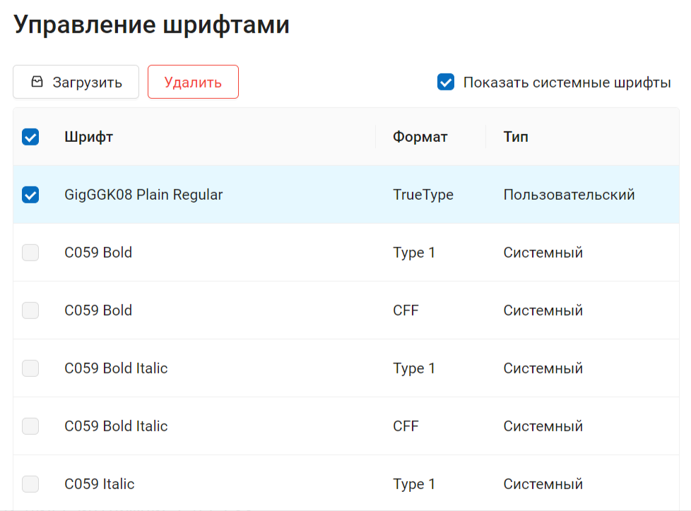
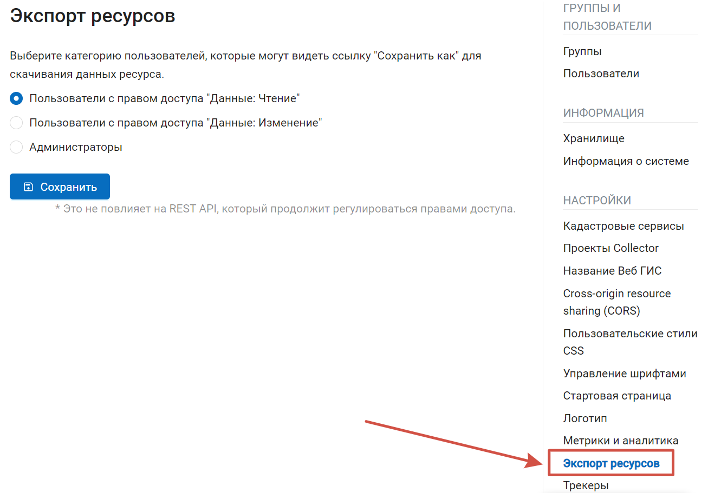
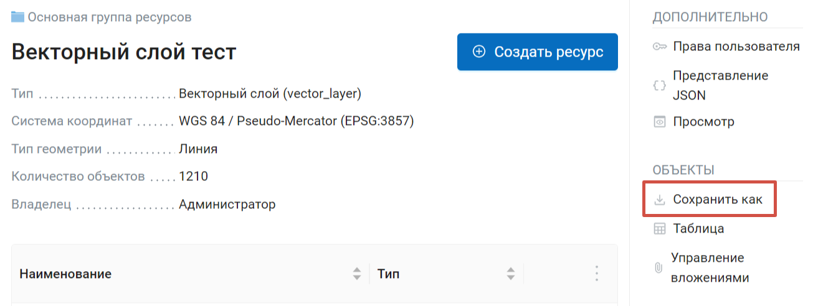

Настройка внешнего вида Веб ГИС
==================================

:ref:`Веб ГИС <ngcom_description>` поддерживает настройку своего внешнего вида. Внешний вид включает: логотипы, название, шрифты, цвета шапки, фона, кнопок и других элементов.

.. note:: 
	Эти настройки может изменять только пользователь с правами администратора. Кроме смены названия и управления шрифтами, другие настройки внешнего вида доступны только для плана `Premium <http://nextgis.ru/pricing-base/>`_ .

.. _ngw_name:

Название Веб ГИС
-----------------

Название Веб ГИС отображается на верхней панели рядом с логотипом. По умолчанию оно совпадает с адресом, заданным при создании Веб ГИС, но может быть изменено.

   Название по умолчанию

   Название, заданное пользователем

.. _ngw_fonts:

Управление шрифтами
--------------------

Чтобы зайти в раздел управления шрифтами, откройте через Основное меню Панель управления и в разделе "Настройки" выберите "Управление шрифтами".

На этой странице можно посмотреть список системных и добавленных пользователями шрифтов, загрузить или удалить пользовательский шрифт.

   Страница управления шрифтами. Включено отображение системных шрифтов. Выделен пользовательский шрифт

`Подробнее <https://docs.nextgis.ru/docs_ngcom/source/fonts.html>`_ об управлении шрифтами.

.. _ngweb_CSS_logo:

Загрузка логотипа
-----------------

Вы можете поставить свой логотип вместо логотипа NextGIS в верхнем левом углу. Изменить/убрать логотип NextGIS на самой Веб карте - нельзя.

Чтобы загрузить логотип, в панели управления (см. :numref:`ngweb_main_page_administrative_interface_pic`, п.1) необходимо выбрать пункт :guilabel:`Логотип` и в открывшемся окне загрузить файл в формате PNG, высотой до 45 px, ширина до 200 px. После этого требуется нажать на кнопку "Сохранить".

.. _ngw_CSS:

Настройка внешнего вида интерфейса на CSS
-------------------------------------------

Можно изменять внешний вид NextGIS Web.
Для этого необходимо в основном меню (см. :numref:`ngweb_main_page_administrative_interface_pic`, п.1) выбрать пункт "Панель управления".
На Панели управления (см. :numref:`ngweb_control_panel`) следует выбрать команду "Пользовательские стили CSS" в подпункте "Настройки".
В открывшейся вкладке можно задать собственные стили :term:`CSS`, которые будут использованы для оформления всех страниц Веб ГИС. 

.. _ngw_CSS_examples:

Примеры настроек внешнего вида интерфейса
-------------------------------------------

.. _ngw_CSS_colormain:

Изменить основной цвет Веб ГИС 
~~~~~~~~~~~~~~~~~~~~~~~~~~~~~~~~

Шапка, символы в шапке, кнопки, обводка полей, подсветка ссылок при наведении и другое.

.. code-block:: css

	:root {
  	--primary: red
	}

.. _ngw_CSS_colorfont:

Изменить цвет основных надписей 
~~~~~~~~~~~~~~~~~~~~~~~~~~~~~~~~

Пункты меню, имя и свойства текущей группы ресурсов и другое.

.. code-block:: css

	:root {
  	--text-base: #ff6600
	}

.. _ngw_CSS_colorfontadd:

Изменить цвет вспомогательных надписей
~~~~~~~~~~~~~~~~~~~~~~~~~~~~~~~~~~~~~~~

Путь до текущего ресурса, заголовки свойств ресурсов и другое.

.. code-block:: css

	:root {
  	--text-secondary: rgb(40 200 40 / .8)
	}
	
.. _ngw_res_export:

Экспорт ресурсов
------------------

Данная настройка показывает в интерфейсе Веб ГИС возможность экспорта (сохранения) данных только для тех категорий пользователей, которые выбраны из соответствующего списка. 

   Выбор категории пользователей, имеющих право экспортировать данные

   Действие "экспорт данных" доступно в панели просматриваемого ресурса

Функцию Экспорта данных могут видеть либо только администраторы, либо пользователи с правом на:

- Чтение данных
- Изменение данных

Все остальные пользователи не смогут сохранить данные из интерфейса Веб ГИС. 

О том, как устанавливаются права на чтение и изменение данных, подробнее `здесь <https://docs.nextgis.ru/docs_ngcom/source/permissions.html>`_. 

.. note:: 
   Эта настройка никак не влияет на возможность получать данные через `REST API <https://docs.nextgis.ru/docs_ngweb_dev/doc/developer/toc.html>`_ в соответствии с установленными `правами доступа <https://docs.nextgis.ru/docs_ngweb/source/permissions.html>`_ к ним.

.. _ngw_homepage:

Стартовая страница
-------------------

По умолчанию, стартовой страницей Веб ГИС является страница её корневого ресурса (``/resource/0``). Вы можете изменить то, какая страница Веб ГИС будет открываться первой.

#. Войдите в свою Веб ГИС с правами администратора, откройте раздел :guilabel:`Панель управления`, в группе :guilabel:`Настройки` выберите пункт :guilabel:`Стартовая страница`. 
#. В открывшейся вкладке введите в поле путь к ресурсу который должен открываться по умолчанию при переходе по ссылке в вашей Веб ГИС. Если это веб-карта, то адрес может выглядеть так: ``/resource/644/display``.

Данное изменение приведет к тому, что по ссылке ``http://yourwebgis.nextgis.com`` будет открываться не главный перечень ресурсов, а настроенная страница. После изменения, чтобы попасть на главный перечень, нужно будет вводить адрес целиком: ``http://yourwebgis.nextgis.com/resource/0``.
