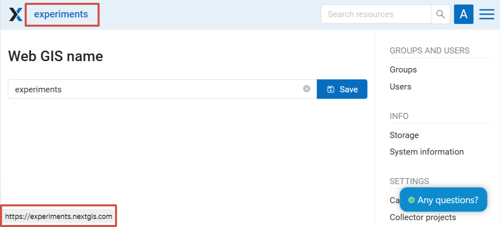
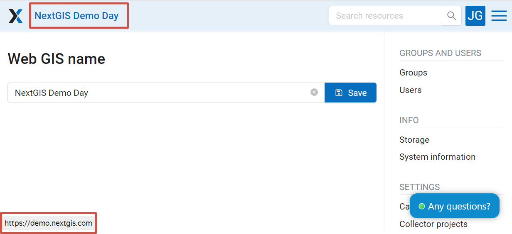
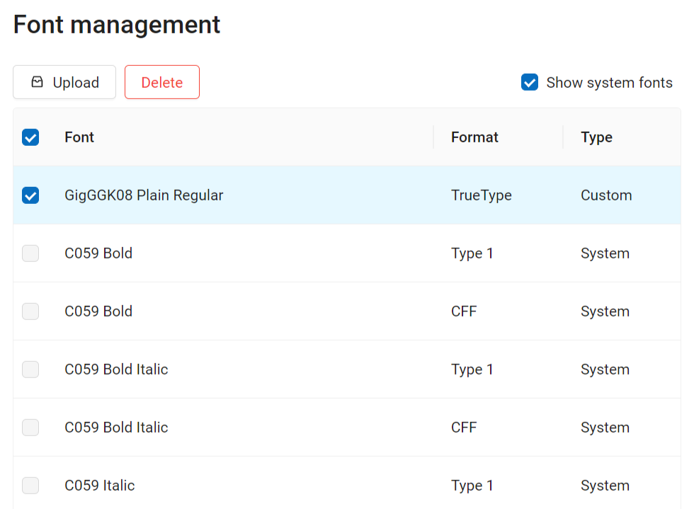
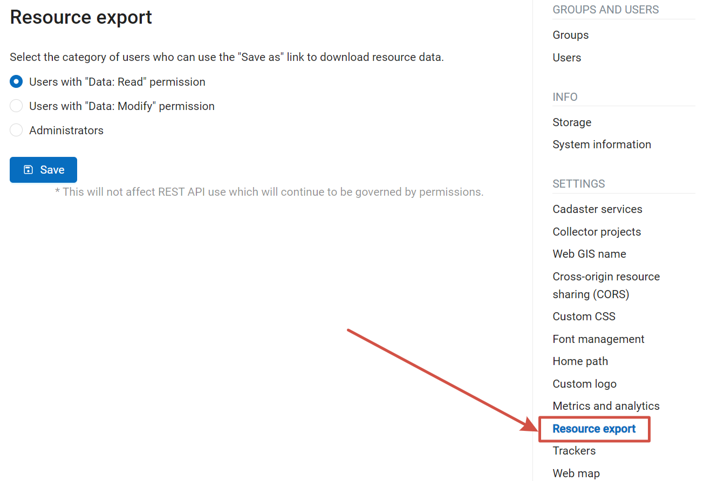
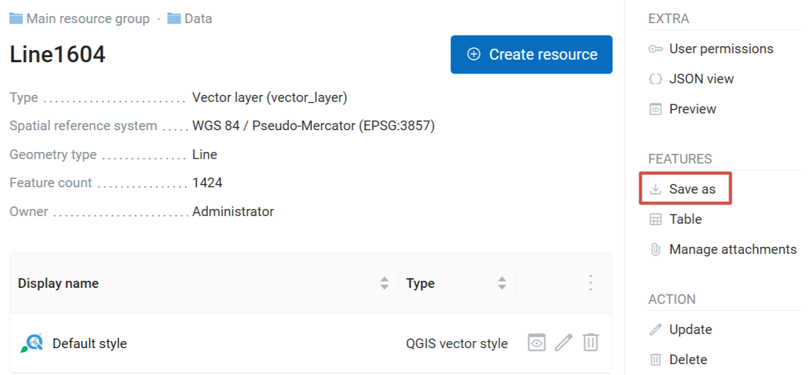

Design customization
=====================

The look of your Web GIS can be modified. You can customize logos, title, fonts, colors of the header, background, buttons and other elements.

.. note::
   These settings can only be changed by an administrator. Apart from changing the Web GIS name and fonts, other design settings are only available on the `Premium <https://nextgis.com/pricing-base/>`_ subscription plan.

Web GIS name
-------------

It's the title displayed next to the logo on the top bar of the page. By default it's the same as the Web GIS URL, but it can be changed.

   Default name

   Custom name

.. _ngw_fonts:

Font management
--------------------

To open the font management page, go to the Main menu, open the Control panel and in the Settings section select "Font management".

On this page you can view the list of system and custom fonts, upload or delete custom fonts.

   Font management page. System fonts are shown. A custom font is selected.

`Learn more <https://docs.nextgis.com/docs_ngcom/source/fonts.html>`_ on how to manage fonts.

.. _ngweb_CSS_logo:

Upload a logo
-------------
You can change the upper-left logo (present on all pages), you can't change the Web map logo (lower right).

To upload a logo choose :guilabel:`Custom logo` on control panel (see item 1 in :numref:`admin_index_pic`) and in opened window upload a file in PNG format with height up to 45 px, width up to 200 px. Then press "Save".

.. _ngw_CSS:

Customize the design with CSS
-------------------------------------------

You can modify the look of NextGIS Web using CSS.
From the main menu (see :numref:`admin_index_pic`) open the Control Panel (see :numref:`ngweb_main_page_main_menu_pic`).
In the Control Panel (see :numref:`admin_control_panel`) select **Custom CSS** in the Settings section.
Here you can enter your own :term:`CSS` rules. They will be used throughout your Web GIS on all its pages. 

Custom CSS examples
-------------------------------------------

Change main Web GIS color 
~~~~~~~~~~~~~~~~~~~~~~~~~~~~~~~~

Affects header, symbols in the header, buttons, field contours, links highlighted on hover etc.

.. code-block:: css

	:root {
  	--primary: red
	}

Change main font color 
~~~~~~~~~~~~~~~~~~~~~~~~~~~~~~~~

Affects menu, name and parameters of displayed resource group etc.

.. code-block:: css

	:root {
  	--text-base: #ff6600
	}

Change additional font color
~~~~~~~~~~~~~~~~~~~~~~~~~~~~~~~~

Affects paths for the displayed resource, parameters etc.

.. code-block:: css

	:root {
  	--text-secondary: rgb(40 200 40 / .8)
	}

.. _ngw_res_export:

Resource export
------------------

This function shows in the Web GIS interface the ability to export (save) data only for those categories of users that are selected from the list below. 

   Selecting a category of users entitled to export data

   Data export available in the Features panel

The Data Export function can be seen either only by administrators or by users with the right to:

- Read data
- Modify data

All other users will not be able to save data from the Web GIS interface.

More on how to set up permissions to read and modify data `here <https://docs.nextgis.com/docs_ngcom/source/permissions.html>`_.

.. note:: 
   This setting does not in any way affect the ability to receive data through the `REST API <https://docs.nextgis.com/docs_ngweb_dev/doc/developer/toc.html>`_ in accordance with the set `permissions <https://docs.nextgis.com/docs_ngweb/source/permissions.html>`_ to them.

How to change the homepage address
-------------------------------------

By default the starting page of your Web GIS is the main resource page (``/resource/0``). You can change which page will be opened first. If this is a Web map, it might look like this: ``/resource/644/display``.

#. Sign in as the user with administrative privileges and open Control panel, then select :guilabel:`Home path`. 
#. Enter path to the resource page that should be opened first when you Web GIS is accessed.

After making this setting visiting ``http://yourwebgis.nextgis.com`` will open not the main resource contents page, but the page you've set up. To access main resource content page after this setting you will need to go directly to: ``http://yourwebgis.nextgis.com/resource/0``.

