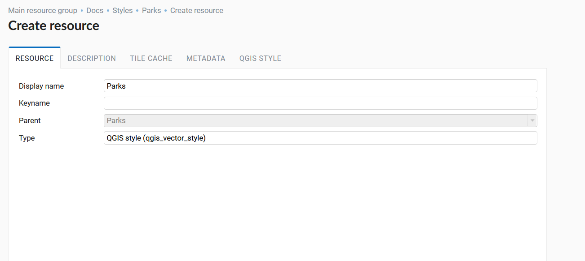
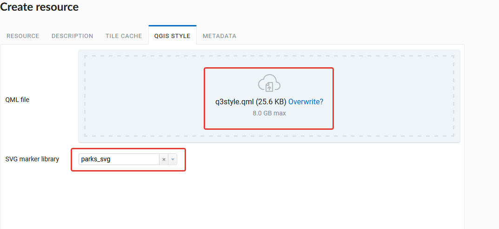
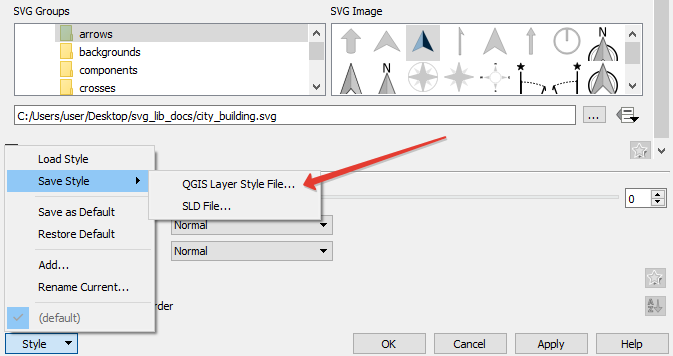
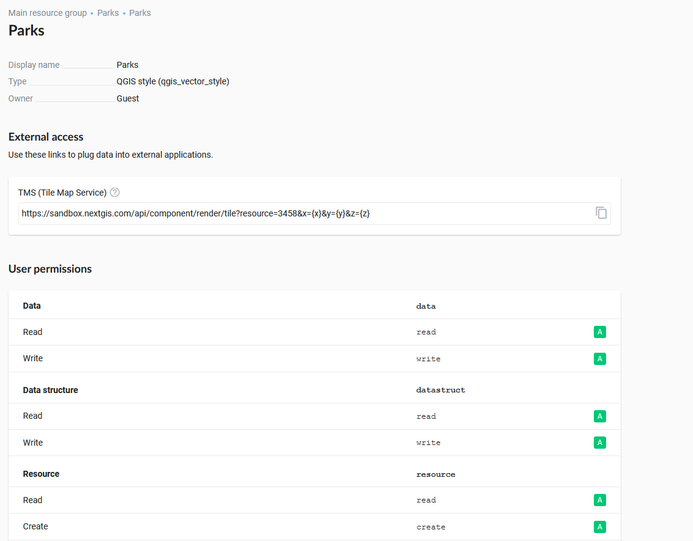
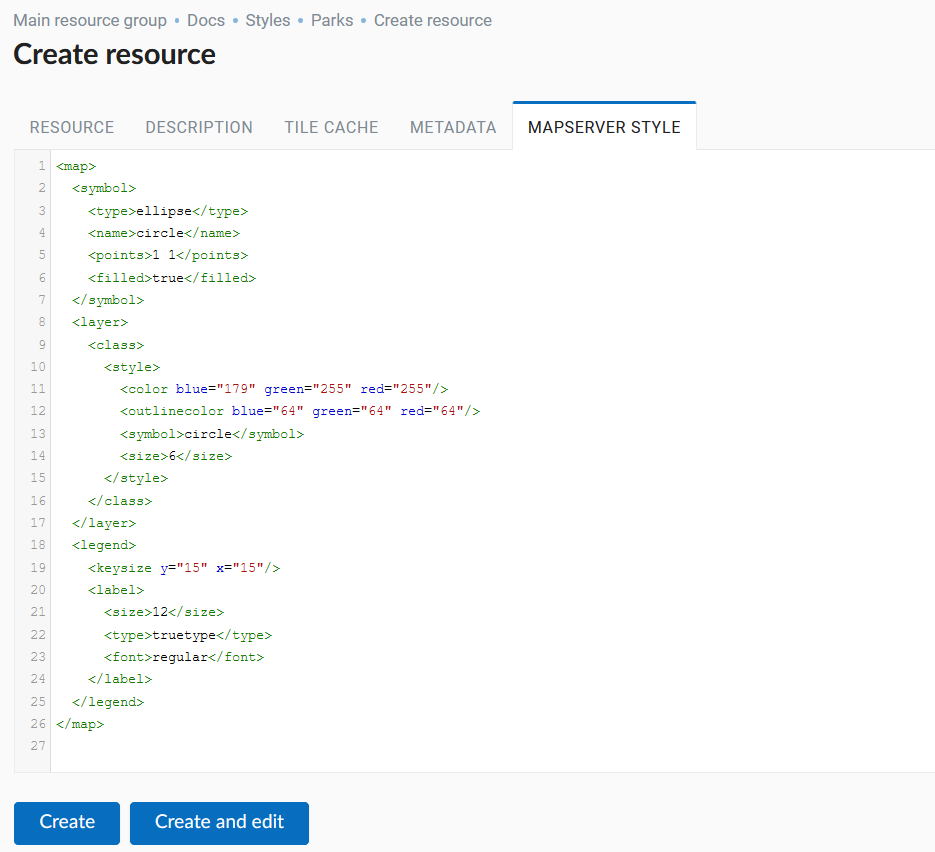
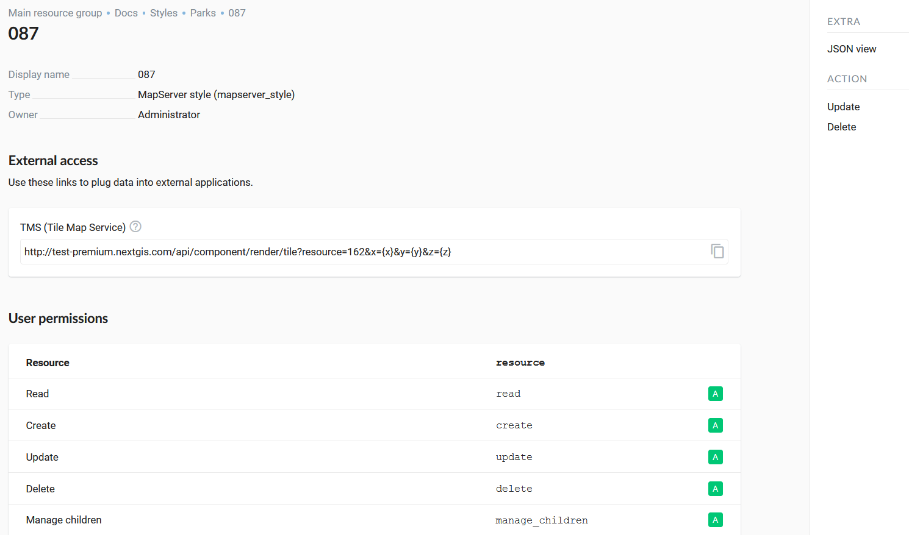
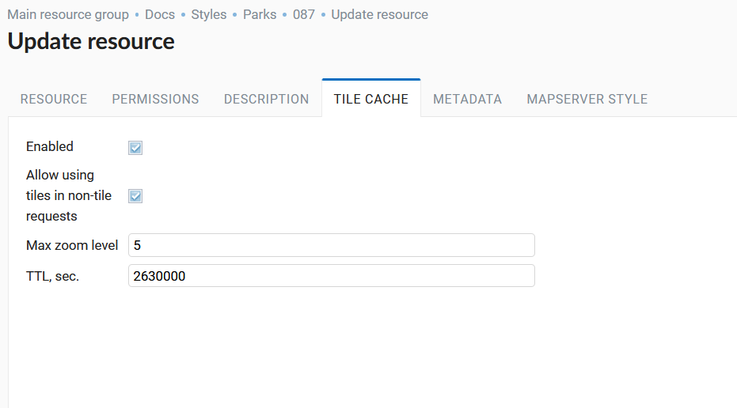
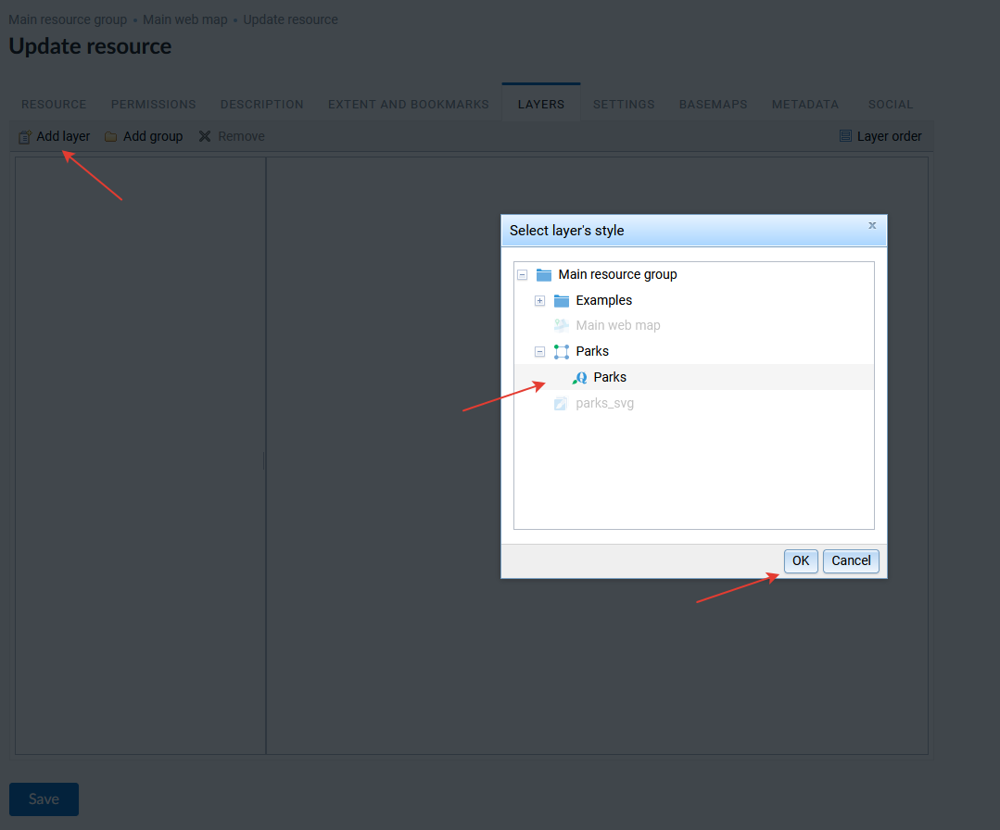
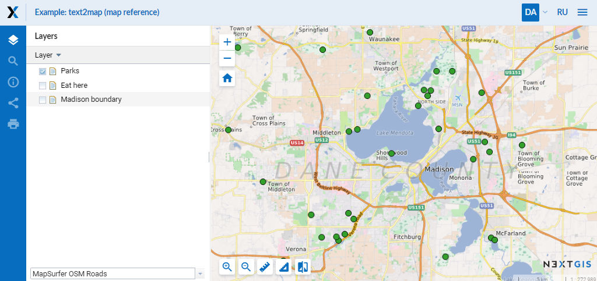

.. sectionauthor:: Artem Svetlov <artem.svetlov@nextgis.ru>

.. _ngw_style_create:
    
Vector layer styles
=====================

Styles describe a way of rendering for geodata and are one of the resources of NGW.
Style is added to a map to display geodata.

Formats
----------------------------------

By now NextGIS Web supports two rendering libraries: "Mapserver" and "QGIS". 
You can write Mapserver style yourself as a text. 
QGIS style you can only download from related qml file, it has much more settings. 

.. _ngw_qgis_style:

QGIS Style
----------

Style is related to a single layer so there is no item "Style" in the main resources list.
To create a style you need to open layer properties of the layer you want create style for.

In actions pane "Create resource" click "QGIS style" (see :numref:`select_qgis_style`).

.. figure:: _static/select_qgis_style_en.png
   :name: select_qgis_style
   :align: center
   :width: 20cm
 
   Selecting QGIS style resourse
 

After the selection of "QGIS style" create resource dialog will open and will look like :numref:` name_qgis_style`.
On the "Resource" tab enter the display name. 

   Name of QGIS style resource

Field "Keyname" is optional. You can also add resource description and metadata on the corresponding tabs.
Tile cache settings are described in details `in this section <https://docs.nextgis.com/docs_ngweb/source/mapstyles.html#tile-cache>`_. 

Switch to "QGIS style" tab and click "Select a file" button in the "QML file" field or drag a file to this field (see in :numref:`upload_svg_qgis_style`).
Here, if necessary, you can select the SVG marker library resource, which contains the icon to be displayed on the web map.

   Upload QML file

.. warning::
   QML file to upload should be created in :program:`NextGIS QGIS` and saved on the PC (:numref:`save_svg_qgis_style`).
   To create a style using SVG markers, you need to specify the **SVG marker** type in the layer properties and write the **full path to the file** on the local machine (:numref:`svg_qgis_style`). The file name and format must match the one loaded in the *SVG Marker Library* resource that the user selects when loading the QML file.

   Save QML file in NextGIS QGIS
   
.. figure:: _static/svg_qgis_style_en.png
   :name: svg_qgis_style
   :align: center
   :width: 16cm

   Layer properties settings in NextGIS QGIS

After QML file uploaded click "Create". Then the window of QGIS style will open and will look like :numref:`svg_res_style`
You can see here already formed TMS link to plug data into external applications.

   QGIS style window

.. _ngw_mapserver_style:

Mapserver style
---------------

To create **MapServer** style open layer properties of the layer you want create style for.
In actions pane "Create resource" click "MapServer style" (see in :numref:`ngweb_window_create_resource_mapserver_pic`).
On the "Resource" tab enter the display name.

.. figure:: _static/ngweb_window_create_resource_mapserver_pic_eng.png
   :name: ngweb_window_create_resource_mapserver_pic
   :align: center
   :width: 20cm

   Create resource dialog for MapServer style

Field "Keyname" is optional.
You can also add resource description and metadata on the corresponding tabs.
Tile cache settings are described in details `in this section <https://docs.nextgis.com/docs_ngweb/source/mapstyles.html#tile-cache>`_.

Switch to "MapServer style" tab and write a style manually (see in :numref:`ngweb_create_resource_mapsrev_pic`).

 
   "MapServer style" tab

After clicking "Create" the process of creation will finish, the window of the file with MapServer style will open (see in :numref:`ngweb_File_format_window_MapServer_pic`).

   Mapserver style window
 

.. _ngw_create_tile_cache:

Tile cache
------------

Caching provides faster rendering of web map layers. The **tile cache** settings tab while creating styles consists of the following settings (см. :numref:`tile_cache_settings`):

* *Enabled* checkbox;
* *Allow using tiles in non-tile requests* checkbox - the requested image (not a tile) will be prepared from previously cached tiles (if available);
* Input field *Maximum zoom level* - a threshold value, above which the cache is not accessed and the image is formed "on the fly";
* Input field *TTL, sec* (Time to live) - a time of storage of tiles on the server in seconds, after which the image will be formed again on the next request.

   Tile cache settings
   

.. _ngw_add_map_style:

Adding a style on the map
------------------------

To edit a web-map click pencil icon near it or click the web-map and in actions pane "Action" select "Update". In "Update resource" layer select **Layers** tab (see in :numref:`select_svg_style`).

Here you can do the following actions:

1. Add layer
2. Add group
3. Remove
  

   
   Adding QGIS style on the map
   

Click "Add layer" and in opened window select a layer with QGIS style, then click "OK". After that click "Save" (see in :numref:`ngweb_select_file_upload_web_map_pic`).
  
.. figure:: _static/ngweb_select_file_upload_web_map_eng.png
   :name: ngweb_select_file_upload_web_map_pic
   :align: center
   :width: 16cm
   
   Selection of a layer with QGIS style to add on a web-map.

In actions pane "Web map" of web-map properties window select "Display". The map will open, layers tree will be on the left of it. To hide/display a layer place a tick near the layer (see in :numref:`ngweb_Map_and_tree_layers_pic`).

   Web-map with a layer with QGIS style and layers tree      

Map style tags
----------------------------------

To change a style or to create a new one it is recommended you take a code of some existing style and then modify it, so there is no need to start creating a style from scratch.
  
Common tags
~~~~~~~~~~~~~~~~~ 
  
* <color red="255" green="170" blue="127"/> - the color of a fill or a line
* <outlinecolor red="106" green="106" blue="106"/> - outline color
* <width>0.5</width> - a width of a line or an outline of the polygon.
* <outlinewidth>3</outlinewidth> - outline width
* <minscaledenom>1</minscaledenom> - do not display a feature if the map scale is larger than value \
* <maxscaledenom>100000</maxscaledenom> - do not display a feature is the map scale is less than value 

Markers
~~~~~~~~~~~~~~~~~

.. figure:: _static/mapstyle_hatch_demo.png
   :name: ngweb_mapstyle_hatch_demo_pic
   :align: center
   :width: 16cm

   A demo for different hatches.

* <symbol>std:circle</symbol> - marker type
* std:rectangle - rectangle
* std:circle - circle
* std:diamond - diamong
* std:triangle - triangle with peak at the top
* std:triangle-equilateral - triangle with peak at the bottom
* std:star - five-pointed star
* std:pentagon - pentagon
* std:arrow - arrow (by default is top oriented. Rotation could be set using a tag <angle>45</angle>)
* std:cross - +
* std:xcross - x
* std:line - short line
* std:hatch - long line texture

These markers could be used to draw a line, to fill a polygon or to display points. 
Also they may be combined to a complex symbol:

.. code-block:: xml

        <class>
            <expression>"industrial"</expression>
            <!-- Industrial areas -->
            
            
            
 </class>

* <size>2</size> - marker size in pixels

Line features
~~~~~~~~~~~~~~~~

* <gap>10</gap> - a step size for dashed line (used with <symbol>std:circle</symbol>)
* <width>8</width> - width of line in pixels
* <classitem>PLACE</classitem> - filter by attribute PLACE. Also see example in #Filtering.
  The following operators are supported:
  
  * attribute name
  * !=
  * >=
  * <=
  * <
  * >
  * =* - case insensitive string comparison.

  * =
  * lt - less than
  * gt - greater than
  * ge - greater or equal
  * le - less or equal
  * eq - equal
  * ne - not equal
  * and - AND
  * && - AND
  * or - OR
  * || - OR
  
* <linejoin>round</linejoin> - line draw at corners
* <linecap>round</linecap> - line draw at the beginning and at the end

.. figure:: _static/admin_mapstyles_linecap.png
   :name: admin_mapstyles_linecap.png
   :align: center
   :width: 10cm

   <linecap>butt</linecap> / <linecap>round</linecap> / <linecap>square</linecap>

* <pattern>2.5 4.5</pattern> - dash template 

.. todo:: check for numbers

* <angle> - marker rotation angle. Hatch could also be rotated.

Labels
~~~~~~~~

* <labelitem>a_hsnmbr</labelitem> - attribute name for labelling.
* <minscaledenom>100</minscaledenom> - do not show a label if a scale is larger than 1:1000
* <maxscaledenom>100000</maxscaledenom> - do not show a label if a scale is smaller than1:100000
                
                        

* LABELCACHE [on|off] - specifies whether labels should be drawn as the features for this layer are drawn, or whether they should be cached and drawn after all layers have been drawn. Default is on. Label overlap removal, auto placement etc... are only available when the label cache is active.
* <position>ur</position> - label offset direction.

   * ur - ↗ up and right (recommended).
   * ul - ↖
   * uc - ↑
   * cl - ←
   * cc - centered
   * cr - →
   * ll - ↙
   * lc - ↓
   * lr - ↘
   * auto

* <Maxoverlapangle> - ?  

Some other useful tags
~~~~~~~~~~~~~~~~~~~~~~~

* MAXGEOWIDTH - Maximum width, in the map’s geographic units, at which this LAYER is drawn. If MAXSCALEDENOM is also specified then MAXSCALEDENOM will be used instead.
* MINGEOWIDTH - Minimum width, in the map’s geographic units, at which this LAYER is drawn. If MINSCALEDENOM is also specified then MINSCALEDENOM will be used instead.
* OFFSITE - Sets the color index to treat as transparent for raster layers.
* OPACITY [integer|alpha] - opacity of the layer
* SIZEUNITS [feet|inches|kilometers|meters|miles|nauticalmiles|pixels] - Sets the unit of CLASS object SIZE values (default is pixels). Useful for simulating buffering.
* SYMBOLSCALEDENOM [double] - The scale at which symbols and/or text appear full size. This allows for dynamic scaling of objects based on the scale of the map. If not set then this layer will always appear at the same size. Scaling only takes place within the limits of MINSIZE and MAXSIZE as described above. Scale is given as the denominator of the actual scale fraction, for example for a map at a scale of 1:24,000 use 24000.
* TYPE [chart|circle|line|point|polygon|raster|query] - Specifies how the data should be drawn. Need not be the same as the feature geometry type. For example polygons or polylines may be drawn as a point layer.

Map styles examples (OSM-default)
----------------------------------

Polygon layer with scale range and labels
~~~~~~~~~~~~~~~~~~~~~~~~~~~~~~~~~~~~~~~~~~~~~~~~~~~~~~~~~~~~~~

.. code-block:: xml

	<map>
	  <layer>
	    <labelitem>a_hsnmbr</labelitem>
	    <class>
	      
	      <label>
		<type>truetype</type>
		regular
		<size>8.25</size>
		<color blue="0" green="0" red="0"/>
		<outlinewidth>3</outlinewidth>
		<outlinecolor blue="255" green="255" red="255"/>
		<position>ur</position>
		<maxscaledenom>10000</maxscaledenom>
	      </label>
	    </class>
	  </layer>
	</map>

White circle marker
~~~~~~~~~~~~~~~~~~~~~~~~~~~~~~~~~~~~~~~~~~~~~~~~~~~~~~~~~~~~~~

.. code-block:: xml

     

A line displayed with small black circles
~~~~~~~~~~~~~~~~~~~~~~~~~~~~~~~~~~~~~~~~~~~~~~~~~~~~~~~~~~~~~~

.. code-block:: xml

     

Filtering
~~~~~~~~~~~~~~~~~~~~~~~~~~~~~~~~~~~~~~~~~~~~~~~~~~~~~~~~~~~~~~

.. code-block:: xml

	<map>
	  <layer>
	    <labelitem>NAME</labelitem>
	    <classitem>PLACE</classitem>
	    <class>
	      <expression>"city"</expression>
	      
	      
	      <label>
		<type>truetype</type>
		regular
		<size>18</size>
		<color blue="0" green="0" red="0"/>
		<outlinewidth>3</outlinewidth>
		<outlinecolor blue="255" green="255" red="255"/>
		 <position>ur</position>
	      </label>
	    </class>
	    <class>
	      <expression>"town"</expression>
	      
	      
	      <label>
		<type>truetype</type>
		regular
		<size>14</size>
		<color blue="0" green="0" red="0"/>
		<outlinewidth>3</outlinewidth>
		<outlinecolor blue="255" green="255" red="255"/>
		 <position>ur</position>
	      </label>
	    </class>
	    <class>
	      <expression>"village"</expression>
	      
	      <label>
		<type>truetype</type>
		regular
		<size>8.25</size>
		<color blue="0" green="0" red="0"/>
		<outlinewidth>3</outlinewidth>
		<outlinecolor blue="255" green="255" red="255"/>
		<position>ur</position>
	      </label>
	    </class>
	    <class>
	      <expression>"hamlet"</expression>
	      
	      <label>
		<type>truetype</type>
		regular
		<size>8.25</size>
		<color blue="0" green="0" red="0"/>
		<outlinewidth>3</outlinewidth>
		<outlinecolor blue="255" green="255" red="255"/>
		<position>ur</position>
	      </label>
	    </class>
	    <class>
	      <expression>"locality"</expression>
	      
	      <label>
		<type>truetype</type>
		regular
		<size>6.5</size>
		<color blue="0" green="0" red="0"/>
		<outlinewidth>3</outlinewidth>
		<outlinecolor blue="255" green="255" red="255"/>
		<position>ur</position>
	      </label>
	    </class>
	    <class>
	      <expression>''</expression>
	      
	      <label>
		<type>truetype</type>
		regular
		<size>8.25</size>
		<color blue="0" green="0" red="0"/>
		<outlinewidth>3</outlinewidth>
		<outlinecolor blue="255" green="255" red="255"/>
		<position>ur</position>
	      </label>
	    </class>
	  </layer>
	</map>

Polygon layer with a classification by field values and labels
~~~~~~~~~~~~~~~~~~~~~~~~~~~~~~~~~~~~~~~~~~~~~~~~~~~~~~~~~~~~~~~

.. code-block:: xml

	<map>
	<layer>
	  <labelitem>NAME</labelitem>
	    <class>
	      <expression>(([num] gt 18) and ([num] le 26.1))</expression>
	      
	       <label>
		<type>truetype</type>
		regular
		<size>8.25</size>
		<color blue="0" green="0" red="0"/>
		<outlinewidth>3</outlinewidth>
		<outlinecolor blue="255" green="255" red="255"/>
		<position>ur</position>
		<maxscaledenom>7000000</maxscaledenom>
	      </label>
	    </class>
	  
	      <class>
	      <expression>(([num] gt 26.1) and ([num] le 28.1))</expression>
	      
		 <label>
		<type>truetype</type>
		regular
		<size>8.25</size>
		<color blue="0" green="0" red="0"/>
		<outlinewidth>3</outlinewidth>
		<outlinecolor blue="255" green="255" red="255"/>
		<position>ur</position>
		<maxscaledenom>7000000</maxscaledenom>
	      </label>
	    </class>
	  
	  
	    <class>
	      <expression>(([num] gt 28.1) and ([num] le 30))</expression>
	      
	       <label>
		<type>truetype</type>
		regular
		<size>8.25</size>
		<color blue="0" green="0" red="0"/>
		<outlinewidth>3</outlinewidth>
		<outlinecolor blue="255" green="255" red="255"/>
		<position>ur</position>
		<maxscaledenom>7000000</maxscaledenom>
	      </label>
	    </class>
	  
	  </layer>
	</map>

OSM settlement-point
~~~~~~~~~~~~~~~~~~~~~~~~~~~~~~~~~~~~~~~~~~~~~~~~~~~~~~~~~~~~~~

.. code-block:: xml

	<!-- Style with different settings for different scales-->
	<!-- Version 2015-07-24 -->
	<map>
	  <layer>
	    <labelitem>NAME</labelitem>
	    <classitem>PLACE</classitem>
	    <class>
	      <expression>"city"</expression> <!-- City -->
	      
	      
	      <label>
		<type>truetype</type>
		regular
		<size>18</size>
		<color blue="0" green="0" red="0"/>
		<outlinewidth>3</outlinewidth>
		<outlinecolor blue="255" green="255" red="255"/>
		 <position>ur</position>
	      </label>
	    </class>
	    <class>
	      <expression>"town"</expression> <!-- Small city or town -->
	      
	      
	      <label>
		<type>truetype</type>
		regular
		<size>14</size>
		<color blue="0" green="0" red="0"/>
		<outlinewidth>3</outlinewidth>
		<outlinecolor blue="255" green="255" red="255"/>
		 <position>ur</position>
		<maxscaledenom>6000000</maxscaledenom>
	      </label>
	    </class>
	    <class>
	      <expression>"village"</expression> <!-- Village  -->
	      
	      <label>
		<type>truetype</type>
		regular
		<size>8.25</size>
		<color blue="0" green="0" red="0"/>
		<outlinewidth>3</outlinewidth>
		<outlinecolor blue="255" green="255" red="255"/>
		<position>ur</position>
		<maxscaledenom>1000000</maxscaledenom>
	      </label>
	    </class>
	    <class>
	      <expression>"hamlet"</expression> <!-- Hamlet -->
	      
	      <label>
		<type>truetype</type>
		regular
		<size>8.25</size>
		<color blue="0" green="0" red="0"/>
		<outlinewidth>3</outlinewidth>
		<outlinecolor blue="255" green="255" red="255"/>
		<position>ur</position>
		<maxscaledenom>500000</maxscaledenom>
	      </label>
	    </class>
	    <class>
	      <expression>"locality"</expression> <!-- Non inhabited place -->
	      
	      <label>
		<type>truetype</type>
		regular
		<size>6.5</size>
		<color blue="0" green="0" red="0"/>
		<outlinewidth>3</outlinewidth>
		<outlinecolor blue="255" green="255" red="255"/>
		<position>ur</position>
		<maxscaledenom>500000</maxscaledenom>
	      </label>
	    </class>
	    <class>
	      <expression>''</expression>
	      
	      <label>
		<type>truetype</type>
		regular
		<size>8.25</size>
		<color blue="0" green="0" red="0"/>
		<outlinewidth>3</outlinewidth>
		<outlinecolor blue="255" green="255" red="255"/>
		<position>ur</position>
	      </label>
	    </class>
	  </layer>
	</map>

OSM highway-lowzoom
~~~~~~~~~~~~~~~~~~~~~~~~~~~~~~~~~~~~~~~~~~~~~~~~~~~~~~~~~~~~~~

Public roads (small roads are in a separate style). Colorscheme from openstreetmap.de

.. figure:: _static/mastyles_osm-highway-lowzoom.png
   :name: mastyles_osm-highway-lowzoom
   :align: center

   Fragment of colorscheme for public roads. 

.. code-block:: xml

    <map>
    <!-- Highways for low-zoom from openstreetmap (from motorway to residential) 
    version 2015-11-06 -->
        <layer>
            <classitem>Highway</classitem>
            <labelitem>Name</labelitem>
            <class>
                <expression>"motorway"</expression>
                
                
                
                <label>
                    <type>truetype</type>
                    regular
                    <size>7</size>
                    <color blue="0" green="0" red="0" />
                    <outlinewidth>1</outlinewidth>
                    <outlinecolor blue="255" green="255" red="255" />
                    <angle>follow</angle>
                    <antialias>true</antialias>
                    <repeatdistance>300</repeatdistance>
                    <maxoverlapangle>20.0</maxoverlapangle>
                </label>
            </class>
            <class>
                <expression>"motorway_link"</expression>
                
                
                
            </class>
            <class>
                <expression>"trunk"</expression>
                
                
                
                <label>
                    <type>truetype</type>
                    regular
                    <size>7</size>
                    <color blue="0" green="0" red="0" />
                    <outlinewidth>1</outlinewidth>
                    <outlinecolor blue="255" green="255" red="255" />
                    <angle>follow</angle>
                    <antialias>true</antialias>
                    <repeatdistance>300</repeatdistance>
                    <maxoverlapangle>20.0</maxoverlapangle>
                </label>
            </class>
            <class>
                <expression>"trunk_link"</expression>
                
                
                
            </class>
            <class>
                <expression>"primary"</expression>
                
                
                <label>
                    <type>truetype</type>
                    regular
                    <size>7</size>
                    <color blue="0" green="0" red="0" />
                    <outlinewidth>1</outlinewidth>
                    <outlinecolor blue="255" green="255" red="255" />
                    <angle>follow</angle>
                    <antialias>true</antialias>
                    <repeatdistance>300</repeatdistance>
                    <maxoverlapangle>20.0</maxoverlapangle>
                </label>
            </class>
            <class>
                <expression>"primary_link"</expression>
                
                
            </class>
            <class>
                <expression>"secondary"</expression>
                
                
                <label>
                    <type>truetype</type>
                    regular
                    <size>7</size>
                    <color blue="0" green="0" red="0" />
                    <outlinewidth>1</outlinewidth>
                    <outlinecolor blue="255" green="255" red="255" />
                    <angle>follow</angle>
                    <antialias>true</antialias>
                    <repeatdistance>300</repeatdistance>
                    <maxoverlapangle>20.0</maxoverlapangle>
                </label>
            </class>
            <class>
                <expression>"secondary_link"</expression>
                
                
            </class>
            <class>
                <expression>"tertiary"</expression>
                
                
                <label>
                    <type>truetype</type>
                    regular
                    <size>7</size>
                    <color blue="0" green="0" red="0" />
                    <outlinewidth>1</outlinewidth>
                    <outlinecolor blue="255" green="255" red="255" />
                    <angle>follow</angle>
                    <antialias>true</antialias>
                    <repeatdistance>300</repeatdistance>
                    <maxoverlapangle>20.0</maxoverlapangle>
                </label>
            </class>
            <class>
                <expression>"tertiary_link"</expression>
                
                
            </class>
            <class>
                <expression>"unclassified"</expression>
                
                
                <label>
                    <type>truetype</type>
                    regular
                    <size>7</size>
                    <color blue="0" green="0" red="0" />
                    <outlinewidth>1</outlinewidth>
                    <outlinecolor blue="255" green="255" red="255" />
                    <angle>follow</angle>
                    <antialias>true</antialias>
                    <repeatdistance>300</repeatdistance>
                    <maxoverlapangle>20.0</maxoverlapangle>
                    <minscaledenom>1</minscaledenom>
		            <maxscaledenom>40000</maxscaledenom> 
                </label>
            </class>
            <class>
                <expression>"residential"</expression>
                
                
                <label>
                    <type>truetype</type>
                    regular
                    <size>7</size>
                    <color blue="0" green="0" red="0" />
                    <outlinewidth>1</outlinewidth>
                    <outlinecolor blue="255" green="255" red="255" />
                    <angle>follow</angle>
                    <antialias>true</antialias>
                    <repeatdistance>300</repeatdistance>
                    <maxoverlapangle>20.0</maxoverlapangle>
                    <minscaledenom>1</minscaledenom>
		            <maxscaledenom>40000</maxscaledenom> 
                </label>
            </class>
            <class>
                <expression>"living_street"</expression>
                
                
                <label>
                    <type>truetype</type>
                    regular
                    <size>7</size>
                    <color blue="0" green="0" red="0" />
                    <outlinewidth>1</outlinewidth>
                    <outlinecolor blue="255" green="255" red="255" />
                    <angle>follow</angle>
                    <antialias>true</antialias>
                    <repeatdistance>300</repeatdistance>
                    <maxoverlapangle>20.0</maxoverlapangle>
                    <minscaledenom>1</minscaledenom>
		            <maxscaledenom>40000</maxscaledenom> 
                </label>
            </class>
        </layer>
    </map>

OSM highway-maxzoom
~~~~~~~~~~~~~~~~~~~~~~~~~~~~~~~~~~~~~~~~~~~~~~~~~~~~~~~~~~~~~~

Access roads, service roads, dirt roads, pedestrian ways

.. figure:: _static/mastyles_osm-highway-highzoom.png
   :name: mastyles_osm-highway-highzoom
   :align: center
   :width: 10cm

   Fragment of road map.

.. code-block:: xml

    <map>
     <!-- Highways for high-zoom from openstreetmap (from service to track) 
     version 2015-11-06 -->
        <layer>
            <classitem>Highway</classitem>
            <labelitem>Name</labelitem>
            <class>
                <expression>"service"</expression>
                
                
            </class>
            <class>
                <expression>"footway"</expression>
                
                <label>
                    <type>truetype</type>
                    regular
                    <size>7</size>
                    <color blue="0" green="0" red="0" />
                    <outlinewidth>1</outlinewidth>
                    <outlinecolor blue="255" green="255" red="255" />
                    <angle>follow</angle>
                    <antialias>true</antialias>
                    <repeatdistance>300</repeatdistance>
                    <maxoverlapangle>20.0</maxoverlapangle>
                </label>
            </class>
            <class>
                <expression>"pedestrian"</expression>
                
            </class>
            <class>
                <expression>"path"</expression>
                
            </class>
            <class>
                <expression>"track"</expression>
                
            </class>
        </layer>
    </map>

OSM railway-line
~~~~~~~~~~~~~~~~~~~~~~~~~~~~~~~~~~~~~~~~~~~~~~~~~~~~~~~~~~~~~~

.. code-block:: xml

	<!-- railway-line style with different display for different scales 
	version 2015-07-24 -->
	<map>
	  <layer>
	    <classitem>RAILWAY</classitem>
	    <class>
	      <expression>"abandoned"</expression>
	      
	      
	    </class>
		<class>
	      <expression>"razed"</expression>
	      
	      
	    </class>
	    <class>
	      <expression>"construction"</expression>
	      
	      
	    </class>
	    <class>
	      <expression>"crossing"</expression>
	      
	    </class>
	    <class>
	      <expression>"light_rail"</expression>
	      
	    </class>
	    <class>
	      <expression>"narrow_gauge"</expression>
	      
	    </class>
	    <class>
	      <expression>"platform"</expression>
	      
	    </class>
	    <class>
	      <expression>"rail"</expression>
	      
	      
	       
	    </class>
	    <class>
	      <expression>"siding"</expression>
	      
	    </class>
	    <class>
	      <expression>"subway"</expression>
	      
	    </class>
	    <class>
	      <expression>"tram"</expression>
	      
	    </class>
	  </layer>
	</map>

OSM water-line
~~~~~~~~~~~~~~~~~~~~~~~~~~~~~~~~~~~~~~~~~~~~~~~~~~~~~~~~~~~~~~

.. code-block:: xml

	<!-- water-line style with different display for different scales-->
	<!-- Version 2015-07-24 -->
	<map>
	  <layer>
	    <classitem>Waterway</classitem>
	    <labelitem>name</labelitem>
	    <class>
	      <expression>"river"</expression>
	      
	      <label>
		<type>truetype</type> <!-- Label -->
		bold
		<size>7</size>
		<color blue="255" green="255" red="255"/>
		<outlinewidth>1</outlinewidth>
		<outlinecolor red="102" green="153" blue="204"/>
		<angle>auto</angle>
		<repeatdistance>300</repeatdistance>
		<maxoverlapangle>90.0</maxoverlapangle>
		<maxscaledenom>500000</maxscaledenom>
	      </label>
	      </class> 
	    
	      <class>
	      <expression>"canal"</expression>  
	      
	      
	      <label>
		<type>truetype</type> <!-- Label -->
		bold
		<size>7</size>
		<color blue="255" green="255" red="255"/>
		<outlinewidth>1</outlinewidth>
		<outlinecolor red="102" green="153" blue="204"/>
		<angle>auto</angle>
		<repeatdistance>300</repeatdistance>
		<maxoverlapangle>90.0</maxoverlapangle>
		<maxscaledenom>500000</maxscaledenom>
	      </label>
	      </class> 
	    
	      <class>
	      <expression>"stream"</expression>
	      
	      </class> 
	    
	      <class>
	      <expression>"drain"</expression>
	      
	      </class> 
	  </layer>
	</map>

OSM water-polygon
~~~~~~~~~~~~~~~~~~~~~~~~~~~~~~~~~~~~~~~~~~~~~~~~~~~~~~~~~~~~~~

.. code-block:: xml

	<!--  water-polygon style
	version 2015-07-24 
	To add 
	-reservoirs
	-swamp hatch
	-->
	<map>
	  <layer>
	    <labelitem>NAME</labelitem>
	    <classitem>NATURAL</classitem>
	    <class>
	      <expression>"water"</expression> <!-- Water -->
	      
		 <label>
		<type>truetype</type>
		regular
		<size>7</size>
		<color red="102" green="153" blue="204"/>
		<outlinewidth>2</outlinewidth>
		<outlinecolor red="255" green="255" blue="222"/>
		<!-- Label scale range-->
		<minscaledenom>1</minscaledenom>
		<maxscaledenom>100000</maxscaledenom>    
	      </label>
	    </class>
	    <class>
	      <expression>"wetland"</expression> <!-- Wetland -->
		  
		 <label>
		<type>truetype</type>
		regular
		<size>7</size>
		<color red="102" green="153" blue="204"/>
		<outlinewidth>2</outlinewidth>
		<outlinecolor red="255" green="255" blue="222"/>
		<!-- Label scale range -->
		<minscaledenom>1</minscaledenom>
		<maxscaledenom>100000</maxscaledenom>    
	      </label>
	    </class>
	  </layer>
	</map>

OSM-black
----------------------------------

OSM landuse-polygon
~~~~~~~~~~~~~~~~~~~~~~~~~~~~~~~~~~~~~~~~~~~~~~~~~~~~~~~~~~~~~~

NextGIS Web styles support for different hatched (see :numref:`ngweb_mapstyle_hatch_demo_pic`).

.. code-block:: xml

	<map> <!-- A demo of different hatched. Use with dark background.-->
	    <layer>
		<labelitem>OSM_ID</labelitem>
		<classitem>LANDUSE</classitem>
		<class>
		    <expression>"residential"</expression>
		    <!-- Residential -->
		    
		    
		</class>
		<class>
		    <expression>"grass"</expression>
		    <!-- Grass zones -->
		    
		    
		</class>
		<class>
		    <expression>"commercial"</expression>
		    <!-- Residential -->
		    
		    
		</class>
		<class>
		    <expression>"industrial"</expression>
		    <!-- Industrial zones -->
		    
		    
		    
		</class>
		<class>
		    <expression>"cemetery"</expression>
		    <!-- Cemeteries -->
		    
		    
		    
		    
		</class>
	    </layer>
	</map>
