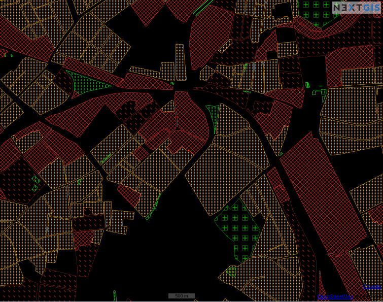
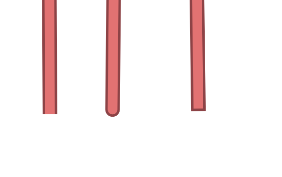

.. sectionauthor:: Артём Светлов <artem.svetlov@nextgis.ru>

.. _ngweb_style_create:
    
Стили слоёв
===========

Стили служат для описания способов отрисовки геоданных. Для создания 
стиля необходимо в окне свойств слоя в блоке операций выбрать: 
:menuselection:`Добавить стиль --> Стиль MapServer`. При этом откроется окно, в 
котором можно импортировать стиль из QGIS в формате qgs или ввести его вручную. 

При импорте стиля из формата qgs, он сконвертируется в особый формат. Следует 
заметить, что конвертируются только основные возможности отрисовки геометрий.
Если в импортируем стиле идет выборка по условию, то вариант для пустого 
значения нужно размещать последним (при импорте из QGIS он попадает первым).

Теги языка картостилей
----------------------------------

Для правки стиля, или написания нового рекомендуется взять код какого-нибудь существующего стиля из примера, и потом дополнять его, а не писать с нуля.
  
Общие теги
~~~~~~~~~~~~~~~~~ 
  
* <color red="255" green="170" blue="127"/> - цвет заливки или линии
* <outlinecolor red="106" green="106" blue="106"/> - цвет обводки
* <width>0.5</width> - толщина линии или границы полигона в пикселях.
* <outlinewidth>3</outlinewidth> - ширина обводки
* <minscaledenom>1</minscaledenom> - не рисовать объект на масштабе больше указанного (когда карта крупнее чем)  .. todo: проверить пример
* <maxscaledenom>100000</maxscaledenom> - не рисовать объект на масштабе меньше указанного (когда карта мельче чем) 

Значки
~~~~~~~~~~~~~~~~~

   Демонстрация различных видов штриховок.

* <symbol>std:circle</symbol> - тип значка

   * std:rectangle - квадратик
   * std:circle - кружок
   * std:diamond - ромбик
   * std:triangle - треугольник острием вверх
   * std:triangle-equilateral - треугольник острием вниз
   * std:star - пятиконечная звёздочка
   * std:pentagon - пятиугольник
   * std:arrow - стрелка (по умолчанию вверх, можно поворачивать тегом <angle>45</angle>)
   * std:cross - +
   * std:xcross - x
   * std:line - коротенькая линия
   * std:hatch - длинная линия, стыкующаяся в текстуру

Эти значки можно использовать для рисования линии, заливки полигонов, или обозначения точек. Так же их можно комбинировать в такую конструкцию:

.. code-block:: xml

        <class>
            <expression>"industrial"</expression>
            <!-- Промзоны -->
            
            
            
 </class>

* <size>2</size> - размер значка в пикселях

Линейные объекты
~~~~~~~~~~~~~~~~

* <gap>10</gap> - шаг пунктира (используется вместе с <symbol>std:circle</symbol>)
* <width>8</width> - ширина линии в пикселах
* <classitem>PLACE</classitem> - выборка по атрибуту с названием PLACE. Так же смотрите пример в  #Выборка.
  Поддерживаются следующие операторы
  
  * имя атрибута
  * !=
  * >=
  * <=
  * <
  * >
  * =* - сравнение строк без учёта раскладки.

  * =
  * lt - меньше
  * gt - больше
  * ge - больше или равно
  * le - меньше или равно
  * eq - равно
  * ne - не равно
  * and - И
  * && - И
  * or - ИЛИ
  * || - ИЛИ
  
* <linejoin>round</linejoin> - рисование линии в углах поворота
* <linecap>round</linecap> - рисование начала и конца линии

   <linecap>butt</linecap> / <linecap>round</linecap> / <linecap>square</linecap>

* <pattern>2.5 4.5</pattern> - шаблон пунктира 

.. todo:: узнать про цифры

* <angle> - угол поворота значка. Так же можно поворачивать штриховку.

Подписи
~~~~~~~~

* <labelitem>a_hsnmbr</labelitem> - название атрибута, из которого берётся подпись.
* LABELMAXSCALEDENOM  

.. todo:: проверить пример

* LABELMINSCALEDENOM  

.. todo:: проверить пример

* LABELCACHE [on|off] - не проверял, нашел в исходниках
* <position>ur</position> - направление сдвига подписи.

   * ur - ↗ вверх вправо (в книгах по картографии рекомендуют так делать по умолчанию.
   * ul - ↖
   * uc - ↑
   * cl - ←
   * cc - строго по центру
   * cr - →
   * ll - ↙
   * lc - ↓
   * lr - ↘
   * auto

* <Maxoverlapangle> - ?  

Неизвестные атрибуты
~~~~~~~~~~~~~~~~~~~~~~~

.. todo:: узнать, реализованы ли они

* MAXGEOWIDTH - не проверял, нашел в исходниках
* MINGEOWIDTH - не проверял, нашел в исходниках
* OFFSITE - не проверял, нашел в исходниках
* OPACITY [integer|alpha] - не проверял, нашел в исходниках
* SIZEUNITS [feet|inches|kilometers|meters|miles|nauticalmiles|pixels] - не проверял, нашел в исходниках
* SYMBOLSCALEDENOM [double] - не проверял, нашел в исходниках
* TYPE [chart|circle|line|point|polygon|raster|query] - не проверял, нашел в исходниках

Примеры картостилей
----------------------------------

OSM-default
----------------------------------

Полигональный слой с ограничением по масштабу и подписями
~~~~~~~~~~~~~~~~~~~~~~~~~~~~~~~~~~~~~~~~~~~~~~~~~~~~~~~~~~~~~~

.. code-block:: xml

	<map>
	  <layer>
	    <labelitem>a_hsnmbr</labelitem>
	    <class>
	      
	      <label>
		<type>truetype</type>
		regular
		<size>8.25</size>
		<color blue="0" green="0" red="0"/>
		<outlinewidth>3</outlinewidth>
		<outlinecolor blue="255" green="255" red="255"/>
		<position>ur</position>
		<maxscaledenom>10000</maxscaledenom>
	      </label>
	    </class>
	  </layer>
	</map>

Точечный белый кружок
~~~~~~~~~~~~~~~~~~~~~~~~~~~~~~~~~~~~~~~~~~~~~~~~~~~~~~~~~~~~~~

.. code-block:: xml

     

Линия из маленьких чёрных кружков
~~~~~~~~~~~~~~~~~~~~~~~~~~~~~~~~~~~~~~~~~~~~~~~~~~~~~~~~~~~~~~

.. code-block:: xml

     

Выборка
~~~~~~~~~~~~~~~~~~~~~~~~~~~~~~~~~~~~~~~~~~~~~~~~~~~~~~~~~~~~~~

.. code-block:: xml

	<map>
	  <layer>
	    <labelitem>NAME</labelitem>
	    <classitem>PLACE</classitem>
	    <class>
	      <expression>"city"</expression>
	      
	      
	      <label>
		<type>truetype</type>
		regular
		<size>18</size>
		<color blue="0" green="0" red="0"/>
		<outlinewidth>3</outlinewidth>
		<outlinecolor blue="255" green="255" red="255"/>
		 <position>ur</position>
	      </label>
	    </class>
	    <class>
	      <expression>"town"</expression>
	      
	      
	      <label>
		<type>truetype</type>
		regular
		<size>14</size>
		<color blue="0" green="0" red="0"/>
		<outlinewidth>3</outlinewidth>
		<outlinecolor blue="255" green="255" red="255"/>
		 <position>ur</position>
	      </label>
	    </class>
	    <class>
	      <expression>"village"</expression>
	      
	      <label>
		<type>truetype</type>
		regular
		<size>8.25</size>
		<color blue="0" green="0" red="0"/>
		<outlinewidth>3</outlinewidth>
		<outlinecolor blue="255" green="255" red="255"/>
		<position>ur</position>
	      </label>
	    </class>
	    <class>
	      <expression>"hamlet"</expression>
	      
	      <label>
		<type>truetype</type>
		regular
		<size>8.25</size>
		<color blue="0" green="0" red="0"/>
		<outlinewidth>3</outlinewidth>
		<outlinecolor blue="255" green="255" red="255"/>
		<position>ur</position>
	      </label>
	    </class>
	    <class>
	      <expression>"locality"</expression>
	      
	      <label>
		<type>truetype</type>
		regular
		<size>6.5</size>
		<color blue="0" green="0" red="0"/>
		<outlinewidth>3</outlinewidth>
		<outlinecolor blue="255" green="255" red="255"/>
		<position>ur</position>
	      </label>
	    </class>
	    <class>
	      <expression>''</expression>
	      
	      <label>
		<type>truetype</type>
		regular
		<size>8.25</size>
		<color blue="0" green="0" red="0"/>
		<outlinewidth>3</outlinewidth>
		<outlinecolor blue="255" green="255" red="255"/>
		<position>ur</position>
	      </label>
	    </class>
	  </layer>
	</map>

Площадной слой с классификацией по значению поля и подписями
~~~~~~~~~~~~~~~~~~~~~~~~~~~~~~~~~~~~~~~~~~~~~~~~~~~~~~~~~~~~~~

.. code-block:: xml

	<map>
	<layer>
	  <labelitem>NAME</labelitem>
	    <class>
	      <expression>(([num] gt 18) and ([num] le 26.1))</expression>
	      
	       <label>
		<type>truetype</type>
		regular
		<size>8.25</size>
		<color blue="0" green="0" red="0"/>
		<outlinewidth>3</outlinewidth>
		<outlinecolor blue="255" green="255" red="255"/>
		<position>ur</position>
		<maxscaledenom>7000000</maxscaledenom>
	      </label>
	    </class>
	  
	      <class>
	      <expression>(([num] gt 26.1) and ([num] le 28.1))</expression>
	      
		 <label>
		<type>truetype</type>
		regular
		<size>8.25</size>
		<color blue="0" green="0" red="0"/>
		<outlinewidth>3</outlinewidth>
		<outlinecolor blue="255" green="255" red="255"/>
		<position>ur</position>
		<maxscaledenom>7000000</maxscaledenom>
	      </label>
	    </class>
	  
	  
	    <class>
	      <expression>(([num] gt 28.1) and ([num] le 30))</expression>
	      
	       <label>
		<type>truetype</type>
		regular
		<size>8.25</size>
		<color blue="0" green="0" red="0"/>
		<outlinewidth>3</outlinewidth>
		<outlinecolor blue="255" green="255" red="255"/>
		<position>ur</position>
		<maxscaledenom>7000000</maxscaledenom>
	      </label>
	    </class>
	  
	  </layer>
	</map>

OSM settlement-point
~~~~~~~~~~~~~~~~~~~~~~~~~~~~~~~~~~~~~~~~~~~~~~~~~~~~~~~~~~~~~~

.. code-block:: xml

	<!-- Стиль с разделением по масштабам-->
	<!-- Версия 2015-07-24 -->
	<map>
	  <layer>
	    <labelitem>NAME</labelitem>
	    <classitem>PLACE</classitem>
	    <class>
	      <expression>"city"</expression> <!-- Большой город -->
	      
	      
	      <label>
		<type>truetype</type>
		regular
		<size>18</size>
		<color blue="0" green="0" red="0"/>
		<outlinewidth>3</outlinewidth>
		<outlinecolor blue="255" green="255" red="255"/>
		 <position>ur</position>
	      </label>
	    </class>
	    <class>
	      <expression>"town"</expression> <!-- Средний или малый город -->
	      
	      
	      <label>
		<type>truetype</type>
		regular
		<size>14</size>
		<color blue="0" green="0" red="0"/>
		<outlinewidth>3</outlinewidth>
		<outlinecolor blue="255" green="255" red="255"/>
		 <position>ur</position>
		<maxscaledenom>6000000</maxscaledenom>
	      </label>
	    </class>
	    <class>
	      <expression>"village"</expression> <!-- Посёлок  -->
	      
	      <label>
		<type>truetype</type>
		regular
		<size>8.25</size>
		<color blue="0" green="0" red="0"/>
		<outlinewidth>3</outlinewidth>
		<outlinecolor blue="255" green="255" red="255"/>
		<position>ur</position>
		<maxscaledenom>1000000</maxscaledenom>
	      </label>
	    </class>
	    <class>
	      <expression>"hamlet"</expression> <!-- Деревня -->
	      
	      <label>
		<type>truetype</type>
		regular
		<size>8.25</size>
		<color blue="0" green="0" red="0"/>
		<outlinewidth>3</outlinewidth>
		<outlinecolor blue="255" green="255" red="255"/>
		<position>ur</position>
		<maxscaledenom>500000</maxscaledenom>
	      </label>
	    </class>
	    <class>
	      <expression>"locality"</expression> <!-- Необитаемая местность -->
	      
	      <label>
		<type>truetype</type>
		regular
		<size>6.5</size>
		<color blue="0" green="0" red="0"/>
		<outlinewidth>3</outlinewidth>
		<outlinecolor blue="255" green="255" red="255"/>
		<position>ur</position>
		<maxscaledenom>500000</maxscaledenom>
	      </label>
	    </class>
	    <class>
	      <expression>''</expression>
	      
	      <label>
		<type>truetype</type>
		regular
		<size>8.25</size>
		<color blue="0" green="0" red="0"/>
		<outlinewidth>3</outlinewidth>
		<outlinecolor blue="255" green="255" red="255"/>
		<position>ur</position>
	      </label>
	    </class>
	  </layer>
	</map>

railway-line
~~~~~~~~~~~~~~~~~~~~~~~~~~~~~~~~~~~~~~~~~~~~~~~~~~~~~~~~~~~~~~

.. code-block:: xml

	<!-- Стиль railway-line с разделением по масштабам 
	version 2015-07-24 -->
	<map>
	  <layer>
	    <classitem>RAILWAY</classitem>
	    <class>
	      <expression>"abandoned"</expression>
	      
	      
	    </class>
		<class>
	      <expression>"razed"</expression>
	      
	      
	    </class>
	    <class>
	      <expression>"construction"</expression>
	      
	      
	    </class>
	    <class>
	      <expression>"crossing"</expression>
	      
	    </class>
	    <class>
	      <expression>"light_rail"</expression>
	      
	    </class>
	    <class>
	      <expression>"narrow_gauge"</expression>
	      
	    </class>
	    <class>
	      <expression>"platform"</expression>
	      
	    </class>
	    <class>
	      <expression>"rail"</expression>
	      
	      
	       
	    </class>
	    <class>
	      <expression>"siding"</expression>
	      
	    </class>
	    <class>
	      <expression>"subway"</expression>
	      
	    </class>
	    <class>
	      <expression>"tram"</expression>
	      
	    </class>
	  </layer>
	</map>

OSM water-line
~~~~~~~~~~~~~~~~~~~~~~~~~~~~~~~~~~~~~~~~~~~~~~~~~~~~~~~~~~~~~~

.. code-block:: xml

	<!-- Стиль water-line с разделением по масштабам-->
	<!-- Версия 2015-07-24 -->
	<map>
	  <layer>
	    <classitem>Waterway</classitem>
	    <labelitem>name</labelitem>
	    <class>
	      <expression>"river"</expression>
	      
	      <label>
		<type>truetype</type> <!-- Подпись -->
		bold
		<size>7</size>
		<color blue="255" green="255" red="255"/>
		<outlinewidth>1</outlinewidth>
		<outlinecolor red="102" green="153" blue="204"/>
		<angle>auto</angle>
		<repeatdistance>300</repeatdistance>
		<maxoverlapangle>90.0</maxoverlapangle>
		<maxscaledenom>500000</maxscaledenom>
	      </label>
	      </class> 
	    
	      <class>
	      <expression>"canal"</expression>  
	      
	      
	      <label>
		<type>truetype</type> <!-- Подпись -->
		bold
		<size>7</size>
		<color blue="255" green="255" red="255"/>
		<outlinewidth>1</outlinewidth>
		<outlinecolor red="102" green="153" blue="204"/>
		<angle>auto</angle>
		<repeatdistance>300</repeatdistance>
		<maxoverlapangle>90.0</maxoverlapangle>
		<maxscaledenom>500000</maxscaledenom>
	      </label>
	      </class> 
	    
	      <class>
	      <expression>"stream"</expression>
	      
	      </class> 
	    
	      <class>
	      <expression>"drain"</expression>
	      
	      </class> 
	  </layer>
	</map>

OSM water-polygon
~~~~~~~~~~~~~~~~~~~~~~~~~~~~~~~~~~~~~~~~~~~~~~~~~~~~~~~~~~~~~~

.. code-block:: xml

	<!-- стиль water-polygon
	Версия 2015-07-24 
	Нужно добавить 
	-водохранилища
	-штриховку для болот
	-->
	<map>
	  <layer>
	    <labelitem>NAME</labelitem>
	    <classitem>NATURAL</classitem>
	    <class>
	      <expression>"water"</expression> <!-- Вода -->
	      
		 <label>
		<type>truetype</type>
		regular
		<size>7</size>
		<color red="102" green="153" blue="204"/>
		<outlinewidth>2</outlinewidth>
		<outlinecolor red="255" green="255" blue="222"/>
		<!-- Ограничение подписи по масштабу -->
		<minscaledenom>1</minscaledenom>
		<maxscaledenom>100000</maxscaledenom>    
	      </label>
	    </class>
	    <class>
	      <expression>"wetland"</expression> <!-- Болото -->
		  
		 <label>
		<type>truetype</type>
		regular
		<size>7</size>
		<color red="102" green="153" blue="204"/>
		<outlinewidth>2</outlinewidth>
		<outlinecolor red="255" green="255" blue="222"/>
		<!-- Ограничение подписи по масштабу -->
		<minscaledenom>1</minscaledenom>
		<maxscaledenom>100000</maxscaledenom>    
	      </label>
	    </class>
	  </layer>
	</map>

OSM-black
----------------------------------

OSM landuse-polygon
~~~~~~~~~~~~~~~~~~~~~~~~~~~~~~~~~~~~~~~~~~~~~~~~~~~~~~~~~~~~~~

.. code-block:: xml

	<map> <!-- Демонстрация штриховок, предполагается что под этим слоем будет чёрный фон-->
	    <layer>
		<labelitem>OSM_ID</labelitem>
		<classitem>LANDUSE</classitem>
		<class>
		    <expression>"residential"</expression>
		    <!-- Жилые зоны -->
		    
		    
		</class>
		<class>
		    <expression>"grass"</expression>
		    <!-- Газоны зоны -->
		    
		    
		</class>
		<class>
		    <expression>"commercial"</expression>
		    <!-- Жилые зоны -->
		    
		    
		</class>
		<class>
		    <expression>"industrial"</expression>
		    <!-- Промзоны -->
		    
		    
		    
		</class>
		<class>
		    <expression>"cemetery"</expression>
		    <!-- Кладбоны -->
		    
		    
		    
		    
		</class>
	    </layer>
	</map>
