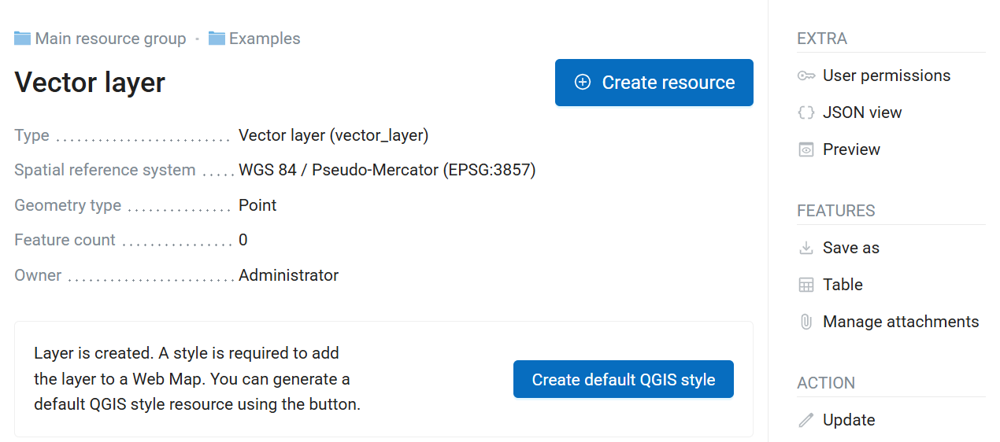
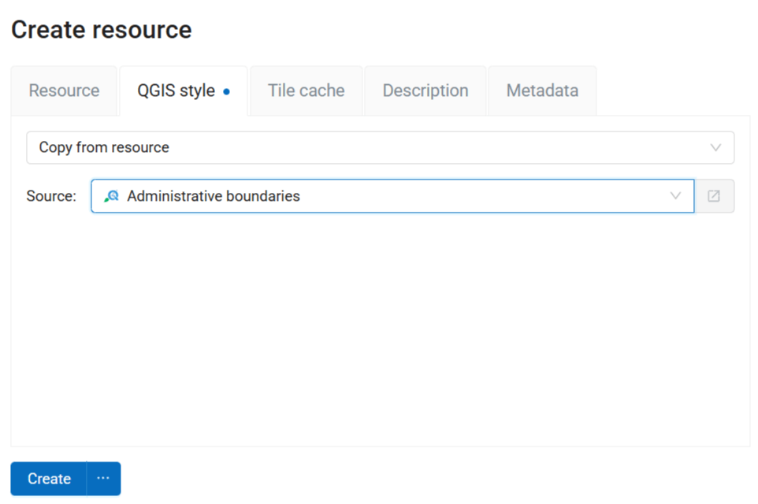
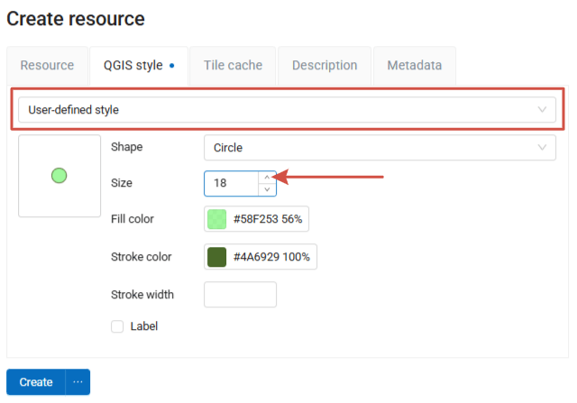
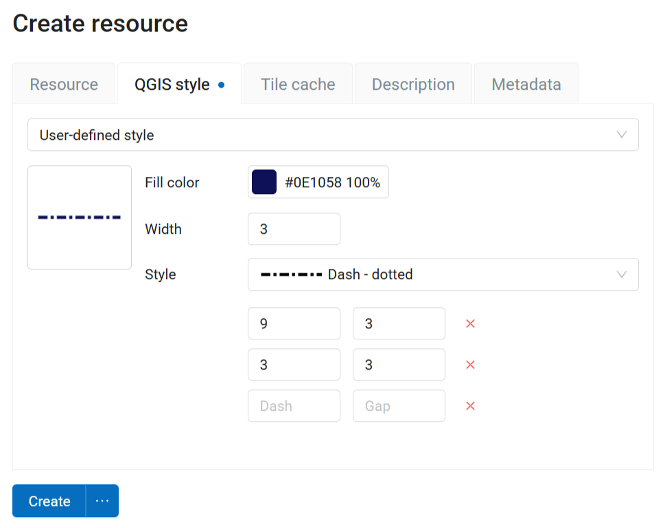
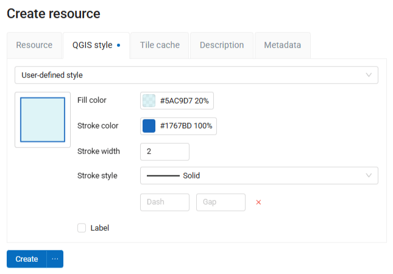
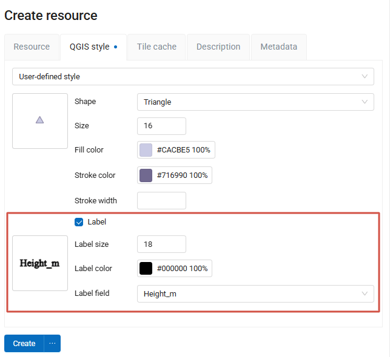
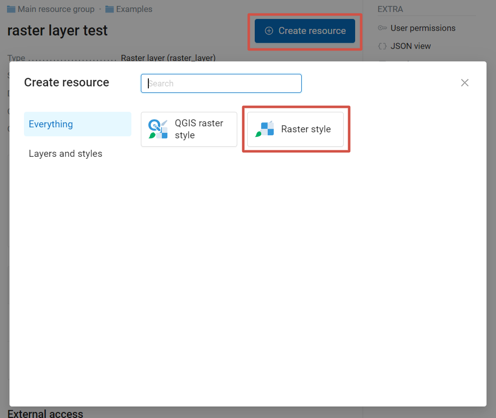
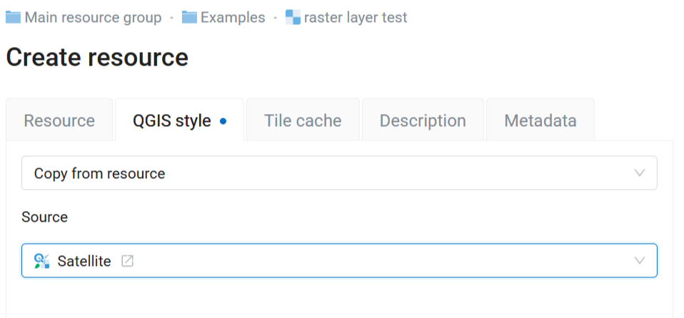

.. _ngw_style_create:
    
Styles
=====================

Style is a type of NextGIS resource that describes a way to render the geodata.
Styles are necessary to display geodata on a Web Map.

Style is related to a particular layer, so you can only create a style resource from the page of a layer resource.

For a Vector layer, you can:

* `create default style <https://docs.nextgis.com/docs_ngweb/source/mapstyles.html#mapserver-style-select>`_;
* `upload a file <https://docs.nextgis.com/docs_ngweb/source/mapstyles.html#qgis-style-from-file>`_;
* `set up custom style parameters <https://docs.nextgis.com/docs_ngweb/source/mapstyles.html#custom-qgis-style>`_ in the web interface;
* `enter in string form using MapServer tags <https://docs.nextgis.com/docs_ngweb/source/mapstyles.html#mapserver-style>`_;
* copy an existing style.

For a Raster layer, you can:

* `create default QGIS style <https://docs.nextgis.com/docs_ngweb/source/mapstyles.html#raster-style>`_;
* `create default raster style <https://docs.nextgis.com/docs_ngweb/source/mapstyles.html#ngweb-create-raster-style-pic>`_;
* upload a file in QML or SLD format;
* set up the bands in the interface;
* `copy an existing style <https://docs.nextgis.com/docs_ngweb/source/mapstyles.html#ngweb-copy-raster-style-pic>`_.

You can get some inspiration, as well as ready-to-go style files and projects in our `Style Gallery <https://nextgis.com/map-styles/>`_.

.. raw:: html

   <iframe width="560" height="315" src="https://www.youtube.com/embed/f9SGpeopJ4A?si=Bsv9y65l8HQMMvIu" title="YouTube video player" frameborder="0" allow="accelerometer; autoplay; clipboard-write; encrypted-media; gyroscope; picture-in-picture; web-share" referrerpolicy="strict-origin-when-cross-origin" allowfullscreen></iframe>

Watch on `youtube <https://youtu.be/f9SGpeopJ4A?si=O3jxtvEhMWxBf6vD>`_.

Formats
---------

By now NextGIS Web supports two rendering libraries: QGIS and :term:`MapServer`. 

* QGIS style can be uploaded from a QML file or created in Web GIS, it has much more settings. 
* You can write MapServer style yourself as a text. 

.. _ngw_qgis_style:

QGIS Vector Style
------------------

Open the properties page of the layer you want create style for. To create a default QGIS style, just press the blue button on the resource page of the layer.

   Creating default QGIS style

If you want to add a customized style, press **Create resource** button and select "QGIS vector style" (see :numref:`select_qgis_style`).

.. figure:: _static/ngweb_create_QGIS_style_en.png
   :name: select_qgis_style
   :align: center
   :width: 20cm
 
   Selecting QGIS style resourse
 

After the selection of "QGIS vector style" create resource dialog will open.

You can upload a file or create a simple vector style in the dialog.

.. _ngw_qgis_style_file:

QGIS style from file
~~~~~~~~~~~~~~~~~~~~~

To upload a pre-made style click **Select a style** on the "QGIS style" tab or drag a file to this field (see in :numref:`upload_svg_qgis_style`).

.. figure:: _static/upload_qgis_style_en.png
   :name: upload_svg_qgis_style
   :align: center
   :width: 16cm

   Uploading QML file

You can type a custom display name for the new style in the :guilabel:`Resource` tab. You can also add resource description and metadata on the corresponding tabs. Tile cache settings are described in details `in this section <https://docs.nextgis.com/docs_ngweb/source/mapstyles.html#tile-cache>`_.

After the QML file is uploaded click **Create**. After the style is created, its resource page opens (see :numref:`svg_res_style`).

.. figure:: _static/svg_res_style_en_2.png
   :name: svg_res_style
   :align: center
   :width: 20cm

   QGIS style resource page
    
You can `replace <https://docs.nextgis.com/docs_ngweb/source/mapstyles.html#ngw-qgis-style-custom-edit>`_ the QML file of a style.

.. _ngw_qgis_style_copy:

Copy style from existing resource
~~~~~~~~~~~~~~~~~~~~~~~~~~~~~~~~~

You can use a style that is added to another layer in your Web GIS. Select **Copy from resource** from the dropdown menu.

Click on the "Source" field and select the style you want to copy.

   Creating style by replicating an existing style resource

Click **Create** to finish.

A new style is created, identical to the source style.

.. _ngw_qgis_style_svg:

SVG markers
~~~~~~~~~~~~~~~

There are several ways to add custom markers to a style for NextGIS Web:

1. Embed marker file into QGIS style.

.. raw:: html

   <iframe width="560" height="315" src="https://www.youtube.com/embed/bJLuYp73u_E?si=Sv-VJrEWh5RZzjTh" title="YouTube video player" frameborder="0" allow="accelerometer; autoplay; clipboard-write; encrypted-media; gyroscope; picture-in-picture; web-share" referrerpolicy="strict-origin-when-cross-origin" allowfullscreen></iframe>

Watch on `youtube <https://youtu.be/bJLuYp73u_E?si=6vMNCQUz45DJfE79>`__.

2. Publish the image file online and use its URL as the path to SVG marker.

.. raw:: html

   <iframe width="560" height="315" src="https://www.youtube.com/embed/lLlKx2FTuE4?si=8tOlWjJowqewiEiq" title="YouTube video player" frameborder="0" allow="accelerometer; autoplay; clipboard-write; encrypted-media; gyroscope; picture-in-picture; web-share" referrerpolicy="strict-origin-when-cross-origin" allowfullscreen></iframe>

Watch on `youtube <https://youtu.be/lLlKx2FTuE4?si=wYoDJ9QUtl-4eUXm>`__.

3. Add `SVG marker library <https://docs.nextgis.com/docs_ngweb/source/mapstyles.html#ngw-create-svg-marker-lib>`_ to your Web GIS.

To create a style using SVG markers from a library resource, you need to specify the **SVG marker** type in the layer properties in QGIS and enter the **full path to the file** on the local machine (:numref:`svg_qgis_style`). The file name must match the one loaded in the *SVG Marker Library* resource that the user selects when loading the QML file.

.. figure:: _static/save_svg_qgis_style_en.png
   :name: save_svg_qgis_style
   :align: center
   :width: 20cm

   Save QML file in NextGIS QGIS
   
.. figure:: _static/svg_qgis_style_en.png
   :name: svg_qgis_style
   :align: center
   :width: 20cm

   Layer properties settings in NextGIS QGIS

.. _ngw_create_svg_marker_lib:

SVG Marker Library
~~~~~~~~~~~~~~~~~~~~~~~~

In Web GIS you can create SVG marker libraries to be displayed using QGIS styles of vector layers.
Press **Create resource** button and select **SVG marker library** (see :numref:`select_svg_lib`). 

.. figure:: _static/ngweb_create_SVG_lib_en.png
   :name: select_svg_lib
   :align: center
   :width: 20cm
   
   Selecting SVG marker library resource type

In the opened window, enter the name of the resource (see :numref:`name_svg_lib`).

.. figure:: _static/name_svg_lib_eng_2.png
   :name: name_svg_lib
   :align: center
   :width: 20cm
   
   SVG marker library name
   
Add description and metadata on the corresponding tabs if you need them.
Metadata is used in external apps working with `API <https://docs.nextgis.com/docs_ngweb_dev/doc/developer/toc.html>`_.

In the SVG marker library tab you need to upload SVG markers from your device. You can upload markers as individual files or as a zip-archive.
The archive must contain only markers.

.. figure:: _static/ngweb_upload_svg_en.png
   :name: upload_svg
   :align: center
   :width: 16cm
   
   Uploading SVG markers

After all icons have been uploaded to the library, you will see the list of the file names. Click **Create** to complete the process. 

  
.. figure:: _static/list_svg_eng.png
   :name: list_svg
   :align: center
   :width: 20cm
   
   List of SVG markers uploaded to the library

Then create a style with the QML file and select the SVG library resource.

.. figure:: _static/upload_svg_qgis_style_en_2.png
   :name: upload_svg_lib_qgis_style
   :align: center
   :width: 16cm

   QGIS style using SVG marker library

SVG markers can also be embedded in a QGIS style. That way you wouldn't need to create a separate library resource.

.. _ngw_qgis_style_custom:

Custom QGIS style
~~~~~~~~~~~~~~~~~~~

If you want to create a simple custom style, select "User-defined style" in the drop-down menu. You can set up:

* Marker shape: square, circle, triangle, star, cross;
* Marker size and stroke width. Enter a number or use the arrows in the field;
* Fill color and stroke color and their opacity (by using sliders and eyedropper or entering values in HEX, HSB or RGB format);
* The style of the line / polygon outline: solid, dotted, dashed, dash-dotted;
* Labels (tick this option to view its settings): size, color and field selection.

   Custom QGIS style for points

   Custom QGIS style for lines

   Custom QGIS style for polygons

   Label settings

You can type a custom display name for the new style in the :guilabel:`Resource` tab. You can also add resource description and metadata on the corresponding tabs.

When all the parameters are set, click **Create**. Then the window of QGIS style will open.

Styles created this way can be edited directly in NextGIS Web.

See how it works in our video:

.. raw:: html

   <iframe width="560" height="315" src="https://www.youtube.com/embed/bujOcAhJskI?si=MRxjkPLHGI_MjIqe" title="YouTube video player" frameborder="0" allow="accelerometer; autoplay; clipboard-write; encrypted-media; gyroscope; picture-in-picture; web-share" referrerpolicy="strict-origin-when-cross-origin" allowfullscreen></iframe>

Watch on `youtube <https://youtu.be/bujOcAhJskI?si=wCRz_Wgk7ymIXSvC>`__.

.. _ngw_qgis_style_custom_edit:

Editing QGIS style
--------------------

To edit a style click on the pencil icon by the style's name in the layer tree.

.. figure:: _static/QGIS_style_select_edit_en.png
   :name: QGIS_style_select_edit_pic
   :align: center
   :width: 20cm

   Opening the Update resource dialog

In the opened window you can **replace** the style by uploading a new file from your device. To do so, in the "QGIS style" tab select "Style from file" in the dropdown menu, then add a new :term:`QML` or :term:`SLD` file and click **Save**.

A simple QGIS vector style, the default style, for example, can be **edited** directly in NextGIS Web.

To do so, in the "QGIS style" tab select "User-defined style" in the dropdown menu. You can modify:

* Marker shape
* Marker size and stroke width (type it or use arrows in the field)
* Fill color and stroke color and their opacity (by using sliders and eyedropper or entering values in HEX, HSB or RGB format)

.. figure:: _static/QGIS_style_custom_edit_en.png
   :name: QGIS_style_custom_edit_pic
   :align: center
   :width: 16cm

   Editing vector style marker

.. _ngw_mapserver_style:

MapServer style
---------------

To create **MapServer** style open layer properties of the layer you want create style for.
Press **Create resource** button and select "MapServer style" (see in :numref:`ngweb_window_create_resource_mapserver_pic`).

.. figure:: _static/ngweb_create_mapserver_style_en.png
   :name: ngweb_window_create_resource_mapserver_pic
   :align: center
   :width: 20cm

   Selecting MapServer style

You can type a custom display name for the new style in the :guilabel:`Resource` tab. You can also add resource description and metadata on the corresponding tabs.

.. figure:: _static/mapserver_style_custom_name_en.png
   :name: mapserver_style_custom_name_pic
   :align: center
   :width: 16cm

   Custom name for MapServer style

Tile cache settings are described in details `in this section <https://docs.nextgis.com/docs_ngweb/source/mapstyles.html#tile-cache>`_.

In the "MapServer style" tab you can write a style manually (see in :numref:`ngweb_create_resource_mapsrev_pic`). See MapServer  `templates <https://docs.nextgis.com/docs_ngweb/source/mapservertemplates.html>`_ and `tags <https://docs.nextgis.com/docs_ngweb/source/mapservertemplates.html#ngw-mapserver-tags>`_.

Otherwise default values are used.

.. figure:: _static/ngweb_create_resource_mapsrev_eng.png
   :name: ngweb_create_resource_mapsrev_pic
   :align: center
   :width: 20cm
 
   "MapServer style" tab

Click **Create** to finish the process. The window of the created MapServer style will open (see in :numref:`ngweb_File_format_window_MapServer_pic`).

.. figure:: _static/MapServer_created_en.png
   :name: ngweb_File_format_window_MapServer_pic
   :align: center
   :width: 20cm

   MapServer style window
 
.. toctree::
   :maxdepth: 1

   mapservertemplates

.. _ngw_process_create_raster_style:

Raster style
------------------

After a raster file is successfully uploaded and a raster layer is created, you need to create a style to display it on a Web Map. There are several ways to create a raster style:

* Create default QGIS raster style on the layer's page.

.. todo:: _static/ngw_create_def_raster_style_en.png
   :name: ngw_create_def_raster_style_pic
   :align: center
   :width: 16cm

   Creating default QGIS style for the raster layer

* Create default Raster style via **Create resource** button;

   Creating Raster style

On the Tile cache tab you can enable cache, allow using tiles in non-tile requests, set up time after which the tiles expire (TTL) and max zoom level. To delete all previously created tiles of the style, check "Flush".

* Create QGIS raster style using **Create resource** button. In the dropdown menu you can select:

   * Style from file - select a QML or SLD file. 
   * User-defined style - pick three channels, the values of these channels will be used to calculate a color in RGB model. You can set up min and max values for each channel;
   * Default style - allows to add a default QGIS style to a layer that already has styles;
   * Copy from resource - select a QGIS style of another raster layer to copy it.

   Copying QGIS raster style

You will need this style to `add the raster to a Web Map <https://docs.nextgis.com/docs_ngweb/source/webmaps_admin.html#ngw-map-layers>`_.

.. _ngw_create_tile_cache:

Tile cache
------------

Caching provides faster rendering of Web Map layers. It can be enabled for `vector <https://docs.nextgis.com/docs_ngweb/source/mapstyles.html>`_ and `raster layer styles <https://docs.nextgis.com/docs_ngweb/source/mapstyles.html#ngw-process-create-raster-style>`_ as well as for `WMS <https://docs.nextgis.com/docs_ngweb/source/connections.html#wms>`_ and `TMS <https://docs.nextgis.com/docs_ngweb/source/connections.html#tms>`_ layers.

To enable caching go to the Tile cache tab of the resource and check "Enabled".

In the **tile cache** settings you can also configure the following parameters (see :numref:`tile_cache_settings`):

* *Enabled* checkbox;
* *Allow using tiles in non-tile requests* checkbox - the requested image (not a tile) will be prepared from previously cached tiles (if available);
* Input field *Maximum zoom level* - a threshold value, above which the cache is not accessed and the image is formed "on the fly";
* Input field *TTL, sec* (Time to live) - a time of storage of tiles on the server in seconds, after which the image will be formed again on the next request. TTL = 0 means that the storage time is unlimited;
* *Flush* checkbox - write only - clears the tile cache when saving the style.

.. figure:: _static/tile_cache_settings_eng.png
   :name: tile_cache_settings
   :align: center
   :width: 20cm

   Tile cache settings
   

.. _ngw_add_map_style:

Adding a style on the map
--------------------------

To edit a Web Map click pencil icon near it or click the Web Map and in actions pane "Action" select "Update". In "Update resource" layer select **Layers** tab (see in :numref:`select_svg_style`).

Here you can do the following actions:

1. Add layer
2. Add group
3. Remove layer or group
4. Modify the order of the layers on the map

Click "Add layer" and in opened window select the QGIS style of the layer, then click "OK". After that click "Save" 

.. figure:: _static/admin_webmap_add_layers_en_2.png
   :name: select_svg_style
   :align: center
   :width: 20cm
   
   Adding style on the map
   

In the "Web Map" actions pane of the Web Map properties window select "Display". The map will open, layers tree will be on the left. To hide/display a layer place a tick near the layer .

.. figure:: _static/webmap_svg_en_2.png
   :name: webmap_svg_pic
   :align: center
   :width: 20cm

   Layer with special SVG markers in the QGIS style on a Web Map    

