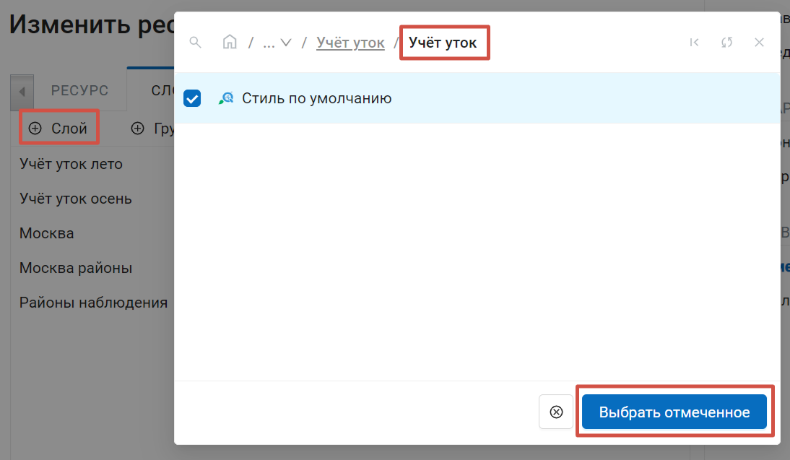
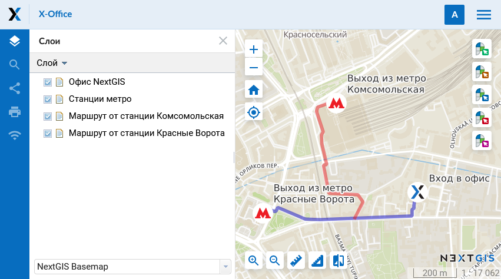

.. sectionauthor:: Артём Светлов <artem.svetlov@nextgis.ru>
.. sectionauthor:: Роман Гайнуллов <roman.gainullov@nextgis.ru>

.. _ngw_style_create:
    
Стили векторных слоёв
=====================

Стили служат для описания способов визуализации геоданных и являются одним из ресурсов NextGIS Web. 
Именно стиль добавляется на карты для представления на ней геоданных.

Стиль связан с конкретным слоем, поэтому пункта "Стиль" в основном списке ресурсов нет. 
Для создания стиля необходимо сначала зайти в ресурс слоя, для которого он создаётся.

Форматы
-----------

Сейчас NextGIS Web поддерживает две библиотеки рендеринга: "QGIS" и "Mapserver". 

* У стиля QGIS гораздо больше настроек и несколько варинатов содания. 
* Стиль Mapserver можно писать в текстовом виде. 

.. _ngw_qgis_style:

Векторный стиль QGIS
----------

Зайдите в ресурс слоя, для которого хотите создать стиль.

Для того, чтобы создать стиль QGIS с настройками по умолчанию, достаточно нажать кнопку на странице слоя.

 
   Создание стиля QGIS по умолчанию

Если вы хотите настроить создаваемый стиль, то нужно в блоке операций на правой боковой панели в разделе "Создать ресурс" выбрать "Векторный стиль QGIS" (см. :numref:`select_qgis_style_pic`).

 
   Выбор стиля QGIS

После выбора «Векторный стиль QGIS» откроется диалог создания ресурса. 

Вы можете загрузить файл стиля или создать простой векторный стиль самостоятельно.

Стиль QGIS из файла
~~~~~~~~~~~~~~~~~~~~~

Для того, чтобы загрузить готовый стиль, на вкладке **Стиль QGIS** необходимо выбрать QML-файл стиля на устройстве или перетащить его в эту область (см. :numref:`upload_svg_qgis_style`).

Если вы хотите использовать нестандартные маркеры, можно выбрать ресурс библиотеки SVG, в которой находится иконка для отображения на веб-карте.

   Загрузка файла QML

.. warning::   
   Необходимый для загрузки файл может быть получен с помощью `NextGIS QGIS <https://nextgis.ru/nextgis-qgis/>`_ и сохранен на компьютере (см. :numref:`save_svg_qgis_style`). Для создания стиля, использующего SVG-маркеры, необходимо указать в свойствах слоя тип **SVG-маркер** и прописать полный путь до **файла** на машине (см. :numref:`svg_qgis_style`). Название файла должно совпадать с тем, что загружен в ресурс *Библиотека маркеров SVG*, который пользователь выбирает при загрузке файла QML.

.. figure:: _static/save_svg_qgis_style.png
   :name: save_svg_qgis_style
   :align: center
   :width: 20cm

   Сохранение QML-файла в NextGIS QGIS
   
.. figure:: _static/svg_qgis_style.png
   :name: svg_qgis_style
   :align: center
   :width: 20cm

   Настройка свойств стиля в NextGIS QGIS

На вкладке «Ресурс» вы можете задать пользовательское наименование стиля. Можно также ввести описание и метаданные на соответствующих вкладках. Настройки тайлового кэша подробно описаны в `данном <https://docs.nextgis.ru/docs_ngweb/source/mapstyles.html#ngw-create-tile-cache>`_ разделе.

После загрузки файла QML нажмите на кнопку "Создать". После обработки запроса откроется окно ресурса QGIS стиля (см. :numref:`svg_res_style_1`).

   Созданный ресурс QGIS стиля
    
Загруженный файл QML стиля можно :ref:`заменить <ngw_qgis_style_custom_edit>`.

.. _ngw_qgis_style_custom:

Пользовательский стиль QGIS
~~~~~~~~~~~~~~~~~~~~~

Если вы хотите самостоятельно создать простой векторный стиль, выберите в выпадающем меню "Пользовательский стиль". Доступные настройки зависят от типа геометрии слоя. Можно настроить:

* Форму символа (для точечных слоев): круг, квадрат, треугольник, звезда, крест;
* Размер символа (для точечных слоев). Можно ввести с клавиатуры или увеличить/уменьшить стрелочками;
* Ширину контура;
* Цвет и прозрачность заливки и контура. Можно выбрать пипеткой, настроить ползунками или ввести значения в системе HEX, HSB или RGB.

   Настройка пользовательского стиля для точечного слоя

   Настройка пользовательского стиля для слоя линий

   Настройка пользовательского стиля для слоя полигонов

На вкладке «Ресурс» вы можете задать пользовательское наименование стиля. Можно также ввести описание и метаданные на соответствующих вкладках. Настройки тайлового кэша подробно описаны в `данном <https://docs.nextgis.ru/docs_ngweb/source/mapstyles.html#ngw-create-tile-cache>`_ разделе.

Задав нужные параметры, нажмите на кнопку "Создать". После обработки запроса откроется окно ресурса QGIS стиля (см. :numref:`svg_res_style_2`).

   Созданный ресурс QGIS стиля

Созданный стиль QGIS можно редактировать.

.. _ngw_qgis_style_custom_edit:

Редактирование стиля QGIS
----------------------------

Для того, чтобы изменить стиль, нажмите на иконку карандаша справа от стиля в списке ресурсов.

   Вызов окна редактирования

В открывшемся окне вы можете **заменить** стиль, загрузив новый со своего устройства. Для этого нужно на вкладке "Стиль QGIS" в выпадающем меню выбрать "Стиль из файла" и затем добавить файл QML или SLD и нажать **Сохранить**.

Простой векторный стиль QGIS, например, стиль по умолчанию, можно **редактировать** прямо в браузере.

Для этого на вкладке "Стиль QGIS" в выпадающем меню выберите "Пользовательский стиль". Вы можете настроить:

* Форму символа (круг, квадрат, треугольник, звезда, крест)
* Размер символа и ширину контура (можно ввести с клавиатуры или увеличить/уменьшить стрелочками)
* Цвет и прозрачность заливки и контура (можно выбрать пипеткой, настроить ползунками или ввести значения в системе HEX, HSB или RGB)

   Редактирование маркера векторного стиля

.. _ngw_add_map_style:

Добавление стиля на карту
------------------------

Для добавления на веб-карту слоя со стилем QGIS необходимо открыть её в режиме редактирования (изменения). На вкладке **Слои** нужно добавить *стиль* соответствующего слоя (или слой, если этого требует специфика данных - TMS, WMS) и нажать **Сохранить** (см. :numref:`select_svg_style`). 

Также на данной вкладке можно:

1. Добавить слой
2. Добавить группу
3. Удалить слой или группу
4. Изменить отображемый порядок слоев
  

   
   Добавление QGIS стиля на веб-карту

Чтобы посмотреть карту, нажмите **Открыть** на правой боковой панели, находясь внутри ресурса *веб-карта*. Откроется окно веб-карты с загруженными стилями. Если в свойствах QML-файлов были прописаны пути до svg-маркеров и в настройках стилей в веб-интерфейсе указаны библиотеки соответствующих маркеров, то слой на карте отобразится соответствующим образом (см. :numref:`webmap_svg`).
  

   
   Веб-карта с QGIS стилем (с svg-маркерами)

.. _ngw_mapserver_style:

Стиль Mapserver
--------------

Для создания стиля **MapServer** необходимо сначала зайти в слой, для которого вы его создаёте. В окне свойств поля "Создать ресурс" выбрать "Стиль MapServer".

 
   Выбор стиля MapServer

После выбора "Стиль MapServer" откроется диалог создания ресурса (см. :numref:`ngweb_window_create_resource_mapserver_pic`).

На вкладке «Ресурс» вы можете задать пользовательское наименование стиля. Можно также ввести описание и метаданные на соответствующих вкладках. 

   Пользовательское наименование стиля Mapserver

Настройки тайлового кэша подробнее описаны в `данном <https://docs.nextgis.ru/docs_ngweb/source/mapstyles.html#ngw-create-tile-cache>`_ разделе. 

При желании на вкладке "Стиль MapServer" можно построчно ввести стиль вручную (см. :numref:`ngweb_create_resource_mapsrev_pic`). Если этого не сделать, будут использованы значения по умолчанию.

.. figure:: _static/ngweb_create_resource_mapsrev_rus.png
   :name: ngweb_create_resource_mapsrev_pic
   :align: center
   :width: 20cm
 
   Вкладка "Стиль MapServer"

После нажатия кнопки **Создать** начнется процесс обработки запроса, по окончании которого откроется  ресурс стиля Mapserver:

   Созданный стиль Mapserver

.. _ngw_create_tile_cache:

Тайловый кэш
------------

На вкладке **Тайловый кэш** при создании стиля (слоя для `WMS <https://docs.nextgis.ru/docs_ngweb/source/layers.html#c-wms>`_ и `TMS <https://docs.nextgis.ru/docs_ngweb/source/layers.html#tms>`_) пользователь имеет возможность задать настройки кэширования стиля (слоя для WMS и TMS) (см. :numref:`tile_cache_settings`):

* *Включен* -включение/выключение кэширования тайлов;
* *Разрешить тайлы для запросов изображений* - при запросе изображения (не тайла) использовать закэшированные тайлы при их наличии;
* *Максимальный масштабный уровень* - пороговое значение, выше которого обращение к кэшу не происходит, изображение карты рендерится на лету;
* *TTL, сек (Time to live)* - “время жизни” или хранения тайлов на сервере в секундах, после которого при следующем запросе изображение будет формироваться заново. Если TTL = 0, то время хранения тайлов не ограничено;
* *Очистить* - write only - очищает тайловый кэш при сохранении стиля.

   Настройки тайлового кэша

.. _ngw_mapstyles:

Теги языка картостилей Mapserver
----------------------------------

Для правки стиля или написания нового рекомендуется взять код какого-нибудь 
существующего стиля из примера, и потом дополнять его, а не писать с нуля.
  
Общие теги
~~~~~~~~~~~~~~~~~ 
  
* <color red="255" green="170" blue="127"/> - цвет заливки или линии
* <outlinecolor red="106" green="106" blue="106"/> - цвет обводки
* <width>0.5</width> - толщина линии или границы полигона в пикселях.
* <outlinewidth>3</outlinewidth> - ширина обводки
* <minscaledenom>1</minscaledenom> - не рисовать объект на масштабе больше указанного (когда карта крупнее чем) \
* <maxscaledenom>100000</maxscaledenom> - не рисовать объект на масштабе меньше указанного (когда карта мельче чем) 

Значки
~~~~~~~~~~~~~~~~~

.. figure:: _static/mapstyle_hatch_demo.png
   :name: ngweb_mapstyle_hatch_demo_pic
   :align: center
   :width: 16cm

   Демонстрация различных видов штриховок

* <symbol>std:circle</symbol> - тип значка

   * std:rectangle - квадратик
   * std:circle - кружок
   * std:diamond - ромбик
   * std:triangle - треугольник острием вверх
   * std:triangle-equilateral - треугольник острием вниз
   * std:star - пятиконечная звёздочка
   * std:pentagon - пятиугольник
   * std:arrow - стрелка (по умолчанию вверх, можно поворачивать тегом <angle>45</angle>)
   * std:cross - +
   * std:xcross - x
   * std:line - коротенькая линия
   * std:hatch - длинная линия, стыкующаяся в текстуру

Эти значки можно использовать для рисования линии, заливки полигонов, или обозначения точек. 
Так же их можно комбинировать в такую конструкцию:

.. code-block:: xml

        <class>
            <expression>"industrial"</expression>
            <!-- Промзоны -->
            
            
            
 </class>

* <size>2</size> - размер значка в пикселях

Линейные объекты
~~~~~~~~~~~~~~~~

* <gap>10</gap> - шаг пунктира (используется вместе с <symbol>std:circle</symbol>)
* <width>8</width> - ширина линии в пикселах
* <classitem>PLACE</classitem> - выборка по атрибуту с названием PLACE. Так же смотрите пример в  #Выборка.
  Поддерживаются следующие операторы
  
  * имя атрибута
  * !=
  * >=
  * <=
  * <
  * >
  * =* - сравнение строк без учёта раскладки.

  * =
  * lt - меньше
  * gt - больше
  * ge - больше или равно
  * le - меньше или равно
  * eq - равно
  * ne - не равно
  * and - И
  * && - И
  * or - ИЛИ
  * || - ИЛИ
  
* <linejoin>round</linejoin> - рисование линии в углах поворота
* <linecap>round</linecap> - рисование начала и конца линии

.. figure:: _static/admin_mapstyles_linecap.png
   :name: ngweb_admin_mapstyles_linecap.png
   :align: center
   :width: 10cm

   Пример <linecap>butt</linecap> / <linecap>round</linecap> / <linecap>square</linecap>.

* <pattern>2.5 4.5</pattern> - шаблон пунктира 
* <angle> - угол поворота значка. Так же можно поворачивать штриховку.

Подписи
~~~~~~~~

* <labelitem>a_hsnmbr</labelitem> - название атрибута, из которого берётся подпись.
* <minscaledenom>100</minscaledenom> - не выводить подпись на масштабе крупнее 1:1000
* <maxscaledenom>100000</maxscaledenom> - не выводить подпись на масштабе мельче 1:100000
* <position>ur</position> - направление сдвига подписи.

   * ur - ↗ вверх вправо (в книгах по картографии рекомендуют так делать по умолчанию)
   * ul - ↖
   * uc - ↑
   * cl - ←
   * cc - строго по центру
   * cr - →
   * ll - ↙
   * lc - ↓
   * lr - ↘
   * auto

Другие полезные тэги
~~~~~~~~~~~~~~~~~~~~~~~

* MAXGEOWIDTH - Максимальная ширина, в единицах измерения карты, при которой задействуется LAYER. Если также указан параметр MAXSCALEDENOM, он имеет приоритет и будет использован именно MAXSCALEDENOM.
* MINGEOWIDTH - Минимальная ширина, в единицах карты, при которой задействуется LAYER. Если также указан параметр MINSCALEDENOM, он имеет приоритет и будет использован именно MINSCALEDENOM.
* OFFSITE - Задает индекс цветов, которые будут обрабатываться как прозрачные (для растровых слоев).
* OPACITY [integer|alpha] - непрозрачность слоя
* SIZEUNITS [feet|inches|kilometers|meters|miles|nauticalmiles|pixels] - Задает единицу измерения значения SIZE  объектов, включенных в CLASS (по умолчанию - в пикселях). 
* SYMBOLSCALEDENOM [double] - Масштаб, при котором символы и/или текст показываются в полном размере. Это делает возможным динамическое масштабирование объектов в соответствии с масштабом карты. Если этот параметр не задан, слой всегда будет отображаться в одном и том же размере. Масштабирование происходит только в рамках, заданных тэгами MINSIZE и MAXSIZE (см выше). Вводится значение знаменателя масштаба, например для карты с масштабом 1:24000 введите 24000.
* TYPE [chart|circle|line|point|polygon|raster|query] - Указывает, как должны выводиться данные. Не обязательно должен совпадать с типом геометрии объектов. Например, полигоны или полилинии могут выводиться как точечный слой. 

Примеры картостилей MapServer приведены в `следующем разделе <https://docs.nextgis.ru/docs_ngweb/source/mapservertemplates.html>`_.

