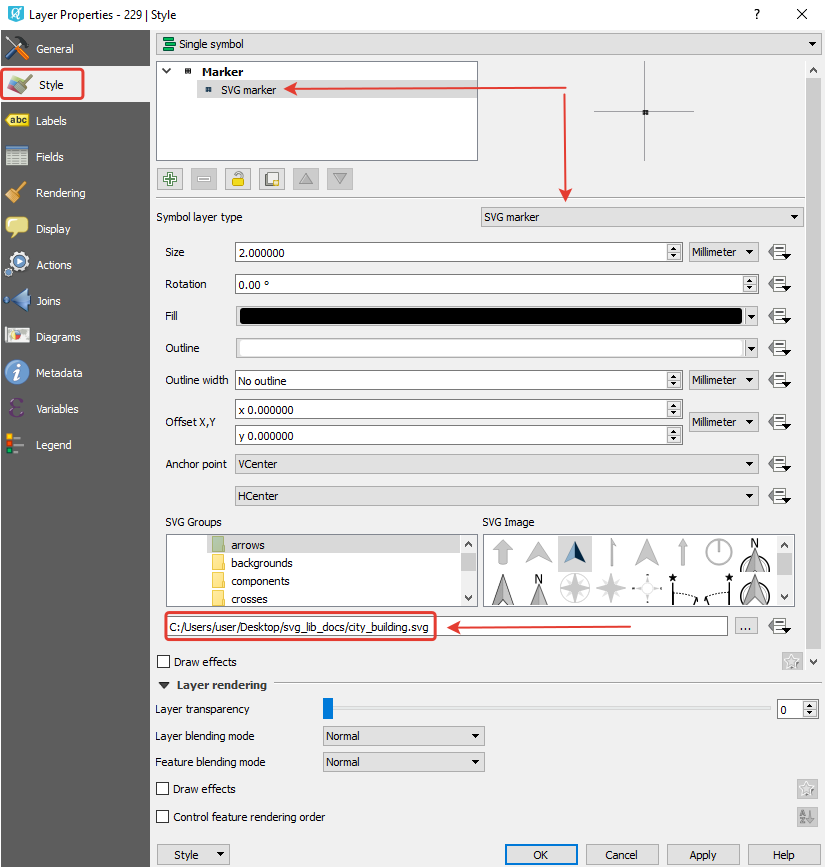
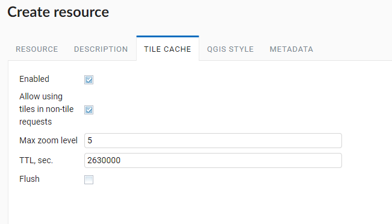

.. sectionauthor:: Artem Svetlov <artem.svetlov@nextgis.ru>

.. _ngw_style_create:
    
Vector layer styles
=====================

Style is a type of NextGIS resource that describes a way to render the geodata.
Styles are necessary to display geodata on a Web Map.

Style is related to a single layer so there is no item "Style" in the main resources list. To create a style you need to open layer properties of the layer you want create style for.

Formats
----------------------------------

By now NextGIS Web supports two rendering libraries: "QGIS" and "Mapserver" . 

* QGIS style can be uploaded from a QML file or created in Web GIS, it has much more settings. 
* You can write Mapserver style yourself as a text. 

.. _ngw_qgis_style:

QGIS Style
----------

Open the properties page of the layer you want create style for. To create a default QGIS style, just press the blue button on the resource page of the layer.

.. figure:: _static/default_style_select_en.png
   :name: mapserver_style_select
   :align: center
   :width: 20cm

   Creating default QGIS style

If you want to add a customized style, in the "Create resource" actions pane click "QGIS vector style" (see :numref:`select_qgis_style`).

.. figure:: _static/QGIS_style_select_en_2.png
   :name: select_qgis_style
   :align: center
   :width: 20cm
 
   Selecting QGIS style resourse
 

After the selection of "QGIS vector style" create resource dialog will open.

You can upload a file or create a simple vector style in the dialog.

QGIS style from file
~~~~~~~~~~~~~~~~~~~~

To upload a pre-made style click "Select a style" or drag a file to this field (see in :numref:`upload_svg_qgis_style`).

If you need to use specially-made markers, you can select the SVG marker library resource, which contains the icon to be displayed on the Web Map.

   Upload QML file

.. warning::
   QML file to upload should be created in :program:`NextGIS QGIS` and saved on the PC (:numref:`save_svg_qgis_style`).
   To create a style using SVG markers, you need to specify the **SVG marker** type in the layer properties and write the **full path to the file** on the local machine (:numref:`svg_qgis_style`). The file name must match the one loaded in the *SVG Marker Library* resource that the user selects when loading the QML file.

.. figure:: _static/save_svg_qgis_style_en.png
   :name: save_svg_qgis_style
   :align: center
   :width: 20cm

   Save QML file in NextGIS QGIS
   

   Layer properties settings in NextGIS QGIS

You can type a custom display name for the new style in the :guilabel:`Resource` tab. You can also add resource description and metadata on the corresponding tabs.
Tile cache settings are described in details `in this section <https://docs.nextgis.com/docs_ngweb/source/mapstyles.html#tile-cache>`_.

After QML file is uploaded click **Create**. Then the window of QGIS style will open and will look like :numref:`svg_res_style`. 
You can see here a TMS link to connect data to external applications.

   QGIS style window

.. _ngw_qgis_style_custom:

Custom QGIS style
~~~~~~~~~~~~~~~~~~~

If you want to create a simple custom style, select "User-defined style" in the drop-down menu. You can set up:

* Marker shape
* Marker size and stroke width
* Fill color and stroke color and their opacity (by using sliders and eyedropper or entering values in HEX, HSB or RGB format)

   Custom QGIS style for points

   Custom QGIS style for lines

   Custom QGIS style for polygons

You can type a custom display name for the new style in the :guilabel:`Resource` tab. You can also add resource description and metadata on the corresponding tabs.

When all the parameters are set, click **Create**. Then the window of QGIS style will open.

Styles created this way can be edited directly in NextGIS Web.

.. _ngw_qgis_style_custom_edit:

Editing QGIS style
----------------------------

To edit a style click on the pencil icon by the style's name in the layer tree.

   Opening the Update resource dialog

In the opened window you can **replace** the style by uploading a new file from your device. To do so, in the "QGIS style" tab select "Style from file" in the dropdown menu, then add a new QML file and click **Save**.

A simple QGIS vector style, the default style, for example, can be **edited** directly in NextGIS Web.

To do so, in the "QGIS style" tab select "User-defined style" in the dropdown menu. You can modify:

* Marker shape
* Marker size and stroke width (type it or use arrows in the field)
* Fill color and stroke color and their opacity (by using sliders and eyedropper or entering values in HEX, HSB or RGB format)

   Editing vector style marker

.. _ngw_mapserver_style:

Mapserver style
---------------

To create **MapServer** style open layer properties of the layer you want create style for.
In the actions pane "Create resource" click "MapServer style" (see in :numref:`ngweb_window_create_resource_mapserver_pic`).

   Selecting MapServer style

You can type a custom display name for the new style in the :guilabel:`Resource` tab. You can also add resource description and metadata on the corresponding tabs.

   Custom name for MapServer style

Tile cache settings are described in details `in this section <https://docs.nextgis.com/docs_ngweb/source/mapstyles.html#tile-cache>`_.

In the "MapServer style" tab you can write a style manually (see in :numref:`ngweb_create_resource_mapsrev_pic`). Otherwise default values are used.

 
   "MapServer style" tab

Click **Create** to finish the process. The window of the created MapServer style will open (see in :numref:`ngweb_File_format_window_MapServer_pic`).

   Mapserver style window
 

.. _ngw_create_tile_cache:

Tile cache
------------

Caching provides faster rendering of Web Map layers. The **tile cache** settings tab while creating styles consists of the following settings (см. :numref:`tile_cache_settings`):

* *Enabled* checkbox;
* *Allow using tiles in non-tile requests* checkbox - the requested image (not a tile) will be prepared from previously cached tiles (if available);
* Input field *Maximum zoom level* - a threshold value, above which the cache is not accessed and the image is formed "on the fly";
* Input field *TTL, sec* (Time to live) - a time of storage of tiles on the server in seconds, after which the image will be formed again on the next request. TTL = 0 means that the storage time is unlimited;
* *Flush* checkbox - write only - clears the tile cache when saving the style.

   Tile cache settings
   

.. _ngw_add_map_style:

Adding a style on the map
------------------------

To edit a Web Map click pencil icon near it or click the Web Map and in actions pane "Action" select "Update". In "Update resource" layer select **Layers** tab (see in :numref:`select_svg_style`).

Here you can do the following actions:

1. Add layer
2. Add group
3. Remove layer or group
4. Modify the order of the layers on the map

Click "Add layer" and in opened window select the QGIS style of the layer, then click "OK". After that click "Save" 

   
   Adding QGIS style on the map
   

In the "Web Map" actions pane of the Web Map properties window select "Display". The map will open, layers tree will be on the left. To hide/display a layer place a tick near the layer .

   Layer with special SVG markers in the QGIS style on a Web Map    

Map style tags
----------------------------------

To change a style or to create a new one it is recommended you take a code of some existing style and then modify it, so there is no need to start creating a style from scratch.
  
Common tags
~~~~~~~~~~~~~~~~~ 
  
* <color red="255" green="170" blue="127"/> - the color of a fill or a line
* <outlinecolor red="106" green="106" blue="106"/> - outline color
* <width>0.5</width> - a width of a line or an outline of the polygon.
* <outlinewidth>3</outlinewidth> - outline width
* <minscaledenom>1</minscaledenom> - do not display a feature if the map scale is larger than value \
* <maxscaledenom>100000</maxscaledenom> - do not display a feature is the map scale is less than value 

Markers
~~~~~~~~~~~~~~~~~

.. figure:: _static/mapstyle_hatch_demo.png
   :name: ngweb_mapstyle_hatch_demo_pic
   :align: center
   :width: 16cm

   A demo for different hatches.

* <symbol>std:circle</symbol> - marker type
* std:rectangle - rectangle
* std:circle - circle
* std:diamond - diamong
* std:triangle - triangle with peak at the top
* std:triangle-equilateral - triangle with peak at the bottom
* std:star - five-pointed star
* std:pentagon - pentagon
* std:arrow - arrow (by default is top oriented. Rotation could be set using a tag <angle>45</angle>)
* std:cross - +
* std:xcross - x
* std:line - short line
* std:hatch - long line texture

These markers could be used to draw a line, to fill a polygon or to display points. 
Also they may be combined to a complex symbol:

.. code-block:: xml

        <class>
            <expression>"industrial"</expression>
            <!-- Industrial areas -->
            
            
            
 </class>

* <size>2</size> - marker size in pixels

Line features
~~~~~~~~~~~~~~~~

* <gap>10</gap> - a step size for dashed line (used with <symbol>std:circle</symbol>)
* <width>8</width> - width of line in pixels
* <classitem>PLACE</classitem> - filter by attribute PLACE. Also see example in #Filtering.
  The following operators are supported:
  
  * attribute name
  * !=
  * >=
  * <=
  * <
  * >
  * =* - case insensitive string comparison.

  * =
  * lt - less than
  * gt - greater than
  * ge - greater or equal
  * le - less or equal
  * eq - equal
  * ne - not equal
  * and - AND
  * && - AND
  * or - OR
  * || - OR
  
* <linejoin>round</linejoin> - line draw at corners
* <linecap>round</linecap> - line draw at the beginning and at the end

.. figure:: _static/admin_mapstyles_linecap.png
   :name: admin_mapstyles_linecap.png
   :align: center
   :width: 10cm

   <linecap>butt</linecap> / <linecap>round</linecap> / <linecap>square</linecap>

* <pattern>2.5 4.5</pattern> - dash template 

.. todo:: check for numbers

* <angle> - marker rotation angle. Hatch could also be rotated.

Labels
~~~~~~~~

* <labelitem>a_hsnmbr</labelitem> - attribute name for labelling.
* <minscaledenom>100</minscaledenom> - do not show a label if a scale is larger than 1:1000
* <maxscaledenom>100000</maxscaledenom> - do not show a label if a scale is smaller than1:100000
                
                        

* LABELCACHE [on|off] - specifies whether labels should be drawn as the features for this layer are drawn, or whether they should be cached and drawn after all layers have been drawn. Default is on. Label overlap removal, auto placement etc... are only available when the label cache is active.
* <position>ur</position> - label offset direction.

   * ur - ↗ up and right (recommended).
   * ul - ↖
   * uc - ↑
   * cl - ←
   * cc - centered
   * cr - →
   * ll - ↙
   * lc - ↓
   * lr - ↘
   * auto

Some other useful tags
~~~~~~~~~~~~~~~~~~~~~~~

* MAXGEOWIDTH - Maximum width, in the map’s geographic units, at which this LAYER is drawn. If MAXSCALEDENOM is also specified then MAXSCALEDENOM will be used instead.
* MINGEOWIDTH - Minimum width, in the map’s geographic units, at which this LAYER is drawn. If MINSCALEDENOM is also specified then MINSCALEDENOM will be used instead.
* OFFSITE - Sets the color index to treat as transparent for raster layers.
* OPACITY [integer|alpha] - opacity of the layer
* SIZEUNITS [feet|inches|kilometers|meters|miles|nauticalmiles|pixels] - Sets the unit of CLASS object SIZE values (default is pixels). Useful for simulating buffering.
* SYMBOLSCALEDENOM [double] - The scale at which symbols and/or text appear full size. This allows for dynamic scaling of objects based on the scale of the map. If not set then this layer will always appear at the same size. Scaling only takes place within the limits of MINSIZE and MAXSIZE as described above. Scale is given as the denominator of the actual scale fraction, for example for a map at a scale of 1:24,000 use 24000.
* TYPE [chart|circle|line|point|polygon|raster|query] - Specifies how the data should be drawn. Need not be the same as the feature geometry type. For example polygons or polylines may be drawn as a point layer.

See MapServer templates `here <https://docs.nextgis.com/docs_ngweb/source/mapservertemplates.html>`_.

