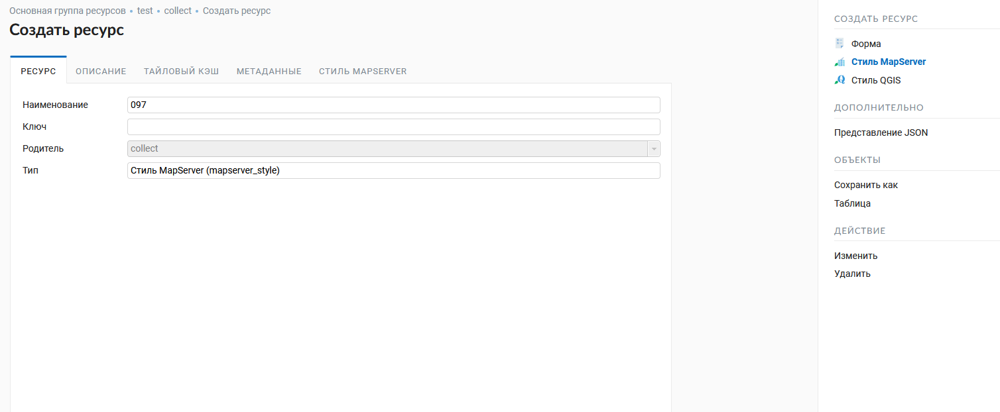
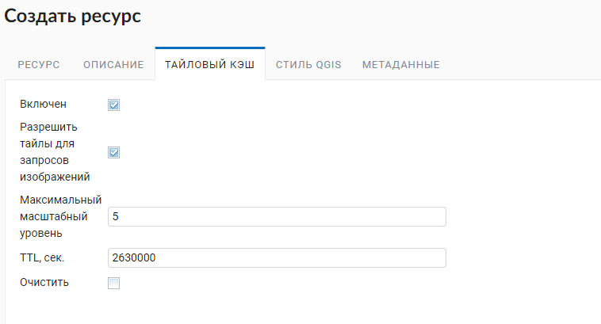

.. sectionauthor:: Артём Светлов <artem.svetlov@nextgis.ru>
.. sectionauthor:: Роман Гайнуллов <roman.gainullov@nextgis.ru>

.. _ngw_style_create:
    
Стили векторных слоёв
=====================

Стили служат для описания способов визуализации геоданных и являются одним из ресурсов NextGIS Web. 
Именно стиль добавляется на карты для представления на ней геоданных.

Форматы
----------------------------------

Сейчас NextGIS Web поддерживает две библиотеки рендеринга: "Mapserver" и "QGIS". 
Стиль Mapserver можно писать в текстовом виде. 
Стиль QGIS создается путем загрузки соответствующего qml-файла, у него гораздо больше настроек. 

.. _ngw_qgis_style:

Стиль QGIS
----------

Стиль связан с конкретным слоем, поэтому пункта "Стиль" в основном списке ресурсов нет. 
Для создания стиля необходимо сначала зайти в ресурс слоя, для которого он создаётся.

В блоке операций на правой боковой панели в блоке "Создать ресурс" выбрать "Стиль QGIS" (см. :numref:`select_qgis_style`).

 
   Выбор стиля QGIS

После выбора «Стиль QGIS» откроется диалог создания ресурса. В открывшемся окне на вкладке «Ресурс» необходимо ввести наименование в соответствующее поле.

.. figure:: _static/name_qgis_style.png
   :name: name_qgis_style
   :align: center
   :width: 20cm

   Наименование ресурса стиля

Поле «Ключ» является опциональным. Можно также ввести описание и метаданные на соответствующих вкладках.
Настройки тайлового кэша подробно описаны в `данном <https://docs.nextgis.ru/docs_ngweb/source/mapstyles.html#ngw-create-tile-cache>`_ разделе. 

На вкладке **Стиль QGIS** необходимо выбрать qml-файл стиля на устройстве или перетащить его в эту область (см. :numref:`upload_svg_qgis_style`).
Здесь же при необходимости можно выбрать ресурс библиотеки маркеров SVG, в которой находится иконка для отображения на веб-карте.

   Загрузка файла QML

.. warning::   
   Необходимый для загрузки файл может быть получен с помощью `NextGIS QGIS <https://nextgis.ru/nextgis-qgis/>`_ и сохранен на компьютере (см. :numref:`save_svg_qgis_style`). Для создания стиля, использующего SVG-маркеры, необходимо указать в свойствах слоя тип **SVG-маркер** и прописать полный путь до **файла** на машине (см. :numref:`svg_qgis_style`). Название и формат файла должны совпадать с тем, что загружен в ресурс *Библиотека маркеров SVG*, который пользователь выбирает при загрузке файла QML.

   Сохранение qml-файла в NextGIS QGIS
   
.. figure:: _static/svg_qgis_style.png
   :name: svg_qgis_style
   :align: center
   :width: 16cm

   Настройка свойств стиля в NextGIS QGIS

После загрузки файла QML нажмите на кнопку "Создать". После обработки запроса откроется окно ресурса QGIS стиля (см. :numref:`svg_res_style`).

   Созданный ресурс QGIS стиля
    

.. _ngw_mapserver_style:

Стиль Mapserver
--------------

Для создания стиля **Mapserver** необходимо сначала зайти в слой, для которого вы его создаёте. В окне свойств поля "Создать ресурс" выбрать "Стиль MapServer".

После выбора "Стиль MapServer" откроется диалог создания ресурса (см. :numref:`ngweb_window_create_resource_mapserver_pic`).
В открывшемся окне на вкладке "Ресурс" необходимо внести данные в обязательное к заполнению поле - "Наименование".

   Наименование стиля Mapserver

Поле "Ключ" является опциональным. Можно также ввести описание и метаданные на соответствующих вкладках.
Настройки тайлового кэша подробнее описаны в `данном <https://docs.nextgis.ru/docs_ngweb/source/mapstyles.html#ngw-create-tile-cache>`_ разделе. 

На вкладке "Стиль MapServer" необходимо построчно ввести стиль вручную (см. :numref:`ngweb_create_resource_mapsrev_pic`).

 
   Вкладка "Стиль MapServer"

После нажатия кнопки "Создать" начнется процесс обработки запроса, по окончании которого откроется окно файла со стилем Mapserver:

.. figure:: _static/ngweb_File_format_window_MapServer_rus.png
   :name: ngweb_File_format_window_MapServer_pic
   :align: center
   :width: 16cm

   Окно файла со стилем Mapserver

.. _ngw_create_tile_cache:

Тайловый кэш
------------

.. warning::   
   Для работы тайлового кэша в `настройках <https://docs.nextgis.ru/docs_ngweb/source/webmaps_admin.html#admin-webmap-create-layers>`_ веб-карты должен быть включен адаптер **Тайлы** для стиля.

На вкладке **Тайловый кэш** при создании стиля (слоя для `WMS <https://docs.nextgis.ru/docs_ngweb/source/layers.html#c-wms>`_ и `TMS <https://docs.nextgis.ru/docs_ngweb/source/layers.html#tms>`_) пользователь имеет возможность задать настройки кэширования стиля (слоя для WMS и TMS) (см. :numref:`tile_cache_settings`):

* *Включение* -включение/выключение кэширования тайлов;
* *Разрешить тайлы для запросов изображений* - при запросе изображения (не тайла) использовать закэшированные тайлы при их наличии;
* *Максимальный масштабный уровень* - пороговое значение, выше которого обращение к кэшу не происходит, изображение карты рендерится на лету;
* *TTL, сек (Time to live)* - “время жизни” или хранения тайлов на сервере в секундах, после которого при следующем запросе изображение будет формироваться заново.

   Настройки тайлового кэша

.. _ngw_add_map_style:

Добавление стиля на карту
------------------------

Для добавления на веб-карту слоя со стилем QGIS необходимо открыть её в режиме редактирования (изменения). На вкладке **Слои** нужно добавить **стиль** соответствующего слоя (или слой, если этого требует специфика данных - TMS, WMS) и нажать *Сохранить* (см. :numref:`select_svg_style`). 

Также на данной вкладке можно:

1. Добавить слой
2. Добавить группу
3. Удалить
  

   
   Добавления QGIS стиля на веб-карту

Чтобы посмотреть карту, нажмите *Открыть* на правой боковой панели, находясь внутри ресурса *веб-карта*. Откроется окно веб-карты с загруженными стилями. Если в свойствах qml-файлов были прописаны пути до svg-маркеров и в настройках стилей в веб-интерфейсе указаны библиотеки соответствующих маркеров, то слой на карте отобразится соответствующим образом (см. :numref:`webmap_svg`).
  

   
   Веб-карта с QGIS стилем (с svg-маркерами)

.. _ngw_mapstyles:

Теги языка картостилей Mapserver
----------------------------------

Для правки стиля, или написания нового рекомендуется взять код какого-нибудь 
существующего стиля из примера, и потом дополнять его, а не писать с нуля.
  
Общие теги
~~~~~~~~~~~~~~~~~ 
  
* <color red="255" green="170" blue="127"/> - цвет заливки или линии
* <outlinecolor red="106" green="106" blue="106"/> - цвет обводки
* <width>0.5</width> - толщина линии или границы полигона в пикселях.
* <outlinewidth>3</outlinewidth> - ширина обводки
* <minscaledenom>1</minscaledenom> - не рисовать объект на масштабе больше указанного (когда карта крупнее чем) \
* <maxscaledenom>100000</maxscaledenom> - не рисовать объект на масштабе меньше указанного (когда карта мельче чем) 

Значки
~~~~~~~~~~~~~~~~~

.. figure:: _static/mapstyle_hatch_demo.png
   :name: ngweb_mapstyle_hatch_demo_pic
   :align: center
   :width: 16cm

   Демонстрация различных видов штриховок.

* <symbol>std:circle</symbol> - тип значка

   * std:rectangle - квадратик
   * std:circle - кружок
   * std:diamond - ромбик
   * std:triangle - треугольник острием вверх
   * std:triangle-equilateral - треугольник острием вниз
   * std:star - пятиконечная звёздочка
   * std:pentagon - пятиугольник
   * std:arrow - стрелка (по умолчанию вверх, можно поворачивать тегом <angle>45</angle>)
   * std:cross - +
   * std:xcross - x
   * std:line - коротенькая линия
   * std:hatch - длинная линия, стыкующаяся в текстуру

Эти значки можно использовать для рисования линии, заливки полигонов, или обозначения точек. 
Так же их можно комбинировать в такую конструкцию:

.. code-block:: xml

        <class>
            <expression>"industrial"</expression>
            <!-- Промзоны -->
            
            
            
 </class>

* <size>2</size> - размер значка в пикселях

Линейные объекты
~~~~~~~~~~~~~~~~

* <gap>10</gap> - шаг пунктира (используется вместе с <symbol>std:circle</symbol>)
* <width>8</width> - ширина линии в пикселах
* <classitem>PLACE</classitem> - выборка по атрибуту с названием PLACE. Так же смотрите пример в  #Выборка.
  Поддерживаются следующие операторы
  
  * имя атрибута
  * !=
  * >=
  * <=
  * <
  * >
  * =* - сравнение строк без учёта раскладки.

  * =
  * lt - меньше
  * gt - больше
  * ge - больше или равно
  * le - меньше или равно
  * eq - равно
  * ne - не равно
  * and - И
  * && - И
  * or - ИЛИ
  * || - ИЛИ
  
* <linejoin>round</linejoin> - рисование линии в углах поворота
* <linecap>round</linecap> - рисование начала и конца линии

.. figure:: _static/admin_mapstyles_linecap.png
   :name: ngweb_admin_mapstyles_linecap.png
   :align: center
   :width: 10cm

   Пример <linecap>butt</linecap> / <linecap>round</linecap> / <linecap>square</linecap>.

* <pattern>2.5 4.5</pattern> - шаблон пунктира 
* <angle> - угол поворота значка. Так же можно поворачивать штриховку.

Подписи
~~~~~~~~

* <labelitem>a_hsnmbr</labelitem> - название атрибута, из которого берётся подпись.
* <minscaledenom>100</minscaledenom> - не выводить подпись на масштабе крупнее 1:1000
* <maxscaledenom>100000</maxscaledenom> - не выводить подпись на масштабе мельче 1:100000
* LABELCACHE [on|off] - не проверял, нашел в исхониках
* <position>ur</position> - направление сдвига подписи.

   * ur - ↗ вверх вправо (в книгах по картографии рекомендуют так делать по умолчанию.
   * ul - ↖
   * uc - ↑
   * cl - ←
   * cc - строго по центру
   * cr - →
   * ll - ↙
   * lc - ↓
   * lr - ↘
   * auto

* <Maxoverlapangle> - ?  

Неизвестные атрибуты
~~~~~~~~~~~~~~~~~~~~~~~

* MAXGEOWIDTH
* MINGEOWIDTH
* OFFSITE
* OPACITY [integer|alpha]
* SIZEUNITS [feet|inches|kilometers|meters|miles|nauticalmiles|pixels]
* SYMBOLSCALEDENOM [double]
* TYPE [chart|circle|line|point|polygon|raster|query]

.. _ngw_mapserver_templates:

Примеры картостилей Mapserver (OSM-default)
--------------------------------------------

Полигональный слой с ограничением по масштабу и подписями
~~~~~~~~~~~~~~~~~~~~~~~~~~~~~~~~~~~~~~~~~~~~~~~~~~~~~~~~~~~~~~

.. code-block:: xml

	<map>
	  <layer>
	    <labelitem>a_hsnmbr</labelitem>
	    <class>
	      
	      <label>
		<type>truetype</type>
		regular
		<size>8.25</size>
		<color blue="0" green="0" red="0"/>
		<outlinewidth>3</outlinewidth>
		<outlinecolor blue="255" green="255" red="255"/>
		<position>ur</position>
		<maxscaledenom>10000</maxscaledenom>
	      </label>
	    </class>
	  </layer>
	</map>

Точечный белый кружок
~~~~~~~~~~~~~~~~~~~~~~~~~~~~~~~~~~~~~~~~~~~~~~~~~~~~~~~~~~~~~~

.. code-block:: xml

     

Линия из маленьких чёрных кружков
~~~~~~~~~~~~~~~~~~~~~~~~~~~~~~~~~~~~~~~~~~~~~~~~~~~~~~~~~~~~~~

.. code-block:: xml

     

Выборка
~~~~~~~~~~~~~~~~~~~~~~~~~~~~~~~~~~~~~~~~~~~~~~~~~~~~~~~~~~~~~~

.. code-block:: xml

	<map>
	  <layer>
	    <labelitem>NAME</labelitem>
	    <classitem>PLACE</classitem>
	    <class>
	      <expression>"city"</expression>
	      
	      
	      <label>
		<type>truetype</type>
		regular
		<size>18</size>
		<color blue="0" green="0" red="0"/>
		<outlinewidth>3</outlinewidth>
		<outlinecolor blue="255" green="255" red="255"/>
		 <position>ur</position>
	      </label>
	    </class>
	    <class>
	      <expression>"town"</expression>
	      
	      
	      <label>
		<type>truetype</type>
		regular
		<size>14</size>
		<color blue="0" green="0" red="0"/>
		<outlinewidth>3</outlinewidth>
		<outlinecolor blue="255" green="255" red="255"/>
		 <position>ur</position>
	      </label>
	    </class>
	    <class>
	      <expression>"village"</expression>
	      
	      <label>
		<type>truetype</type>
		regular
		<size>8.25</size>
		<color blue="0" green="0" red="0"/>
		<outlinewidth>3</outlinewidth>
		<outlinecolor blue="255" green="255" red="255"/>
		<position>ur</position>
	      </label>
	    </class>
	    <class>
	      <expression>"hamlet"</expression>
	      
	      <label>
		<type>truetype</type>
		regular
		<size>8.25</size>
		<color blue="0" green="0" red="0"/>
		<outlinewidth>3</outlinewidth>
		<outlinecolor blue="255" green="255" red="255"/>
		<position>ur</position>
	      </label>
	    </class>
	    <class>
	      <expression>"locality"</expression>
	      
	      <label>
		<type>truetype</type>
		regular
		<size>6.5</size>
		<color blue="0" green="0" red="0"/>
		<outlinewidth>3</outlinewidth>
		<outlinecolor blue="255" green="255" red="255"/>
		<position>ur</position>
	      </label>
	    </class>
	    <class>
	      <expression>''</expression>
	      
	      <label>
		<type>truetype</type>
		regular
		<size>8.25</size>
		<color blue="0" green="0" red="0"/>
		<outlinewidth>3</outlinewidth>
		<outlinecolor blue="255" green="255" red="255"/>
		<position>ur</position>
	      </label>
	    </class>
	  </layer>
	</map>

Площадной слой с классификацией по значению поля и подписями
~~~~~~~~~~~~~~~~~~~~~~~~~~~~~~~~~~~~~~~~~~~~~~~~~~~~~~~~~~~~~~

.. code-block:: xml

	<map>
	<layer>
	  <labelitem>NAME</labelitem>
	    <class>
	      <expression>(([num] gt 18) and ([num] le 26.1))</expression>
	      
	       <label>
		<type>truetype</type>
		regular
		<size>8.25</size>
		<color blue="0" green="0" red="0"/>
		<outlinewidth>3</outlinewidth>
		<outlinecolor blue="255" green="255" red="255"/>
		<position>ur</position>
		<maxscaledenom>7000000</maxscaledenom>
	      </label>
	    </class>
	  
	      <class>
	      <expression>(([num] gt 26.1) and ([num] le 28.1))</expression>
	      
		 <label>
		<type>truetype</type>
		regular
		<size>8.25</size>
		<color blue="0" green="0" red="0"/>
		<outlinewidth>3</outlinewidth>
		<outlinecolor blue="255" green="255" red="255"/>
		<position>ur</position>
		<maxscaledenom>7000000</maxscaledenom>
	      </label>
	    </class>
	  
	  
	    <class>
	      <expression>(([num] gt 28.1) and ([num] le 30))</expression>
	      
	       <label>
		<type>truetype</type>
		regular
		<size>8.25</size>
		<color blue="0" green="0" red="0"/>
		<outlinewidth>3</outlinewidth>
		<outlinecolor blue="255" green="255" red="255"/>
		<position>ur</position>
		<maxscaledenom>7000000</maxscaledenom>
	      </label>
	    </class>
	  
	  </layer>
	</map>

Кластеризация точек на сервере
~~~~~~~~~~~~~~~~~~~~~~~~~~~~~~~~~~~~~~~~~~~~~~~~~~~~~~~~~~~~~~

.. code-block:: xml

	<map>
	  <symbol>
	    <type>ellipse</type>
	    <name>shop</name>
	    <anchorpoint x="0.5" y="0.5" />
	    <points>1 1</points>
	    <filled>true</filled>
	  </symbol>
	  <layer>
	    <labelitem>Cluster_FeatureCount</labelitem>
	    <classitem>Cluster_FeatureCount</classitem>
	    <cluster>
	      <maxdistance>20</maxdistance>
	      <region>"ellipse"</region>
	    </cluster>
	    <class>
	      <expression>("[Cluster_FeatureCount]" != "1")</expression>
	      
	      <label>
		<type>truetype</type>
		bold-italic
		<size>10</size>
		<color blue="255" green="255" red="255"/>
		<outlinewidth>1</outlinewidth>
		<outlinecolor blue="0" green="0" red="0"/>
		<position>cc</position>
		<offset x="10" y="0" />
	      </label>
	    </class>
	    <class>
	      <expression>"1"</expression>
	      
	    </class>

	  </layer>
	</map>

OSM settlement-point
~~~~~~~~~~~~~~~~~~~~~~~~~~~~~~~~~~~~~~~~~~~~~~~~~~~~~~~~~~~~~~

.. code-block:: xml

	<!-- Стиль с разделением по масштабам-->
	<!-- Версия 2015-07-24 -->
	<map>
	  <layer>
	    <labelitem>NAME</labelitem>
	    <classitem>PLACE</classitem>
	    <class>
	      <expression>"city"</expression> <!-- Большой город -->
	      
	      
	      <label>
		<type>truetype</type>
		regular
		<size>18</size>
		<color blue="0" green="0" red="0"/>
		<outlinewidth>3</outlinewidth>
		<outlinecolor blue="255" green="255" red="255"/>
		 <position>ur</position>
	      </label>
	    </class>
	    <class>
	      <expression>"town"</expression> <!-- Средний или малый город -->
	      
	      
	      <label>
		<type>truetype</type>
		regular
		<size>14</size>
		<color blue="0" green="0" red="0"/>
		<outlinewidth>3</outlinewidth>
		<outlinecolor blue="255" green="255" red="255"/>
		 <position>ur</position>
		<maxscaledenom>6000000</maxscaledenom>
	      </label>
	    </class>
	    <class>
	      <expression>"village"</expression> <!-- Посёлок  -->
	      
	      <label>
		<type>truetype</type>
		regular
		<size>8.25</size>
		<color blue="0" green="0" red="0"/>
		<outlinewidth>3</outlinewidth>
		<outlinecolor blue="255" green="255" red="255"/>
		<position>ur</position>
		<maxscaledenom>1000000</maxscaledenom>
	      </label>
	    </class>
	    <class>
	      <expression>"hamlet"</expression> <!-- Деревня -->
	      
	      <label>
		<type>truetype</type>
		regular
		<size>8.25</size>
		<color blue="0" green="0" red="0"/>
		<outlinewidth>3</outlinewidth>
		<outlinecolor blue="255" green="255" red="255"/>
		<position>ur</position>
		<maxscaledenom>500000</maxscaledenom>
	      </label>
	    </class>
	    <class>
	      <expression>"locality"</expression> <!-- Необитаемая местность -->
	      
	      <label>
		<type>truetype</type>
		regular
		<size>6.5</size>
		<color blue="0" green="0" red="0"/>
		<outlinewidth>3</outlinewidth>
		<outlinecolor blue="255" green="255" red="255"/>
		<position>ur</position>
		<maxscaledenom>500000</maxscaledenom>
	      </label>
	    </class>
	    <class>
	      <expression>''</expression>
	      
	      <label>
		<type>truetype</type>
		regular
		<size>8.25</size>
		<color blue="0" green="0" red="0"/>
		<outlinewidth>3</outlinewidth>
		<outlinecolor blue="255" green="255" red="255"/>
		<position>ur</position>
	      </label>
	    </class>
	  </layer>
	</map>

OSM highway-lowzoom
~~~~~~~~~~~~~~~~~~~~~~~~~~~~~~~~~~~~~~~~~~~~~~~~~~~~~~~~~~~~~~

Дороги общего пользования (мелкие вынесены в отдельный стиль дальше, 
чтобы можно было отдельно включать-выключать). Цветовая схема - с openstreetmap.de

.. figure:: _static/mastyles_osm-highway-lowzoom.png
   :name: ngweb_mastyles_osm-highway-lowzoom
   :align: center
   :width: 10cm

   Фрагмент цветовой схемы дорог общего пользования. 

.. code-block:: xml

    <map>
    <!-- Highways for low-zoom from openstreetmap (from motorway to residential) version 2015-11-06 -->
        <layer>
            <classitem>Highway</classitem>
            <labelitem>Name</labelitem>
            <class>
                <expression>"motorway"</expression>
                
                
                
                <label>
                    <type>truetype</type>
                    regular
                    <size>7</size>
                    <color blue="0" green="0" red="0" />
                    <outlinewidth>1</outlinewidth>
                    <outlinecolor blue="255" green="255" red="255" />
                    <angle>follow</angle>
                    <antialias>true</antialias>
                    <repeatdistance>300</repeatdistance>
                    <maxoverlapangle>20.0</maxoverlapangle>
                </label>
            </class>
            <class>
                <expression>"motorway_link"</expression>
                
                
                
            </class>
            <class>
                <expression>"trunk"</expression>
                
                
                
                <label>
                    <type>truetype</type>
                    regular
                    <size>7</size>
                    <color blue="0" green="0" red="0" />
                    <outlinewidth>1</outlinewidth>
                    <outlinecolor blue="255" green="255" red="255" />
                    <angle>follow</angle>
                    <antialias>true</antialias>
                    <repeatdistance>300</repeatdistance>
                    <maxoverlapangle>20.0</maxoverlapangle>
                </label>
            </class>
            <class>
                <expression>"trunk_link"</expression>
                
                
                
            </class>
            <class>
                <expression>"primary"</expression>
                
                
                <label>
                    <type>truetype</type>
                    regular
                    <size>7</size>
                    <color blue="0" green="0" red="0" />
                    <outlinewidth>1</outlinewidth>
                    <outlinecolor blue="255" green="255" red="255" />
                    <angle>follow</angle>
                    <antialias>true</antialias>
                    <repeatdistance>300</repeatdistance>
                    <maxoverlapangle>20.0</maxoverlapangle>
                </label>
            </class>
            <class>
                <expression>"primary_link"</expression>
                
                
            </class>
            <class>
                <expression>"secondary"</expression>
                
                
                <label>
                    <type>truetype</type>
                    regular
                    <size>7</size>
                    <color blue="0" green="0" red="0" />
                    <outlinewidth>1</outlinewidth>
                    <outlinecolor blue="255" green="255" red="255" />
                    <angle>follow</angle>
                    <antialias>true</antialias>
                    <repeatdistance>300</repeatdistance>
                    <maxoverlapangle>20.0</maxoverlapangle>
                </label>
            </class>
            <class>
                <expression>"secondary_link"</expression>
                
                
            </class>
            <class>
                <expression>"tertiary"</expression>
                
                
                <label>
                    <type>truetype</type>
                    regular
                    <size>7</size>
                    <color blue="0" green="0" red="0" />
                    <outlinewidth>1</outlinewidth>
                    <outlinecolor blue="255" green="255" red="255" />
                    <angle>follow</angle>
                    <antialias>true</antialias>
                    <repeatdistance>300</repeatdistance>
                    <maxoverlapangle>20.0</maxoverlapangle>
                </label>
            </class>
            <class>
                <expression>"tertiary_link"</expression>
                
                
            </class>
            <class>
                <expression>"unclassified"</expression>
                
                
                <label>
                    <type>truetype</type>
                    regular
                    <size>7</size>
                    <color blue="0" green="0" red="0" />
                    <outlinewidth>1</outlinewidth>
                    <outlinecolor blue="255" green="255" red="255" />
                    <angle>follow</angle>
                    <antialias>true</antialias>
                    <repeatdistance>300</repeatdistance>
                    <maxoverlapangle>20.0</maxoverlapangle>
                    <minscaledenom>1</minscaledenom>
		            <maxscaledenom>40000</maxscaledenom> 
                </label>
            </class>
            <class>
                <expression>"residential"</expression>
                
                
                <label>
                    <type>truetype</type>
                    regular
                    <size>7</size>
                    <color blue="0" green="0" red="0" />
                    <outlinewidth>1</outlinewidth>
                    <outlinecolor blue="255" green="255" red="255" />
                    <angle>follow</angle>
                    <antialias>true</antialias>
                    <repeatdistance>300</repeatdistance>
                    <maxoverlapangle>20.0</maxoverlapangle>
                    <minscaledenom>1</minscaledenom>
		            <maxscaledenom>40000</maxscaledenom> 
                </label>
            </class>
            <class>
                <expression>"living_street"</expression>
                
                
                <label>
                    <type>truetype</type>
                    regular
                    <size>7</size>
                    <color blue="0" green="0" red="0" />
                    <outlinewidth>1</outlinewidth>
                    <outlinecolor blue="255" green="255" red="255" />
                    <angle>follow</angle>
                    <antialias>true</antialias>
                    <repeatdistance>300</repeatdistance>
                    <maxoverlapangle>20.0</maxoverlapangle>
                    <minscaledenom>1</minscaledenom>
		            <maxscaledenom>40000</maxscaledenom> 
                </label>
            </class>
        </layer>
    </map>

OSM highway-maxzoom
~~~~~~~~~~~~~~~~~~~~~~~~~~~~~~~~~~~~~~~~~~~~~~~~~~~~~~~~~~~~~~

Дороги подъездные, технологические, грунтовые, пешеходные

.. figure:: _static/mastyles_osm-highway-highzoom.png
   :name: ngweb_mastyles_osm-highway-highzoom
   :align: center
   :width: 10cm

   Фрагмент изображения карты дорог.

.. code-block:: xml

    <map>
     <!-- Highways for high-zoom from openstreetmap (from service to track) version 2015-11-06 -->
        <layer>
            <classitem>Highway</classitem>
            <labelitem>Name</labelitem>
            <class>
                <expression>"service"</expression>
                
                
            </class>
            <class>
                <expression>"footway"</expression>
                
                <label>
                    <type>truetype</type>
                    regular
                    <size>7</size>
                    <color blue="0" green="0" red="0" />
                    <outlinewidth>1</outlinewidth>
                    <outlinecolor blue="255" green="255" red="255" />
                    <angle>follow</angle>
                    <antialias>true</antialias>
                    <repeatdistance>300</repeatdistance>
                    <maxoverlapangle>20.0</maxoverlapangle>
                </label>
            </class>
            <class>
                <expression>"pedestrian"</expression>
                
            </class>
            <class>
                <expression>"path"</expression>
                
            </class>
            <class>
                <expression>"track"</expression>
                
            </class>
        </layer>
    </map>

OSM railway-line
~~~~~~~~~~~~~~~~~~~~~~~~~~~~~~~~~~~~~~~~~~~~~~~~~~~~~~~~~~~~~~

.. code-block:: xml

	<!-- Стиль railway-line с разделением по масштабам 
	version 2015-07-24 -->
	<map>
	  <layer>
	    <classitem>RAILWAY</classitem>
	    <class>
	      <expression>"abandoned"</expression>
	      
	      
	    </class>
		<class>
	      <expression>"razed"</expression>
	      
	      
	    </class>
	    <class>
	      <expression>"construction"</expression>
	      
	      
	    </class>
	    <class>
	      <expression>"crossing"</expression>
	      
	    </class>
	    <class>
	      <expression>"light_rail"</expression>
	      
	    </class>
	    <class>
	      <expression>"narrow_gauge"</expression>
	      
	    </class>
	    <class>
	      <expression>"platform"</expression>
	      
	    </class>
	    <class>
	      <expression>"rail"</expression>
	      
	      
	       
	    </class>
	    <class>
	      <expression>"siding"</expression>
	      
	    </class>
	    <class>
	      <expression>"subway"</expression>
	      
	    </class>
	    <class>
	      <expression>"tram"</expression>
	      
	    </class>
	  </layer>
	</map>

OSM water-line
~~~~~~~~~~~~~~~~~~~~~~~~~~~~~~~~~~~~~~~~~~~~~~~~~~~~~~~~~~~~~~

.. code-block:: xml

	<!-- Стиль water-line с разделением по масштабам-->
	<!-- Версия 2015-07-24 -->
	<map>
	  <layer>
	    <classitem>Waterway</classitem>
	    <labelitem>name</labelitem>
	    <class>
	      <expression>"river"</expression>
	      
	      <label>
		<type>truetype</type> <!-- Подпись -->
		bold
		<size>7</size>
		<color blue="255" green="255" red="255"/>
		<outlinewidth>1</outlinewidth>
		<outlinecolor red="102" green="153" blue="204"/>
		<angle>auto</angle>
		<repeatdistance>300</repeatdistance>
		<maxoverlapangle>90.0</maxoverlapangle>
		<maxscaledenom>500000</maxscaledenom>
	      </label>
	      </class> 
	    
	      <class>
	      <expression>"canal"</expression>  
	      
	      
	      <label>
		<type>truetype</type> <!-- Подпись -->
		bold
		<size>7</size>
		<color blue="255" green="255" red="255"/>
		<outlinewidth>1</outlinewidth>
		<outlinecolor red="102" green="153" blue="204"/>
		<angle>auto</angle>
		<repeatdistance>300</repeatdistance>
		<maxoverlapangle>90.0</maxoverlapangle>
		<maxscaledenom>500000</maxscaledenom>
	      </label>
	      </class> 
	    
	      <class>
	      <expression>"stream"</expression>
	      
	      </class> 
	    
	      <class>
	      <expression>"drain"</expression>
	      
	      </class> 
	  </layer>
	</map>

OSM water-polygon
~~~~~~~~~~~~~~~~~~~~~~~~~~~~~~~~~~~~~~~~~~~~~~~~~~~~~~~~~~~~~~

.. code-block:: xml

	<!-- стиль water-polygon
	Версия 2015-07-24 
	Нужно добавить 
	-водохранилища
	-штриховку для болот
	-->
	<map>
	  <layer>
	    <labelitem>NAME</labelitem>
	    <classitem>NATURAL</classitem>
	    <class>
	      <expression>"water"</expression> <!-- Вода -->
	      
		 <label>
		<type>truetype</type>
		regular
		<size>7</size>
		<color red="102" green="153" blue="204"/>
		<outlinewidth>2</outlinewidth>
		<outlinecolor red="255" green="255" blue="222"/>
		<!-- Ограничение подписи по масштабу -->
		<minscaledenom>1</minscaledenom>
		<maxscaledenom>100000</maxscaledenom>    
	      </label>
	    </class>
	    <class>
	      <expression>"wetland"</expression> <!-- Болото -->
		  
		 <label>
		<type>truetype</type>
		regular
		<size>7</size>
		<color red="102" green="153" blue="204"/>
		<outlinewidth>2</outlinewidth>
		<outlinecolor red="255" green="255" blue="222"/>
		<!-- Ограничение подписи по масштабу -->
		<minscaledenom>1</minscaledenom>
		<maxscaledenom>100000</maxscaledenom>    
	      </label>
	    </class>
	  </layer>
	</map>
	
	
Использование стиля из поля векторного слоя
~~~~~~~~~~~~~~~~~~~~~~~~~~~~~~~~~~~~~~~~~~~~~~~~~~~~~~~~~~~~~~

Имеется возможность настройки стиля отрисовки векторных данных для каждой записи индивидуально. 
Для этого необходимо завести поле с описание стиля в формате ORG Style. Например,

.. code-block:: bash

   ogr2ogr -f GeoJSON -sql "select *, OGR_STYLE from Australia" australia.geojson Australia.TAB
   
Описание формата ORG Style можно изучить по странице `Feature Style Specification <https://gdal.org/user/ogr_feature_style.html>`_.

Для векторного слоя с полем `OGR_STYLE` которое содержит стиль записи необходимо выставить следующий стиль NextGIS Web Mapserver:

.. code-block:: xml

   <map>
     <layer>
       <styleitem>OGR_STYLE</styleitem>
       <class>
         <name>default</name>
       </class>
     </layer>
   </map>

Стиль OSM-black
----------------------------------

OSM landuse-polygon
~~~~~~~~~~~~~~~~~~~~~~~~~~~~~~~~~~~~~~~~~~~~~~~~~~~~~~~~~~~~~~

Стили NextGIS Web поддерживают различные штриховки (см. :numref:`ngweb_mapstyle_hatch_demo_pic`).

.. code-block:: xml

	<map> <!-- Демонстрация штриховок, предполагается что под этим слоем будет чёрный фон-->
	    <layer>
		<labelitem>OSM_ID</labelitem>
		<classitem>LANDUSE</classitem>
		<class>
		    <expression>"residential"</expression>
		    <!-- Жилые зоны -->
		    
		    
		</class>
		<class>
		    <expression>"grass"</expression>
		    <!-- Газоны зоны -->
		    
		    
		</class>
		<class>
		    <expression>"commercial"</expression>
		    <!-- Жилые зоны -->
		    
		    
		</class>
		<class>
		    <expression>"industrial"</expression>
		    <!-- Промзоны -->
		    
		    
		    
		</class>
		<class>
		    <expression>"cemetery"</expression>
		    <!-- Кладбоны -->
		    
		    
		    
		    
		</class>
	    </layer>
	</map>
