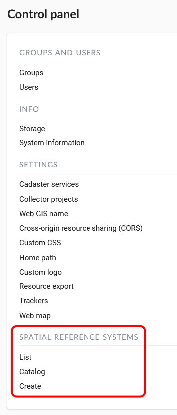
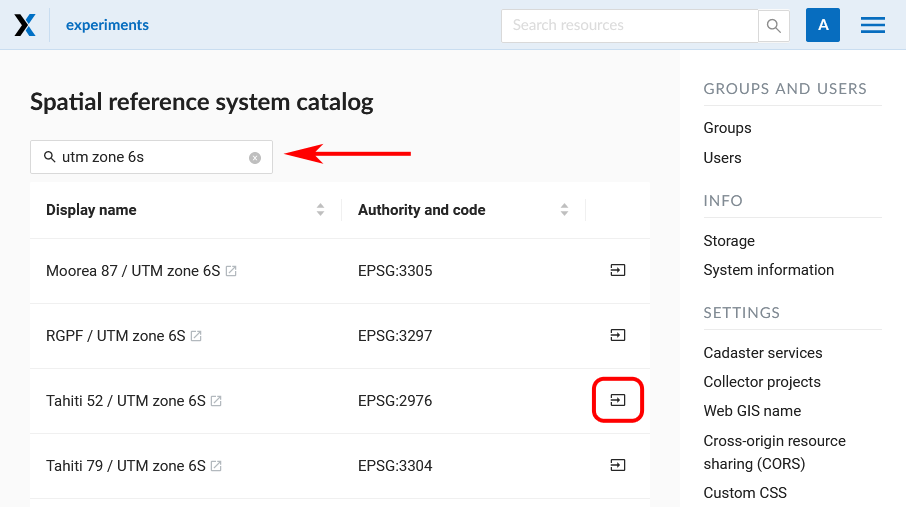
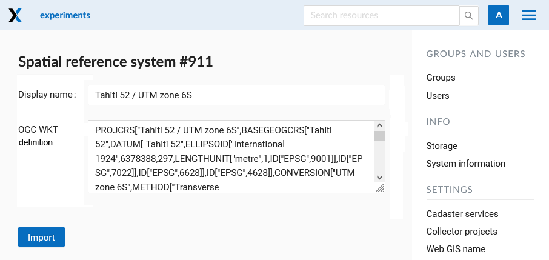
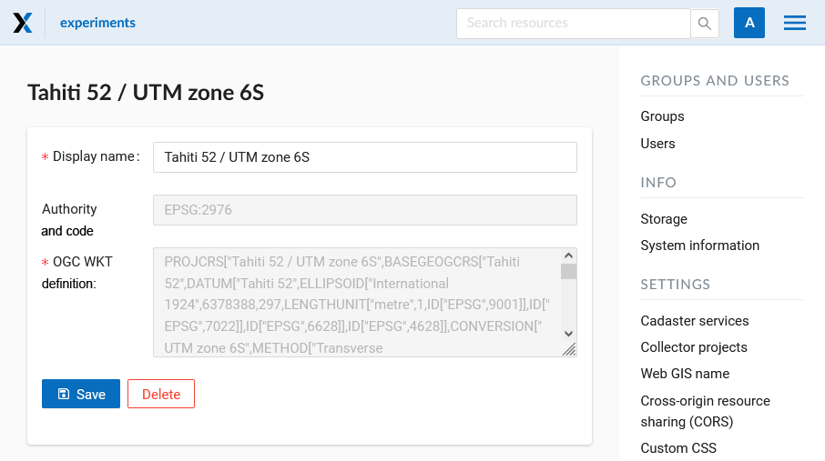
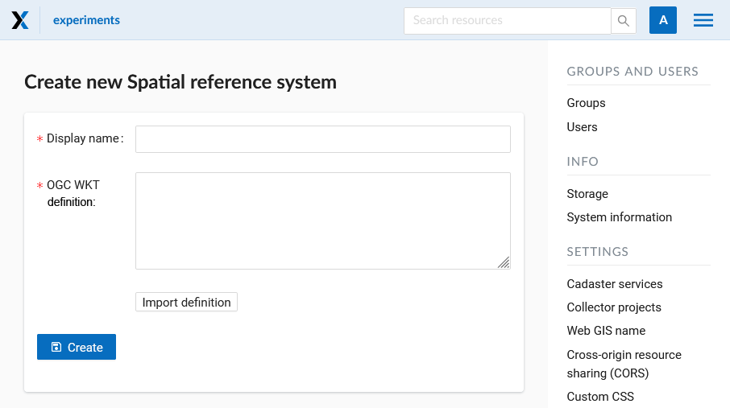
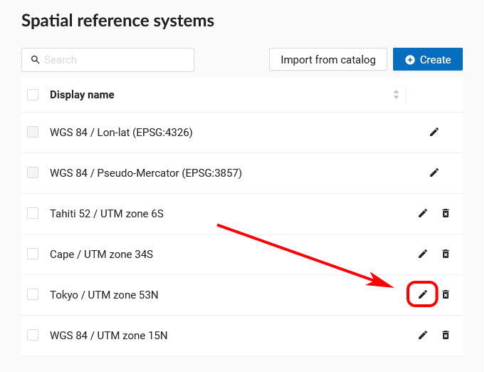
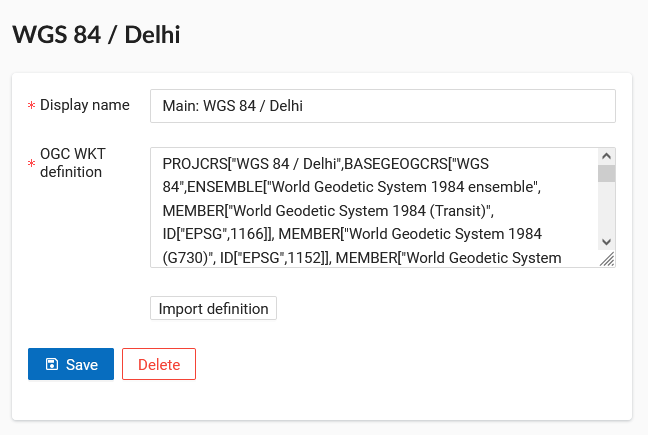
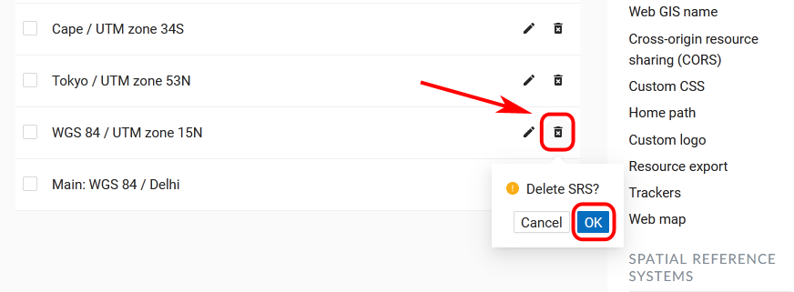

.. sectionauthor:: Григоренко Юлия <grigorenko.j@gmail.com>

.. _ngw_src:

Spacial Reference Systems
=========================

You can manage spacial reference systems using Control panel. It allows browsing the list of added SRS, importing SRS from the catalog and creating your own.

   
   Spacial reference systems in the Control panel

To see which SRS are already added, select "List".  In this list there are two SRS by default: «WGS 84 / Lon-lat (EPSG:4326)» and «WGS 84 / Pseudo-Mercator (EPSG:3857)».

Custom Spacial Reference Systems
----------------------------------

.. note::
    Custom SRS functionality is available on `Premium <http://nextgis.com/pricing/#premium/>`_ and while using the product `On-premise <https://nextgis.com/pricing/>`_.

.. note::
    Only users with administrative permissions can add and modify SRS.
    
If needed, you can import additional SRS from the catalog or create your own.

Import SRS from catalog
~~~~~~~~~~~~~~~~~~~~~

To add an SRS from the catalog, go to the Control panel and in the Spacial reference system section press **Catalog** (or, if you are viewing the SRS list, press **Import from catalog**). 
You will be redirected to the catalog page. Start typing the name of the SRS in the search bar. When you find the desired SRS in the search results, press the icon with the arrow next to it.

   Search results in the catalog
   
You will be redirected to the import page. Here you can modify the name of SRS to be displayed in your WebGIS.

   Adding SRS from catalog
   

   Completing import
   
On the next page, press **Save** to complete the import.

Creating new SRS
~~~~~~~~~~~~~~~~~

To create a new SRS open “Control panel” in the main menu and press **Create** in “Spatial reference systems” (or press **Create** while on the SRS list page).

   Creation of a new SRS
   
You can give an SRS display name and enter its definition in OGC WKT format.  You can also import definitions from common formats as PROJ, MapInfo and EPSG, after the import they will get converted to OGC WKT format.  Then press **“Create”** .
The new SRS will appear in the list. 

How to edit or delete SRS
----------------------------

You can change the *display name* of any SRS by clicking the pencil icon in the corresponding row of the list. If you created an SRS yourself, you can also modify its *OGC WKT definition*.

   
   Editing icon in the SRS list

   
   Editing SRS

To *delete* an SRS, press the trash can icon in the corresponding row of the list. A small dialog window will appear. Confirm that you want to delete the SRS by pressing **OK**.

   
   Deleting custom SRS

After the operation is completed, a message will appear announcing "SRS deleted".
The two default SRS, «WGS 84 / Lon-lat (EPSG:4326)» and «WGS 84 / Pseudo-Mercator (EPSG:3857)», can’t be removed.

Usage of additional SRS
-------------------------------

The added SRS can be used for various purposes:

1. To capture coordinates on Web maps. If you have set up additional SRS (one or several), you can now conveniently capture coordinates in this SRS from anywhere on the map: 
   
2. To export vector layers.  All custom SRS are also available for data export.

3. To extend API requests. Support for custom SRS is gradually added to NextGIS Web API too.  For example, this request will return a feature in a required SRS:

/api/resource/{id}/feature/{fid}?srs=990002

Custom SRS identifier (990002 in this example) can be known by editing a created SRS, for example:

/srs/990002/edit
