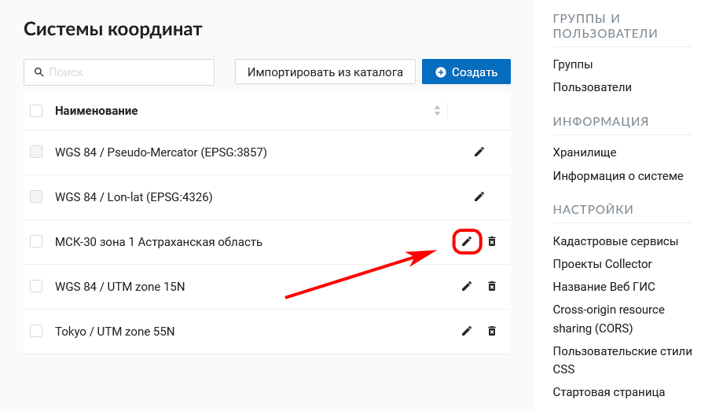

.. sectionauthor:: Юлия Григоренко <grigorenko.j@gmail.com>

.. _ngw_srs:

Системы координат
=================

Управление системами координат осуществляется из Панели управления. Здесь можно просматривать список уже добавленных систем координат, импортировать их из каталога или создавать свои.

   
   Раздел "Системы координат" в Панели управления

Для того, чтобы увидеть, какие системы координат добавлены, выберите «Список». В нем всегда будут присутствовать 2 служебные системы координат: «WGS 84 / Lon-lat (EPSG:4326)» и «WGS 84 / Pseudo-Mercator (EPSG:3857)».

.. note::
    Функциональность по поддержке пользовательских систем координат доступна на планах `Премиум <http://nextgis.ru/pricing/#premium/>`_ и при использовании On-premise `Корпоративный <https://nextgis.ru/pricing/>`_

.. note::
    Добавление и изменение систем координат доступно только пользователям с правами администратора.
    
При необходимости вы можете импортировать другие системы координат из каталога или создать свою.

Новую систему координат можно импортировать из каталога или создать самостоятельно.
Для того, чтобы **добавить СК из каталога**, нужно перейти в «Панель управления» и в разделе «Системы координат» нажать **«Каталог»** или на странице списка СК нажать «Импортировать из каталога». 
На странице каталога в строку поиска начните вводить название нужной системы координат. В появившемся списке результатов поиска нажмите на иконку со стрелкой.

.. figure:: _static/new_srs_catalog_ru.png
   :name: new_srs_catalog
   :align: center
   :width: 20cm    

   Поиск системы координат в каталоге
   
Откроется окно импорта, где можно задать название, под которым система координат будет отображаться в списке в вашей Веб ГИС.

   Импорт системы координат из каталога
   
.. figure:: _static/new_srs_import_save_ru.png
   :name: new_srs_import_save
   :align: center
   :width: 20cm    

   Завершение импорта системы координат
   
В следующем окне нажмите **Сохранить** для завершения импорта.

Для того, чтобы **создать новую систему координат**, нужно перейти в «Панель управления» и в разделе «Системы координат» нажать **«Создать»** (также можно нажать кнопку «Создать» на странице списка СК).

.. figure:: _static/new_srs_ru.png
   :name: new_srs_pic
   :align: center
   :width: 20cm    

   Создание новой системы координат
   
Здесь можно указать имя и описание СК в формате OGC WKT. Также поддерживается импорт описаний из распространенных форматов, таких как PROJ, MapInfo и EPSG, при импорте описаний они будут приведены к формату OGC WKT. После чего следует нажать кнопку "Создать".
Новая система координат появится в списке. 

Отображаемое **наименование системы координат можно изменить**, нажав на иконку редактирования в соответствующей строке списка. Для созданных пользователем СК также доступно редактирование OGC WKT определения.

   
   Иконка редактирования в списке СК

.. figure:: _static/srs_edit_ru.png
   :name: srs_edit_pic
   :align: center
   :width: 20cm 
   
   Редактирование системы координат

Для того, чтобы **удалить** систему координат, нажмите на иконку мусорного ведра в соответствующей строке списка. Рядом появится небольшое диалоговое окно, где для подтверждения удаления нужно нажать **«ОК»**.

   
   Удаление пользовательской системы координат

После успешного завершения операции появится всплывающее сообщение «СК удалена».
Служебные системы координат «WGS 84 / Lon-lat (EPSG:4326)» и «WGS 84 / Pseudo-Mercator (EPSG:3857)» удалить нельзя.

Дополнительные системы координат можно использовать для разных целей:

1. В окне идентификации веб карты для определения координат места клика. Раньше можно было смотреть координаты только в EPSG:4326 и EPSG:3857. Теперь в окне индентификации можно быстро получить координаты и в заданных пользователем СК:

   Использование настраиваемых систем координат
   
2. При экспорте векторного слоя в файл. Все настроенные системы координат также доступны для экспорта данных (см. выше).

3. При работе через API. Поддержка новых СК постепенно добавляется к разным методам API. Так, например, выглядит запрос для получения объекта слоя в нужной СК:

/api/resource/{id}/feature/{fid}?srs=990002

Идентификатор СК (в данном примере 990002) можно узнать из URL, открыв на редактирование созданную систему, например:

/srs/990002/edit

