.. _ngw_create_postgis_layer:

PostGIS
=======

To add a vector layer from PostgreSQL database with PostGIS extension, you need to create a PostGIS connection resource. It is enough to create one connection. 

.. _ngw_create_postgis_connection:

Creating PostGIS connection
----------------------------

Press **Create resource** button and select  **PostGIS connection** (see :numref:`admin_layers_create_postgis_connection_resourse`). 

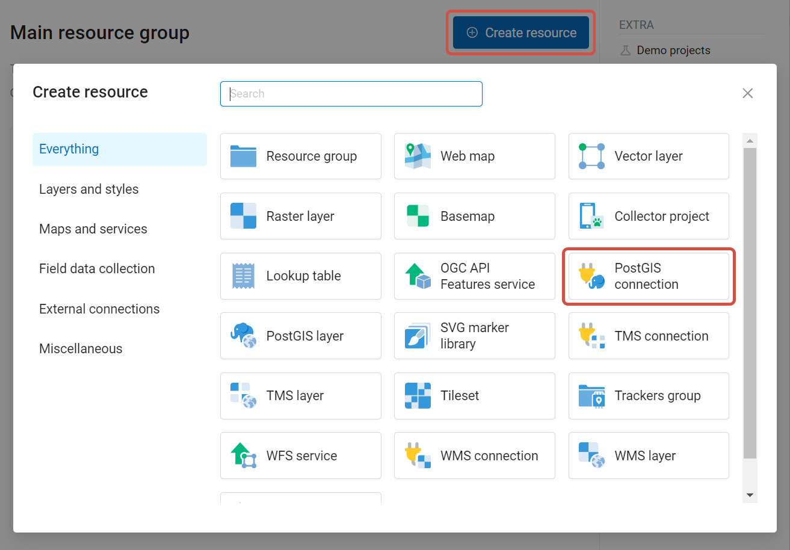

   Selection of "PostGIS connection" resource type
 
Enter a display name that will be visible in the administrator interface. Not to be confused with layer name in a database. 

"Keyname" field is optional.

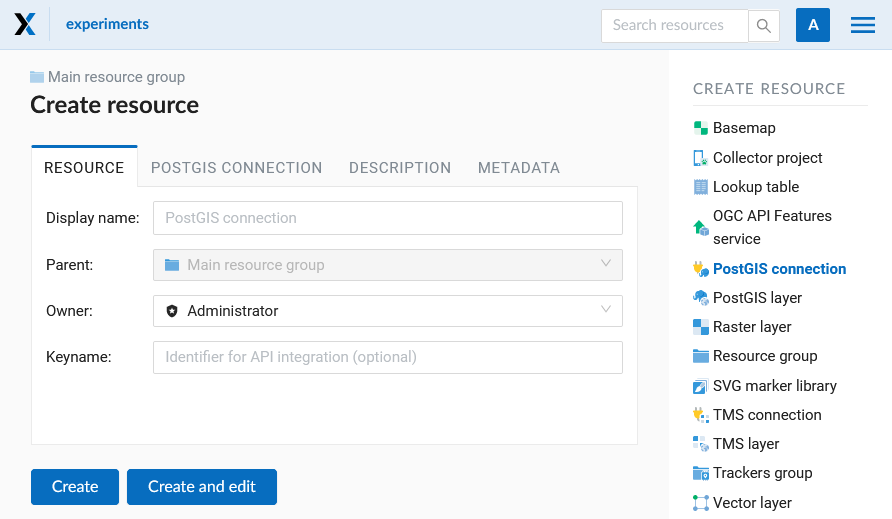

   Create resource dialog for PostGIS connection

You can also add resource description and metadata on the corresponding tabs.

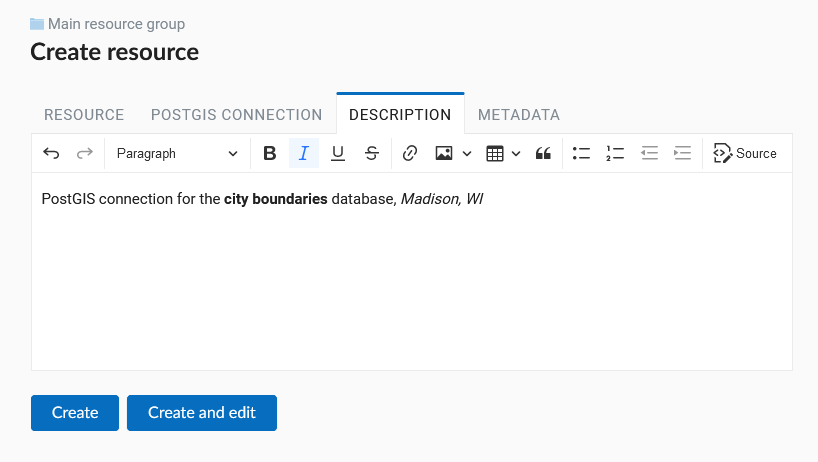
   
   PostGIS connection description
   
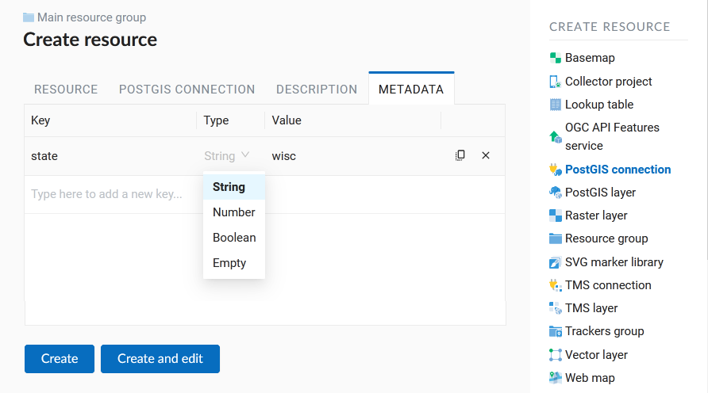

   PostGIS connection metadata

Switch from "Resource" to "PostGIS connection" tab, which is presented on :numref:`admin_layers_create_postgis_connection_db_logins`. 

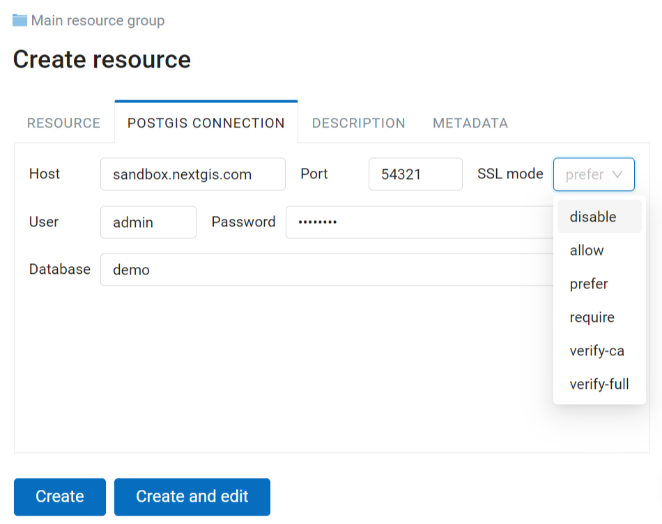

   PostGIS connection settings

In this tab you should enter connection parameters for the PostGIS database that you are going to take data from. 

* disable - use an unencrypted connection.
* allow	- attempt to connect whithout encryption, falling back to an encrypted connection if an unencrypted  connection cannot be established.
* prefer -  attempt to connect using encryption, falling back to an unencrypted connection if an encrypted connection cannot be established.
* require - require an encrypted connection and fail if one cannot be established.
* verify-ca - require an encrypted connection, and also perform verification against the server CA certificate.
* verify-full - require an encrypted connection, and also perform verification against the server CA certificate and against the server host name in its certificate.

More about `SSL modes <https://www.postgresql.org/docs/current/libpq-ssl.html#LIBPQ-SSL-PROTECTION>`_.

After configuring all the neccessary settings click **Create**.

.. _ngw_create_postgis_layer:

Creating PostGIS layer
----------------------

Now you can add individual PostGIS layers. Navigate to a group where you want to create layers. Press **Create resource** button and select **PostGIS layer** (see :numref:`admin_layers_create_postgis_layer`).

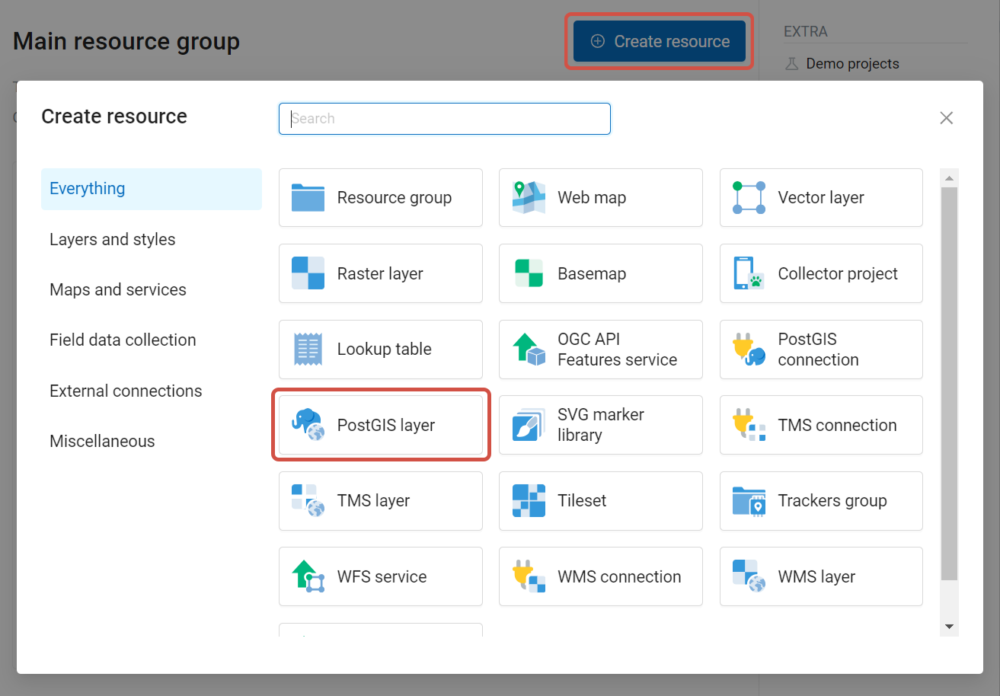

   Selection of "PostGIS layer" resource type

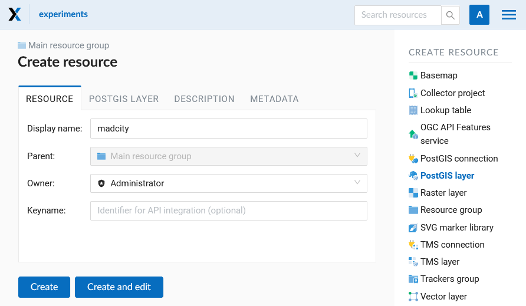

   Create resource dialog for PostGIS layer

Enter a display name that will be visible in administrator interface and in the map 
layer tree. 

"Keyname" field is optional.

You can also add resource description and metadata on the corresponding tabs.

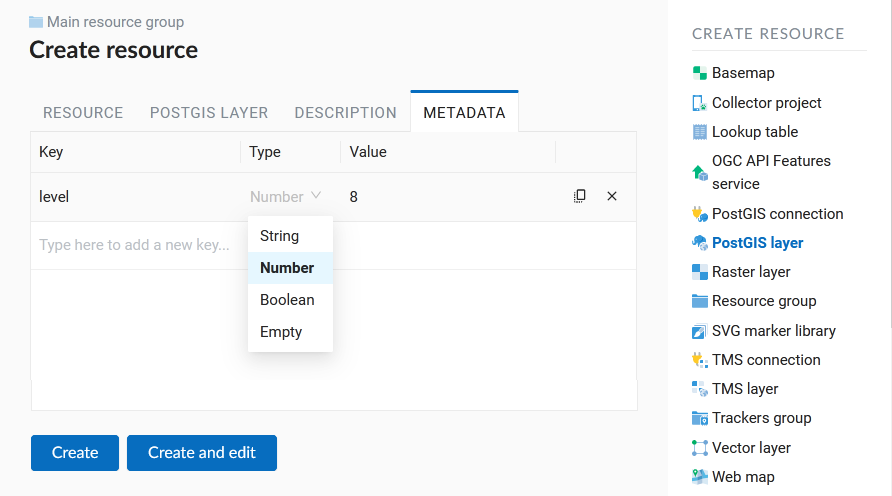

   PostGIS layer metadata

Switch from "Resource" tab to "PostGIS layer" tab, which is presented on 
:numref:`admin_layers_create_postgis_layer_tablename`. 

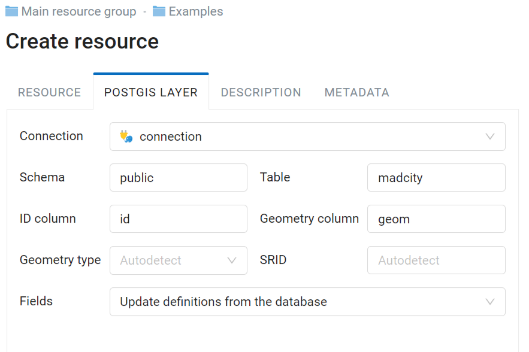

   PostGIS layer tab of create resource dialog

Then perform the following steps:

#. From a dropdown list select a database connection (creation of a connection is described above).
#. Select a schema of the database where layer data is stored. 
   A single database can store multiple schemas. Each schema contains tables and views. If there is only one schema, it's called public. For more information see :program:`PostgreSQL DBMS` manual.
#. Select the Table name (PostGIS layer). 
   You need to know names of tables and columns in your database. 
   Display of tables content is not a feature of NextGIS Web. You can view them using :program:`NextGIS QGIS` or :program:`pgAdmin` software.
#. Select an ID column. 
   When data is loaded into PostGIS using :program:`NextGIS QGIS` 
   software, an ogc_fid column is created. If the data was loaded another way, the 
   column name may be different.
   An ID column should follow rules for data type: the value type should be a 
   number (**numeric**) and it should be a primary key.
#. Select the Geometry column (if the data was loaded to PostGIS using  
   :program:`NextGIS QGIS` software, usually a geometry column called 
   wkb_geometry is created. If the data was loaded some other way, the name of the column 
   may be different).
#. Parameters "Geometry type", "Fields" and "SRID" are not required, so you can use default 
   values.

After specifying all the necessery parameters, click **Create**.

.. important::

   You need an unique integer column to attach your table to NextGIS Web. If the primary key column of the table is not integer or there is none at all, you can create an auxiliary key. 

To create a key column connect to your database (for example using psql in qgis) and execute the following (replacing 'tablename' with the name of your table):

.. code-block::

	ALTER TABLE tablename ADD fid serial NOT NULL;
	ALTER TABLE tablename ADD CONSTRAINT tablename_fid_unique UNIQUE (fid);

And then use this column (fid) an ID column in NextGIS Web.

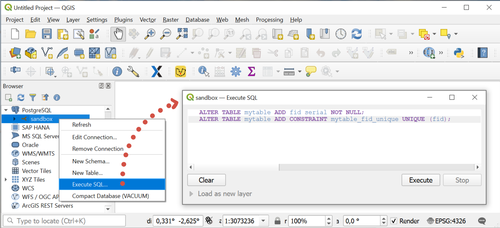

   Adding fid column in QGIS

More details about PostGIS `here <https://docs.nextgis.com/docs_ngweb/source/postgis_details.html>`_.

.. _ngw_postgis_multigeo_table:

Multiple geometries in a singe table
-------------------------------------

NextGIS Web software supports tables with point, line and polygon geometries stored in a single geometry column. 
This is required for some specific datasets: e.g. if one table stores coordinates for parks as polygons and trash cans as points. In this case, in NextGIS Web you need to add three different layers, one for each type of geometry, and select the appropriate "Geometry type" parameter for each layer.

After a layer is created, you need to set a label attribute to display labels. Navigate to layer edit dialog and set a checkbox for the required field in the "Label attribute" column.

If the structure of the database changes (column names, column types, number of columns, table names etc.), you need to update the attribute definitions in the layer properties. Select "Update" in the actions pane and then on the "PostGIS layer" tab change "Attribute definitions" to "Reload" and click **Save**.

.. _ngw_postgis_diagnostics:

PostGIS diagnostics
-----------------------

You can check the correctness of the entered data when adding the `PostGIS Connection <https://docs.nextgis.com/docs_ngweb/source/postgis_details.html#creating-postgis-connection>`_ resource using the **Diagnostics** tool.
To do this, you need to click on the **Diagnostics** button on the panel on the right.

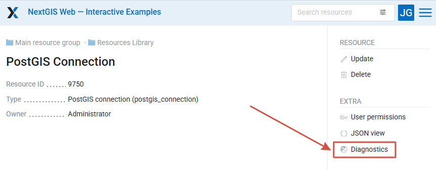

   Launching PostGIS diagnostics

If all fields are filled in correctly when creating a connection to PostGIS - diagnostics will be successful.

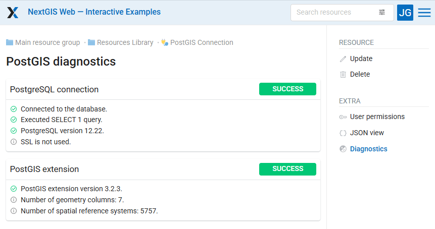

   Diagnostics successful

If any of the entered data is not correct, an error message will appear.

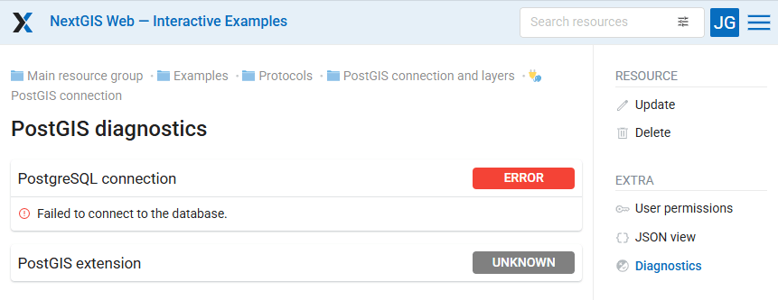

   Error: connection failed

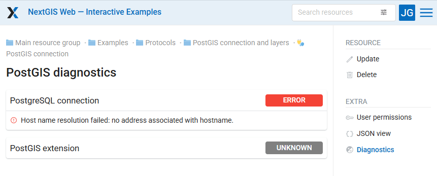

   Error: hostname resolution failed

.. _ngw_postgis_troubleshooting:

PostGIS layer troubleshooting
-------------------------------

You created a connection, but when you try to create a PostGIS layer based on it, you get errors. 

If you get:

1. Cannot connect to the database!

Check the database: is it available, do you have the right credentials? You can do it using :program:`pgAdmin` or :program:`NextGIS QGIS`.

Note that databases may be down temporarily and credentials might change.

.. _ngw_create_postgis_condition:

Create layers with conditions
-----------------------------------

In :program:`NextGIS Web` you can not define queries using WHERE SQL clause. 
This provides additional security (prevention of SQL Injection attack). To 
provide query capability you need to create views with appropriate queries in the database.

To do this connect to PostgreSQL/PostGIS database using :program:`pgAdmin`, 
then navigate to data schema where you want to create a view, right click tree 
item "Views" and select "New view" (see item 1 in :numref:`pgadmin3`). Also you can right click on schema name and select "New object" and then "New view". In the opened dialog, enter the following information:

#. View name («Properties» tab).
#. Data schema where to create a view («Properties» tab).
#. SQL query («Definition» tab).

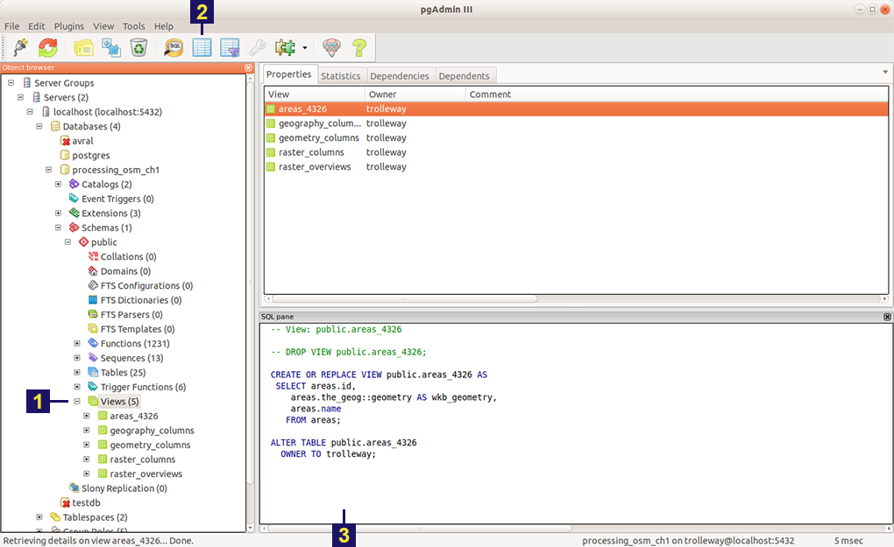

   Main dialog of :program:`pgAdmin` software

   The numbers indicate: 1. – Database items tree; 2 – a button for  
   table open (is active if a table is selected in tree); 3 – SQL query for  
   view.

After that you can display a view to check if the query is correct without closing :program:`pgAdmin` (see  item 2 in :numref:`pgadmin3`). 
