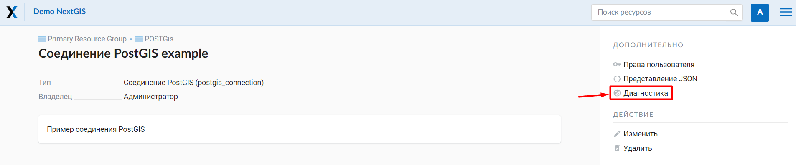
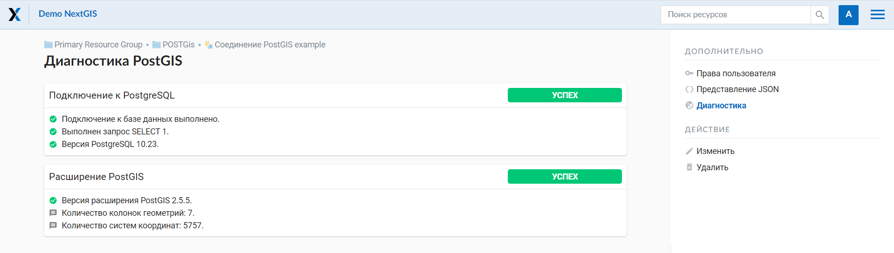
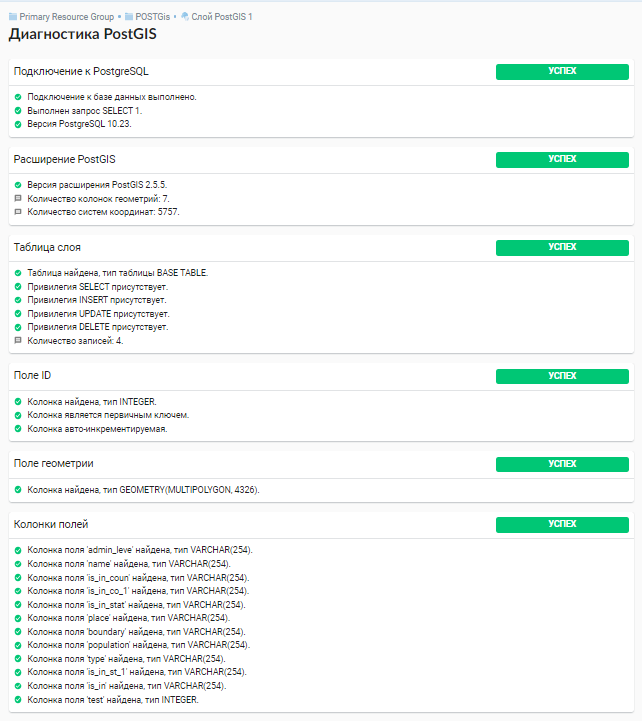
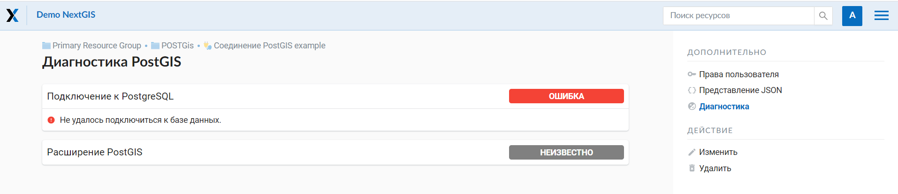
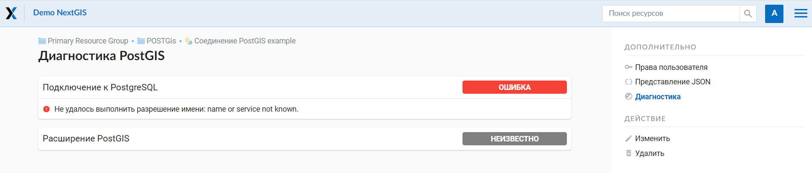
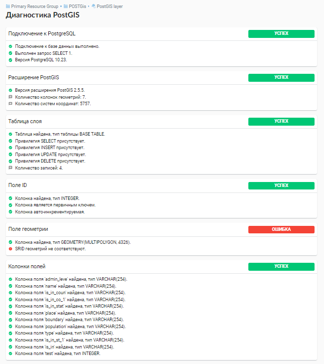
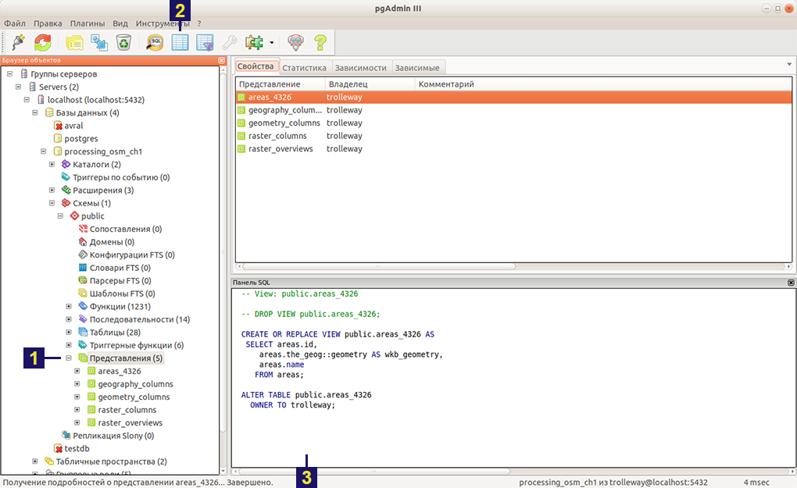

.. _ngw_create_postgis:

PostGIS
==========================

Для добавления векторного слоя из :abbr:`БД (база данных)` PostgreSQL с модулем расширения PostGIS необходимо сначала создать ресурс — соединение PostGIS. 

.. _ngw_create_postgis_connection:

Соединение PostGIS
---------------------

Нажмите кнопку **Создать ресурс** и выберите во всплывающем окне тип ресурса **Cоединение PostGIS** (см. :numref:`admin_layers_create_postgis_connection_resourse`). 

.. figure:: _static/ngweb_create_PostGIS_conn_ru.png
   :name: admin_layers_create_postgis_connection_resourse
   :align: center
   :width: 20cm

   Выбор типа ресурса "Соединение PostGIS"

В открывшемся окне укажите наименование PostGIS соединения (:numref:`ngweb_admin_layers_create_postgis_connection_resourse_name`). Оно будет отображаться в административном интерфейсе (не путайте это наименование и название слоёв в базе данных). 

.. figure:: _static/admin_layers_create_postgis_connection_resourse_name_rus_3.png
   :name: ngweb_admin_layers_create_postgis_connection_resourse_name
   :align: center
   :width: 20cm

   Наименование соединения PostGIS

Также можно добавить `Описание и метаданные <https://docs.nextgis.ru/docs_ngweb/source/edit_resource.html#ngw-update-info-metada>`_.
   
   
На вкладке "Cоединение PostGIS" необходимо ввести параметры подключения к :abbr:`БД (база данных)` PostGIS, из которой будут забираться ваши данные (:numref:`ngweb_admin_layers_create_postgis_connection_db_logins`).

.. figure:: _static/create_postgis_connection_settings_ru.png
   :name: ngweb_admin_layers_create_postgis_connection_db_logins
   :align: center
   :width: 19cm

   Окно параметров соединения PostGIS

Режимы :term:`SSL`:

* ``disable`` - Отключает обработку SSL
* ``allow`` - Сначала будет сделана попытка установить соединение без использования SSL, если попытка будет неудачной, будет установлено SSL-соединение.
* ``prefer`` - Значение по умолчанию. Сначала будет сделана попытка установить SSL-соединение, если попытка будет неудачной, будет установлено соединение без использования SSL.
* ``require`` - При включении этой настройки вся связь с сайтом должна быть зашифрована с помощью HTTPS.
* ``verify-ca`` - обеспечивает шифрование и гарантирует, что сертификат сервера подписан доверенной организацией, но не проверяет, что имя хоста сервера соответствует сертификату. 
* ``verify-full`` - режим с высоким уровнем безопасности. При его использовании клиент проверяет как сертификат сервера, так и соответствие имени хоста сервера сертификату. Это гарантирует, что соединение зашифровано, а сервер аутентифицирован и соответствует ожидаемому имени хоста. 

После указания параметров нажмите кнопку **Создать**.   

.. _ngw_create_postgis_layer:

Слой PostGIS
---------------

Далее можно приступать к добавлению отдельных слоёв PostGIS. Нажмите кнопку **Создать ресурс** и выберите во всплывающем окне тип ресурса **Слой PostGIS** (см. :numref:`admin_layers_create_postgis_layer`). 

.. figure:: _static/ngweb_create_PostGIS_layer_ru.png
   :name: admin_layers_create_postgis_layer
   :align: center
   :width: 20cm

   Выбор типа ресурса "Слой PostGIS"
   
   
На вкладке "Ресурс" указывается наименование слоя PostGIS (:numref:`ngweb_admin_layers_create_postgis_layer_resourse_name`). Оно будет отображаться в административном интерфейсе и дереве слоев веб-карты после добавления. 
   
.. figure:: _static/admin_layers_create_postgis_layer_resourse_name_rus_3.png
   :name: ngweb_admin_layers_create_postgis_layer_resourse_name
   :align: center
   :width: 20cm

   Наименование Слоя PostGIS
   

Также можно добавить `Описание и метаданные <https://docs.nextgis.ru/docs_ngweb/source/edit_resource.html#ngw-update-info-metada>`_, описывающие содержимое данного слоя.

.. figure:: _static/admin_layers_create_postgis_layer_resourse_metadata_rus_2.png
   :name: ngweb_admin_layers_create_postgis_layer_resourse_metadata
   :align: center
   :width: 20cm

   Метаданные слоя PostGIS
  
  
На вкладке "Слой PostGIS" настраиваются параметры слоя (:numref:`ngweb_admin_layers_create_postgis_layer_tablename`).

.. figure:: _static/create_postgis_layer_settings_ru.png
   :name: ngweb_admin_layers_create_postgis_layer_tablename
   :align: center
   :width: 14cm

   Окно параметров слоя PostGIS
   

Здесь необходимо выполнить следующие действия:

1. Из выпадающего списка выбрать подключение к :abbr:`БД (база данных)` (созданное ранее).

2. Выбрать схему :abbr:`БД (база данных)`, в которой находится слой PostGIS. 

        * В одной базе данных PostgreSQL может быть несколько схем, внутри каждой схемы лежат таблицы и представления. Если схема одна, то она называется public. Подробнее смотрите в руководствах по :program:`СУБД PostgreSQL`.

3. Выбрать название таблицы (слоя PostGIS). 

        * Вам потребуется знать названия ваших таблиц и полей в базе данных. 
	* Отображение таблиц и представлений не входит в задачи NextGIS Web. Для просмотра можно воспользоваться :program:`NextGIS QGIS` или :program:`PgAdmin`.

4. Выбрать "Поле ID". 

	* При загрузке данных в PostGIS через NextGIS QGIS обычно создается поле с названием ogc_fid, при загрузке иным способом название поля может отличаться.
	* Поле ID должно удовлетворять ограничениям на тип данных: быть числовым (**numeric**) и являться первичным ключом.

5. Выбрать "Поле геометрии".

	* При загрузке данных в PostGIS через :program:`NextGIS QGIS`  обычно создается поле геометрии с названием wkb_geometry, при загрузке иным способом название поля может отличаться.

6. Поля "Тип геометрии", "Система координат", "Поля" и "SRID" являются не обязательными, и их значения могут быть оставлены по умолчанию.

После указания параметров нажмите кнопку **Создать**.   

.. important::

   Чтобы добавить таблицу в NextGIS Web в ней должна быть колонка с уникальными целочисленными значениями. Если такой нет или колонка первичного ключа содержит неуникальные значения, можно добавить дополнительную колонку для этих целей.

Чтобы добавить такую колонку в таблицу, подключитесь к базе данных (используя psql, например, в QGIS) и выполните следующий запрос: 

.. code-block::

   ALTER TABLE tablename ADD fid serial NOT NULL;
   ALTER TABLE tablename ADD CONSTRAINT tablename_fid_unique UNIQUE (fid);

Затем эту колонку (fid) можно использовать в качестве колонки ID в NextGIS Web.

.. figure:: _static/postgis_add_fid_qgis_ru.png
   :name: postgis_add_fid_qgis_pic
   :align: center
   :width: 20cm

   Добавление колонки с ID в QGIS

С другими особенностями использования PostGIS в NextGIS Web вы можете ознакомиться `здесь <https://docs.nextgis.ru/docs_ngweb/source/postgis_details.html>`__.

.. _ngw_postgis_multigeo_table:

Хранение нескольких геометрий в таблице
----------------------------------------

Программное обеспечение NextGIS Web поддерживает добавление таблиц, в которых в поле геометрии хранятся совместно точечные, линейные и полигональные геометрии. 
Это необходимо для отображения специфических наборов данных: например, если в одной таблице хранятся координаты городских парков в виде полигонов и мусорных урн в виде точек. 
В этом случае в NextGIS Web нужно добавить три отдельных слоя для каждого 
типа геометрии, и выбрать нужный элемент в поле "Тип геометрии".

После создания слоя для отображения подписей к геометриям необходимо задать атрибут наименования. 
Для этого следует зайти на страницу редактирования слоя и выбрать нужное поле в списке "Атрибут наименования".

Если в :abbr:`БД (база данных)` были изменены какие либо данные, касающиеся структуры (названия или типы полей, изменен их состав, переименованы таблицы и т. п.), то в свойствах соответствующего слоя необходимо обновить описания атрибутов. 
Для этого для выбранного слоя следует выбрать действие "Изменить", на вкладке "Слой PostGIS" в поле "Описания атрибутов" выбрать "Загрузить" из базы данных и нажать "Сохранить".

.. _ngw_postgis_diagnostics:

Диагностика PostGIS
---------------------

Проверить корректность введенных данных при добавлении ресурса `Соединение PostGIS <https://docs.nextgis.ru/docs_ngweb/source/postgis_details.html#ngw-create-postgis-connection>`_ или `Слой PostGIS <https://docs.nextgis.ru/docs_ngweb/source/postgis_details.html#ngw-create-postgis-layer>`_ можно при помощи инструмента **Диагностика**. 
Для этого вам необходимо нажать на кнопку  **Диагностика** на панели справа.

В случае, если при создании PostGIS-соединения или PostGIS слоя все поля заполнены верно - диагностика пройдет успешно.

В случае, если какие-то из введенных данных не корректны - появится сообщение об ошибке.

.. _ngw_create_postgis_problems:

Возможные проблемы со слоями PostGIS
-------------------------------------

Вы создали подключение и пытаетесь создать на его основе слой PostGIS. 

Если вы получаете ошибку:

1. Невозможно подключиться к базе данных!

Проверьте, доступна ли база данных к которой вы подключаетесь, правильная ли у вас учетная запись. Это удобно делать через pgAdmin или QGIS.

Имейте в виду, может быть так, что база временно отключена или изменились параметры доступа.

.. _ngw_create_postgis_condition:

Создание слоя с условиями
--------------------------

В :program:`NextGIS Web` нельзя указывать условия отбора записей из слоя (SQL конструкция WHERE). 
Это делается для обеспечения безопасности (исключения атак SQL Injection). 
Для обеспечения такой возможности необходимо в БД создать представления с соответствующими условиями отбора.

Для этого необходимо подключится к :abbr:`БД (база данных)` PostgreSQL/PostGIS при помощи :program:`pgAdminIII`, перейти в схему данных, где следует создать представление и в элементе дерева "Представления" правой клавишей мыши вызвать контекстное меню и выбрать "Создать новое представление" (см. :numref:`ngweb_pgadmin3`. п. 1). 
Также диалог можно вызвать правым кликом на названии схемы, выбрав "Новый объект" и далее "Новое представление".Далее в открывшемся диалоге необходимо указать:

#. Название представления (вкладка "Свойства").
#. Схему данных, в которой необходимо создать представление (вкладка "Свойства").
#. Необходимый SQL запрос (вкладка "Определение").

   Главное окно ПО :program:`pgAdminIII`.

   Цифрами на рисунка обозначено: 1 – дерево элементов базы данных; 2 – кнопка открытия таблицы (активна при выделенной таблице); 3 – содержимое запроса в представлении.

После этого, не выходя из :program:`pgAdminIII`, можно открыть представление для проверки корректности введенного SQL запроса (см. :numref:`ngweb_pgadmin3`. п. 2). 
