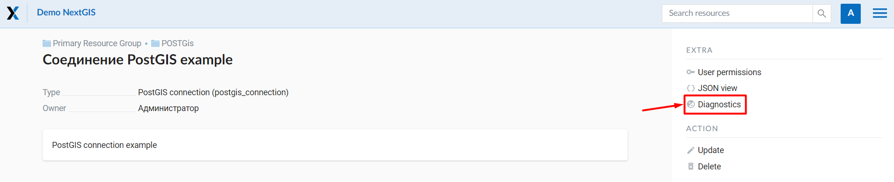
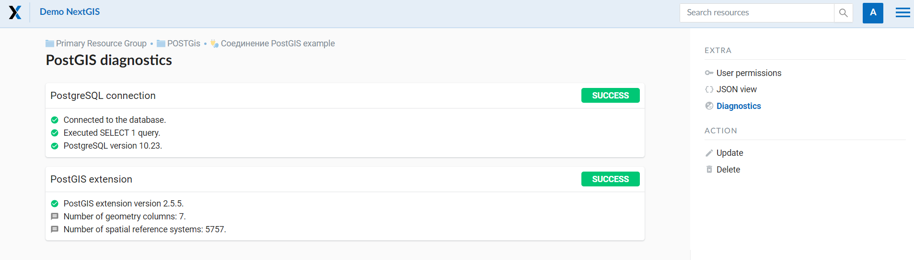
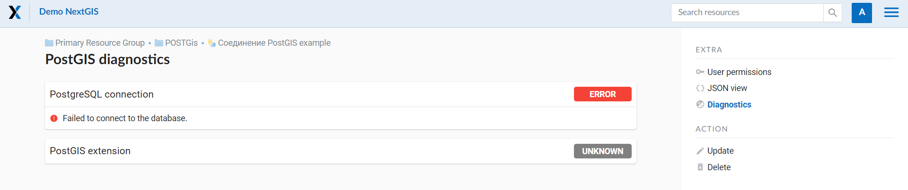
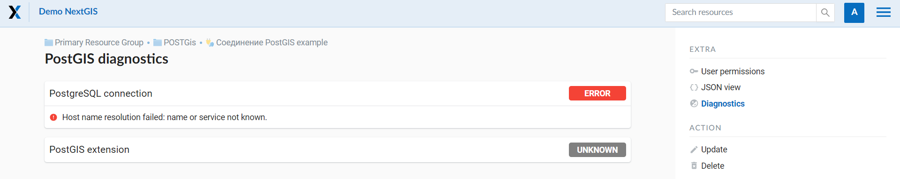

Details
^^^^^^^

NextGIS Web software supports tables with point, line and polygon geometries stored in a single geometry column. 
This is required for some specific datasets: e.g. if one table stores coordinates for parks as polygons and trash cans as points. In this case, in NextGIS Web you need to add three different layers, one for each type of geometry, and select the appropriate "Geometry type" parameter for each layer.

After a layer is created, you need to set a label attribute to display labels. Navigate to layer edit dialog and set a checkbox for the required field in the "Label attribute" column.

If the structure of the database changes (column names, column types, number of columns, table names etc.), you need to update the attribute definitions in the layer properties. Select "Update" in the actions pane and then on the "PostGIS layer" tab change "Attribute definitions" to "Reload" and click **Save**.

.. _ngw_postgis_diagnostics:

PostGIS diagnostics
^^^^^^^^^^^^^^^^^^^

You can check the correctness of the entered data when adding the **PostGIS Connection** resource using the **Diagnostics** tool.
To do this, you need to click on the **Diagnostics** button on the panel on the right.

If all fields are filled in correctly when creating a connection to PostGIS - diagnostics will be successful.

If any of the entered data is not correct, an error message will appear.

.. _ngw_postgis_diagnostics:

PostGIS layer troubleshooting
^^^^^^^^^^^^^^^^^^^^^^^^^^^^^

You created a connection, but when you try to create a PostGIS layer based on it, you get errors. 

If you get:

1. Cannot connect to the database!

Check the database: is it available, do you have the right credentials? You can do it using :program:`pgAdmin` or :program:`NextGIS QGIS`.

Note that databases may be down temporarily and credentials might change.

Create layers with conditions
^^^^^^^^^^^^^^^^^^^^^^^^^^^^^^

In :program:`NextGIS Web` you can not define queries using WHERE SQL clause. 
This provides additional security (prevention of SQL Injection attack). To 
provide query capability you need to create views with appropriate queries in the database.

To do this connect to PostgreSQL/PostGIS database using :program:`pgAdmin`, 
then navigate to data schema where you want to create a view, right click tree 
item "Views" and select "New view" (see item 1 in :numref:`pgadmin3`). Also you can right click on schema name and select "New object" and then "New view". In the opened dialog, enter the following information:

#. View name («Properties» tab).
#. Data schema where to create a view («Properties» tab).
#. SQL query («Definition» tab).

.. figure:: _static/pgadmin3_eng.png
   :name: pgadmin3
   :align: center
   :width: 20cm

   Main dialog of :program:`pgAdmin` software

   The numbers indicate: 1. – Database items tree; 2 – a button for  
   table open (is active if a table is selected in tree); 3 – SQL query for  
   view.

After that you can display a view to check if the query is correct without closing :program:`pgAdmin` (see  item 2 in :numref:`pgadmin3`). 
