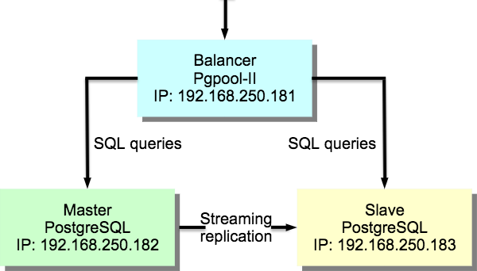

.. sectionauthor:: Dmitry Baryshnikov <dmitry.baryshnikov@nextgis.com>

.. _ngw_replica:

Репликация и балансировка нагрузки базы данных
==============================================

Репликация это механизм синхронизации содержимого нескольких копий базы данных.
Это может быть использовано для обеспечения резервного копирования и 
отказоустойчивости. При падении одной :term:`СУБД` ее запросы будет обслуживать
другая копия.

Балансировка нагрузки заключается в распределнии запросов от пользователей по 
разным копиям базы данных. Это позволяет выполнять большее количество запросов
одновременно.

Для обеспечения задачи репликации и балансировки нагрузки базы данных развернем
кластер `master-slave` на СУБД PostgreSQL. Кластер должен содержать один ведущий 
сервер (**Master**), один ведомый (**Slave**) и один узел масштабирования 
(**Balancer**).

Репликация будет организована средствами :abbr:`СУБД (система управления базами данных)` 
PostgreSQL через механизм потоковой репликации (streaming replication).

Для балансировки нагрузки будет использоваться :term:`ПО` Pgpool-II. Данное ПО 
также будет использоваться для обеспечения отказоустойчивости (failover, 
online recovery).

Примерная схема решения представлена на :numref:`ngw_admin_replcation_pic`.

   Схема репликации и балансировки нагрузки.
  
Реализация решения будет описана на примере СУБД PostgreSQL 9.5 и 
:abbr:`ПО (программное обеспечение)` Pgpool-II в :abbr:`ОС (операционная система)` 
Ubuntu 16.04.

Подготовка среды
----------------

1. Создадим 3 виртуальные машины (ОС Ubuntu 16.04 LTS):

   * pgpool   (IP адрес 192.168.250.181)
   * pgmaster (IP адрес 192.168.250.182)
   * pgslave  (IP адрес 192.168.250.183)

2. На виртуальных машинах **pgmaster** и **pgslave** установим СУБД PostgreSQL
   с модулем расширения PostGIS и дополнительным ПО Pgpool-II:

.. code-block:: bash

   sudo apt install postgresql-9.5
   sudo -u postgres createuser ngw_admin -P -e
   sudo apt install postgresql-9.5-postgis-2.2
   sudo apt install postgresql-9.5-pgpool2 
   
3. На виртуальной машине **pgpool** установим ПО Pgpool-II:

.. code-block:: bash

   sudo apt install pgpool2  
   
Настройка потоковой репликации
------------------------------

Отредактируйте конфигурационный файл `postgresql.conf` на виртуальной 
машине **pgmaster** следующим образом:

.. code-block:: bash

   sudo nano /etc/postgresql/9.5/main/postgresql.conf   
   
В файле должны быть следующие строки:

.. code-block:: bash   

   listen_addresses = '192.168.250.182'
   wal_level = hot_standby
   max_wal_senders = 2
   wal_keep_segments = 32
   #hot_standby = on 
   
Строка с комментарием обязательна и нужна для переключения `master-slave`.
Параметры конфигурационного файла имеют следующие значения:

   * wal_level = hot_standby — сервер начнет писать в WAL логи так же как и при 
     режиме "archive", добавляя информацию, необходимуюдля восстановления транзакции
   * max_wal_senders = 2 — максимальное количество слейвов
   * wal_keep_segments = 32 — минимальное количество файлов c WAL сегментами в 
     pg_xlog директории
     
Далее добавим строчку для репликации в файл `pg_hba.conf`:

.. code-block:: bash

   sudo nano /etc/postgresql/9.5/main/pg_hba.conf   
   
В файле должны быть следующие строки:

.. code-block:: bash

   host        replication	postgres	 192.168.250.0/24	trust
   host        all             all        192.168.250.181/32  trust
   
Это разрешит доступ к СУБД для нужд репликации из подсети 192.168.250.х.

Перезапустим СУБД на виртуальной машине **pgmaster**:

.. code-block:: bash

   sudo service postgresql restart
   
Останавливаем СУБД на виртуальной машине **pgslave**:  

.. code-block:: bash

   sudo service postgresql stop
    
Отредактируйте конфигурационный файл `postgresql.conf` на виртуальной 
машине **pgslave** следующим образом:

.. code-block:: bash

   sudo nano /etc/postgresql/9.5/main/postgresql.conf   
   
В файле должны быть следующие строки:

.. code-block:: bash   

   listen_addresses = '192.168.250.183'
   hot_standby = on 
   
Далее добавим строчку для репликации в файл `pg_hba.conf`:

.. code-block:: bash

   sudo nano /etc/postgresql/9.5/main/pg_hba.conf   
   
В файле должны быть следующие строки:

.. code-block:: bash

   host        replication	postgres	 192.168.250.0/24	trust
   host        all             all        192.168.250.181/32  trust
   
На виртуальной машине **pgmaster** под пользователем postgres создаем резервную
копию кластера базы данных и пересылаем на виртуальну машину **pgslave**.

.. code-block:: bash

   sudo -u postgres psql -c "SELECT pg_start_backup('stream');"
   sudo rsync -v -a /var/lib/postgresql/9.5/main/ 192.168.250.183:/var/lib/postgresql/9.5/main/ --exclude postmaster.pid
   sudo -u postgres psql -c "SELECT pg_stop_backup();"
   

.. note::
   Для передачи данных при помощи утилиты rsync ее необходимо установить, а также
   обеспечить временный доступ к виртуальной машине **pgslave** пользователю root
   по ssh.
   
На виртуальной машине **pgslave** создаем конфигурационный файл репликации 
`/var/lib/postgresql/9.5/main/recovery.conf`:

.. code-block:: bash

   standby_mode = 'on'
   primary_conninfo = 'host=192.168.250.182 port=5432 user=postgres'
   trigger_file = 'failover'
  
Параметр `trigger_file` отвечает за путь, по которому PostgreSQL ищет файл, 
чтобы переключиться в режим ведущего. В данном случае файл ищется в папке с 
конфигурацией СУБД (*/var/lib/postgresql/9.5/main/failover*).

Дадим права на новый файл:

.. code-block:: bash

   sudo chown postgres.postgres /var/lib/postgresql/9.5/main/recovery.conf

Запустим СУБД на виртуальной машине **pgslave**:

.. code-block:: bash

   sudo service postgresql start
     
Проверим активность репликации на виртуальной машине **pgmaster**:

.. code-block:: bash

   ps aux | grep sender
   $ postgres 12492  0.0  0.0 295508 10548 ?        Ss   22:16   0:00 postgres: wal sender process postgres 192.168.250.183(58852) streaming 0/B000060
       
Проверим активность репликации на виртуальной машине **pgslave**:

.. code-block:: bash

   ps aux | grep receiver
   $ postgres  6128  0.0  0.0 305904 11504 ?        Ss   22:16   0:00 postgres: wal receiver process   streaming 0/B000060
   
Настройка узла масштабирования
------------------------------

Изменим конфигурационный файл `/etc/pgpool2/pgpool.conf`:

.. code-block:: bash

   sudo nano /etc/pgpool2/pgpool.conf

   # Устанавливаем весь диапазон прослушиваемых адресов
   listen_addresses = '192.168.250.181'                                                                                           
   # Параметры подключения к базе на сервере pgmaster
   backend_hostname0 = '192.168.250.182'                                    
   backend_port0 = 5432                                               
   backend_weight0 = 1                                                      
   backend_data_directory0 = '/var/lib/postgresql/9.5/main'                            
   
   # Параметры подключения к базе на сервере pgslave
   backend_hostname1 = '192.168.250.183'                                       
   backend_port1 = 5432 
   backend_weight1 = 1
   backend_data_directory1 = '/var/lib/postgresql/9.5/main' 
   
   # Используем pool_hba.conf для авторизации клиентов
   enable_pool_hba = true
   sr_check_user = 'postgres'
   health_check_user = 'postgres'
   memory_cache_enabled = on
   memqcache_oiddir = '/var/log/postgresql/oiddir'
   
Изменим конфигурационный файл `/etc/pgpool2/pool_hba.conf`:

.. code-block:: bash

   sudo nano /etc/pgpool2/pool_hba.conf
   
   host	all	all	192.168.0.0/16	md5
   
Добавим пароли в файл `/etc/pgpool2/pool_passwd`:

.. code-block:: bash

   sudo nano /etc/pgpool2/pool_passwd
   
   ngw_admin:md5111486c34b16ebbab2f34a06c97e911c
   
   sudo chown root.postgres /etc/pgpool2/pool_passwd
   sudo chmod 664  /etc/pgpool2/pool_passwd

Перезагружаем pgpool:

.. code-block:: bash

   sudo service pgpool2 restart
   
Проверим работоспособность pgpool:

.. code-block:: bash

   psql -h 192.168.250.181 -U ngw_admin -d postgres
   
   psql (9.5.13)
   Type "help" for help.
   postgres=> show pool_nodes;
   
    node_id |    hostname     | port | status | lb_weight |  role
   ---------+-----------------+------+--------+-----------+---------
    0       | 192.168.250.182 | 5432 | 2      | 0.500000  | primary
    1       | 192.168.250.183 | 5432 | 2      | 0.500000  | standby
   (2 rows)   
   
Настройка автоматического failover
----------------------------------

Автоматический failover предназначен для переключения одного из ведомых серверов
СУБД в роль мастера при падении сервера с мастером. Это необходимо для обеспечения
возможности выполнения запросов на запись.

Failover требует настройки удаленного соединения по протоколу `ssh` без пароля. 
Для этого нужно создать ssh-ключи пользователя `postgres` и разослать их на
виртуальные машины **pgmaster** и **pgslave**.

Для начала назначим пароль для пользователя `postgres` на виртуальных машинах
**pgmaster** и **pgslave**. Для этого выполним:

.. code-block:: bash

   sudo passwd postgres 
   
Далее на вирутальной машине **pgpool** выполним следующую команду (пароль оставим
пустым):

.. code-block:: bash

   sudo -u postgres ssh-keygen
   
Перешлем ключ на виртуальные машины **pgmaster** и **pgslave**:

.. code-block:: bash

   sudo su - postgres
   ssh-copy-id 192.168.250.182
   ssh-copy-id 192.168.250.183
   
Добавим в конфигурационный файл `/etc/pgpool2/pgpool.conf` следующую строчку:

.. code-block:: bash

   sudo nano /etc/pgpool2/pgpool.conf   
   
   # Скрипт, вызываемый при падении сервера
   failover_command = '/etc/pgpool2/failover.sh %d %H /var/lib/postgresql/9.5/main/failover'
   
Создадим скрипт `/etc/pgpool2/failover.sh` следующего сожержания:

.. code-block:: bash

   #! /bin/bash

   # ID упавшего узла
   FAILED_NODE=$1
   # IP нового мастера
   NEW_MASTER=$2
   # Путь к триггерному файлу
   TRIGGER_FILE=$3
   
   if [ $FAILED_NODE = 1 ]; 
   then
      echo "Ведомый сервер вышел из строя"
      exit 1
   fi
   
   echo "Ведущий сервер вышел из строя"
   echo "Новый ведущий сервер: $NEW_MASTER"
   
   ssh -T postgres@$NEW_MASTER touch $TRIGGER_FILE
   exit 0
   
Назначим ему права на исполнение:

.. code-block:: bash

   sudo chmod 755 /etc/pgpool2/failover.sh
   
Протестировать механизм автоматического failover можно следующим образом:

1. Отключить ведущий сервер
2. Выполнить запрос `show pool_nodes;` на узле масштабирования
3. Смотреть логи pgpool на предмет выполнения скрипта
4. Убедиться в том, что ведомый сервер после выполнения скрипта может принимать 
   запросы на запись 
   
Для тестирования механизма автоматического failover остановим СУБД Postgres на 
виртуальной машине **pgmaster**:
   
.. code-block:: bash

   psql -p 5432 -h 192.168.250.181 -U ngw_admin -c "show pool_nodes" db_ngw
   
    node_id |    hostname     | port | status | lb_weight |  role
   ---------+-----------------+------+--------+-----------+---------
    0       | 192.168.250.182 | 5432 | 2      | 0.500000  | primary
    1       | 192.168.250.183 | 5432 | 2      | 0.500000  | standby
   (2 rows)
   
   sudo service postgresql stop
   
   psql -p 5432 -h 192.168.250.181 -U ngw_admin -c "show pool_nodes" db_ngw
   
    node_id |    hostname     | port | status | lb_weight |  role
   ---------+-----------------+------+--------+-----------+---------
    0       | 192.168.250.182 | 5432 | 3      | 0.500000  | standby
    1       | 192.168.250.183 | 5432 | 2      | 0.500000  | primary
   (2 rows)       
   
Из листинга видно, что старый master имеет статус `3`, а старый slave стал
новым мастером.

Добавим старый мастер в качестве slave. Для этого на виртуальной 
машине **pgmaster**:

1. Создадим конфигурационный файл репликации `/var/lib/postgresql/9.5/main/recovery.conf`:

.. code-block:: bash

   standby_mode = 'on'
   primary_conninfo = 'host=192.168.250.183 port=5432 user=postgres'
   trigger_file = 'failover'
  
Дадим права на новый файл:

.. code-block:: bash

   sudo chown postgres.postgres /var/lib/postgresql/9.5/main/recovery.conf
   
2. Исправим конфигурационный файл `postgresql.conf` следующим образом:

.. code-block:: bash

   sudo nano /etc/postgresql/9.5/main/postgresql.conf   
   
В файле должны быть следующие строки:

.. code-block:: bash   

   hot_standby = on
   
3. На виртуальной машине **pgslave** под пользователем postgres создаем резервную
копию кластера базы данных и пересылаем на виртуальну машину **pgmaster**.

.. code-block:: bash

   sudo -u postgres psql -c "SELECT pg_start_backup('stream');"
   sudo -u postgres rsync -v -a /var/lib/postgresql/9.5/main/ 192.168.250.183:/var/lib/postgresql/9.5/main/ --exclude postmaster.pid
   sudo -u postgres psql -c "SELECT pg_stop_backup();"   
   
4. На  виртуальной машине **pgmaster** запустим СУБД:

.. code-block:: bash

   sudo service postgresql start
   
5. На  виртуальной машине **pgpool** перезапустим сервис:

.. code-block:: bash

   sudo service pgpool2 restart
   
   psql -p 5432 -h 192.168.250.181 -U ngw_admin -c "show pool_nodes" db_ngw
   
    node_id |    hostname     | port | status | lb_weight |  role
   ---------+-----------------+------+--------+-----------+---------
    0       | 192.168.250.182 | 5432 | 2      | 0.500000  | standby
    1       | 192.168.250.183 | 5432 | 2      | 0.500000  | primary
   (2 rows)  
   
Используемые источники
----------------------

При реализаци механизма репликации и балансировки нагрузки использовались 
следующие источники:

1. `Отказоустойчивый кластер Master-Slave на PostgreSQL <https://habr.com/post/188096/>`_
2. `PostgreSQL 9.5 Streaming Cluster on Ubuntu 16.04 <https://dennis.gesker.com/2016/09/08/postgresql-9-5-streaming-cluster-on-ubuntu-16-04/>`_
3. `pgpool-II 3.7.4 Documentation <http://www.pgpool.net/docs/latest/en/html/index.html>`_
4. `Replication and load balance in posgresql 9.4 with pgpool2 <https://sonnguyen.ws/replication-load-balance-in-posgresql-replication-with-pgpool2/>`_
