Services
=========

Resources have auto-generated links that you can use to add the data to third-party applications:

* Vector layers have link for `MVT Tiles <https://docs.nextgis.com/docs_ngweb/source/services.html#ngw-mvt>`_;
* Layer style (vector or raster), Web Map and WMS layer have `TMS link <https://docs.nextgis.com/docs_ngweb/source/services.html#ngw-tms-service>`_;

Additionally, you can create services that allow to access data via standard protocols:

* `WFS <https://docs.nextgis.com/docs_ngweb/source/services.html#ngw-wfs-service>`_
* `OGC API Features <https://docs.nextgis.com/docs_ngweb/source/services.html#ngw-OGC-API-Features>`_
* `WMS <https://docs.nextgis.com/docs_ngweb/source/services.html#ngw-wms-service>`_

.. _ngw_mvt:

MVT vector tiles
-------------------

For each new `vector layer <https://docs.nextgis.com/docs_ngweb/source/layers.html#ngw-create-vector-layer>`_ NextGIS Web automatically generates a link that can be used to access the data as :term:`MVT` (Map Vector Tiles, `specification <https://github.com/mapbox/vector-tile-spec>`_).

.. _mvt_advantage:

The main advantages of MVT
~~~~~~~~~~~~~~~~~~~~~~~~~~~

With MVT you can store and transmit large volumes of geographical data in a compact format. This makes MVT especially useful for web maps and mobile applications, where it is crucial to use network resources efficiently and provide quick access to the data.

The main advantages of this format are:

* Fast data rendering;
* Dynamic labels and map elements;
* Big variety and flexible customization of data styles (display filters based on scale, time etc).

Each tile includes vector geometrical data and attributes for a specific rectangular region of the map and contains all the necessary data for displaying a particular zoom level. Data is organized into layers, which can contain different types of geometry and attributes.

MVT is supported by multiple libraries and tools for reading, writing, and displaying tiles  

* libraries (Mapbox GL, OpenLayers, Leaflet)  
* tile processing tools such as Tippecanoe and Mapbox Studio.

.. _mvt_link:

Generating MVT link
~~~~~~~~~~~~~~~~~~~~~~~~

For every vector layer created in NextGIS Web a link to vector tiles is generated automatically:

.. raw:: html

    
<strong>https://demo.nextgis.com/</strong>api/component/feature_layer/mvt?resource=<strong>6243</strong>&amp;z={z}&amp;x={x}&amp;y={y}

     

The highlighted parts are the Web GIS URL and the resource ID of the vector layer.  

You can use it in third-party web applications and map builders. This link is used to transmit the information about the layer. The layer’s style is configured on the client side. 

You'll find this link in the External access section of the resource page.

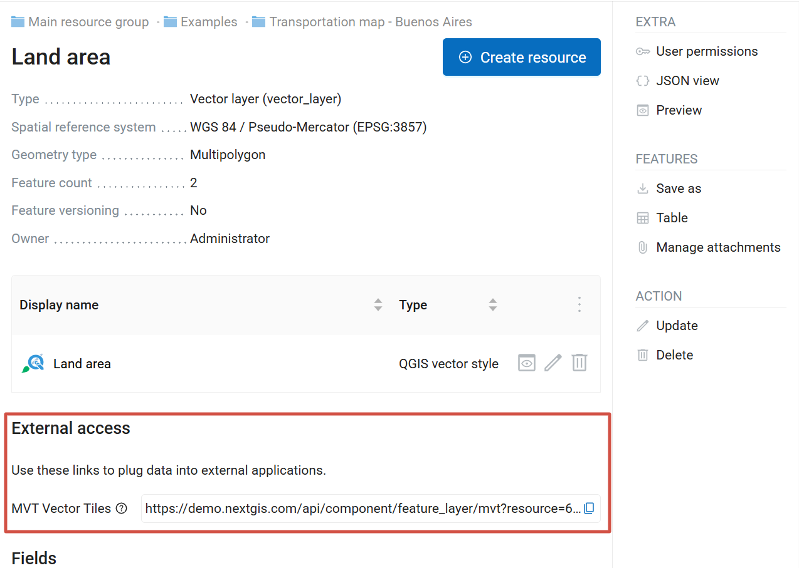

   MVT link on the resource page

.. _mvt_ngfrontend:

Using MVT with NextGIS Frontend Libraries
~~~~~~~~~~~~~~~~~~~~~~~~~~~~~~~~~~~~~~~~~~~~~~~~~~~

To connect a vector layer as MVT to your application all you need is the URL of your Web GIS and the resource ID. Our team has developed JavaScript libraries for this purpose.

All libraries are available for free download on `NextGIS Frontend <https://code.nextgis.com/>`_.

The service also provides examples of their use. Let’s take `one of these examples <https://code.nextgis.com/ngw-mapbox-examples-ngw-mvt-match-paint>`_ to display a vector layer.

Add the link to the Web GIS to the “baseURL” line (32) and the resource ID to the “resource” line (38).

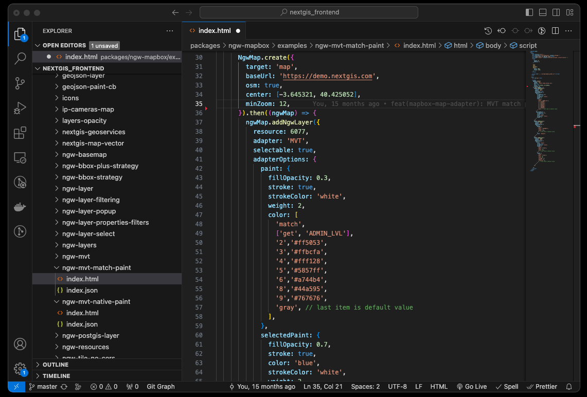

Open the HTML page in a web browser to see the map. You can configure additional map elements using NextGIS Frontend.

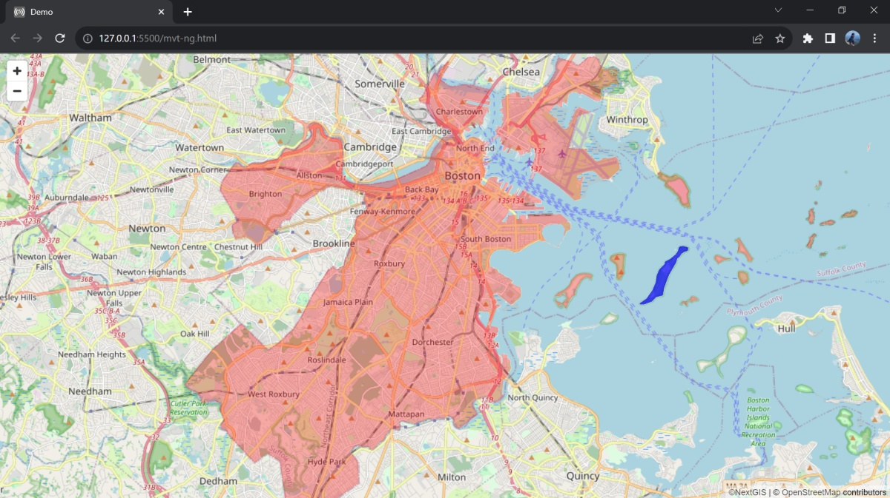

To display data from your Web GIS in external applications, you need to open `read access to the layer <https://docs.nextgis.com/docs_ngcom/source/permissions.html>`_ in the Web GIS settings.  Alternatively, you can specify Web GIS login credentials in the web application itself.

In the Web GIS settings, you need to `configure your CORS <https://docs.nextgis.com/docs_ngweb/source/cors.html>`_ (Cross-Origin Resource Sharing) settings.

.. _mvt_qgis:

Connecting MVT from NextGIS Web to QGIS
~~~~~~~~~~~~~~~~~~~~~~~~~~~~~~~~~~~~~~~~

You can use the link to vector tiles generated by NextGIS Web in QGIS to set up representation of a vector layer from your Web GIS in the desktop application. 

To connect the tiles, select Layer -> Add layer -> Add Vector Tile Layer in QGIS.

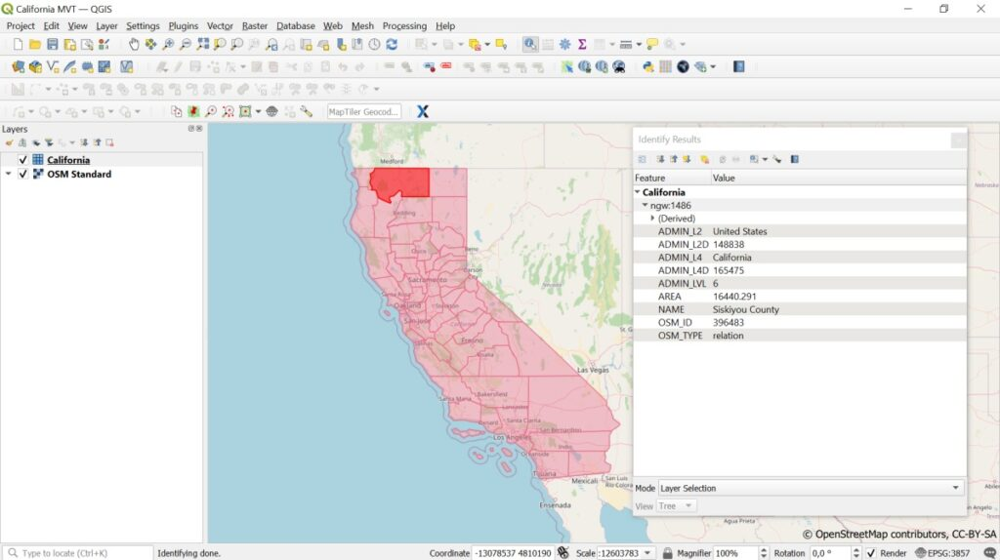

You can use the layer as a basemap, customize its style, identify objects and view attribute descriptions.  

.. _ngw_tms_service:

TMS service
------------

NextGIS Web is a TMS server. Layers and styles created in it can be accessed via any software supporting TMS protocol. You will need the URL for the TMS service.

TMS service is automatically created for the following resource types:

* Vector layer style
* Raster layer style
* WMS layer
* Web Map

You'll find this link in the External access section of the resource page.

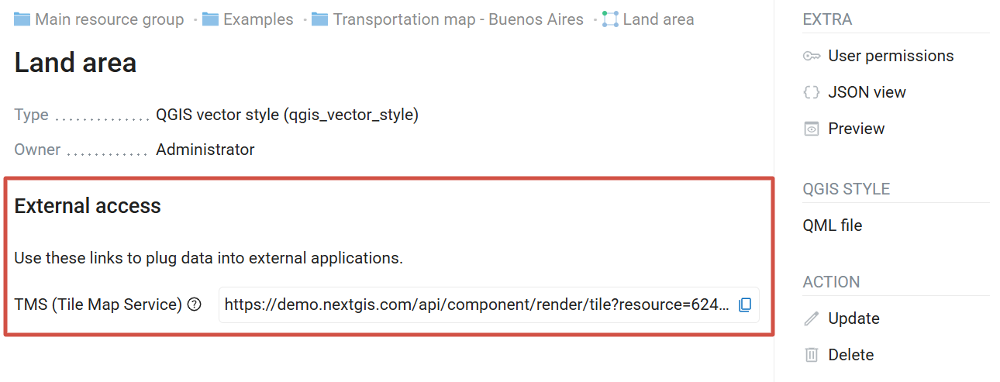

The link should look like this:

.. raw:: html

    
<strong>https://demo.nextgis.com/</strong>api/component/render/tile?z={z}&x={x}&y={y}&resource=<strong>6244</strong>

    

This link allows you to use any layer created in Web GIS `as a basemap <https://docs.nextgis.com/docs_ngweb/source/webmaps_admin.html#ngw-layer-as-basemap>`_.

To use TMS service through GDAL utilities you need to create an XML file. You will need the TMS link.Enter these parameters to ServerUrl string in example below. The rest remains unchanged.

.. code-block:: xml

   <GDAL_WMS>
    <Service name="TMS">
        <ServerUrl>https://demo.nextgis.com/api/component/render/tile?z={z}&x={x}&y={y}&resource=234
        </ServerUrl>
    </Service>
    <DataWindow>
        <UpperLeftX>-20037508.34</UpperLeftX>
        <UpperLeftY>20037508.34</UpperLeftY>
        <LowerRightX>20037508.34</LowerRightX>
        <LowerRightY>-20037508.34</LowerRightY>
        <TileLevel>18</TileLevel>
        <TileCountX>1</TileCountX>
        <TileCountY>1</TileCountY>
        <YOrigin>top</YOrigin>
    </DataWindow>
    <Projection>EPSG:3857</Projection>
    <BlockSizeX>256</BlockSizeX>
    <BlockSizeY>256</BlockSizeY>
    <BandsCount>4</BandsCount>
    <Cache />
   </GDAL_WMS>

.. _ngw_OGC_API_Features:

OGC API – Features service
--------------------------

Vector data uploaded to Web GIS can be published via OGC API Features protocol. This allows editing data with external applications.

The :term:`OGC API Features` service is configured in the same way as for a WFS service.
   
NextGIS Web acts as OGC API Features server and publishes OGC API Features services based on vector layers. Third party software can use these services to edit vector data on server.  Supported OGC API Features protocol versions is 1.0.0. 

To deploy a OGC API Features service press **Create resource** button and select **OGC API Features service** (see :numref:`admin_layers_create_ogc_api_features_service_en`).  

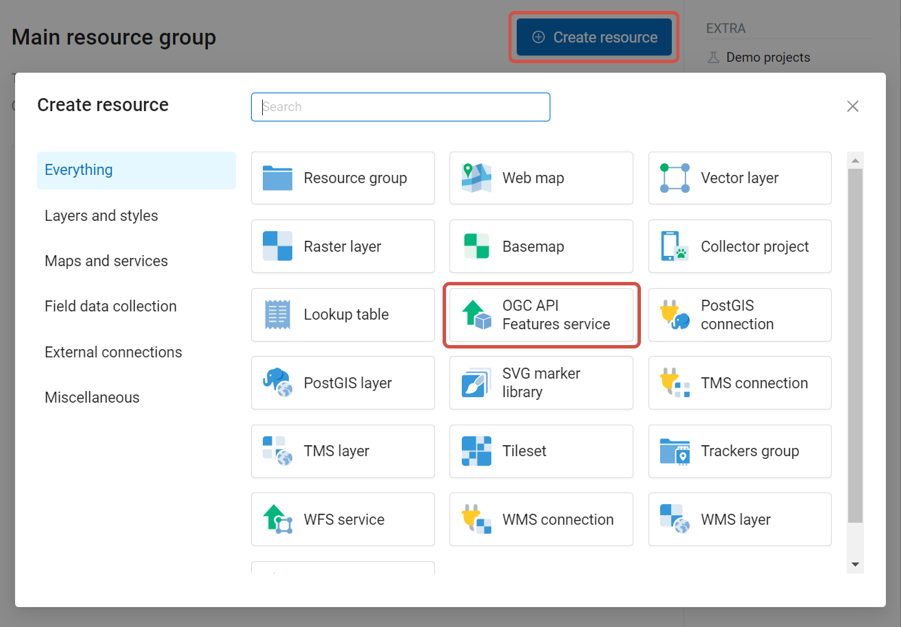

   Selecting "OGC API Features service" resource type
   
Enter the name of the resource that will be displayed in the administrator interface. 

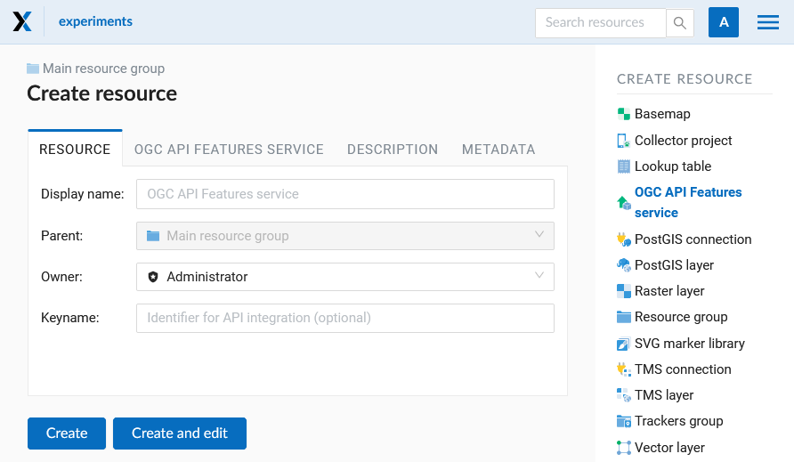

   Display name for OGC API Features service
   
   
Also you can add `Description and metadata <https://docs.nextgis.com/docs_ngweb/source/edit_resource.html#ngw-update-info-metada>`_.

Switch to "OGC API Features service" tab and add required layers to a list (see :numref:`ogc_api_features_service_settings`) For each layer you can set a limit for the number of features returned from the vector layer. By default, the value is 1000. 
 
If this parameter is set to empty, the limit will be disabled and all features will be returned to the client. This may result in high server load and significant timeouts in case of large data volume. 

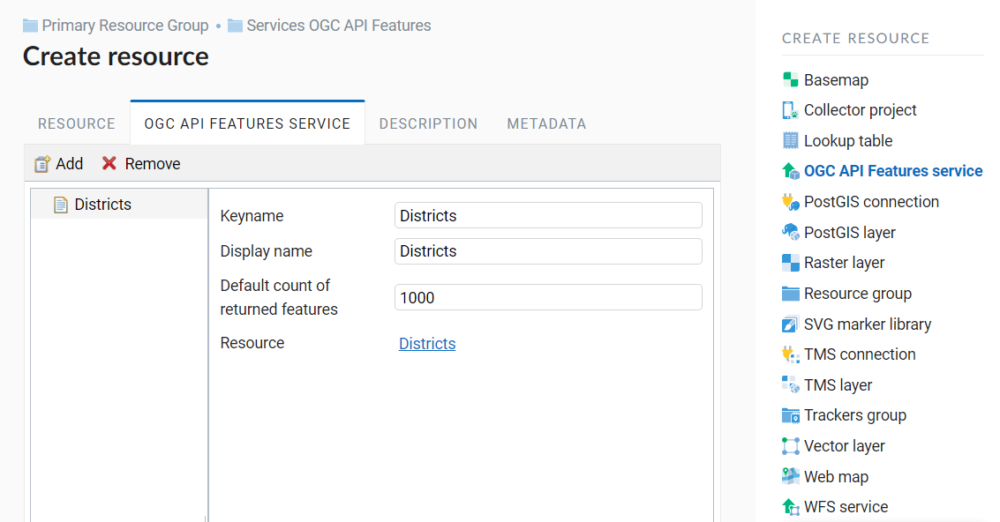

   OGC API Features service tab of Create resource dialog

.. _ngw_service_using_OGC_API_Features:

Using OGC API Features service
~~~~~~~~~~~~~~~~~~~~~~~~~~~~~~~~

After the resource is created, a URL for the OGC API Features service is available. You can use it in other software, for example :program:`QGIS`.  

You can `set access permissions for OGC API Features service <https://docs.nextgis.com/docs_ngcom/source/permissions.html#ngcom-permissions-auth-wms>`_ if needed.

OGC API Features services can also be accessed with links of the following type (`basic auth <https://docs.nextgis.com/docs_ngweb_dev/doc/developer/auth.html>`_ is supported):

.. sourcecode:: http

   https://yourwebgis.nextgis.com/api/resource/208/ogcf

.. _ngw_wfs_service:

WFS service
------------

WFS service works similarly to WMS layer, but you add layers instead of styles.
   
.. note::
    Currently supported filters are Intersects, ResourceId (ObjectId, FeatureId).

NextGIS Web acts as WFS server and publishes WFS services based on vector layers. Third party software can use these services to edit vector data on server.  
 Supported WFS protocol versions are 1.0, 1.1, 2.0, 2.0.2. 

To deploy a WFS service press **Create resource** button and select  **WFS service** (see :numref:`admin_layers_create_wfs_service`). 

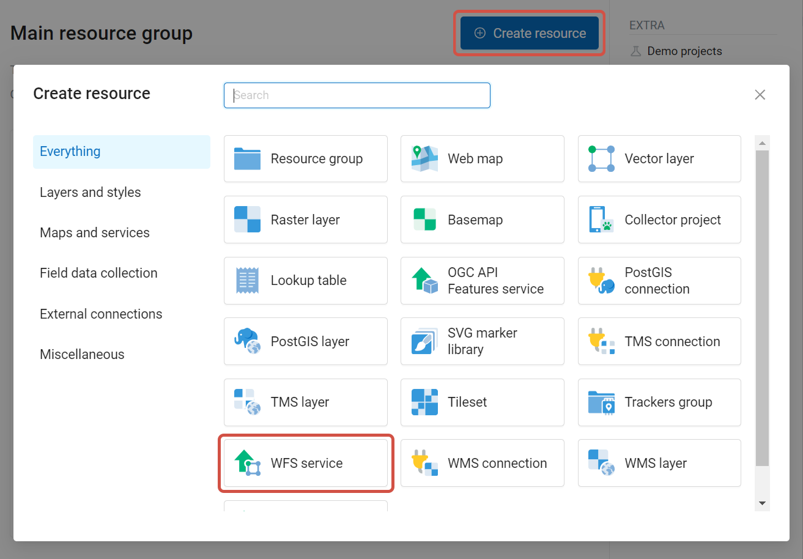

   Selecting "WFS service" resource type
   
Enter the name of the resource that will be displayed in the administrator interface.  

Also you can add `Description and metadata <https://docs.nextgis.com/docs_ngweb/source/edit_resource.html#ngw-update-info-metada>`_.

On the "WFS service" tab  add required layers to a list (see :numref:`ngweb_admin_layers_create_wfs_service_url`).  For each layer you can set a limit for the number of features returned from the vector layer. By default the value is 1000.
If this parameter is set to empty, the limit will be disabled and all features will be returned to the client. 
This may result in high server load and significant timeouts in case of large data volume.

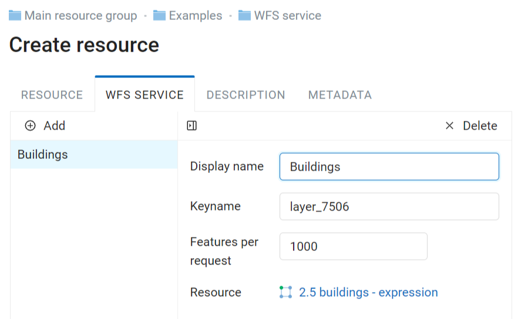

   WFS service tab of Create resource dialog

.. _ngw_service_using_wfs:

Using WFS service
~~~~~~~~~~~~~~~~~~~~

After the resource is created, a URL for the WFS service is available. You can use it in other software, for example :program:`NextGIS QGIS`. 
You can set access permissions for WFS service if needed. See `this section <https://docs.nextgis.com/docs_ngcom/source/permissions.html>`_ for details.
WFS allows to edit data in desktop apps. 

.. tip:: 
   If you use QGIS to edit your data stored in Web GIS, you can also access it directly via `NextGIS Connect <https://docs.nextgis.ru/docs_ngconnect/source/ngconnect.html>`_.

WFS services can also be accessed with links of the following type (`basic auth <https://docs.nextgis.com/docs_ngweb_dev/doc/developer/auth.html>`_ is supported):

.. sourcecode:: http

    https://mywebgis.nextgis.com/api/resource/2413/wfs?SERVICE=WFS&TYPENAME=ngw_id_2412&username=administrator&password=mypassword&srsname=EPSG:3857&VERSION=1.0.0&REQUEST=GetFeature

.. _ngw_wms_service:

WMS service
------------

NextGIS Web can be used as WMS server.  
This protocol is provides images with a requested extent.  

To deploy a WMS service you need to add a resource. Press **Create resource** button and select  **WMS service** (see :numref:`admin_layers_create_wms_service`).  

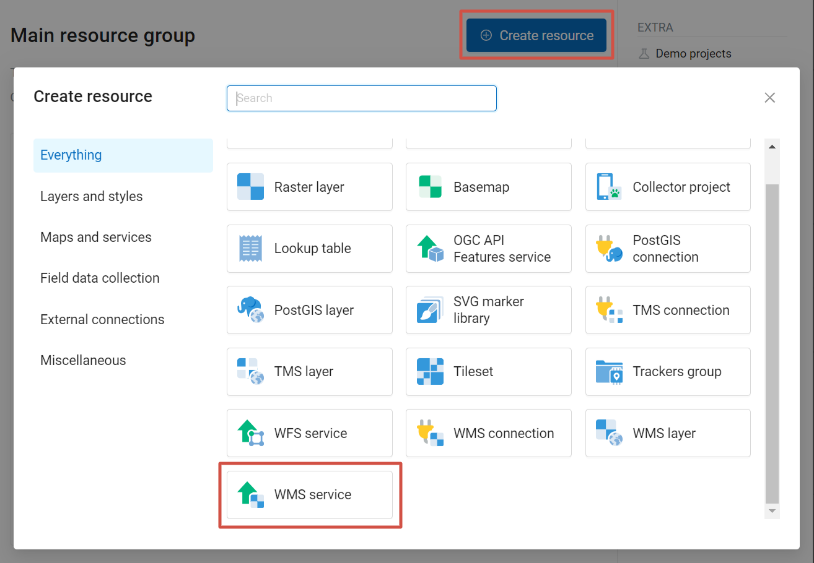

   Selecting "WMS service" resource type
   
   
Enter the name of the resource that will be displayed in the administrator interface.   

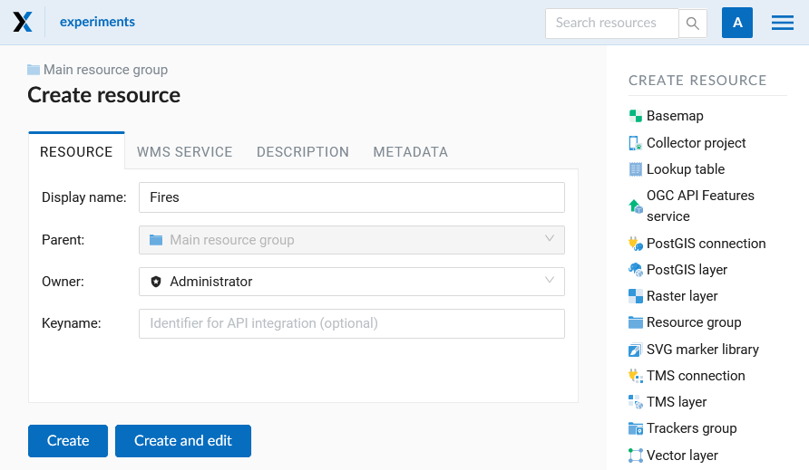
   
   Create resource dialog for WMS service

Also you can add `Description and metadata <https://docs.nextgis.com/docs_ngweb/source/edit_resource.html#ngw-update-info-metada>`_.   

Switch to "WMS service" tab and add links to required layers or layer styles.  You can also set the min and max scale for the data visualization.

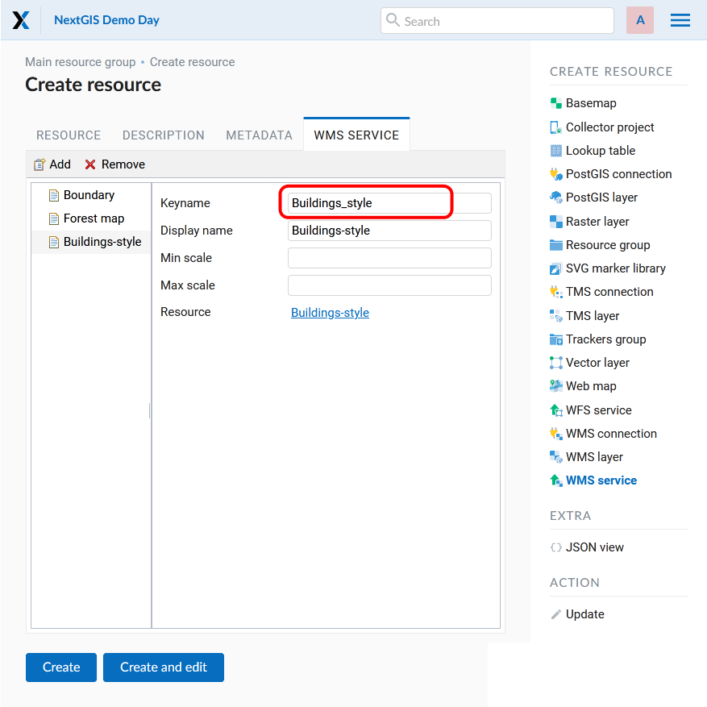

   WMS service tab of Create resource dialog

After the resource is created, you will see a message with the WMS service URL which you can use in other software, e.g. :program:`NextGIS QGIS` or :program:`JOSM`.   
  
Then you need to `set access permissions for the WMS service <https://docs.nextgis.com/docs_ngcom/source/permissions.html#ngcom-permissions-auth-wms>`_.

NextGIS Web layer can be added to desktop, mobile and Web GIS in different ways.

.. _ngw_service_using_wms:

Using WMS service
~~~~~~~~~~~~~~~~~~

NextGIS Web acts as a WMS server:  WMS services created in NextGIS Web can be added to any software that supports WMS protocol.   For that you need to know the WMS service URL. You can get it on the WMS service page. 

The link may look like this:

.. code-block:: html

   https://demo.nextgis.com/api/resource/4817/wms?

To use WMS service through GDAL utilities you need to create an XML file for the required layer. 
All it requires it the URL of the WMS service. 
Enter these parameters to the ServerUrl string in example below. The rest remains unchanged.

.. code-block:: xml

   <GDAL_WMS>
    <Service name="WMS">
        <Version>1.1.1</Version>
        <ServerUrl>https://demo.nextgis.com/api/resource/4817/wms?</ServerUrl>
        <SRS>EPSG:3857</SRS>
        <ImageFormat>image/png</ImageFormat>
        <Layers>moscow_boundary_multipolygon</Layers>
        <Styles></Styles>
    </Service>
    <DataWindow>
      <UpperLeftX>-20037508.34</UpperLeftX>
      <UpperLeftY>20037508.34</UpperLeftY>
      <LowerRightX>20037508.34</LowerRightX>
      <LowerRightY>-20037508.34</LowerRightY>
      <SizeY>40075016</SizeY>
      <SizeX>40075016.857</SizeX>
    </DataWindow>
    <Projection>EPSG:3857</Projection>
    <BandsCount>3</BandsCount>
   </GDAL_WMS>

If you need an image with transparency (alpha channel) set ``<BandsCount>4</BandsCount>``.

Here is an example of a GDAL command. The utility gets an image by WMS from NextGIS Web and saves it to a GeoTIFF format.

.. code:: bash

   $ gdal_translate -of "GTIFF" -outsize 1000 0  -projwin  4143247 7497160 \
   4190083 7468902   ngw.xml test.tiff
