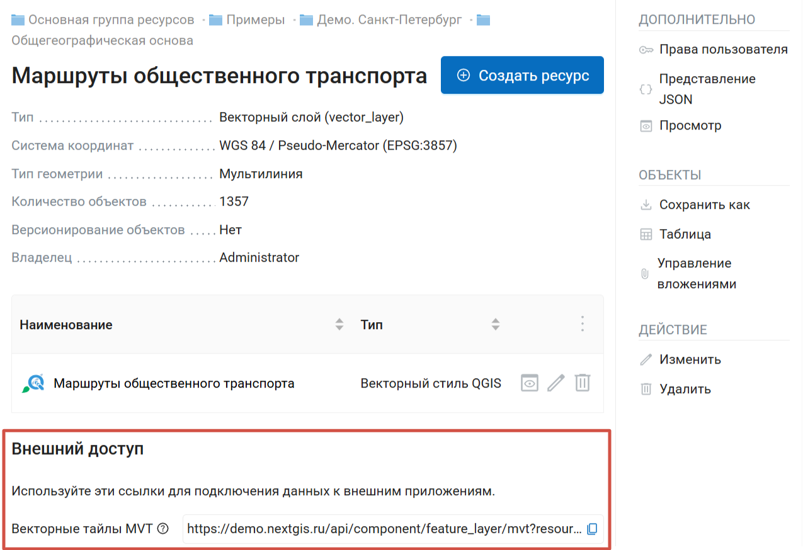
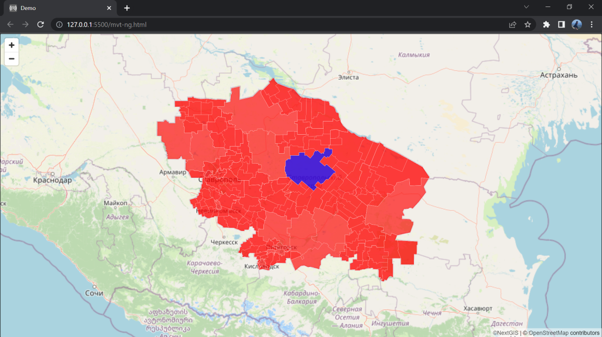
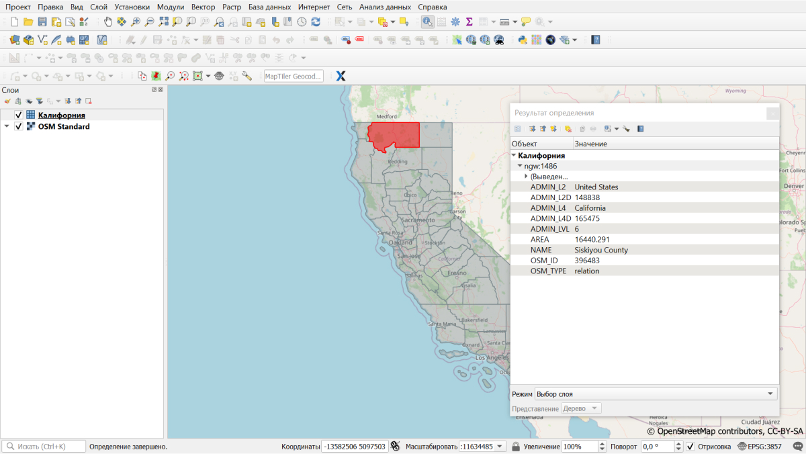
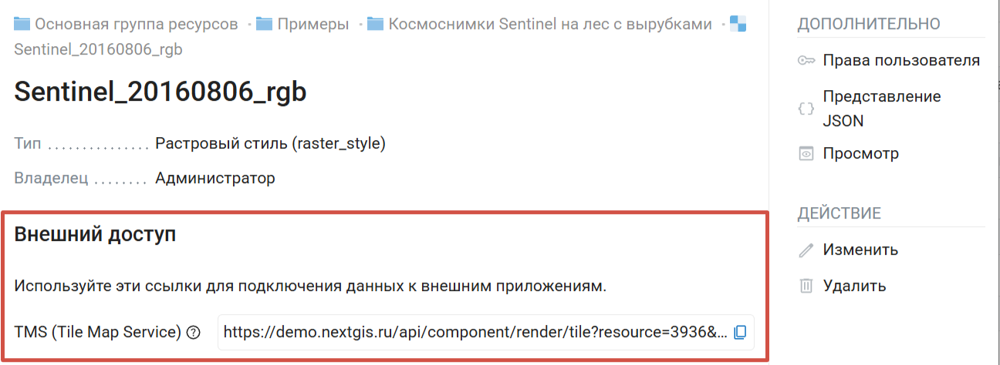

Подключить данные из Веб ГИС в сторонние приложения
===================================================

При создании ресурсов автоматически генерируются ссылки, по которым можно подключить данные в сторонние приложения:

* Для векторного слоя создаётся ссылка на `MVT тайлы <https://docs.nextgis.ru/docs_ngweb/source/services.html#ngw-mvt>`_;
* Для стиля векторного или растрового слоя, веб-карты и WMS-слоя создаётся ссылка на `TMS <https://docs.nextgis.ru/docs_ngweb/source/services.html#ngw-tms-service>`_;

Также можно создавать сервисы, которые обеспечивают доступ к данным по стандартным протоколам:

* `WFS <https://docs.nextgis.ru/docs_ngweb/source/services.html#ngw-wfs-service>`_
* `OGC API Features <https://docs.nextgis.ru/docs_ngweb/source/services.html#ngw-OGC-API-Features>`_
* `WMS <https://docs.nextgis.ru/docs_ngweb/source/services.html#ngw-wms-service>`_

.. _ngw_mvt:

Векторные тайлы MVT
-------------------

При `создании векторного слоя <https://docs.nextgis.ru/docs_ngweb/source/layers.html#ngw-create-vector-layer>`_ автоматически генерируется ссылка, с помощью которой загруженные данные можно подключить в формате :term:`MVT` (Map Vector Tiles, `спецификация <https://github.com/mapbox/vector-tile-spec>`_).

.. _mvt_advantage:

Преимущества формата MVT
~~~~~~~~~~~~~~~~~~~~~~~~~

Представление MVT позволяет хранить и передавать большие объёмы географических данных в компактном виде. Это делает его особенно полезным для веб-карт и мобильных приложений, где использование сетевых ресурсов и быстрый доступ к данным являются ключевыми.

Главные преимущества формата:

* Скорость отрисовки данных;
* Динамичные подписи и элементы карты;
* Широкие и гибкие возможности по настройке стилей данных (фильтры отображения по масштабу, временны́м или иным данным).

Каждый тайл является самодостаточным и содержит все необходимые данные для отображения конкретного уровня масштабирования (zoom level) определённого прямоугольного региона на карте. Данные организованы в слои, которые могут содержать разные типы геометрии и атрибуты.

MVT поддерживается различными библиотеками и инструментами для чтения, записи и отображения тайлов: 

* библиотеки Mapbox GL, OpenLayers, Leaflet, 
* инструменты для создания и обработки MVT-тайлов, такие как Tippecanoe и Mapbox Studio.

.. _mvt_link:

Формирование ссылки MVT
~~~~~~~~~~~~~~~~~~~~~~~~

При создании векторного слоя в NextGIS Web автоматически генерируется ссылка типа:

.. raw:: html

    
<strong>https://demo.nextgis.ru/</strong>api/component/feature_layer/mvt?resource=<strong>6503</strong>&amp;z={z}&amp;x={x}&amp;y={y}

     

Жирным выделены URL-адрес Веб ГИС и номер ресурса (векторного слоя). 

Такую ссылку можно использовать в сторонних веб-приложениях и конструкторах карт. Ссылка передаёт данные о слое, **стиль** для слоя настраивается на стороне клиента. 

Ссылка расположена на странице ресурса в разделе "Внешний доступ".

   Ссылка на векторные тайлы MVT на странице ресурса

.. _mvt_ngfrontend:

Подключение с помощью библиотеки NextGIS Frontend
~~~~~~~~~~~~~~~~~~~~~~~~~~~~~~~~~~~~~~~~~~~~~~~~~~~

Достаточно знать только URL-адрес вашей Веб ГИС и номер ресурса, чтобы подключить векторный слой в виде MVT в ваше приложение. Для этого используются разработанные нашей командой JS-библиотеки.

Все библиотеки доступны в открытом сервисе `NextGIS Frontend <https://code.nextgis.com/>`_.

Там же можно найти примеры использования библиотек. Возьмём `один из таких примеров <https://code.nextgis.com/ngw-mapbox-examples-ngw-mvt-match-paint>`_, чтобы отобразить наш векторный слой.

URL Веб ГИС и номер ресурса указываются в соответствующих строках.

.. figure:: _static/mvt_frontend_code_ru.png
   :name: mvt_frontend_code_pic
   :align: center
   :width: 20cm

При открытии HTML-страницы мы увидим карту. Настроить дополнительный функционал можно также с помощью NextGIS Frontend.

Чтобы данные из вашей Веб ГИС отображались во внешних приложениях, надо `открыть доступ к слою на чтение <https://docs.nextgis.ru/docs_ngcom/source/permissions.html>`_ в настройках в Веб ГИС. Либо можно указать данные для входа в Веб ГИС в само веб-приложение.

В настройках Веб ГИС нужно задать свои `настройки CORS <https://docs.nextgis.ru/docs_ngweb/source/cors.html>`_.

.. _mvt_qgis:

Подключение MVT из NextGIS Web в QGIS
~~~~~~~~~~~~~~~~~~~~~~~~~~~~~~~~~~~~~

Предоставляемую NextGIS Web ссылку на векторные тайлы можно добавить в QGIS. Таким образом вы сможете использовать представление векторного слоя из вашей Веб ГИС в настольном приложении.

Чтобы подключить тайлы, выберить в меню добавления слоя в QGIS «Добавить векторный тайловый слой».

Такой слой можно использовать как подложку, для него можно настраивать стиль. 

Работает идентификация объектов с описанием атрибутов.

.. _ngw_tms_service:

Сервис TMS
-------------

NextGIS Web является сервером TMS. Соответственно подключить созданные в нем слои/стили можно в любом клиентском ПО, поддерживающем протокол TMS. Для этого нужно знать URL сервиса TMS.

Сервис TMS автоматически создаётся для следующих типов ресурсов:

* Векторный стиль
* Растровый стиль
* Слой WMS
* Веб-карта

Ссылка располагается на странице ресурса в разделе "Внешний доступ":

Ссылка формируется следующим образом, пример:

.. raw:: html

    
<strong>https://demo.nextgis.ru/</strong>api/component/render/tile?z={z}&x={x}&y={y}&resource=<strong>234</strong>

    

Благодаря такой ссылке любой слой (стиль), созданный в Веб ГИС, можно `подключать как подложку (базовую карту) <https://docs.nextgis.ru/docs_ngweb/source/webmaps_admin.html#ngw-layer-as-basemap>`_.

Для использования TMS через утилиты GDAL нужно создать для него файл XML и подставить эту ссылку в строку ``ServerUrl`` примера ниже. Всё остальное остаётся неизменным.

.. code-block:: xml

   <GDAL_WMS>
    <Service name="TMS">
        <ServerUrl>https://demo.nextgis.ru/api/component/render/tile?z={z}&x={x}&y={y}&resource=234</ServerUrl>
    </Service>
    <DataWindow>
        <UpperLeftX>-20037508.34</UpperLeftX>
        <UpperLeftY>20037508.34</UpperLeftY>
        <LowerRightX>20037508.34</LowerRightX>
        <LowerRightY>-20037508.34</LowerRightY>
        <TileLevel>18</TileLevel>
        <TileCountX>1</TileCountX>
        <TileCountY>1</TileCountY>
        <YOrigin>top</YOrigin>
    </DataWindow>
    <Projection>EPSG:3857</Projection>
    <BlockSizeX>256</BlockSizeX>
    <BlockSizeY>256</BlockSizeY>
    <BandsCount>4</BandsCount>
    <Cache />
   </GDAL_WMS> 

.. _ngw_OGC_API_Features:

Сервис OGC API Features
-----------------------

Загруженные в Веб ГИС векторные данные можно опубликовать с помощью протокола OGC API Features. Это позволяет редактировать их через сторонние приложения.

Создание сервиса OGC API Features
~~~~~~~~~~~~~~~~~~~~~~~~~~~~~~~~~~

Настройка сервиса :term:`OGC API Features` осуществляется так же, как для WFS-сервиса.
   
NextGIS Web является сервером OGC API Features - может публиковать сервисы OGC API Features на базе векторных слоёв. Используя эти сервисы, сторонние программы могут изменять векторные данные на сервере. Поддерживаемые версии протокола OGC API Features: 1.0.0.

Для развёртывания сервиса OGC API Features нажмите кнопку **Создать ресурс** и выберите во всплывающем окне тип ресурса **Сервис OGC API Features**. (:numref:`admin_layers_create_ogc_api_features_service_rus`). 

.. figure:: _static/ngweb_create_service_OGC_ru.png
   :name: admin_layers_create_ogc_api_features_service_rus
   :align: center
   :width: 20cm

   Выбор действия "Сервис OGC API Features"
   
На вкладке **Ресурс** указывается наименование сервиса (:numref:`admin_layers_create_ogc_api_features_service_name_rus`). Поле "Ключ" предназначено для разработчиков, заполенять его не обязательно.

.. figure:: _static/admin_layers_create_ogc_api_features_service_name_rus_2.png
   :name: admin_layers_create_ogc_api_features_service_name_rus
   :align: center
   :width: 20cm

   Наименование Сервиса OGC API Features
   
   
На вкладке "Описание" можно добавить произвольный текст, описывающий текущий ресурс (:numref:`admin_layers_create_ogc_api_features_service_description_rus`)

.. figure:: _static/admin_layers_create_ogc_api_features_service_description_rus_2.png
   :name: admin_layers_create_ogc_api_features_service_description_rus
   :align: center
   :width: 20cm

   Описание Сервиса OGC API Features
   
В "Метаданные" ресурса можно записать информацию в формате "ключ-значение" (:numref:`admin_layers_create_ogc_api_features_service_metadata_rus`).
Как правило, метаданные используются для разработки сторонних приложений с помощью `API <https://docs.nextgis.ru/docs_ngweb_dev/doc/developer/toc.html>`_.

.. figure:: _static/admin_layers_create_ogc_api_features_service_metadata_rus_2.png
   :name: admin_layers_create_ogc_api_features_service_metadata_rus
   :align: center
   :width: 20cm

   Метаданные Сервиса OGC API Features

Вкладка "Сервис OGC API Features" отвечает за слои, включаемые в сервис (:numref:`admin_layers_create_ogc_api_features_service_settings_rus`). Для каждого 
добавленного слоя нужно указать число возвращаемых из базы объектов. По умолчанию это значение равно 1000.
Если в этом поле значение убрать совсем, то ограничение будет снято и будут передаваться все объекты. Однако это может привести 
к значительной нагрузке на сервер и значительным задержкам при передаче больших объемов данных.

.. figure:: _static/admin_layers_create_ogc_api_features_service_settings_rus.png
   :name: admin_layers_create_ogc_api_features_service_settings_rus
   :align: center
   :width: 20cm

   Окно параметров сервиса OGC API Features

.. _ngw_service_using_OGC_API_Features:

Использование сервиса OGC API Features
~~~~~~~~~~~~~~~~~~~~~~~~~~~~~~~~~~~~~~~~

После создания ресурса вам будет доступен URL сервиса OGC API Features, который вы можете использовать в других программах, например :program:`QGIS`. 

Если это необходимо, можно `настроить права доступа к сервису OGC API Features <https://docs.nextgis.ru/docs_ngcom/source/permissions.html#ngcom-permissions-cases>`_.

Программно подключаться к созданным сервисам OGC API Features можно по ссылкам следующего вида (также `поддерживается <https://docs.nextgis.ru/docs_ngweb_dev/doc/developer/auth.html>`_ basic auth):

.. sourcecode:: http

   https://yourwebgis.nextgis.com/api/resource/208/ogcf

.. _ngw_wfs_service:

Cервис WFS
----------

.. _ngw_create_service_wfs:

Создание сервиса WFS
~~~~~~~~~~~~~~~~~~~~~~

Настройка сервиса WFS осуществляется так же, как для WMS-сервиса, только добавляется не стиль, а слой.
   
.. note::
    На данный момент поддерживаются фильтры Intersects, ResourceId (ObjectId, FeatureId).

NextGIS Web является сервером WFS - может публиковать сервисы WFS на базе векторных слоёв. Используя эти сервисы, сторонние программы 
могут изменять векторные данные на сервере. Поддерживаемые версии протокола WFS: 1.0, 1.1, 2.0, 2.0.2.

Нажмите кнопку **Создать ресурс** и выберите во всплывающем окне тип ресурса **Сервис WFS** (:numref:`admin_layers_create_wfs_service`). 

.. figure:: _static/ngweb_create_wfs_service_ru.png
   :name: admin_layers_create_wfs_service
   :align: center
   :width: 20cm

   Выбор типа ресурса "Сервис WFS"
   
На вкладке **Ресурс** указывается наименование сервиса (:numref:`ngweb_admin_layers_create_wfs_service_name`). Поле "Ключ" предназначено для разработчиков, заполенять его не обязательно.

.. figure:: _static/admin_layers_create_wfs_service_name_rus_3.png
   :name: ngweb_admin_layers_create_wfs_service_name
   :align: center
   :width: 20cm

   Наименование Сервиса WFS
   
   
На вкладке "Описание" можно добавить произвольный текст, описывающий текущий ресурс (:numref:`ngweb_admin_layers_create_wfs_description`)

.. figure:: _static/admin_layers_create_wfs_description_rus_2.png
   :name: ngweb_admin_layers_create_wfs_description
   :align: center
   :width: 20cm

   Описание Сервиса WFS
   
В "Метаданные" ресурса можно записать информацию в формате "ключ-значение" (:numref:`admin_layers_create_wfs_metadata`).
Как правило, метаданные используются для разработки сторонних приложений с помощью `API <https://docs.nextgis.ru/docs_ngweb_dev/doc/developer/toc.html>`_.

.. figure:: _static/admin_layers_create_wfs_metadata_rus_2.png
   :name: admin_layers_create_wfs_metadata
   :align: center
   :width: 20cm

   Метаданные Сервиса WFS

Вкладка "Сервис WFS" отвечает за слои, включаемые в сервис (:numref:`ngweb_admin_layers_create_wfs_service_settings`). 
Для каждого добавленного слоя нужно указать число возвращаемых из базы объектов. По умолчанию это значение равно 1000.
Если в этом поле значение убрать совсем, то ограничение будет снято и будут передаваться все объекты. 
Однако это может привести к значительной нагрузке на сервер и значительным задержкам при передаче больших объемов данных.

.. figure:: _static/create_wfs_service_settings_ru.png
   :name: ngweb_admin_layers_create_wfs_service_settings
   :align: center
   :width: 16cm

   Окно параметров сервиса WFS

.. _ngw_service_using_wfs:

Использование сервиса WFS
~~~~~~~~~~~~~~~~~~~~~~~~~~

После создания ресурса вам будет доступен URL сервиса WFS, который вы можете использовать в других программах, например :program:`NextGIS QGIS`. 
Для этого нужно `настроить права доступа <https://docs.nextgis.ru/docs_ngcom/source/permissions.html#ngcom-permissions-auth-wms>`_ к сервису WFS.
Подключение при помощи WFS позволяет редактировать данные на сервере из настольного приложения. 

.. tip:: 
   :collapsible: closed
   
   Если вы работаете в QGIS, редактировать данные Веб ГИС можно также помощи модуля `NextGIS Connect <https://docs.nextgis.ru/docs_ngconnect/source/ngconnect.html>`_.

Программно подключаться к созданным сервисам WFS можно по ссылкам следующего вида (также `поддерживается <https://docs.nextgis.ru/docs_ngweb_dev/doc/developer/auth.html>`_ basic auth):

.. sourcecode:: http

   https://mywebgis.nextgis.com/api/resource/2413/wfs?SERVICE=WFS&TYPENAME=ngw_id_2412&username=administrator&password=mypassword&srsname=EPSG:3857&VERSION=1.0.0&REQUEST=GetFeature

.. _ngw_wms_service:

Сервис WMS
----------

.. _ngw_create_service_wms:

Создание WMS-сервиса
~~~~~~~~~~~~~~~~~~~~

Программное обеспечение NextGIS Web может работать как сервер WMS. По этому протоколу 
клиенты запрашивают картинку карты по заданному охвату. 

Для развёртывания WMS-сервиса необходимо добавить ресурс. Нажмите кнопку **Создать ресурс** и выберите во всплывающем окне тип ресурса **Сервис WMS** (см. :numref:`admin_layers_create_wms_service`). 

.. figure:: _static/ngweb_create_wms_service_ru.png
   :name: admin_layers_create_wms_service
   :align: center
   :width: 20cm

   Выбор типа ресурса "Сервис WMS"
   
   
На вкладке "Ресурс" указывается наименование сервиса WMS (:numref:`admin_layers_create_wms_service_name_rus`). Оно будет отображаться в административном интерфейсе. Поле Ключ является необязательным к заполнению.

.. figure:: _static/admin_layers_create_wms_service_name_rus_2.png
   :name: admin_layers_create_wms_service_name_rus
   :align: center
   :width: 20cm
   
   Наименование сервиса WMS

На вкладке "Описание" можно добавить произвольный текст, описывающий текущий ресурс (:numref:`admin_layers_create_wms_description`)

.. figure:: _static/admin_layers_create_wms_description_rus_2.png
   :name: admin_layers_create_wms_description
   :align: center
   :width: 20cm

   Описание Сервиса WMS
   
В "Метаданные" ресурса можно записать информацию в формате "ключ-значение" (:numref:`admin_layers_create_wms_metadata`).
Как правило, метаданные используются для разработки сторонних приложений с помощью `API <https://docs.nextgis.ru/docs_ngweb_dev/doc/developer/toc.html>`_.

.. figure:: _static/admin_layers_create_wms_metadata_rus_2.png
   :name: admin_layers_create_wms_metadata
   :align: center
   :width: 20cm

   Метаданные Сервиса WMS
   

На вкладке "Сервис WMS" необходимо добавить ссылки на нужные слои или стили. (:numref:`ngweb_admin_layers_create_wms_service_url`). Также можно указать диапазон масштабных уровней отображения данных.

.. figure:: _static/admin_layers_create_wms_service_url_rus.png
   :name: ngweb_admin_layers_create_wms_service_url
   :align: center
   :width: 20cm

   Окно параметров соединения WMS

После создания ресурса выведется сообщение с URL WMS-сервиса, который можно 
использовать в других программах, например :program:`NextGIS QGIS`, или :program:`JOSM`. 
Далее необходимо `настроить права доступа к WMS-сервису <https://docs.nextgis.ru/docs_ngcom/source/permissions.html#ngcom-permissions-cases>`_ для стороннего использования различными пользователями.

Cлой NextGIS Web можно добавлять в настольные, мобильные и Веб ГИС различными способами.

.. _ngw_service_using_wms:

Использование сервиса WMS
~~~~~~~~~~~~~~~~~~~~~~~~~~~~

NextGIS Web является сервером WMS. Соответственно подключить созданные в нем сервисы WMS можно в любом клиентском ПО, поддерживающем протокол WMS. Для этого нужно знать URL WMS-сервиса, который высвечивается на странице настроек конкретного сервиса.

Например:

.. code-block:: html

   https://demo.nextgis.ru/api/resource/4817/wms

Для использования сервиса через утилиты GDAL нужно создать для него файл XML. 
Для создания такого файла нужно знать URL сервиса WMS. 
Эти параметры нужно подставить в строку ServerUrl примера ниже. Все остальное остается неизменным.

.. code-block:: xml

   <GDAL_WMS>
    <Service name="WMS">
        <Version>1.1.1</Version>
        <ServerUrl>https://demo.nextgis.ru/api/resource/4817/wms</ServerUrl>
        <SRS>EPSG:3857</SRS>
        <ImageFormat>image/png</ImageFormat>
        <Layers>moscow_boundary_multipolygon</Layers>
        <Styles></Styles>
    </Service>
    <DataWindow>
      <UpperLeftX>-20037508.34</UpperLeftX>
      <UpperLeftY>20037508.34</UpperLeftY>
      <LowerRightX>20037508.34</LowerRightX>
      <LowerRightY>-20037508.34</LowerRightY>
      <SizeY>40075016</SizeY>
      <SizeX>40075016.857</SizeX>
    </DataWindow>
    <Projection>EPSG:3857</Projection>
    <BandsCount>3</BandsCount>
   </GDAL_WMS>

Если нужна картинка с альфа каналом, следует указать ``<BandsCount>4</BandsCount>``.

Пример вызова утилиты GDAL. Она получает картинку из NextGIS WEB по WMS и сохраняет её в GeoTIFF.

.. code-block:: shell

   gdal_translate -of "GTIFF" -outsize 1000 0  -projwin  4143247 7497160 4190083 7468902   ngw.xml test.tiff
