Trackers settings
=======================

In the Trackers section of the Control panel you can configure the display of the tracks on Web Maps and their export as GPX files.

Here are the parameters that can be modified:

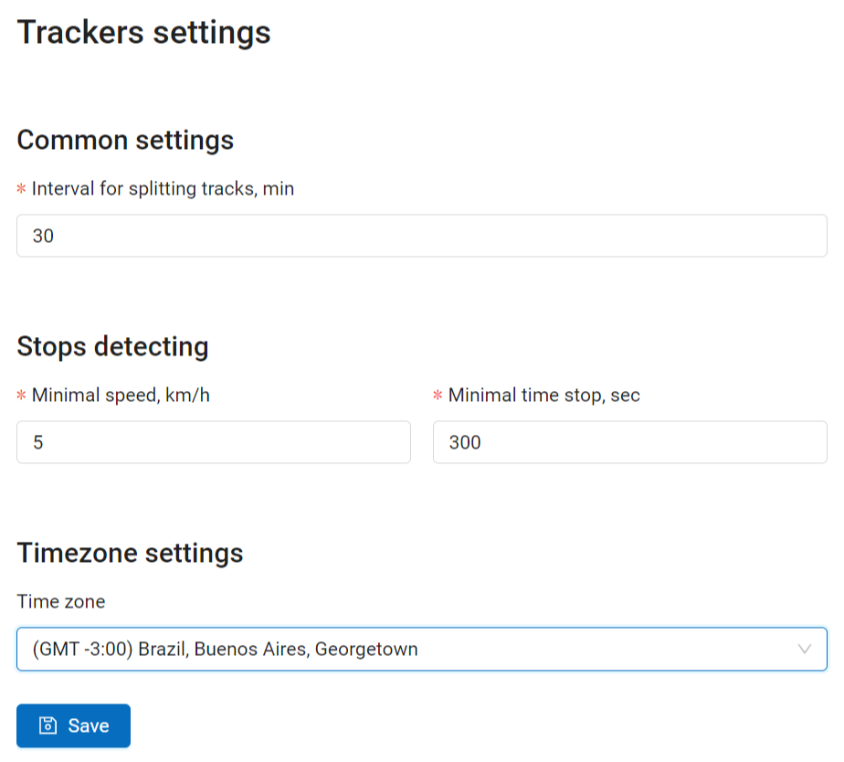

   Trackers settings

* Interval for splitting tracks, min (default value is 30)
* Parameters for detecting stops: if the speed is lower than a set amount for a set time, a stop is recorded in the track. Minimal speed is in km/h (the default value is 5). Minimal time to mark a stop, in seconds (the default value is 300 sec., i.e. 5 min.).
* Timezone settings - select a time zone marked as GMT+-N from a dropdown menu

.. note::
    The number of trackers available depends on your `subscription plan <https://nextgis.com/pricing-base/>`_. On Free and Mini you can add 1 tracker, on Premium the default limit is 5 trackers, but it can be extended.

.. seealso::
   `Tutorial: Track Asset and Team Locations in Real Time <https://docs.nextgis.com/docs_howto/source/tutorial_track.html>`_

.. _ngw_tracking_web_map:

Viewing tracks on a Web Map
--------------------------------

Data on moving objects collected in NextGIS Tracker, NextGIS Collector or NextGIS Mobile can be displayed on any Web Map of your Web GIS if the tracker is linked to it. 

To view the tracks open any Web Map or create a new one. On the left panel bar you'll find the tracker icon |panel_trackers|.

.. |panel_trackers| image:: _static/panel_trackers.png
   :width: 6mm

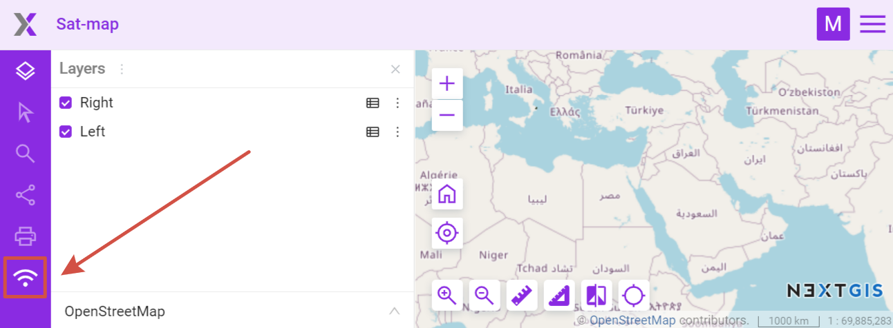

   Opening Trackers panel

Tracker panel has two parts: calendar and tracker list. 

Use the calendar to filter tracks by date and time.

Below you'll see the list of all available trackers. Trackers can be sorted by name or time of the recording.

By default the tracks are hidden. To view a track on the Web Map, find the tracker(s) in the list and select track elements you'd like to display. Then set a date range in the calendar or in the track's context menu select **Set filter to last day with data**.

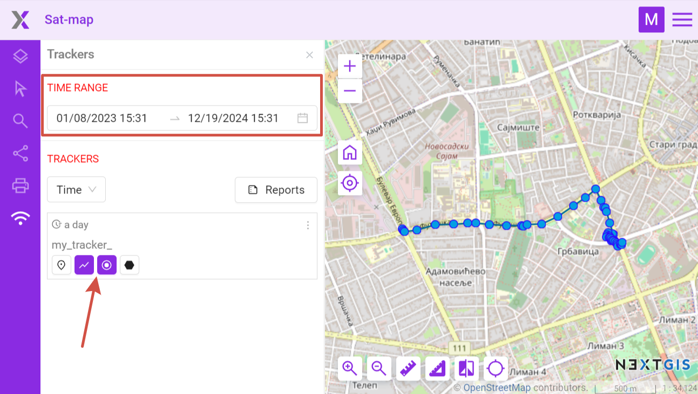

   Viewing track on Web Map

Elements you can view: 

* |button_tracker_lastpoint| last point of the track
* |button_tracker_line| the route lines of the GPS-tracks
* |button_tracker_points| points where coordinates were picked
* |button_tracker_stops| stops (not all tracks have them)

.. |button_tracker_lastpoint| image:: _static/button_tracker_lastpoint.png
   :width: 6mm

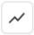

Three dots in the top right corner of the track open its context menu that allows to:

- Zoom to layer;
- Set filter to last day with data;
- Show last activity (hourly chart for a selected date).

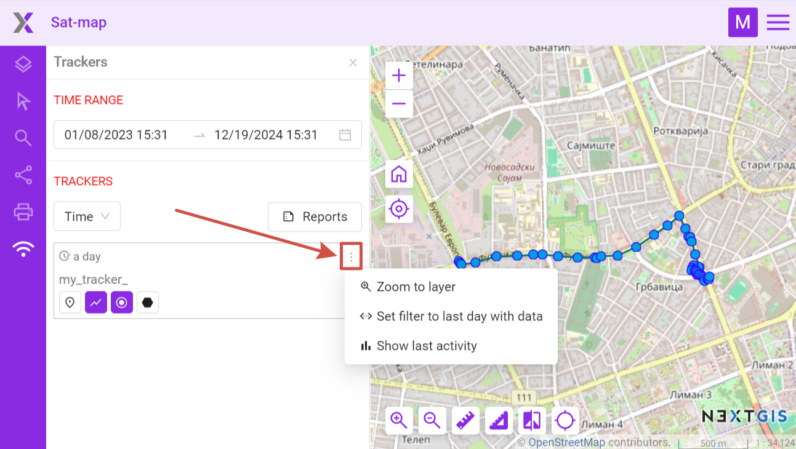

   Tracker menu

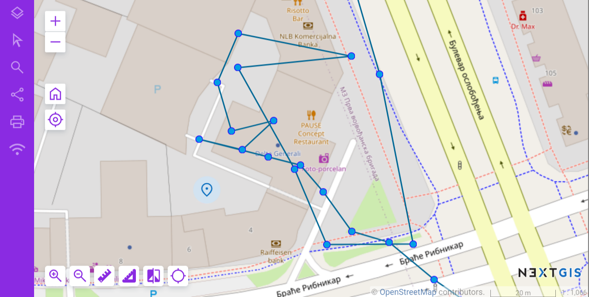
   
   Viewing a GPS track, track points and current location on a Web Map

Click on a point to show a popup with tracking information: date, time, speed (km/h), height (m), course (bearing i.e. the horizontal direction of travel of this device in the range between 0 and 360 counting clockwise from the North), number of satellites and HDOP. 

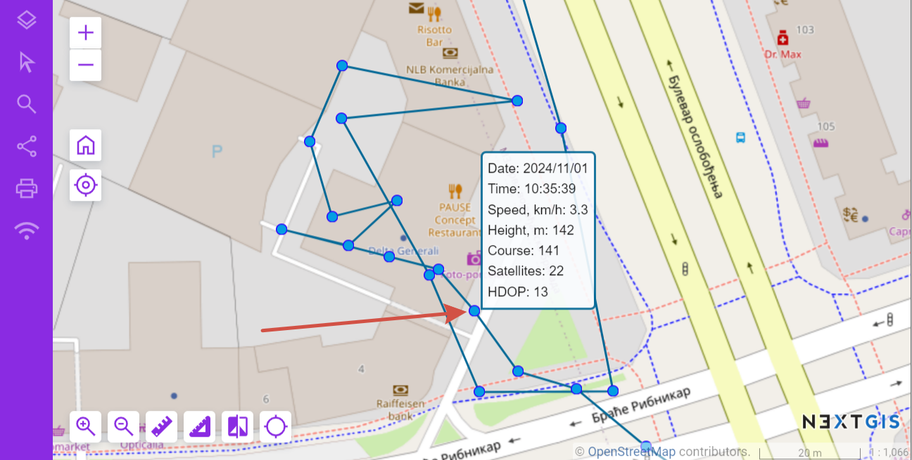

   Pop-up window with track point info

Horizontal dilution of precision or HDOP is a parameter showing how precise the GPS readings are.  The smaller the HDOP value, the higher the accuracy of horizontal coordinates. HDOP=1 is ideal, 3-4 is okay, if HDOP is over 6-8 it means that the position of satellites at the moment is unfortunate providing information with low accuracy. HDOP depends on the number of visible satellites, their position in the sky and relative to the receiver.

.. _tracking_report:

Reports
--------

By clicking the ‘Reports’ button you can create various types of reports depending on selected tracker and parameters. 

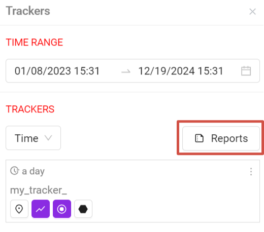
   
   Button opening the reports page

A separate page for creating tracking reports opens. 

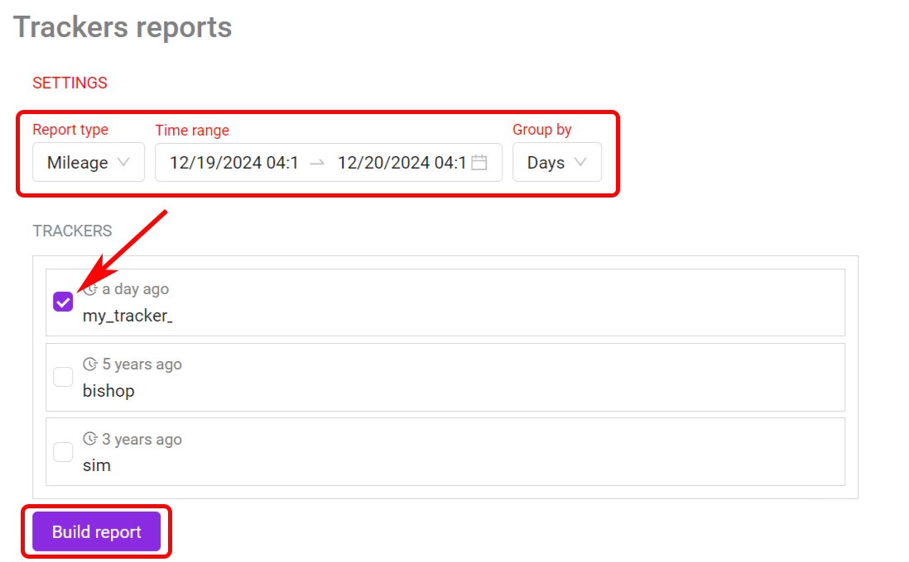
   
   Report settings

In the first block, you need to select the trackers for which you want to get an information summary.

- report type (mileage, top speed, average speed, spent fuel, stops, `GPX-file <https://docs.nextgis.com/docs_ngweb/source/trackers.html#track-export>`_);
- time range;
- grouping by days/hours.

Next select the trackers that you want to get information about and press The report will appear on the same page below.

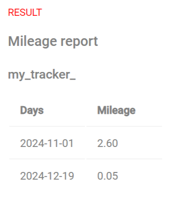

   Tracker report

.. note::
    For getting the spent fuel report you need to set up `fuel consumption <https://docs.nextgis.com/docs_ngcom/source/tracking.html#tracker-settings>`_ parameter in NextGIS Web settings (l/100 km)

.. _track_export:

Export to GPX
----------------

You can use the `report page <https://docs.nextgis.com/docs_ngweb/source/trackers.html#tracker-report-icon-pic>`_ to export track with the selected parameters as a GPX file.

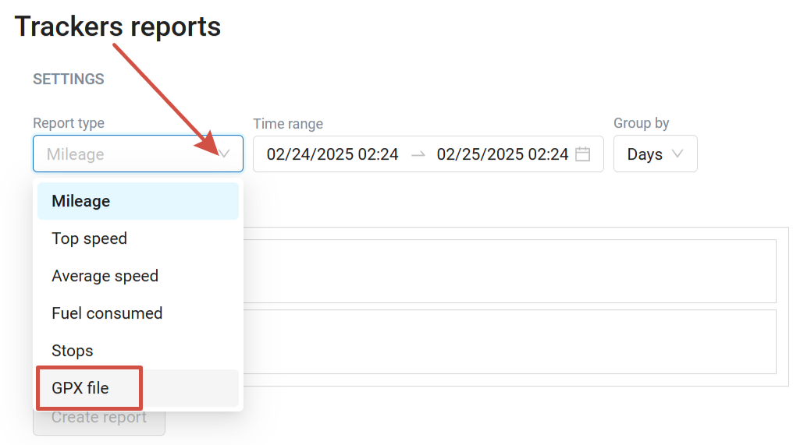

   Export as GPX
